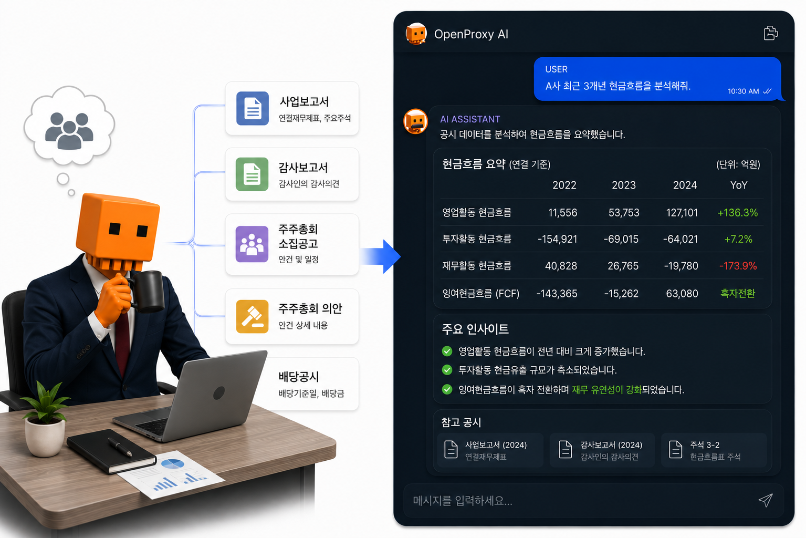
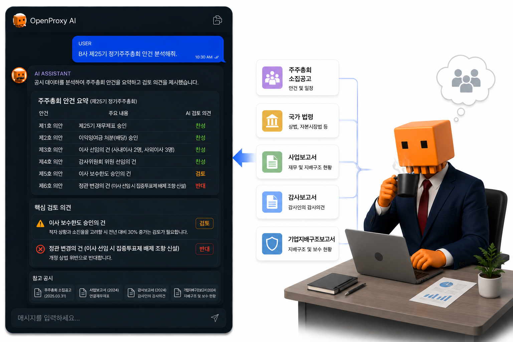

# OpenProxy MCP

[](https://polyformproject.org/licenses/noncommercial/1.0.0/)
[](https://www.python.org/downloads/)
[](https://modelcontextprotocol.io/)
[](#tool-구조-24개)
[](docs/RELEASE_NOTES.md)

[English README](README_ENG.md)

## Why OpenProxy?

**주총 안건에 제대로 투표하려면, 그 회사의 모든 것을 알아야 합니다.**

OpenProxy는 주주총회 의결권 분석을 위해 태어났습니다. 그런데 안건 하나를 판단하려면 재무제표, 지분 구조, 배당 이력, 이사회, 법령까지 전부 필요했습니다. 그걸 다 만들다 보니 — **DART 공시분석 범용 엔진**이 됐습니다. 재무 분석부터 의결권 판단까지, AI에게 물어보면 몇 초 안에 공시 근거와 함께 답합니다.


*사업보고서·감사보고서 등 공시를 근거로 재무를 분석합니다 — OpenProxy를 연결한 AI 대화 예시*


*그리고 이것이 원점 — 소집공고·법령·지배구조보고서를 묶어 안건별 의견과 근거를 제시합니다*

## 주요 기능

각 기능을 클릭하면 상세 설명 페이지로 이동합니다.

- **[주총 의결권 보조](docs/features/proxy-voting.md)**: 소집공고 안건을 구조화하고 안건별 FOR/AGAINST/REVIEW 권고와 근거를 제시합니다.
- **[재무지표](docs/features/financials.md)**: 수익성·안정성·현금흐름 + 듀퐁 분해·감사의견 추이. 분기는 누적(YTD)·당기(3개월) 두 기준으로 QoQ·YoY 제공.
- **[밸류에이션](docs/features/valuation.md)**: PER·PBR·배당수익률(기업 심층) + 시장·산업·종목 히스토리. `scope="explain"`으로 계산 과정·출처까지 답합니다.
- **사업의 내용**: 사업부문별 매출·이익, 생산설비·가동률, 연구개발, 수주잔고, 주요 고객 — "II. 사업의 내용"을 통째로 읽어줍니다 ([`business_details`](wiki/tools/business_details.md)).
- **잠정실적 속보**: 분기 영업(잠정)실적 공시를 표·증감률로 정리합니다 ([`provisional_earnings`](wiki/tools/provisional_earnings.md)).
- **[주주환원](docs/features/shareholder-return.md)**: 배당·자사주 소각 사이클·밸류업 계획 — 약속과 실제 집행을 비교합니다.
- **[지분·지배구조 맵](docs/features/ownership.md)**: 최대주주·특수관계인·5% 대량보유·자사주로 소유 구조를 그립니다.
- **[주총 안건 구조화](docs/features/meeting-agenda.md)**: 소집공고 안건·후보·보수한도·정관변경과 주총 후 의결 결과·찬반율.
- **[경영권 분쟁 시그널](docs/features/control-contest.md)**: 위임장·공개매수·소송·5% 경영참여 신호를 모아 정황을 나열합니다 (자동 판정 X).
- **[기업 리스크 이벤트](docs/features/risk-events.md)**: 중대재해·횡령배임·생산중단 추적. 회사 미지정 시 시장 전체 스캔.
- **[전체시장 공시 디제스트](wiki/tools/screener.md)**: 수주·자사주·배당·증자·주총·5%지분·잠정실적 공시를 한 번에 훑어 카드형으로 요약 — 매일 아침 공시 알람 루틴 ([레시피](docs/routines/screener-morning-digest.md)).

그 외 출처 추적, 기업지배구조보고서, 희석 이벤트(증자/CB), 구조개편(합병/분할), 지분 인수·매각, 정관↔법령 양방향 조회 등 **총 24개 tool**을 제공합니다.

---

## 빠른 시작

OpenProxy MCP는 Claude, ChatGPT, Perplexity 같은 AI 서비스에 **연결해서 쓰는 도구**입니다. 설치는 필요 없습니다.

### 1단계: DART API 키 발급 (필수·무료)

모든 데이터는 DART OpenAPI에서 가져오므로 본인의 API 키가 필요합니다.
[DART OpenAPI](https://opendart.fss.or.kr/) 접속 → 회원가입 → 인증키 신청 (바로 발급됩니다).

### 2단계: AI 서비스에 연결

사용하는 AI 서비스의 커넥터(앱) 추가 화면에 아래 주소를 등록합니다.

```
https://open-proxy-mcp.fly.dev/mcp?opendart=발급받은_OpenDART_API_키
```

> **API 키 주의**: 위 주소에는 본인의 API 키가 들어갑니다. 일반 채팅창에 붙여넣지 말고, 커넥터 설정의 서버 주소 입력칸에만 넣으세요.

공통 절차는 같습니다 — **커넥터 추가 메뉴에서 이름 `open-proxy-mcp` + 위 URL 입력 → 새 채팅에서 `+` 버튼으로 커넥터 선택 확인**:

| 서비스 | 메뉴 경로 | 비고 |
|---|---|---|
| **Claude** | 설정 → 커넥터 → 맞춤 설정 → 커넥터 추가 | 유료 플랜 필요. 추가 후 `도구 권한`을 **항상 허용**으로 |
| **ChatGPT** | 설정 → 앱 → 고급설정에서 `개발자 모드` ON → 앱 만들기 | 새 채팅 `+` → 더보기에서 선택 |
| **Perplexity** | 설정 → 커넥터 → 사용자 지정 커넥터 추가 | — |

> **참고**: 요금제·계정 설정에 따라 커넥터 메뉴가 없을 수 있습니다. 처음엔 서버 기동에 시간이 걸려 타임아웃이 날 수 있으니 잠시 후 재시도하세요. 새 기능이 안 보이면 커넥터를 삭제 후 재연결하면 빨리 반영됩니다.

### 사용 예시

연결이 끝났다면 자연어로 이어서 질문하면 됩니다. tool 이름을 알 필요는 없습니다.

**주총 안건 검토**
1. `LG화학 2026년 정기 주주총회 안건 알려줘`
2. `각 안건별로 찬성/반대/보류 의견을 조언해줘`
3. `보류로 나온 안건은 어떤 근거 때문에 보류인지 설명해줘`

**주주환원 점검**
1. `KT&G 기업가치제고계획 알려줘`
2. `지난 3년 배당·자사주 취득 이력도 같이 보여줘`
3. `계획과 실제 주주환원이 일관적인지 정리해줘`

**리스크 모니터링**
1. `최근 한 달 사이에 중대재해나 횡령 공시 낸 상장사 알려줘`
2. `한화에어로스페이스 중대재해 이력을 사상자까지 자세히 보여줘`

더 많은 예시(이사 보수·경영권 분쟁·재무·밸류 등 도구별 질문 모음) → **[docs/examples/](docs/examples/README.md)**

---

## Tool 구조 (24개)

**Company → Meeting/Data/Evidence → Action** 흐름으로 동작합니다 (법령 조회는 회사 무관 Reference).

| Layer | Tools | 역할 |
|---|---|---|
| Company | [`company`](wiki/tools/company.md) | 기업 식별과 공통 공시 인덱스 |
| Meeting | [`shareholder_meeting_notice`](wiki/tools/shareholder_meeting_notice.md), [`shareholder_meeting_results`](wiki/tools/shareholder_meeting_results.md) | 주총 전/후 데이터 |
| Data | [`corp_gov_report`](wiki/tools/corp_gov_report.md), [`director_board`](wiki/tools/director_board.md), [`corporate_restructuring`](wiki/tools/corporate_restructuring.md), [`dilutive_issuance`](wiki/tools/dilutive_issuance.md), [`dividend`](wiki/tools/dividend.md), [`financial_metrics`](wiki/tools/financial_metrics.md), [`valuation`](wiki/tools/valuation.md), [`business_details`](wiki/tools/business_details.md), [`provisional_earnings`](wiki/tools/provisional_earnings.md), [`ownership_structure`](wiki/tools/ownership_structure.md), [`corporate_deals`](wiki/tools/corporate_deals.md), [`order_contracts`](wiki/tools/order_contracts.md), [`proxy_contest`](wiki/tools/proxy_contest.md), [`risk_events`](wiki/tools/risk_events.md), [`treasury_share`](wiki/tools/treasury_share.md), [`value_up`](wiki/tools/value_up.md) | 개별 공시/재무/사업/지배구조 파싱 |
| Evidence | [`evidence`](wiki/tools/evidence.md) | 공시번호 기반 출처 추적 |
| Action | [`proxy_advise_before_meeting`](wiki/tools/proxy_advise_before_meeting.md), [`shareholder_commitment`](wiki/tools/shareholder_commitment.md), [`screener`](wiki/tools/screener.md) | 여러 data tool을 묶어 판단·비교·디제스트 생성 |
| Reference | [`law_lookup`](wiki/tools/law_lookup.md) | 정관↔법령 양방향 조회 (상법·자본시장법 등 원문) — API 0콜 |

> 도구별 예시 질문 → [docs/examples/](docs/examples/README.md) · 상세 스키마·데이터 출처 → [wiki/tools 카탈로그](wiki/tools/README.md)

### 의결권 정책

`proxy_advise_before_meeting`은 OPM 자체 **Open Proxy Guideline**을 기본 정책으로 사용합니다. 판단 기준은 소수주주 보호, 거버넌스 투명성, 장기 가치, 추적 가능성입니다. 익명화된 기관 정책 corpus는 내부 cross-reference로만 쓰며 기관 실명을 노출하지 않습니다. 모든 응답에는 `data.usage`(DART·tool 호출 수)가 포함됩니다 (DART 분당 1,000 한도 — cap 910 hard guard).

---

## 데이터 소스

| 소스 | 용도 | 비고 |
|------|------|------|
| [DART OpenAPI](https://opendart.fss.or.kr/) | 정기·주요 공시 메타 + 재무 endpoint + 배당/자사주/지분 등 정형 데이터 | **필수** — 무료 API 키. 분당 1,000회 hard rule (cap 910) |
| DART 웹 (`dart.fss.or.kr`) | 공시 본문 파싱 (소집공고·주요사항보고서 등) | rate-limited (2–5초) |
| [KRX KIND](https://kind.krx.co.kr/) | 거래소 공시 보조 확인 | 보조 소스 |
| 익명화 기관 정책 corpus | 의결권 판단 cross-reference | 내부 정적 데이터, 실명 비노출 |

---

## 릴리즈 노트

버전별 변경 이력 → **[docs/RELEASE_NOTES.md](docs/RELEASE_NOTES.md)**

---

## Disclaimer

OpenProxy는 DART 공시 데이터를 구조화하여 AI에게 제공하는 도구입니다. AI는 할루시네이션을 일으킬 수 있고 부정확한 분석을 제공할 수 있습니다. AI가 제시하는 의견은 개발자 또는 소속 단체의 의견이 아닙니다. 분석 결과는 참고 목적으로만 사용하고, 투자 결정이나 의결권 행사의 최종 판단은 반드시 원문 공시와 전문가 검토를 거쳐야 합니다.

---

## 라이선스

[PolyForm Noncommercial License 1.0.0](https://polyformproject.org/licenses/noncommercial/1.0.0/) — 비상업적 사용만 허용 (전문: 루트 [`LICENSE`](LICENSE))

- **비상업적 사용**(개인 연구·학습·비영리·공공기관)은 자유롭게 허용됩니다.
- **상업적 사용**은 별도 라이선스 계약이 필요합니다 (OpenProxy AI).
- **재배포 시 출처 표기**: `Copyright (c) 2026 OpenProxy AI (https://github.com/MarcoYou/open-proxy-mcp)` 유지 (PolyForm 'Notices' 조항).

> 상업 라이선스·기타 문의: gunhoqw20@gmail.com
