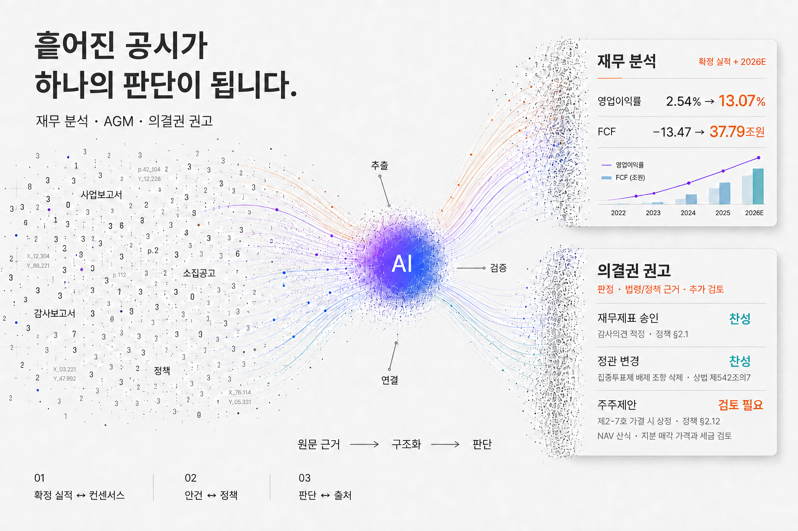

# OpenProxy MCP

[](https://polyformproject.org/licenses/noncommercial/1.0.0/)
[](https://www.python.org/downloads/)
[](https://modelcontextprotocol.io/)
[](#도구-구조-31개)
[](docs/RELEASE_NOTES.md)

[English README](README_ENG.md)

[빠른 시작](#빠른-시작) · [주요 기능](#주요-기능) · [도구 구조](#도구-구조-31개) · [데이터 출처](#데이터-소스)

## Why OpenProxy?

<picture>
  <source media="(prefers-color-scheme: dark)" srcset="screenshot/opm-readme-particle-flow-dark-ko-20260905.png">
  <source media="(prefers-color-scheme: light)" srcset="screenshot/opm-readme-particle-flow-light-ko-20260905.png">
  
</picture>

**안건은 한 줄이지만, 판단에는 회사 전체가 필요합니다.**

OpenProxy는 주주총회 의결권 분석에서 시작했습니다. 재무제표, 지분 구조, 배당 이력, 이사회와 관련 법령을 함께 읽기 위해 만든 기능은 DART 공시 전반을 분석하는 범용 엔진으로 확장됐습니다. 재무 분석부터 의결권 권고까지, AI가 판단과 원문 근거를 함께 제시합니다.

## 빠른 시작

**설치 없이 DART API 키 하나로 연결합니다.**

### 1. 무료 API 키 받기

DART는 한국 기업의 전자공시 시스템입니다. [DART OpenAPI](https://opendart.fss.or.kr/)에서 회원가입 후 무료 인증키를 신청합니다.

### 2. AI 서비스에 연결하기

커넥터 또는 앱 추가 화면의 서버 주소에 아래 URL을 입력합니다.

```
https://open-proxy-mcp.fly.dev/mcp?opendart=발급받은_OpenDART_API_키
```

> 서버 주소는 커넥터 설정에만 입력하세요. OpenProxy는 키 원문을 저장하지 않으며 로그에서도 가립니다.

| 서비스 | 연결 경로 | 이용 범위 |
|---|---|---|
| [**Claude**](https://support.claude.com/en/articles/11175166-get-started-with-custom-connectors-using-remote-mcp) | `Customize → Connectors → + → Add custom connector` | Free(1개)·Pro·Max. Team/Enterprise는 관리자 추가 |
| [**ChatGPT**](https://developers.openai.com/api/docs/guides/developer-mode) | `Settings → Security and login → Developer mode`, 이후 `Plugins → +` | 웹 Plus·Pro·Business·Enterprise·Education |
| [**Perplexity**](https://www.perplexity.ai/help-center/en/articles/13915507-adding-custom-remote-connectors.html) | `Account settings → Connectors → + Custom connector → Remote` | Pro·Max·Enterprise |

이름은 `open-proxy-mcp`로 지정하고 새 채팅에서 선택합니다. 메뉴 제공 범위는 계정 설정에 따라 달라질 수 있습니다.

### 3. 첫 질문 보내기

먼저 `삼성전자 회사 정보와 최근 공시 3건을 보여줘`라고 물어보세요. 회사와 공시 목록이 나오면 연결된 것입니다. 도구 이름을 알 필요 없이 이어서 질문할 수 있습니다.

- `LG화학의 다음 정기 주주총회 안건과 안건별 의결권 의견을 근거와 함께 알려줘`
- `삼성전자 최근 3년 실적과 향후 2개년 컨센서스를 비교해줘`

더 많은 질문 예시는 [도구 카탈로그](wiki/tools/README.md)의 각 도구 페이지에서 확인할 수 있습니다.

MCP 리소스를 지원하는 클라이언트에서는 `tools_guide`(`opm://tools_guide`)를 열어 현재 제공하는 도구와 기능 설명을 볼 수 있습니다. 안내는 서버에 등록된 도구 목록에서 자동으로 구성됩니다.

MCP 프롬프트를 지원하는 클라이언트에서는 `company_snapshot`(회사 한 장 요약)에 회사명이나 종목코드를 입력하세요. 사업 구조·3년 확정 실적·제공되는 연간 예상치 최대 2년·가격·지분·배당·최근 공시를 연결하고, 더 확인할 질문까지 정리하도록 안내합니다. 표에서 확정(A)과 예상(E)을 구분하며, 시각화가 가능한 클라이언트에는 매출 막대·영업이익 선 차트를 요청합니다.

---

## 주요 기능

**공시를 읽고, 숫자를 연결하고, 판단 근거까지 남깁니다.**

| 분석 영역 | 핵심 질문 | OpenProxy가 제공하는 답 |
|---|---|---|
| 🗳️ [주총·의결권](docs/features/proxy-voting.md) | 이 안건에 어떻게 투표할까? | **찬성·반대·검토 필요** 의견과 공시·정책·법령 근거. 표결 대상이 아닌 안건과 자료가 부족한 안건도 구분 |
| 📊 [재무·실적](docs/features/financials.md) | 실적은 어떻게 변했나? | 확정·[잠정](docs/features/provisional-earnings.md)·컨센서스 비교, 수익성·현금흐름·듀퐁 분석 |
| 💹 [가치평가·추정치](docs/features/price_multiple_data.md) | 현재 가격에 무엇이 반영됐나? | 과거·선행 PER/PBR/PSR, 배당수익률, [내년·내후년 추정치](wiki/tools/forward_estimates_data.md) |
| 🏭 [사업·보유자산](docs/features/business-details.md) | 무엇으로 벌고 무엇을 보유하나? | 사업부문·가동률·원가·수주잔고와 [잉여자산·보유지분 NAV](docs/features/asset-holdings.md) |
| 🧭 [지분·주주환원](docs/features/ownership.md) | 누가 지배하고 자본은 어디로 가나? | 소유구조, 배당·자사주 소각, [밸류업 약속과 실제 집행](docs/features/shareholder-return.md) |
| 🔔 [시장·리스크](wiki/tools/screener.md) | 오늘 무엇이 달라졌나? | 시장 공시 디제스트, [경영권 분쟁](docs/features/control-contest.md)·거래·희석·[리스크 이벤트](docs/features/risk-events.md) 추적 |

이 여섯 가지 분석 흐름을 출처 추적과 정관↔법령 조회까지 **총 31개 도구**가 뒷받침합니다. 전체 목록은 [도구 구조](#도구-구조-31개)에서 확인할 수 있습니다.

---

## 도구 구조 (31개)

분류는 [wiki/tools 카탈로그](wiki/tools/README.md)의 「무엇을 알고 싶을 때 무엇을 쓰나」 표와 같다 — 그 표가 정본이다.

| 분류 | Tools | 역할 |
|---|---|---|
| 🏢 기본 — 회사 찾기 | [`company`](wiki/tools/company.md) | 회사 식별 + 최근 공시 목록 — 모든 분석의 출발점 |
| 🔔 전체시장 스캔·디제스트 | [`screener`](wiki/tools/screener.md) | 전체시장 공시 스크리너 / 아침 공시 디제스트 |
| 🗳️ 주주총회·의결권 | [`shareholder_meeting_notice`](wiki/tools/shareholder_meeting_notice.md), [`shareholder_meeting_results`](wiki/tools/shareholder_meeting_results.md), [`proxy_advise_before_meeting`](wiki/tools/proxy_advise_before_meeting.md), [`proxy_guideline`](wiki/tools/proxy_guideline.md) | 소집공고(전)·결과(후) · 안건별 찬성/반대/검토 보조 · 판단 기준 문서 원문 |
| 💰 지분·재무·지배구조 | [`ownership_structure`](wiki/tools/ownership_structure.md), [`financial_metrics`](wiki/tools/financial_metrics.md), [`provisional_earnings`](wiki/tools/provisional_earnings.md), [`business_details`](wiki/tools/business_details.md), [`asset_holdings`](wiki/tools/asset_holdings.md), [`price_multiple_data`](wiki/tools/price_multiple_data.md), [`forward_estimates_data`](wiki/tools/forward_estimates_data.md), [`trading_data`](wiki/tools/trading_data.md), [`corp_gov_report`](wiki/tools/corp_gov_report.md), [`director_board`](wiki/tools/director_board.md) | 지분 구조 · 확정/잠정 실적 · 사업의 내용 · 자산주 · PER/PBR · 컨센서스 · 시세·시총 · 지배구조보고서 · 이사회 |
| 🎁 주주환원·자본 | [`dividend_disclosure`](wiki/tools/dividend_disclosure.md), [`dividend_data`](wiki/tools/dividend_data.md), [`treasury_share`](wiki/tools/treasury_share.md), [`value_up`](wiki/tools/value_up.md), [`shareholder_commitment`](wiki/tools/shareholder_commitment.md), [`corporate_restructuring`](wiki/tools/corporate_restructuring.md), [`dilutive_issuance`](wiki/tools/dilutive_issuance.md) | 배당 공시·시계열 · 자기주식 · 밸류업 · 약속 vs 이행 · 합병/분할 · 증자/CB/BW/감자 |
| ⚔️ 분쟁·거래·리스크 | [`proxy_contest`](wiki/tools/proxy_contest.md), [`corporate_deals`](wiki/tools/corporate_deals.md), [`order_contracts`](wiki/tools/order_contracts.md), [`risk_events`](wiki/tools/risk_events.md), [`financial_notes`](wiki/tools/financial_notes.md), [`director_news`](wiki/tools/director_news.md) | 경영권 분쟁 신호 · 지분 인수/매각 · 수주·공급계약 · 리스크 사건 · 금융사 주석 · 이사 후보 뉴스 |
| 🔗 근거·참조 | [`evidence`](wiki/tools/evidence.md), [`law_lookup`](wiki/tools/law_lookup.md) | 접수번호 → 원문 열람 URL · 정관↔법령 양방향 조회 (API 0콜) |

> 도구별 예시 질문·상세 스키마·데이터 출처 → [wiki/tools 카탈로그](wiki/tools/README.md) (각 도구 페이지의 「사용법」 절에 자연어 예시)

### 의결권 정책

**정책의 반대 기준이 곧 엔진의 자동 반대 조건은 아닙니다.** 추가 판단이 필요한 우려는 `검토 필요(REVIEW)`로 두며, 출석률은 현재 판정 조건에 반영하지 않습니다. `proxy_guideline`에서 인용된 절을, `0-A`에서 정책과 엔진의 대응표를 확인하세요. [판정·회차·정보 기준일 읽는 법](docs/features/proxy-voting.md).

`proxy_advise_before_meeting`은 OPM 자체 **Open Proxy Guideline**을 기본 정책으로 사용합니다. 판단 기준은 소수주주 보호, 거버넌스 투명성, 장기 가치, 추적 가능성입니다. 주요 자산운용사의 거래소 공시 의결권 행사 내역과 국민연금의 공개 행사 내역을 교차 검토에 활용합니다. 모든 응답에는 DART와 도구 호출 수를 담은 `data.usage`가 포함됩니다(DART 분당 1,000회 한도, 서버 안전 제한 910회).

**재무 기준 확인** — 승인 대상 연도의 확정치와 소집공고 잠정치, 직전 확정치를 구분해 읽습니다. 잠정치가 모든 지표를 대체하는 것은 아니므로 응답의 연도·출처·잠정 여부를 확인하세요. 잠정치에 따른 자본잠식 평가는 감사 후 재무제표를 요구하는 규정 판정을 대신하지 않습니다. 정보 기준일과 사후 자료 포함 여부는 [기능 안내](docs/features/proxy-voting.md)를 따릅니다.

---

## 데이터 소스

| 소스 | 용도 | 비고 |
|------|------|------|
| [DART OpenAPI](https://opendart.fss.or.kr/) | 정기·주요 공시 메타 + 재무 API + 배당·자사주·지분 등 정형 데이터 | **필수** — 무료 API 키. 분당 최대 1,000회, 서버 안전 제한 910회 |
| DART 웹 (`dart.fss.or.kr`) | 공시 본문 파싱 (소집공고·주요사항보고서 등) | 요청 간 1–2초 무작위 대기 |
| [KRX KIND](https://kind.krx.co.kr/) | 거래소 공시 보조 확인 | 보조 소스 |
| [국가법령정보센터](https://www.law.go.kr/) 기반 법령 원문 | 정관 변경·의결권 판단의 법령 근거 조회 | [legalize-kr](https://github.com/legalize-kr/legalize-kr)에서 주간 동기화 |
| 주요 자산운용사의 거래소 공시 의결권 행사 내역과 국민연금 공개 행사 내역 | 의결권 판단 교차 검토 | 사전 수집·구조화한 공개 자료 |

---

## 릴리즈 노트

버전별 변경 이력 → **[docs/RELEASE_NOTES.md](docs/RELEASE_NOTES.md)**

---

## Disclaimer

OpenProxy는 DART 공시 데이터를 구조화하여 AI에게 제공하는 도구입니다. AI는 할루시네이션을 일으킬 수 있고 부정확한 분석을 제공할 수 있습니다. AI가 제시하는 의견은 개발자 또는 소속 단체의 의견이 아닙니다. 분석 결과는 참고 목적으로만 사용하고, 투자 결정이나 의결권 행사의 최종 판단은 반드시 원문 공시와 전문가 검토를 거쳐야 합니다.

---

## 라이선스

[PolyForm Noncommercial License 1.0.0](https://polyformproject.org/licenses/noncommercial/1.0.0/) — 비상업적 사용만 허용 (전문: 루트 [`LICENSE`](LICENSE))

- **비상업적 사용**(개인 연구·학습·비영리·공공기관)은 자유롭게 허용됩니다.
- **상업적 사용**은 별도 라이선스 계약이 필요합니다 (OpenProxy AI).
- **재배포 시 출처 표기**: `Copyright (c) 2026 OpenProxy AI (https://github.com/MarcoYou/open-proxy-mcp)` 유지 (PolyForm 'Notices' 조항).

> 상업 라이선스·기타 문의: gunhoqw20@gmail.com
