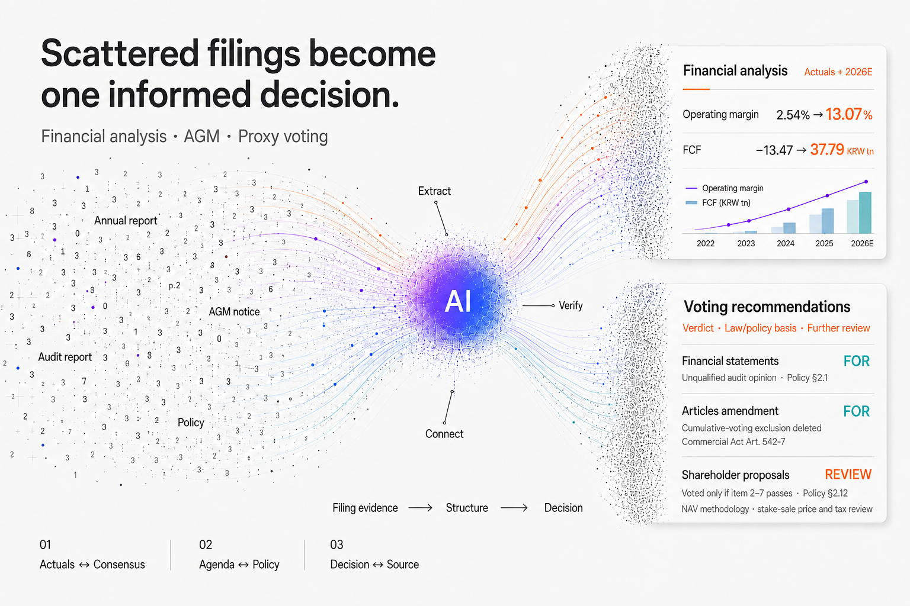

# OpenProxy MCP

[](https://polyformproject.org/licenses/noncommercial/1.0.0/)
[](https://www.python.org/downloads/)
[](https://modelcontextprotocol.io/)
[](#tool-structure-31-tools)
[](docs/RELEASE_NOTES_ENG.md)

[Korean README](README.md)

## Why OpenProxy?

[](screenshot/opm-readme-particle-flow-light-en-20260906.png)

**An agenda item may fit on one line. A sound decision requires the full picture.**

OpenProxy began with AGM and proxy voting analysis. The capabilities needed to read financial statements, ownership structures, dividend history, boards, and relevant laws together grew into a general-purpose engine for DART filings. From financial analysis to voting recommendations, AI presents each conclusion with the underlying source evidence.

## Main Features

Click any feature for a detailed page.

- **[AGM analysis and proxy voting recommendations](docs/features/en/proxy-voting.md)** — reviews annual and extraordinary meeting agendas with evidence, policy citations, and FOR / AGAINST / REVIEW recommendations; distinguishes NO_VOTE (not subject to voting) and NO_DATA (insufficient information).
- **[Financial metrics](docs/features/en/financials.md)** — profitability, stability, cash flow + DuPont breakdown and audit-opinion trend. Quarterly on two bases (YTD / 3-month) with QoQ·YoY.
- **[Valuation](docs/features/en/price_multiple_data.md)** — PER · PBR · dividend yield (firm deep-dive) plus market/sector/ticker history. Market and sector tables carry a **cap-weighted dividend yield** in confirmed and forward flavors, each with two denominators, `all` (non-payers included) and `payers` (dividend payers only) — on KOSDAQ the two differ by 2x, so reading one alone misleads. `scope="explain"` shows how each number was derived. (runtime: `price_multiple_data`)
- **[Consensus forward estimates](wiki/tools/forward_estimates_data.md)** — next- and following-year revenue / operating profit / EPS plus **forward PER · PBR · PSR**, with two years of reported actuals for contrast. Built on an analyst-estimate snapshot (`fwd`), not DART filings; coverage is 713 of 2,764 tickers. Multiples are attached **only to estimate FYs and the latest confirmed FY** — today's price divided by a past year's earnings is not a multiple. (runtime: `forward_estimates_data`)
- **[Asset-holdings screen](docs/features/en/asset-holdings.md)** — tiers a firm's holdings (cash, investment property, equity stakes), marks listed stakes to market, and compares surplus-asset / equity-NAV to market cap to surface "hidden asset" plays.
- **[Business details](docs/features/en/business-details.md)** — segment revenue & profit, production capacity & utilization, R&D, order backlog, key customers, raw-material/input-cost and product-price trends — reads the "Business Overview" section for you.
- **[Provisional earnings](docs/features/en/provisional-earnings.md)** — quarterly preliminary earnings filings, tabulated with growth rates.
- **[Shareholder return](docs/features/en/shareholder-return.md)** — dividends, buyback-to-cancellation cycles, value-up plans — promises vs. actual execution.
- **[Ownership map](docs/features/en/ownership.md)** — largest shareholder, related parties, 5% blocks, treasury shares.
- **[AGM agenda](docs/features/en/meeting-agenda.md)** — agenda items, nominees, compensation limits, articles amendments, plus post-AGM results and approval rates.
- **[Control-contest signals](docs/features/en/control-contest.md)** — proxy solicitation, tender offers, litigation, 5% activism signals (no auto-verdict).
- **[Corporate risk events](docs/features/en/risk-events.md)** — serious accidents, embezzlement/breach-of-trust, production halts. Scans the whole market if no company is given.
- **[Financial-firm liquidity and asset quality](wiki/tools/financial_notes.md)** — pulls restricted deposits and pledged assets (→ unencumbered cash) and the composition of investment assets by type (→ haircuts) verbatim from bank/broker/insurer financial-statement notes, with the consolidated/separate basis, date, unit, and accounts to subtract identified alongside.
- **[Market-wide disclosure digest](wiki/tools/screener.md)** — sweeps orders, buybacks, dividends, capital increases, AGM notices, 5% blocks, and provisional earnings into a card digest — a morning disclosure-alert routine ([recipe](docs/routines/screener-morning-digest.md)).

Plus source tracing, corporate governance reports, dilutive issuance (rights/CB), restructuring (mergers/splits), stake deals, trading/market-cap time series, and bidirectional articles↔statute lookup, voting-policy source lookup — **31 tools in total**.

---

## Quick Start

OpenProxy MCP is a **remote server you connect** to AI services like Claude, ChatGPT, or Perplexity. No installation needed.

### Step 1: Get a DART API key (required, free)

OPM combines three sources — DART filing text, exchange filing text, and the OpenDART API. Your own key is needed for the OpenDART API calls.
Go to [DART OpenAPI](https://opendart.fss.or.kr/) → sign up → request an authentication key (issued immediately).

### Step 2: Connect to your AI service

Register the URL below in your AI service's connector (app) settings.

```
https://open-proxy-mcp.fly.dev/mcp?opendart=YOUR_DART_API_KEY
```

> **API key caution**: the URL contains your personal API key. Don't paste it into a normal chat — only into the server-URL field of the connector settings.

The procedure is the same everywhere — **add a connector named `open-proxy-mcp` with the URL above → open a new chat and confirm the connector is selected via the `+` button**:

| Service | Menu path | Notes |
|---|---|---|
| **Claude** | Settings → Connectors → Custom → Add connector | Paid plan required. Afterwards set tool permission to **Always allow** |
| **ChatGPT** | Settings → Apps → enable `Developer mode` in advanced settings → Create app | New chat `+` → More to select |
| **Perplexity** | Settings → Connectors → Add custom connector | — |

> **Note**: connector menus may be unavailable depending on plan/account. The first call may time out while the server spins up — retry shortly. If new features don't appear, remove and re-add the connector.

### Usage examples

Once connected, just ask in natural language. You don't need to know tool names.

**AGM agenda review**
1. `Show me LG Chem's 2026 AGM agenda`
2. `Advise FOR/AGAINST/REVIEW for each item`
3. `Explain any REVIEW items, and distinguish NO_VOTE from NO_DATA`

For an EGM: `Review the upcoming extraordinary general meeting, including competing nominees and cumulative-voting constraints.`

**Shareholder-return check**
1. `Show me KT&G's corporate value-up plan`
2. `Show dividends and buybacks for the last 3 years`
3. `Is the actual return consistent with the plan?`

**Risk monitoring**
1. `Which listed companies filed serious-accident or embezzlement disclosures in the last month?`
2. `Show Hanwha Aerospace's serious-accident history in detail, including casualties`

More examples (director pay, control contests, financials, valuation) → the "사용법" (usage) section of each tool page in the **[wiki/tools catalog](wiki/tools/README.md)**

---

## Tool Structure (31 tools)

Categories match the "what do you want to know → which tool" table in the [wiki/tools catalog](wiki/tools/README.md) — that table is the source of truth.

| Category | Tools | Role |
|---|---|---|
| 🏢 Start — find the company | [`company`](wiki/tools/company.md) | Company identification + recent filings — every analysis starts here |
| 🔔 Market-wide scan · digest | [`screener`](wiki/tools/screener.md) | Market-wide disclosure screener / morning digest |
| 🗳️ Shareholder meetings · voting | [`shareholder_meeting_notice`](wiki/tools/shareholder_meeting_notice.md), [`shareholder_meeting_results`](wiki/tools/shareholder_meeting_results.md), [`proxy_advise_before_meeting`](wiki/tools/proxy_advise_before_meeting.md), [`proxy_guideline`](wiki/tools/proxy_guideline.md) | Notice (pre) · results (post) · per-agenda FOR/AGAINST/REVIEW support · the voting-policy document itself |
| 💰 Ownership · financials · governance | [`ownership_structure`](wiki/tools/ownership_structure.md), [`financial_metrics`](wiki/tools/financial_metrics.md), [`provisional_earnings`](wiki/tools/provisional_earnings.md), [`business_details`](wiki/tools/business_details.md), [`asset_holdings`](wiki/tools/asset_holdings.md), [`price_multiple_data`](wiki/tools/price_multiple_data.md), [`forward_estimates_data`](wiki/tools/forward_estimates_data.md), [`trading_data`](wiki/tools/trading_data.md), [`corp_gov_report`](wiki/tools/corp_gov_report.md), [`director_board`](wiki/tools/director_board.md) | Ownership map · confirmed/provisional earnings · business description · asset plays · PER/PBR · consensus · price/market cap · governance report · board |
| 🎁 Shareholder returns · capital | [`dividend_disclosure`](wiki/tools/dividend_disclosure.md), [`dividend_data`](wiki/tools/dividend_data.md), [`treasury_share`](wiki/tools/treasury_share.md), [`value_up`](wiki/tools/value_up.md), [`shareholder_commitment`](wiki/tools/shareholder_commitment.md), [`corporate_restructuring`](wiki/tools/corporate_restructuring.md), [`dilutive_issuance`](wiki/tools/dilutive_issuance.md) | Dividend filings/time series · treasury shares · value-up · promise vs delivery · mergers/splits · rights/CB/BW/reductions |
| ⚔️ Contests · deals · risk | [`proxy_contest`](wiki/tools/proxy_contest.md), [`corporate_deals`](wiki/tools/corporate_deals.md), [`order_contracts`](wiki/tools/order_contracts.md), [`risk_events`](wiki/tools/risk_events.md), [`financial_notes`](wiki/tools/financial_notes.md), [`director_news`](wiki/tools/director_news.md) | Control-contest signals · stake deals · orders/supply contracts · risk events · financial-firm notes · director-candidate news |
| 🔗 Evidence · reference | [`evidence`](wiki/tools/evidence.md), [`law_lookup`](wiki/tools/law_lookup.md) | Filing number → viewer URL · bidirectional articles↔statute lookup (zero API calls) |

> Per-tool example questions, schemas & data sources → [wiki/tools catalog](wiki/tools/README.md) (natural-language examples live in each tool page's usage section)

### Voting policy

**Policy opposition does not always mean an automatic AGAINST recommendation.** The engine leaves judgment-dependent concerns as REVIEW; board attendance is not currently a decision trigger. Ask for the cited policy section with `proxy_guideline`, or section `0-A` for the policy-to-engine mapping. [How to interpret recommendations, meeting selection, and information cutoffs](docs/features/en/proxy-voting.md). The default report and detailed policy references are in Korean; ask your AI to explain them in English while preserving the evidence and statuses.

`proxy_advise_before_meeting` uses OPM's own **Open Proxy Guideline** as its default policy. Its criteria: minority-shareholder protection, governance transparency, long-term value, traceability. An anonymized institutional-policy corpus is used only as internal cross-reference — no institution names are ever exposed. Every response includes a `data.usage` block (DART & tool call counts; DART limit 1,000/min — hard-capped at 910).

**Check the financial basis** — distinguish confirmed figures for the year being approved, provisional figures in the meeting notice, and prior confirmed figures. Provisional figures do not replace every metric: check the reported year, source, and provisional labels. A provisional capital-impairment assessment does not replace a regulatory determination requiring audited financial statements. See the [feature guide](docs/features/en/proxy-voting.md) for information cutoffs and later filings.

---

## Data Sources

| Source | Use | Notes |
|------|------|------|
| [DART OpenAPI](https://opendart.fss.or.kr/) | Filing metadata + financial endpoints + dividends/treasury/ownership | **Required** — free API key. 1,000/min hard rule (cap 910) |
| DART web (`dart.fss.or.kr`) | Filing body parsing (AGM notices, material reports) | rate-limited (random 1–2s between requests) |
| [KRX KIND](https://kind.krx.co.kr/) | Exchange-filing cross-checks | auxiliary source |
| Anonymized institutional policy corpus | Voting-judgment cross-reference | internal static data, no names exposed |

---

## Release Notes

Version history → **[docs/RELEASE_NOTES_ENG.md](docs/RELEASE_NOTES_ENG.md)**

---

## Disclaimer

OpenProxy is a tool that structures DART filing data for AI consumption. AI can hallucinate and may produce inaccurate analysis. Opinions presented by the AI are not those of the developer or any affiliated organization. Use the output for reference only — final investment or voting decisions must go through the original filings and expert review.

---

## License

[PolyForm Noncommercial License 1.0.0](https://polyformproject.org/licenses/noncommercial/1.0.0/) — noncommercial use only (full text: root [`LICENSE`](LICENSE))

- **Noncommercial use** (personal research, learning, nonprofits, public institutions) is freely permitted.
- **Commercial use** requires a separate license agreement (OpenProxy AI).
- **Attribution on redistribution**: keep `Copyright (c) 2026 OpenProxy AI (https://github.com/MarcoYou/open-proxy-mcp)` intact (PolyForm 'Notices' clause).

> Commercial licensing & inquiries: gunhoqw20@gmail.com
