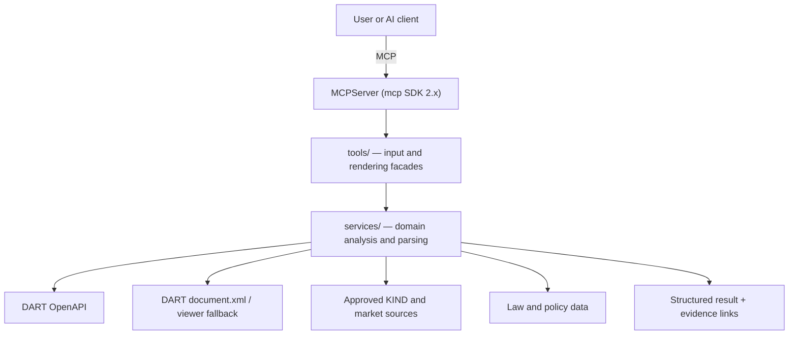
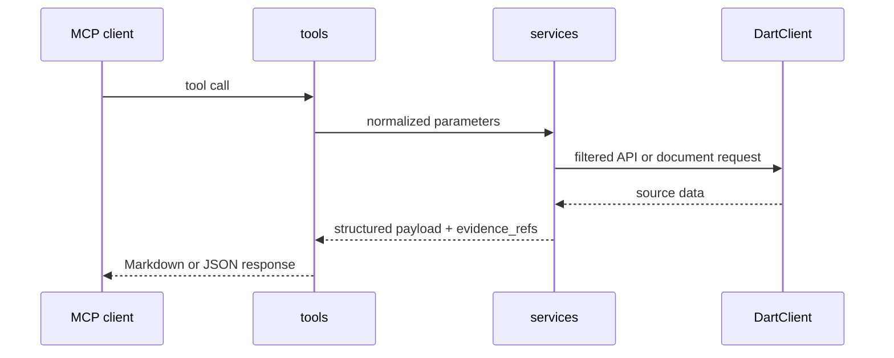

# Architecture

> The retired tool surface remains recoverable from the `open-proxy-mcp-v1.3.0` branch. The
> active codebase has one unversioned MCP tool surface.

## System Overview



- **Transport**: streamable HTTP in production; stdio and SSE are also supported.
- **Registration**: `open_proxy_mcp.tools.register_all_tools()` discovers public facade modules.
- **Tool catalog SSOT**: runtime registration, checked against `wiki/tools/*.md` by
  `scripts/check_tool_catalog.py`.
- **Legacy recovery**: Git history and the `open-proxy-mcp-v1.3.0` branch; no runtime mode switch.

## Code Structure

```text
open_proxy_mcp/
  server.py                     # MCPServer entrypoint, build_app(), HTTP middleware
  tools/                        # public MCP facades and renderers
    __init__.py                 # auto-discovery and shared exception boundary
  services/                     # domain analysis, orchestration, and parsers
    shareholder_meeting_parser.py
    agm_result_parser.py
    dividend_parser.py
    ownership_parser.py
  dart/client.py                # DART/KIND access, throttle, cache, company lookup
  data/                         # policy, industry, and other static inputs
scripts/check_tool_catalog.py   # runtime-to-wiki catalog drift check
tests/                          # offline unit and regression tests
wiki/                           # domain knowledge and architecture decisions
```

Tool modules validate MCP inputs and render outputs. Services own searches, source selection,
parsing, calculations, and evidence assembly. Parser helpers used by more than one service live
under `services/`; they are not retained in a legacy tool package.

## Request Path



Services narrow DART searches by disclosure category and detail code before title matching.
`document.xml` is the primary document body; a service may use an explicitly defined viewer or
KIND fallback only when the higher-priority source cannot answer the request.

## Operational Boundaries

- DART OpenAPI rolling cap: 910 calls per minute, below the external 1,000-call limit.
- DART and KIND web access: at least two seconds between requests; no batch scraping.
- User query results are not persisted. Corp-code/document caches, market snapshots, and usage
  telemetry are explicit infrastructure exceptions.
- API keys and key-bearing URLs must never appear in output, logs, exceptions, or fixtures.
- Tests default to `tests/` through `pyproject.toml`; unit and regression tests make no live calls.

## Deployment

Production runs the same single tool surface as local development:

```bash
uv run python -m open_proxy_mcp.server --transport streamable-http
```

Fly.io provides the HTTP runtime. Non-secret deployment settings live in `fly.toml`; credentials
and database URLs are Fly secrets.
