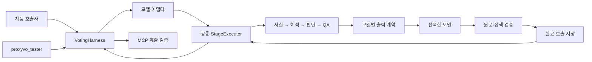

# ProxyVO 실험 스크립트

`scripts/proxyvo_tester.py`는 **동일한 주총·안건·정책·원문 묶음을 여러 모델에 제공하고, 실제 HTTP MCP의 제출 결과를 비교**하는 명령행 진입점이다. 실험 설계는 [모델 평가 프로토콜](../wiki/decisions/opm-model-evaluation-protocol.md)을 따른다. 이 파일의 명령은 사용 예시이며, 작성만으로 실행되지는 않는다.

코드를 처음 읽는 사용자는 [박스를 눌러 보는 하네스 흐름도](../output/harness-flow-20260911/index.html)에서 전체 진행, LLM 4단계, 사용자 설정·복구·실험을 쉬운 설명과 함께 볼 수 있다.

## 현재 지원 범위

- 모델·추론 강도·질문·방법·반복 횟수를 JSON으로 선언한다. 매 호출은 명시적으로 구성한 입력으로 시작하며 사용자 대화, 데스크톱 메모리, 이전 응답 연결을 가져오지 않는다. 단계 간에는 해당 실행에서 생성한 작업 결과와 오류 피드백만 전달한다.
- 같은 조건의 모델들은 같은 최초 입력을 받는다. `direct`, `staged`, `direct_with_review`는 방법 자체를 비교하는 조건이므로 단계 지시와 호출 수가 다르다. 모델이 낸 중간 결과 이후의 입력 역시 달라질 수 있다.
- `prepare`에서 시점·안건·원문·정책·코드를 고정한다. 실제 실행 중 MCP가 다른 묶음을 반환하면 비교에서 완료로 처리하지 않는다. 지식 사전학습까지 지우는 장치는 아니므로 인용과 의미 검증은 별도로 필요하다.
- 지정한 **정관·이사 선출 구조 안건**을 지원한다. 전체 주총의 모든 종류 안건 제출, 자유로운 원천 탐색, 편향 변형 자동 생성, AB/BA 비교와 독립 정답 표본 보정은 아직 구현하지 않았다.
- 모델 호출 구현은 현재 OpenAI Responses API다. 모델 이름과 추론 강도는 설정으로 교체하며, 다른 제공자는 별도 어댑터가 필요하다. 지원하지 않는 모델·설정은 실패로 남기고 다른 모델이나 낮은 추론 강도로 자동 교체하지 않는다.
- 운영용 `StagedStructureAdapter`와 실험용 `ExperimentAdapter`는 같은 `StageExecutor`로 단계 순서·재시도·부분 수용·QA를 처리한다. 실험용 어댑터는 질문과 모델을 연결하고 고정 원문 실험의 탐색 제한을 설정한다.
- 출력은 **사람 미검토**다. 어떤 명령도 실제 투표를 전송하지 않는다.

## 설정 예시



이 그림은 단계별 처리 경로다. 직접 판단 대조군은 같은 외부 하네스와 복구 계층을 사용하되 4단계 분해를 적용하지 않는다.

[proxyvo.example.json](proxyvo.example.json)은 영원무역 정기주총의 지정 안건 2개를 Luna·Terra·Sol·Astra의 `xhigh` 설정과 3가지 방법으로 비교하도록 작성했다. 4개 모델 × 3개 방법 × 1개 질문 × 1개 회차 묶음 × 1회 반복 = **12회 실행 계획**이다. 아직 실행 결과가 아니다.

처음부터 10개사의 정기·임시 회차 전부를 돌리는 설정은 아니다. 원문 읽기 범위도 예시에 지정된 범위로 고정한다. 읽지 않은 구간은 `not_read`로 남기며 자료 전체를 읽었다고 간주하지 않는다. 회차별로 소집공고 접수번호, 판단 시각, 대상 안건 ID, 허용할 원문 구간을 추가한다. 반복을 늘릴 때는 별도 계획과 출력 폴더를 사용한다. 반복 5회만으로 통계적 충분성을 보장하지 않는다.

기본 보팅 설정은 `stance=0.5`, `firmness=0.75`, `automation=0.5`다. 채점자는 `judges`에 미리 지정하며 예시의 빈 배열은 외부 LLM 채점을 하지 않는다는 뜻이다. 원한다면 모델 항목과 동일한 형식으로 지정한다.

## 명령별 동작

| 명령 | 수행 내용 | 네트워크·비용 |
|---|---|---|
| `validate` | 계획 형식과 실행 조합 수 확인 | 없음 |
| `prepare` | 실제 MCP에서 공통 입력을 받아 고정 | MCP·서버의 원천 조회; 모델 호출 없음 |
| `preflight` | 모델별 작은 JSON 응답으로 접근·설정 확인 | 모델 API 호출; 품질 실험 아님 |
| `run` | 새 컨텍스트에서 모델 판단 → 실제 MCP 제출 → 결과 저장 | 모델 API + MCP |
| `score` | 미리 지정한 채점자가 원문·정책과 결과 대조 | 채점 모델 API; 실제 투표 변경 없음 |
| `report` | 저장된 결과로 비교표·개선 제안 작성 | 없음 |

다음은 **나중에 실행할 때의 예시**다. `prepare` 이후 명령은 같은 계획과 출력 폴더를 사용한다.

```bash
uv run python scripts/proxyvo_tester.py validate --plan experiments/proxyvo.example.json

uv run python scripts/proxyvo_tester.py prepare --plan experiments/proxyvo.example.json --out ../open-proxy-storage/evaluations/proxyvo/youngone-v1

uv run python scripts/proxyvo_tester.py preflight --plan experiments/proxyvo.example.json --out ../open-proxy-storage/evaluations/proxyvo/youngone-v1

uv run python scripts/proxyvo_tester.py run --plan experiments/proxyvo.example.json --out ../open-proxy-storage/evaluations/proxyvo/youngone-v1 --limit 1

uv run python scripts/proxyvo_tester.py report --plan experiments/proxyvo.example.json --out ../open-proxy-storage/evaluations/proxyvo/youngone-v1
```

환경 변수 `OPENAI_API_KEY`, `PROXYVO_MCP_URL`과 계획의 `mcp_header_env`에 지정한 인증 환경 변수가 필요하다. 키 값은 JSON 계획에 넣지 않는다. `--env-file`로 환경 설정 파일을 지정할 수도 있으며 이 파일은 모델 문맥에 전달하지 않는다. URL에는 키·쿼리·사용자 정보를 넣을 수 없다.

파일럿 서버는 별도로 준비해야 한다. 스크립트가 서버를 시작하거나 배포하지 않는다. 예시의 `x-opendart-key` 헤더는 이를 지원하는 파일럿 인증 연결을 전제로 한다. 다른 서버를 쓰면 그 서버의 인증 방식에 맞게 `mcp_header_env`를 설정해야 한다. 모델 이름이 데스크톱에서 보인다는 사실만으로 API 접근 가능성을 가정하지 않으며 `preflight` 결과로 확인한다.

## 재현성과 재시도

계획·코드·원문 해시가 달라지면 기존 실험에 섞지 않는다. 정책이나 프롬프트 개선은 새 계획과 새 출력 폴더에서 비교한다. `temperature`, `seed`는 선택 사항이며 미지원 설정은 실패로 보존한다. 응답 모델명도 기록하고 같은 이름의 반환 표기가 바뀌면 중단한다. 제공자의 응답 표기만으로 내부 모델 스냅샷의 동일성을 증명할 수는 없다.

`run`은 이미 결과가 있는 실행을 건너뛴다. **중단한 같은 시도를 이어가려면 `--resume`**, 실패·중단 기록을 남기고 **새 시도를 시작하려면 `--retry-failed`**를 사용한다. 두 옵션은 함께 사용할 수 없다. 같은 시도의 재개를 새 반복 표본으로 세지 않는다. 첫 시도에 결과가 없으면 새 시도의 성공을 첫 성공으로 바꿔 기록하지 않는다.

복구는 완료한 호출 영수증을 재생하는 방식이다. 사실 추출 응답이 저장됐다면 그 응답을 다시 검증하고 다음 단계부터 모델을 호출한다. 먼저 실제 MCP를 한 번 조회하여 마지막 원문·정책·작업 묶음이 유지되는지 확인한다. 코드·계획·모델 설정·질문·자료가 바뀌면 기존 실행을 재개하지 않는다. 요청별 체크포인트는 프로세스 잠금, 임시 파일, atomic replace, 무결성 해시를 사용한다. 현재 파일 잠금은 macOS/Linux 등 POSIX 환경을 전제로 한다.

모델 호출 중 끊겨 완료 여부를 알 수 없으면 `checkpoint_inflight_uncertain`으로 멈춘다. 이 경우 자동으로 다시 비용을 발생시키지 않으며 `--retry-failed`로 새 시도를 선택할 수 있다. 읽기 전용 MCP 조회는 다시 확인할 수 있다. 프로세스가 살아 있는 동안의 HTTP 전송 오류·일시 오류 재시도는 별도로 `budget.http_retries`가 제어한다. 불확실한 전송도 재시도하지 않으려면 0으로 둔다. 채점 중단은 자동 재호출하지 않으며 이 버전은 채점 재시도 CLI를 제공하지 않는다.

```bash
uv run python scripts/proxyvo_tester.py run --plan experiments/proxyvo.example.json --out ../open-proxy-storage/evaluations/proxyvo/youngone-v1 --resume
```

모델의 `output_mode` 기본값은 `json_schema`다. 생성 단계에서 필수 필드·자료형을 제약하고, 이후 Pydantic·원문 인용·정책 검증을 계속 적용한다. 서버의 자유로운 `fact.data`는 생성할 때 사실 종류별로 구체화한다. 정관 사건의 조건부 제약도 enum별 스키마로 보존한다. null·빈 배열·gap은 허용된 계약대로 사용하며 미확인 사실을 채워 넣지 않는다. 지원하지 않는 모델은 사전에 `json_object`를 지정할 수 있지만 오류 후 자동으로 낮추지는 않는다. 다른 출력 모드는 실험 조건의 차이로 기록해야 한다. 실제 API 지원 여부는 아직 실측하지 않았다. 설계 근거: [OpenAI Structured Outputs](https://developers.openai.com/api/docs/guides/structured-outputs).

`max_output_tokens`는 호출별, `model_calls`는 실행별 예산이다. `outer_timeout_seconds`는 하네스의 모델 작업 한 번에 적용된다. 방법마다 단계 수가 다르므로 공통 상한을 설정해도 실제 사용 토큰·비용·시간이 같아지지는 않는다. 사용량과 실패를 함께 비교한다.

재개 시 저장된 모델 요청 수를 예산에 포함한다. 결과의 `elapsed_seconds`는 현재 프로세스에서 실행한 구간이며 중단 전 시간이나 대기 시간을 합친 총 경과시간이 아니다. 전체 호출별 시간은 저장된 개별 영수증에서 확인한다.

## 제품 호출자에서 복구 사용하기

서버 입력 파라미터는 바뀌지 않는다. 호출자 코드에서 `VotingHarness`에 `FileCheckpoint`를 전달하면 같은 복구 계층을 사용할 수 있다. `identity`에는 모델 설정과 프롬프트 버전을 명시한다. 다른 독립 실험에는 새 폴더를 쓴다. 기본값은 저장을 끈 상태이며, 아래 코드는 사용 예시다.

```python
from pathlib import Path
from open_proxy_mcp.harness import FileCheckpoint, VotingHarness

# transport, adapter, request는 호출자가 준비한 MCP 연결·모델·주총 요청이다.
checkpoint = FileCheckpoint(
    Path('../open-proxy-storage/evaluations/my-voting-run'),
    identity={'model': '선택한 모델과 설정', 'prompt_revision': '질문 버전'},
)
harness = VotingHarness(transport, adapter, checkpoint=checkpoint)
result = await harness.run(request)
```

공통 단계 실행기는 중단한 내부 단계를 복구할 수 있다. 임의의 일반 콜백은 내부 외부호출을 알 수 없으므로 완료된 전체 콜백 응답만 재사용하며, 실행 중 끊긴 콜백은 자동 재진입하지 않는다. 체크포인트는 이전 대화의 기억을 새 실험에 제공하는 기능이 아니다.

## 결과 읽는 법

사용량·응답을 포함하므로 `--out`은 공개 저장소 바깥의 전용 폴더만 허용한다. `plan.json`, `code.json`, `manifest.json`, `packets/`, `runs/`, 선택적 `grades/`, `reports/`에 입력·응답·MCP 요청 및 결과·시도 이력·HTML/JSON 비교표를 보존한다. 각 시도의 `checkpoint/state.json`은 진행 상태, `checkpoint/operations/`는 완료·실패·미완료 호출 영수증이다. 일반 기록은 인증 값을 제거하며 원격 오류 본문은 저장하지 않는다. 복구 영수증에 알려진 환경 변수의 비밀 값이 포함되면 내용을 변조해 재생하지 않고 저장을 거부한다.

보고서는 모델·방법·질문별로 예정 횟수, 실행 상태, 첫 시도와 최신 시도의 찬반, 안건별 권고와 조건부 분기를 보여 준다. 미시작·중단·미평가는 숨기지 않는다. `PARTIAL`은 일부 판단이 수용됐어도 해당 안건의 거부 항목이 남은 상태다. 조건부 판단 여러 개를 마지막 한 개로 덮어쓰지 않는다.

`target_complete`는 지정한 모든 안건의 제출이 수용되고 관련 거부 항목이 없다는 뜻이다. **정답이라는 뜻은 아니다.** 반복 변화 수치는 최종 권고·완료 상태·조건부 찬반 구성의 차이다. 근거나 조건 문구가 같은 뜻인지는 이 수치가 검증하지 않는다.

선택적 채점자는 답변 작성 모델과 방법 표시를 받지 않고, 고정한 회사·안건 제목·판단 시각·원문·정책과 답변을 대조한다. 문체를 통한 추론까지 차단하지는 못한다. 원문 인용 검증과 의미 판단을 분리하며 사람 미검토 표시를 유지한다. 채점자별 판정을 보존하고 다수결을 정답으로 만들지 않는다. 개선 제안은 별도 파일에 기록하며 지침이나 코드를 자동 수정하지 않는다.
