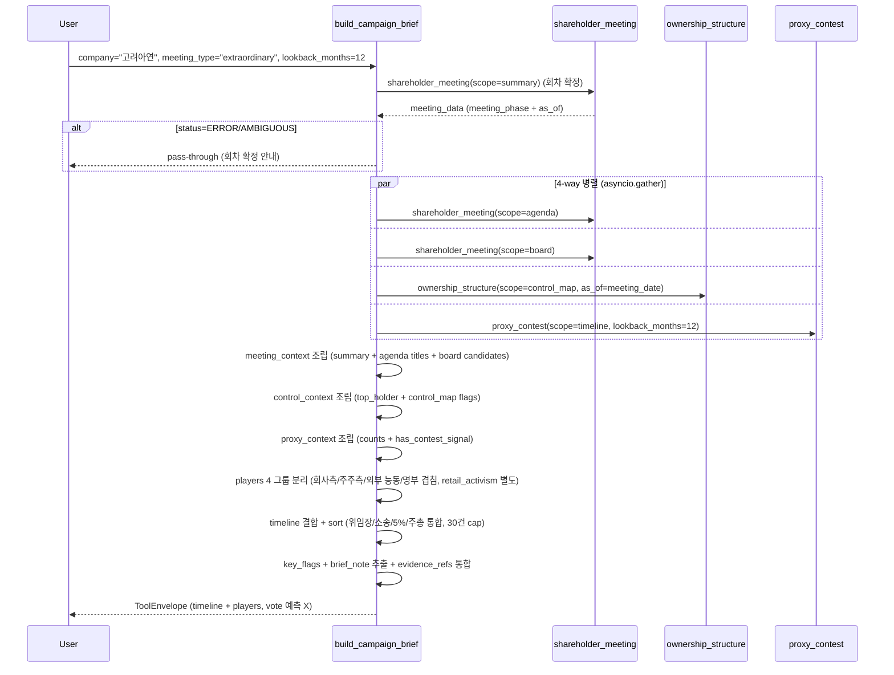

# build_campaign_brief

## 한 줄 요약
캠페인 사실 브리프 action tool. 위임장 + 소송 + 5% 시그널 + 주총 회차 + 지배구조를 timeline/players/key_flags로 정리. **fact brief 전용** — 자동 추천, vote math 예측 금지.

## 사용법
```
build_campaign_brief(
    company="고려아연",
    meeting_type="extraordinary",
    lookback_months=12,
)
```

자연어 예시:
- "고려아연 임시주총 캠페인 브리프 (MBK vs 최윤범)" → `meeting_type="extraordinary"`
- "삼성전자 12개월 캠페인 timeline (소액주주 ACT 컨두잇)" → company만
- "한미약품 경영권 분쟁 timeline" → `meeting_type="extraordinary"`

## 입력 인자
| 인자 | 타입 | 필수 | 설명 | 기본값 |
|---|---|---|---|---|
| company | str | yes | 회사명 / ticker / corp_code | - |
| meeting_type | str | no | "auto" / "annual" / "extraordinary" | "auto" |
| year | int | no | 사업연도 | 0 |
| start_date / end_date | str | no | YYYYMMDD | "" |
| lookback_months | int | no | 조사 구간 (개월) | 12 |
| format | str | no | "md" / "json" | "md" |

## 출력 schema (data dict)
```json
{
  "company_id": "...", "canonical_name": "...",
  "meeting_context": {"summary": {...},
                      "coverage": {"presence_flag": "..."},
                      "agenda_titles": [...],
                      "board_candidates": [...]},
  "control_context": {"summary": {"top_holder": {...},
                                  "related_total_pct": ...,
                                  "treasury_pct": ...},
                      "control_map": {"flags": {...},
                                      "observations": [...]}},
  "proxy_context": {"summary": {"proxy_filing_count": N,
                                "shareholder_side_count": N,
                                "litigation_count": N,
                                "active_signal_count": N,
                                "has_contest_signal": true}},
  "players": {"company_side_filers": [...],
              "shareholder_side_filers": [...],
              "active_external_blocks": [...],
              "active_overlap_blocks": [...]},
  "timeline": [{"date": "...", "category": "...",
                "actor": "...", "side": "...",
                "title": "...", "rcept_no": "..."}],
  "key_flags": [...],
  "quality": {"notice_parse_source": "...",
              "meeting_summary_status": "...",
              "agenda_status": "...",
              "board_status": "...",
              "ownership_status": "...",
              "proxy_status": "...",
              "meeting_phase": "...",
              "result_status": "..."},
  "brief_note": "...",
  "evidence_refs": [...]
}
```

핵심 필드:
- `timeline`: 모든 이벤트 시계열 (위임장 / 소송 / 5% / 주총 등)
- `players`: 4 그룹 분리 (회사측 / 주주측 / 외부 능동 / 명부 겹침)
- retail_activism은 별도 분류 (proxy_contest와 동일 정책)

## Data sources
- **upstream tool 호출** (병렬):
  - `proxy_contest` (timeline + summary) — 위임장 + 소송 + 5% 시그널
  - `ownership_structure` (control_map) — 지배구조
  - `shareholder_meeting` (summary + coverage) — 주총 회차 + 안건 + 후보자
  - `evidence` (모든 evidence_refs)
- DART/KIND 직접 호출은 upstream tool에서 처리.
- 외부 호출: 5-8회 (병렬).

## Flow



호출 횟수: 4개 upstream tool 병렬 + 사전 SM summary 1회 = 5호출. 외부 DART API 합산 12-25회.

## 파싱 전략
- **fact brief 전용** — 자동 추천, vote math 예측 금지 (vote_math는 `proxy_contest(scope="vote_math")`에서 별도).
- timeline / players / control_context / meeting_context / key_flags만 정리.
- upstream의 retail_activism 분리와 교차 힌트 그대로 노출.
- regression 0 검증: 200기업 audit 모든 upstream tool 통과.

## 관련 공시 (rules/disclosures/)
- [[위임장권유참고서류]] — proxy_contest source
- [[소송등의제기]] — litigation source
- [[대량보유상황보고서]] — 5% 시그널 source
- [[주주총회소집공고]] — 주총 안건 source

## 관련 개념 (rules/concepts/)
- [[프록시-파이트]] — 캠페인 분석 전제
- [[위임장-권유]] — 회사측 vs 주주측 분리
- [[5%-대량보유]] — active block 식별
- [[지분구조]] — control_map
- [[경영권-방어]] — 4가지 방어 시나리오

## 관련 결정 (decisions/)
- [[cross-domain-체이닝]] — PRX/OWN/AGM 통합
- [[free-paid-분리]] — public MCP action tool
- [[회사측-vs-주주측-위임장]] — players 4 그룹 분리 정책

## 관련 audit/fix (architecture/)
- [[260429_0912_audit_parsing-200기업-v2-no_filing]] — 모든 upstream tool 통과

## 알려진 issue + TODO
- timeline 30건 cap (lookback 늘리면 truncated 표시).
- vote prediction은 본 tool 범위 외 (proxy_contest vote_math로 별도 호출).
- 캠페인 type별 템플릿 (TODO).

## 변경 이력
- 2026-04-18: build_campaign_brief tool 검증 + release_v2 phase-2
- 2026-04-29: 200기업 audit 통과
- 2026-05-01: tool wiki 페이지 작성
