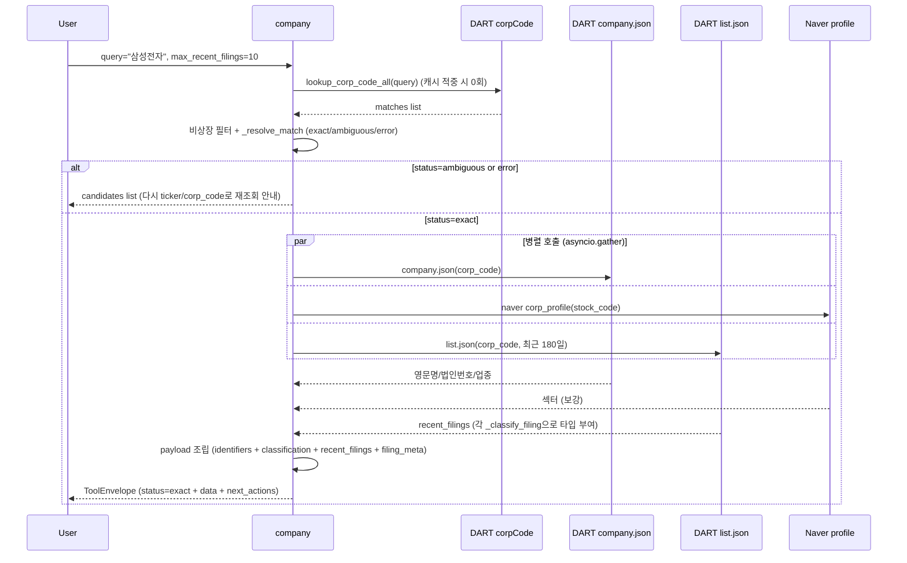

# company

## 한 줄 요약
기업 식별 + 최근 공시 인덱스 허브. 모든 v2 data tool의 공통 입구. 회사명/ticker/corp_code → 시장·업종·최근 공시 확인.

## 사용법
```
company(
    query="삼성전자",
    max_recent_filings=10,
    start_date="20260101",
    end_date="20260427",
)
```

자연어 예시:
- "삼성전자 식별자랑 최근 공시 보여줘" → `query="삼성전자"`
- "KT&G corp_code 확인" → `query="KT&G"` (약칭 + special char 매칭)

## 입력 인자
| 인자 | 타입 | 필수 | 설명 | 기본값 |
|---|---|---|---|---|
| query | str | yes | 회사명 / ticker / corp_code | - |
| max_recent_filings | int | no | 최근 공시 표시 수 (1-20) | 10 |
| start_date | str | no | YYYYMMDD, 미지정 시 자동 | "" |
| end_date | str | no | YYYYMMDD, 미지정 시 오늘 | "" |
| format | str | no | "md" / "json" | "md" |

## 출력 schema (data dict)
```json
{
  "company_id": "...",
  "canonical_name": "삼성전자(주)",
  "names": {"en": "Samsung Electronics", "aliases": [...]},
  "identifiers": {"ticker": "005930", "corp_code": "00126380",
                  "isin": "...", "jurir_no": "...", "bizr_no": "..."},
  "classification": {"market": "KOSPI", "sector_name": "...",
                     "induty_code": "...", "fiscal_month": "12"},
  "basic_info": {"ceo_name": "...", "established_date": "...",
                 "address": "...", "homepage": "..."},
  "recent_filings": [{"disclosure_date": "...", "filing_type": "...",
                      "report_name": "...", "filer_name": "...",
                      "rcept_no": "..."}],
  "recent_filings_window": {"start_date": "...", "end_date": "..."},
  "candidates": [...]    // status=ambiguous 시
}
```

핵심 필드:
- `status`: `exact` (정확 1건) / `ambiguous` (후보 N건) / `error` (식별 실패).
- 비상장 법인은 자동 제외 (OPM은 상장사 전용).
- `candidates`: ambiguous 시 후보 리스트 → ticker/corp_code 직접 입력으로 재조회.

## Data sources
- **DART API**: `corpCode.xml` (ZIP→XML, 모듈 글로벌 캐시), `company.json` (영문명/법인번호/업종코드), `list.json` (최근 공시).
- **Naver profile**: 업종·섹터 보강 보조 소스 (DART 공식값 덮어쓰기 금지).
- 외부 호출: 보통 2-4회 (corpCode 캐시 적중 시 1-2회).

## Flow



호출 횟수: corpCode 캐시 적중 시 2-3회 (company.json + naver + list.json). 캐시 미스 시 +1.

## 파싱 전략
- exact match 아니면 자동 확정 안 함 → `ambiguous` 반환 (사용자가 명확화).
- 동명 비상장 법인은 자동 제외 (warning).
- 회사 식별이 흔들리면 모든 후속 tool이 흔들리므로 `ambiguous` 처리와 `recent_filings` 인덱스가 핵심.
- regression 0 검증: 200기업 audit에서 `company.summary` exact 98.5% (193/196), error 1% (비상장 매핑 실패).

## 관련 공시 (rules/disclosures/)
- 해당 없음 (식별 카드 tool. 공시 본문 파싱은 후속 data tool 담당)

## 관련 개념 (rules/concepts/)
- 해당 없음

## 관련 결정 (decisions/)
- [[pblntf-ty-필터링]] — recent_filings 조회 시 pblntf_ty 필수
- [[free-paid-분리]] — MCP(public) + Pipeline(private) 2-repo 구조에서 식별자 일관성
- [[lessons-learned]] — 회사 식별 우선 + ambiguous 처리

## 관련 audit/fix (architecture/)
- [[260429_0912_audit_parsing-200기업-v2-no_filing]] — `company.summary` 98.5% exact (193/196 KOSPI 100 + KOSDAQ 96)

## 알려진 issue + TODO
- ISIN/jurir_no/bizr_no는 DART company.json에 없는 경우 비어 있음 (TODO: KIND·KRX 보강).
- 영문명/약칭 매칭 불안정 케이스 → ambiguous 후보 N건 반환 (사용자가 ticker로 재시도).
- recent_filings 기본 lookback이 자동 (start_date 비워두면 직전 N개월). 명시 권장.

## 변경 이력
- 2026-04-18: company tool 신설 (corp_identifier 후속, recent_filings + ISIN 보강)
- 2026-04-29: 200기업 v2 audit 통과 (98.5% exact)
- 2026-05-01: tool wiki 페이지 작성
