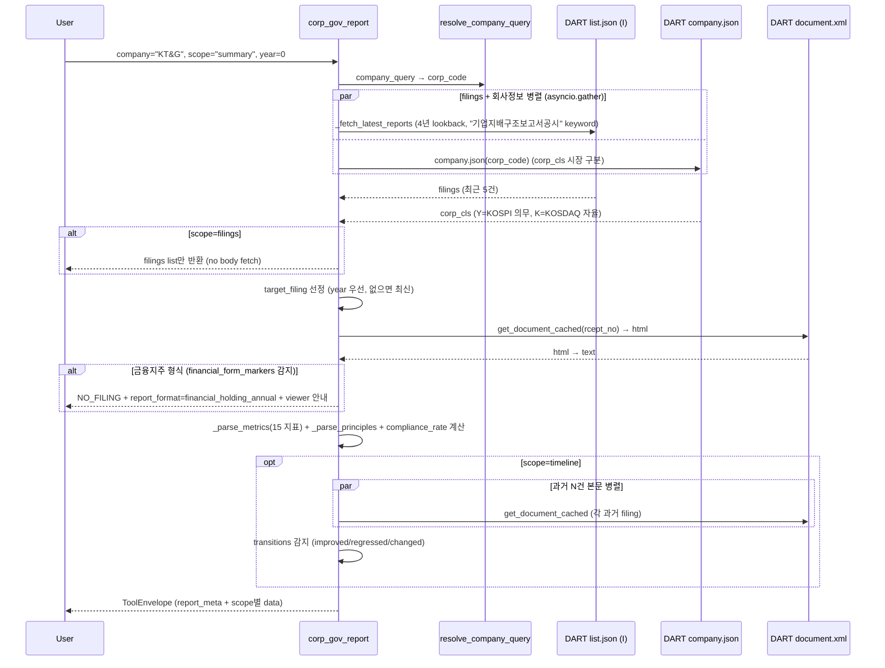

# corp_gov_report

## 한 줄 요약
기업지배구조보고서(거버넌스 종합 평가) data tool. 15개 핵심지표 준수 여부(O/X) + 세부원칙 응답 + 제출 이력 + 연도별 추이. 2026 제출분부터 KOSPI 전체 의무.

## 사용법
```
corp_gov_report(
    company="KT&G",
    scope="summary",
)
```

자연어 예시:
- "KT&G 거버넌스 준수율" → `scope="summary"` (KT&G 100%, POSCO홀딩스 100%)
- "삼성전자 15지표 상세 + 비고" → `scope="metrics"` (86.7% 준수)
- "현대차 연도별 준수율 추이" → `scope="timeline"` (improved/regressed/changed 감지)

## 입력 인자
| 인자 | 타입 | 필수 | 설명 | 기본값 |
|---|---|---|---|---|
| company | str | yes | 회사명 / ticker / corp_code | - |
| scope | str | no | 5종 (아래 참조) | "summary" |
| year | int | no | 사업연도 (예: 2023). 0이면 최신 | 0 |
| format | str | no | "md" / "json" | "md" |

scope:
- `summary`: 기업개요 + 준수율 + 15지표 ✅/❌ 요약 (기본)
- `metrics`: 15 지표 당기·직전기 + 비고 상세
- `principles`: 세부원칙별 응답 텍스트 (최대 30건)
- `filings`: 제출 이력 (lookback 4년)
- `timeline`: 연도별 준수율 추이 + 지표 전환 (improved / regressed / changed)

## 출력 schema (data dict)
```json
{
  "company_id": "...",
  "market": "KOSPI",
  "mandatory": true,
  "filings_count": N,
  "report_meta": {"rcept_dt": "...", "rcept_no": "...",
                  "reporting_period_end": "...",
                  "compliance_rate": 86.7,
                  "metrics_compliant": 13, "metrics_non_compliant": 2,
                  "metrics_parsed_count": 15},
  "company_overview": {"max_shareholder": "...",
                       "max_shareholder_pct": "...",
                       "minority_shareholder_pct": "...",
                       "industry": "...", "main_products": "...",
                       "corporate_group": "...",
                       "revenue_current": "...",
                       "operating_income_current": "...",
                       "net_income_current": "...",
                       "total_assets_current": "..."},
  "metrics_summary": [...],
  "metrics": [{"label": "...", "current": "O|X|-",
               "prior": "O|X|-", "note": "..."}],
  "principles": [...],
  "filings": [...],
  "timeline": [...],
  "transitions": [{"label": "...", "direction": "improved|regressed|changed",
                   "from_dt": "...", "from_val": "...",
                   "to_dt": "...", "to_val": "..."}],
  "no_filing": false,
  "filing_count": N,
  "report_format": "financial_holding_annual" (금융지주만),
  "usage": {"dart_api_calls": N, "mcp_tool_calls": 1}
}
```

핵심 필드:
- `compliance_rate`: 15지표 준수율 (%)
- `transitions`: 연도간 지표 변화 (regression 자동 감지 = 거버넌스 리스크 조기 경보)
- 의무 범위 (2026~ KOSPI 전체, KOSDAQ 자율, 제출 시한 매년 5월말)

## Data sources
- **DART API**: `list.json` (pblntf_ty=I) + 키워드 "기업지배구조보고서공시" → 원문 다운로드 (`get_document_cached`) + BeautifulSoup 텍스트 추출
- 전용 구조화 API 없음.
- KIND/Naver 미사용. PDF 미수행 (HTML 본문만).
- 외부 호출: 1-2회 (timeline은 최근 5건 순차).

## Flow



호출 횟수: summary는 3-4회 (list + company + document). timeline은 +N (과거 filing 본문). filings scope는 2회만.

## 파싱 전략
- 키워드 엄격화: `"기업지배구조보고서공시"` (금융지주 "연차보고서" 등 다른 서식 제외)
- 15개 표준 지표 라벨 prefix(25자) 매칭 → 블록별 O/X 2개(당기·직전) + 비고 텍스트 동적 수집
- 비고 0개~다수 모두 대응 (삼성: 비고 없음 / SK하이닉스: 일부 비고 / 현대차: 매건 비고)
- 금융회사 별도 형식 분리 (`_FINANCIAL_FORM_MARKERS`):
  - "금융회사 지배구조 연차보고서" / "지배구조 및 보수체계 연차보고서" 감지 시 → NO_FILING + `report_format = "financial_holding_annual"` 메타
  - PDF 첨부 직접 확인 안내 (next_actions)
- 알려진 한계:
  - 세부원칙 파싱 정교화 미완 (현재 원칙명 매칭 단순, 누락 다수).
  - 2022/2023년 구 서식 일부 미지원.
- regression 0 검증: 9/10 15/15 파싱 성공 (KB금융은 의도적 skip). 200기업 audit `corp_gov_report.summary` 48.0% exact (94/196), no_filing 41.8% (KOSDAQ 자율 미제출), partial_failure 9.2% (18건) → 금융지주 fix 후 partial 0.

## 관련 공시 (rules/disclosures/)
- [[기업지배구조보고서]] — DART+KIND, KOSPI 전체 의무(2026년~), 15 핵심지표

## 관련 개념 (rules/concepts/)
- [[집중투표]] — 15 지표 중 9번 (집중투표제 채택)
- [[감사위원-의결권-제한]] — 감사기구 4개 지표 관련
- [[의결권]] — 주주 5개 지표 관련
- [[정관변경]] — 거버넌스 정책 변경 trigger
- [[보수한도]] — 이사회 거버넌스

## 관련 결정 (decisions/)
- [[BeautifulSoup-파서-선택]] — lxml 채택
- [[XML-vs-PDF]] — HTML 본문만 (PDF 첨부 미수행)
- [[cross-domain-체이닝]] — CGR → AGM (주총 운영) / OWN (지배구조) / PRX (분쟁 맥락) 체이닝

## 관련 audit/fix (architecture/)
- [[260422_0005_audit_parsing-14scope-15기업]] — 14 scope x 15 기업 + corp_gov_report 포함
- [[260429_0912_audit_parsing-200기업-v2-no_filing]] — corp_gov_report.summary 48.0% exact, partial 9.2%
- [[260429_0942_fix_corp_gov_report-financial-holding]] — 금융지주 18건 partial → 0 (financial_form 감지, regression 0)

## 알려진 issue + TODO
- 세부원칙 파싱 정교화 (TODO).
- 2022/2023년 구 서식 추가 대응 (TODO).
- ESG 평가등급 연동 (KCGS, 서스틴베스트 외부 데이터, TODO).
- 금융회사 PDF 본문 파싱 (OEK PDF parser fallback 검토, TODO).

## 변경 이력
- 2026-04-22: corp_gov_report tool 신설 (15 → 16번째 tool, Data 11개째)
- 2026-04-22: 9/10 15/15 파싱 성공 (v1 7/15 → v2 15/15 개선)
- 2026-04-22: 의무 범위 정정 (2024 자산 5천억+ → 2026 KOSPI 전체)
- 2026-04-29: 금융지주 형식 분리 (partial 18건 → 0, regression 0)
- 2026-04-29: timeline scope 추가 (transitions 자동 감지)
- 2026-05-01: tool wiki 페이지 작성
