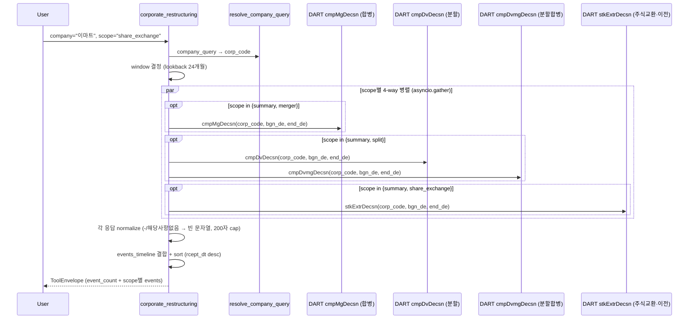

# corporate_restructuring

## 한 줄 요약
지배구조 재편 4종(회사합병/분할/분할합병/주식교환·이전) 결정 공시 통합. 합병비율, 상대방, 신주발행, 외부평가, 주식매수청구권 등 핵심 수치 정형화.

## 사용법
```
corporate_restructuring(
    company="이마트",
    scope="share_exchange",
)
```

자연어 예시:
- "이마트 share exchange 결정 (신세계건설/푸드 100% 자회사)" → `scope="share_exchange"`
- "감성코퍼레이션 분할" → `scope="split"` (단순물적분할)
- "일동제약 합병" → `scope="merger"`

## 입력 인자
| 인자 | 타입 | 필수 | 설명 | 기본값 |
|---|---|---|---|---|
| company | str | yes | 회사명 / ticker / corp_code | - |
| scope | str | no | 4종 (아래 참조) | "summary" |
| start_date / end_date | str | no | YYYYMMDD | "" (24개월 lookback) |
| format | str | no | "md" / "json" | "md" |

scope:
- `summary`: 4종 통합 timeline (기본)
- `merger`: 합병 카드 (비율, 상대방, 외부평가, 매수청구권, 풋옵션)
- `split`: 분할 + 분할합병 카드 (분할형태, 존속회사, 신설회사 재상장)
- `share_exchange`: 주식교환·이전 카드 (교환비율, 대상회사, 일정)

## 출력 schema (data dict)
```json
{
  "company_id": "...",
  "event_count": {"merger": N, "split": N,
                  "division_merger": N, "share_exchange": N},
  "events_timeline": [{"rcept_dt": "...", "event_label": "...",
                       "counterparty_or_new_entity": "...",
                       "ratio": "...", "rcept_no": "..."}],
  "merger_events": [{"rcept_dt": "...", "ratio": "...",
                     "new_shares_common": ..., "counterparty": {...},
                     "external_evaluator": "...",
                     "appraisal_right_price": "...",
                     "put_option_applicable": "...", "purpose": "..."}],
  "split_events": [{"split_form": "...", "transferred_business": "...",
                    "surviving_company": {...}, "new_company": {...}}],
  "share_exchange_events": [{"exchange_kind": "...", "ratio": "...",
                             "target_company": {...}, "schedule": {...}}],
  "no_filing": false,
  "filing_count": N,
  "usage": {"dart_api_calls": N, "mcp_tool_calls": 1}
}
```

핵심 필드:
- 합병: `mg_rt`, `mgptncmp_*` (상대방 재무), `aprskh_plnprc` (매수청구권), `popt_ctr_*` (풋옵션)
- 분할: `dv_trfbsnprt_cn` (분할대상 사업), `dvfcmp_rlst_atn` (신설회사 재상장 여부)
- 주식교환: `extr_sen` (교환/이전), `extr_tgcmp_*` (대상회사), `extrsc_*` (일정)

## Data sources
- **DART API** (병렬 4개):
  - `cmpMgDecsn.json` 회사합병 (apiId 2020050)
  - `cmpDvDecsn.json` 회사분할 (apiId 2020051)
  - `cmpDvmgDecsn.json` 회사분할합병 (apiId 2020052)
  - `stkExtrDecsn.json` 주식교환·이전 (apiId 2020053)
- KIND/Naver 미사용. PDF/원문 파싱 없음 (API 응답만 정규화).
- 외부 호출: 4-5회 (asyncio.gather 병렬). 기본 lookback 24개월.

## Flow



호출 횟수: scope=summary는 4회 병렬. scope=split만 2회 (분할+분할합병). 본문 파싱 없음.

## 파싱 전략
- DART 주요사항보고서(DS005) 4개 구조화 API 사용. 모두 병렬 호출.
- API 응답 정규화: `-`, `해당사항없음` → 빈 문자열.
- 긴 텍스트 필드 (`mg_rt_bs`, `mg_pp`, `extr_pp`) 200자 제한.
- evidence_refs 최대 5건.
- 알려진 한계:
  - PDF/원문 파싱 미수행 (정형 API 응답만 정규화).
  - 단일 회사가 같은 scope에서 여러 사건 가능 (이마트 share_exchange = 2건).
- regression 0 검증: 5/5 통과 (온코크로스/일동제약/감성코퍼레이션/이마트/신세계푸드). 200기업 audit `corporate_restructuring.summary` 14.8% exact, no_filing 84.2% (M&A 빈도 낮음, 정상).

## 관련 공시 (rules/disclosures/)
- [[회사합병결정]] — DS005, `cmpMgDecsn`, 합병비율·상대방·매수청구권
- [[회사분할결정]] — DS005, `cmpDvDecsn`, 분할형태·신설/존속회사
- [[회사분할합병결정]] — DS005, `cmpDvmgDecsn`, 분할 + 합병 동시 결정
- [[주식교환·이전결정]] — DS005, `stkExtrDecsn`, 지주회사 전환 도구

## 관련 개념 (rules/concepts/)
- [[지분구조]] — 합병·분할 후 영향
- [[동일인]] — 그룹 내 재편 시 동일인 변경 가능

## 관련 결정 (decisions/)
- [[pblntf-ty-필터링]] — DS005 코드 사용
- [[cross-domain-체이닝]] — CORP → OWN (지분 변화) / AGM (관련 주총) 체이닝

## 관련 audit/fix (architecture/)
- [[260429_0912_audit_parsing-200기업-v2-no_filing]] — corporate_restructuring 14.8% exact (no_filing 84.2% 정상)

## 알려진 issue + TODO
- 물적분할 후 재상장 패턴(`dvfcmp_rlst_atn=예`) 자동 경보 추가 검토 (LG화학 → LG에너지솔루션 사례).
- 외부평가 기관 신뢰도 매트릭스 (TODO).
- screen_events에 `merger_decision`/`split_decision`/`share_exchange_decision` event_type 추가 가능 (TODO).

## 변경 이력
- 2026-04-21: corporate_restructuring tool 신설 (12 → 13번째 tool, Data 8개째)
- 2026-04-21: 5/5 전수조사 통과
- 2026-04-29: 200기업 audit 14.8% exact (no_filing 84.2% 정상)
- 2026-05-01: tool wiki 페이지 작성
