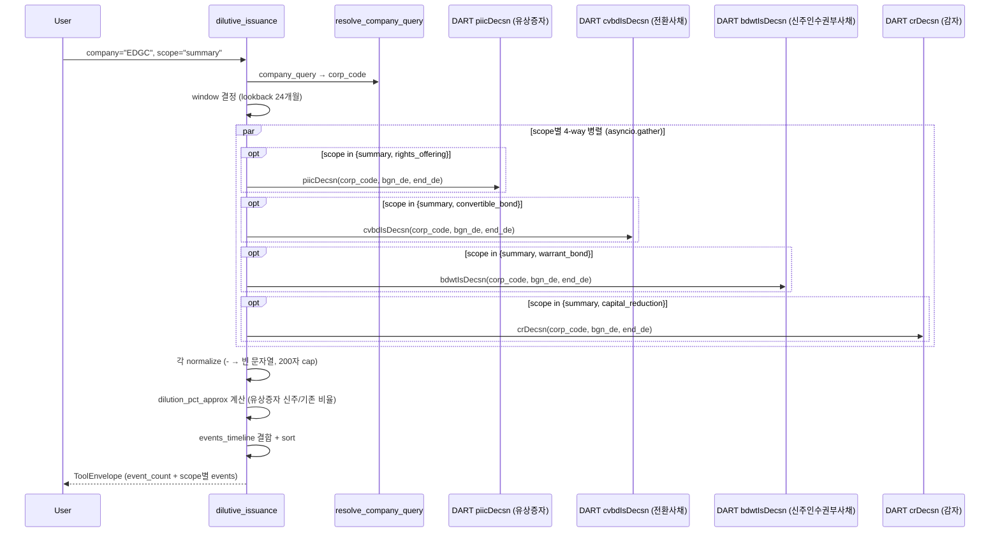

# dilutive_issuance

## 한 줄 요약
희석성 증권 발행 4종(유상증자/CB/BW/감자) 결정 통합. 발행조건, 잠재 희석률, 3자배정 여부, 풋옵션, refixing 조항 같은 분석 핵심 수치 정형화.

## 사용법
```
dilutive_issuance(
    company="EDGC",
    scope="summary",
)
```

자연어 예시:
- "EDGC 희석성 증권 (회생기업 패턴: 유상증자+CB+BW+감자)" → `scope="summary"`
- "하이퍼코퍼레이션 CB 잠재 희석" → `scope="convertible_bond"` (44.69% 심각)
- "나무기술 BW 발행조건" → `scope="warrant_bond"`

## 입력 인자
| 인자 | 타입 | 필수 | 설명 | 기본값 |
|---|---|---|---|---|
| company | str | yes | 회사명 / ticker / corp_code | - |
| scope | str | no | 5종 (아래 참조) | "summary" |
| start_date / end_date | str | no | YYYYMMDD | "" (24개월 lookback) |
| format | str | no | "md" / "json" | "md" |

scope:
- `summary`: 4종 통합 timeline (기본)
- `rights_offering`: 유상증자 카드 (배정방식, 희석률, 자금목적, 보호예수)
- `convertible_bond`: CB 카드 (전환가, 잠재 희석률, refixing, 풋옵션)
- `warrant_bond`: BW 카드 (행사가, 분리/비분리, 대용납입, 잠재 희석)
- `capital_reduction`: 감자 카드 (비율, 사유, 자본금 변화, 일정)

## 출력 schema (data dict)
```json
{
  "company_id": "...",
  "event_count": {"rights_offering": N, "convertible_bond": N,
                  "warrant_bond": N, "capital_reduction": N},
  "events_timeline": [{"rcept_dt": "...", "event_label": "...",
                       "headline_metric": "...", "rcept_no": "..."}],
  "rights_offering_events": [{"issuance_method": "...",
                              "new_shares_common": ...,
                              "dilution_pct_approx": ...,
                              "fund_purpose": {...}, "lock_up": {...}}],
  "convertible_bond_events": [{"bond_series": "...",
                               "total_issue_amount": "...",
                               "conversion": {"price": "...",
                                              "shares_if_converted": ...,
                                              "pct_of_total_shares": ...,
                                              "refixing_floor": "..."}}],
  "warrant_bond_events": [{"warrant": {"exercise_price": "...",
                                       "detachable": "...",
                                       "pct_of_total_shares": ...}}],
  "capital_reduction_events": [{"reduction_ratio_common": "...",
                                "shares_reduced_common": ...,
                                "method": "...", "reason": "..."}],
  "no_filing": false,
  "filing_count": N,
  "usage": {"dart_api_calls": N, "mcp_tool_calls": 1}
}
```

핵심 지표:
- `dilution_pct_approx` (유상증자): 신주/기존 단순 비율 (근사, 원본 공시에 없어서 계산)
- `pct_of_total_shares` (CB/BW): DART 제공 필드, 발행주식 총수 대비 전환·행사 시 신주 비율
- `refixing_floor`: 시가 하락 시 전환가 하한 (낮을수록 희석 위험 증가)

## Data sources
- **DART API** (병렬 4개):
  - `piicDecsn.json` 유상증자
  - `cvbdIsDecsn.json` 전환사채 (CB)
  - `bdwtIsDecsn.json` 신주인수권부사채 (BW)
  - `crDecsn.json` 감자
- KIND/Naver 미사용. 본문 파싱 없음 (API 응답만 정규화).
- 외부 호출: 4-5회 (asyncio.gather 병렬). 기본 lookback 24개월.

## Flow



호출 횟수: scope=summary는 4회 병렬. 단일 scope는 1회. 본문 파싱 없음.

## 파싱 전략
- DART 주요사항보고서(DS005) 4개 구조화 API. 모두 병렬 호출.
- API 응답 정규화: `-`, `해당사항 없음` → 빈 문자열.
- 긴 텍스트 필드 (`mg_rt_bs`, `ex_prc_dmth`) 200자 제한.
- 알려진 한계:
  - 유상증자 `dilution_pct_approx`는 단순 근사 (정확한 희석률은 자사주 차감 등 보정 필요).
  - 제3자배정 대상자 명세는 본문 파싱 미수행 (TODO).
- regression 0 검증: 5/5 통과 (EDGC summary 7건 / 하이퍼코퍼레이션 CB / 나무기술 BW / EDGC rights 272% / EDGC capital_reduction 83.33%). 200기업 audit `dilutive_issuance.summary` 26.5% exact, no_filing 72.4% (사건 빈도 낮음 정상).

## 관련 공시 (rules/disclosures/)
- [[유상증자결정]] — DS005, 배정방식·신주 수·희석률
- [[전환사채발행결정]] — DS005, 전환가·잠재 희석·refixing
- [[신주인수권부사채발행결정]] — DS005, 행사가·분리형·대용납입
- [[감자결정]] — DS005, 감자비율·사유·일정

## 관련 개념 (rules/concepts/)
- [[지분구조]] — 3자배정 시 최대주주 변경 가능
- [[경영권-방어]] — CB/BW 사모 발행 → 우호 인수자에게 잠재 지분 부여

## 관련 결정 (decisions/)
- [[pblntf-ty-필터링]] — DS005 코드 사용
- [[cross-domain-체이닝]] — DIL → OWN (3자배정 지분 변동) / CORP (M&A 자금조달) / PRX (분쟁 자금조달) 체이닝

## 관련 audit/fix (architecture/)
- [[260429_0912_audit_parsing-200기업-v2-no_filing]] — dilutive_issuance.summary 26.5% exact (no_filing 72.4%)

## 알려진 issue + TODO
- 제3자배정 대상자 명세 본문 파싱 (TODO, phase 2).
- 감자 + 유상증자 세트 패턴 자동 감지 (TODO, EDGC 패턴 = 자본잠식 해소 → 3자배정 → 최대주주 변경).
- screen_events에 `rights_offering_decision`/`convertible_bond_decision` event_type 추가 (TODO).

## 변경 이력
- 2026-04-21: dilutive_issuance tool 신설 (13 → 14번째 tool, Data 9개째)
- 2026-04-21: 5/5 전수조사 통과
- 2026-04-29: 200기업 audit 26.5% exact (no_filing 72.4% 정상)
- 2026-05-01: tool wiki 페이지 작성
