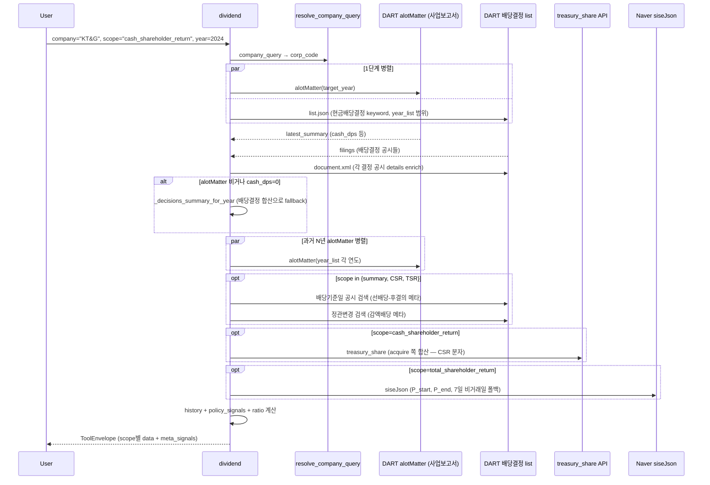

# dividend

## 한 줄 요약
실지급·확정된 배당 사실 탭. DPS, 총액, 배당성향, 시가배당률, 추이, CSR(한국식 배당+자사주 매입) + TSR(글로벌 주가+배당). 미래 정책·약속 X.

## 사용법
```
dividend(
    company="KT&G",
    scope="cash_shareholder_return",
    year=2024,
)
```

자연어 예시:
- "KT&G 한국식 환원율 2024" → `scope="cash_shareholder_return"` → CSR 92.21%
- "삼성전자 글로벌 TSR 2024" → `scope="total_shareholder_return"` → TSR -31.35%
- "메리츠금융지주 최근 3년 배당 추이" → `scope="history"`

## 입력 인자
| 인자 | 타입 | 필수 | 설명 | 기본값 |
|---|---|---|---|---|
| company | str | yes | 회사명 / ticker / corp_code | - |
| scope | str | no | 6종 (아래 참조) | "summary" |
| year | int | no | 사업연도, 0이면 최신 | 0 |
| years | int | no | history scope 누적 연수 | 3 |
| start_date / end_date | str | no | YYYYMMDD | "" |
| format | str | no | "md" / "json" | "md" |

scope:
- `summary`: 연간 DPS + 배당성향 + 시가배당률 + meta_signals (선배당-후결의, 감액배당) (기본)
- `detail`: 요약 + 최근 결정 10건
- `history`: 최근 N년 추이 (DPS / payout / yield / pattern)
- `policy_signals`: 분기배당·특별배당 패턴
- `cash_shareholder_return`: CSR (한국식, 배당+자사주 매입 / 지배주주 당기순이익)
- `total_shareholder_return`: TSR (글로벌, (P_end - P_start + DPS) / P_start)

## 출력 schema (data dict)
```json
{
  "company_id": "...",
  "summary": {"cash_dps": 1668, "cash_dps_preferred": null,
              "total_amount_mil": 11107906, "payout_ratio_dart": 25.1,
              "yield_dart": 1.5,
              "pre_dividend_post_resolution": false,
              "capital_reserve_reduction": false},
  "latest_decisions": [...],
  "policy_signals": {"trend": "...", "has_quarterly_pattern": true,
                     "has_special_dividend": false, "latest_change_pct": -3.2},
  "history": [{"year": 2024, "annual_dps": 1444, "decision_count": 4,
               "payout_ratio": 25.1, "yield_pct": 1.5, "pattern": "..."}],
  "cash_shareholder_return": {"csr_pct": 92.21, "definition": "...",
                              "dividend_total_krw": ..., "buyback_total_krw": ...,
                              "cash_return_total_krw": ..., "net_income_krw": ...,
                              "ratio_status": "computed",
                              "components": {...}, "acquisition_rows": [...]},
  "total_shareholder_return": {"tsr_pct": 25.98, "definition": "...",
                               "components": {"price_start_krw": 89300,
                                              "price_end_krw": 107100,
                                              "dps_total_krw": 5400,
                                              "price_change_pct": 19.93,
                                              "dividend_yield_pct": 6.05},
                               "ratio_status": "computed",
                               "sources": {"price": "naver", "dps": "alotMatter"}},
  "no_filing": false,
  "filing_count": N,
  "usage": {"dart_api_calls": N, "mcp_tool_calls": 1}
}
```

핵심 필드:
- **CSR vs TSR 분리**: CSR(회사 회계, 분모=지배주주 당기순이익) vs TSR(투자자 1주 수익률, 분모=P_start). 같은 "주주환원" 단어지만 정의 다름.
- `ratio_status`: `computed` / `denominator_zero_or_unknown` / `negative_net_income` / `missing_price_data`
- meta_signals: 선배당-후결의 (2024 신법), 감액배당 cross-link (자본준비금 감소)

## Data sources
- **DART API**: `alotMatter` (사업보고서, 1차 source), `현금ㆍ현물배당결정` 공시 합산 (alotMatter 비거나 cash_dps=0일 때 fallback)
- **treasury_share API**: `tsstkAqDecsn` (CSR 분자, 매입 acquire 시점 — 소각 retire 아님)
- **Naver Finance**: `siseJson` (TSR P_start/P_end, 7일 비거래일 자동 폴백)
- **KRX Open API**: 시세 fallback
- 외부 호출: scope별 1-3회. CSR은 4-5회 (treasury 합산), TSR은 3-4회 (Naver 시세)

## Flow



호출 횟수: scope별 2-7회. CSR은 +treasury_share, TSR은 +Naver 시세 2회.

## 파싱 전략
- source of truth 2단:
  1. `alotMatter` (사업보고서 배당 요약) — 완료 사업연도 공식 값
  2. `현금ㆍ현물배당결정` 공시 합산 — alotMatter가 비거나 cash_dps=0일 때 fallback (예: 메리츠금융지주)
- CSR 분자 정정 (T22 → T23):
  - T22: 자사주 소각(retire) 사용 — 잘못 (이중 계산 / 시점 어긋남)
  - T23: 자사주 매입(acquire) 사용 — 정정 (이사회 결의 시점 현금 유출)
  - 검증: KT&G 119.23% → 92.21%, 삼성전자 2024 29.18% → 38.10%, 2025 31.98% → 40.71%
- [기재정정] dedupe (board_date+amount+shares 키)
- 정책 예측·미래 약속 추가 금지 (그건 `value_up`)
- regression 0 검증: 200기업 audit `dividend.summary` 75.0% exact (147/196), no_filing 24.0% (47건, KOSDAQ 무배당 정상). 21지표 audit 통과.

## 관련 공시 (rules/disclosures/)
- [[현금배당결정]] — DPS / 기준일 / 시가배당률 (1차 source)
- [[주식배당결정]] — 1주당 배당주식수
- [[배당기준일결정]] — 선배당-후결의 시그널 (2024 신법)
- [[분기배당결정]] — 연간 DPS = 1Q+반기+3Q+결산
- [[감액배당결정]] — 자본준비금 감소 → 이익잉여금 전입 → 배당 (cross-link)
- [[배당공시유형]] — 배당 6종 통합 인덱스
- [[사업보고서]] — alotMatter 배당 요약
- [[자기주식취득결정]] — CSR 분자 source (acquire)

## 관련 개념 (rules/concepts/)
- [[배당성향]] — 배당금 총액 / 지배주주 귀속 당기순이익
- [[배당수익률]] — 주가 대비 배당금 비율
- [[시가배당률]] — DART 공식 (배당기준일 전전거래일 1주 평균)
- [[분기배당]] — 분기별 중간배당, DPS 합산 주의
- [[특별배당]] — 일회성, 추이 분석 시 정기와 분리
- [[감액배당]] — 자본준비금 감소 후 이익잉여금 전입
- [[자본준비금]] — 감액배당 전제 조건
- [[당기순이익]] — CSR 분모 (반드시 연결 지배주주 귀속)
- [[주주환원]] — CSR(한국식) vs TSR(글로벌) 정의 분리

## 관련 결정 (decisions/)
- [[배당공시유형]] — 배당 9종 + 자사주 5종 + 2026.03 신법 통합 비교
- [[DART-KIND-매핑-화이트리스트-2026-04]] — KIND whitelist 정책
- [[free-paid-분리]] — DPS 일관성
- [[cross-domain-체이닝]] — DIV → VUP / TRS 체이닝

## 관련 audit/fix (architecture/)
- [[260429_0912_audit_parsing-200기업-v2-no_filing]] — dividend.summary 75.0% exact
- [[260429_0216_fix_speed-optimization-9건]] — dividend 3x 속도 향상 (asyncio.gather)
- [[260429_0942_audit_arithmetic-21지표]] — 21개 산술 지표 검증 통과

## 알려진 issue + TODO
- alotMatter와 거래소 공시 수치 충돌 시 `requires_review`.
- 특별배당 비정형 금액 구조 → `requires_review`.
- 시가배당률 비고 + 가격 fallback 실패 시 `requires_review`.
- 이항(우선주) 배당은 `cash_dps_preferred`로 별도 노출.

## 변경 이력
- 2026-04-18: dividend tool 검증 + release_v2 go
- 2026-04-19: 3개 기업 (삼성전자 / KT&G / 메리츠금융지주) summary 통과
- 2026-04-29: CSR 분자 정정 (T22 retire → T23 acquire), TSR 신규 scope 추가
- 2026-04-29: 200기업 audit 75.0% exact (no_filing 분리)
- 2026-05-01: tool wiki 페이지 작성
