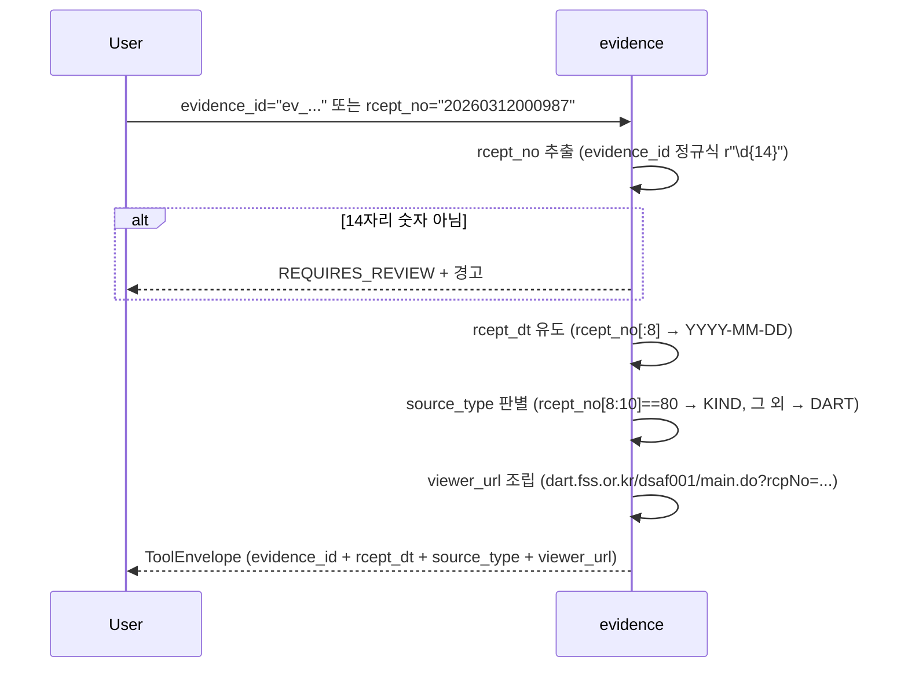

# evidence

## 한 줄 요약
인용 정보 제공자. rcept_no 문자열만으로 공시일·소스·뷰어 URL 유도. **API 호출 없음, 원문 스니펫 추출 없음** — 순수 메타 가공기.

## 사용법
```
evidence(rcept_no="20260312000987")
```

자연어 예시:
- "20260213800001 어디 공시인지 (DART/KIND), 언제, 뷰어 URL" → `rcept_no="20260213800001"` (KIND 80 포맷)
- "다른 tool 결과의 evidence_refs 출처 재확인" → 각 ref의 rcept_no 입력

## 입력 인자
| 인자 | 타입 | 필수 | 설명 | 기본값 |
|---|---|---|---|---|
| evidence_id | str | conditional | upstream evidence_refs의 ID | "" |
| rcept_no | str | conditional | 14자리 DART/KIND 접수번호 | "" |
| format | str | no | "md" / "json" | "md" |

(둘 중 1개 필수)

## 출력 schema (data dict)
```json
{
  "rcept_no": "...",
  "rcept_dt": "YYYY-MM-DD",
  "report_nm": "..." (upstream evidence_refs에 있을 때만),
  "source_type": "dart_xml|dart_html|dart_api|kind_html|naver|internal",
  "viewer_url": "https://dart.fss.or.kr/dsaf001/main.do?rcpNo=..."
}
```

핵심 필드:
- `rcept_no[:8]` → `rcept_dt` (YYYY-MM-DD)
- `rcept_no[8:10] == "80"` → KIND 수시공시, 그 외 → DART
- `viewer_url`: DART 뷰어로 통일 (80 포맷도 DART 뷰어에서 정상 렌더링됨)
- 14자리 숫자 아니면 `requires_review`

## Data sources
- **외부 호출 0회**. 순수 문자열 가공.
- DART 뷰어 URL 자동 생성 (`dart.fss.or.kr/dsaf001/main.do?rcpNo={rcept_no}`)
- KIND 원문 URL은 직접 접근 시 404 오류 → 2026-04-21부터 사용 중단, DART 뷰어로 통일

## Flow



호출 횟수: 0회 (외부 호출 없음, 순수 문자열 가공).

## 파싱 전략
- rcept_no 문자열만으로 즉시 유도 가능한 정보만 반환.
- evidence_id에 rcept_no 패턴 (14자리 숫자) 포함 시 자동 추출.
- `report_nm`은 upstream evidence_refs에만 있음 (생 rcept_no 입력 시 공란, viewer_url로 사용자 확인).
- 알려진 한계:
  - 원문 본문/스니펫 추출 안 함 (viewer_url로 직접 확인이 더 정확 — 표·각주 포함).
  - 14자리 숫자 아닌 경우 (예: "ABC") → `requires_review` + 경고.
- regression 0: API 호출 없는 순수 문자열 가공이라 실패 지점이 없음.

## 관련 공시 (rules/disclosures/)
- 해당 없음 (모든 공시 universal evidence)

## 관련 개념 (rules/concepts/)
- 해당 없음

## 관련 결정 (decisions/)
- [[DART-KIND-매핑-화이트리스트-2026-04]] — DART vs KIND source_type 분기 규칙
- [[lessons-learned]] — 결론과 근거 분리 안전장치

## 관련 audit/fix (architecture/)
- [[260429_0912_audit_parsing-200기업-v2-no_filing]] — evidence는 API 호출 0회라 별도 매트릭스 없음 (모든 data tool의 evidence_refs에서 사용)

## 알려진 issue + TODO
- KIND 원문 URL 직접 접근 단절 (2026-04-21~) → DART 뷰어로 통일 (영향 없음, 정상 렌더링).
- evidence_id에 rcept_no 패턴이 없는 경우 → `requires_review`.
- 본문 스니펫 추출은 정책상 미수행 (사용자 viewer 직접 확인 권장).

## 변경 이력
- 2026-04-18: evidence tool 검증 + release_v2 go (API 0회 / 실패 지점 없음)
- 2026-04-21: KIND viewer URL 사용 중단, DART 뷰어로 통일
- 2026-05-01: tool wiki 페이지 작성
