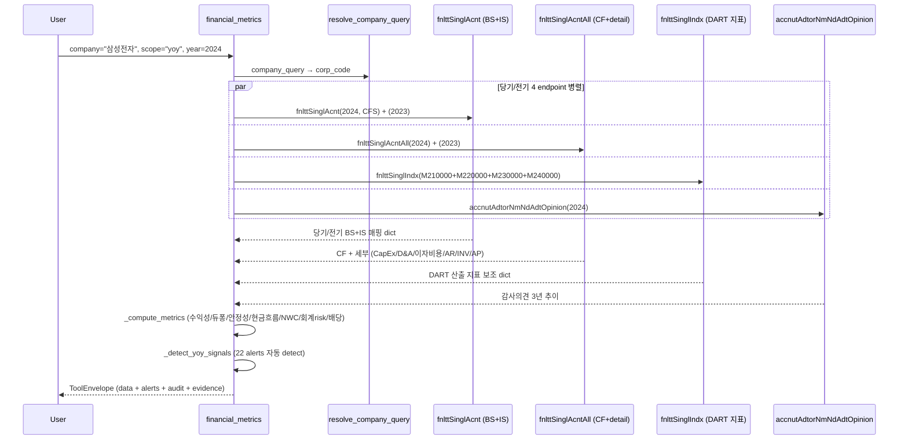

# financial_metrics

## 한 줄 요약
DART 재무 4 endpoint 통합 — 수익성/안정성/현금흐름/회계 risk 지표. 한국 표준(연결, 지배주주 귀속). 듀퐁 3단 분해, FCF, NWC, accruals_gap, 감사의견 추이 자동 산출.

## 사용법
```
financial_metrics(
    company="삼성전자",
    scope="yoy",
    year=2024,
)
```

자연어 예시:
- "롯데케미칼 2024 yoy 분석" → `scope="yoy"` → operating_loss + interest_coverage_low + negative_fcf alerts
- "SK하이닉스 turnaround 검증" → `scope="yoy"` → turnaround alert
- "삼성전자 듀퐁 분해 + ROE 구성" → `scope="summary"` → ROE 13.07% = 16.63% × 0.62 × 1.27
- "오스템임플란트 5년 감사의견" → `scope="audit_opinion"`

## 입력 인자
| 인자 | 타입 | 필수 | 설명 | 기본값 |
|---|---|---|---|---|
| company | str | yes | 회사명 / ticker / corp_code | - |
| scope | str | no | 6종 (아래 참조) | "summary" |
| year | int | no | 사업연도, 0이면 최신 완료 사업연도 | 0 |
| years | int | no | yearly/audit_opinion 누적 연수 | 3 |
| consolidated | bool | no | True=CFS(연결, 한국 표준), False=OFS(별도) | True |
| format | str | no | "md" / "json" | "md" |

scope:
- `summary`: 1 사업연도 51개 핵심 지표 (수익성/듀퐁/안정성/현금흐름/운전자본/회계risk/배당유보/NAV)
- `yearly`: 최근 N년 추이 (revenue/op_profit/net_income/OPM/ROE/debt_ratio/CFO/FCF)
- `quarterly`: 최근 12분기 추이 (4Q × 3년 — Q1/Q2 반기/Q3/Q4 사업)
- `yoy`: 전년 대비 + 22개 alerts + 감사의견 cross-check
- `qoq`: 전분기 대비 (operating_loss_quarter / revenue_decline_qoq alerts)
- `audit_opinion`: 감사의견 3년 추이 (적정/한정/부적정/감사인 변경 추적)

## 출력 schema (data dict)
```json
{
  "company_id": "cmp_005930",
  "scope": "summary",
  "year": 2024,
  "fs_div": "CFS",
  "consolidated": true,
  "summary": {
    "revenue_krw": 300870903000000,
    "operating_profit_krw": 32725961000000,
    "operating_margin_pct": 10.88,
    "net_income_krw": 50048199000000,
    "ebitda_krw": 32725961000000,
    "ebitda_margin_pct": 10.88,
    "roe_pct": 13.07, "roa_pct": 10.31, "roic_pct": 6.15,
    "asset_turnover_ratio": 0.62, "equity_multiplier": 1.27, "roe_dupont_pct": 13.07,
    "debt_ratio_pct": 27.93, "current_ratio_pct": 243.30,
    "interest_coverage_ratio": 2.52, "net_cash_krw": 40518545000000,
    "cfo_krw": 72982621000000, "capex_krw": 51406355000000,
    "fcf_krw": 21576266000000, "fcf_margin_pct": 7.17,
    "cfo_to_op_ratio": 2.23,
    "working_capital_krw": 133735967000000, "nwc_krw": 83007761000000,
    "nwc_change_yoy_krw": 6054318000000, "nwc_to_revenue_pct": 27.59,
    "accruals_gap_pct": -123.01,
    "ar_to_revenue_pct": 14.50, "inv_to_revenue_pct": 17.20,
    "dividend_paid_krw": 10888749000000, "payout_ratio_pct": 21.76,
    "retained_earnings_krw": 370513188000000, "nav_krw": 402192070000000,
    "eps_krw": 4950, "diluted_eps_krw": 4950
  },
  "yoy": {"current": {...}, "prior": {...}, "alerts": ["accruals_red", "nwc_efficiency_low"],
          "audit_opinion": {"current": {...}, "prior": {...}}},
  "audit_opinion": {"opinions": [{"stlm_dt": "2024-12-31", "adt_opinion": "적정의견",
                                  "adtor": "삼정회계법인", "core_adt_matter": "..."}],
                    "summary": {"latest_opinion": "적정의견", "all_clean": true}},
  "no_filing": false, "filing_count": 1,
  "usage": {"dart_api_calls": 12, "mcp_tool_calls": 1}
}
```

핵심 필드:
- **단위 처리**: 모든 금액 raw KRW int (`_krw` suffix), %는 float (`_pct` 11.5 = 11.5%), 비율은 decimal (`_ratio` 0.85). render에서만 조/억 변환.
- **연결 default**: 한국 표준 = 연결 지배주주 귀속. `consolidated=False` 옵션으로 별도 가능.
- **분모 0/음수 graceful**: 적자 회사 ROE/배당성향 → None + warning. 분모 음수일 때 산출 안 함.

## yoy_signals (25개 alerts)
- **수익성**: `loss_conversion`, `operating_loss`, `turnaround`, `continued_loss`, `revenue_decline`
- **부채/유동성**: `debt_surge`, `interest_coverage_low`
- **자본잠식 (KOSDAQ 관리/폐지 사유)**: `capital_impairment_partial` (잠식률 0~50%), `capital_impairment_50plus` (50%+, KOSDAQ 관리종목 사유), `capital_impairment_full` (완전 자본잠식, 상장폐지 사유)
- **현금흐름**: `cfo_quality_red`, `negative_fcf`, `low_dividend_capacity_use`
- **운전자본**: `nwc_surge`, `nwc_efficiency_low`
- **듀퐁 분해**: `roe_driven_by_leverage`, `roe_decline_margin_driven`, `roe_decline_turnover_driven`
- **회계 risk**: `accruals_red`, `receivables_surge`, `inventory_surge`
- **감사의견**: `non_clean_audit_opinion`, `audit_opinion_change`
- **배당**: `dividend_halt`

### 자본잠식 정의 (한국 상법/거래소 기준)
- **자본금**: 발행주식수 × 액면가 (회사 설립 + 증자로 들어온 원금)
- **자본총계**: 자본금 + 자본잉여금 + 이익잉여금 (현재 회사가 보유한 순자산)
- **자본잠식**: 누적 적자로 이익잉여금이 음수가 되어 자본총계가 자본금보다 작아진 상태
- **잠식률**: (자본금 - 자본총계) / 자본금 × 100
- **trigger**:
  - 잠식률 50%↑ + 2년 연속: KOSDAQ 관리종목 지정
  - 완전 자본잠식 (자본총계 ≤ 0): KOSDAQ 상장폐지 사유 (KOSPI는 사업보고서 미공시 등 다른 trigger)

## Data sources
- **DART API 4 endpoint**:
  - `fnlttSinglAcnt` (단일회사 주요계정) — BS 9 + IS 5 = 14 핵심 행. 당기/전기/전전기 3년 단일 호출.
  - `fnlttSinglIndx` (주요 재무지표) — DART 산출 ROE/부채비율/EPS 등. idx_cl_code 4 그룹 (수익성/안정성/성장성/활동성) × 4 호출.
  - `fnlttSinglAcntAll` (전체 재무제표) — 213 행 (BS/IS/CIS/CF/SCE). CapEx, 감가상각비, 이자비용, 매출채권/재고/매입채무 추출.
  - `accnutAdtorNmNdAdtOpinion` (회계감사인+의견) — 6 행 (3년 × CFS+OFS). 감사인 / 적정의견 / 강조사항 / 핵심감사사항(KAM) / rcept_no.
- 외부 호출: scope별 4-12회. summary는 8-9회 (당기/전기 acnt + acntAll + indx 4그룹), yoy는 12-14회.

## Flow



호출 횟수: scope별 4-14회. yoy는 가장 많음 (당기/전기 모두 + 감사). audit_opinion만은 1회.

## 파싱 전략
- **account_nm 매칭**: 표준 키워드 패턴 9 BS + 5 IS + 13 detail (CF/Detail). 공백 무관 + 부분 일치.
- **금액 정규화** (`normalize_amount`):
  - 콤마 strip ("227,062,266,000,000" → 227062266000000)
  - 괄호 음수 ("(500)" → -500, T19 fix 패턴)
  - None / "-" / "" → None graceful
- **DART 응답 단위**: 표준 = 원 raw int, 일부 KOSDAQ은 백만원 단위 (`_unit` 메타로 자동 곱셈 — Phase 2)
- **연결 지배주주 귀속**: detail에 `controlling_interest_income` 있으면 우선 사용, 없으면 `당기순이익(손실)` 합계 fallback
- **평균자산/평균자본**: 당기 + 전기 BS 평균. 전기 데이터 없으면 기말 단독.
- **ROIC 근사**: NOPAT = 영업이익 × (1 - 0.22 평균법인세). 투하자본 = 자본 + 총차입.
- **DuPont 검증**: ROE = 순이익률 × 자산회전율 × 재무레버리지. roe_pct vs roe_dupont_pct 일치 확인용.

## 관련 공시 (rules/disclosures/)
- [[사업보고서]] — fnlttSinglAcnt 1차 source (연간)
- [[반기보고서]] — reprt_code=11012
- [[분기보고서]] — reprt_code=11013(1Q) / 11014(3Q)

## 관련 개념 (rules/concepts/)
- [[당기순이익]] — 한국 표준 = 연결 지배주주 귀속
- [[배당성향]] — 배당총액 / 지배주주 귀속 당기순이익
- [[ROE]] / [[ROA]] / [[ROIC]] — 수익성 3대 지표
- [[듀퐁분석]] — ROE = 순이익률 × 자산회전율 × 재무레버리지
- [[FCF]] — Free Cash Flow = CFO - CapEx
- [[NWC]] — 순운전자본 = 매출채권 + 재고 - 매입채무
- [[이자보상배율]] — 영업이익 / 이자비용
- [[순현금]] — 현금성자산 - 총차입금

## 관련 결정 (decisions/)
- [[open-proxy-guideline]] — 재무 risk 신호 (이자보상배율, FCF 음수 등) 채점에 사용
- [[cross-domain-체이닝]] — financial_metrics → vote_brief / corp_gov_report 체이닝 (Phase 2)

## 관련 audit/fix (architecture/audits/)
- [[260501_1820_audit_financial_metrics-6기업]] — 6 회사 sanity (status=exact 100%)

## 알려진 issue + TODO
- 일부 KOSDAQ 회사 백만원 단위 보고 — `_unit` 메타 자동 곱셈 (Phase 2)
- 감가상각비 (CF "비현금항목 가산") 패턴 일부 회사에서 매칭 안 됨 → EBITDA = 영업이익으로만 산출되는 케이스
- 이자비용 vs 금융비용 모호 — 일부 회사 금융비용에 환차손 포함 → 이자보상배율 underestimate
- 발행주식수는 별도 호출 필요 (BPS 산출 — Phase 2 stockTotqySttus 통합)
- vote_brief / 매트릭스 dim 자동 채점 통합 — **Phase 2 별도**

## 변경 이력
- 2026-05-01: financial_metrics tool Phase 1 신규 (DART 4 endpoint + 6 scope + 22 alerts)
- 2026-05-01: 6 회사 (삼성/KT&G/롯데케미칼/SK하이닉스/삼천당제약/오스템임플란트) sanity 통과
