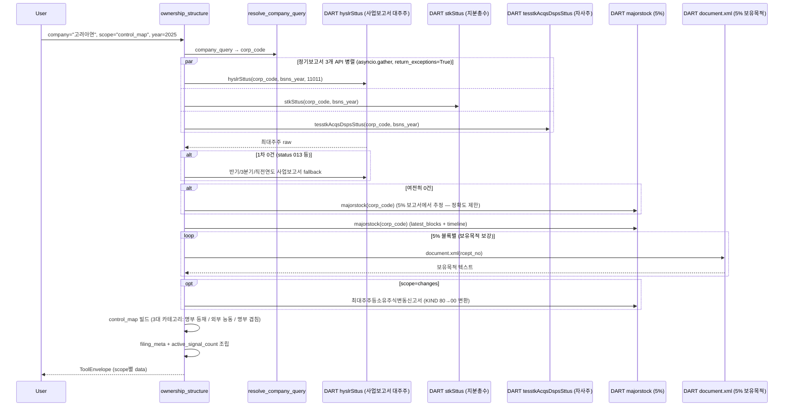

# ownership_structure

## 한 줄 요약
최대주주·특수관계인·5% 대량보유·자사주를 한 탭에서 보는 지분 구조 tool. 판의 구조(who holds what)를 그린다.

## 사용법
```
ownership_structure(
    company="고려아연",
    scope="control_map",
    year=2025,
)
```

자연어 예시:
- "고려아연 control map" → `scope="control_map"` (3대 카테고리: 명부 등재 / 외부 능동 / 수동)
- "삼성전자 5% 대량보유 타임라인" → `scope="timeline"`
- "최대주주등소유주식변동신고서 (개인별 변동)" → `scope="changes"`

## 입력 인자
| 인자 | 타입 | 필수 | 설명 | 기본값 |
|---|---|---|---|---|
| company | str | yes | 회사명 / ticker / corp_code | - |
| scope | str | no | 7종 (아래 참조) | "summary" |
| year | int | no | 사업연도, 0이면 최신 | 0 |
| as_of_date | str | no | YYYYMMDD 기준일 | "" |
| start_date / end_date | str | no | YYYYMMDD | "" |
| format | str | no | "md" / "json" | "md" |

scope:
- `summary`: 최대주주 + 특수관계인 + 자사주 + 5% signal count (기본)
- `major_holders`: 최대주주 + 특수관계인 상세
- `blocks`: 5% 대량보유 최신 N건 (보유목적 보강 포함)
- `treasury`: 자사주 잔액
- `control_map`: 3대 카테고리 (명부 등재 / 외부 능동 5% / 명부 겹침 5%)
- `timeline`: 5% 보고 이력 시계열
- `changes`: 최대주주등소유주식변동신고서 (KIND 원문 파싱, 개인별 변동)

## 출력 schema (data dict)
```json
{
  "company_id": "...",
  "summary": {"top_holder": {...}, "related_total_pct": 28.5,
              "treasury_shares": 0, "treasury_pct": 0.0,
              "active_signal_count": 3},
  "major_holders": [{"name": "...", "relation": "...",
                     "ownership_pct": 19.5, "shares": 11_111}],
  "blocks": [{"reporter": "...", "ownership_pct": 5.1,
              "purpose": "경영참여", "report_date": "...",
              "rcept_no": "..."}],
  "treasury": {"issued_shares": N, "treasury_shares": N,
               "treasury_pct": 0.0},
  "control_map": {"core_holder_block": {...}, "treasury_block": {...},
                  "active_non_overlap_blocks": [...],
                  "overlap_blocks": [...], "flags": {...},
                  "observations": [...]},
  "timeline": [...],
  "change_filings": [...],
  "no_filing": false,
  "filing_count": N,
  "usage": {"dart_api_calls": N, "mcp_tool_calls": 1}
}
```

핵심 필드:
- `flags`: `registry_majority` (50%+), `registry_over_30pct`, `treasury_over_5pct`
- `active_signal_count`: 5% 대량보유 + 경영참여 목적 신호 수 (분쟁 조기 경보)
- `change_filings.individual_changes`: 변경일/원인/주식종류/변경전/증감/변경후

## Data sources
- **DART API**: 사업보고서 (대주주 `hyslrSttus`, 지분 `stkSttus`, 자사주 `tesstkAcqsDspsSttus`), `majorstock` (5% 대량보유 목록), `document.xml` (5% 보유목적 보강)
- **KIND**: 미사용 (false match 위험) — 단, `changes` scope만 원문 파싱
- 외부 호출: scope별 1-3회, control_map은 5-7회 (asyncio.gather 병렬)

## Flow



호출 횟수: scope별 1-3회 (summary), control_map은 5-7회. fallback 발생 시 +2-3회.

## 파싱 전략
- 사업보고서 기반 DART 공식 API 우선.
- 5% 대량보유 목적은 최신 원문(document.xml)으로 보강.
- KIND 비사용 (false match 위험). partial match 자동 확정 안 함.
- `stock_knd` 변형 positive matching + 3-tier fallback (보통주/우선주 자사주 변형).
- 알려진 한계:
  - 대주주명 정규화 불완전 시 control_map이 찢어질 수 있음 (관찰 포인트로 표시).
  - 사업보고서 미제출(KOSDAQ 자율공시 일부) 시 `no_filing`.
- regression 0 검증: 200기업 audit `ownership_structure.summary` 90.8% exact (178/196), partial 7.7% (15건). stockknd fix 후 partial 17건 → 0.

## 관련 공시 (rules/disclosures/)
- [[대량보유상황보고서]] — 5% 변동, 보유목적/보유량 (blocks scope)
- [[임원·주요주주특정증권등소유상황보고서]] — 임원/10%+ 주주 보유 변동
- [[사업보고서]] — 정기, 대주주/지분/자사주 종합
- [[최대주주등소유주식변동신고서]] — KIND 원문, 개인별 변동 (changes scope)

## 관련 개념 (rules/concepts/)
- [[최대주주]] — 본인+특관인 합산 최다 보유자
- [[특수관계인]] — 최대주주와 혈연/계열 연결된 자
- [[대주주]] — 1%+ 또는 시총 10억+ 보유자
- [[동일인]] — 재벌 그룹 정점 (공정위 지정)
- [[5%-대량보유]] — 5% 이상 보유 시 보유목적 공시 의무
- [[자사주]] — 의결권 없는 자기주식
- [[소액주주]] — 유통주식 대부분 보유
- [[지분구조]] — 최대주주/기관/자사주/소액주주 분포

## 관련 결정 (decisions/)
- [[stkrt-vs-ctr_stkrt]] — DART 대량보유 API: stkrt(합산) vs ctr_stkrt(주요계약) 차이
- [[free-paid-분리]] — MCP / Pipeline 분리에서 지분구조 수치 일관성
- [[cross-domain-체이닝]] — OWN → AGM/PRX 체이닝
- [[lessons-learned]] — control_map 3대 카테고리 분리 lesson

## 관련 audit/fix (architecture/)
- [[260429_0912_audit_parsing-200기업-v2-no_filing]] — ownership_structure 90.8% exact
- [[260427_1145_fix_ownership-stockknd]] — 17건 partial → 0 (stock_knd 변형 positive matching + 3-tier fallback)
- [[260429_0216_fix_speed-optimization-9건]] — ownership 3x 속도 향상 (asyncio.gather)

## 알려진 issue + TODO
- 5% 보유목적이 `불명`으로 남는 경우 (원문 텍스트 추출 실패) — `requires_review`로 표시.
- 보고자명 정규화 불완전 케이스 control_map 분리. 동일인 매트릭스 도입 검토 (TODO).
- changes scope KIND 원문 파싱 시 일부 표 구조 변형은 `parse_error` 표시.

## 변경 이력
- 2026-04-18: ownership_structure tool 검증 + release_v2 go
- 2026-04-19: 3개 기업 (삼성전자 / 고려아연 / KT&G) summary 통과
- 2026-04-27: stockknd fix (17건 partial → 0)
- 2026-04-29: speed optimization 3x (asyncio.gather), 200기업 audit 90.8% exact
- 2026-05-01: tool wiki 페이지 작성
