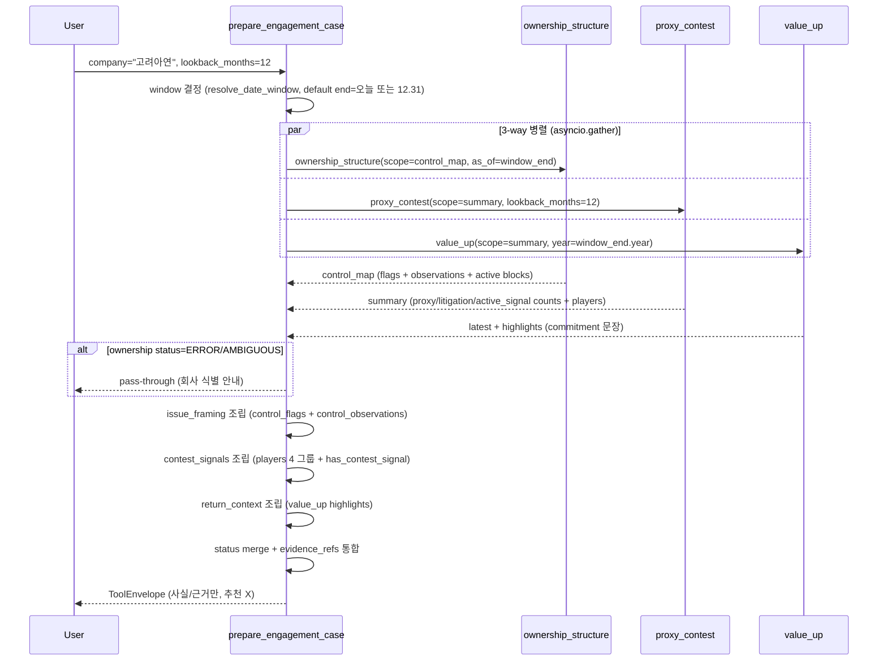

# prepare_engagement_case

## 한 줄 요약
engagement 메모 action tool. 지배구조 + 분쟁 신호 + 밸류업/주주환원 맥락을 한 장으로 묶음. **추천·처방 생성 X, 사실·근거만**.

## 사용법
```
prepare_engagement_case(
    company="고려아연",
    lookback_months=12,
)
```

자연어 예시:
- "고려아연 engagement case (지배구조+분쟁+밸류업)" → company만 지정
- "삼성전자 12개월 engagement 메모 (소액주주 캠페인 맥락)" → company + lookback_months
- "KT&G 주주활동 컨텍스트 (자사주 + 환원)" → company

## 입력 인자
| 인자 | 타입 | 필수 | 설명 | 기본값 |
|---|---|---|---|---|
| company | str | yes | 회사명 / ticker / corp_code | - |
| year | int | no | 사업연도 | 0 |
| start_date / end_date | str | no | YYYYMMDD | "" |
| lookback_months | int | no | 조사 구간 (개월) | 12 |
| format | str | no | "md" / "json" | "md" |

## 출력 schema (data dict)
```json
{
  "company_id": "...", "canonical_name": "...",
  "issue_framing": {"points": [...],
                    "control_flags": {"registry_majority": false,
                                      "registry_over_30pct": true,
                                      "treasury_over_5pct": false,
                                      "active_non_overlap_block_exists": true,
                                      "active_overlap_block_exists": false},
                    "control_observations": [...]},
  "contest_signals": {"summary": {"proxy_filing_count": N,
                                  "shareholder_side_count": N,
                                  "litigation_count": N,
                                  "active_signal_count": N,
                                  "has_contest_signal": true},
                      "players": {"company_side_filers": [...],
                                  "shareholder_side_filers": [...],
                                  "active_external_blocks": [...],
                                  "active_overlap_blocks": [...]},
                      "points": [...]},
  "return_context": {"latest": {"disclosure_date": "...",
                                "report_name": "...",
                                "rcept_no": "..."},
                     "filing_count": N,
                     "highlights": [...]},
  "key_flags": [...],
  "quality": {"ownership_status": "...", "proxy_status": "...",
              "value_up_status": "...",
              "proxy_has_contest_signal": true,
              "value_up_filing_count": N},
  "evidence_refs": [...]
}
```

핵심 필드:
- `control_flags`: 50%/30%/treasury>5%/external_active 4가지 boolean
- `players`: 회사측/주주측/외부 능동/명부 겹침 필러 리스트
- `highlights`: value_up 핵심 commitment 문장 (engagement 맥락)

## Data sources
- **upstream tool 호출** (병렬):
  - `ownership_structure` (control_map) — 지배구조 + 능동 5% 블록
  - `proxy_contest` (summary) — 위임장 + 소송 + 5% 시그널
  - `value_up` (commitments) — 주주환원 정책 + 자사주 이행
  - `evidence` (모든 evidence_refs)
- DART/KIND 직접 호출은 upstream tool에서 처리.
- 외부 호출: 5-7회 (병렬).

## Flow



호출 횟수: 3개 upstream tool 병렬 (외부 DART API 합산 7-15회).

## 파싱 전략
- 단정적 결론 문구 금지.
- upstream evidence 범위를 넘어가는 판단 금지.
- upstream이 `partial`/`requires_review`이면 그대로 반영.
- "현재 사실 + 근거"만 정리, "추천 / engagement 전략"은 사용자가 별도 작성.
- regression 0 검증: 200기업 audit 모든 upstream tool 통과.

## 관련 공시 (rules/disclosures/)
- [[위임장권유참고서류]] — proxy_contest source
- [[대량보유상황보고서]] — 5% 시그널 source
- [[기업가치제고계획]] — value_up commitment source

## 관련 개념 (rules/concepts/)
- [[지분구조]] — control_map flags
- [[5%-대량보유]] — active block 식별
- [[자사주]] — value_up 이행 검증
- [[주주환원]] — return_context highlights
- [[프록시-파이트]] — contest_signals

## 관련 결정 (decisions/)
- [[cross-domain-체이닝]] — OWN/PRX/VUP 통합
- [[free-paid-분리]] — public MCP action tool
- [[lessons-learned]] — 단정 금지 + evidence 추적성

## 관련 audit/fix (architecture/)
- [[260429_0912_audit_parsing-200기업-v2-no_filing]] — 모든 upstream tool 검증 통과

## 알려진 issue + TODO
- engagement 시나리오별 템플릿 (배당/소각/거버넌스/이사회 4가지 trigger, TODO).
- 외국 IR 수령자용 영문 출력 (TODO).
- 기관 LP 보고서 템플릿 별도 (TODO).

## 변경 이력
- 2026-04-18: prepare_engagement_case tool 검증 + release_v2 phase-2
- 2026-04-29: 200기업 audit 통과
- 2026-05-01: tool wiki 페이지 작성
