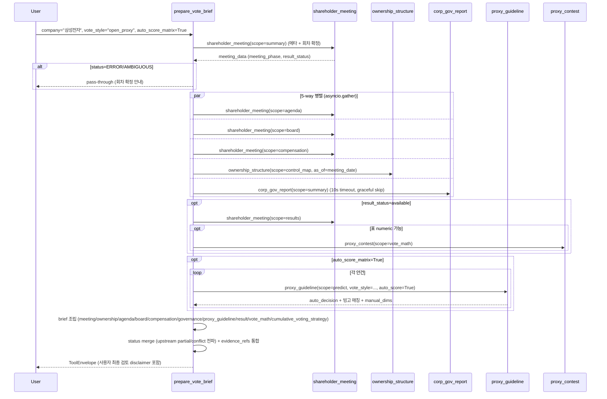

# prepare_vote_brief

## 한 줄 요약
투표 메모 action tool. 주총 회차 + 지분 구조 + 핵심 안건 + 후보자 + 보수 + 거버넌스 준수율 + OPM 정책 권고 + 결과를 한 장으로 묶음. **새 사실 생성 X, 근거만 재구성**.

## 사용법
```
prepare_vote_brief(
    company="삼성전자",
    meeting_type="auto",
    vote_style="open_proxy",
    auto_score_matrix=True,
)
```

자연어 예시:
- "삼성전자 2026 주총 vote brief (자동 채점 ON)" → `auto_score_matrix=True`
- "고려아연 임시주총 vote brief (미래에셋 정책)" → `meeting_type="extraordinary", vote_style="mirae_asset"`
- "KT&G OPM 정책 권고 (집중투표 사전 전략 포함)" → `vote_style="open_proxy"`

## 입력 인자
| 인자 | 타입 | 필수 | 설명 | 기본값 |
|---|---|---|---|---|
| company | str | yes | 회사명 / ticker / corp_code | - |
| meeting_type | str | no | "auto" / "annual" / "extraordinary" | "auto" |
| year | int | no | 사업연도 | 0 |
| start_date / end_date | str | no | YYYYMMDD | "" |
| lookback_months | int | no | 조사 구간 (개월) | 12 |
| vote_style | str | no | open_proxy / mirae_asset / samsung / samsung_active / truston / kim / align_partners / baring | "open_proxy" |
| auto_score_matrix | bool | no | True 시 12 매트릭스 100 dim 중 ~85 dim 자동 채점 | False |
| format | str | no | "md" / "json" | "md" |

## 출력 schema (data dict)
```json
{
  "company_id": "...", "canonical_name": "...",
  "meeting": {"summary": {...}},
  "ownership_context": {"summary": {...}, "control_map": {...}},
  "agenda_brief": {"titles": [...]},
  "board_brief": {"candidates": [...]},
  "compensation_brief": {"total_items": N,
                         "current_total_limit": ...,
                         "prior_total_paid": ...,
                         "prior_utilization": ...},
  "governance_brief": {"compliance_rate": 86.7,
                       "metrics_compliant": N, "metrics_non_compliant": N,
                       "non_compliant_labels": [...]},
  "proxy_guideline_brief": {"vote_style": "open_proxy",
                            "policy_meta": {...},
                            "categories_in_agenda": [...],
                            "agenda_recommendations": [
                              {"agenda_no": "1",
                               "category_ko": "...",
                               "policy_default": "...",
                               "auto_score": {"decision": "for|against|review",
                                              "raw_score": N, "max_score": 16,
                                              "red_count": N,
                                              "triggered_pattern_ids": [...],
                                              "manual_dims": [...]},
                               "key_against_criteria": [...]}
                            ],
                            "auto_score_enabled": true,
                            "disclaimer": "...",
                            "evaluation_note": "..."},
  "result_brief": {"agenda_count": N, "passed_count": N,
                   "high_opposition_items": [...]},
  "vote_math_brief": {"representative_pct": ...,
                      "contestable_turnout_pct": ...,
                      "ex_related_turnout_pct": ...,
                      "signal_level": "..."},
  "cumulative_voting_strategy": {"status": "...",
                                 "explicit_reference": false,
                                 "seats_to_elect": N,
                                 "voting_base_pct_of_total_issued": ...,
                                 "full_turnout_one_seat_pct_of_total_issued": ...,
                                 "expected_one_seat_pct_of_total_issued": ...,
                                 "holder_context": {...}, "gaps": {...}},
  "key_flags": [...],
  "quality": {...}, "evidence_refs": [...]
}
```

## Data sources
- **upstream tool 호출** (병렬):
  - `shareholder_meeting` (full scope) — 안건 + 후보자 + 보수 + 정관변경 + 결과
  - `ownership_structure` (control_map) — 판 구조 + 능동 5% 블록
  - `corp_gov_report` (summary) — 거버넌스 준수율
  - `proxy_guideline` (predict, vote_style=...) — OPM/운용사 정책 권고 + 자동 채점
  - `evidence` (모든 evidence_refs)
- DART/KIND 직접 호출은 upstream tool에서 처리 (이 tool은 oracle합산).
- 외부 호출: scope당 5-10회 (auto_score_matrix=True면 추가 N회).

## Flow



호출 횟수: 5-7개 upstream tool 병렬 (각 tool 자체 호출 합산 시 외부 DART API 15-30회). auto_score_matrix=True 시 안건당 +1 PG predict.

## 파싱 전략
- 단정적 추천 금지 (자동 채점 결정도 disclaimer 포함, 사용자 최종 검토 권유).
- upstream의 `partial`/`conflict`/`requires_review` 상태 그대로 전파.
- auto_score_matrix=True는 추가 cost (각 안건마다 매트릭스 호출).
- 모든 결론 evidence_refs로 추적 가능.
- vote_style 매개:
  - `open_proxy` (default): OPM 자체 정책 v1.2
  - `mirae_asset` / `samsung` / `samsung_active` / `truston` / `kim`: 국내 운용사
  - `align_partners`: 행동주의
  - `baring`: 외국계 (ISS Korea 글로벌 표준 직접 채택)
- 집중투표 사전 전략: 1석 확보를 위한 표 수치 + 외부 능동 블록의 부족분
- regression 0 검증: 200기업 audit upstream tool 모두 통과.

## 관련 공시 (rules/disclosures/)
- [[주주총회소집공고]] — 안건 source
- [[주주총회결과]] — 결과 source
- [[기업지배구조보고서]] — 거버넌스 준수율 source

## 관련 개념 (rules/concepts/)
- [[의결권]] — 행사 권리
- [[보수한도]] — compensation_brief
- [[정관변경]] — aoi_change agenda
- [[집중투표]] — cumulative_voting_strategy 핵심
- [[참석률]] — vote_math_brief 변수
- [[감사위원-의결권-제한]] — 3% 룰
- [[v4-스키마]] — 통합 JSON 데이터 모델

## 관련 결정 (decisions/)
- [[open-proxy-guideline]] — vote_style=open_proxy 정책 source
- [[matrix-system]] — auto_score_matrix=True 시 자동 채점
- [[cross-domain-체이닝]] — AGM/OWN/CGR/PG 통합
- [[free-paid-분리]] — public MCP에서 action tool 제공

## 관련 audit/fix (architecture/)
- [[260429_0912_audit_parsing-200기업-v2-no_filing]] — 모든 upstream tool 검증 통과 + NO_FILING 분리

## 알려진 issue + TODO
- vote_style 정책별 결과 차이 자동 비교 (TODO).
- 매뉴얼 dim 입력 UI (현재는 매개변수 직접 전달).
- evidence_refs 우선순위 자동 정렬 (TODO).

## 변경 이력
- 2026-04-18: prepare_vote_brief tool 검증 + release_v2 phase-2
- 2026-04-29: matrix 자동 채점 통합 (auto_score_matrix 옵션, ~85 dim)
- 2026-04-29: 집중투표 사전 전략 추가
- 2026-05-01: tool wiki 페이지 작성
