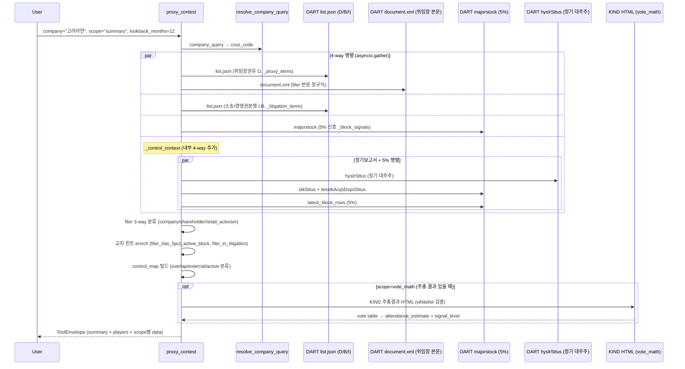

# proxy_contest

## 한 줄 요약
위임장·공개매수·소송·5% 경영참여 시그널을 모아 분쟁/액티비즘 탭을 구성. 자동 분류는 하지 않고 힌트만 제공 (애널리스트가 종합 판단).

## 사용법
```
proxy_contest(
    company="고려아연",
    scope="summary",
    lookback_months=12,
)
```

자연어 예시:
- "고려아연 분쟁 신호 종합" → `scope="summary"`
- "삼성전자 vote_math (표 구조)" → `scope="vote_math"` (주총 결과 있을 때)
- "LG화학 위임장 fight" → `scope="fight"` (회사측 vs 주주측 vs retail_activism 분리)

## 입력 인자
| 인자 | 타입 | 필수 | 설명 | 기본값 |
|---|---|---|---|---|
| company | str | yes | 회사명 / ticker / corp_code | - |
| scope | str | no | 6종 (아래 참조) | "summary" |
| year | int | no | 사업연도 | 0 |
| start_date / end_date | str | no | YYYYMMDD | "" |
| lookback_months | int | no | 조사 구간 (개월) | 12 |
| format | str | no | "md" / "json" | "md" |

scope:
- `summary`: 4 카운터 + 판 구조 + 외부/겹침 능동 블록 (기본)
- `fight`: 위임장 + 교차 힌트 (`filer_has_5pct_active_block`, `filer_in_litigation`)
- `litigation`: 소송 (DART D/B/I)
- `signals`: 5% 대량보유 (목적 분류)
- `timeline`: 전 이벤트 시계열
- `vote_math`: 표 구조 (주총 결과 있을 때, 추정참석률·압박 신호)

## 출력 schema (data dict)
```json
{
  "company_id": "...",
  "summary": {"proxy_filing_count": N, "shareholder_side_count": N,
              "litigation_count": N, "active_signal_count": N,
              "top_holder": {...}, "related_total_pct": ...,
              "treasury_pct": ..., "has_contest_signal": true},
  "players": {"company_side_filers": [...],
              "shareholder_side_filers": [...],
              "active_external_blocks": [...],
              "active_overlap_blocks": [...]},
  "fight": [{"disclosure_date": "...", "side": "shareholder",
             "actor_group": "...", "filer_name": "...",
             "filer_has_5pct_active_block": true,
             "filer_in_litigation": true,
             "report_name": "...", "rcept_no": "..."}],
  "litigation": [...],
  "signals": [...],
  "timeline": [...],
  "vote_math": {"meeting_reference": {...},
                "attendance_estimate": {...},
                "capital_structure": {...},
                "pressure_signals": {...},
                "interpretation": {"signal_level": "..."}},
  "control_context": {"observations": [...]},
  "no_filing": false,
  "filing_count": N,
  "usage": {"dart_api_calls": N, "mcp_tool_calls": 1}
}
```

핵심 필드:
- **filer 3-way 분류**: `company`(회사측) / `shareholder`(주주측) / `retail_activism`(소액주주 플랫폼: 컨두잇·헤이홀더·비사이드코리아)
- `has_contest_signal` = `shareholder OR litigation OR external_active_block` (retail_activism, registry_overlap 제외)
- vote_math `signal_level`: 보수적 (승패 예측 X)

## Data sources
- **DART API**: `list.json` (D/B/I) + `document.xml` (위임장 본문 행사방향 정규식)
- **KIND**: vote_math만 (주총 결과 화이트리스트, rcept_no 80→00 변환)
- 외부 호출: scope별 2-4회. summary/fight 병렬 (asyncio.gather 4x).

## Flow



호출 횟수: scope별 4-7회 (4-way + control_context 4-way). vote_math는 +KIND 1회.

## 파싱 전략
- DART D/B/I 공시만 사용 (KIND false match 위험).
- 위임장 filer 3-way 분류 (회사측 / 주주측 / retail_activism).
- 교차 힌트 (자동 분류 X):
  - 5%경영참여 ✓ + 소송 ✓ → proxy_fight (예: 고려아연 영풍)
  - 5%경영참여 - + 소송 - → proxy_campaign (예: LG화학 Palliser Capital)
  - retail_activism side → 소액주주 집단 위임 (예: 삼성전자 컨두잇/ACT)
- vote_math는 주총 결과 있을 때만, 보수적 (승패 예측 X).
- 알려진 한계:
  - 위임장 본문 정규식 실패 시 `requires_review`.
  - vote_math는 KIND 검증 실패 시 `requires_review`.
- regression 0 검증: 200기업 audit `proxy_contest.summary` 92.9% exact (182/196), no_filing 6.1% (12건).

## 관련 공시 (rules/disclosures/)
- [[위임장권유참고서류]] — DART, 의무(권유 시), 프록시 파이트 핵심
- [[소송등의제기]] — DART, 의무, 회사 당사자 소송·가처분
- [[경영권분쟁소송]] — DART, 의무, 경영권 분쟁 명시 분류
- [[대량보유상황보고서]] — 5% signals scope
- [[주주총회결과]] — vote_math source (KIND whitelist)

## 관련 개념 (rules/concepts/)
- [[프록시-파이트]] — 위임장 대결, 경영권 쟁탈
- [[위임장-권유]] — 의결권 위임 확보 행위
- [[5%-대량보유]] — 5% 이상 보유 시 보유목적 공시 의무
- [[참석률]] — vote_math 핵심 변수 (KOSPI 200 평균 73.3%)
- [[감사위원-의결권-제한]] — 3% 룰 (vote_math 분모 영향)
- [[경영권-방어]] — 4가지 방어 시나리오

## 관련 결정 (decisions/)
- [[DART-KIND-매핑-화이트리스트-2026-04]] — KIND vote_math whitelist
- [[회사측-vs-주주측-위임장]] — 위임장 문서 구조 차이, flr_nm 구분법
- [[cross-domain-체이닝]] — PRX → AGM (vote_math) / OWN (signals) 체이닝

## 관련 audit/fix (architecture/)
- [[260429_0912_audit_parsing-200기업-v2-no_filing]] — proxy_contest.summary 92.9% exact
- [[260429_0216_fix_speed-optimization-9건]] — proxy_contest 4x 속도 향상 (asyncio.gather)

## 알려진 issue + TODO
- 위임장 본문 행사방향 정규식 실패 케이스 (비정형 양식) → `requires_review`.
- 대량보유 목적과 proxy/litigation 타임라인 충돌 시 `requires_review`.
- vote_math `signal_level` 임계값은 보수적 (승패 예측 의도 X).
- retail_activism 플랫폼 추가 시 화이트리스트 갱신 필요 (TODO).

## 변경 이력
- 2026-04-18: proxy_contest tool 검증 + release_v2 conditional (vote_math 별도 검증 필요)
- 2026-04-19: 3개 기업 (고려아연 / 한진칼 / 삼성전자) summary 통과
- 2026-04-29: 200기업 audit 92.9% exact, 4x 속도 향상
- 2026-05-01: tool wiki 페이지 작성
