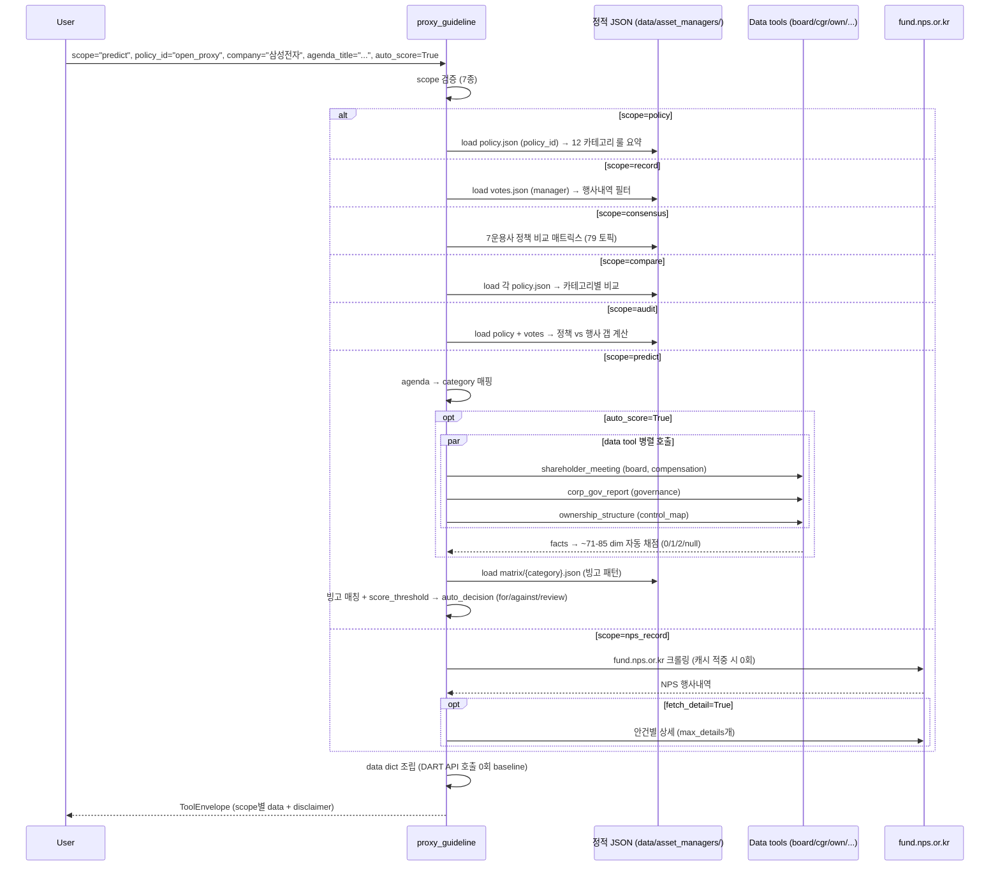

# proxy_guideline

## 한 줄 요약
자산운용사 의결권 행사 정책 + 행사내역 + Open Proxy Guideline + 12 카테고리 매트릭스 자동 채점 + 국민연금(NPS) 통합 조회. **DART API 호출 0회** (정적 데이터).

## 사용법
```
proxy_guideline(
    scope="predict",
    policy_id="open_proxy",
    company="삼성전자",
    agenda_title="이사 후보 OOO 선임의 건",
    auto_score=True,
)
```

자연어 예시:
- "OPM 정책으로 삼성전자 안건 자동 채점" → `scope="predict", policy_id="open_proxy", auto_score=True`
- "미래에셋 vs 삼성자산운용 정책 비교" → `scope="compare", compare_policies=["mirae_asset", "samsung"]`
- "고려아연 NPS 의결권 행사내역" → `scope="nps_record", company="고려아연"`

## 입력 인자
| 인자 | 타입 | 필수 | 설명 | 기본값 |
|---|---|---|---|---|
| scope | str | yes | 7종 (아래 참조) | "policy" |
| policy_id | str | no | open_proxy / 운용사 ID | "open_proxy" |
| manager | str | no | record/audit scope의 운용사 ID | "" |
| company / ticker / nps_code | str | no | 회사 식별 | "" |
| year / period / start_date / end_date | - | no | 기간 필터 | - |
| agenda_category / agenda_title / agenda_type_raw | str | no | 안건 식별 | "" |
| compare_policies | list[str] | no | compare scope 대상 | None |
| topic_id | str | no | consensus scope 토픽 | "" |
| matrix_dimensions | dict[str,int] | no | manual override | None |
| auto_score | bool | no | predict scope 자동 채점 | True |
| meeting_date / notice_disclosure_date | str | no | predict scope 컨텍스트 | "" |
| extra_agenda_titles | list[str] | no | 빙고 평가 보강 | None |
| fetch_detail | bool | no | nps_record 상세 가져오기 | True |
| force_refresh | bool | no | NPS 캐시 무효화 | False |
| max_details | int | no | 상세 최대 개수 | 5 |
| format | str | no | "md" / "json" | "md" |

scope:
- `policy`: 정책 조회 (12 카테고리 룰 요약 + novel topics + 한국 특수 룰)
- `record`: 운용사 행사내역 (manager 필수, company/year/period/category 필터)
- `predict`: 회사·안건 → 정책 적용 예측 + ~85 dim 자동 채점 + 빙고 평가
- `compare`: N개 정책 비교 매트릭스 (default 모든 운용사 + open_proxy)
- `consensus`: 운용사 합의/이견 (79 토픽, 12 카테고리)
- `audit`: 정책 vs 실제 행사내역 갭 (manager 필수)
- `nps_record`: 국민연금 안건별 행사내역 (fund.nps.or.kr 직접 크롤링)

## 출력 schema (data dict, scope별 다름)
```json
// scope=predict 기준 핵심
{
  "company": "...", "agenda_title": "...",
  "agenda_category": "...", "agenda_category_ko": "...",
  "policy_id": "open_proxy", "policy_default": "...",
  "auto_score_enabled": true,
  "auto_decision": {"decision": "for|against|review",
                    "decision_source": "bingo|score_threshold",
                    "raw_score": N, "max_score": 16,
                    "red_count": N, "yellow_count": N,
                    "green_count": N, "unknown_count": N,
                    "triggered_pattern_ids": [...]},
  "bingo_matches": [{"pattern_id": "...", "decision": "...",
                     "rationale": "...", "condition": "..."}],
  "matrix_score": {"dimensions_scored": {"dim_id": 0|1|2|null}},
  "data_calls": {"shareholder_meeting": "ok", ...},
  "manual_dims": ["adverse_news", ...],
  "policy_for": [...], "policy_against": [...], "policy_review": [...],
  "matrix": {...}, "matrix_id": "...",
  "warnings": [...], "disclaimer": "...", "evaluation_note": "..."
}
```

지원 운용사: `mirae_asset` / `samsung` / `samsung_active` / `truston` / `kim` / `align_partners` (행동주의) / `baring` (외국계 ISS 참조)
+ `open_proxy` (OPM 자체 정책 v1.2)

## Data sources
- **정적 JSON**: `open_proxy_mcp/data/asset_managers/{manager}/policy.json` + `votes.json` + `matrix/*.json`
- **DART API 호출 0회** (정적 데이터)
- **NPS scope**: `fund.nps.or.kr` 직접 크롤링 (정적 캐싱). NPS 코드 5자리 + '0' = 표준 6자리 티커.
- **predict + auto_score=True**: 추가 data tool 호출 (board, corp_gov, ownership 등) → ~85 dim 자동 채점

## Flow



호출 횟수: scope별 0회 (정적). predict + auto_score=True는 +5-10 data tool 호출. nps_record는 NPS 1-N회.

## 파싱 전략
- 정적 JSON 기반 (12 카테고리 룰 요약 + novel topics + Korea-specific).
- predict scope의 12 매트릭스 100 dim 중 ~71-85 dim 자동 채점:
  - 자동 채점 가능 dim (ownership, compensation, audit committee 등): data tool 결과 기반 0/1/2 점수
  - manual 입력 권장 dim (adverse_news 등): `matrix_dimensions={"dim_id": 0|1|2}` 형태
- 빙고 패턴 인터프리터: 복합 조건 (예: 최대주주 50%+ AND 사외이사 미달) 매칭 시 자동 결정 override
- 매트릭스 채점 오류 시 conservative review로 fallback
- NPS 캐싱: force_refresh=True 시 무효화

## 관련 공시 (rules/disclosures/)
- 해당 없음 (정책 매트릭스 — 공시 본문 비의존)

## 관련 개념 (rules/concepts/)
- [[의결권]] — 의결권 행사 정책 핵심
- [[보수한도]] — compensation 카테고리
- [[정관변경]] — articles_amendment 카테고리
- [[주주제안]] — shareholder_proposals 카테고리

## 관련 결정 (decisions/)
- [[open-proxy-guideline]] — OPM 자체 의결권 행사 정책 v1.2 (12 카테고리 116 룰 + 11 novel topics + 2026 신법 7개 + §382의3 cross-cutting)
- [[matrix-system]] — 12 카테고리 매트릭스 (100 dim, 76 빙고 패턴) + 자동 채점 시스템 v1.3 (~71 dim auto + 빙고 인터프리터, KT&G/삼성전자 검증)
- [[260429_0059_debate_opm-guideline-7전문가]] — 7 전문가 토론 + v1.0 → v1.1 → v1.2 결정 transcript
- [[260429_0216_improvement_turnkey-11agent]] — 11 agent 병렬 작업 통합 (G1-G4 + 7 페르소나 + 모더레이터)
- [[260429_0059_decision_voting-policy-consensus-matrix]] — 7 운용사 의결권 정책 합의/이견 매트릭스 (79 토픽)

## 관련 audit/fix (architecture/)
- [[matrix-system]] — KT&G/삼성전자 자동 채점 검증 통과

## 알려진 issue + TODO
- 매트릭스 매뉴얼 dim (adverse_news 등) 자동화 (TODO).
- consensus scope의 79 토픽 정기 갱신 (운용사 정책 개정 반영).
- predict scope의 disclaimer는 항상 노출 (사용자 최종 검토 권유 — 자동 채점도 단정 X).

## 변경 이력
- 2026-04-29: open-proxy-guideline v1.2 + 12 매트릭스 (100 dim, 76 빙고) + 자동 채점 시스템 v1.3
- 2026-04-29: NPS scope 추가 (fund.nps.or.kr 직접 크롤링)
- 2026-05-01: tool wiki 페이지 작성
