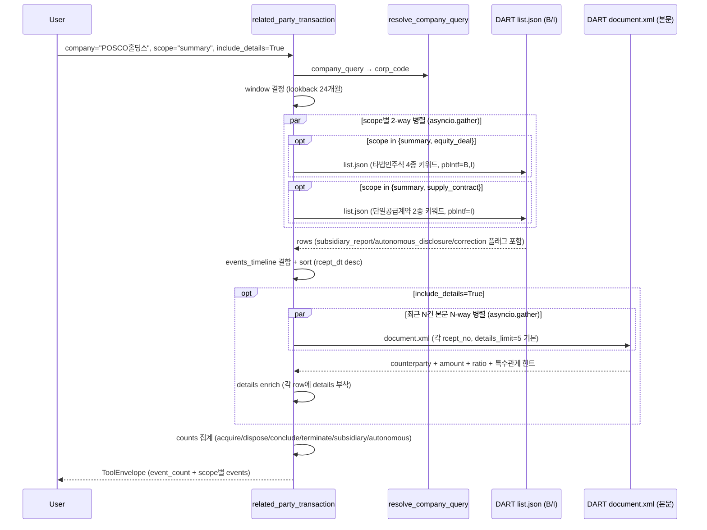

# related_party_transaction

## 한 줄 요약
타법인주식 거래(취득/처분) + 단일판매·공급계약(체결/해지) 통합. 일감몰아주기·내부거래 모니터링. 기본은 list.json 메타, `include_details=True`면 원문 파싱으로 거래 상대방/금액/자산대비비율/특수관계 힌트까지 노출.

## 사용법
```
related_party_transaction(
    company="POSCO홀딩스",
    scope="summary",
    include_details=True,
)
```

자연어 예시:
- "POSCO홀딩스 자회사 거래 패턴" → `scope="summary"` (지주회사 구조 신호)
- "현대건설 단일공급계약 (건설업 특성)" → `scope="supply_contract"` (72건)
- "성호전자 타법인주식 양수" → `scope="equity_deal"` (M&A 활발)

## 입력 인자
| 인자 | 타입 | 필수 | 설명 | 기본값 |
|---|---|---|---|---|
| company | str | yes | 회사명 / ticker / corp_code | - |
| scope | str | no | 3종 (아래 참조) | "summary" |
| start_date / end_date | str | no | YYYYMMDD | "" (24개월 lookback) |
| include_details | bool | no | True면 원문 파싱 (DART 호출 N회 추가) | False |
| details_limit | int | no | 원문 파싱 대상 건수 (1-10) | 5 |
| format | str | no | "md" / "json" | "md" |

scope:
- `summary`: 두 도메인 통합 timeline (기본)
- `equity_deal`: 타법인주식 거래 (양수/양도/취득/처분)
- `supply_contract`: 단일판매·공급계약 (체결/해지)

## 출력 schema (data dict)
```json
{
  "company_id": "...",
  "event_count": {"equity_deal_total": N,
                  "equity_acquire": N, "equity_dispose": N,
                  "supply_contract_total": N,
                  "supply_conclude": N, "supply_terminate": N,
                  "subsidiary_reports": N,
                  "autonomous_disclosures": N},
  "events_timeline": [{"rcept_dt": "...", "type": "equity_deal|supply_contract",
                       "direction": "acquire|dispose|conclude|terminate",
                       "report_nm": "...", "filer": "...",
                       "subsidiary": true, "autonomous": true,
                       "rcept_no": "..."}],
  "equity_deal_events": [{"direction": "...", "report_nm": "...",
                          "subsidiary_report": true,
                          "autonomous_disclosure": false,
                          "is_correction": false,
                          "details": {"counterparty_name": "...",
                                      "counterparty_relationship": "...",
                                      "amount_won": ..., "equity_ratio_pct": ...,
                                      "asset_ratio_pct": ...,
                                      "post_ownership_pct": ...,
                                      "method": "...", "purpose": "...",
                                      "put_option": "...",
                                      "major_shareholder_relation": "..."}}],
  "supply_contract_events": [{"direction": "...", "report_nm": "...",
                              "details": {"contract_amount_won": ...,
                                          "recent_revenue_won": ...,
                                          "revenue_ratio_pct": ...,
                                          "counterparty_name": "...",
                                          "period_start": "...",
                                          "period_end": "..."}}],
  "no_filing": false,
  "filing_count": N,
  "usage": {"dart_api_calls": N, "mcp_tool_calls": 1}
}
```

핵심 플래그 (list.json 응답에서 추출):
- `subsidiary_report`: 모회사가 비상장 자회사 거래 대신 공시 = 그룹 내 연결 거래 가능성
- `autonomous_disclosure`: 의무 미달이지만 투명성 의지
- `is_correction`: `[기재정정]` prefix
- `direction`: equity_deal acquire/dispose, supply_contract conclude/terminate

## Data sources
- **DART API**:
  - `list.json` (pblntf_ty=B,I) + 키워드 (타법인주식 4종 / 단일공급계약 2종)
  - `document.xml` (include_details=True 시 본문 파싱 N건)
- KIND/Naver 미사용. 구조화 API 없음.
- 외부 호출:
  - 기본 (메타만): 4-6회
  - include_details=True: 추가 N회 (details_limit 기본 5)

## Flow



호출 횟수: list 4-6회. include_details=True 시 +N (details_limit, 기본 5).

## 파싱 전략
- DART list.json + 제목 키워드 (구조화 API 없음).
- 키워드:
  - 타법인주식: `("타법인주식및출자증권양수결정", "양도", "취득", "처분")`
  - 공급계약: `("단일판매ㆍ공급계약체결", "단일판매ㆍ공급계약해지", "단일판매·공급계약체결", "단일판매·공급계약해지")` — 특수문자 변형 모두 매칭
- pblntf_tys:
  - 타법인주식: `("B", "I")` — 주요사항보고서 + 거래소공시 양쪽 제출
  - 단일공급계약: `("I",)` — 거래소공시만
- include_details=True 시 최근 N건 본문 파싱:
  - 거래 상대방 / 관계 / 특수관계 힌트
  - 거래금액 / 자기자본대비비율 / 자산대비비율
  - 매출대비비율 (supply_contract)
  - 방법 / 목적 / 풋옵션 / 최대주주·임원 관계
- 알려진 한계:
  - 특수관계 자동 판별 없음 (계열사 matrix가 OPM에 미저장).
  - 매출 의존도 계산은 재무 데이터 결합 필요 (TODO).
- regression 0 검증: 5/5 통과 (POSCO홀딩스/삼성전자/SK하이닉스/현대건설/일진홀딩스/성호전자). 200기업 audit `related_party_transaction.summary` 67.3% exact, no_filing 31.6% (정상).

## 관련 공시 (rules/disclosures/)
- [[타법인주식및출자증권거래]] — DART, 의무, 양수·양도·취득·처분 4형태
- [[단일판매공급계약체결]] — DART+KIND, 의무, 매출 5%+ 단일계약 체결·해지

## 관련 개념 (rules/concepts/)
- [[특수관계인]] — 계열사간 거래 식별
- [[동일인]] — 그룹 정점

## 관련 결정 (decisions/)
- [[pblntf-ty-필터링]] — B/I 코드 사용
- [[cross-domain-체이닝]] — RPT → OWN (지분 변화) / CORP (M&A 맥락) 체이닝

## 관련 audit/fix (architecture/)
- [[260429_0912_audit_parsing-200기업-v2-no_filing]] — related_party_transaction.summary 67.3% exact

## 알려진 issue + TODO
- 특수관계 자동 판별 (계열사 matrix 데이터 소스 확보 시 추가, TODO).
- 단일공급계약 매출 의존도 계산 (financial_metrics tool과 연계, TODO).
- screen_events에 `related_party_equity_deal`/`supply_contract` event_type은 이미 22종에 포함됨.

## 변경 이력
- 2026-04-21: related_party_transaction tool 신설 (14 → 15번째 tool, Data 10개째)
- 2026-04-21: 5/5 전수조사 통과
- 2026-04-29: include_details=True 원문 파싱 보강
- 2026-04-29: 200기업 audit 67.3% exact
- 2026-05-01: tool wiki 페이지 작성
