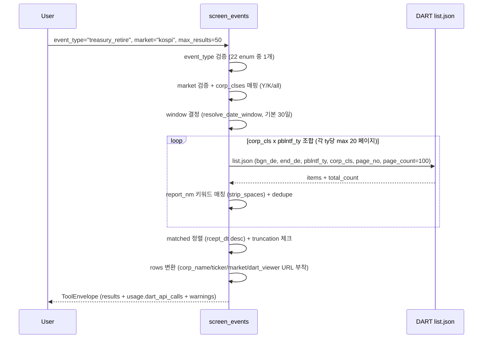

# screen_events

## 한 줄 요약
이벤트 기반 기업 discovery tool. 특정 공시 유형(이벤트)을 최근에 제출한 기업 목록을 한 번에 역조회 (filing-centric).

## 사용법
```
screen_events(
    event_type="shareholder_meeting_notice",
    start_date="2026-03-01",
    end_date="2026-03-31",
    market="kospi",
    max_results=50,
)
```

자연어 예시:
- "최근 30일 자사주 소각 결정한 KOSPI 기업 보여줘" → `event_type="treasury_retire", market="kospi"`
- "최근 60일 임시주총 소집한 기업 찾아줘" → `event_type="shareholder_meeting_notice"` (정기/임시 구분은 drill-down 필요)

## 입력 인자
| 인자 | 타입 | 필수 | 설명 | 기본값 |
|---|---|---|---|---|
| event_type | str | yes | 22종 이벤트 enum 1개 | - |
| start_date | str | no | YYYYMMDD, 미지정 시 30일 전 | "" |
| end_date | str | no | YYYYMMDD, 미지정 시 오늘 | "" |
| market | str | no | "kospi" / "kosdaq" / "all" (KOSPI+KOSDAQ) | "all" |
| max_results | int | no | 결과 상한 (1-100) | 50 |
| format | str | no | "md" / "json" | "md" |

## 출력 schema (data dict)
```json
{
  "event_type": "shareholder_meeting_notice",
  "event_description": "...",
  "market": "kospi",
  "window": {"start_date": "20260301", "end_date": "20260331"},
  "result_count": 47,
  "max_results": 50,
  "results": [
    {"corp_name": "...", "ticker": "005930", "market": "KOSPI",
     "report_nm": "주주총회소집공고", "rcept_dt": "20260312",
     "rcept_no": "20260312000987", "dart_viewer": "..."}
  ],
  "supported_event_types": [...],
  "supported_markets": [...],
  "usage": {"dart_api_calls": N, "mcp_tool_calls": 1, "dart_daily_limit_per_minute": 1000}
}
```

핵심 필드:
- `results`: 매칭된 공시 N건. 각 행에 corp_name, ticker, market, report_nm, rcept_dt, rcept_no, viewer URL.
- `usage.dart_api_calls`: pblntf_ty x 페이지 수에 비례 (보통 1-40회).
- truncation 경고: max_results 도달 시 warning 추가.

## Data sources
- **DART API**: `list.json` (pblntf_ty + corp_cls 서버단 필터 + page_count=100, max_pages=20/ty 순회)
- **외부 호출**: KIND/Naver/Upstage 사용 안 함. DART list.json 단일 소스.
- 키워드 매칭은 응답의 `report_nm` 후처리 (strip_spaces=True 옵션).

## Flow



호출 횟수: pblntf_ty 수 x corp_cls 수 x 페이지 수 = 보통 1-40회. max_results 도달 시 조기 중단.

## 파싱 전략
- event_type → (pblntf_tys, keywords) 매핑 (서비스 코드 `SUPPORTED_EVENT_TYPES`).
- market="all"이면 corp_cls="Y" 호출 후 "K" 호출을 순차 수행해 합치기 (API 호출 약 2배).
- 알려진 한계:
  - 정기/임시 주총 구분 불가 (DART report_nm은 "주주총회소집공고" 단일 포맷, 본문 파싱 미수행).
  - 페이지 상한: 각 pblntf_ty당 20페이지(=2,000건). 초과 시 truncated warning.
  - KONEX/기타는 분석 유니버스에서 제외.
- regression 0 검증 (최초 14 event_type 전수조사 통과 + 22종 확장 후 운영 중).

## 관련 공시 (rules/disclosures/)
- [[주주총회소집공고]]
- [[최대주주변경]]
- [[대량보유상황보고서]] (block_holding_5pct)
- [[자기주식취득결정]] / [[자기주식처분결정]] / [[자기주식소각결정]] / [[자기주식신탁결정]]
- [[위임장권유참고서류]]
- [[소송등의제기]] / [[경영권분쟁소송]]
- [[기업가치제고계획]]
- [[현금배당결정]] / [[주식배당결정]]
- [[유상증자결정]] / [[전환사채발행결정]] / [[신주인수권부사채발행결정]] / [[감자결정]]
- [[타법인주식및출자증권거래]] / [[단일판매공급계약체결]]

## 관련 개념 (rules/concepts/)
- 해당 없음 (discovery tool은 도메인 개념 비의존, drill-down tool에서 개념 적용)

## 관련 결정 (decisions/)
- [[pblntf-ty-필터링]] — DART 검색 시 pblntf_ty 필수, 코드표 (D/E/I/B 등)
- [[DART-KIND-매핑-화이트리스트-2026-04]] — KIND false match 위험으로 DART 단일 소스 채택
- [[lessons-learned]] — MCP lesson #1 (단일 tool + enum), #4 (키워드 가정 금지)
- [[tool-changelog]] — annual/extraordinary 통합 → shareholder_meeting_notice 단일화 결정

## 관련 audit/fix (architecture/)
- [[260429_0912_audit_parsing-200기업-v2-no_filing]] — 200기업 v2 audit (screen_events는 discovery라 별도 매트릭스에는 미포함, 22종 enum 검증은 본 페이지)

## 알려진 issue + TODO
- 정기/임시 주총 구분: report_nm으로는 불가능. drill-down (`shareholder_meeting`)으로 처리.
- 상태 기반 필터(예: 자사주 5% 이상 + 최대주주 40% 미만) 미지원. Claude Code CLI에서 기존 tool 루프로 처리.
- KOSPI 200 / KOSDAQ 150 지수 필터: corp_cls만으로는 불가. 별도 유니버스 데이터 소스 필요 (TODO).
- 키워드 매칭 실패율 모니터링: DART report_nm 패턴 변경 시 재검증 필요.

## 변경 이력
- 2026-04-19: screen_events tool 신설 (14 event_type 전수조사 통과)
- 2026-04-21: market 5종 → 3종 축소 (kospi/kosdaq/all=KOSPI+KOSDAQ), 사용량(usage) payload 추가
- 2026-04-29: 22 event_type으로 확장 (희석성 증권 4종 + 내부거래 4종 + screen_events-design 흡수)
- 2026-05-01: tool wiki 페이지 작성
