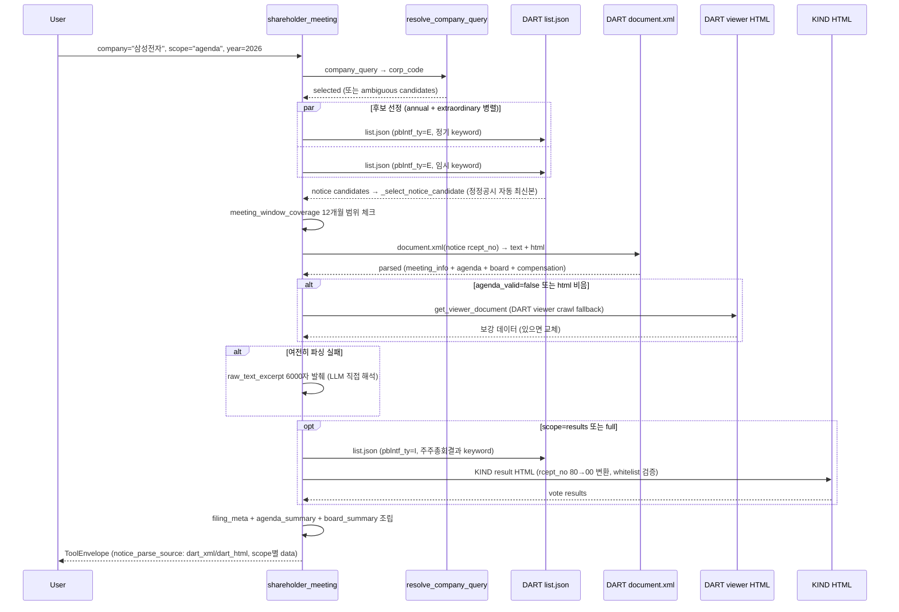

# shareholder_meeting

## 한 줄 요약
정기/임시주총 데이터 탭. 안건·이사 후보·보수한도·정관변경·결과를 scope별로 점진 로드.

## 사용법
```
shareholder_meeting(
    company="삼성전자",
    meeting_type="auto",
    scope="summary",
    year=2026,
)
```

자연어 예시:
- "삼성전자 2026 주총 안건 트리 보여줘" → `scope="agenda"`
- "고려아연 임시주총 결과 보여줘" → `meeting_type="extraordinary", scope="results"`
- "KT&G 보수한도 안건 + 전기 소진율" → `scope="compensation"`

## 입력 인자
| 인자 | 타입 | 필수 | 설명 | 기본값 |
|---|---|---|---|---|
| company | str | yes | 회사명 / ticker / corp_code | - |
| meeting_type | str | no | "auto" / "annual" / "extraordinary" | "auto" |
| scope | str | no | 7종 (아래 참조) | "summary" |
| year | int | no | 사업연도, 0이면 최근 12개월 | 0 |
| start_date / end_date | str | no | YYYYMMDD | "" |
| lookback_months | int | no | 조사 구간 (개월) | 12 |
| format | str | no | "md" / "json" | "md" |

scope:
- `summary`: 정정공시 포함 메타 + 안건 요약 (기본)
- `agenda`: 안건 트리 (재귀)
- `board`: 이사·감사 후보 + 경력
- `compensation`: 보수한도 + 전기 소진율
- `aoi_change`: 정관변경 변경전/후/사유
- `results`: KIND 투표결과 (rcept_no 80→00 변환)
- `full`: 모든 scope 병렬 호출

## 출력 schema (data dict)
```json
{
  "company_id": "...",
  "canonical_name": "삼성전자(주)",
  "meeting_type": "annual",
  "meeting_phase": "post_result",
  "result_status": "available",
  "notice": {"rcept_no": "...", "report_name": "...", "is_correction": true},
  "meeting_info": {"datetime": "...", "location": "...", "report_items": [...]},
  "agendas": [{"number": "1", "title": "...", "children": [...]}],
  "board": {"appointments": [...]},
  "compensation": {"items": [...]},
  "aoi_change": {"amendments": [...]},
  "results": {"items": [...], "result_format": "..."},
  "result_reference": {"rcept_no": "...", "kind_acptno": "..."},
  "alternative_meetings": [...],
  "meeting_coverage_12m": {...},
  "no_filing": false,
  "filing_count": N,
  "usage": {"dart_api_calls": N, "mcp_tool_calls": 1}
}
```

핵심 필드:
- `meeting_phase`: `pre_meeting` / `post_meeting_pre_result` / `post_result` / `undetermined`
- `result_status`: `not_due_yet` / `pending_or_missing` / `available` / `requires_review` / `unknown`
- `notice_parse_source`: XML / PDF fallback / OCR fallback (3-tier)
- 정정공시 자동 최신본 선택 (`_auto_rank_key` 검증 통과)

## Data sources
- **DART API**: `list.json` (pblntf_ty=E for notice, I for results) + `document.xml` (notice 본문)
- **KIND**: 주총결과 크롤링 (rcept_no 80 → 00 변환 화이트리스트)
- **PDF**: 미사용 (v2 기본 경로에서 PDF 제외)
- 외부 호출: scope별 1-3회, full scope는 5-8회

## Flow



호출 횟수: scope별 1-3회 (summary), full scope는 5-8회 (results 포함). PDF/OCR fallback 미사용 (v2는 XML+HTML viewer까지만).

## 파싱 전략
- 우선순위: DART list+XML (notice/agenda/board/compensation/aoi_change) → KIND HTML (results, whitelist 검증)
- 정정공시 있으면 최종본 자동 선택. 원본·정정 모두 추적 (alternative_meetings).
- 회사 식별 ambiguous면 자동 선택 안 함 → 후보 리스트.
- 알려진 한계:
  - KIND 비화이트리스트 false match 위험 → notice는 DART-only.
  - 임시주총 자동 식별 불안정 (meeting_type="extraordinary" 명시 권장).
  - 후보자 경력 파싱: KIND fallback (의안분석 우선, 누락 시 KIND 보강).
- regression 0 검증: 200기업 audit `shareholder_meeting.summary` 95.4% exact (187/196). 인사 파서 SUCCESS 79.4% → 94.6% 개선 (878명 → 849명).

## 관련 공시 (rules/disclosures/)
- [[주주총회소집공고]] — DART, 의무/정기, 안건/후보/보수한도/정관변경 본문 source
- [[주주총회결과]] — KRX KIND, 의무/수시, 투표결과/참석률 (whitelist)

## 관련 개념 (rules/concepts/)
- [[의결권]] — 1주 1표 원칙과 예외 (감사위원/자사주)
- [[보수한도]] — compensation scope 핵심 지표
- [[소진율]] — 전기 한도 대비 실지급 비율
- [[정관변경]] — aoi_change scope, 하위 안건 분할 빈번
- [[주주제안]] — 소수주주 제안 안건 식별
- [[시간순서-규칙]] — 공고→결과 참조 OK, 결과→공고 금지
- [[집중투표]] — board scope에서 N명 선출 시 집중투표 가능 여부
- [[감사위원-의결권-제한]] — 3% 룰 (results scope 분모 영향)
- [[v4-스키마]] — 통합 JSON v4 (meetingInfo, agendas, voteResults)

## 관련 결정 (decisions/)
- [[DART-KIND-매핑-화이트리스트-2026-04]] — KIND 결과공시 whitelist 정책
- [[XML-vs-PDF]] — XML 1차 + PDF 보강 (현재 PDF 미사용, XML-only)
- [[BeautifulSoup-파서-선택]] — lxml 채택 (30% 빠름)
- [[cross-domain-체이닝]] — AGM → OWN → DIV 도메인 체이닝

## 관련 audit/fix (architecture/)
- [[260411_2023_audit_personnel-벤치마크-v1]] — personnel XML 878명 전수 벤치마크 (v1, SUCCESS 79.4%)
- [[260429_0912_audit_parsing-200기업-v2-no_filing]] — shareholder_meeting.summary 95.4% exact
- [[260429_2053_audit_personnel-878명]] — 후보자 경력 정확도 79.4% → 94.6% (HARD_FAIL 0건)

## 알려진 issue + TODO
- 임시주총 meeting_type="auto" 시 정기주총 우선 선택 → 명시 권장.
- 후보자 경력 파싱: 일부 비표준 컬럼 구조(예: `| 의안 | 후보자성명 |`) 지원 추가됨.
- KOSDAQ 자율공시는 미제출 정상 (no_filing).
- PDF fallback 미적용 (v2). 추후 OEK PDF parser 도입 검토 가능.

## 변경 이력
- 2026-04-18: shareholder_meeting tool 검증 + release_v2 go (annual)
- 2026-04-19: 9개 기업 (정기 6 + 임시 3) 전수 통과
- 2026-04-29: 인사 파서 SUCCESS 94.6% 달성 (HARD_FAIL 0)
- 2026-05-01: tool wiki 페이지 작성
