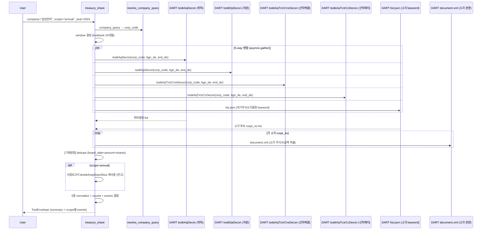

# treasury_share

## 한 줄 요약
자기주식 이벤트 전용 tool. 취득·처분·소각·신탁 결정 공시를 한 탭에서 집계. value_up(정책)·ownership_structure(잔고)와 함께 주주환원 분석의 사실 축.

## 사용법
```
treasury_share(
    company="삼성전자",
    scope="annual",
    year=2024,
)
```

자연어 예시:
- "삼성전자 2024 자사주 매입·소각 이력" → `scope="acquisition"` (취득 + 신탁체결)
- "KT&G 자사주 소각결정만 보여줘" → `scope="cancelation"`
- "현재 자사주 잔고" → `scope="annual"` (사업보고서 기준 발행/자기/유통)

## 입력 인자
| 인자 | 타입 | 필수 | 설명 | 기본값 |
|---|---|---|---|---|
| company | str | yes | 회사명 / ticker / corp_code | - |
| scope | str | no | 6종 (아래 참조) | "summary" |
| year | int | no | 사업연도 (annual scope), 0이면 최신 | 0 |
| start_date / end_date | str | no | YYYYMMDD | "" |
| lookback_months | int | no | 이벤트 조사 구간 (개월) | 24 |
| format | str | no | "md" / "json" | "md" |

scope:
- `summary`: 5종 집계 + 최신 5건 이벤트 (기본)
- `events`: 전 이벤트 타임라인
- `acquisition`: 취득결정 + 신탁체결
- `disposal`: 처분결정 + 신탁해지
- `cancelation`: 소각결정 (별도 API 없음, list.json 키워드)
- `annual`: 연간 누적 (사업보고서 기준 잔고/소각/취득/처분)

## 출력 schema (data dict)
```json
{
  "company_id": "...",
  "summary": {
    "acquisition_count": 2, "acquisition_for_cancelation_count": 2,
    "disposal_count": 0, "trust_contract_count": 0,
    "trust_termination_count": 0, "cancelation_count": 1,
    "total_event_count": 3,
    "acquisition_shares_total": ...,
    "acquisition_amount_total_krw": ...,
    "acquisition_for_cancelation_amount_total_krw": ...
  },
  "events": [{"event": "acquisition_decision", "rcept_dt": "...",
              "shares": ..., "amount_krw": ..., "report_nm": "...",
              "rcept_no": "...", "for_cancelation": true}],
  "annual": {"issued_shares": ..., "treasury_shares": ...,
             "treasury_pct": ..., "tradable_shares": ...,
             "rows": [...]},
  "no_filing": false,
  "filing_count": N,
  "usage": {"dart_api_calls": N, "mcp_tool_calls": 1}
}
```

핵심 필드:
- `acquisition_for_cancelation_*`: 소각 목적 취득 (실제 환원 검증의 핵심)
- 5종 이벤트: `acquisition_decision` / `disposal_decision` / `trust_contract` / `trust_termination` / `cancelation_decision`

## Data sources
- **DART API** (병렬 5개):
  - `tsstkAqDecsn` 취득결정
  - `tsstkDpDecsn` 처분결정
  - `tsstkAqTrctrCnsDecsn` 신탁체결
  - `tsstkAqTrctrCcDecsn` 신탁해지
  - `list.json` keyword="자기주식소각결정" (소각결정 별도 API 없음)
- **사업보고서**: `tesstkAcqsDspsSttus` (annual scope, 잔고 + 변동 5컬럼)
- 외부 호출: 5-7회 (asyncio.gather 병렬). KIND/Naver 미사용.

## Flow



호출 횟수: 5회 (병렬) + 소각 본문 N회 (cancelation 건당 1회).

## 파싱 전략
- 5개 DART 공시를 모아서 병렬 조회.
- 소각결정은 별도 API 없음 → `list.json` + 키워드 "자기주식소각결정" + report_nm 필터링.
- annual scope는 사업보고서 기반 누적 잔고 (재사용).
- [기재정정] dedupe (board_date+amount+shares 키)
- 알려진 한계:
  - 소각결정 키워드 변형 (예: "자기주식소각" vs "자사주소각") 모두 매칭.
  - 신탁 만기 종료(자동 해지)는 별도 공시 없음 → 신탁계약 종료일로 추정.
- regression 0 검증: 200기업 audit `treasury_share.summary` 51.0% exact (100/196), no_filing 48.0% (94건, 자사주 활동 없음 정상).

## 관련 공시 (rules/disclosures/)
- [[자기주식결정]] — 5종 통합 인덱스
- [[자기주식취득결정]] — `tsstkAqDecsn`, 2026.03 신법 (aq_pp "소각" 명시 필수)
- [[자기주식처분결정]] — `tsstkDpDecsn`, 자사주 마법 대상
- [[자기주식소각결정]] — list.json+키워드, report_nm "주식소각결정"
- [[자기주식신탁결정]] — 체결/해지 2종
- [[자기주식의무소각-2026신법]] — 신법 (상법 §341/§342, 2026.03.06), 1년 내 의무소각
- [[사업보고서]] — annual scope source

## 관련 개념 (rules/concepts/)
- [[자사주]] — 의결권 없는 자기주식, 경영권 방어 수단
- [[주주환원]] — CSR 분자에 자사주 매입(acquire) 포함 (소각이 아님)

## 관련 결정 (decisions/)
- [[배당공시유형]] — 자사주 5종 통합 비교
- [[free-paid-분리]] — 잔고 / 이벤트 일관성
- [[cross-domain-체이닝]] — TRS → DIV (CSR) / VUP (commitment) / OWN (잔고) 체이닝

## 관련 audit/fix (architecture/)
- [[260429_0912_audit_parsing-200기업-v2-no_filing]] — treasury_share.summary 51.0% exact
- [[260429_0216_fix_speed-optimization-9건]] — 5 API 병렬 (asyncio.gather)

## 알려진 issue + TODO
- 신탁 자동 만기 해지 추적 미지원 (TODO).
- 무상소각 vs 유상소각 구분은 본문 텍스트 의존 (한계).
- 2026.03 신법 (1년 내 의무소각) 트리거 모니터링은 별도 dashboard 검토.

## 변경 이력
- 2026-04-29: treasury_share tool 신설 (CSR 분자 정정 T22 → T23과 함께 도입)
- 2026-04-29: 5 API 병렬 (asyncio.gather), 200기업 audit 51% exact (no_filing 분리)
- 2026-05-01: tool wiki 페이지 작성
