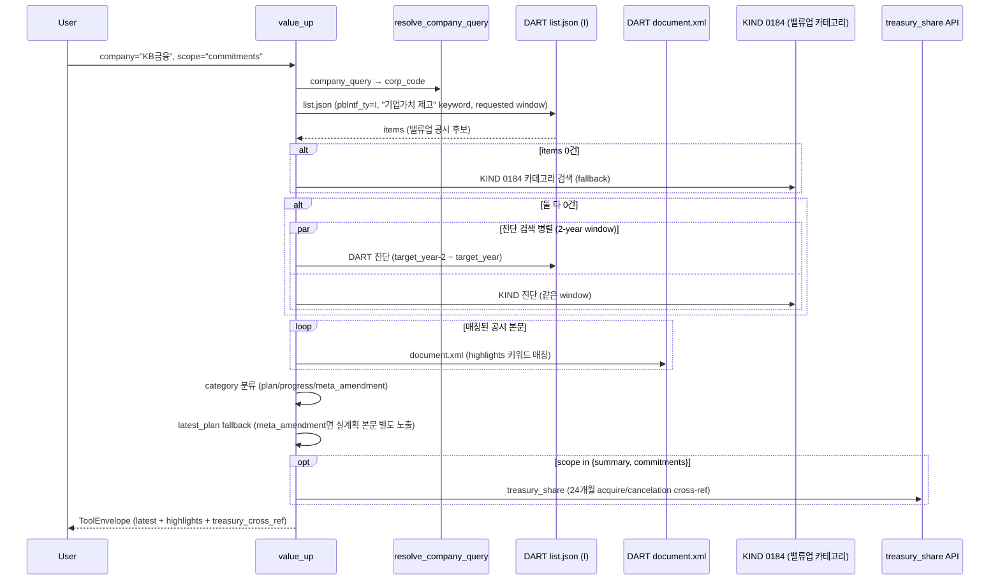

# value_up

## 한 줄 요약
기업가치제고계획(밸류업) 공시 + 핵심 commitment 문장. 주주환원 정책·미래 약속 탭. 자사주 소각 이행 교차참조 포함.

## 사용법
```
value_up(
    company="KB금융",
    scope="commitments",
)
```

자연어 예시:
- "KB금융 밸류업 commitment + 자사주 이행" → `scope="commitments"`
- "하나금융지주 밸류업 본문 발췌" → `scope="plan"`
- "메리츠금융지주 밸류업 공시 timeline" → `scope="timeline"`

## 입력 인자
| 인자 | 타입 | 필수 | 설명 | 기본값 |
|---|---|---|---|---|
| company | str | yes | 회사명 / ticker / corp_code | - |
| scope | str | no | 4종 (아래 참조) | "summary" |
| year | int | no | 사업연도 | 0 |
| start_date / end_date | str | no | YYYYMMDD | "" |
| format | str | no | "md" / "json" | "md" |

scope:
- `summary`: 최신 공시 + 카테고리 분류 + treasury cross-ref (기본)
- `plan`: 원본 계획 본문 발췌 (1800자 제한)
- `commitments`: 핵심 약속 문장 + 24개월 자사주 이행 교차참조
- `timeline`: 공시 이력

## 출력 schema (data dict)
```json
{
  "company_id": "...",
  "availability_status": "...",
  "latest": {"disclosure_date": "...", "report_name": "...",
             "category": "plan|progress|meta_amendment",
             "source_type": "dart_xml|kind_html",
             "rcept_no": "...", "acptno": "..."},
  "latest_plan": {"disclosure_date": "...", "category": "plan",
                  "rcept_no": "...", "note": "..."},
  "items": [...],
  "highlights": [...],
  "latest_excerpt": "...",
  "treasury_cross_ref": {"cancelation_decision_count_24m": N,
                         "acquisition_count_24m": N,
                         "acquisition_for_cancelation_count_24m": N,
                         "acquisition_for_cancelation_amount_krw_24m": ...,
                         "trust_contract_count_24m": N},
  "search_diagnostics": {...},
  "no_filing": false,
  "filing_count": N,
  "usage": {"dart_api_calls": N, "mcp_tool_calls": 1}
}
```

핵심 필드:
- 공시 카테고리 자동 분류:
  - `plan`: 원본 계획 또는 개정 계획
  - `progress`: 이행현황
  - `meta_amendment`: 고배당기업 형식 재공시 (실계획은 원본에 있음)
- 최신이 `meta_amendment`면 실계획 본문을 `latest_plan`으로 별도 노출.
- `treasury_cross_ref`: 24개월 내 자사주 소각/취득/신탁 카운트 (commitment 이행 검증)

## Data sources
- **DART API**: `list.json` (pblntf_ty=I) + 키워드 "기업가치 제고" → 없으면 KIND `기업가치 제고 계획(0184)` 재시도
- **KIND**: 밸류업 카테고리 추가 source
- **treasury_share**: 24개월 cross-ref (별도 호출)
- 외부 호출: 2-4회 (commitments scope는 treasury cross-ref 추가)

## Flow



호출 횟수: 2-4회 (DART list + 본문). KIND fallback +1, 진단검색 +2, treasury cross-ref +1.

## 파싱 전략
- DART 거래소 공시(I) 밸류업 키워드 검색.
- 카테고리 자동 분류:
  - `meta_amendment`: report_name에 "고배당기업"/"고배당법인" 포함 (조세특례제한법 형식 재공시)
  - `progress`: report_name에 "이행현황" 포함
  - `plan`: 그 외
- 최신이 meta_amendment면 실계획 본문(`latest_plan`)으로 fallback.
- `_COMMITMENT_KEYWORDS` 매칭 문장 추출 (highlights).
- summary/commitments scope에 24개월 자사주 이벤트 교차참조 (`treasury_cross_ref`).
- 알려진 한계:
  - 본문 텍스트 짧음 (PDF 첨부 중심) — viewer_url로 직접 확인 권장.
  - `_COMMITMENT_KEYWORDS` 매칭 0건이면 highlights 비어있음 (키워드 튜닝 여지).
- regression 0 검증: 200기업 audit `value_up.summary` 50.5% exact (99/196), no_filing 48.0% (94건, 미제출 정상).

## 관련 공시 (rules/disclosures/)
- [[기업가치제고계획]] — DART+KIND, 자율/수시, 본계획·이행점검
- [[자기주식취득결정]] — cross-ref (24개월 acquire 카운트)
- [[자기주식소각결정]] — cross-ref (24개월 retire 카운트)
- [[자기주식의무소각-2026신법]] — 1년 내 의무소각 (commitment 검증 trigger)

## 관련 개념 (rules/concepts/)
- [[주주환원]] — value_up은 정책·약속, dividend는 사실 (역할 분리)
- [[배당성향]] — 밸류업 commitment 핵심 지표

## 관련 결정 (decisions/)
- [[DART-KIND-매핑-화이트리스트-2026-04]] — KIND 밸류업 카테고리 0184 fallback
- [[cross-domain-체이닝]] — VUP → DIV (사실) / TRS (자사주 이행) 체이닝

## 관련 audit/fix (architecture/)
- [[260429_0912_audit_parsing-200기업-v2-no_filing]] — value_up.summary 50.5% exact

## 알려진 issue + TODO
- `_COMMITMENT_KEYWORDS` 튜닝 (LG에너지솔루션 등 매칭 0건 케이스).
- 재공시/기재정정 timeline 연결 케이스 → `requires_review`.
- KIND 제목 검증 실패 시 `requires_review`.
- ROE/PBR/배당성향 목표 자동 추출 (TODO, 현재는 highlights 문장만).

## 변경 이력
- 2026-04-18: value_up tool 검증 + release_v2 go
- 2026-04-19: 4개 기업 (KB금융 / 하나금융지주 / LG에너지솔루션 / 메리츠금융지주) summary 통과
- 2026-04-29: 200기업 audit 50.5% exact (no_filing 48% 분리)
- 2026-05-01: tool wiki 페이지 작성
