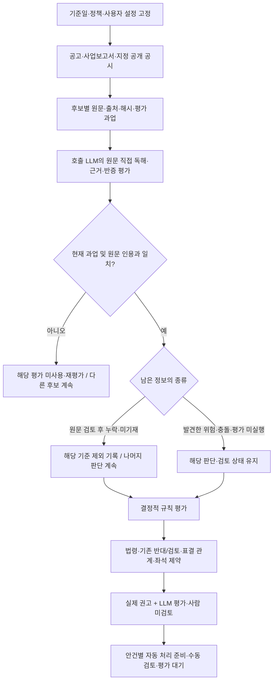

# 문서 분리 직전의 판단 원칙·출처 기준

문서 개편 전 가이드라인 부분의 보관본이다. 별도 정책 버전 출시를 의미하지 않는다. 혼합 문서의 로드맵과 실행 일지는 포함하지 않는다. 현재 적용 여부는 최신 가이드라인을 확인한다.

**Peeking 금지가 최우선이다.** 각 주총의 판단시점까지 공개·입수 가능했던 근거만 사용한다. 기존 일 단위 `as_of`와 별도로, 새 하네스는 시간대가 있는 `cutoff_at`과 소집공고 접수번호를 고정한다. 날짜만 확인된 자료는 마감일 전일까지 사용하며, 이 통제만으로 모든 원천의 역사적 내용과 의미 정확성이 검증됐다고 보지 않는다.

- **시간:** 공개시점이 마감시점 이내임을 입증하지 못한 자료는 판단 입력에서 제외한다. 같은 날 공개순서가 불명인 자료, 사후 정정·결의 결과·판결·보도도 같다. 제외 항목을 알리고 남은 근거로 계속 판단한다.
- **근거:** 파서는 보조 도구다. LLM이 허용된 원문을 직접 읽고 사실·추론·반증을 구분한다. 미기재·미공개는 해당 기준만 스킵하며, 발견한 위험이나 충돌까지 지우지 않는다.
- **정책:** 당시 법령·정책의 유효 버전을 구분한다. 현재 v2를 과거 자료에 적용하는 실험은 별도로 표시하며 당시 실제 기관 정책의 재현으로 부르지 않는다. 후속 사건을 보고 과거 평가용 규칙을 고쳐 같은 검증에 재사용하지 않는다.
- **사용자 설정:** 보수적·기본 성향과 전체 자동·일부 수동·전체 수동 처리 수준을 분리한다. 출석 기본 기간은 직전 완료 사업연도 중 실제 직무 수행 대상 기간이다.
- **실무 기록:** 운용사·행동주의 투자자·연기금 담당자가 근거, 판단, 건너뛴 기준, 수동 인계 사유를 확인할 수 있게 한다. 기사 논조는 사용하지 않고 공식 판단의 존재·절차와 이해상충을 구분한다. 정성 평가는 **LLM 평가 · 사람 미검토**다.

현재 지원 범위는 사외·독립이사 후보 자문과 별도 회사 거버넌스 검토다. 자동 처리 준비는 실제 투표 전송을 뜻하지 않는다.

### 판단 기준과 적용 범위

Astra 설계의 근거·판정 계약과 Fable 리뷰의 운영 범위를 합친 설계안을 최종 후보로 기록한다.
전체 비교·HTML·JSON·플로우차트는 `output/guideline-synthesis-20260908/`에 보관한다.
이 문서는 그 설계를 OPM 런타임에 연결한 최소 파일럿과 실제 호출 결과를 함께 기록한다.

v2는 아직 공식 의결권 정책이 아니다. `vote_style="opm_guideline_v2"`의 기본 shadow는
기존 권고를 유지한다. 명시적 `guideline_mode="pilot"`에서는 호출 LLM 평가를 받아
후보 범위의 실제 `decision`에 반영한다. 모든 수용 평가는 「LLM 평가 · 사람 미검토」로 표시한다.
서버 내 별도 LLM 자동 호출은 없다. 호출 AI가 원문 평가 후 같은 MCP에 평가를 제출하는 두 단계다.

통합 설계 → 실제 공시 수집 → LLM 평가 수용 → 후보 범위의 실제 권고 적용까지 구현했다.
v2가 기준일 이전 최신 사업보고서와 선택된 소집공고를 읽고, 기간별 출석 관측과 평가 과업을 반환한다.
0.5.0에서 임원 변동 공시의 제한된 자동 탐색과 회의·재직·직무정지 평가 입력을 연결했다.
0.6.0은 누락 항목의 명시적 제외, 사업연도 원문 직접 판독, 요청별 성향·문턱 설정,
안건별 자동 처리 준비·수동 검토 분기를 추가한다. 평가 입력 한 건의 스키마 오류가 다른 후보를 중단시키지 않는다.
출석은 직전 완료 사업연도 기준으로 서버가 분모·분자를 계산하되 그 입력의 의미·완전성은 LLM 평가이며 사람 미검토다.
0.7.0은 공시 간 문맥 탐색과 근거별 추출 교정, 최대 30개사의 LLM 거버넌스 검토 및 증분 조회를 추가한다. 버전별 실제 MCP 결과는 아래 검증 절에 구분한다. 과거 버전 실측을 새 버전의 성공으로 전용하지 않는다.
공정위·기업집단 원천 연결, 독립 정확성 평가, 범용 고객 정책 운영, 운영 배포는 남아 있다.

#### 사용자 원칙과 구현 경계

이 작업은 **LLM 기반 워크플로와 실행 하네스**다. 파싱은 원문 접근과 데이터 추출을 돕는 도구다.
추출 실패나 파서와의 불일치는 원문을 직접 읽을 계기이며, 그 사실만으로 자료 부재나 판단 불가를 확정하지 않는다.
원문에서 확인한 내용은 인용해 평가하고, 누락·미기재는 해당 항목만 제외한 사실을 알리며 나머지 판단을 계속한다.
미확인값을 0·관계 없음·반대 사실로 채우지 않는다. 실제로 발견한 충돌과 아직 읽지 않은 상태는 누락과 구별한다.

보팅 성향과 자동화 수준도 분리한다. 보수적 성향은 확인된 위험과 예외 근거를 더 엄격히 해석하는
LLM 지침이며 모든 누락을 반대 또는 수동 검토로 바꾸는 설정이 아니다. 자동화 수준은 나온 권고를
어떤 안건부터 자동 처리 준비 또는 수동 검토로 보낼지 정한다. 현재 MCP는 실제 투표를 전송하지 않는다.

사용자는 정성 평가를 LLM에 위임하되 사람 미검토를 표시하도록 승인했다.
사용자는 직전 완료 사업연도 적용을 승인했다. 0.5.0부터 pilot의 기간은 last_completed_fiscal_year이며 기본 shadow의 prior_term 정책은 유지한다.

#### 출석기간 정책 (0.5.0부터 적용, 0.6.0 직접 판독 보강)

기본 기간은 **직전 완료 사업연도**, 임기 전체 기록은 반복 저출석을 살피는 보조 근거로 둔다.
최근의 책임 수행을 같은 시간 단위로 비교하고, 중도선임·직무정지로 인한 분모 왜곡을 줄이기 위해서다.

- 분자: 해당 사업연도 중 재직하며 직무 수행 대상이었던 이사회 회의의 실제 참석 횟수.
- 분모: 같은 구간의 참석 대상 이사회 회의 수. 안건 수·위원회 회의 수를 섞지 않는다.
- 중도선임·사임·법원 직무정지 등 제외 구간은 날짜와 원문 근거를 기록한다. 단순 불참 소명과 법적 직무 제외는 별도다.
- 여러 공시 구간은 참석 횟수/대상 회의 수를 합산한다. 퍼센트 단순 평균은 금지한다.
- 대상 회의 수를 표시한다. 짧은 재직·적은 회의 수는 대표성의 한계로 설명하며 그 사실만으로 확인된 계산을 막지 않는다. 최소 표본 수치 문턱은 없다. 회의 목록·재직 구간 자체가 미확정이면 unknown으로 남기고 누락과 충돌을 구별한다.
- 사임 후 다시 후보가 된 사람도 평가연도의 실제 재직 이력을 지우지 않는다. 0.7.1에서 이번 공시 선임구분과 평가연도 재직을 함께 읽도록 명확히 했다. 복귀·연속 재임의 세부 이력을 별도 구조화 필드로 확장하는 일은 남아 있다.
- 의결 기준일 전에 공개되지 않은 사업연도 자료는 사용하지 않는다. 확보한 원문에서 기간을 직접 읽을 수 있으면 평가하고, 필요한 정보가 없으면 그 항목만 제외한다. 전년 수치를 최신 연도라고 이름 바꾸지 않는다.

### 정책 설계 상세

#### 다섯 축을 분리한다

한 규칙에 출처, 효과, 근거 상태, 위임 수준, 운영 상태를 섞지 않는다.

| 축 | 기록할 값 | 적용 원칙 |
|---|---|---|
| origin | 법령, 기관 정책, OPM 정책, 고객 정책 | 출처를 보존하고 기관 정책을 OPM 정책으로 이름 바꾸지 않음 |
| effect | `oppose`, `support_basis`, `require_review`, `inform` | 신호와 확정 권고를 구분 |
| evidence | `fact`, `derived_fact`, `assessment` + known/unknown/conflicting | 결측을 `false`·0으로 치환하지 않음 |
| delegation | 사람 또는 승인된 평가자 | 모델 confidence를 승인 근거로 사용하지 않음 |
| operations | 검토 상태, 의결권 자격, 제출 권한, 실행 이력 | 분석 결과와 실제 투표 실행을 분리 |

#### 정책은 작성본에서 실행본으로 컴파일한다

아래는 목표 설계다. 현재 파일럿은 JSON 정책과 평가 계약을 연결하고 요청별 성향·출석 문턱·검토 분기를 적용한다.
범용 정책 컴파일러·고객별 규칙 상속·자동 변경 감지·정책 활성화 승인 흐름은 아직 구현하지 않았다.

PolicySource에 규칙·예외·지표·단위·분모·기간·적용일·권한·오버레이를 기록하고,
컴파일 단계에서 타입·참조·상속 순환·충돌을 검사한다. ResolvedPolicy에는 상속이 풀린 값,
변경 이유, 원문과 정책 hash, 컴파일러·스키마 버전을 고정한다. HTML은 JSON에서 생성한다.

기본 shadow 파일은
[`opm-guideline-v2.json`](../../open_proxy_mcp/data/guideline/opm-guideline-v2.json),
실제 LLM 파일럿은 별도
[`opm-guideline-v2-pilot.json`](../../open_proxy_mcp/data/guideline/opm-guideline-v2-pilot.json)이다.
현재
출석률·재선임·예외 수용·독립성 평가 수용·긍정 커버리지 게이트를 최소 계약으로 둔다.
출석률 기본 문턱은 75%이고 요청별 `guideline_workflow.attendance_min_pct`로 50~100% 범위에서
변경할 수 있다. 성향만 conservative로 바꾸면 수치 문턱은 유지된다. 적용한 설정을 정책에 포함해
정책 hash·task_id에 연결한다. 기관 공식 기준이나 범용 고객 정책 상속 기능을 뜻하지 않는다.

#### LLM의 역할과 출력

LLM은 원문에서 안건·후보·관계·조문·소명·반증의 후보를 만들고, 인용 위치·주체·기간·단위
검증을 거쳐 평가로 수용한다. 현재 자동 검증은 대상·시점·정책 hash와 원문 인용 연결까지다.
의미 정확성·주체 귀속·평가자 신원·근거 완전성을 자동 인증하지 않는다.
정성 평가는 사용자가 위임한 LLM 파일럿이며 사람 검토 여부는 항상 false다.
정책 엔진은 작은 결정적 표현식만 평가하고 다음 상태를 보존한다.

- 정책 전체를 평가해 `not_applicable`, `not_triggered`, `fired`, `excepted`, `unresolved`를 기록하고, pilot에서 명시적으로 제외한 기준은 `skipped_missing_information`으로 구별한다.
- 확정된 반대 근거와 검토 필요 상태를 동시에 보존한다.
- 읽은 자료의 누락·미기재는 해당 기준만 제외하고 `skipped_checks`에 남긴다. 남은 평가로 판단하되 평가 미실행·자료 충돌을 누락으로 둔갑시키지 않는다.
- shadow는 기존 권고를 유지한다. pilot은 사외·독립이사 후보에 대해 실제 권고를 만든다.
- 법령·표결없음·조건부/경합·기존 반대와 후단 부모/자식·좌석 제약은 보존한다. 기존 REVIEW를 해제하려면 아래의 근거별 교정 계약을 통과해야 한다.
- 평가 과업에는 기존 점수·권고를 넣지 않는다. 교정 대상의 원래 관측값은 `baseline_findings`로 공개하여 원문과 대조하게 한다. 같은 관측을 정답이나 독립 검증 기준으로 취급하지 않는다.
- task_id는 회사·후보·생년월일·역할·안건·기준일·정책·원문을 묶는다. 동일 요청에서만 평가를 사용하며 서버에 저장하지 않는다.

응답에는 전체 `guideline_application`과 안건별 `guideline_trace`를 넣어 어떤 규칙이 평가됐고
무엇이 부족한지 재현할 수 있게 한다. 정책 갱신은 변경 감지와 영향 범위 계산을 자동화하되,
의미가 바뀌는 버전의 활성화는 정책·법률 책임자 승인을 거친다.

### 정보·기사 사용 기준

#### 공개되지 않은 관계 정보 처리: 0.3.0 도입과 현재 확장

사용자는 공개 공시·기관 원문을 먼저 찾고, 공개되지 않은 고용·자문·보수 세부는 추가 확인으로
남기되 그 정보 부재 자체를 필수 판독 기준에서 제외하도록 승인했다. 정책 0.3.0-pilot과
평가 계약 `opm-llm-assessment/2`에 반영했다. 0.6.0에서는 일반 누락도 각 판단의
unresolved_kind로 명시해 해당 기준을 제외할 수 있도록 확장했다. 비공개 관계 세부용 객체는 기존 범위를 유지한다.

- `no_public_concern`: 검토한 공개자료에서 구체적 우려를 확인하지 못했다는 범위 한정 평가.
  관계가 실제로 없다는 사실 또는 독립성 보증으로 이름 바꾸지 않는다.
- `information_gaps`: 질문, 정보 부재 상태, LLM이 신고한 검색범위, `follow_up_only`를 남긴다.
  Markdown은 「판단 제외 · 추가 확인」으로 표시한다. 서버가 검색의 완전성까지 인증하지 않는다.
- 실제 발견된 위험 정황·후보 귀속 충돌은 단순 누락으로 제외하지 않는다. 조회 실패는 상태를 보존하고
  다른 원문 경로를 확인한다. 원문 검토 후에도 없는 선임구분·출석 자료 등은 0.6.0의 일반 누락 계약으로
  별도 표시할 수 있다. 알려진 반대 정황을 자료 부재로 바꾸어 지우는 규칙은 아니다.

#### 기사 사용 원칙: 사실·절차와 평가 분리 (0.4.0)

사용자 지시에 따라 기사 긍부정 논조·평판 평가·찬반 권고를 판단 입력에서 제외한다.
실행 정책 JSON의 `assessment_rubric.news_evidence`에 반영했으며 기사 자체를 자동 수집하거나
사건 상태 필드를 강제로 검증하는 모듈을 추가한 것은 아니다. 현재 LLM이 읽는 기준이다.

| 확인 대상 | 기록 방법 | 금지할 도약 |
|---|---|---|
| 의혹·논란·문제 제기 | 주장자·대상·주장 내용·공개일과 출처 | 문제 제기가 있었다 → 위법·부적격 확정 |
| 수사·기소 | 기관·사건·혐의·절차 단계의 확인된 범위 | 기소 → 유죄 또는 처벌 확정 |
| 공식 판단 | 법원/처분기관·사건번호·판단일·주문·심급·확정/불복 상태 | 행정처분 → 형사 유죄, 1심 → 확정판결 |
| 반론·후속 변경 | 기준일 이전 정정·불기소·무죄·취소·상급심 변경 함께 확인 | 불리한 첫 보도만 유지 |
| 매체의 해석·찬반 평가 | 판단용 사건 사실에서 제외 | 부정적 기사 수·논조를 독립성 지표로 사용 |

공시·법원·수사기관·규제기관 원문을 우선한다. 보도는 취재·정정 책임이 있는 주요 일간지·경제지·
종합지·방송사·통신사·외신을 우선하며, 매체 규모를 자동 진실 인증으로 쓰지 않는다.
원문 미확보는 판결 부재와 다르고, 주요 매체가 인용한 당사자 주장도 독립 검증 사실과 다르다.
같은 보도자료·통신기사를 전재한 여러 기사는 독립 확인 여러 건으로 세지 않는다.

이 원칙으로 이전 백인규·박유경 평가도 다시 읽어야 한다. **기사에 독립성 논란이 있다는 것만으로
필수 REVIEW를 만들면 안 된다.** 문제 제기는 출처를 찾을 단서로 남기고, 확인된 행위·거래·역할과
그 중요성이 실제 OPM 규칙에 해당하는지를 평가한다. 기존 대안형 안건의 REVIEW 제약은 별개다.
기사의 법적 해석이나 다른 자문사의 반대 결론은 OPM 결론으로 복사하지 않는다.
반대로 독립성은 법률 위반과 다른 판단이므로 확인된 경제적 의존 관계의 평가에 반드시 형사 유죄
확정판결이 있어야 하는 것은 아니다. 법적 책임과 감독상 이해상충을 별도 축으로 둔다.

기록할 근거 항목은 주체 동일성, 사건 유형, 보도된 주장과 주장자, 사건일·공개일, 매체·원문 링크,
공식 원문 확보 상태, 기관·사건번호·판단일·절차·주문·확정/불복 상태, 반증, 적용할 OPM 규칙이다.
이는 구조화 확장의 설계이며 현재 JSON Schema의 강제 입력 필드는 아니다.

### 출처와 시점 관리

#### 공시 활용 공백 점검: 전체 부재와 v2 연결 부족 구별

2026-09-09 코드와 공식 API 명세를 점검했다. 회사 전체 표본 검증이나 새 원천의 자동 수집 완료를
뜻하지 않는다. 다음 작업은 새로운 파서보다 **이미 제공하는 원문·정형 데이터를 시점과 후보에 연결**하는 것이다.

| 우선순위·원천 | 현재 OPM 활용 | v2에 보강할 근거 및 시점 주의 |
|---|---|---|
| 1 · 소집결의·소집공고·정정·위임장 권유 | 안건·후보·관계 파싱 및 별도 위임장 도구 존재. 추가 KIND는 수동 지정 가능 | 안건/후보 철회·수정과 신구조문, 양측 주장의 원출처. 같은 회차 정정 계보와 공개시각을 묶고 주장은 사실과 분리 |
| 1 · 과거 정기/임시 주총결과·임원변경 공시 | 결과 수집과 직전 정기주총 맥락 존재 | 선임·임기 시작·안건 변경의 확정 근거. 직전 연도 정기 회차만이 아니라 기준일 이전 중간 임시 회차도 연결. 해당 평가 회차의 사후 결과는 판단 및 정답에 미사용 |
| 1 · 분기·반기보고서 임원현황 | director_board/director_evaluation/ownership_structure에 대체 조회 경로 존재 | 연중 임시주총에 최신 당해연도 재직 변동 연결. director_evaluation의 경로는 전년도 사업/3분기/반기 중심이므로 당해연도 신규 자료 선택 보강. 부분 명단·생략을 퇴임으로 추정하지 않음 |
| 1 · 감사·비감사용역 계약 | 정책에는 언급되나 해당 정형 API의 서비스 연결은 발견하지 못함 | 계약 내용·보수·수행기간·상대 법인, 후보의 당시 역할을 결합. 회사의 회계감사인 대상 공시이므로 다른 자문사의 모든 계약을 포괄하지 않음 |
| 2 · 사업/반기/분기 원문의 주요주주 거래·특수관계자 주석·제재·소송·우발사항 | 재무·지분·리스크 도구가 일부 수집. 후보별 v2 과업은 공고와 이사회 절 중심 | 계약 상대방·규모·기간·보증·소송 진행 및 제재기관 원문 경로. 대상 회사뿐 아니라 후보 소속회사에서 상대 회사를 역조회. 법인 관계를 개인 책임으로 전용하지 않음 |
| 2 · 지배구조보고서 본문·표·설명 | 15개 핵심지표 외 세부원칙·서식 표·세부 항목 수집도 존재 | 독립성 판단 근거, 이해상충 통제, 위원회 활동을 후보 원문 패킷에 연결. 같은 연도라도 주총 후 공개본은 소급 금지. 금융회사 첨부형은 문서 미제출로 취급하지 않음 |
| 2 · 별도 감사보고서·감사보고서 제출·정정 | 감사의견 경로 존재하나 사업보고서 의존과 한계가 문서화됨 | 주총 전 별도 감사보고서의 의견·내부통제 및 관련 주석 확인. 사업보고서가 아직 없다는 이유로 감사의견도 없다고 추정하지 않음 |
| 2 · 5% 대량보유·최대주주 변경·주식보유 변동 | ownership_structure에 조회·변동 처리 존재 | 실제 지분 연결·공동보유 약정·주주제안 주체 파악. 기업집단 연간 자료를 최신 공시로 보완하며 보유 관계가 곧 의결권 공동행사를 뜻하지는 않음 |
| 2 · 소송·횡령배임 등 수시공시와 기관 후속 원문 | risk_events는 혐의발생/진행/처벌 등 제목 단계와 원문 제공 | 후보 동일성과 사건·절차·확정 여부를 원문으로 대조. 제목 단계만으로 판결/확정 상태를 결정하지 않음 |

OpenDART [정기보고서 주요정보](https://opendart.fss.or.kr/guide/main.do?apiGrpCd=DS002)는
[임원현황](https://opendart.fss.or.kr/guide/detail.do?apiGrpCd=DS002&apiId=2019010),
[감사용역](https://opendart.fss.or.kr/guide/detail.do?apiGrpCd=DS002&apiId=2020010),
[회계감사인과의 비감사용역](https://opendart.fss.or.kr/guide/detail.do?apiGrpCd=DS002&apiId=2020011)
API를 제공한다. 비감사용역은 내용·계약일·수행기간·보수를 얻을 수 있어 우선 연결 가치가 높다.
단위·당기/전기·개별 계약과 합계, 상대 회계법인 및 후보 개인 귀속은 원문 대조가 필요하다.

#### 시의성·정확성의 공통 기준

- **사건/관계의 유효 시점, 보고서 대상기간, 공개 시점, 조회 시점**을 따로 남긴다.
  최신 제출 문서가 더 최신 사실을 담는다고 단정하지 않는다. 오래된 사업보고서의 정정일은 최신 재직일이 아니다.
- 기준일 이전 공개본 중 필요한 항목을 가장 잘 뒷받침하는 원문을 고르고 정정·철회·후속 결정 계보를 확인한다.
  같은 날 자료는 공개시각과 의결 마감시각까지 필요하다. 현재 as_of는 일 단위이므로 당일 순서를 보장하지 못한다.
- 공고 밖 추가 원문이 후보 이름 주변만 잘리면 회계법인명만 나오는 계약을 놓칠 수 있다.
  다음 확장은 후보명 외 소속 법인 식별자·회사명과 해당 절 단위 조회이며 원문 전체를 버리지 않는다.
- 기존 DART 공통 필터는 rcept_dt가 없는 응답을 그대로 두는 경로가 있다.
  접수번호·실제 접수일을 결합하지 않고 정형 API의 최신 행을 과거 평가의 확정값으로 수용하지 않는다.
- 분야별 완전성을 검사한다. 분기표 생략·익명화·이미지 표·조회 실패·검색 0건을 사실 부재로 변환하지 않는다.
- 출처가 달라도 동일 보도/공시의 복제본이면 증거 한 묶음이다. 공식 공시의 회사 자기진술도 기관 판단과 구별한다.

#### 공개 원천과 추가 연결 계획

| 원천 | 확보 가능한 정보 | 현재 상태 및 사용 경계 |
|---|---|---|
| [KIND 고려아연 소집결의](https://kind.krx.co.kr/external/2026/07/21/000927/20260706001079/91471.htm) | 후보 성명·생년월·신규/재선임·경력 | 실제 MCP 원문 패킷에 연결. KIND 식별자를 DART 접수번호로 변환하지 않음 |
| [KIND 남양유업 임원현황](https://kind.krx.co.kr/external/2025/05/15/002168/20250515005076/11013.htm) | 심혜섭의 상근감사 역할과 당시 재직 시작일 | 실제 MCP에 연결. 과거 회사 역할을 제안주주 고용 관계로 추정하지 않음 |
| [공정위 결정문 목록](https://www.data.go.kr/data/15103246/openapi.do)·[본문](https://www.data.go.kr/data/15103247/openapi.do) | 사건 식별자·피심인·주문·이유·결정일 | 국가법령정보 API 실제 목록·본문 조회 성공. 자동 평가에는 아직 미연결 |
| [기업집단 소속회사](https://www.data.go.kr/data/15091891/openapi.do)·[임원현황](https://www.data.go.kr/data/15091898/openapi.do)·[주주현황](https://www.data.go.kr/data/15091900/openapi.do) | 기업집단·법인 식별, 임원 및 동일인 관계, 주주 연결 | 문서 확인. 별도 공공데이터 API 이용승인·키로 실제 응답 확인 필요 |
| [공개년월 목록](https://www.data.go.kr/data/15091910/openapi.do) | 사용할 수 있는 기업집단 자료 시점 | 연도만 맞춰 최신 자료를 과거 주총에 소급하지 않기 위한 선행 조회 |
| [공정위 공개 사건](https://case.ftc.go.kr/ocp/co/ltfr.do?reprsntVioltTy=02%2A) | 공개 사건·결정문·첨부 원문 | API 누락 및 변경 여부를 대조할 보완 경로 |

공정위 데이터는 공공데이터포털의 LINK 서비스이며 실제 호출 계약은 국가법령정보
[목록 API](https://open.law.go.kr/LSO/openApi/guideResult.do?htmlName=ftcListGuide)와
[본문 API](https://open.law.go.kr/LSO/openApi/guideResult.do?htmlName=ftcInfoGuide)를 따른다.
목록의 `target=ftc`, 사건명/본문 검색, 페이지·총건수를 확인한 뒤 반환 식별자로 본문을 읽는다.
기존 법령 API 자격으로 실제 조회가 가능했으며 키를 새로 받지 않아도 이 경로는 개발 가능하다.

표본에서 법인 사건 본문 조회가 가능했지만 후보 개인명 검색 0건을 무제재로 해석할 수 없었다.
일부 결정일은 `2013.0.0`처럼 불완전했고 본문 안에 이미지 표가 있었다. 날짜를 임의 보정하거나
XML 응답이라는 이유로 표까지 완전히 읽었다고 취급하면 안 된다. API 연결 시 다음을 남긴다.

1. 검색어·검색범위·페이지/총건수·조회시각·실패 상태 및 원문 ID.
2. 법인 피심인과 개인 책임의 구분, 행위 기간과 후보 재직·담당 업무의 겹침.
3. 결정일과 공개일의 구분, 후속 변경·불복의 확인 상태. 시점 확인이 안 된 자료는 과거 판단에 미사용.
4. 원문·문서 해시·누락된 표/첨부 표시. 검색 0건을 관계 없음이나 무제재 metric으로 입력하지 않음.

백인규의 딜로이트 업무 관련 [보도 단서](https://news.skyedaily.com/news/news_view.html?ID=310688)와
박유경의 APG 관련 [보도 단서](https://www.etoday.co.kr/news/view/2619066)는 보고서 원문 및
후보 관여 사실을 더 확인할 항목이다. 공시의 경력은 확인했지만 외부 보도의 법적 해석·찬반 결론을
OPM의 사실이나 정답으로 복사하지 않는다. 관련 보고서·계약 원문이 공개되지 않으면 확인 과제로 유지한다.

#### 임원 변동 공시 표본에서 확인한 연결 조건

사용자가 제시한 두 원문을 2026-09-09 확인했다. 후보 찬반 재평가가 아니라 원천 적합성 점검이다.

| 원천 | 확인한 내용 | v2에 적용할 조건 |
|---|---|---|
| [한화투자증권 독립이사 선임·해임·중도퇴임 신고](https://dart.fss.or.kr/dsaf001/main.do?rcpNo=20260908000407) | 강성윤(1959.06)이 2026-09-08 자진사임 및 재선임 양쪽 표에 등장. 회사는 감사위원 분리선출을 위한 절차라고 설명. 변경 전후 독립이사 수는 동일 | 사임·재선임을 연결하되 원문 사건을 보존. 선임 인원과 퇴임 인원만으로 다른 두 사람의 교체라고 추정하지 않음. 공시 사유는 회사 설명이며 법령 적용의 독립 검증과 구분 |
| [사토시홀딩스 대표이사 변경](https://dart.fss.or.kr/dsaf001/main.do?rcpNo=20260908900560) | 2026-09-08 임시주총의 사내이사 선임과 이사회의 대표이사 선임을 설명하고 관련 공시를 연결. 해당 결의의 사외이사 참석 1명·불참 0명 기재 | 이사 자격과 대표권 사건을 분리. 출석은 회의 집계로 유지. 변경 전 대표이사의 이사직 종료는 별도 확인 |

두 번째 공시 경력표에는 입사일 2026-11-05, 퇴사일 2026-08-13이 표시돼 날짜가 역전된다.
이 불일치는 브라우저 원문 화면으로도 확인했다. 해당 경력의 확정 재직기간으로 수용하지 않고
정정·다른 공시 확인 과제로 남긴다. `-`로 적힌 주주 관계·지분도 자동으로 관계 없음·0으로 바꾸지 않는다.

첫 공시는 실제 MCP `filing_section`의 목차 및 두 절에서 읽었다. 두 번째는 같은 도구가
`NO_VIEWER_NODES`를 반환했지만, 추가 확인 결과 v2의 기존 XML 경로는 두 문서를 모두 읽었다.
따라서 해당 원천에 새 HTML 파서를 추가할 필요가 없으며 기존 XML 수집을 재사용한다.
목차 도구의 실패를 OPM 전체 원문 수집 불가로 일반화하지 않는다.
두 원천의 활용 계약과 자동화 미구현 범위는 「배포·운영 → 확장 아키텍처와 운영 계약」의 재직 이력 계약을 따른다.

#### 공정위 API를 호출할 때

| API | 호출 계기 | 얻은 자료를 사용할 곳 | 사용하지 않을 결론 |
|---|---|---|---|
| 결정문 목록 → 본문 | 공시·기사에 특정 공정거래 사건이 등장하거나 해당 정책의 과거 제재 검토 필요 | 회사·행위·처분·기간·후속결정을 확인한 사건 근거. 후보 재직/담당업무 연결 후 책임·감독 평가 | 사건 제목만 보고 반대, 회사 제재를 후보 개인의 범죄로 표시, 검색 0건을 무제재로 표시 |
| 소속회사 | 후보 소속법인·거래 상대방이 지배주주/제안주주와 같은 집단인지 확인 필요 | 기업집단 코드·법인등록번호·계열편입일을 이용한 법인 관계 연결 | 계열 소속만으로 후보 개인의 독립성 결격 확정 |
| 임원현황 | 후보 또는 관계자가 어느 계열사 임원이고 동일인과 어떤 관계인지 확인 필요 | 임원명·직위·동일인 관계를 DART 생년월·재직기간과 대조 | 동명이인 연결, 모든 직원·자문계약까지 조회했다고 주장 |
| 주주현황 | 소속회사·제안주주·거래 상대방의 지분 연결을 확인할 필요 | 주주구분·명칭·보통/우선주 수와 비율을 최신 지분공시와 함께 확인 | 지분만으로 실질 공동행사·숨은 계약·지배력 확정 |

기업집단 API는 지정 대규모기업집단 범위이며 전체 한국 회사/모든 임직원 데이터베이스가 아니다.
공개년월과 법인 식별자를 먼저 확인하고 최신 임원/지분 변동은 DART/KIND로 보완한다.
예를 들어 후보가 A법인 임원인 경우 A법인의 집단 소속 → 임원 신원·직위 → 회사/제안주주 지분
연결 → 실제 거래·고용 기간 순으로 검토한다. 조회 결과 자체가 자동 반대 규칙은 아니다.
공정위 결정문은 경쟁법 사건의 기관 판단 근거이고 일반 형사 전과 조회 API가 아니다.
