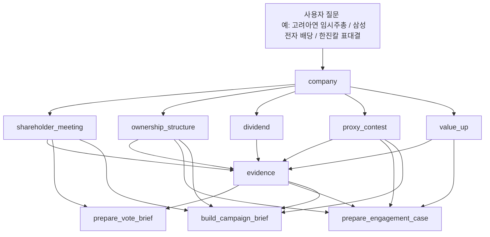
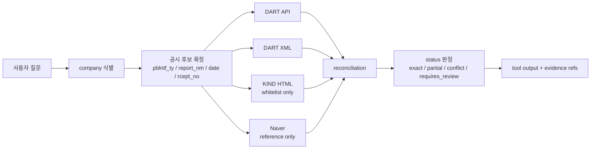

# release_v2 tool 아키텍처

## 목적

release_v2의 전체 공개 표면을 `어떤 질문을 어떻게 풀어가는 구조인지` 기준으로 도식화한 문서다.  
핵심은 `회사 식별`, `데이터 탭`, `결과물 탭`, `근거 탭`이 어떻게 연결되는지 한눈에 보이게 하는 것이다.

## README식 계층 구조

```text
OpenProxy MCP v2
├─ 0. Entry
│  └─ company
│     ├─ company identification
│     ├─ ticker / corp_code / ISIN
│     └─ recent filings index
│
├─ 1. Data Tools
│  ├─ shareholder_meeting
│  │  ├─ summary
│  │  ├─ agenda
│  │  ├─ board
│  │  ├─ compensation
│  │  ├─ aoi_change
│  │  ├─ results
│  │  ├─ corrections
│  │  └─ evidence_refs
│  │
│  ├─ ownership_structure
│  │  ├─ summary
│  │  ├─ major_holders
│  │  ├─ blocks
│  │  ├─ treasury
│  │  ├─ control_map
│  │  └─ timeline
│  │
│  ├─ dividend
│  │  ├─ summary
│  │  ├─ detail
│  │  ├─ history
│  │  ├─ policy_signals
│  │  └─ evidence_refs
│  │
│  ├─ proxy_contest
│  │  ├─ summary
│  │  ├─ fight
│  │  ├─ litigation
│  │  ├─ signals
│  │  ├─ timeline
│  │  ├─ vote_math
│  │  └─ evidence_refs
│  │
│  ├─ value_up
│  │  ├─ summary
│  │  ├─ plan
│  │  ├─ commitments
│  │  ├─ timeline
│  │  └─ evidence_refs
│  │
│  └─ evidence
│     ├─ snippet
│     ├─ section
│     ├─ rcept_no
│     ├─ source_type
│     └─ confidence
│
└─ 2. Action Tools
   ├─ prepare_vote_brief
   ├─ prepare_engagement_case
   └─ build_campaign_brief
```

## 1. 공개 표면



## 2. 애널리스트 관점 해석

- `company`
  - 회사 이름으로 시작해서 ticker, corp_code, 공시 인덱스를 잡는 입구
- `shareholder_meeting`
  - 주총 안건, 후보, 보수한도, 결과를 보는 탭
- `ownership_structure`
  - 지분 구조와 지배력 지형을 보는 탭
- `dividend`
  - 배당정책과 배당결정 흐름을 보는 탭
- `proxy_contest`
  - 위임장, 소송, 5% 보유변화, 표 대결 신호를 보는 탭
- `value_up`
  - 밸류업 계획과 이행 메시지를 보는 탭
- `evidence`
  - 위 결과들의 원문 근거를 다시 확인하는 탭

즉 release_v2는 먼저 `데이터 탭`을 열고, 이후 `결과물 탭`을 얹는 구조다.

## 3. 내부 처리 구조

```text
Public Action Tools
  - prepare_vote_brief
  - prepare_engagement_case
  - build_campaign_brief

Public Data Tools
  - company
  - shareholder_meeting
  - ownership_structure
  - dividend
  - proxy_contest
  - value_up
  - evidence

Internal Services
  - company identifier
  - disclosure resolver
  - source policy / whitelist checker
  - evidence builder
  - status / requires_review evaluator

Parsers / Fetchers
  - DART list.json
  - DART document.xml
  - DART structured APIs
  - KIND HTML
  - Naver profile/news (보조)
```

## 4. source flow



## 5. 도구별 역할 분담

| 층 | 역할 | 금융적으로 의미하는 것 |
|---|---|---|
| `company` | 식별 | 이 회사가 맞는지 먼저 확정 |
| `data tools` | 사실/원문/구조화 데이터 | 안건, 지분, 배당, 분쟁, 밸류업의 각 탭 |
| `evidence` | 근거 회수 | 어느 문장/표에서 나온 값인지 확인 |
| `action tools` | 결과물 조합 | 투표 메모, engagement 메모, 캠페인 브리프 |

## 6. proxy_contest의 위치

`proxy_contest`는 `shareholder_meeting`과 `ownership_structure` 사이를 연결하는 탭이다.

```text
ownership_structure = 판의 구조
shareholder_meeting = 이번 표결의 의제
proxy_contest = 그 구조와 의제가 실제 충돌로 번졌는지
```

즉:

- 지분 변화가 있고
- 위임장 문서가 나오고
- 소송이 붙고
- AGM result와 연결되면

그 흐름이 `proxy_contest`에서 한데 모인다.

## 7. shareholder_meeting 내부 계층

`shareholder_meeting`은 겉으로는 하나의 data tool이지만, 내부적으로는 아래처럼 나뉜다.

```text
shareholder_meeting
├─ 1. Company Resolution
│  └─ company name -> ticker -> corp_code
│
├─ 2. Filing Resolver
│  ├─ notice search
│  │  └─ pblntf_ty=E / 주주총회소집공고 / 기재정정 포함
│  ├─ correction resolver
│  │  └─ 최종 notice 선택
│  └─ result search
│     └─ pblntf_ty=I / 정기주주총회결과
│
├─ 3. Source Readers
│  ├─ DART document.xml
│  └─ KIND HTML (results only, whitelist only)
│
├─ 4. Parsers
│  ├─ meeting_info
│  ├─ agenda
│  ├─ board / personnel
│  ├─ compensation
│  ├─ aoi_change
│  ├─ corrections
│  └─ results
│
├─ 5. Reconciliation
│  ├─ date consistency
│  ├─ agenda/result consistency
│  └─ status assignment
│
└─ 6. Evidence Builder
   ├─ rcept_no
   ├─ section
   ├─ snippet
   └─ source_type
```

## 8. shareholder_meeting가 정기주총일 때 무엇이 트리거되나

핵심은 `scope`에 따라 필요한 것만 트리거하는 것이다.  
내 추천은 `summary`가 모든 하위 파서를 다 돌리는 구조가 아니라, 필요한 범위만 점진적으로 여는 구조다.

### `shareholder_meeting(company="삼성전자", meeting_type="annual", scope="summary")`

```text
1. company resolution
2. annual notice search (E)
3. correction resolver
4. DART XML fetch
5. meeting_info parser
6. agenda parser (top-level summary only)
7. evidence refs 생성
```

이 경우에는:

- 주총 일시/장소
- 제1호, 제2호 같은 안건 제목
- 이사회/정관변경/보수한도 안건 존재 여부

정도까지만 먼저 보여준다.

### `scope="board"`

```text
summary 기본 단계
└─ personnel parser 추가
```

이 경우에는:

- 사내/사외이사 후보
- 경력
- 재선임/신규 여부

가 핵심이다.

### `scope="compensation"`

```text
summary 기본 단계
└─ compensation parser 추가
```

이 경우에는:

- 이사/감사 보수한도
- 전년도 소진율

을 본다.

### `scope="aoi_change"`

```text
summary 기본 단계
└─ aoi_change parser 추가
```

이 경우에는:

- 정관 변경 전/후
- 변경 사유

를 본다.

### `scope="results"`

```text
1. company resolution
2. annual result search (I)
3. whitelist check
4. KIND fetch
5. result parser
6. evidence refs 생성
```

이 경우에는:

- 찬성률
- 참석률
- 가결/부결

이 나온다.

### `scope="full"`

```text
summary
+ board
+ compensation
+ aoi_change
+ corrections
+ results (if available and whitelist passes)
```

이건 가장 완전한 주총 탭이지만, 제일 무겁다.  
그래서 기본값은 `summary`, 깊이 들어갈 때만 `board`, `compensation`, `results` 같은 식으로 여는 게 맞다.

## 9. release_v2 우선순위

```text
Phase 1
  company
  shareholder_meeting
  ownership_structure
  dividend
  value_up

Phase 1.5
  proxy_contest
  evidence

Phase 2
  prepare_vote_brief
  prepare_engagement_case
  build_campaign_brief
```

## 10. 한 줄 요약

release_v2 아키텍처는  
`회사 식별 -> 데이터 탭 -> 근거 확인 -> 결과물 생성`  
순서로 설계하는 것이고, `proxy_contest`는 그중 `분쟁/표대결 탭` 역할을 맡는다.
