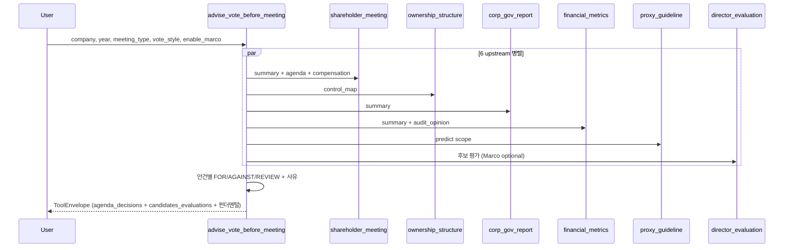

# advise_vote_before_meeting

## 한 줄 요약
주총 **전** 의결권 행사 메모 (운용사 보고서 스타일). 6 upstream 통합 + 후보 평가 3축 (독립성/충실성/결격사유). 안건별 FOR/AGAINST/REVIEW + 결정 사유.

## 사용법
```
advise_vote_before_meeting(
    company="KT&G",
    year=2025,
    meeting_type="annual",
    vote_style="open_proxy",
    enable_marco=False,
)
```

## 입력 인자
| 인자 | 타입 | 필수 | 설명 | 기본값 |
|---|---|---|---|---|
| company | str | yes | 회사명 / ticker / corp_code | - |
| year | int | no | 사업연도 | 0 (자동) |
| meeting_type | str | no | "annual" / "extraordinary" | "annual" |
| vote_style | str | no | open_proxy / m_legacy / s_legacy / t_activist / a_activist / nps 등 | "open_proxy" |
| enable_marco | bool | no | Marco 시나리오 활성 (과거 회사 cross-check) | False |
| format | str | no | "md" / "json" | "md" |

## 출력 schema (data dict)
```json
{
  "agenda_decisions": [
    {"agenda_title": "...", "agenda_category": "director_election",
     "decision": "FOR", "reason": "독립성/결격사유 모두 clean",
     "policy_basis": "Open Proxy Guideline / open_proxy",
     "evidence_rcept_no": "..."}
  ],
  "candidates_evaluations": [
    {"name": "...", "role_type": "사외이사",
     "independence": {"summary": "independent", "sub_factors": {...}},
     "faithfulness": {"marco_scenario": {"summary": "clean", "red_flags": []}},
     "disqualification": {"summary": "clean", "sub_factors": {...}}}
  ],
  "ownership_summary": {...},
  "governance_summary": {...},
  "financial_summary": {...}
}
```

## 매핑 분류 (success / soft-fail / hard-fail)
- 안건 리스트, 후보 이름·임기·약력, 지분, 재무, 감사의견 → **success**
- 후보 약력 자유 텍스트 (dutyPlan / recommendationReason) → **soft-fail** (raw 노출)
- 형사 처벌 / 사적 관계 / 동명이인 / 파산 → **hard-fail** (메모/코드 모두 침묵 — 코붕이 명시 지시)

## 후보 평가 3축
- **독립성**: 최대주주/특수관계인 매칭 / 최근 2년 직원 / 5년 룰 / 회사와 거래 (recent3yTransactions)
- **충실성**: dutyPlan / recommendationReason raw + Marco 시나리오 (옵션)
- **결격사유**: 나이 (미성년) / eligibility 필드 (taxDelinquency / insolventMgmt / legalDisqualification)

## 안건별 결정 logic
- `financial_statements`: 감사적정 + 자본잠식 normal → FOR / 자본잠식 full → AGAINST
- `director_election` / `audit_committee_election`: 후보 cross-match → FOR (clean) / REVIEW (concerns) / AGAINST (red_flag)
- `director_compensation`: 소진율 < 30% + 인상 → AGAINST / 50%+ 인상 → REVIEW
- `cash_dividend`: 배당성향 80%+ → REVIEW / 그 외 → FOR
- `articles_amendment`: 집중투표 배제 → AGAINST / 이사 정원 축소 → REVIEW
- `treasury_share`: 소각 → FOR / 처분 → REVIEW

## Flow


## 관련 공시
- [[주주총회소집공고]]
- [[사업보고서]]
- [[기업지배구조보고서]]

## 관련 개념
- [[의결권]] / [[사외이사]] / [[감사위원]] / [[보수한도]] / [[정관변경]] / [[집중투표]] / [[자본잠식]]

## 변경 이력
- 2026-05-02: advise_vote_before_meeting 신규 (구 prepare_vote_brief 흡수, vote_style + enable_marco)
