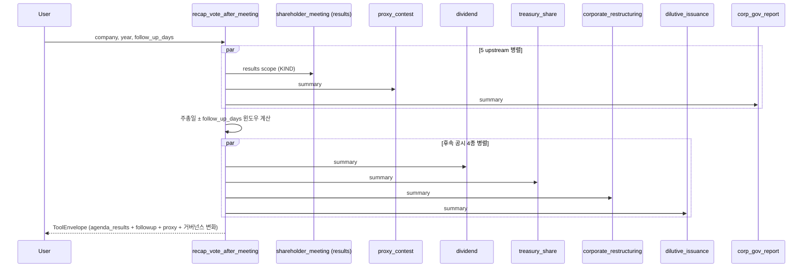

# recap_vote_after_meeting

## 한 줄 요약
주총 **후** 결과 보고 (운용사 분기 의결권 보고서 스타일). 안건별 가결/부결/찬반율 + OPM 정책상 행사 사유 + 후속 공시 30일 윈도우.

**gap 비교 X** (코붕이 명시 지시) — 사전 추천 vs 실제 결과 비교 안 함. 운용사 보고서는 행사한 결정 + 사유만 기록.

## 사용법
```
recap_vote_after_meeting(
    company="삼성전자",
    year=2025,
    meeting_type="annual",
    vote_style="open_proxy",
    follow_up_days=30,
)
```

## 입력 인자
| 인자 | 타입 | 필수 | 설명 | 기본값 |
|---|---|---|---|---|
| company | str | yes | 회사명 / ticker / corp_code | - |
| year | int | no | 사업연도 | 0 (자동) |
| meeting_type | str | no | "annual" / "extraordinary" | "annual" |
| vote_style | str | no | open_proxy / m_legacy / nps 등 | "open_proxy" |
| follow_up_days | int | no | 주총 직후 후속 공시 윈도우 일수 | 30 |
| format | str | no | "md" / "json" | "md" |

## 출력 schema
```json
{
  "meeting_date": "2025-03-26",
  "agenda_results": [
    {"agenda_title": "...", "outcome": "passed", "for_pct": "98.5", "against_pct": "1.5", "attendance_pct": "75.0"}
  ],
  "follow_up_window": {"start": "20250326", "end": "20250425", "days": 30},
  "followup_disclosures": {
    "dividend": {"filing_count": 12, "no_filing": false},
    "treasury_share": {"filing_count": 1, "no_filing": false},
    "restructuring": {"filing_count": 0, "no_filing": true},
    "dilutive": {"filing_count": 0, "no_filing": true}
  },
  "proxy_contest_summary": {...},
  "governance_summary": {...}
}
```

## 매핑 분류
- 안건별 결과 / 후속 공시 4종 → **success**
- 위임장 분쟁 결과 → **success / soft-fail** per parser

## Flow


## 변경 이력
- 2026-05-02: recap_vote_after_meeting 신규 (구 build_campaign_brief 흡수). gap 비교 logic 의도적 제거.
