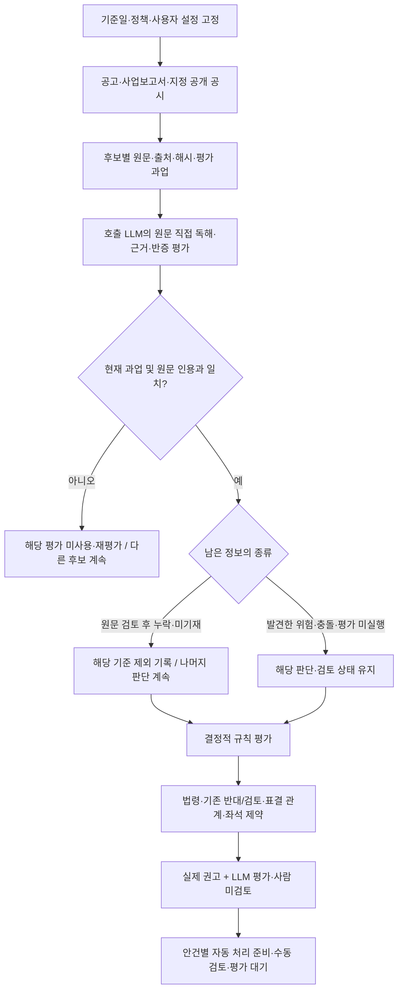

# OPM guideline v2 명세·설계·판정 로직 및 파일럿 검증

## 현황·로드맵

> **결론 요약**
>
> **최신 0.7.2로 10개사·정기 10회·임시 1회, 지원 대상 39과업을 전부 실행했다.**
>
> - **실제 결과:** 39과업이 최종 수용됐고 미평가는 0이다. 조건부 중복을 포함한 42개 적용행은 찬성 21·반대 1·검토 20, 자동 준비 18·수동 24다. 각 회차의 실제 HTTP MCP와 최종 JSON·Markdown 응답까지 확인했다.
> - **판단에 반영한 것:** 신규·재선임, 출석 대상 구간, 제안주주 현직·계열회사 겸직, 현직/전직 공시 충돌과 표결 조건. 미공개 관계 세부만 후속 확인으로 남겼고 공개된 우려를 지우지 않았다.
> - **남은 문제:** 고려아연의 안건 구조·조건 설명과 골프존홀딩스 정관 설명 일부를 교정·재확인해야 한다. 이후 새 표본·다른 모델·보수적 성향을 비교한다. 지원 과업 처리 완료는 전체 안건 정확성·조사 완료·운영 배포를 뜻하지 않는다.
>
> **현재 단계는 04다.** 다른 모델 계열·새 표본 비교, 운영 준비와 배포는 남아 있다. 모든 정성 평가는 **LLM 평가 · 사람 미검토**다.

아래는 **현재 사외·독립이사 후보 자문 범위를 운영 MCP에 배포하는 순서**다. 단계는 일정이나 완성도 퍼센트가 아니라 확인한 도달점을 나타낸다.

| 단계 | 상태 | 도달점 | 완료한 것 | 남은 일·완료 기준 |
|---|---|---|---|---|
| 01 | 완료 | 설계·정책 계약 | Astra·Fable 관점 통합, 정책 JSON, 평가 입력 계약, 명세와 실행 도식 작성 | 이 단계의 최소 계약 완료. 범용 고객 정책은 확장 트랙에서 다룬다. |
| 02 | 완료 | 실제 MCP 연결 | 공개 원문 → 호출 LLM 평가 → 인용·과업 검사 → 실제 후보 권고 연결. 0.3·0.5에서 실제 MCP 동작 확인 | 연결 완료. 새 계약의 실측은 03에서 별도 확인했다. |
| 03 | 완료 | 유연한 LLM 흐름 | 0.6 실제 MCP에서 원문 직접 판독, 누락 기준 제외, 설정별 자동·수동 분기, 오류 후보 격리 확인. 0.7은 후보 이름 없는 회사 공시와 문맥 이어 읽기를 추가 | 이 단계의 실행 계약 확보. 보수적 성향의 일관성과 범용 후보 생성은 추가 검증·확장 대상이다. |
| 04 | 현재 도달 | 판정 교정·품질 검증 | 최신 0.7.2 동결 엔진으로 10개사·11회차·39과업 전부 실행, 최종 미평가 0. 원문 추가·자료 교체 후 변경 후보 재평가와 최종 JSON·Markdown 확인 | 발견한 안건 구조·설명 오류 교정·재확인. 다른 실제 모델 계열·보수적 성향·새 표본에서 조사 충분성과 사실 귀속 검증 |
| 05 | 다음 착수 | 출시 운영 준비 | 요청별 정책·설정과 과업을 묶는 계약, 사람 미검토 표시, 수동 지정 분기, 호출자가 보존하는 공시 checkpoint 구현 | 출시 범위·기본 모드·품질 통과 기준을 명시하고 정책 버전 활성화·복구, 수동 처리 인계와 오류 대응을 검증한다. |
| 06 | 남음 | 범위 한정 배포 | 로컬 파일럿까지만 확인했다. v2를 운영에 배포하지 않았다. | 변경을 커밋·푸시하고 main CI로 배포한 뒤 live MCP에서 과업 수신·평가 제출·최종 권고·설정별 분기를 확인한다. |

### 바로 다음 작업

**다음은 실제 실행에서 드러난 안건 구조·설명 오류를 먼저 좁혀 고치는 일이다.** 고려아연의 후보 수·좌석 수·선행 조건과 골프존홀딩스 정관 변경의 설명을 원문에 대조한다. 후보 평가가 수용됐다는 사실로 기존 엔진의 보호 사유까지 맞았다고 보지 않는다. 해당 경로를 교정·재확인한 뒤 새 표본·다른 모델·보수적 성향을 한 번에 하나씩 바꿔 조사 충분성·사실 귀속·스킵·권고 차이를 대조한다. 이후 05의 정책 활성화·복구·수동 인계를 검증한다. 같은 회사의 정기·임시도 별도 마감과 자료 묶음으로 유지한다.

**동기화 기준 (2026-09-10):** 진행 브랜치는 `claude-fable-5.1-opm-guideline-v2`다. v2 구현 기준 `4bd3674e`에 운영·원격 main 기준 `d1f83d10beb36c8760473588df9284db7f3f1502`의 변경 16개를 통합했다. 이 SHA는 GitHub production 성공 배포 기록과 일치하며 운영 `/health`도 정상 응답했다. v2가 운영에 배포됐다는 뜻은 아니다. 10개사 회차별 검증의 실행 결과는 아래에 반영했다. 실제 다른 모델 계열 비교는 남아 있다.

## 가이드라인·판단 원칙

**Peeking 금지가 최우선이다.** 각 주총의 판단시점까지 공개·입수 가능했던 근거만 사용한다. 기존 일 단위 `as_of`와 별도로, 새 하네스는 시간대가 있는 `cutoff_at`과 소집공고 접수번호를 고정한다. 날짜만 확인된 자료는 마감일 전일까지 사용하며, 이 통제만으로 모든 원천의 역사적 내용과 의미 정확성이 검증됐다고 보지 않는다.

- **시간:** 공개시점이 마감시점 이내임을 입증하지 못한 자료는 판단 입력에서 제외한다. 같은 날 공개순서가 불명인 자료, 사후 정정·결의 결과·판결·보도도 같다. 제외 항목을 알리고 남은 근거로 계속 판단한다.
- **근거:** 파서는 보조 도구다. LLM이 허용된 원문을 직접 읽고 사실·추론·반증을 구분한다. 미기재·미공개는 해당 기준만 스킵하며, 발견한 위험이나 충돌까지 지우지 않는다.
- **정책:** 당시 법령·정책의 유효 버전을 구분한다. 현재 v2를 과거 자료에 적용하는 실험은 별도로 표시하며 당시 실제 기관 정책의 재현으로 부르지 않는다. 후속 사건을 보고 과거 평가용 규칙을 고쳐 같은 검증에 재사용하지 않는다.
- **사용자 설정:** 보수적·기본 성향과 전체 자동·일부 수동·전체 수동 처리 수준을 분리한다. 출석 기본 기간은 직전 완료 사업연도 중 실제 직무 수행 대상 기간이다.
- **실무 기록:** 운용사·행동주의 투자자·연기금 담당자가 근거, 판단, 건너뛴 기준, 수동 인계 사유를 확인할 수 있게 한다. 기사 논조는 사용하지 않고 공식 판단의 존재·절차와 이해상충을 구분한다. 정성 평가는 **LLM 평가 · 사람 미검토**다.

현재 지원 범위는 사외·독립이사 후보 자문과 별도 회사 거버넌스 검토다. 자동 처리 준비는 실제 투표 전송을 뜻하지 않는다.

### 판단 기준과 적용 범위

Astra 설계의 근거·판정 계약과 Fable 리뷰의 운영 범위를 합친 설계안을 최종 후보로 기록한다.
전체 비교·HTML·JSON·플로우차트는 `output/guideline-synthesis-20260908/`에 보관한다.
이 문서는 그 설계를 OPM 런타임에 연결한 최소 파일럿과 실제 호출 결과를 함께 기록한다.

v2는 아직 공식 의결권 정책이 아니다. `vote_style="opm_guideline_v2"`의 기본 shadow는
기존 권고를 유지한다. 명시적 `guideline_mode="pilot"`에서는 호출 LLM 평가를 받아
후보 범위의 실제 `decision`에 반영한다. 모든 수용 평가는 「LLM 평가 · 사람 미검토」로 표시한다.
서버 내 별도 LLM 자동 호출은 없다. 호출 AI가 원문 평가 후 같은 MCP에 평가를 제출하는 두 단계다.


통합 설계 → 실제 공시 수집 → LLM 평가 수용 → 후보 범위의 실제 권고 적용까지 구현했다.
v2가 기준일 이전 최신 사업보고서와 선택된 소집공고를 읽고, 기간별 출석 관측과 평가 과업을 반환한다.
0.5.0에서 임원 변동 공시의 제한된 자동 탐색과 회의·재직·직무정지 평가 입력을 연결했다.
0.6.0은 누락 항목의 명시적 제외, 사업연도 원문 직접 판독, 요청별 성향·문턱 설정,
안건별 자동 처리 준비·수동 검토 분기를 추가한다. 평가 입력 한 건의 스키마 오류가 다른 후보를 중단시키지 않는다.
출석은 직전 완료 사업연도 기준으로 서버가 분모·분자를 계산하되 그 입력의 의미·완전성은 LLM 평가이며 사람 미검토다.
0.7.0은 공시 간 문맥 탐색과 근거별 추출 교정, 최대 30개사의 LLM 거버넌스 검토 및 증분 조회를 추가한다. 버전별 실제 MCP 결과는 아래 검증 절에 구분한다. 과거 버전 실측을 새 버전의 성공으로 전용하지 않는다.
공정위·기업집단 원천 연결, 독립 정확성 평가, 범용 고객 정책 운영, 운영 배포는 남아 있다.

#### 사용자 원칙과 구현 경계

이 작업은 **LLM 기반 워크플로와 실행 하네스**다. 파싱은 원문 접근과 데이터 추출을 돕는 도구다.
추출 실패나 파서와의 불일치는 원문을 직접 읽을 계기이며, 그 사실만으로 자료 부재나 판단 불가를 확정하지 않는다.
원문에서 확인한 내용은 인용해 평가하고, 누락·미기재는 해당 항목만 제외한 사실을 알리며 나머지 판단을 계속한다.
미확인값을 0·관계 없음·반대 사실로 채우지 않는다. 실제로 발견한 충돌과 아직 읽지 않은 상태는 누락과 구별한다.

보팅 성향과 자동화 수준도 분리한다. 보수적 성향은 확인된 위험과 예외 근거를 더 엄격히 해석하는
LLM 지침이며 모든 누락을 반대 또는 수동 검토로 바꾸는 설정이 아니다. 자동화 수준은 나온 권고를
어떤 안건부터 자동 처리 준비 또는 수동 검토로 보낼지 정한다. 현재 MCP는 실제 투표를 전송하지 않는다.

이전 단계의 실제 MCP 조회로 확인한 추출 보조 개선은 다음과 같다. 추출 결과는 LLM 판단의 정답이 아니다.

- KT&G 2025년 사업보고서 `20260318001422`: 기존에 놓친 `성명(100%)` 형식을 읽어
  8명·2개 기간의 15개 관측값을 반환한다. 이번 주총 신임 후보의 과거 임기 출석률로 전용하지 않는다.
- 고려아연 2025년 정정 사업보고서 `20260813001726`: 기존 출석 요약에 섞인
  내부거래위원회 수치를 이사회 출석률에서 제외했다. 이사회 표는 회차별 형식이므로
  `format_unsupported`와 원문·다음 확인 경로를 반환한다. 원문에 자료가 없다는 뜻이 아니다.
- `proxy_advise_before_meeting`의 JSON/Markdown 모두 출석 근거 조회 결과와 후보별 평가 대기를 표시한다.
  수집된 연간·구간별 값을 직전 임기 전체 값으로 자동 수용하지 않는다.

사용자는 정성 평가를 LLM에 위임하되 사람 미검토를 표시하도록 승인했다.
사용자는 직전 완료 사업연도 적용을 승인했다. 0.5.0부터 pilot의 기간은 last_completed_fiscal_year이며 기본 shadow의 prior_term 정책은 유지한다.

#### 출석기간 정책 (0.5.0부터 적용, 0.6.0 직접 판독 보강)

기본 기간은 **직전 완료 사업연도**, 임기 전체 기록은 반복 저출석을 살피는 보조 근거로 둔다.
최근의 책임 수행을 같은 시간 단위로 비교하고, 중도선임·직무정지로 인한 분모 왜곡을 줄이기 위해서다.

- 분자: 해당 사업연도 중 재직하며 직무 수행 대상이었던 이사회 회의의 실제 참석 횟수.
- 분모: 같은 구간의 참석 대상 이사회 회의 수. 안건 수·위원회 회의 수를 섞지 않는다.
- 중도선임·사임·법원 직무정지 등 제외 구간은 날짜와 원문 근거를 기록한다. 단순 불참 소명과 법적 직무 제외는 별도다.
- 여러 공시 구간은 참석 횟수/대상 회의 수를 합산한다. 퍼센트 단순 평균은 금지한다.
- 대상 회의 수를 표시한다. 짧은 재직·적은 회의 수는 대표성의 한계로 설명하며 그 사실만으로 확인된 계산을 막지 않는다. 최소 표본 수치 문턱은 없다. 회의 목록·재직 구간 자체가 미확정이면 unknown으로 남기고 누락과 충돌을 구별한다.
- 사임 후 다시 후보가 된 사람도 평가연도의 실제 재직 이력을 지우지 않는다. 0.7.1에서 이번 공시 선임구분과 평가연도 재직을 함께 읽도록 명확히 했다. 복귀·연속 재임의 세부 이력을 별도 구조화 필드로 확장하는 일은 남아 있다.
- 의결 기준일 전에 공개되지 않은 사업연도 자료는 사용하지 않는다. 확보한 원문에서 기간을 직접 읽을 수 있으면 평가하고, 필요한 정보가 없으면 그 항목만 제외한다. 전년 수치를 최신 연도라고 이름 바꾸지 않는다.

이형규 후보는 2025년 직무정지뿐 아니라 2026년 5월 29일 사임이 이번 소집공고
`20260811000705`에 기재돼 있다. 사업보고서의 과거 재직 상태만으로 현재 연임을 확정하지 않는다.

### 정책 설계 상세

#### 다섯 축을 분리한다

한 규칙에 출처, 효과, 근거 상태, 위임 수준, 운영 상태를 섞지 않는다.

| 축 | 기록할 값 | 적용 원칙 |
|---|---|---|
| origin | 법령, 기관 정책, OPM 정책, 고객 정책 | 출처를 보존하고 기관 정책을 OPM 정책으로 이름 바꾸지 않음 |
| effect | `oppose`, `support_basis`, `require_review`, `inform` | 신호와 확정 권고를 구분 |
| evidence | `fact`, `derived_fact`, `assessment` + known/unknown/conflicting | 결측을 `false`·0으로 치환하지 않음 |
| delegation | 사람 또는 승인된 평가자 | 모델 confidence를 승인 근거로 사용하지 않음 |
| operations | 검토 상태, 의결권 자격, 제출 권한, 실행 이력 | 분석 결과와 실제 투표 실행을 분리 |

#### 정책은 작성본에서 실행본으로 컴파일한다

아래는 목표 설계다. 현재 파일럿은 JSON 정책과 평가 계약을 연결하고 요청별 성향·출석 문턱·검토 분기를 적용한다.
범용 정책 컴파일러·고객별 규칙 상속·자동 변경 감지·정책 활성화 승인 흐름은 아직 구현하지 않았다.

PolicySource에 규칙·예외·지표·단위·분모·기간·적용일·권한·오버레이를 기록하고,
컴파일 단계에서 타입·참조·상속 순환·충돌을 검사한다. ResolvedPolicy에는 상속이 풀린 값,
변경 이유, 원문과 정책 hash, 컴파일러·스키마 버전을 고정한다. HTML은 JSON에서 생성한다.

기본 shadow 파일은
[`opm-guideline-v2.json`](../../open_proxy_mcp/data/guideline/opm-guideline-v2.json),
실제 LLM 파일럿은 별도
[`opm-guideline-v2-pilot.json`](../../open_proxy_mcp/data/guideline/opm-guideline-v2-pilot.json)이다.
현재
출석률·재선임·예외 수용·독립성 평가 수용·긍정 커버리지 게이트를 최소 계약으로 둔다.
출석률 기본 문턱은 75%이고 요청별 `guideline_workflow.attendance_min_pct`로 50~100% 범위에서
변경할 수 있다. 성향만 conservative로 바꾸면 수치 문턱은 유지된다. 적용한 설정을 정책에 포함해
정책 hash·task_id에 연결한다. 기관 공식 기준이나 범용 고객 정책 상속 기능을 뜻하지 않는다.

#### LLM의 역할과 출력

LLM은 원문에서 안건·후보·관계·조문·소명·반증의 후보를 만들고, 인용 위치·주체·기간·단위
검증을 거쳐 평가로 수용한다. 현재 자동 검증은 대상·시점·정책 hash와 원문 인용 연결까지다.
의미 정확성·주체 귀속·평가자 신원·근거 완전성을 자동 인증하지 않는다.
정성 평가는 사용자가 위임한 LLM 파일럿이며 사람 검토 여부는 항상 false다.
정책 엔진은 작은 결정적 표현식만 평가하고 다음 상태를 보존한다.

- 정책 전체를 평가해 `not_applicable`, `not_triggered`, `fired`, `excepted`, `unresolved`를 기록하고, pilot에서 명시적으로 제외한 기준은 `skipped_missing_information`으로 구별한다.
- 확정된 반대 근거와 검토 필요 상태를 동시에 보존한다.
- 읽은 자료의 누락·미기재는 해당 기준만 제외하고 `skipped_checks`에 남긴다. 남은 평가로 판단하되 평가 미실행·자료 충돌을 누락으로 둔갑시키지 않는다.
- shadow는 기존 권고를 유지한다. pilot은 사외·독립이사 후보에 대해 실제 권고를 만든다.
- 법령·표결없음·조건부/경합·기존 반대와 후단 부모/자식·좌석 제약은 보존한다. 기존 REVIEW를 해제하려면 아래의 근거별 교정 계약을 통과해야 한다.
- 평가 과업에는 기존 점수·권고를 넣지 않는다. 교정 대상의 원래 관측값은 `baseline_findings`로 공개하여 원문과 대조하게 한다. 같은 관측을 정답이나 독립 검증 기준으로 취급하지 않는다.
- task_id는 회사·후보·생년월일·역할·안건·기준일·정책·원문을 묶는다. 동일 요청에서만 평가를 사용하며 서버에 저장하지 않는다.

응답에는 전체 `guideline_application`과 안건별 `guideline_trace`를 넣어 어떤 규칙이 평가됐고
무엇이 부족한지 재현할 수 있게 한다. 정책 갱신은 변경 감지와 영향 범위 계산을 자동화하되,
의미가 바뀌는 버전의 활성화는 정책·법률 책임자 승인을 거친다.

### 정보·기사 사용 기준

#### 공개되지 않은 관계 정보 처리: 0.3.0 도입과 현재 확장

사용자는 공개 공시·기관 원문을 먼저 찾고, 공개되지 않은 고용·자문·보수 세부는 추가 확인으로
남기되 그 정보 부재 자체를 필수 판독 기준에서 제외하도록 승인했다. 정책 0.3.0-pilot과
평가 계약 `opm-llm-assessment/2`에 반영했다. 0.6.0에서는 일반 누락도 각 판단의
unresolved_kind로 명시해 해당 기준을 제외할 수 있도록 확장했다. 비공개 관계 세부용 객체는 기존 범위를 유지한다.

- `no_public_concern`: 검토한 공개자료에서 구체적 우려를 확인하지 못했다는 범위 한정 평가.
  관계가 실제로 없다는 사실 또는 독립성 보증으로 이름 바꾸지 않는다.
- `information_gaps`: 질문, 정보 부재 상태, LLM이 신고한 검색범위, `follow_up_only`를 남긴다.
  Markdown은 「판단 제외 · 추가 확인」으로 표시한다. 서버가 검색의 완전성까지 인증하지 않는다.
- 실제 발견된 위험 정황·후보 귀속 충돌은 단순 누락으로 제외하지 않는다. 조회 실패는 상태를 보존하고
  다른 원문 경로를 확인한다. 원문 검토 후에도 없는 선임구분·출석 자료 등은 0.6.0의 일반 누락 계약으로
  별도 표시할 수 있다. 알려진 반대 정황을 자료 부재로 바꾸어 지우는 규칙은 아니다.



#### 기사 사용 원칙: 사실·절차와 평가 분리 (0.4.0)

사용자 지시에 따라 기사 긍부정 논조·평판 평가·찬반 권고를 판단 입력에서 제외한다.
실행 정책 JSON의 `assessment_rubric.news_evidence`에 반영했으며 기사 자체를 자동 수집하거나
사건 상태 필드를 강제로 검증하는 모듈을 추가한 것은 아니다. 현재 LLM이 읽는 기준이다.

| 확인 대상 | 기록 방법 | 금지할 도약 |
|---|---|---|
| 의혹·논란·문제 제기 | 주장자·대상·주장 내용·공개일과 출처 | 문제 제기가 있었다 → 위법·부적격 확정 |
| 수사·기소 | 기관·사건·혐의·절차 단계의 확인된 범위 | 기소 → 유죄 또는 처벌 확정 |
| 공식 판단 | 법원/처분기관·사건번호·판단일·주문·심급·확정/불복 상태 | 행정처분 → 형사 유죄, 1심 → 확정판결 |
| 반론·후속 변경 | 기준일 이전 정정·불기소·무죄·취소·상급심 변경 함께 확인 | 불리한 첫 보도만 유지 |
| 매체의 해석·찬반 평가 | 판단용 사건 사실에서 제외 | 부정적 기사 수·논조를 독립성 지표로 사용 |

공시·법원·수사기관·규제기관 원문을 우선한다. 보도는 취재·정정 책임이 있는 주요 일간지·경제지·
종합지·방송사·통신사·외신을 우선하며, 매체 규모를 자동 진실 인증으로 쓰지 않는다.
원문 미확보는 판결 부재와 다르고, 주요 매체가 인용한 당사자 주장도 독립 검증 사실과 다르다.
같은 보도자료·통신기사를 전재한 여러 기사는 독립 확인 여러 건으로 세지 않는다.

이 원칙으로 이전 백인규·박유경 평가도 다시 읽어야 한다. **기사에 독립성 논란이 있다는 것만으로
필수 REVIEW를 만들면 안 된다.** 문제 제기는 출처를 찾을 단서로 남기고, 확인된 행위·거래·역할과
그 중요성이 실제 OPM 규칙에 해당하는지를 평가한다. 기존 대안형 안건의 REVIEW 제약은 별개다.
기사의 법적 해석이나 다른 자문사의 반대 결론은 OPM 결론으로 복사하지 않는다.
반대로 독립성은 법률 위반과 다른 판단이므로 확인된 경제적 의존 관계의 평가에 반드시 형사 유죄
확정판결이 있어야 하는 것은 아니다. 법적 책임과 감독상 이해상충을 별도 축으로 둔다.

기록할 근거 항목은 주체 동일성, 사건 유형, 보도된 주장과 주장자, 사건일·공개일, 매체·원문 링크,
공식 원문 확보 상태, 기관·사건번호·판단일·절차·주문·확정/불복 상태, 반증, 적용할 OPM 규칙이다.
이는 구조화 확장의 설계이며 현재 JSON Schema의 강제 입력 필드는 아니다.

### 출처와 시점 관리

#### 공시 활용 공백 점검: 전체 부재와 v2 연결 부족 구별

2026-09-09 코드와 공식 API 명세를 점검했다. 회사 전체 표본 검증이나 새 원천의 자동 수집 완료를
뜻하지 않는다. 다음 작업은 새로운 파서보다 **이미 제공하는 원문·정형 데이터를 시점과 후보에 연결**하는 것이다.

| 우선순위·원천 | 현재 OPM 활용 | v2에 보강할 근거 및 시점 주의 |
|---|---|---|
| 1 · 소집결의·소집공고·정정·위임장 권유 | 안건·후보·관계 파싱 및 별도 위임장 도구 존재. 추가 KIND는 수동 지정 가능 | 안건/후보 철회·수정과 신구조문, 양측 주장의 원출처. 같은 회차 정정 계보와 공개시각을 묶고 주장은 사실과 분리 |
| 1 · 과거 정기/임시 주총결과·임원변경 공시 | 결과 수집과 직전 정기주총 맥락 존재 | 선임·임기 시작·안건 변경의 확정 근거. 직전 연도 정기 회차만이 아니라 기준일 이전 중간 임시 회차도 연결. 해당 평가 회차의 사후 결과는 판단 및 정답에 미사용 |
| 1 · 분기·반기보고서 임원현황 | director_board/director_evaluation/ownership_structure에 대체 조회 경로 존재 | 연중 임시주총에 최신 당해연도 재직 변동 연결. director_evaluation의 경로는 전년도 사업/3분기/반기 중심이므로 당해연도 신규 자료 선택 보강. 부분 명단·생략을 퇴임으로 추정하지 않음 |
| 1 · 감사·비감사용역 계약 | 정책에는 언급되나 해당 정형 API의 서비스 연결은 발견하지 못함 | 계약 내용·보수·수행기간·상대 법인, 후보의 당시 역할을 결합. 회사의 회계감사인 대상 공시이므로 다른 자문사의 모든 계약을 포괄하지 않음 |
| 2 · 사업/반기/분기 원문의 주요주주 거래·특수관계자 주석·제재·소송·우발사항 | 재무·지분·리스크 도구가 일부 수집. 후보별 v2 과업은 공고와 이사회 절 중심 | 계약 상대방·규모·기간·보증·소송 진행 및 제재기관 원문 경로. 대상 회사뿐 아니라 후보 소속회사에서 상대 회사를 역조회. 법인 관계를 개인 책임으로 전용하지 않음 |
| 2 · 지배구조보고서 본문·표·설명 | 15개 핵심지표 외 세부원칙·서식 표·세부 항목 수집도 존재 | 독립성 판단 근거, 이해상충 통제, 위원회 활동을 후보 원문 패킷에 연결. 같은 연도라도 주총 후 공개본은 소급 금지. 금융회사 첨부형은 문서 미제출로 취급하지 않음 |
| 2 · 별도 감사보고서·감사보고서 제출·정정 | 감사의견 경로 존재하나 사업보고서 의존과 한계가 문서화됨 | 주총 전 별도 감사보고서의 의견·내부통제 및 관련 주석 확인. 사업보고서가 아직 없다는 이유로 감사의견도 없다고 추정하지 않음 |
| 2 · 5% 대량보유·최대주주 변경·주식보유 변동 | ownership_structure에 조회·변동 처리 존재 | 실제 지분 연결·공동보유 약정·주주제안 주체 파악. 기업집단 연간 자료를 최신 공시로 보완하며 보유 관계가 곧 의결권 공동행사를 뜻하지는 않음 |
| 2 · 소송·횡령배임 등 수시공시와 기관 후속 원문 | risk_events는 혐의발생/진행/처벌 등 제목 단계와 원문 제공 | 후보 동일성과 사건·절차·확정 여부를 원문으로 대조. 제목 단계만으로 판결/확정 상태를 결정하지 않음 |

OpenDART [정기보고서 주요정보](https://opendart.fss.or.kr/guide/main.do?apiGrpCd=DS002)는
[임원현황](https://opendart.fss.or.kr/guide/detail.do?apiGrpCd=DS002&apiId=2019010),
[감사용역](https://opendart.fss.or.kr/guide/detail.do?apiGrpCd=DS002&apiId=2020010),
[회계감사인과의 비감사용역](https://opendart.fss.or.kr/guide/detail.do?apiGrpCd=DS002&apiId=2020011)
API를 제공한다. 비감사용역은 내용·계약일·수행기간·보수를 얻을 수 있어 우선 연결 가치가 높다.
단위·당기/전기·개별 계약과 합계, 상대 회계법인 및 후보 개인 귀속은 원문 대조가 필요하다.

#### 시의성·정확성의 공통 기준

- **사건/관계의 유효 시점, 보고서 대상기간, 공개 시점, 조회 시점**을 따로 남긴다.
  최신 제출 문서가 더 최신 사실을 담는다고 단정하지 않는다. 오래된 사업보고서의 정정일은 최신 재직일이 아니다.
- 기준일 이전 공개본 중 필요한 항목을 가장 잘 뒷받침하는 원문을 고르고 정정·철회·후속 결정 계보를 확인한다.
  같은 날 자료는 공개시각과 의결 마감시각까지 필요하다. 현재 as_of는 일 단위이므로 당일 순서를 보장하지 못한다.
- 공고 밖 추가 원문이 후보 이름 주변만 잘리면 회계법인명만 나오는 계약을 놓칠 수 있다.
  다음 확장은 후보명 외 소속 법인 식별자·회사명과 해당 절 단위 조회이며 원문 전체를 버리지 않는다.
- 기존 DART 공통 필터는 rcept_dt가 없는 응답을 그대로 두는 경로가 있다.
  접수번호·실제 접수일을 결합하지 않고 정형 API의 최신 행을 과거 평가의 확정값으로 수용하지 않는다.
- 분야별 완전성을 검사한다. 분기표 생략·익명화·이미지 표·조회 실패·검색 0건을 사실 부재로 변환하지 않는다.
- 출처가 달라도 동일 보도/공시의 복제본이면 증거 한 묶음이다. 공식 공시의 회사 자기진술도 기관 판단과 구별한다.

#### 공개 원천과 추가 연결 계획

| 원천 | 확보 가능한 정보 | 현재 상태 및 사용 경계 |
|---|---|---|
| [KIND 고려아연 소집결의](https://kind.krx.co.kr/external/2026/07/21/000927/20260706001079/91471.htm) | 후보 성명·생년월·신규/재선임·경력 | 실제 MCP 원문 패킷에 연결. KIND 식별자를 DART 접수번호로 변환하지 않음 |
| [KIND 남양유업 임원현황](https://kind.krx.co.kr/external/2025/05/15/002168/20250515005076/11013.htm) | 심혜섭의 상근감사 역할과 당시 재직 시작일 | 실제 MCP에 연결. 과거 회사 역할을 제안주주 고용 관계로 추정하지 않음 |
| [공정위 결정문 목록](https://www.data.go.kr/data/15103246/openapi.do)·[본문](https://www.data.go.kr/data/15103247/openapi.do) | 사건 식별자·피심인·주문·이유·결정일 | 국가법령정보 API 실제 목록·본문 조회 성공. 자동 평가에는 아직 미연결 |
| [기업집단 소속회사](https://www.data.go.kr/data/15091891/openapi.do)·[임원현황](https://www.data.go.kr/data/15091898/openapi.do)·[주주현황](https://www.data.go.kr/data/15091900/openapi.do) | 기업집단·법인 식별, 임원 및 동일인 관계, 주주 연결 | 문서 확인. 별도 공공데이터 API 이용승인·키로 실제 응답 확인 필요 |
| [공개년월 목록](https://www.data.go.kr/data/15091910/openapi.do) | 사용할 수 있는 기업집단 자료 시점 | 연도만 맞춰 최신 자료를 과거 주총에 소급하지 않기 위한 선행 조회 |
| [공정위 공개 사건](https://case.ftc.go.kr/ocp/co/ltfr.do?reprsntVioltTy=02%2A) | 공개 사건·결정문·첨부 원문 | API 누락 및 변경 여부를 대조할 보완 경로 |

공정위 데이터는 공공데이터포털의 LINK 서비스이며 실제 호출 계약은 국가법령정보
[목록 API](https://open.law.go.kr/LSO/openApi/guideResult.do?htmlName=ftcListGuide)와
[본문 API](https://open.law.go.kr/LSO/openApi/guideResult.do?htmlName=ftcInfoGuide)를 따른다.
목록의 `target=ftc`, 사건명/본문 검색, 페이지·총건수를 확인한 뒤 반환 식별자로 본문을 읽는다.
기존 법령 API 자격으로 실제 조회가 가능했으며 키를 새로 받지 않아도 이 경로는 개발 가능하다.

표본에서 법인 사건 본문 조회가 가능했지만 후보 개인명 검색 0건을 무제재로 해석할 수 없었다.
일부 결정일은 `2013.0.0`처럼 불완전했고 본문 안에 이미지 표가 있었다. 날짜를 임의 보정하거나
XML 응답이라는 이유로 표까지 완전히 읽었다고 취급하면 안 된다. API 연결 시 다음을 남긴다.

1. 검색어·검색범위·페이지/총건수·조회시각·실패 상태 및 원문 ID.
2. 법인 피심인과 개인 책임의 구분, 행위 기간과 후보 재직·담당 업무의 겹침.
3. 결정일과 공개일의 구분, 후속 변경·불복의 확인 상태. 시점 확인이 안 된 자료는 과거 판단에 미사용.
4. 원문·문서 해시·누락된 표/첨부 표시. 검색 0건을 관계 없음이나 무제재 metric으로 입력하지 않음.

백인규의 딜로이트 업무 관련 [보도 단서](https://news.skyedaily.com/news/news_view.html?ID=310688)와
박유경의 APG 관련 [보도 단서](https://www.etoday.co.kr/news/view/2619066)는 보고서 원문 및
후보 관여 사실을 더 확인할 항목이다. 공시의 경력은 확인했지만 외부 보도의 법적 해석·찬반 결론을
OPM의 사실이나 정답으로 복사하지 않는다. 관련 보고서·계약 원문이 공개되지 않으면 확인 과제로 유지한다.

#### 임원 변동 공시 표본에서 확인한 연결 조건

사용자가 제시한 두 원문을 2026-09-09 확인했다. 후보 찬반 재평가가 아니라 원천 적합성 점검이다.

| 원천 | 확인한 내용 | v2에 적용할 조건 |
|---|---|---|
| [한화투자증권 독립이사 선임·해임·중도퇴임 신고](https://dart.fss.or.kr/dsaf001/main.do?rcpNo=20260908000407) | 강성윤(1959.06)이 2026-09-08 자진사임 및 재선임 양쪽 표에 등장. 회사는 감사위원 분리선출을 위한 절차라고 설명. 변경 전후 독립이사 수는 동일 | 사임·재선임을 연결하되 원문 사건을 보존. 선임 인원과 퇴임 인원만으로 다른 두 사람의 교체라고 추정하지 않음. 공시 사유는 회사 설명이며 법령 적용의 독립 검증과 구분 |
| [사토시홀딩스 대표이사 변경](https://dart.fss.or.kr/dsaf001/main.do?rcpNo=20260908900560) | 2026-09-08 임시주총의 사내이사 선임과 이사회의 대표이사 선임을 설명하고 관련 공시를 연결. 해당 결의의 사외이사 참석 1명·불참 0명 기재 | 이사 자격과 대표권 사건을 분리. 출석은 회의 집계로 유지. 변경 전 대표이사의 이사직 종료는 별도 확인 |

두 번째 공시 경력표에는 입사일 2026-11-05, 퇴사일 2026-08-13이 표시돼 날짜가 역전된다.
이 불일치는 브라우저 원문 화면으로도 확인했다. 해당 경력의 확정 재직기간으로 수용하지 않고
정정·다른 공시 확인 과제로 남긴다. `-`로 적힌 주주 관계·지분도 자동으로 관계 없음·0으로 바꾸지 않는다.

첫 공시는 실제 MCP `filing_section`의 목차 및 두 절에서 읽었다. 두 번째는 같은 도구가
`NO_VIEWER_NODES`를 반환했지만, 추가 확인 결과 v2의 기존 XML 경로는 두 문서를 모두 읽었다.
따라서 해당 원천에 새 HTML 파서를 추가할 필요가 없으며 기존 XML 수집을 재사용한다.
목차 도구의 실패를 OPM 전체 원문 수집 불가로 일반화하지 않는다.
두 원천의 활용 계약과 자동화 미구현 범위는 「배포·운영 → 확장 아키텍처와 운영 계약」의 재직 이력 계약을 따른다.

#### 공정위 API를 호출할 때

| API | 호출 계기 | 얻은 자료를 사용할 곳 | 사용하지 않을 결론 |
|---|---|---|---|
| 결정문 목록 → 본문 | 공시·기사에 특정 공정거래 사건이 등장하거나 해당 정책의 과거 제재 검토 필요 | 회사·행위·처분·기간·후속결정을 확인한 사건 근거. 후보 재직/담당업무 연결 후 책임·감독 평가 | 사건 제목만 보고 반대, 회사 제재를 후보 개인의 범죄로 표시, 검색 0건을 무제재로 표시 |
| 소속회사 | 후보 소속법인·거래 상대방이 지배주주/제안주주와 같은 집단인지 확인 필요 | 기업집단 코드·법인등록번호·계열편입일을 이용한 법인 관계 연결 | 계열 소속만으로 후보 개인의 독립성 결격 확정 |
| 임원현황 | 후보 또는 관계자가 어느 계열사 임원이고 동일인과 어떤 관계인지 확인 필요 | 임원명·직위·동일인 관계를 DART 생년월·재직기간과 대조 | 동명이인 연결, 모든 직원·자문계약까지 조회했다고 주장 |
| 주주현황 | 소속회사·제안주주·거래 상대방의 지분 연결을 확인할 필요 | 주주구분·명칭·보통/우선주 수와 비율을 최신 지분공시와 함께 확인 | 지분만으로 실질 공동행사·숨은 계약·지배력 확정 |

기업집단 API는 지정 대규모기업집단 범위이며 전체 한국 회사/모든 임직원 데이터베이스가 아니다.
공개년월과 법인 식별자를 먼저 확인하고 최신 임원/지분 변동은 DART/KIND로 보완한다.
예를 들어 후보가 A법인 임원인 경우 A법인의 집단 소속 → 임원 신원·직위 → 회사/제안주주 지분
연결 → 실제 거래·고용 기간 순으로 검토한다. 조회 결과 자체가 자동 반대 규칙은 아니다.
공정위 결정문은 경쟁법 사건의 기관 판단 근거이고 일반 형사 전과 조회 API가 아니다.

## 모델 교체·실행 흐름

실행 순서는 **회차·시점·설정 고정 → 허용 원문 수집 → 호출 LLM 판독·평가 → 인용·규칙 검사 → 권고와 자동/수동 분기**다. 현재 MCP의 평가 계약을 공통 경계로 재사용한다.

| 구분 | 현재 확보 | 남은 구현·검증 |
|---|---|---|
| LLM 판단 | 원문 전달·확대, 평가 제출, 인용 연결, 후보 권고 반영. 호출자 콜백 어댑터·예산 내 실행 루프와 실제 MCP SDK HTTP 전송 구현 | 실제 제공사 모델 연결, 서로 다른 모델 계열의 동일 근거 비교와 성향·판독 품질 검증 |
| 시간 통제 | cutoff_at·회사 소집공고 고정, 날짜만 확인된 자료의 전일 상한, 공개일 불명 제외, 정책·원문 continuation 대조. 실제 MCP 연결 확인 | 같은 날 공개시각의 개별 증명·수용, 원천별 시점 통제 추가 검증, 사후 지식 혼입·의미 정확성 검사 |
| 사용자 설정 | 성향·출석 문턱·자동/수동 분기 | 모델별 성향 일관성, 고객 정책 활성화·복구 |

### 모델 교체 계약

**목표: 같은 자료·정책·설정으로 모델을 교체해 실행한다.** 현재 MCP의 공통 평가 계약에 `CallbackModelAdapter`와 `VotingHarness`를 연결했다. 호출 애플리케이션이 모델 콜백을 제공하면 실제 Streamable HTTP MCP에서 과업을 받고, 추가 읽기·평가 제출·완료 중 허용된 행동을 반복한다. 제공사별 API 호출은 그 콜백의 책임이며 서버가 모델을 실행하지 않는다. 서로 다른 실제 모델 계열 2개의 판단 비교는 아직 실행하지 않았다.

| 공통으로 고정할 것 | 모델 교체 시 바꿀 것 | 완료 확인 |
|---|---|---|
| 회사·주총 회차·마감시점, 당시 공개 원문과 해시 | 제공사·모델 ID/버전 | 같은 근거 묶음으로 서로 다른 모델 계열 최소 2개 실행 |
| 정책 버전·인자·보팅 성향·자동/수동 설정 | 모델별 요청 형식·인증·응답 변환 | 구현한 공통 평가 스키마·오류 격리·재시도 경로를 실제 모델로 확인 |
| 과업 내용·도구 허용 범위·추가 원문 수용 조건 | 모델별 추론·출력 한도 | 검색·정형 API·캐시·직접 읽기 모두 같은 시점 검사 통과 |
| 인용 검사·최종 규칙·결과 항목·계수 방식 | 실행 모델 및 프롬프트 버전 기록 | 실제 HTTP MCP의 권고·스킵·수동 분기, 비용·시간·판독 범위를 대조 |

시점 검사는 하네스의 원천 경계와 추가 조회에 적용한다. 공통 과업에는 허용된 근거만 사용하도록 지시하고 인용을 검사한다. 인용이 맞더라도 해석에 사후 지식이 섞였는지까지 자동으로 판별하지는 못한다. 그런 주장을 발견하면 제거·재평가하고 사후 사실 주입 실험으로 추가 검증한다. 모델 내부의 사전학습 지식을 지웠다고 보증하지 않는다.

모델 비교에서는 동일한 고정 근거로 판단 차이를 먼저 확인한다. 원문 탐색까지 모델에 맡기는 실험은 따로 실행해 발견·판독 범위 차이를 구분한다. 실행 설정과 근거 해시는 감사 가능하게 남기되, 사용자 조회·평가 원문은 공개 저장소에 저장하지 않는다.

### 시점 고정 실행 하네스

**구현 상태:** 요청 계약 `opm-voting-harness/2`, 회차 고정, 원천 시점 검사와 호출자 실행 루프를 구현했다. 실제 HTTP MCP에서 과업 수신→원문 평가→평가 수용→최종 권고까지 확인했다. 현재 정책은 `0.7.2-pilot`이다. 연결 검증과 10개사 원문 품질 대조는 아래에서 구분하며, 실제 다른 모델 간 비교·운영 배포는 남아 있다.

`proxy_advise_before_meeting`에 `vote_style="opm_guideline_v2"`, `guideline_mode="pilot"`, `include_after_meeting=false`와 `guideline_harness={cutoff_at, notice_rcept_no}`를 지정한다. 정확한 회사 소집공고와 기준시점을 확인하고, 날짜만 확인된 자료는 한국시간 기준 전일까지 사용한다. 다음 호출에는 응답의 `continuation`을 그대로 전달해 정책·설정·엔진·기존 원문이 같은지 대조한다. 하네스를 생략하면 기존 호출 동작을 유지한다.

호출자 `VotingHarness`가 MCP SDK의 실제 HTTP 전송과 모델 콜백을 연결한다. 서버는 모델을 실행하지 않는다. 모델은 회차별 조사 질문에 따라 공시 목록 탐색·원문 추가 읽기와 교체·평가 제출·해당 과업 종료를 선택하며, 서버가 인용·정책·처리 분기를 검사한다. 정보 부족은 해당 기준만 스킵해 표시하고, 회사·회차나 기존 근거가 바뀐 실행은 새로 평가한다.

통제별 **목적·코드 위치·동작·예시·한계**와 모델 비교 방법은 마지막 「Appendix A~C」에 모았다. 요청 계약은 서버의 `HarnessRequest`와 `harness.schema.json`을 따른다. 이 실험은 현재 OPM 정책을 당시 허용 원문에 적용하며, 당시 기관 정책의 재현·모든 원천의 완전성·의미 정확성·모델 사전학습 지식 제거를 인증하지 않는다. 별도 `governance_screen`을 자동 호출하는 기능도 아니다.

### 실행 기준과 기본 설정

| 구분 | 다음 검증에 적용할 설정 |
|---|---|
| 회사 범위 | 「검증 계획·결과」에 명시한 10개사. 회사 배치는 최대 30개사 계약을 유지한다. |
| 정보 사용 마감시점 | 실제 주총 회차별로 날짜·시각·시간대를 먼저 고정한다. 회사 사건 검토도 같은 마감시점을 사용한다. `20260909`는 이전 회사 검토의 기준일이며 새 표본 공통 기준일이 아니다. |
| 주총·후보 대조 기준일 | 정기·임시 모두 실제 개최 회차를 식별한다. 조회 기간과 회차 목록은 실행 전에 확정한다. 사후 결과·정정·판결을 당시 판단에 소급하지 않는다. |
| 후보 자문 모드 | `vote_style="opm_guideline_v2"`, `guideline_mode="pilot"`, `include_after_meeting=false`. 기본 도구 호출의 open_proxy·shadow와 구분해 명시한다. |
| 시점·회차 고정 | `guideline_harness={cutoff_at, notice_rcept_no}`를 추가하고 후속 요청에는 응답 continuation을 사용한다. 같은 해 여러 임시주총도 접수번호로 구분한다. |
| 후보 보팅 설정 | `stance="standard"`, `automation="selective"`, `manual_agenda_titles=[]`, `attendance_min_pct=null`. null은 정책 기본 75%를 따르며 직전 완료 사업연도의 실제 직무 수행 대상 기간을 사용한다. |
| 회사 거버넌스 중요도 | `review_materiality="moderate"`. 회사 검토 도구에는 stance·automation을 전달하지 않는다. |
| 설정 비교 | 같은 근거에서 conservative·automatic·manual 및 특정 안건 수동 지정을 비교할 때만 해당 값을 명시한다. 성향 변경만으로 출석 문턱을 바꾸지 않는다. selective에서는 찬성 권고의 자동 처리 준비와 반대 권고의 수동 검토를 구분한다. |
| 결과와 보관 | 정성 평가는 LLM 평가·사람 미검토. 서버가 평가를 저장하거나 실제 투표를 전송하지 않는다. 공개 문서에는 공개 원문 근거·집계·오류 유형을 남긴다. |

첫 호출로 과업과 원문을 받은 뒤 LLM이 필요한 구간을 직접 읽는다. 파싱 실패는 원문 확대와 대안 원천을 사용할 계기다. 추가 원문·설정이 바뀌면 새 과업으로 평가를 제출한다. 누락은 해당 기준만 스킵해 알리고, 실제 충돌·미판독 상태는 누락과 구별한다. 기업이나 후보 한 건의 실패가 다른 건의 처리를 막지 않는다.

### 실행 명세

이 절은 0.7.2-pilot, opm-llm-assessment/6 및 opm-voting-harness/2 코드의 현재 계약이다. 회사 단위 사건·우려의 평가 계약은 `governance_screen`에서 별도로 제공한다. 자동 사건 그래프와 정책 활성화는 뒤의 확장 설계다.

#### 공시 원문을 읽는 실행 경로 (0.7.0)

주총 공고·사업보고서·임원 변동에 더해 최근 1년의 공개매수, 위임장 권유, 대량보유, 소송, 재편, 자사주, 주총 소집결의 등을 제한 탐색한다. 공시 제목은 읽을 문서를 고르는 단서다. 매수자·주주제안자·회사명을 기준으로 우호·적대 진영 또는 후보 책임을 자동 확정하지 않는다.

`guideline_application.context_discovery`는 종류·기간·페이지·실패·미선택 원문을, `research_plan`은 호출 LLM의 발견→읽기→연결→반증→판단 순서를 제공한다. 회사 맥락 원문에는 후보 이름이 없어도 과업에서 제거하지 않는다. 추가 원문은 회사/안건/후보 범위와 `focus_terms`, `text_offset`, `text_chars`로 읽는다. `read_next`는 이어 읽을 요청을 반환한다. 전체 문서 해시와 실제 발췌 구간을 과업에 묶고, 떨어진 문맥 창을 가로질러 인용을 합치는 것은 허용하지 않는다.

한 번에 모든 문서를 읽는 대신 관련성이 높은 원문을 먼저 읽고 필요한 문맥만 넓힌다. 원문이 길거나 첨부 수집이 실패하면 대체 본문·정정 이전 본문을 찾되, 최신 첨부까지 읽은 것처럼 표시하지 않는다. 자동 선택 4건·명시 추가 5건을 넘어서는 자료는 후속 호출로 확인한다. 호출 LLM이 원문을 해석하며 서버 내부에서 별도의 LLM을 실행하지 않는다.

#### 기업 발견·분쟁 추적·대량 검토 (0.7.0)

```python
# 1. 시장에서 읽을 회사 후보 발견. 제목은 위험 판정이 아니다.
screener(types="governance", period="최근 14일", details=False, format="json")
# 2. 회사 중복을 제거해 30개 이하씩 과업 요청.
governance_screen(companies=["대상 회사"], as_of="YYYYMMDD", format="json")
# 3. 호출 LLM이 원문·반증·조건을 읽은 뒤 같은 조건에 평가를 제출.
governance_screen(companies=["대상 회사"], as_of="YYYYMMDD",
    governance_assessments=[평가_JSON], format="json")
# 4. 이후 원하는 시점에 새 접수번호만 구분. 평가의 원문 범위는 유지.
governance_screen(companies=["대상 회사"], as_of="다음_기준일",
    since="이전_기준일", known_receipts=이전_checkpoint의_receipt_ids, format="json")
```

호출자가 수행하는 이 워크플로는 예약 작업을 만들지 않는다. 서버에 사용자 평가·조회 결과·checkpoint를 저장하지 않는다. 사용자 또는 호출 애플리케이션이 이전 접수번호를 보존해 다시 전달한다. 새 접수번호 발견은 변경 내용의 판독 완료를 뜻하지 않으며, 정정의 실질 범위와 후속 사건의 효과는 원문을 대조한다.

| 단계 | LLM의 판단 | 서버가 보장하는 범위 |
|---|---|---|
| 회사 발견 | 사용자 관심사와 공시 유형으로 읽을 회사를 선택 | 시장 스크리너 유형·기간·paging·조회 한계 표시 |
| 원문 판독 | 주체·사건·회차·조건·후속 공시·회사와의 관련성 해석 | 공개일·문서 해시·발췌 구간·실패·이어 읽기 제공 |
| 시그널 평가 | 구체적인 행위와 주주권익 영향을 근거로 우려·반증·누락 작성 | 현재 과업·literal 인용·허용 상태 조합 검사 |
| 검토 우선순위 | high/moderate/low 중요도에 대한 이유 제시 | 사용자의 `review_materiality`에 따라 우선 검토/검토/관찰 경로 결정 |
| 후속 확인 | 신규·정정·결과의 의미와 기존 해석 변경 여부 판단 | 접수번호 차이와 다음 checkpoint 반환. 지속 사건 그래프는 미구현 |

평가 항목은 소수주주 대우, 이해상충, 이사회 책임, 공시 신뢰성, 경영권 관련 절차다. `supported_risk`는 공시된 구체적 행위·조건과 영향을 설명해야 한다. 공개매수·행동주의·소송의 존재만으로 올릴 수 없다. 계획이면 장래 영향, 신청이면 신청 상태, 계약 지분이면 계약 지분으로 남긴다. `no_adverse_signal`은 **읽고 평가한 항목의 범위**에 한정한다. 미평가 항목은 자동으로 별도 기록되며 회사 전체 무위험 표시가 아니다.

자료 누락은 기준별 스킵이며 다른 평가를 막지 않는다. 중요한 사실 충돌·주체 미확인은 `needs_evidence`로 알려주고 다른 기업을 계속 처리한다. 잘못된 회사명·평가 입력도 해당 회사 또는 제출만 격리한다. 정확하지 않은 회사명 매칭은 응답과 Markdown 상단에 드러낸다. 모든 결과는 사람 미검토이고 실제 투표는 하지 않는다. 상세 입력·출력의 정본은 [[governance_screen]]이다.

시장 후보 발견은 5개 공시 채널의 8종 유형에 한정된다. 최초 페이지를 시가총액 순으로 읽으면 큰 회사 편향이 있고, 정기보고서나 자사주 집행보고만 새로 낸 회사는 자동 후보에서 빠질 수 있다. 회사별 탐색은 8개 상세유형·유형당 최대 2페이지·자동 원문 4건이며, 모든 지배구조 위험의 전수 검출을 주장하지 않는다. 특정 공시의 누락은 명시 원문 요청으로 보완할 수 있다.

#### 참고 서비스에서 채택한 점

[DART Intelligence 예시](https://miraeasset-dart-intelligence.vercel.app/)의 공개 다운로드와 실제 질의 화면을 확인했다. 원문을 정규화하되 원래 기간·미상·출처·메모를 보존하고, 업무별 조회 후 필요한 근거를 읽는 접근을 참고했다. 공개 화면만으로 내부 프롬프트·모델·전체 에이전트 구조는 확인할 수 없으며 품질 수치를 OPM 성능으로 전용하지 않는다. 문맥이 잘려 답을 못 하는 예시도 있어 OPM에는 명시적인 이어 읽기와 누락 기준별 계속 판단을 둔다. [Sionic Parse](https://www.sionic.ai/en/parse)의 문서 구조·문맥 보존 개념을 참고했지만 별도 제품이나 패키지를 설치하지 않고 현재 DART XML 경로로 구현했다.

#### 요청과 응답

| 항목 | 현재 명세 | 실패·제약 |
|---|---|---|
| 회차 식별 | 기존 company + year + meeting_type + as_of. 하네스는 cutoff_at + notice_rcept_no 추가 | 새 하네스는 회사와 실제 회차를 검증해 고정. 기존 회차 자동 선택만으로 과거 시점을 보장하지 않음 |
| 실행 선택 | vote_style=opm_guideline_v2, guideline_mode=pilot | 기본 shadow는 기존 권고를 유지. pilot은 include_after_meeting=False만 허용 |
| 추가 공개 공시 | guideline_evidence_sources, 최대 5건 | DART 접수번호 또는 고정 KIND HTML 주소만. 임의 기사·API URL은 현재 입력 불가 |
| 사용자 설정 | guideline_workflow | 성향·자동화·수동 안건·출석 문턱을 요청 단위로 적용. pilot에서만 허용 |
| 시점 고정 실행 | guideline_harness | pilot 선택 계약. 날짜만 확인된 자료는 전일 상한, 정책·원문 변경은 continuation으로 대조 |
| 1차 응답 | 후보·안건별 assessment_task | 원문 발췌, 정책 rubric, task_id, required_output(JSON Schema) 제공 |
| 2차 요청 | 같은 조건 + guideline_assessments, 최대 50건 | 첫 과업의 정확한 task_id 사용. 이전 과업 자동 변환 없음 |
| 2차 응답 | llm_assessment + metrics + rule_results + pilot_recommendation + final_decision | 수용과 정확성은 별개. 모든 LLM 평가에 human_reviewed=false |
| 처리 경로 | 안건별 voting_workflow + 전체 요약 | 자동 처리 준비와 수동 검토를 분리. 실제 투표 전송·사람 승인 기록은 없음 |
| 보관 | 평가와 결과는 해당 요청에서만 사용 | 사용자 조회 결과 저장 없음. 공개 원천 캐시와 고객의 별도 기록 정책은 구별 |

전체 도구 인자의 정본은 [[proxy_advise_before_meeting]]이다. 인증정보는 호출 환경에서 처리하며
문서·평가 JSON·출처 URL·오류 메시지에 넣지 않는다.

```json
{
  "company": "KT&G",
  "year": 2026,
  "meeting_type": "annual",
  "as_of": "20260325",
  "vote_style": "opm_guideline_v2",
  "guideline_mode": "pilot",
  "guideline_workflow": {
    "stance": "standard",
    "automation": "selective",
    "manual_agenda_titles": []
  },
  "include_after_meeting": false,
  "format": "json"
}
```

이 예시는 과업을 받는 첫 요청이다. 후보 판단을 사전 입력한 예시가 아니다.
평가 제출 시 첫 응답의 required_output에 맞는 객체를 guideline_assessments에 추가한다.

#### 요청별 보팅 성향과 처리 설정

| 필드 | 허용값·기본값 | 적용 의미 |
|---|---|---|
| stance | standard / conservative, 기본 standard | 확인한 사실·반증을 평가하는 LLM 지침. conservative는 위험 지속성·영향·예외 근거를 더 엄격히 검토 |
| automation | automatic / selective / manual, 기본 selective | 권고의 자동 처리 준비와 수동 검토 분기. 성향과 독립 |
| manual_agenda_titles | 정확한 안건 제목 목록, 최대 100개 | 현재 v2 범위에서 선택한 안건을 수동 검토. 일치하지 않거나 적용되지 않은 제목은 요약에 표시 |
| attendance_min_pct | 선택 숫자, 50~100 | 명시했을 때만 출석 반대 문턱 변경. 미지정은 정책 기본 75% |

설정의 추가 키, 잘못된 값, 공백뿐인 제목·중복 제목을 거절한다. 수치 문자열이나 true를 숫자로
자동 변환하지 않는다. 두 번째 평가 제출 요청에서도 같은 설정을 사용한다. 설정이 바뀌면 새 과업으로 평가한다.

selective는 수용된 찬성 권고를 자동 처리 준비로 보내고 반대·검토 필요 안건을 수동으로 분리한다.
automatic은 수용된 찬성·반대를 준비 상태로 보낼 수 있지만 근거 충돌·기존 보호 판정·표결 제약을
해제하지 않는다. manual 또는 선택한 제목은 수동 검토다. 미제출 평가는 해당 안건만 대기하고,
수용 거절은 그 안건의 재평가 대상으로 남긴다. 범위 밖 안건은 not_applicable로 표시한다.
집중투표·경합·선행 또는 조건부 연결이 있으면 후보 찬성과 실제 표 배분을 분리해 수동 검토로 보낸다.
`ready_for_auto`는 권고 준비 상태다. `ballot_submission_supported=false`, `ballots_submitted=0`이며 실제 의결권 행사를 완료했다는 뜻이 아니다.

#### 평가 데이터 계약

| 객체·필드 | 타입·허용값 | 의미 |
|---|---|---|
| task_id | 문자열 | 회사·후보·생년월일·역할·안건·시점·정책·패킷 내용에 연결된 SHA-256 식별자 |
| evaluator | 문자열 | 호출 LLM의 자기신고 식별자. 신원 인증이나 사람 승인 아님 |
| appointment.value | new / renewed / unknown | 해당 회사·해당 역할의 선임 구분 |
| independence.value | concern / no_public_concern / unknown | 구체적 우려 / 검토한 공개자료에서 우려 미확인 / 판단 미확정. no_concern은 이전 계약 호환값 |
| 각 판단의 rationale | 문자열 | 사실·해석·규칙 적용 이유를 설명 |
| evidence_refs / counterevidence | 각각 최대 12개 인용 | 찬성 근거와 반증에 같은 인용 검증 적용 |
| 인용 source_id / quote | 현재 패킷의 출처 ID / 12~3,000자 문자열 | 공백 정규화 후 하나의 원문 발췌 안에 존재해야 함 |
| unresolved | 최대 12개 문자열 | unknown이면 최소 한 개의 미확인 사유 필요 |
| unresolved_kind | missing_information / conflicting_evidence / identity_uncertain / not_assessed, 선택 | 원문 검토 후 누락, 발견한 충돌, 후보 귀속 불확실, 평가 미실행을 구별. 생략을 자동 누락으로 추정하지 않음 |
| independence.information_gaps | 최대 12개 객체, 기본 빈 목록 | 공개 검토 후 미확보된 고용·자문·보수 세부의 후속 확인 과제 |

일반 문자열은 1~6,000자이며 공백만인 평가자·사유·미확인 사유는 거절한다.
스키마에 없는 키를 허용하지 않는다. 확정 값은 원문 인용이 필수다.
코드에서 생성한 JSON Schema가 필드·길이·허용값의 정본이며 이 표는 읽기 위한 설명이다.

information_gaps의 kind는 private_employment_advisory_compensation, disposition은
follow_up_only로 고정한다. availability는 not_found_in_reviewed_public_sources 또는
explicitly_nonpublic이며 question과 search_scope를 남긴다. search_scope는 LLM 자기신고다.
이 객체의 범위는 비공개 관계 세부로 유지한다. 일반 누락은 각 평가의 unresolved_kind로 기록한다.
조회 실패는 원천 상태를 보존하고 다른 원문 경로를 확인한다. 실제 확인하지 않은 상태나 발견한
위험·귀속 충돌을 이 객체 또는 missing_information으로 옮겨 제외할 수 없다.

#### 수집·평가·권고·처리 상태를 섞지 않는다

| 단계 | 상태 예 | 후속 행동 |
|---|---|---|
| 원천 수집 | read / parsed / after_as_of / fetch_failed / format_unsupported / source_unresolved | 해당 원천의 실제 상태를 보존. 원문 부재와 미해독을 구별 |
| 평가 수용 | pending / rejected / accepted_unreviewed | 미제출은 대기, 인용 불일치는 거절, 수용은 사람 미검토 |
| 규칙·권고 | not_triggered / fired / excepted / skipped_missing_information / unresolved → FOR / AGAINST / REVIEW | 제외 항목을 표시하고 남은 기준으로 판단한 뒤 기존 표결 제약 반영 |
| 처리 경로 | ready_for_auto / manual_review / awaiting_assessment / not_applicable | 최종 권고와 별도로 안건별 분기. 다른 안건의 처리는 계속 |

수집 상태 이름은 원천별로 다르며 범용 통합 enum이 아니다. 대상이 아닌 안건은 상위 trace에
not_applicable로 표시한다. 적용 조건이 false인 개별 규칙은 현재 not_triggered다.
평가 객체 한 건의 스키마 오류는 index·사유를 남기고 그 객체만 제외한다. 중복 task_id는 해당
과업의 중복 제출을 모두 제외하며 다른 과업은 계속 처리한다. 다른 과업 ID는 unmatched_task_ids로
미사용 처리한다. 50건 초과 등 요청 전체 한도 오류는 요청 단위로 거절한다.
현재 같은 후보 평가 안에서 잘못된 출석 인용·날짜가 있으면 그 후보의 독립성 평가까지 함께 거절된다.
후보 간 격리는 구현했지만 항목별 수용·재시도는 아직 분리하지 않았다.

### 판정 로직

#### 현재의 처리 순서

1. **회차와 기준일을 정한다.** 해당 평가 회차의 사후 결과를 입력에서 제외한다.
2. **원문을 모은다.** 소집공고, 기준일 이전 사업보고서 이사회 절, 지정한 추가 DART/KIND 공시를 읽는다. 절 추출 실패와 원문 확보 실패를 구별하고 확보한 원문의 직접 독해 경로를 제공한다.
3. **과업을 만든다.** 후보 주변 원문·주의사항·요청별 설정을 적용한 정책·출력 스키마를 묶는다. 기존 후보 점수·찬반을 평가 과업에 복사하지 않는다.
4. **호출 LLM이 읽는다.** 후보 귀속·경력·관계·반증을 검토하고 근거 인용과 미확인 종류·사유를 제출한다. 파싱 결과가 불충분하면 원문을 직접 읽는다.
5. **기계가 연결을 검증한다.** 현재 과업인지, 인용이 존재하는지, 타입·개수·허용 키가 맞는지 확인한다. 오류가 있는 후보와 나머지 후보의 처리를 분리한다.
6. **수용된 평가를 지표로 바꾼다.** 미수용값은 unknown. 출석 관측값을 확정 임기 출석률로 자동 승격하지 않는다.
7. **규칙을 집계한다.** 명시적으로 판단에서 제외한 누락 항목을 표시하고 남은 기준으로 평가한다. 확정 반대 신호를 먼저 보존하며 충돌·평가 미실행을 누락으로 처리하지 않는다.
8. **기존 제약을 적용한다.** 법령·표결 관계·기존 반대/검토·좌석 제약을 거친 final_decision을 출력한다.
9. **안건별로 분기한다.** 최종 권고와 사용자의 자동화 설정에 따라 자동 처리 준비·수동 검토·평가 대기를 표시한다. 실제 투표는 전송하지 않는다.

#### 평가 → 지표 → 권고

| 입력 평가 | 지표 변환 | 현재 결과의 의미 |
|---|---|---|
| appointment=new, unresolved 없음 | is_reelection=false | 출석 반대 규칙 비대상 |
| appointment=renewed, unresolved 없음 | is_reelection=true | 출석 기준 적용 대상. 출석 자료 누락은 별도 제외 여부를 기록 |
| appointment=unknown 또는 미해결 조건 있음 | is_reelection=null | 값은 미확정으로 유지. 명시적 누락이면 관련 기준만 제외하고 충돌이면 해당 검토 유지 |
| independence=concern | independence_concern_accepted=true | 독립성 반대 규칙 발동. 찬성 게이트와 별개 |
| independence=no_public_concern | independence_concern_accepted=false | 공개자료 범위의 평가이며 관계 부재를 보증하지 않음 |
| independence=unknown 또는 평가 미수용 | independence_concern_accepted=null | 우려의 유무 미확정 |
| 신임 확정 또는 재선임+출석 수용, no_public_concern, 독립성 unresolved 없음 | coverage_complete=true | 제한된 후보 범위의 긍정 게이트. 규칙 결과도 별도 충족해야 찬성 |

현재 assessment_metrics는 출석 계산이 수용된 경우에만 attendance_pct와 평가된 예외 값을 반영하고, 미제출·미확정은 null로 보존한다.
재선임도 출석 평가가 수용되고 독립성 미확인이 없으면 긍정 게이트가 열린다.
출석 반대 규칙·예외·미확인 상태를 함께 집계하므로 게이트만으로 FOR가 정해지지는 않는다.
coverage_complete는 현재 후보 평가 범위만 뜻하며 전체 의결권 정책의 완전성을 보증하지 않는다.
0.6.0의 누락 처리기는 지표를 채우지 않고 규칙의 평가 범위를 조정한다. 명시적 제외 외에 남은
미해결 사항이 없고 평가된 규칙이 있으면 `support_basis=available_evidence_with_explicit_skips`로
찬성 게이트를 열 수 있다. 이것은 전체 근거 완비나 누락 항목의 문제가 없다는 선언이 아니다.

```text
평가가 수용되지 않음 → 해당 후보 재평가/대기, 다른 후보는 계속
원문 검토 후 명시적 누락 → 해당 기준 skipped, 나머지 기준 평가
반대 규칙 중 하나라도 fired → 후보 권고 AGAINST
그 외에 긍정 게이트 pass AND 제외 후 미해결 규칙 없음 → 후보 권고 FOR
그 외 → 후보 권고 REVIEW, 해당 안건만 검토 경로
```

PILOT-ATT는 재선임 여부가 true이고 출석률이 적용 문턱 미만이며 예외가 수용되지 않았을 때
반대하는 규칙이다. 기본 75%는 OPM 파일럿 설정이며 기관 공식 기준이 아니다.
출석률은 제출된 회의·재직·직무정지 구간에서 계산한다. 분모·완전성이 미확정이면 비율은 null로
남기고 누락인지 충돌인지 구별한다. 누락으로 출석 기준 자체를 제외하면 그 기준의 불참 예외를
별도로 평가하도록 요구하지 않는다. 반대로 저출석이 확인되고 소명만 미기재라면 예외가 인정됐다고
추정하지 않으므로 반대 신호를 보존한다. 소명에 실제 충돌이 있거나 아직 평가하지 않았다면 그 상태를 유지한다.
PILOT-IND는 independence_concern_accepted=true일 때 반대한다.

#### 누락·충돌·평가 미실행의 적용 계약 (0.6.0)

- 원문을 검토했으나 누락·미기재인 항목은 `value=unknown`, `unresolved_kind=missing_information`으로
  제출한다. `unresolved`와 사유에 확인한 범위와 무엇이 없는지 설명한다. 해당 기준은 skipped로 기록한다.
- 확정 값이나 반증이 있는 평가를 missing_information으로 제출하면 수용을 거절한다. 알려진 반대
  근거는 무관한 누락이 있어도 남긴다. 분류의 의미 타당성은 LLM 평가이며 서버가 검색 완전성을 인증하지 않는다.
- `conflicting_evidence`, `identity_uncertain`, `not_assessed`는 자동 제외 대상이 아니다.
  원천 조회 실패 상태도 보존하며 단지 실패했다는 이유로 미공개 사실로 바꾸지 않는다.
- 평가 객체가 전혀 없거나 attendance를 제출하지 않은 것은 자료를 읽고 누락을 확인했다는 진술이 아니다.
  요청에 값이 없다는 사실만으로 확인된 자료 부재를 만들어내지 않는다. LLM이 검토 결과를 명시하면 해당 기준만 제외한다.
- 출력은 `skipped_checks`, `material_conflicts`, `support_basis`와 규칙별 상태를 함께 제공한다.
  모든 판단 기반이 사라졌는데 무조건 찬성했다고 표시하지 않는다. 대기·검토가 남아도 다른 안건은 계속 처리한다.

#### 출석 입력과 원천 탐색의 실행 계약 (0.6.0)

- `attendance`는 선택 입력이다. 누락하면 출석은 unknown이다. `value=known/unknown`,
  과업의 `period_start/end`, `all_board_meetings_covered`, `service_intervals`,
  `legal_suspension_intervals`, `meetings`, `exception` 및 공통 근거·반증·미확인·사유를 제출한다.
- 각 구간은 시작일·종료일·사유·인용을, 각 회의는 고유 `meeting_id`, 날짜,
  `attendance=present/absent/unknown`, 인용을 갖는다. 회의 200건, 구간 각각 20개 한도다.
- `period_basis=task`가 기본이며 이때 기간은 현재 과업의 resolved 기간과 일치해야 한다.
  자동 추출이 실패하거나 오독한 경우 `period_basis=llm_reading`과 사업보고서 원문의
  `period_evidence_refs`를 제출해 LLM이 직접 읽은 시작·종료일을 사용할 수 있다.
- 자동 표지 추출기는 오래되거나 단축·비정형인 기간을 확정하지 않을 수 있다. 이는 직접 판독의
  금지가 아니다. 직접 판독에서는 유효한 시작일≤종료일<기준일과 사업보고서 인용 연결을 검사한다.
  인용에 쓰인 날짜와 제출 날짜의 의미 일치, 왜 그 기간이 직전 완료 사업연도인지, 결산기 변경의
  해석까지 서버가 인증하지는 않는다. 기존 관측 기간을 고칠 때도 근거를 설명하는 LLM 평가이며 사람 미검토다.
- 서버는 기간 일치·유효한 날짜·구간 중복·회의 식별자 중복·인용 일치를 검사하고
  재직 밖 또는 법적 직무정지 중 회의를 분모에서 제외한다. 출석을 모르는 대상 회의가 있거나
  전체 목록의 완전성이 미확정이면 비율은 null이다. 안건별 제척을 회의 전체 불참으로 취급하지 않는다.
- `exception.value=accepted/rejected/unknown`이며 인용·사유·반증·미확인을 붙인다.
  출석률이 문턱 이상이면 불참 예외 평가가 미확정이어도 그 규칙은 발동하지 않는다.
- `attendance_calculation`은 기간·참석/대상/제외/미확인 회의 수·비율·수용 상태를 반환한다.
  이는 LLM이 읽은 근거를 기반으로 한 산술 검증이다. 누락된 회의·다른 후보의 찬반 열·잘못된
  구간 귀속을 인용 문자열 일치만으로 판별할 수 있다는 주장은 하지 않는다.
- 사업보고서 이사회 절 추출이 실패해도 확보한 원문이 있으면 직접 읽을 수 있도록 원문 발췌와
  확인 경로를 남긴다. 발췌 한도와 후보 식별 한계는 유지되며 원문 전체가 항상 한 과업에 담기는 것은 아니다.
- pilot은 회사별 E/I 유형의 과거 2년 시작일부터 기준일까지 각 최대 2페이지를 탐색하고
  선임·퇴임 신고 우선, 대표이사 변경 보조 순으로 최대 5개 원문을 읽는다. 사용자가 지정한
  원천 최대 5개와 별도이며, 자동 탐색과 중복된 DART 원문은 다시 선택하지 않는다.
  `officer_discovery`에 범위·페이지·잘림·조회 실패·미사용 같은 날 공시를 보존한다.
- 기존 DART XML 경로를 재사용한다. 조회 실패·빈 원문은 상태를 보존하며 임의 웹 경로로 확장하지 않는다.
  짧은 임원 신고는 전체 원문을 과업에 제공해
  이름 위에 있는 사임/재선임 사유를 잃지 않는다.

#### 후보 권고와 최종 권고의 차이

| 기존 상태 또는 표결 조건 | 현재 구현 동작 |
|---|---|
| 강행규정 표식 또는 기존 AGAINST / NO_VOTE | 기존 판정 보존, 후보 권고는 trace에 별도 표시 |
| 기존 REVIEW + 새 후보 권고 FOR | 후보 판단만으로 생긴 검토이며 모든 활성 교정 대상이 원문으로 반박된 경우에만 source_correction_applied. 나머지는 기존 검토 보존 |
| procedural / alternative / conditional / withdrawn | 기존 판정 보존 |
| 위 조건에 해당하지 않음 | 후보 권고를 실제 decision에 반영 |
| 후단 부모/자식 관계·좌석 제한 | 다시 조정하고 final_decision 및 post_constraint_adjusted로 표시 |

이는 현재 코드의 보존 규칙이다. 보호된 기존 판정에서는 후보의 반대 신호도 최종 판정을
직접 덮어쓰지 않을 수 있다. 반대 근거를 숨기지 않고 trace에 보존하며, 운영 승격 전에는
법적 적격성·안건 제약·투자자 판단 신호의 우선순위를 독립 사례로 더 검증해야 한다.
0.7.0은 `baseline_findings`에 기존 판단에 영향을 주는 모든 활성 근거를 모은다. 임기·겸직·관계의 추출 오류는 `finding_reviews`에서 식별자별로 `confirmed`, `incorrect_extraction`, `unresolved`를 제출한다. 모든 교정 가능한 활성 근거가 인용과 함께 잘못된 추출로 확인되고, 반증·미해결·다른 보호 근거가 없어야 후보 평가에서 비롯된 REVIEW를 FOR로 고칠 수 있다. 한 항목만 고쳐 다른 우려까지 지우지 않는다.

정책에 동의하지 않는다는 의견, 정보 부재, 긍정 평가만으로는 교정할 수 없다. 법적 결격·미성년·감사 이력·알 수 없는 기존 우려는 보호한다. AGAINST 교정과 누락 후보의 새 과업 생성은 아직 범위 밖이다. `baseline_correction`은 적용 가능 여부·대상 근거·인용·미해결 사유를, `decision_effect`는 실제 적용 여부를 기록한다.

#### 실무 관점을 적용한 설계 선택

아래는 대형 자산운용사·행동주의 투자자·연기금 보팅 담당자의 업무를 고려한 OPM 설계 제안이다.
각 기관의 실제 내부 관행이나 공식 가이드라인을 조사해 확인했다는 주장이 아니다.

| 관점 | 설계에서 중시할 작업 | 현재 연결과 남은 일 |
|---|---|---|
| 여러 회사·안건을 처리하는 자산운용 담당자 | 일부 자료·평가 오류에도 처리 지속, 설정·기준일·근거 추적, 예외 안건만 검토 | 요청별 설정과 안건 분기 구현. 지속적인 실행 이력·대량 운영 관측은 별도 설계 필요 |
| 표 대결을 검토하는 행동주의 투자자 | 회사·제안주주 관계의 대칭 평가, 대안 후보 비교, 집중투표의 표 배분 | 추천 주체만으로 독립성 우려를 확정하지 않음. 후보 찬성과 실제 표 배분을 분리하고 집중투표·경합은 수동 검토 |
| 책임과 검토 이력을 설명하는 연기금 담당자 | 확인된 위험·반증·제외 기준을 설명, 안건별 위임 수준 선택, 정책 버전 고정 | 사람 미검토·명시적 제외·설정 hash 연결 구현. 실제 승인자·권한·투표 전송·사후 보고 연결은 남음 |

conservative는 정성적 평가 지침이다. 그 설정만으로 모델 간 판단 일관성이나 보수성의 크기가
검증됐다고 주장하지 않는다. 같은 원문·정책에서 성향을 바꾼 평가의 이유와 편차를 별도로 확인해야 한다.

#### 경계 사례 (설명용, 실제 회사 재평가 결과 아님)

| 사례 | 기대하는 처리 | 현재 지원 수준 |
|---|---|---|
| 신임 확인, 공개자료에서 우려 미확인, 미공개 보수 세부만 남음 | 후속 확인을 표시하며 후보 FOR 가능 | 구현 |
| 재선임 확인, 원문에도 이사회 분모가 없고 독립성은 평가 가능 | 위원회 수치를 전용하지 않고 출석만 제외, 제외 사실과 나머지 권고 표시 | 0.6.0 명시적 누락 계약 |
| 파서가 사업연도를 추출하지 못했으나 원문에서 확인 가능 | 기간을 직접 읽어 인용하고 서버가 회의 산술 수행 | 0.6.0 직접 판독 계약 |
| 확인된 저출석, 불참 소명만 미기재 | 예외 인정으로 추정하지 않고 반대 신호 보존 | 0.6.0 누락·예외 구별 |
| 서로 다른 후보의 평가 중 한 건이 잘못된 스키마 | 잘못된 제출을 표시하고 나머지 후보 계속 처리 | 0.6.0 후보 간 오류 격리 |
| 집중투표 후보 찬성 | 후보 권고는 보존하고 실제 배분은 수동 검토 | 자동 권고 준비와 배분 분리 |
| 기사에서 후보 부적격이라는 의견만 제시 | 사실 탐색 단서로 남기고 의견을 판단 지표에서 제외 | LLM rubric, 의미 검증기 미구현 |
| 기소 사실은 확인됐지만 확정판결 여부 미상 | 기소 단계만 기록. 유죄로 바꾸지 않음 | LLM rubric, 사건 계약 미구현 |
| 원문 인용이 없거나 다른 후보 과업에 제출 | 수용 거절 또는 미사용 | 구현 |
| 원문이 정정돼 과업 내용이 달라짐 | 이전 평가 미사용, 새 과업으로 재평가 | 다음 요청의 대조 구현, 자동 감시 미구현 |

## 검증 계획·결과

**최신 결론: 0.7.2 동결 엔진에서 10개사·11회차·39과업을 전부 처리했다.** 최종 수용 39·미평가 0이며 조건부 중복을 포함한 42개 적용행의 권고는 찬성 21·반대 1·검토 20이다. 자동 준비 18·수동 24로, 찬성과 자동 처리는 같지 않다. 새 공시 탐색·출석 검산·공개 관계 및 충돌 판단을 실제 MCP에 제출하고 11회차 모두 최종 JSON·Markdown을 확인했다. 남은 안건 구조·설명 오류도 아래에 공개한다. 과거 0.7.0 첫 대조와 0.7.1의 3회차·15과업 검증은 뒤에서 별도로 구분한다. 평가 수용률은 정확도 점수가 아니다.

### 10개사 회차별 품질 검증

**범위는 2026-01-01~2026-09-09에 개최된 것으로 공고에서 확인한 회차다.** 연초 회차를 놓치지 않도록 공식 E006 목록은 2025-12-01부터 검색했다. 소집공고 17건에서 정정본을 같은 회차로 묶어 **정기 10회·고려아연 임시 1회**를 선정했다. 나머지 9개사는 이 검색 범위에서 임시 공고를 찾지 못했다. 존재하지 않는 회차를 만들어 20회로 맞추거나, 과거 모든 연도에 임시주총이 없었다고 해석하지 않는다. 판단 마감은 각 주총일 00:00 한국시간이며 실제 허용일은 전일이다. 기관별 실제 전자투표 마감시각을 재현한 실험은 아니다.

#### 0.7.2 전체 회차 실행

**동일 정책·엔진을 고정해 기존 10개사 표본을 다시 실행했다.** 정책 `0.7.2-pilot`, 평가 계약 `/6`, 하네스 `/2`, 설정 `standard / selective`다. 엔진은 `ce37b41137a96ddf4fd7df08570f593e361e85139c3fb159353d8e768e1aec85`이며 실행 도중 제품 코드·정책·서버를 바꾸지 않았다. Astra가 호출 LLM으로 원문을 읽고 실제 `VotingHarness → HTTP MCP → 평가 제출 → 최종 JSON·Markdown` 경로를 실행했다. 평가 답을 미리 넣은 스크립트 검사는 아니다.

여섯 병렬 평가 문맥에는 과거 후보 판정·결과표를 주지 않았고 고려아연 정기·임시는 별도로 맡겼다. 전체 기록을 아는 주 실행자는 LG화학·삼성전자를 담당했다. 따라서 **기존 개발 표본의 회귀 실행이며 전체가 눈가림된 독립 정확도 평가가 아니다.** 아래는 후보 평가의 수용과 실제 권고·처리 경로를 구별한 집계다. 후보 단독 의견이 찬성이어도 선행 조건·경합·기존 검토 사유가 있으면 최종 검토 또는 수동 처리가 남는다.

| 회사·회차 | 고유 과업 / 적용행 | 실제 최종 권고 | 자동 준비 / 수동 | 핵심 결과 |
|---|---:|---|---:|---|
| 가비아 정기 | 1 / 1 | 찬성 1 | 1 / 0 | 최세영 신규. 공개매수 실제 결제·주주 간 의결권 약정·검사인 결정과 후보 개인 관계를 구별 |
| 골프존홀딩스 정기 | 1 / 1 | 찬성 1 | 1 / 0 | 김명진 신규. 현 이촌과 실제 감사인 안진을 구별하고 자회사 항소각하를 후보 개인에게 귀속하지 않음 |
| 태광산업 정기 | 6 / 6 | 찬성 2 · 검토 4 | 2 / 4 | 김대근 이사·감사 찬성. 윤상녕의 현 제안주주 고용관계는 후보 단독 반대 의견이나 4명 중 2명 선출 조건으로 실제 검토. 안효성 20/20 |
| 영풍 정기 | 7 / 7 | 찬성 3 · 반대 1 · 검토 3 | 3 / 4 | 박정옥 이사·감사 및 전영준 찬성. 최창원 현 종속회사 감독직 중첩에 반대. 허성관 3개 역할 안건은 조건부 검토. 전영준 5/5·선임 전 10회 제외 |
| 고려아연 정기 | 5 / 8 | 검토 8 | 0 / 8 | 황덕남·김보영·이민호 9/9. 이민호 환경부 경력 오귀속 교정. 최병일의 현 자문사·영풍 수임인 연결 의미 미확정. 조건·좌석 제약 보존 |
| 고려아연 임시 | 6 / 6 | 찬성 3 · 검토 3 | 0 / 6 | 이형규 1/1, 법적 직무정지 8회 제외. 이준봉 현직/전직 표기 충돌. 백인규·박유경은 후보 단독 찬성이나 같은 감사위원 자리의 대안 표결로 검토 |
| 영원무역 정기 | 2 / 2 | 찬성 2 | 2 / 0 | 이영렬·왕상한 신규, 왕상환→왕상한 정정 확인. 이영렬의 타사 사임예정을 완료로 바꾸지 않음 |
| LG화학 정기 | 1 / 1 | 검토 1 | 0 / 1 | 천경훈 재선임·10/10, 후보 단독 찬성. 제2-4호 부결 시 폐기 조건 때문에 최종 검토 |
| 삼성전자 정기 | 1 / 1 | 찬성 1 | 1 / 0 | 허은녕 이사 재선임·감사위원 신규를 구별, 10/10. 2025년 임기조정 사임·당일 재선임의 연속 재직 확인 |
| KT&G 정기 | 3 / 3 | 찬성 2 · 검토 1 | 2 / 1 | 노환용 이사·감사 찬성. 한승수는 후보 단독 찬성이나 제2-5호 조건으로 검토. 예정된 타사 임기만료·사임을 완료로 간주하지 않음 |
| SK하이닉스 정기 | 6 / 6 | 찬성 6 | 6 / 0 | 정덕균·김정원 각각 11/11, 최강국·고승범 신규. 감사인 삼정과 과거 EY 고용을 구별 |
| **합계** | **39 / 42** | **찬성 21 · 반대 1 · 검토 20** | **18 / 24** | **32명, 최종 미평가 0. 실제 투표 전송 0** |

고유 과업은 후보·역할·안건별로 센다. 고려아연 정기의 세 후보가 5인/6인 선출 대안 양쪽에 나타나 5과업이 8행에 적용된다. 이번 범위의 NO_VOTE는 0이며, 같은 응답의 범위 밖 행과 합치지 않았다.

실제 제출은 **42회**, 최종 유효 수용은 **39과업**이다. 안효성·정덕균의 사업연도 밖 재직구간 입력 반려 2회는 실제 취임 근거를 유지하면서 구간만 수정해 재수용했다. 고려아연 임시는 이미 수용된 이형규 평가가 반기 원문 추가로 무효화된 뒤 새 과업으로 다시 수용된 1회가 포함된다. LG화학의 행동 입력 형식 오류 1회도 수정했다. 최초 가비아 호출의 전송 실패 1회는 평가·제출 없이 끝났으며 재시도 성공과 별도로 센다. 실패를 지워 첫 시도 전부 성공으로 표시하지 않는다.

성공한 11회차의 하네스 호출은 **모델 74회·도구 84회**, 여기에 최종 Markdown 호출 **11회**가 있다. 추가 공시 발견 **15회**, 원문 추가·확장·교체 행동 **16회** 중 교체 **1회**다. 터미널의 원문 창 열람은 검색어 불일치 6회를 제외한 **229회**, 회차 안에서 접수번호를 중복 제거한 공시 수의 합은 **110개**다. 같은 공시를 서로 다른 회차에서 읽으면 다시 세며, 재독·부분 발췌도 포함하므로 110개 문서 전수 독해나 충분한 조사량의 증명은 아니다. 자동 수집 자료 수와 실제 열람 수 역시 다르다.

기본 예산의 품질을 측정한 실행은 아니다. 이번 호출자는 읽기 시간을 확보하려고 모델·도구 각각 120회, 연구 행동 80회, 모델 제한시간 600초, 과업 평가 시도 3회로 설정했다. 11회차의 최종 응답은 모두 사람 미검토·마감 표시를 유지했다. 전부 참석한 재선임 사례는 불참 예외 비적용을, 확인된 신규 사례는 출석 자체의 비적용을 표시했으며 이를 정보 부족이나 예외 승인으로 바꾸지 않았다.

**새로 드러난 판단과 남은 문제를 함께 기록한다.** 태광산업 윤상녕의 제안주주 현직과 고려아연 최병일의 공개 관계는 단순 추천 사실과 구별했다. 고려아연 임시 이준봉의 현직/전직 충돌은 독립성 훼손 확정이 아니라 공개 정보의 충돌이다. 미공개 고용·자문·보수 세부는 `information_gaps / follow_up_only`로 알리며, 알려진 관계나 충돌을 이 항목으로 지우지 않는다.

- [태광산업 권유서류](https://dart.fss.or.kr/dsaf001/main.do?rcpNo=20260313001295)는 윤상녕의 트러스톤 현직을 명시한다. 전체 주주를 대변하겠다는 후보 진술도 반증으로 읽었다.
- 영풍 최창원의 현 코리아써키트 사외이사직과 종속회사 감독 구조는 [소집공고](https://dart.fss.or.kr/dsaf001/main.do?rcpNo=20260310003081)·[사업보고서](https://dart.fss.or.kr/dsaf001/main.do?rcpNo=20260317000753)·[종속회사 합병결정](https://dart.fss.or.kr/dsaf001/main.do?rcpNo=20251208800614)을 연결해 평가했다. 비상근 감독직·직접거래 없음이라는 반증도 보존했다. 반대는 현재 정책에 따른 LLM 판단이며 불법 겸직·개인 유죄·보수 의존의 확정 사실이 아니다.
- 고려아연 정기의 [영풍 권유서류](https://dart.fss.or.kr/dsaf001/main.do?rcpNo=20260309001811)와 [소집공고](https://dart.fss.or.kr/dsaf001/main.do?rcpNo=20260305001616)는 현 태평양 관계를 연결할 근거지만, 그 경제적·직무상 중요성을 해소한 것은 아니다.
- 고려아연 임시의 [7/21 결의](https://dart.fss.or.kr/dsaf001/main.do?rcpNo=20260721800927)와 [8/11 공고](https://dart.fss.or.kr/dsaf001/main.do?rcpNo=20260811000705)는 이준봉의 조세심판원 비상임심판관 경력을 각각 전직·현직으로 표시한다. 사임·재위촉·정정 범위 추가 확인이 남는다.
- **기존 엔진의 설명 오류가 남아 있다.** 고려아연 정기는 철회 후보를 포함한 후보 수, 5석/6석 설명, 이선숙 조건 인용이 일부 맞지 않고 임시는 제2·제3호 묶음 설명이 별도 안건 구조와 어긋난다. 골프존홀딩스는 집중투표 배제 규정의 삭제와 보수 분리·공개 조문을 잘못 설명하는 행이 있다. 이 행들을 최신 LLM 판단 검증 완료로 표시하지 않는다.

후보 출석·독립성 외 정관·보수·자사주·사내이사 등의 기존 엔진 출력은 별도다. 같은 응답에 함께 반환됐다는 사실로 새 LLM이 모든 안건을 평가했다고 보지 않는다. 이 실행은 실제 투표를 보내지 않았으며, 정성 평가는 모두 **LLM 평가 · 사람 미검토**다.

#### 이전 첫 대조와 교정의 기준

**이전 첫 대조에서는 실행과 원문 판독을 분리했다. 실행 담당은 Astra다.** 제품 평가자는 실제 `VotingHarness`와 인증된 HTTP MCP로 읽기·평가 제출·최종 권고를 실행했다. 별도 판독자는 기존 권고·관측 경보·제품 평가를 보지 않고 당시 소집공고·사업보고서·소집결의·변동 공시를 읽었다. 정기와 임시도 별도 평가 문맥에서 실행해 임시의 후속 사건이 정기 평가에 들어가지 않게 했다. 원문에 명시된 신원·직위·기간·행과 열·조건을 대조 기준으로 삼았고, 두 LLM의 동의나 주총 가부결은 정답으로 사용하지 않았다. 같은 모델 계열의 판독이며 인간 전문가 검증은 아니다.

아래는 **교정 전 첫 완료 실행**의 범위다. 기준 설정은 `standard / selective`, 정책 `0.7.0-pilot`이다. 과업 39건이 수용됐지만 후보 귀속 충돌이나 판단 미확정도 포함한다. 같은 후보의 이사·감사 선임은 별도 과업이며, 고려아연 정기의 조건부 두 경로는 5과업이 8개 안건 행에 적용된다. 전체 **후보 32명·39과업·42개 적용 안건 행**, 미평가 과업 0건이다. 후보 외 안건은 이번 판단 품질의 검증 범위 밖이다.

| 회사·회차 | 고정 소집공고 | 마감일 | 후보 / 과업 | 실제 읽은 고유 공시 / 창 | 첫 실행에서 확인한 동작과 문제 |
|---|---|---|---:|---:|---|
| 가비아 정기 | [3/11 정정](https://dart.fss.or.kr/dsaf001/main.do?rcpNo=20260311004404) | 03-26 | 1 / 1 | 9 / 12 | 최세영 신임, 기존 이사의 FY2025 출석 전용 없음. 후보 평가 후 자동 준비 |
| 골프존홀딩스 정기 | [3/12 공고](https://dart.fss.or.kr/dsaf001/main.do?rcpNo=20260312001403) | 03-27 | 1 / 1 | 7 / 11 | 김명진과 옆 후보의 경력 구별. 이촌 경력과 실제 감사인 안진 구별 |
| 태광산업 정기 | [3/13 정정](https://dart.fss.or.kr/dsaf001/main.do?rcpNo=20260313001279) | 03-31 | 5 / 6 | 12 / 30 | 안효성 20/20. 4후보·2자리 제약 보존. 김대근 과거 복귀를 renewed로 처리한 구분 문제 |
| 영풍 정기 | [3/10 공고](https://dart.fss.or.kr/dsaf001/main.do?rcpNo=20260310003081) | 03-25 | 4 / 7 | 10 / 23 | 박정옥·최창원 15/15. 전영준의 같은 날 선임 전 회의가 분모에 포함. 공개 관계의 중요성 미확정을 누락으로 스킵한 사례 |
| 고려아연 정기 | [3/5 정정](https://dart.fss.or.kr/dsaf001/main.do?rcpNo=20260305001616) | 03-24 | 5 / 5 | 13 / 32 | 기존 후보 3명 9/9, 오영 철회, 조건부·집중투표 수동 처리. 이민호의 환경부 경력을 회사 10년 재직으로 추출한 경보 교정 |
| 고려아연 임시 | [8/11 공고](https://dart.fss.or.kr/dsaf001/main.do?rcpNo=20260811000705) | 09-09 | 6 / 6 | 14 / 27 | 이형규 9회 중 직무정지 8회 제외, 1/1. 신규 5명 FY2025 출석 비대상. 집중투표·경합 수동 처리 |
| 영원무역 정기 | [3/12 공고](https://dart.fss.or.kr/dsaf001/main.do?rcpNo=20260312001098) | 03-27 | 2 / 2 | 9 / 11 | 왕상한 안건에 이영렬 신원이 붙어 해당 평가를 신원충돌로 유지 |
| LG화학 정기 | [2/24 공고](https://dart.fss.or.kr/dsaf001/main.do?rcpNo=20260224004273) | 03-31 | 1 / 1 | 8 / 9 | 천경훈 10/10. 선행 정관안 부결 시 폐기 조건 때문에 수동 유지 |
| 삼성전자 정기 | [3/12 정정](https://dart.fss.or.kr/dsaf001/main.do?rcpNo=20260312000987) | 03-18 | 1 / 1 | 4 / 6 | 허은녕 이사 재선임·감사위원 신규 구별, 10/10 |
| KT&G 정기 | [2/25 공고](https://dart.fss.or.kr/dsaf001/main.do?rcpNo=20260225005779) | 03-26 | 2 / 3 | 8 / 9 | 신임 2명, 노환용 이사·감사 별도 처리. 한승수 선행 정관안 조건 보존 |
| SK하이닉스 정기 | [3/5 정정](https://dart.fss.or.kr/dsaf001/main.do?rcpNo=20260305001231) | 03-25 | 4 / 6 | 8 / 11 | 정덕균·김정원 11/11, 신임 2명 구별. 다른 후보 발췌의 인용을 현재 과업 인용으로 수정해 재수용 |

공시 수는 **해당 회차 안에서 접수번호 중복을 제거**한 독해 범위다. 문서 전부를 읽었다는 뜻이 아니며 회사·회차 사이의 같은 공시는 다시 셀 수 있다. 창은 하네스에서 실제 읽은 발췌 횟수다. 별도 원문 대조자의 독해와 과업 밖 원문 재확인 창은 이 수치에 더하지 않았다. 첫 완료 실행은 제출 52건·수용 39건·반려 13건이며 반려 후 현재 과업의 인용·출석예외 설명을 보완했다. 고려아연 임시의 앞선 자료 재구성 시도는 제출 0·미평가 6으로 종료했으므로 이 완료 집계와 구분한다.

#### 같은 회사라도 정기와 임시의 근거는 다르다

| 구분 | 고려아연 3월 정기 | 고려아연 9월 임시 |
|---|---|---|
| 당시 사용 가능한 연간 보고 | [3/16 FY2025 사업보고서](https://dart.fss.or.kr/dsaf001/main.do?rcpNo=20260316000929) | [8/13 정정 FY2025 사업보고서](https://dart.fss.or.kr/dsaf001/main.do?rcpNo=20260813001726) |
| 그 사이에 생긴 맥락 | 3/23까지 공개된 임원·주주·분쟁 자료 | 임원 사임, 회계감리 후속, 정정 완료와 9/7 소송결정 등 9/8까지의 자료 |
| 추가로 찾아낸 원천 | 소집결의·양측 권유서 등에서 역할·관계 보완 | 초기 패킷에 없던 [8/14 반기보고서](https://dart.fss.or.kr/dsaf001/main.do?rcpNo=20260814003958)를 추가해 약 3만 자 구간 판독 |
| 같은 정보의 의미 변화 | 당시 재직·경력과 당시 예정 안건 | 과거에 현직이던 이사의 사임, 변경된 감사인, 이후 공시된 회사 제재를 새로 구별 |
| 출석 평가기간 | 직전 완료 FY2025 | 동일하게 FY2025. 2026년 반기 출석으로 덮어쓰지 않음 |

반기보고서는 현재 이사회·감사인·감리 후속을 보강했지만 회사·대표이사·담당임원에 대한 조치를 후보 개인 책임으로 옮기지 않았다. 9월에 알려진 사실은 3월 정기 평가에 사용하지 않았다. 임시가 항상 문서 수가 더 많다는 일반화도 하지 않는다. **동일 지표의 관측기간, 공시 공개일, 정정 여부, 사건 효력일을 회차마다 다시 확인**해야 한다.

#### 발견한 오류와 교정 후 재검증

0.7.1-pilot과 평가 계약 `/6`에 후보명 연결, 같은 날 회의별 직무 대상, 신규 출석 표시, 거절 사유 피드백을 보강했다. 이번 공시 신규·과거 복귀·FY 재직의 구분과 공개 관계의 의미 미확정을 누락으로 스킵하지 않는 지침도 명확히 했다. 첫 패스 엔진은 `53cbf25c1f59fb9618e4265b9634f63fcd61c7dc79f89b5da5cb7137504420dd`다. 코드·정책 변경 뒤 새 서버·새 과업으로 영향받은 회차를 재검증했다. 같은 표본을 고쳐 다시 맞힌 결과는 **회귀 확인**이며 새 독립 정확도 표본으로 세지 않는다.

**교정 후 3회차·15과업의 실제 MCP 재검증을 완료했다.** 공통 엔진은 `bffff6884889937686d95a9c34e34759dca1f978ad4144ad4579d8f105b0dc9d`다. 원문 공개시점 상한과 첫 실행 기록은 유지했고, 새 정책·추가 독해를 사용한 결과를 첫 패스에 덮어쓰지 않았다.

| 회차 | 제출 / 최종 수용 / 반려 / 미평가 | 실제 교정 결과 | 최종 처리 |
|---|---:|---|---|
| 영원무역 정기 | 2 / 2 / 0 / 0 | 이영렬·왕상한 이름과 생년월일이 각자의 안건에 연결됨. 왕상한의 신원충돌 REVIEW를 해소하고 두 후보 신규 출석을 비적용으로 표시 | 2과업 FOR·자동 준비 |
| 태광산업 정기 | 8 / 6 / 0 / 0 | 김대근의 이번 신규선임과 FY2025 비재직, 과거 계열사 역할의 2019년 종료를 원문으로 확인. 해당 2과업 REVIEW→FOR. 안효성 20/20과 나머지 후보의 표결 제약 보존 | 자동 준비 2·수동 4 |
| 영풍 정기 | 7 / 7 / 0 / 0 | 전영준의 전체 15회·선임일을 보존하고 선임 전 같은 날 회의 1회를 근거로 제외해 5/5, REVIEW→FOR. 최창원은 공개 관계의 의미 미확정을 누락 스킵하지 않아 FOR→REVIEW | 자동 준비 3·수동 4 |

태광 제출 8건 중 2건은 추가 원문으로 과업이 갱신되어 다시 제출했다. 김대근은 [정정 소집결의](https://dart.fss.or.kr/dsaf001/main.do?rcpNo=20260313802000)의 이번 신규선임과 [과거 사업보고서](https://dart.fss.or.kr/dsaf001/main.do?rcpNo=20230323001281)의 예가람저축은행 직위 종료를 함께 읽었다. 미공개 정보를 스킵해 찬성으로 바꾼 것이 아니다. 영풍은 **자동·수동 총수는 같지만 자동 대상이 최창원에서 전영준으로 바뀌었다.** 권고 총수의 diff가 0이어도 누구의 어떤 사실과 처리 경로가 달라졌는지를 봐야 한다. 세 회차 모두 실제 Markdown 응답의 마감시각·사람 미검토 표시를 확인했다.

**거절 피드백의 실제 오류 주입 검사:** 새 엔진의 삼성전자 동일 회차에 원문에 없는 인용을 의도적으로 제출했다. 실제 HTTP MCP가 반려하고 현재 과업의 정확한 인용 검증 사유를 모델에 돌려줬다. 이미 읽은 원문의 유효한 인용으로 고쳐 제출 2·반려 1·수용 1·미평가 0으로 완료했고 FOR·10/10은 유지됐다. 이는 오류 회복 경로 확인이며 39과업의 첫 실행 집계나 새 판단 정확도 표본에 더하지 않는다.

첫 실행에서 드러난 추가 공백과 현재 대응은 다음과 같다.

- **소집결의 탐색:** [태광 정정 소집결의](https://dart.fss.or.kr/dsaf001/main.do?rcpNo=20260313802000)는 김대근 신규선임과 정인철·안효성 구분 정정을 담고 있다. [KT&G 정정](https://dart.fss.or.kr/dsaf001/main.do?rcpNo=20260226800114)의 노환용 DL이앤씨·한승수 넵튠 겸직 및 종료 예정, [SK하이닉스 정정](https://dart.fss.or.kr/dsaf001/main.do?rcpNo=20260305801429)의 김정원 루닛·고승범 에쓰오일 겸직은 초기 패킷에 없어서 첫 평가 사유에 포함하지 못했다. 이는 미공개 계약 세부와 별개의 **공개 원천 탐색 공백**이다. 예정 사임은 완료로 바꾸지 않는다.
- **발췌와 자료 교체:** 태광 사업보고서는 목차 근처만 자동 발췌돼 실제 이사회 구간을 다시 읽었다. 고려아연 임시의 첫 시도는 추가 공시 5개를 먼저 소진해 반기를 포함한 새 구성으로 재시작했다. 현재는 일반 실행 경로에 추가 공시 탐색·자료 교체·같은 문서의 후보별 복수 발췌를 구현했다. 새 경로의 실측은 아래에 구분한다.
- **계약 피드백:** 같은 공시·같은 해시여도 현재 후보의 발췌에 없는 인용은 거절된다. 출석기간의 직접 판독은 `annual:` 원문 인용을 요구한다. 첫 패스의 불투명한 거절 코드에 대응해, 현재 하네스는 같은 과업의 정해진 검증 사유만 모델에 전달한다. 이 개선은 반려를 스스로 교정하기 쉽게 하며 인용의 의미 정확성을 인증하지 않는다.
- **판단 미확정과 누락:** 공개된 관계를 읽었지만 감독상 영향을 판단하지 못했다면 해당 의미 판단이 남은 것이다. 관계 자체가 미공개인 경우처럼 스킵해서는 안 된다. 루브릭을 명확히 했지만 LLM이 감춘 반증·잘못 붙인 누락 표식을 자동으로 전부 찾아내는 검증기는 아직 없다.

**설정 비교:** 삼성전자 동일 회차·동일 원문 해시·같은 사실 평가에서 `selective`와 `manual`을 새 실행으로 비교했다. 권고 FOR·출석 10/10은 같고 처리만 자동 준비→사용자 지정 수동 검토로 바뀌었다. 이미 읽은 근거를 재사용한 처리 분기 확인이며 새 독립 판독으로 세지 않는다. 11회차 전체의 보수적 성향·자동 모드 비교 및 서로 다른 실제 모델 계열 비교는 남아 있다.

**검증된 오류 교정:** 원본 DART 캐시에서 영원무역 후보 귀속과 영풍 15회 이사회 경계를 재현해 수정 후 산술·귀속을 확인했다. **현재 전체 회귀는 2,215개 통과**다. 새 공시 검색의 회사·시점·페이지 경계, 자료 교체, 같은 문서의 복수 발췌, 후보 범위와 유효 평가 보존, 불참 예외 비적용의 24개 신규 경계 검사도 포함한다. 기존 XML/HTML 경고는 3개 테스트에 남아 있다. 도구 카탈로그·위키·문서 계약 검사 통과, 출력 용어 점검은 기존 35건을 보고했다. 코드 검사와 원문 사실·정성 판단 검증은 별도다.

**출시 판단:** 이 11회차는 사용자가 고른 개발 검증 표본이다. 후보 외 안건의 전면 평가, 일반 시장 정확도, 실제 저출석·유효한 불참 소명의 품질, 미공개 관계의 부존재, 사람 전문가 판단, 실제 다른 모델 비교, 운영 배포가 완료됐다는 주장은 하지 않는다. 첫 패스에 있던 오류를 숨기거나 수용 39/39를 정확도 100%로 표시하지 않는다.

#### 추가 공시 탐색·교체의 실제 검증

**하네스 `/2`·정책 `0.7.1-pilot`으로 3회차·15과업을 실제 HTTP MCP에서 완료했다.** 이번 공시 접수번호를 검색 행동에 미리 주입하지 않고, 같은 회사·마감의 공식 목록에서 LLM이 선택한 뒤 원문을 읽었다. 엔진은 `0e855ba38d8dff17553546ca5b0890ede1caec0852bf12b8b8b7d20d867c2ef2`다. 기존 표본의 공백을 해소하는 회귀 확인이며 새 독립 표본은 아니다.

| 회차 | 제출 / 최종 수용 / 반려 / 미평가 | 새로 읽고 판단에 넣은 근거 | 실행에서 확인한 개선 |
|---|---:|---|---|
| KT&G 정기 · 3/26 마감 | 3 / 3 / 0 / 0 | [정정 소집결의](https://dart.fss.or.kr/dsaf001/main.do?rcpNo=20260226800114): 노환용 생년 정정·DL이앤씨 임기만료 예정, 한승수 LG에너지솔루션·넵튠 겸직과 넵튠 사임 예정 | 목록 11건에서 관련 원본·정정 2건을 발견해 정정 원문 판독. 예정 종료를 완료로 추정하지 않음. 최종 2 FOR·1 조건부 REVIEW, 자동 준비 2·수동 1 |
| SK하이닉스 정기 · 3/25 마감 | 10 / 6 / 3 / 0 | [정정 소집결의](https://dart.fss.or.kr/dsaf001/main.do?rcpNo=20260305801429): 김정원 루닛·고승범 에쓰오일 사외이사 및 감사위원 겸직. 외부감사 원문으로 회사 감사인과 후보 과거 회계법인 경력을 구별 | 목록 30건에서 관련 2건 발견. 같은 문서의 후보별 창 보존. 고승범 추가 독해 때 이미 수용된 정덕균·김정원 등 다른 과업 유지. 고승범의 구 과업 수용 1건은 무효화 후 재평가. 최종 6 FOR·자동 준비 |
| 고려아연 임시 · 9/9 마감 | 6 / 6 / 0 / 0 | [2026년 반기보고서](https://dart.fss.or.kr/dsaf001/main.do?rcpNo=20260814003958): 현재 이사회·사임·감사인 변경과 회사 제재 | 정기보고서 목록 15건에서 반기를 발견. 명시 추가 자료 5개를 채운 같은 실행에서 회사 권유서 읽기 요청을 반기로 교체하고 6과업 완료. 최종 4 FOR·2 REVIEW, 집중투표·경합으로 수동 6 |

**무엇이 개선됐나:** 권고 총수를 바꾸려고 한 검증이 아니다. KT&G는 이전과 같은 권고에 실제로 빠졌던 겸직·종료 예정의 근거와 인용이 추가됐다. SK하이닉스는 문서 하나를 다른 후보에게 확장해도 앞선 창이 덮이지 않았고, 현재 근거가 바뀐 고승범의 평가만 다시 받았다. 고려아연은 하네스 실행을 재시작하지 않고 필요한 반기를 교체해 끝냈다. 교체 전 기존 5개 자료는 모두 읽었으며, 중간 서버 `run_id` 값을 각각 비교한 검증으로 주장하지 않는다. 제출 전 교체였으므로 고려아연의 기존 수용 평가 무효화는 0건이다.

고려아연 이형규의 출석은 **FY2025 총 9회 중 법적 직무정지 이후 8회 제외, 대상 1회·참석 1회**다. 다른 신규 5명은 출석 비적용이다. 반기의 현재 상태로 FY2025 출석을 덮어쓰지 않았고 회사·대표이사·담당임원 제재를 후보 개인 책임으로 전가하지 않았다. 알려진 겸직과 공개 사건은 정보 누락으로 스킵하지 않고 평가했으며 미공개 고용·자문·보수 세부는 후속 확인으로 남겼다.

실제 원문 독해 범위는 회차 내 고유 공시 기준 KT&G 4개·5창, SK하이닉스 4개·13창, 고려아연 13개·본문 반환 16창이다. 고려아연의 별도 검색어 불일치 1회는 판독 창에 더하지 않는다. 모든 문서를 전체 판독했다는 뜻은 아니다. 세 회차 모두 마지막 실제 호출 인자 그대로 Markdown을 다시 받아 마감시각·사람 미검토 표시를 확인했다. 실제 투표는 전송하지 않았다.

제출 합계 **19건·최종 유효 수용 15건·반려 3건·추가 독해 후 구 수용 무효화 1건**이다. SK하이닉스 반려 3건은 전 회의 참석을 판독했으나 불참 예외를 unknown으로 쓰고 설명을 비운 입력에서 발생했다. 원문 사실을 바꾸지 않고 설명을 보완해 수용했다. KT&G의 긴 터미널 입력 전달 오류 1회는 서버 평가 반려와 별도로 기록하며 같은 실행에서 복구했다. 0.7.2는 모든 대상 회의 참석이 확인된 경우의 예외 비적용을 계약에 명시해 이 불필요한 수정을 줄인다.

#### 불참 예외 비적용의 실제 검증 · 0.7.2

**SK하이닉스 정덕균 1과업을 새 서버에서 다시 받아 실제 HTTP MCP로 확인했다.** 소집공고·FY2025 사업보고서의 11개 회의·권유서 원문을 읽고, `attendance.exception.value=not_applicable`과 빈 미확인 목록으로 제출했다. **제출 1·수용 1·반려 0**, 출석 **11/11**, 권고 **FOR**, `exception_accepted=null`, `skipped_checks=[]`를 반환했다. 마지막 실제 Markdown에서도 마감시각·사람 미검토와 「불참 예외: 적용 대상 아님」 표시를 확인했다.

정책은 `0.7.2-pilot`, 평가 계약 `/6`, 하네스 `/2`이며 엔진은 `ce37b41137a96ddf4fd7df08570f593e361e85139c3fb159353d8e768e1aec85`다. 불참이 없다는 사실을 예외 승인이나 정보 누락으로 바꾸지 않고 표현하는 보완이다. 나머지 5과업은 이 최소표본 검사에서 의도적으로 제외해 전체 실행 상태는 `partial`이다. 앞 절의 3회차·15과업 전체 실행과 이 1과업 보완 검사를 구분한다.

#### 후속 검증 순서

**대상은 10개사, 정기·임시주총 모두다.** 가비아·골프존홀딩스·태광산업·영풍·고려아연·영원무역·LG화학·삼성전자·KT&G·SK하이닉스. 조회 기간과 실제 회차 목록을 먼저 정하며, 임시주총이 없거나 발견되지 않은 회사를 임의로 20회차에 맞추지 않는다.

1. **회차와 시간 고정:** 실제 공고에서 정기/임시·안건·판단 마감시점을 정한다. 원문별 공개·유효 시점과 정정 계보를 확인해 허용 근거를 고정한다. 자료 시점을 모르면 제외하고 계속한다.
2. **차단 검증:** 마감 이후 공시·사후 결과·같은 날 시각 불명 자료·최신 정형 API/캐시를 넣어도 과거 판단에 사용되지 않는지 확인한다. 과거 30개사 결과를 이 검사 통과로 소급하지 않는다.
3. **제품 실행:** `governance_screen`으로 회사 맥락을 읽고, 지원 안건은 `proxy_advise_before_meeting`에서 과업 수신 → LLM 평가 제출 → 최종 권고까지 실행한다. 범위 밖 안건도 식별해 지원 한계로 기록한다.
4. **모델·설정 대조:** 같은 근거와 과업에서 모델을 교체한다. 성향과 자동/수동 설정은 한 번에 하나씩 바꾸며 권고 차이와 처리 경로 차이를 구분한다.
5. **오류 수정:** 기존 MCP 판단을 보지 않은 별도 원문 대조와 비교한다. 사실·시점·당사자 오류, 놓친 신호, 정책 해석 차이를 분리하고 확인된 오류를 실제 MCP로 재검증한다. 별도 LLM의 동의나 주총 가부결을 정답으로 삼지 않는다.

가비아·골프존홀딩스는 공개매수의 조건과 실제 이행·지분 분모, 태광산업은 소송·철회·정정의 순서, 영풍·고려아연은 사건 당사자·의결권·법원 결정의 시점을 우선 대조한다. 나머지 회사도 해당 회차의 실제 안건과 당시 자료에서 질문을 정하며, 분쟁이나 결격이 있을 것이라고 가정하지 않는다. LG화학의 사내이사 사례는 현재 후보 자문 범위 밖임을 유지한다.

완료 기준은 허용 근거만으로 전체 실행 경로를 확인하고, 발견한 중대한 오류를 고쳐 재확인하며, 미평가·스킵·남은 불확실성을 설명하는 것이다. 특정 자료나 사람 검토자가 없다는 이유로 전부 중단하지 않는다. 배포에 영향을 주는 오류가 남으면 해당 기능만 출시 범위에서 제외한다. 10개사의 결과를 전체 시장 정확도로 일반화하지 않는다.

### 역할과 대조 순서

| 순서 | 수행 역할 | 확인할 결과 |
|---|---|---|
| 1. 기준 고정 | 실행 담당 | 코드 SHA·정책 버전/해시·평가 계약·회사·회차·기준일·요청 설정을 기록한다. 파일럿은 코드 변경 후 다시 시작한다. |
| 2. 원문 대조 | 별도 조사 에이전트 | 질문과 기준일만 받고 기존 MCP 평가·baseline_findings를 보지 않는다. 접수번호·원문 위치·공개일·사건일·당사자·절차 상태·반증을 먼저 찾는다. |
| 3. 제품 실행 | 호출 LLM | 실제 Streamable HTTP MCP에서 과업을 받고 판독·평가를 제출한다. JSON 계약과 사람이 보는 Markdown의 최종 권고·스킵·수동 분기를 함께 확인한다. |
| 4. 차이 확인 | 대조 담당 | 사실/시점 오류, 원문 발견 누락, 문맥 부족, 사건 연결 오류, 정책 적용 오류, 전달·분기 오류와 투자 성향 차이를 분리한다. 별도 LLM의 동의를 정답으로 삼지 않고 인용 원문으로 차이를 확인한다. |
| 5. 수정·재실행 | 실행 담당 | 오류 원인이 있는 부분만 고치고 영향받은 실제 MCP 사례를 재실행한다. 반복 호출을 새 회사·새 공시·독립 표본으로 세지 않는다. |

계수는 **발견 공시 수 / 전달 원문 수 / 실제 판독 원문 수 / 제출 평가 수 / 수용 평가 수 / 실질 판단 항목 수 / 스킵·충돌·미평가 수 / 원문으로 확인한 오류·놓친 신호 수**로 나눈다. 누락은 별도 조사에서 확인한 기준 사실 중 빠진 것으로 측정하며 회사의 모든 사실을 조사한 누락률이라고 표현하지 않는다. 같은 모델 계열의 별도 조사라는 한계와 판독 범위를 함께 표시한다.

### 파일럿 결과

#### 이전 연결 검증의 범위

실행 담당은 **Astra**다. 평가 원문은 메모리에서만 처리하고 공개 저장소에는 집계와 검증 범위만 남긴다.

| 실제 확인 | 결과와 범위 |
|---|---|
| 삼성전자 2025 정기주총 | 소집공고 `20250218001524`, 마감시각 `2025-03-19T00:00:00+09:00`, 실제 자료 상한 3월 18일로 고정. |
| 호출자 모델 루프 | 실제 `VotingHarness`와 인증된 HTTP MCP를 사용했다. Astra가 전달된 원문을 읽어 후보 1건을 평가했고, 과업 수신·제출 2회 호출에서 평가 1건 수용·거절 0건. 나머지 5과업은 이 실행의 평가 대상에서 제외해 미평가로 남겼다. 제공사 API 2종 비교는 수행하지 않았다. |
| 판정 연결 | 종료된 타사 이사 경력의 겸직 추출을 원문 근거로 교정해 후보 1건 `REVIEW→FOR`, `ready_for_auto` 확인. 2024년 이사회 11회 중 임기 전 3회를 제외하고 8/8회로 계산했다. 개인 출석률 공시·전체 회의목록·임기 주석을 함께 판독한 사람 미검토 평가이며 별도 정확도 정답은 아니다. |
| 정보 부재·부분 진행 | 공개 원문에서 확인하지 못한 고문 업무·보수 세부사항은 후속 확인으로 남겼다. 이를 관계 없음으로 바꾸지 않았으며 다른 평가를 계속했다. |
| 고려아연 2026 임시주총 | 소집공고 `20260811000705`의 9월 9일 회의를 고정해 9월 8일까지의 원문으로 후보 과업 6건을 수신했다. 이 실행에서 6건의 판단 정확성을 검증한 것은 아니다. |
| 실행 중 설정 변경 | 기존 continuation에 보수적 성향을 넣은 요청은 `policy_changed`로 거절했다. |
| 미래 원문 추가 | 2025년 삼성전자 실행에 2026년 접수번호 `20260908000407`을 명시 추가했다. `after_as_of`로 표시하고 후보 근거 해시에 포함하지 않았으며 나머지 과업은 계속 반환했다. |
| 사용자 표시 | 실제 MCP Markdown에서도 후보·정보 마감일·사람 미검토 표시를 확인했다. |

이전 연결 검증 코드의 회귀·계약 검사 **2,037개 통과**(기존 XML/HTML 파서 경고 1건). 위키 162페이지·런타임 도구 32개 카탈로그·문서 계약 검사도 통과했다. 당시 HTML은 390/850/1440px, 목차 5개·상세 접기 14개·옛 링크 57개·로드맵 6단계·인쇄를 확인했다. 코드 계약 검사는 실제 판단 정확도와 별도로 집계한다. 시점 불명·미래 행과 원문, 캐시 재사용, 같은 해 복수 임시주총, 정책·원문 변경, 후보 오류 격리, 외화환산 누락, 법령 공개일을 검증한다. 이는 이번 회차별 품질 검사 이전의 연결·계약 확인 기록이다. 현재 결과는 앞의 「10개사 회차별 품질 검증」에서 구분한다.

#### 실제 MCP 호출: 0.7.0 대량 파일럿

2026-09-09의 로컬 Streamable HTTP MCP에서 `screener(types="governance", period="최근 14일", details=False)`를 실행했다. 목록 2,327건을 읽어 지정 유형과 필터에 맞는 공시 740건을 발견했고 첫 페이지 200건을 반환했다. 페이지에는 뒤이어 읽을 자료가 남아 있다. 이것은 위험 기업 수가 아니다.

사용자 지정 5개사(골프존홀딩스·가비아·태광산업·영풍·고려아연)에, 반환 페이지에서 유형을 순환하며 회사 중복을 제거한 25개사를 더했다. 유형 순서는 소송·경영권 변경·재편·주식 양수도·자사주·대량보유·공개매수·위임장이며 각 유형에서 아직 선택하지 않은 회사를 차례로 골랐다. 첫 페이지의 시가총액 편향과 특정 공시군 선택 편향이 있으므로 시장 대표 표본이나 무작위 표본으로 보지 않는다.

5개 묶음(2·3·8·8·9사)으로 실제 과업을 받아 필요한 본문을 읽고 평가를 다시 제출했다. 서버가 제공한 원문 수와 LLM이 실제 판단에 사용한 문서 수는 다르다. 모든 패킷·모든 규칙을 완독했다는 주장이 아니다. 조회·평가 JSON 파일은 저장하지 않았다.

| 검증 항목 | 관찰한 결과 | 해석 범위 |
|---|---|---|
| 회사 과업·평가 제출 | 30개사, 30개 평가 수용, 정상 제출 오류·과업 불일치 0 | 수용률은 인용·입력 연결 결과이며 내용 정확도가 아님 |
| 사용자 기본 중요도에서 분류 | 검토 6, 관찰 3, 중요 근거 충돌 확인 1, 평가 범위 내 불리한 신호 미확인 18, 미평가 2 | company 전체의 좋은/나쁜 등급이 아닌 제한된 공시 검토의 다음 행동 |
| 누락·불확실성 | 일부 판단을 미확인·미평가로 남기고 다른 판단·회사 계속 | 미평가 2사도 평가 제출 자체는 수용. 실질 책임 판단 완료로 세지 않음 |
| 원문 확장 | 가비아의 누락 거래 본문, 동아쏘시오홀딩스의 정관 삭제와 자회사 소멸 합병, 위임장·5% 보고 각주를 추가 판독 | 초기 자동 4건만으로 충분하지 않았으며 이어 읽기 경로가 실제로 필요했음 |
| 판단의 신분 | 전부 Astra 평가·사람 미검토·범위 불완전·실제 투표 없음 | 독립된 정답이나 전문가 대조 없는 제품 흐름 검증 |

근거 있는 검토 신호는 조건부 재투자·직위 유지 구조, 담보 실행 시 구체적인 지배지분 노출, 사망사고와 작업중지의 감독 과제, 합병 희석·주주 선택권 조건 등에서 나왔다. 조건·반대 근거·실제 발생과 장래 영향을 함께 보존했으며 공시의 존재나 회사·주주의 긍부정 주장을 위험으로 복사하지 않았다. 낮은 중요도의 신호도 삭제하지 않고 관찰 경로로 반환했다. 반대로 회사 형태, 계열 거래, 동일 사건의 모자회사 관계, 평가한 항목의 차이는 회사 간 단순 순위 비교를 어렵게 한다.

이 실측은 **새 MCP를 실제 실행해 LLM 평가와 분기를 연결했는지**를 검증한다. 거버넌스 악화 기업 전수 탐지, 놓친 악재의 비율, 기관 보팅 판단과의 일치율은 아직 측정하지 않았다. 회사명·사건을 가린 독립 기준 평가와 발견·판독·판단 단계별 오류를 나눠 측정하는 작업이 04의 남은 품질 과제다.

#### 실제 MCP 호출: 0.7.0 추출 교정

삼성전자 2025년 정기주총의 신제윤 감사위원 후보를 정보 기준일 `20250318`로 조회했다. [소집공고](https://dart.fss.or.kr/dsaf001/main.do?rcpNo=20250218001524)의 종료된 HDC·롯데손해보험 사외이사 경력이 현재 겸직으로 합쳐져 기존 엔진에 겸직 3곳 경보가 생겼다. Astra가 기간과 경력을 직접 대응해 `finding_reviews`로 이 추출 오류를 반박했다. 원문에 있는 태평양 고문 역할은 없애지 않았고, 공개되지 않은 자문·보수 세부는 추가 확인으로 남겼다.

| 동일 과업·동일 나머지 LLM 평가 | 최종 권고 | 처리 경로 |
|---|---|---|
| `finding_reviews` 없음 | REVIEW | protected_baseline · 수동 검토 |
| 원문 인용으로 겸직 경보 교정 | FOR | source_correction_applied · 자동 처리 준비 |

두 실제 Streamable HTTP MCP 호출 모두 제출 1건·거절 0건·과업 불일치 0건이다. [사업보고서](https://dart.fss.or.kr/dsaf001/main.do?rcpNo=20250311001085)의 2024-03-29 선임·제4차부터 의결 참여라는 각주를 읽어 직전 완료 사업연도 11회 중 선임 전 3회를 제외하고 8/8 출석 계산도 수용했다. 회사 자기진술과 LLM 의미 해석은 사람 미검토다. 다른 후보 5개 과업은 평가하지 않았으며 반복 대조 호출을 새 표본으로 세지 않는다. 실제 투표 전송은 없다.

#### 실제 MCP 호출: 0.7.0 분쟁 추적의 경계 검증

- 가비아 기본 과업에서는 최신 공개매수 첨부 수집 실패로 핵심 거래 본문이 빠졌다. 호출 LLM이 실패와 미선택 공시를 확인하고 [기재정정 본문](https://dart.fss.or.kr/dsaf001/main.do?rcpNo=20260902000313), SPA, 소집결의 등을 추가해 읽었다. 재투자·임원직 유지·이사 지명 약정은 조건부 이해상충 구조로, 동일 가격·별도 우선권 부재는 보완 근거로 평가했다. 거래가 완료됐거나 위법하다고 판단한 것은 아니다.
- 골프존홀딩스는 [1차 결과](https://dart.fss.or.kr/dsaf001/main.do?rcpNo=20260807000445)와 [2차 결과](https://dart.fss.or.kr/dsaf001/main.do?rcpNo=20260904000074)를 분리했다. 1차 매수·결제와 2차 응모·매수 0주를 구분하고, 계열 매수자·자기주식 포함 여부에 따른 지분 분모를 보존했다. 회사의 가격 적정성 의견을 OPM 결론으로 복사하지 않았다.
- 고려아연은 [조건부 화해권고](https://dart.fss.or.kr/dsaf001/main.do?rcpNo=20260807800500) 뒤의 [이의](https://dart.fss.or.kr/dsaf001/main.do?rcpNo=20260819800401)를 함께 읽었다. [9/9 주총결과](https://dart.fss.or.kr/dsaf001/main.do?rcpNo=20260909800563)의 집중투표 비고는 사후 회사 검토에서만 사용하고 9/8 사전 권고에 소급하지 않았다.
- 영풍의 역할은 영풍 명의 공시만 찾지 않고 [고려아연 가처분 결정](https://dart.fss.or.kr/dsaf001/main.do?rcpNo=20260907800121)의 신청인과 연결했다. 공시 발행회사와 사건 당사자를 분리한 명시 원천 연결이며 자동 전시장 관계 그래프는 아니다.
- 태광산업의 [정정 공시](https://dart.fss.or.kr/dsaf001/main.do?rcpNo=20251126800066)는 제목이 소송 제기·신청이지만 본문은 가처분 취하와 EB·자기주식 처분 철회다. 새 파서 없이 원문을 읽어 절차 상태를 판단했다. 두 인수설 해명은 서로 다른 사건으로 남겼다.

별도 반복 조회에서 가비아의 `since=20260901` 신규 접수번호 4건을 반환한 뒤 해당 checkpoint를 넘기자 신규 목록은 0건이 됐고 평가 task_id와 원문은 유지됐다. 같은 배치의 존재하지 않는 회사는 식별 실패로 분리되어 정상 회사의 과업 생성을 막지 않았다. 9사 평가의 인용 하나만 원문에 없는 문장으로 바꾸는 음성검증에서는 해당 회사만 거절하고 나머지 8개 평가·분류를 유지했다. 이는 계약의 실패 격리 검증이며 회사 판단 표본으로 추가하지 않는다.

최종 교차 점검에서 두 경계를 보강했다. 중요한 사실 충돌은 LLM이 일부 판단에 `no_adverse_signal`을 잘못 붙여도 가려지지 않는다. 최종 서버에서 삼성바이오로직스의 실제 선임구분 충돌 인용·중요도를 유지하고 라벨만 오입력한 추가 호출은 `needs_evidence`를 유지했다. 선임구분 누락 때문에 이미 계산된 저출석 신호가 없어지는 경계도 수정했다. 선택 문턱 미만 출석과 미인정 예외가 확인됐으나 재선임 여부만 빠졌다면 그 기준은 검토를 유지하고, 재선임이나 반대를 임의로 추정하지 않는다. 문턱 50·75·100% 경계는 합성 계약 검사이며 실제 저출석 후보 실측과 구별한다.

보강 후 최종 서버에서 신제윤 원평가를 다시 제출해 동일 과업·정책, 8/8 출석, REVIEW→FOR 교정을 재확인했다. 추정 회사명 「현대」도 실제 MCP JSON·Markdown에 현대자동차를 선택한 사실과 다른 후보가 있다는 경고를 표시했다. 이런 회귀·오입력 호출은 30개사 본문 평가 표본에 더하지 않는다.

#### 실제 MCP 호출: 0.6.0 워크플로 검증

로컬 Streamable HTTP MCP에 첫 호출로 과업을 받고, Astra가 전달된 원문을 읽어 평가를 작성한 뒤 같은 도구에 제출했다. 평가·조회 결과 파일은 저장하지 않았으며 아래는 제품 검증 집계다. 사람 미검토 LLM 평가 4명·5개 후보 안건을 다뤘다. 반복 설정 호출을 새 독립 표본으로 세지 않는다.

| 검증 | 실제 응답 | 의미와 한계 |
|---|---|---|
| 고려아연 이형규, 기준일 2026-09-08 | 자동 출석기간 추출은 unresolved. 직접 원문 판독 기간을 수용해 2025년 대상 1회·참석 1회·직무정지 중 제외 8회, 100%, 후보 FOR | 파싱 실패가 원문 판단을 막지 않음. 1회 표본 한계 표시. 집중투표 배분은 별도 수동 검토 |
| 고려아연 심혜섭, 같은 기준일 | 남양유업 감사직 종료 원문을 읽어 현재 겸직으로 오인하지 않음. 명시 선임구분은 unknown·skipped, 나머지 평가로 후보 FOR | 경력표 추출값을 정답으로 삼지 않음. 이번 계약은 겸임 결격 전체 평가가 아니며 기존 파서의 겸임 지표를 수정한 것은 아님 |
| 고려아연 입력 오류 격리 | 정상 2건 수용 + 잘못된 스키마 입력 1건 제외. 2건 수동 배분 검토·4건 평가 대기·3건 범위 밖 | 다른 후보의 미제출·오류가 완료된 후보 권고를 막지 않음. 고려아연 후보 전원을 재평가한 결과는 아님 |
| KT&G, 기준일 2026-03-25, standard·automatic | 노환용 이사/감사위원 평가와 한승수 평가 3건 수용. 최종 2 FOR·1 REVIEW, 자동 준비 2·수동 1 | 한승수의 LG에너지솔루션 현직을 추천 문단에서 읽음. 추천자의 긍정 논조는 판단에 사용하지 않음. 선행 안건 조건은 유지 |
| KT&G 설정 변경 | conservative·selective, 노환용 이사 안건 수동 지정, 출석 문턱 80. 기존 과업 평가 3건 미사용, 새 과업에 재평가 제출 후 자동 준비 1·수동 2 | 설정과 과업의 연결 및 안건별 분기 검증. 후보 권고는 동일. 80% 출석 기준의 실제 발동이나 보수 성향의 정확성 우위를 검증한 것은 아님 |

직접 읽은 주요 원천은 [고려아연 소집공고](https://dart.fss.or.kr/dsaf001/main.do?rcpNo=20260811000705), [정정 사업보고서](https://dart.fss.or.kr/dsaf001/main.do?rcpNo=20260813001726), [2026년 사임 신고](https://dart.fss.or.kr/dsaf001/main.do?rcpNo=20260601001623), [남양유업 반기보고서](https://dart.fss.or.kr/dsaf001/main.do?rcpNo=20260814003731), [KT&G 소집공고](https://dart.fss.or.kr/dsaf001/main.do?rcpNo=20260225005779)다. 남양 반기보고서는 심혜섭의 2026-03-27 임기만료 퇴임을 직접 명시한다. 고려아연 사임은 2026-05-29이며 FY2025 분모 제외 사유와 혼동하지 않는다.

LG화학 김동춘의 미등기 임원 재직과 이사 선임 구분도 [사업보고서](https://dart.fss.or.kr/dsaf001/main.do?rcpNo=20260313001195)와 [소집공고](https://dart.fss.or.kr/dsaf001/main.do?rcpNo=20260224004273)에서 원천 사실을 확인했다. 사내이사는 현재 v2 파일럿 범위 밖이므로 새 계약의 실제 권고 검증 수에 포함하지 않는다.

최종 코드 전체 회귀 1,756개 통과. 실제 MCP Markdown에서도 보팅 설정·수동 지정·스킵 항목·제한된 권고 범위 표시를 확인했다. 기존 XML/HTML 경고 1건은 남아 있다. 위키·도구 카탈로그·문서 계약 검사 통과, 출력 용어 검사는 기존 36건을 보고한다. 계약·산술 검사가 의미 정확성의 독립 정답을 제공하지는 않는다. 실제 저출석·정당한 불참 소명·전부 누락·비정형 사업연도 및 모델별 판단 편차의 추가 실제 검증은 남아 있다.

아래 0.5.0·0.3.0 실측은 해당 버전의 결과이며 0.6.0 결과와 구분한다.

#### 실제 MCP 호출: 0.5.0 출석·재직 연결

- KT&G 2026 정기주총의 실제 과업에서 임원 변동 신고 2건을 자동 탐색·수집하고
  표지의 2025-01-01~2025-12-31을 출석 평가기간으로 반환했다. 후보 재평가는 하지 않았다.
- 한화투자증권 2026-09-08 임시주총은 기준일 2026-09-07로 과업을 받았다.
  과거 임원 변동 신고 3건이 자동 수집됐고, 강성윤의 2025년 선임 신고가 후보 원문에 연결됐다.
  사용자가 준 2026-09-08 두 문서는 명시적으로 요청해도 `after_as_of`로 제외됐다.
- 호출 LLM이 소집공고·2025년 사업보고서·2025년 선임 신고를 읽고 평가를 제출했다.
  강성윤의 기존 재직을 보존하여 renewed로 평가하고, 2025년 전체 이사회 14회 중
  재직 전 2회를 제외했다. 서버가 대상 12회·참석 12회·100%를 계산하여 실제 metrics에 반영했다.
  같은 날의 별도 제3/4회·제8/9회를 구분하고, 안건 수와 위원회 출석을 분모에 섞지 않았다.
- 출석 평가는 `accepted_unreviewed`이며 JSON·Markdown에 기간과 분모·분자·제외 회의를 표시했다.
  독립성의 관계 표기 귀속은 LLM이 unknown으로 남겨 최종 REVIEW를 유지했다.
  출석 근거 완료와 독립성 미완료를 분리한 제품 동작 검증이며 전문가 정확성 인증이 아니다.
- 같은 평가에 중복 회의를 추가해 실제 MCP에 제출하면 rejected이고 출석률은 null이 된다.
- 별도의 기준일 2026-09-09 원천 연결 점검에서는 사용자가 준 두 원문 모두 XML로 수집됐다.
  이는 주총 사전 판단 결과가 아니다. 사토시홀딩스 대표이사 변경은 강성윤 후보에 연결할 정보가
  아니므로 이 후보 평가에 인용하지 않는다. 새 파서를 추가할 근거로 삼지 않았다.
- 최종 코드의 전체 회귀 1,720개 통과(기존 XML/HTML 경고 1건). 위키·문서 계약·도구
  카탈로그 검사 통과. 출력 어휘 점검은 기존 36건을 보고했다. 출석·구간·중복·기간·탐색
  검사는 합성 계약 검사이며 사람의 독립 판단을 정답으로 삼은 정확성 평가가 아니다.

남은 검증은 법적 직무정지·실제 저출석·정당한 불참 예외·단축 사업연도·누락 회의의 독립 표본이다.
회의 완전성이나 후보 열의 의미 귀속은 여전히 LLM 평가다. 현재 데이터로 확정할 수 없는 재직 구간을
그럴듯한 숫자로 메우지 않으며, 사람 미검토 표시를 유지한다.

#### 실제 MCP 호출: 0.3.0 공개자료 한정 LLM 파일럿

로컬 Streamable HTTP MCP의 실제 도구로 과업을 받고, **이 작업의 호출 LLM이 원문을
읽어 작성한 평가**를 같은 도구에 제출했다. 평가와 결과는 요청·메모리 안에서 처리했으며
조회 결과 파일은 저장하지 않았다. 아래는 0.3.0-pilot의 제품 동작 검증 집계다. 0.4.0의 기사 평가 원칙으로 재판정한 결과는 아니다. 회사별 예상 찬반을
테스트 코드에 넣어 맞추지 않았고, 외부 검토자의 정답 대조도 아직 하지 않았다.

| 회사·회차 | 전체 안건 | 수용된 후보 평가 | 기존 권고 → 0.3.0 파일럿 권고 | 직접 변화 |
|---|---:|---:|---|---:|
| KT&G 2026 정기, 기준일 2026-03-25 | 15 | 3건 / 2명 | FOR 10·REVIEW 5 → FOR 10·REVIEW 5 | 최종 판정 동일 |
| 고려아연 2026 임시, 기준일 2026-09-08 | 9 | 6건 / 6명 | FOR 5·REVIEW 4 → FOR 4·REVIEW 5 | 이형규 FOR→REVIEW |

9건 모두 `accepted_unreviewed`이고 JSON·Markdown의 사람 미검토 표시를 확인했다.

- KT&G 노환용 이사·감사위원: 현직·경력·공시된 관계를 읽고 `no_public_concern`으로 평가해 FOR.
  한승수도 겸직을 포함해 평가했지만 조건부 안건 제약으로 최종 REVIEW를 유지했다.
- 고려아연 이형규: 거래소 소집결의의 **재선임** 표기로 분류 근거를 보강했다. 사임 후 재선임이며
  직무정지·실제 재직구간·참석 대상 회의 분모가 미확정이므로 출석 규칙은 미완료, 최종 REVIEW다.
- 서은숙·이준봉·심혜섭: 거래소의 신규선임 표기를 확인했다. 검토한 공개자료에서 구체적 독립성
  우려를 확인하지 못한 것으로 LLM 평가했으며, 미공개 고용·자문·보수 세부는 후속 확인으로 남겨 FOR다.
- 백인규·박유경: 공개 보도에서 제기된 업무·거래 또는 표결 관련 문제의 원문·주체·기간·중요성은
  아직 확인하지 못했다. `unknown`을 유지하며, 대안형 안건 자체의 REVIEW 제약도 유지한다.
  보도는 추가 확인 단서이며 확정 반대 근거 또는 MCP 인용 검증을 거친 원문으로 취급하지 않았다.

기존 엔진과 같은 최종 판정도 원문·정책·평가·인용 연결을 거쳐 나온다. diff 수는 품질 점수가 아니다.
이 파일럿은 **공개자료 범위 내 찬성, 근거 미완료에 따른 검토, 기존 표결 제약 보존**이 실제 응답에서
구분되어 작동함을 확인했다. 실제 회사에서 확정 독립성 우려를 받아 AGAINST까지 가는 사례와
판단의 정확성 검증은 아직 남았다.

#### 계약·회귀 검증

합성 사례는 실제 회사의 정답과 분리해 타입, 인용 실패, 미래 공고, 다른 후보·정책·기준일,
중복 task_id, 사람 검토 표시 위조, unknown 처리, 반대 우선 집계와 처리 분기 계약을 검증한다.
기존 설계의 합성 JS 16개 사례도 운영 정책의 정답 집합으로 사용하지 않는다.
0.3.0 구현의 전체 회귀 1,710개 통과(기존 XML/HTML 경고 1건). 위키·문서 계약·도구 카탈로그 검사 통과.
출력 어휘 점검은 종료코드 0이며 저장소 전체 36건의 용어 사용을 보고했다. 경고 0건이라고 표현하지 않는다.
실제 MCP에도 없는 인용을 제출해 rejected, 이전 정책의 task_id를 제출해 미사용,
사람 검토 표시 위조 필드를 제출해 요청 오류를 확인했다. 기본 shadow와 기존 엔진의 KT&G 15개 최종 판정이 같다는 것도 실제 MCP로 대조했다. 이 음성 검증은 인용·계약 검사이며 판단 정확도 실험이 아니다.

0.4.0은 기사 사용 rubric 및 문서 변경이다. 관련 계약 테스트 30개 통과.
실제 MCP에서 KT&G 후보 과업 3건에 새 policy_version·news_evidence 기준과 사람 미검토 표시가
전달됨을 확인했다. 후보 재평가·정확성 검증은 수행하지 않았으며 0.3.0 결과를 새 기준의 결과로 표시하지 않는다.

0.6.0의 계약 검증에는 누락 항목 제외, 누락과 반증의 충돌, 저출석에서 소명 미기재,
직접 판독 기간의 인용·유효 날짜·미래 경계, 오류 후보 격리, 설정별 분기와 집중투표 배분 분리를 포함한다.
이 검사는 코드의 계약 동작을 확인하며 실제 원문 독해 정확성이나 성향별 모델 일관성을 측정하지 않는다.

0.7.0 최종 코드의 전체 회귀는 **1,882개 통과**이며 기존 XML/HTML 경고 1건이 남았다. 도구 카탈로그 32개·위키 162페이지·문서 계약 검사를 통과했다. 출력 어휘 점검은 종료코드 0, 기존 용어 보고 36건이다. 근거별 교정과 보호, 발췌 창·문서 해시, 기업별 오류 격리, 계약 지분·계획·당사자 주장 구별, 누락과 중요한 충돌, 증분 조회를 검사했다. 코드 검사가 원문 해석 정확도의 독립 검증을 대신하지 않는다.

### 통합 준비 검증

**준비 검증 (2026-09-10):** 통합 코드 전체 테스트 **1,932개 통과**, 기존 XML/HTML 경고 1건. 공개 도구 카탈로그 32개·위키 162페이지·문서 계약 검사를 통과했고 출력 어휘 점검은 기존 용어 35건을 보고했다. 공통 회사 식별 안내를 새 거버넌스 도구에 연결했으며, 경쟁 제출자별 정정 구분과 로컬 확장 유무의 테스트를 보강했다.

다시 시작한 `http://127.0.0.1:8000/mcp`에서 다음 계약을 실제 호출로 확인했다. 설치 확장을 포함한 파일럿 도구 목록은 33개이며 공개 카탈로그 수와 구분한다.

- `screener(types="governance")`: 2026-09-09 하루 창, 공시 189건 탐색·98건 조건 매칭·20건 반환. 5개 공시 코드의 조회 범위와 추가 페이지, `governance_screen` 연결 안내를 확인했다. 이 수는 부정적 기업이나 평가 수가 아니다.
- `governance_screen`: 가비아 과업에 원문 3건을 전달하고, 같은 배치의 존재하지 않는 회사는 공통 재조회 안내로 분리했다. JSON·Markdown 모두 안내와 사람 미검토 표시를 확인했다. 평가 제출은 하지 않았다.
- `proxy_advise_before_meeting`: 삼성전자 2025년 정기주총·기준일 2025-03-18·standard/selective 프로필에서 안건 15개, LLM 평가 대기 6개·범위 밖 9개를 반환했다. JSON 설정·과업과 Markdown 표시를 확인했으며 평가 제출은 0건이다. 이번 호출은 기존 신제윤 교정 사례의 재판정이나 새 독립 품질 검증으로 세지 않는다.

## 배포·운영

v2는 로컬 파일럿이며 운영에 배포하지 않았다. 첫 출시는 사외·독립이사 자문 범위로 한정한다. 품질 검증 후 정책 버전 활성화·복구, 사용자 지정 수동 인계를 확인하고 **main CI 배포 → live MCP 확인** 순서로 진행한다.

### 배포 범위와 확장 작업

- **첫 배포:** 현재 사외·독립이사 후보 범위의 LLM 자문과 자동 처리 준비·수동 검토 분기. 선택한 범위의 품질과 운영 경로를 검증한다. 누락 정보는 기준별로 제외해 알리고, 사람 미검토 표시를 유지한다.
- **병행·후속 확장:** 공시 기반 거버넌스 검토와 새 접수번호 조회는 이번에 연결했다. 놓친 후보의 LLM 과업 생성, 평가 항목별 오류 수리, 공정위 사건·관계 원천, 다른 안건 유형, 고객별 정책 상속·편집, 공시 변경이 영향을 주는 안건의 자동 선택은 남아 있다.
- **실제 투표 전송:** 의결권 자격·계좌·집중투표 배분·전송 및 승인 기록은 별도 실행 연동이다. 현재 MCP의 자문 결과나 자동 처리 준비를 실제 투표 완료로 표시하지 않는다.

### 출시 조건과 미구현 범위

현재 파일럿이 확인한 것은 근거 전달, 호출 LLM 평가 수용, unknown 보존, 실제 후보 권고 반영과 사람 미검토 표시다. 실제 공시 추출 정확도나 전문가의
의결권 판단과의 일치율을 입증한 것은 아니다. 합성 16개 사례의 기대값도 독립된 정답 집합이
아니므로 모델 품질 점수로 사용하지 않는다.

현재 남은 실행 한계는 다음과 같다.

- 후보 과업 생성은 기존 후보 매칭과 사외 역할 식별을 거친다. 아예 추출하지 못한 후보에게
  LLM 과업을 새로 만드는 범용 계약은 없다. 0.7은 회사 맥락과 이어 읽기를 제공하지만 가비아처럼 공식 소집공고 전의 소집결의·위임장 자료만으로 새 표결 과업을 만드는 경로는 남아 있다. 회사 거버넌스 검토는 별도 도구로 계속할 수 있다.
- 같은 후보 평가의 한 항목이 잘못되면 해당 후보 평가 전체를 거절한다. 항목별 오류 수리와 재수용은 다음 확장이다.
- 기존 AGAINST의 추출 오류 교정은 미구현이다. REVIEW도 범위가 식별된 임기·겸직·관계 오류만 교정하며, 법령·표결 제약·다른 미해결 우려는 보존한다.
- 기존 제약을 보존하는 것만으로 제약 설명의 정확성까지 확보되지는 않는다. 실제 실행에서 고려아연의 철회 후보 잔존·좌석 수·조건 인용·안건 묶음 설명과 골프존홀딩스 정관 변경 설명의 오류를 확인했다. 관련 조건의 귀속과 문구를 교정하고 영향을 받는 행을 다시 확인해야 한다.
- 직접 판독한 사업연도의 최신성·후보 귀속·회의 목록 완전성은 사람 미검토 LLM 판단이다.
- 자동화는 현재 후보 권고 준비에 한정된다. 집중투표·경합의 표 배분, 실제 계좌·의결권 자격·전송·승인 기록은 연결하지 않았다.
- 요청별 설정은 구현했지만 지속적인 고객 정책 상속·활성화·복구와 변경 감지 후 재평가 운영은 남았다.

운영 배포에서는 적용 범위별로 다음을 확인한다. 자료 누락이나 외부 사람 검토자의 부재를 전체 워크플로 중단 조건으로 두지 않으며, 평가하지 못한 범위는 명시한다.

1. 첫 배포 대상인 출석률·독립성에 대해 기준일과 인용 위치가 있는 독립 검증 기준을 만든다. 정관 조문 등 범위 밖 안건은 해당 기능을 확대할 때 별도 검증한다.
2. 확인·미확인·충돌·예외·경계값을 분리한 회사/연도 holdout으로 규칙 적용 정확도와 결측률을 측정한다.
3. 자동 모드는 LLM 평가·사람 미검토를 유지한다. 사용자가 수동 검토를 지정한 범위에는 검토자·승인 이력을 연결한다. 전문가 대조는 품질을 높이는 별도 검증이며 모든 안건의 실행 선행 조건으로 강제하지 않는다.
4. 임의 3회 실행 횟수 대신, 확정 찬성·반대·미확인·예외·정정공시가 포함된 사전 정의 통과 기준으로 배포 여부를 결정한다. 현재 effect는 명시적 로컬 pilot에만 적용된다.

### 확장 아키텍처와 운영 계약

이 절의 공통 객체와 범용 운영 구조는 목표 설계다. 현재 MCP 인자에 아래 객체를 그대로 제출할 수 있다는 뜻이 아니다.
구현된 요청별 설정·누락 제외·안건 분기는 앞의 실행 명세를 따르며, 아래에서는 확장 책임과 남은 기능을 구분한다.

#### 모듈 책임과 경계

| 모듈 | 입력 → 출력 | 책임 |
|---|---|---|
| 정책 해석기 | 정책 원천·고객 설정 → 고정 실행 정책 | 타입·기간·단위·상속·권한·충돌 검사. 코드 실행 가능한 임의 표현식 금지 |
| 근거 계획기 | 대상·정책의 필요 지표 → 조회 계획 | 공시 원천을 우선하고 필요한 기간·회사·절만 요청 |
| 원천 연결기 | 조회 계획 → 원문·식별자·시점·수집 상태 | DART/KIND·공정위·기업집단·기관 원문 등 원천별 책임 분리 |
| 사건·관계 연결기 | 원문 → 사실 후보·관계·사건 | 동명이인, 법인/개인, 보고기간과 유효기간, 주장과 공식 판단 구별 |
| LLM 평가기 | 근거·rubric → 판단 후보·반증·미확인 | 기사 논조 제외, 적용할 규칙과 해석 이유 명시 |
| 수용 검증기 | 판단 후보 → 수용된 지표·제외·재평가 항목 | 인용·날짜·산술 계약과 LLM의 의미 평가를 구분. 오류 후보와 나머지 후보 처리 분리 |
| 결정 엔진 | 고정 정책·수용 지표 → 규칙 trace·권고 | unknown과 명시적 제외를 보존하는 집계 및 표결 제약 |
| 처리 조정기 | 최종 권고·사용자 설정 → 안건별 처리 경로 | 자동 처리 준비·수동 검토·평가 대기 분리. 실제 전송 권한·결과는 별도 연결 |
| 갱신 조정기 | 변경 이벤트 → 영향받는 과업 목록 | 변경된 원천·정책이 영향을 주는 범위만 재실행 |

#### 확장할 공통 데이터 객체

| 객체 | 핵심 필드 | 불변 조건 |
|---|---|---|
| EvidenceDocument | source_id, source_type, source_url, published_at, retrieved_at, period, document_hash, supersedes, collection_status | 최신 조회시각을 공개일로 대체하지 않음. 원문과 정정 계보 보존 |
| FactClaim | subject_ids, predicate, value, valid_from/to, evidence_refs, claim_status | 회사 사실을 후보 개인에게 이전하지 않음. missing은 false 아님 |
| EventRecord | subject_identity, event_type, claimant, procedural_stage, authority, case_number, disposition, finality, counterevidence | 논란·수사·기소·유죄·확정·행정처분의 상태를 분리 |
| Relationship | from_id, to_id, relation_type, role, period, amount/unit, evidence_refs | 계열·고용·자문·지분·추천을 서로 다른 관계로 기록 |
| ResolvedPolicy | source_versions, rule_ids, effective_at, overlay, compiler_version, policy_hash | 같은 hash는 같은 의미·규칙·설정. 법령 제약은 고객 변경으로 완화하지 않음 |
| EvaluationRun | meeting_id, candidate_id, as_of, policy_hash, evidence_hashes, assessor, review_state, decisions | 사람 검토 상태를 모델 자기신고로 승격하지 않음. 사용자 결과 보관은 별도 허용된 경계에서만 |

#### 임원 변동 공시를 재직 이력으로 연결하는 계약

독립/사외이사 선임·해임·중도퇴임 신고를 우선 연결 원천으로 둔다. 연간 변동 인원 집계와
개별 임원의 날짜·변동 사유는 다른 정보다. 현재 `get_outside_director_changes`의 정형 API는
인원 집계다. 0.5.0은 개별 신고를 자동 탐색해 후보별 원문 과업에 연결하고, 재직 구간은 호출 LLM이 근거와 함께 제출한다. 범용 OfficerEvent 그래프는 아직 목표 설계다.

검색은 공시 종류 범위를 먼저 제한하고 공백·구분점·괄호·정정 표기를 정규화한 제목으로
후보 문서를 찾는다. 독립이사/사외이사, 선임/해임/중도퇴임, 감사/감사위원 변동, 대표이사 변경을
탐색어 묶음으로 관리하되 원제목을 보존한다. 감사·감사위원은 사외/독립이사의 옛 이름으로
합치지 않는다. 원문 직위와 이사회 자격·감사위원 역할·대표권을 각각 기록하고,
기존 `role_class`·`is_outside_role`의 공통 분류를 재사용한다. 모든 제목 변형을 실측한 상태는 아니다.

목표 입력은 `OfficerEvent`다. `company_id`, `person_identity`, `role_raw`, `board_role`,
`committee_role`, `representative_role`, `event_type`, `appointment_type_raw`, `effective_date`,
`resolution_date`, `published_at`, `reason_raw`, `term_start/end`, `related_filing_ids`,
`supersedes`, `evidence_refs`, `identity_status`, `date_status`를 보존한다. 현재 평가 API에
추가된 필드가 아니라 재직 이력 확장 명세다.

처리 순서는 원문 확보 → 후보 동일성 확인 → 선임/퇴임 사건별 분리 → 관련 사건 연결 →
날짜·정정·상충 검증 → 역할별 재직 구간 후보 → 회의별 출석 자료와 대조다.

- 같은 날 사임과 재선임이 있으면 두 사건을 보존하고 공시의 설명으로 연결한다. 사임만 읽고
  현재 퇴임으로 확정하거나, 새 임기 시작만 보고 최초 신임으로 초기화하지 않는다.
- 이사 임기·감사위원 임기·대표권 기간을 분리한다. 대표이사 퇴임을 이사 퇴임으로 전용하지 않는다.
- 생년월·회사·기존 경력을 대조한다. 동명이인, 날짜 역전, 소급 정정, 재직 구간 겹침은
  `conflicting` 또는 확인 대기로 남긴다. 원문 오기라고 추정해 날짜를 고치지 않는다.
- 대표이사 변경의 이사회 참석 인원은 해당 회의의 집계 근거다. 후보별 참석자와 대상자
  명단을 확인하지 않고 개인 출석 분자에 넣지 않는다. 같은 날짜의 여러 결의 공시도
  동일 회의인지 확인한 뒤 중복을 제거한다. 결의 공시가 없는 회의가 있어 전체 분모를 대신할 수 없다.
- 변경일·결의일·공개일은 별개다. 대상 주총 뒤 공개된 선임 신고는 그 주총의 사전 판단에
  사용하지 않는다. 같은 날이라도 선후관계를 모르면 사전 공개 근거로 확정하지 않는다.
  기존 날짜 단위 `as_of`는 일중 순서를 보장하지 않는다. 새 하네스는 당일 자료를 제외해 전일까지 사용한다. 당일 공개시각을 증명해 선별 수용하는 기능은 별도 보완이 필요하다.

#### 설정·확장·갱신의 작동 방식

- **조정 가능성:** 현재 출석 문턱·정성 평가 성향·자동화 수준·수동 안건을 요청별로 설정할 수 있다.
  평가기간은 직전 완료 사업연도로 고정한다. 임의 기간 변경·범용 근거 요건·기관 정책 상속은 별도 확장 대상이다.
- **고객별 정책:** 기본 OPM 정책 위에 고객 설정을 적용하되 원출처·수정자·변경 이유를 보존한다.
  개인 보유·위임 데이터나 고객 비공개 정책을 공개 원천 캐시에 넣지 않는다.
- **규모 확장:** 회사·공시 단위 공개 원문을 재사용하고 후보별 과업은 필요한 발췌만 만든다.
  회사별 전체 파이프라인 반복 대신 source → fact → rule의 영향 범위를 재계산한다.
- **자료 갱신:** 정정·신규 공시를 발견하면 대상 과업을 무효화하고 같은 정책으로 재평가한다.
  기준일 이후 자료는 과거 평가 입력에 섞지 않고 새로운 기준일의 별도 분석에서 사용한다.
- **정책 갱신:** 표현 변경과 의미 변경을 구분한다. 의미 변경은 초안 → 영향 평가 → 승인 →
  새 버전 활성화 순서로 진행한다. 과거 결과를 새 정책으로 조용히 덮어쓰지 않는다.
- **복구:** 오류가 나면 검증된 이전 정책 버전으로 되돌리되 정책과 근거 버전의 조합을 명시한다.
  현재 구현은 요청 시 과업 대조와 하네스 continuation의 정책·원문 변경 검사를 지원한다. 자동 감시·정책 승인·되돌리기 제품 흐름은 아직 없다.

#### 원천 연결 우선순위와 수용 기준

현재 회의별 출석·재직 입력과 제한된 임원 변동 원문 탐색을 연결했다. 먼저 실패 사례의 기존 원문을
LLM이 직접 읽어 해결 가능한지 확인한다. 새 파서를 만드는 일을 완료 기준으로 삼지 않는다.
추가 근거가 필요한 경우 당해연도 정기보고서 임원 변동 및 감사·비감사용역 원문 연결을 우선 검토한다.
임원 변동은 독립/사외이사 선임·해임·중도퇴임 신고를 우선하고, 주총결과·임원현황·대표이사
변경의 관련 공시를 따라 역할별 이력을 대조한다.
다음은 공정위 사건과 기업집단 관계이며, 사건별 공식 판단·후속 변경 조회를 함께 설계한다.
기사 자동 수집은 사건 사실·주장·의견을 분리해 기록하는 계약이 준비된 뒤 붙인다.

| 검증 축 | 배포 전 확인할 조건 |
|---|---|
| 시점 | 기준일 이후 원문, 주총 결과, 최신 정정본 혼입을 차단하는 사례 통과 |
| 주체 | 동명이인·법인 사건의 개인 전용·이웃 후보 표 귀속 오류를 별도 평가 |
| 논조 | 동일 사건의 우호/비우호 기사로 평가가 바뀌지 않는 사례 평가 |
| 법적 상태 | 기소/유죄/확정, 행정처분/취소·불복을 혼동하지 않는 사례 평가 |
| 결측 | 누락·미기재는 해당 기준만 제외하고, 원천 조회 실패·평가 미실행·발견한 충돌과 구별. 다른 안건 처리 유지 |
| 권고 | 확정 반대·찬성·보류·예외·표결 제약이 포함된 외부 검토 사례 통과 |
| 운영 | 모드 선택, 정책 활성화·복구, 사람 미검토 표시, 요청 내 정보 경계 검증 |

위 표는 검증 계획이다. 아직 통과하지 않은 의미 정확성 검사를 완료됐다고 표시하지 않는다.
주총 가결·부결이나 다른 자문사의 찬반 자체를 독립 정답으로 삼지 않는다.

### 관련 파일

이 Markdown이 정본이며 [HTML 읽기용 문서](../../output/guideline-specification-20260909/index.html)는
정본·현재 정책 JSON·실제 평가 입력 스키마에서 생성한다. 같은 폴더에 정책 JSON, 평가·보팅 설정·하네스 요청 스키마,
로드맵·현재 실행·거버넌스 추적·목표 갱신 흐름 SVG, 회사 거버넌스 평가 스키마, 원본 해시를 기록한 manifest가 있다. 로드맵 차트와 완료·남은 일 패널은 이 문서 맨 위의 단계 표에서 생성한다.
정본이나 계약을 바꾸면 `uv run --with markdown-it-py python scripts/render_guideline_spec.py`로
함께 갱신한다. 생성 파일은 문서 배포물이며 후보 조회 결과나 평가 제출 내역을 저장하지 않는다.

- `open_proxy_mcp/data/guideline/opm-guideline-v2.json`: 기계 정책 source
- `open_proxy_mcp/services/guideline_policy.py`: unknown 보존 결정적 evaluator
- `open_proxy_mcp/services/guideline_assessment.py`: 요청 내 LLM 평가 계약·원문 연결 검증·집계
- `open_proxy_mcp/services/guideline_workflow.py`: 요청별 설정·정책 적용·안건별 처리 분기
- `open_proxy_mcp/services/guideline_harness.py`: 시점·회차 고정 요청, 실행·정책·원문 continuation 검사
- `open_proxy_mcp/services/meeting_pin.py`: 공식 회사 소집공고와 원문 회차 확인·요청 내 고정
- `open_proxy_mcp/dart/as_of.py`: 시간대 있는 마감시각·전일 상한·제외 원천 기록
- `open_proxy_mcp/harness/runner.py`: 호출자 모델 콜백·공시 탐색·원문 교체·영향 과업 재평가·예산·오류 격리 루프
- `open_proxy_mcp/harness/transport.py`: MCP SDK 기반 Streamable HTTP 전송
- `open_proxy_mcp/services/guideline_evidence.py`: 기준일 이전 DART/KIND 공개 원문 수집
- `open_proxy_mcp/services/guideline_research.py`: 회사 맥락 발견·회차별 조사 질문·마감 이전 공시 목록 탐색
- `open_proxy_mcp/services/guideline_correction.py`: 후보 근거별 추출 오류 교정 계약
- `open_proxy_mcp/services/governance_screen.py`: 기업별 원문 과업·평가 수용·검토 우선순위·증분 조회
- `open_proxy_mcp/services/board_attendance.py`: 이사회 절·기간·위원회 경계를 보존하는 출석 관측
- `open_proxy_mcp/data/guideline/opm-guideline-v2-pilot.json`: 사람 미검토 pilot 정책과 정성 rubric
- `open_proxy_mcp/services/proxy_advise.py`: shadow와 실제 pilot 연결
- `open_proxy_mcp/tools/proxy_advise_before_meeting.py`: JSON/Markdown 공개 계약
- `tests/test_guideline_policy.py`: 정책·경계·예외 계약 테스트
- `tests/test_guideline_assessment.py`: 평가 계약·인용·정책 변경·정보 공백 처리 테스트
- `tests/test_guideline_missing_information.py`: 명시적 누락·충돌·직접 기간 판독·오류 후보 격리 계약 테스트
- `tests/test_guideline_workflow.py`: 설정·자동 처리 준비·수동 검토·표결 제약 분기 테스트
- `tests/test_board_attendance_evidence.py`: 출석 원문·기간·추가 공시·날짜·조회 실패 테스트
- `wiki/tools/proxy_advise_before_meeting.md`: 호출·출력 문서
- `output/guideline-synthesis-20260908/`: Astra·Fable 비교, 최종 설계, HTML·JSON·플로우차트

### 작업 기여

이번 대화에서 진행한 guideline v2 설계 통합, 런타임 구현, 실제 MCP 파일럿 검증 및 문서화는 **Astra (Codex)**가 수행했다. Fable 리뷰의 관점은 통합 설계의 비교·참고 근거로 반영했다. 작업 브랜치명 `claude-fable-5.1-opm-guideline-v2`는 이번 작업의 수행자를 뜻하지 않는다.

### 비교 브랜치 정리 (2026-09-09)

**진행 브랜치는 `claude-fable-5.1-opm-guideline-v2` 하나로 통일한다.** 비교 구현인 `claude-fable-5.1-opm-guideline-v2-claude-test`의 고유 커밋 5개를 `4bd3674e`와 대조했다. 현재 지원 범위에 즉시 이식할 필요가 있는 고유 코드는 찾지 못해 런타임을 변경하지 않았다. 전체 기능이 동등하거나 모든 코드가 병합됐다는 뜻은 아니다. 비교 구현의 기여는 Claude Fable 5.1에, 이번 선별 검토와 정리의 기여는 Astra에 있다.

| 비교 구현·발견 | 결정 | 이유와 보존할 내용 |
|---|---|---|
| `0686b344` 추천 문단에만 있는 현직 | 현재 방식 유지 | 한승수의 현직은 0.6 실제 MCP에서 원문으로 평가했다. 경력표뿐 아니라 추천사유·직무계획도 읽는 원칙을 유지한다. 추천자의 긍정 논조는 근거로 사용하지 않는다. |
| `39d07655` 정규화 경력·캐시 훅 | 확장 설계 참고로 보존 | 현 과업은 직접 원문·문서 hash·인용과 평가를 연결한다. 범용 경력 목록이나 겸직 전체를 재계산하는 기능과는 다르다. 반복 판독 비용 또는 지표 재사용의 실제 필요가 확인될 때 별도 설계한다. 재사용 시 대상·원문 변경·기준일·추출 계약을 다시 검증하며 평가 결과 저장으로 넓히지 않는다. |
| `0ba36c45` 미등기 임원에서 이사로 선임되는 사례 | 범위 확장 검증 항목으로 보존 | LG화학 김동춘 사례는 회사 재직기간과 이사회 재직기간을 혼동하지 않는 검증에 가치가 있다. 현재 사내이사는 v2 파일럿 범위 밖이므로 기능을 이번에 넓히지 않는다. 최초 선임·사임 후 재선임·계속 재선임을 구분하는 근거가 필요하다. |
| `44ed2923` 별도 이사·감사위원 규칙엔진과 활동내역 파서 | 구현 이식 제외, 비교 원본 보존 | 별도 엔진은 고정된 neutral·assisted 설정, 일부 결측의 전체 검토 전환, 짧은 재직·적은 회의 수의 출석 제외 등 현재 합의와 다른 정책을 포함한다. 같은 문제를 푸는 두 엔진을 유지하지 않는다. 소집공고 활동내역은 현재도 LLM이 읽을 수 있는 원천으로 남긴다. |
| `bb3ce548` 도구 문서와 자체 기대값 검증 | 교훈을 이 문서에 통합 | 이전 인터페이스 설명을 복제하지 않는다. Fable이 원문에서 작성한 기대값은 사례 후보이며 독립 정답으로 취급하지 않는다. 캐시가 없으면 건너뛰는 검증을 배포 품질 통과로 전용하지 않는다. |

**도입하지 않는 추정:** 비교 구현은 첫 회의가 1분기·마지막 회의가 4분기에 있으면 연간 기록을 모두 담았다고 보고, 그 표에 이름이 없는 후보를 신임으로 재분류할 수 있다. 이런 날짜 범위·명단 부재만으로 완전성이나 과거 등기이사 재직 부재를 확정하지 않는다. 미등기 임원으로 기재된 시점의 신분과 생애 첫 이사 선임도 구분한다. 원문에 근거한 기간·회의 범위·재직구간 판독을 유지하고, 필요한 정보가 없으면 해당 기준만 제외해 표시한다.

T2의 인용 연결 검사도 구조화한 경력의 의미를 보증하지 않는다. 별도 에이전트가 보관 대상 코드를 메모리에서 실행한 합성 경계 점검에서는 과거 고문 역할을 인용하면서 현직 상장회사 사외이사로 제출한 항목이 수용되고 겸직 수에 반영됐다. 실제 회사 평가 결과가 아니라 입력 검증의 한계를 확인한 사례다. 현재 평가 계약도 인용 일치를 의미 정확성으로 인증하지 않는다. 향후 정규화 경력을 수치로 재사용한다면 조직·직위·기간·상장 상태의 귀속과 중복·부분 목록을 함께 다뤄야 한다.

**보존·종료 완료:** 비교 브랜치의 마지막 커밋 `bb3ce548aed6cdb99743a8a513bda33f355045db`와 그 조상을 로컬 보관 태그 `archive/claude-fable-5.1-opm-guideline-v2-claude-test-20260909`로 보존했다. 태그는 비교·복원용이며 두 번째 진행 브랜치가 아니다. Git이 추적하지 않던 로컬 설정·검증 자료는 저장소 밖에 별도 보관했고, 해당 작업 트리와 브랜치를 제거했다. 재생성 가능한 회사 원장·테스트 실행 캐시는 보존 대상에서 제외했다. 원격 비교 브랜치는 없으며, 이 정리는 원격 푸시나 운영 배포를 포함하지 않는다.

이번 정리는 코드 비교와 문서 통합이다. 04의 독립 판단 품질 검증을 실행하거나 통과한 것으로 세지 않는다.

## Appendix

> **설계 결론 요약**
>
> **‘회차별 조사 가이드 + 추가 공시 탐색·교체 하네스’를 구현했다.** 정기·임시의 마감시점과 안건에 맞춰 질문을 제시하고, LLM이 추가 원문을 선택해 읽으면 영향받은 판단만 갱신한다.
>
> - **실행 통제:** 시점·후보 신원·정책을 고정하고, 검색 결과의 제목과 원문 인용을 분리한다. 자료 교체와 후보별 발췌를 지원하며 유효한 다른 후보 평가를 보존한다.
> - **조사 가이드:** 미공개·아직 안 읽음·의미 미확정·원문 충돌을 구분하고 신원·기간·관계를 재확인하게 한다. 문서 하나가 없다는 이유로 전체 흐름을 막지 않는다. 이 분류의 의미 판단은 LLM의 책임이다.
> - **개선 확인:** 추가 근거 → 사실 해석 → 적용 기준 → 권고·자동/수동 처리의 변화를 추적한다. 권고 총수가 같아도 빠진 근거와 잘못된 대상이 교정됐는지 확인한다.
>
> **조사 경로가 생겼다는 것과 모든 중요한 정보를 찾았다는 것은 별개다.** 실제 실행 결과는 검증 절에, 구현과 남은 한계는 A~C에 구분한다. 정성 평가는 **LLM 평가 · 사람 미검토**다.

설계와 실행 통제는 A, 정보 부족과 오류 교정은 B, 모델 교체와 검증 범위는 C에서 설명한다.

### A. 하네싱 설계와 실행 통제

하네싱은 **LLM이 원문을 읽고 판단하는 동안, 누구의 어느 주총을 어떤 정보·정책으로 판단했는지를 유지하는 실행 장치**다. 파싱 성공 여부를 승인 조건으로 삼는 장치가 아니다. 출석표를 잘못 추출했다면 LLM이 원문을 다시 읽어 바로잡고, 공개되지 않은 관계 정보는 해당 기준에서 제외한 뒤 나머지 판단을 이어간다.

현재 구현은 **회차·시점 고정 → 허용 근거 전달 → LLM의 읽기·평가 → 인용·규칙 검사 → 권고·처리 상태 반환**에 들어가 있다. 통제표의 설명용 예시와 이번 원문 검증에서 발견한 실패 경로를 구분한다. 회사별 실측 수치와 10개사 진행 상태는 「검증 계획·결과」에서 관리한다.

#### LLM의 판단과 시스템의 고정 조건

| 실무 단계 | LLM이 판단·선택하는 것 | 시스템이 고정·검사하는 것 |
|---|---|---|
| 근거 읽기 | 넓은 원문에서 후보 관련 문장 찾기, 필요한 추가 공시·문맥 선택, 파싱 오류 판독 | 회사·공고·마감시점, 허용 원천 경로, 원문과 과업의 식별자 |
| 사실과 정성 평가 | 직위·기간의 귀속, 선임 구분·독립성·직전 사업연도 출석·기존 추출 경보 교정, 반증과 우려의 중요도 | 현재 과업과 원문 인용 연결, 구조화 입력, 출석 기간·회의 수의 산술 계약 |
| 정보 부족 | 무엇이 공개되지 않았는지, 어느 기준을 적용할 수 없는지 명시 | 누락으로 표시한 기준만 제외. 제출된 반증이나 확정값이 있는 항목의 누락 표시는 거절한다. 숨겨진 반증·오분류는 자동 검출하지 못한다 |
| 권고·처리 | 근거를 갖춘 평가와 설명 제출 | 결정적 정책 적용, 기존 표결·법령 제약 보존, 사용자 성향·자동/수동 설정에 따른 처리 분기 |
| 종료 | 추가 읽기·평가 제출·해당 과업 종료 중 선택 | 예산, 다른 후보의 처리 기회, 미평가 표시, 사람 미검토·실제 투표 전송 0건 |

**고정 조건은 고객마다 같아야 한다는 뜻이 아니다.** 고객이 출석 문턱·성향·처리 방식을 정할 수 있고, 실행을 시작한 뒤에는 그 설정을 한 평가에 일관되게 적용한다. 설정을 바꾼 비교는 새 실행이다. `standard`에서 `conservative`로 바꾸는 것과 `selective`에서 `automatic`으로 바꾸는 것은 별개의 선택이며, 보수적 성향만으로 출석 기본 문턱 75%를 바꾸지 않는다.

#### 회차별 조사·추가 독해·근거 갱신

**현재 하네스 `/2`의 추가 경로:** 회차별 질문 → 공시 목록 탐색 → LLM의 원문 선택 → 읽기·자료 교체 → 바뀐 후보 과업 재평가 → 권고·처리 변화 확인. 정기와 임시의 공시 상한은 고정하고, 출석 평가기간과 현재 관계·분쟁의 최신성을 별개로 다룬다.

| 단계 | 구현된 행동·통제 | 실무상 의미 |
|---|---|---|
| 조사 질문 | `research_plan`이 소집결의·정기보고서·임원변동·지분/분쟁의 질문과 `discover_sources` 제안을 제공 | LLM이 관련 질문을 선택한다. 문서가 반드시 있어야 다음 단계로 가는 체크리스트가 아니다 |
| 목록 탐색 | `guideline_research`로 같은 회사·마감시점의 원본·정정과 페이지별 범위를 반환 | 제목은 미독해 단서다. 원문 인용으로 사용하지 않으며 검색만으로 후보 평가를 무효화하지 않는다 |
| 원문 읽기·교체 | `read_sources`의 `merge`로 읽기 창 추가, `replace`로 명시 추가 자료 묶음 교체 | 명시 추가 묶음의 고유 문서 5개·요청 20개·문서당 6창. 자동 수집은 별도이며 한 모델 행동에서 최대 5창을 요청하고 같은 문서의 후보별 창을 보존한다 |
| 후보 범위 선택 | `candidate_names` 전체 이름과 대조. 빈 목록은 공통, 미매칭은 알리고 임의 배정하지 않음 | 특정 후보의 자료가 다른 후보 평가를 불필요하게 바꾸지 않게 한다. 회사 공통 사실을 누구에게 적용할지는 LLM의 관련성 판단이다 |
| 필요한 평가만 갱신 | 실제 `task_id`가 그대로인 제출은 보존하고 바뀐 과업만 재평가 | 공통 자료 추가는 여러 후보에게 영향을 줄 수 있다. 제거한 원문에 의존한 옛 평가는 현재 결과로 내보내지 않는다 |
| 읽음·판단 변화 기록 | 호출 중 읽기 옵션·원문 해시·검색 결과를 메모리에 보존. 수용 전후의 근거 ID·권고·처리 변화를 연결 | 활성 요청은 판독 완료 인증이 아니다. 평가 수용·미평가·권고 변화와 자동/수동 변화도 별도로 읽는다 |

이 경로는 `services/guideline_research.py`, `services/guideline_harness.py`, `harness/runner.py`에 연결돼 있다. 동일 문서의 각 발췌는 독립 문자열로 유지해 누락 구간을 가로지른 인용을 허용하지 않는다. 교체해 둔 자료를 다시 읽으면 이전 해시와 대조하며, 최종 평가에는 현재 과업의 인용만 사용할 수 있다.

연구 행동은 기본 30회, 모델 호출과 MCP 호출은 각각 기본 30회다. 정상 검색·읽기는 후보 평가 시도 3회를 소비하지 않고, 후보 방문 순서를 나눠 한 후보의 탐색이 다른 후보를 독점하지 않게 한다. 예산이 끝나면 미독해·미확정 범위와 미평가 후보를 구분해서 알린다.

기계 입력 계약: [추가 공시 검색 JSON Schema](../../output/guideline-specification-20260909/research.schema.json), [모델 행동 JSON Schema](../../output/guideline-specification-20260909/model-actions.schema.json). 구현 확인과 실제 원문 판독의 결과는 「검증 계획·결과」에서 분리한다.

#### 자료가 판단에 들어오기 전의 통제

코드 위치는 저장소의 `open_proxy_mcp/` 아래 경로다. 원천은 수집 경계에서 검사하고, 후보·안건은 회차를 선택하는 지점에서 함께 고정한다.

| 목적 | 들어간 위치 | 실제 동작 | 설명용 예시 | 한계 |
|---|---|---|---|---|
| **회사·회차 혼동 방지** | `services/meeting_pin.py` → `shareholder_meeting.py`, `director_evaluation.py` | 공식 회사 공시 목록에 지정 소집공고가 있는지 확인하고 원문에서 개최일·정기/임시·연도를 읽는다. 검증한 같은 접수번호를 안건과 후보 판독에 전달한다. | 같은 해 1월·8월 임시주총이 있어도 지정한 1월 공고의 후보만 읽는다. 전년도 주총결과까지 이 공고로 덮어쓰지 않는다. | 회차 핵심 정보가 원문에서 확정되지 않으면 재확인을 요구한다. 다른 회차를 추측해 선택하지 않는다. |
| **당시 미공개 정보 제외** | `dart/as_of.py`, `dart/client.py`, `services/guideline_evidence.py` | 시간대가 있는 `cutoff_at`을 한국시간으로 맞추고 전일을 실제 상한으로 삼는다. 공시 목록·API 행·원문을 검사하며 공개일 미상·날짜 충돌·상한 이후 자료를 제외한다. | 2025-03-19 09:00 마감이면 날짜만 있는 자료는 3월 18일까지 사용한다. 3월 19일 공시는 자동으로 오전 자료라고 보지 않는다. | 당일 공개시각을 입증해 개별 수용하는 기능은 없다. 주총 당일 실제 개회시각까지 검증하는 것도 아니다. |
| **최신 정보의 우회 유입 방지** | `dart/client.py`, `services/proxy_advise.py`, `financial_metrics.py` | 현재 회사 정보는 식별용 필드만 사용한다. 시점을 증명하지 못하는 최신 viewer·뉴스·프로필 경로는 제외한다. 상위 자문·재무 파생 캐시는 우회하고, 허용 접수번호의 고정 원문 캐시는 재사용한다. | 과거 주총 판단에 지금의 대표이사나 최신 분석 캐시가 섞이지 않게 한다. 이미 받은 당시 공시 원문은 다시 내려받지 않아도 된다. | 접수번호·날짜 검사는 외부 서버가 역사적 내용을 영구히 보존한다는 인증이 아니다. 모든 하위 자료가 완전한 해시 목록에 포함되지는 않는다. |
| **시간이 다른 규칙·수치의 오적용 방지** | `services/proxy_advise.py`의 법령 적용, `dart/fx.py`, `services/financial_metrics.py` | 법령 조항 대장의 공포일이 상한 이후거나 불명이면 적용에서 제외한다. 시점을 입증하지 못하는 환율은 제외하고 미환산 외화 금액을 원화 문턱에 넣지 않는다. | 아직 공포되지 않은 규칙이나 지금의 환율로 과거 안건을 판정하지 않는다. | 현재 정책을 과거 자료에 적용하는 실험이다. 당시 자산운용사·연기금의 실제 정책을 재구성한 것은 아니다. |

`excluded_information`은 제외 경로·접수번호·이유·건수를 보여준다. 시점 미확인 자료 하나가 빠지면 그 사실과 평가 범위를 알리고 남은 허용 근거를 사용한다. 회사·주총 자체를 확정하지 못하는 문제는 아래의 실행 무결성 문제와 구분한다.

#### LLM이 읽고 제출하는 동안의 통제

| 목적 | 들어간 위치 | 실제 동작 | 설명용 예시 | 한계 |
|---|---|---|---|---|
| **같은 실행의 일관성 유지** | `services/guideline_harness.py` | 회차·기준시점·정책·사용자 설정·공개 엔진 묶음을 실행 ID에 묶는다. 후속 호출의 `continuation`에 든 `expected_run_id`, `expected_policy_sha256`, `expected_sources`를 대조한다. | 모델이 읽는 사이 출석 문턱이 75%에서 80%로 바뀌면 기존 평가를 같은 실행의 결과로 재사용하지 않는다. | continuation은 호출자가 보존해야 한다. 정책 활성화·자동 감시·운영 복구까지 구현한 것은 아니다. |
| **근거와 과업의 변경 감지** | `services/guideline_harness.py`, `harness/runner.py` | 후보 과업 원문과 고정 공고의 해시를 관리한다. 같은 원문이 바뀌면 새 실행을 요구한다. 허용 원문 추가·교체 뒤 실제 과업 식별자가 바뀐 평가만 버리고 현재 과업으로 다시 읽는다. 그대로인 과업의 제출은 보존한다. | 새 정정공고를 추가해 후보 경력이 달라졌다면 예전 과업의 평가를 조용히 이어 붙이지 않는다. | `source_manifest`는 후보 평가 과업과 고정 공고의 목록이다. 모든 하위 분석 원천을 인증하는 전수 목록은 아니다. |
| **모델 행동의 범위 제한** | `harness/runner.py`의 `ModelContext`, `ModelAction` | 복사한 후보 과업 하나를 주고 `discover_sources`, `read_sources`, `submit`, `finish`를 받는다. 검색은 같은 회사·마감 안에서, 읽기는 고정 DART 접수번호·허용 KIND 경로에서 수행한다. 명시 추가 묶음은 고유 문서 5개·요청 20개·문서당 6창을 유지하며 교체할 수 있다. | 후보 경력을 더 읽을 수 있지만 모델이 마감일을 바꾸거나 임의 도구로 실제 투표를 보내지는 못한다. | 모델 제공사 콜백은 호출 애플리케이션의 책임이다. 모델 내부 기억·외부 제공사 내부 처리를 이 경계가 통제하지는 못한다. |
| **원문 없는 평가·대상 혼동 거절** | `services/guideline_assessment.py` | 현재 `task_id`와 제출 대상, 원문 속 인용, 출석·재직 기간 및 회의 수 계약을 검사한다. 제출된 반증이 있거나 확정값을 낸 항목을 단순 누락으로 표시하면 거절한다. | A 후보 과업을 받은 모델이 B의 과업 ID로 제출하거나 현재 원문에 없는 문장을 인용하면 수용하지 않는다. | 같은 원문 안에서 A의 경력을 B에게 잘못 귀속하거나 반증을 숨겼는지까지 검사하지 못한다. 인용의 존재와 의미 정확성은 별도다. |
| **한 후보의 실패가 전체를 막지 않게 함** | `harness/runner.py`의 `VotingHarness`, `RunBudget` | 모델에 전달한 횟수가 적은 후보를 먼저 처리하고 모델·입력 오류는 피드백 후 예산 내 재시도한다. 기본 모델 30회·MCP 30회·연구 행동 30회·과업 평가 시도 3회·모델 호출 120초이며 조정 가능하다. 정상 검색·독해는 평가 시도 횟수와 별도로 센다. | 한 후보가 계속 잘못된 입력을 내도 다른 후보를 처리하고, 끝까지 못 읽은 후보는 미평가로 남긴다. | 예산 종료가 조사 완료를 뜻하지 않는다. `finish`도 그 후보를 평가 수용이나 찬성으로 바꾸지 않는다. |
| **평가와 실행 권한 분리** | `services/guideline_policy.py`, `guideline_workflow.py`, `guideline_correction.py` | 수용된 평가로 지표·규칙을 적용하고, 기존 제약과 사용자가 정한 수동 안건을 보존한다. 권고와 자동 처리 준비·수동 검토를 별도로 반환한다. | 자동 모드라도 보호되는 법령·표결 제약이 있으면 수동 검토가 남는다. 출석 근거 하나를 고쳐도 별도 미해결 우려를 지우지 않는다. | 서버는 실제 투표를 전송하지 않는다. 정성 평가와 최종 권고에는 사람 미검토 표시가 남는다. |

공개 엔진 지문 `engine_bundle_sha256`은 패키지의 공개 Python 코드와 포함된 JSON 자료를 대상으로 한다. 원문·캐시·사용자 결과·비밀 값은 포함하지 않으며, 프로세스가 실행되는 동안 코드가 바뀌지 않는 배포를 전제로 한다. 코드·자료를 수정하면 서버를 재시작해야 새 지문이 반영된다. 외부 확장, 의존성 바이너리, 환경 설정, 모델 제공사의 내부 버전은 이 지문의 인증 범위 밖이다.

### B. 정보 부족과 오류 교정

#### 정보 부족과 실행 무결성 위반의 처리 차이

**스킵할 것은 적용할 수 없는 개별 기준이다. 다시 확인할 것은 지금 누구를 어떤 근거로 평가하는지다.** 두 상태를 모두 REVIEW 하나로 묶으면 실무자는 무엇을 더 읽어야 하는지 알 수 없다.

| 발생한 일 | 현재 처리 | 실무자에게 전달할 의미 |
|---|---|---|
| 검토한 공개 원문의 범위를 밝히고 후보의 자문·보수 관계 정보가 미기재·미공개라고 평가함 | `missing_information`으로 해당 기준만 스킵하고 다른 기준을 적용 | 독립성이 입증됐다는 뜻도, 문제가 발견됐다는 뜻도 아니다. 사용하지 못한 기준을 명시한다. 공개 원천 미탐색·미판독·의미 미확정은 이 스킵과 구분한다. |
| 이전 원문이 이번 과업에서 확보되지 않음 | `unavailable_previous_sources`로 알리고 확보한 나머지 근거로 진행 | 자료 부재와 내용 변경을 구분한다. 과업이 달라졌다면 그 과업의 옛 제출은 재사용하지 않는다. |
| 후보 A의 모델 오류·인용 오류·시간 초과 | A에 피드백·제한 재시도, 다른 후보 계속 | A의 미평가가 B의 처리를 막지 않는다. 미평가를 단순 정보 누락이나 찬성으로 바꾸지 않는다. |
| 유효한 반증·원문 충돌이 있음 | 충돌·우려로 남겨 정책에 반영 | 불편한 근거를 누락 처리로 지우지 않는다. 필요한 수동 검토를 남긴다. |
| 지정 공고의 회사·회차를 확정할 수 없음 | 해당 실행을 재확인하도록 반환 | 평가 대상부터 달라질 수 있으므로 다른 공고로 대체하지 않는다. |
| 같은 원문 내용·정책·설정·엔진이 실행 중 달라짐 | `source_changed`·`policy_changed`·`run_changed`에 따라 새 실행 요구 | 직전 성공 결과를 지금의 최종 자문으로 제시하지 않는다. 새 조건으로 다시 판단한다. |

이 구분은 보수적 성향에서도 유지한다. 정보가 없는 것과 알려진 위험이 있는 것은 다르며, 자동화 수준을 높여도 평가 대상과 원문의 동일성을 생략하지 않는다.

#### 이번 원문 검증에서 보강한 하네스

| 실제 실패 경로 | 왜 보강했나 | 현재 들어간 통제 | LLM이 여전히 해야 하는 판단 |
|---|---|---|---|
| 자간이 있는 이름을 성 하나로 줄여 다른 후보 안건에 연결 | 잘못된 사람을 평가하면 이후의 인용·출석 계산이 맞아도 잘못된 권고다 | `proxy_advise.py`에서 이름 전체를 먼저 대조하고 복수 일치 시 임의 선택하지 않는다 | 동명이인, 정정 전 이름, 후보표의 역할·생년월 귀속을 원문과 대조 |
| 과거 이사였다는 사실을 이번 재선임으로 일괄 해석 | 과거 복귀와 평가연도 재직을 혼동하면 출석 비대상이 미확정으로 남는다 | 0.7.1 루브릭에서 공시 신규/재선임·과거 재직·FY 직무를 분리 | 정정 소집결의를 읽고 신규선임이 생애 첫 선임을 뜻하지 않음을 설명 |
| 선임일 하루에 선임 전·후 이사회가 함께 존재 | 날짜만으로 계산하면 선임 전 회의가 분모에 들어간다 | `/6`의 회의별 `duty_eligibility`에 원문 인용·사유와 시작/종료 경계를 입력. 서버가 대상·제외·직무미확정 회의를 따로 계산 | 원문상 선후관계와 해당 후보의 열을 읽는다. 제출한 기간 경계일 일치 검사는 실제 취임 시각의 독립 인증이 아니다 |
| 알려진 관계의 의미 판단 미완료를 미공개 정보처럼 스킵 | 판단하지 못한 것을 정보가 없는 것으로 바꾸면 자동 준비 상태가 과장된다 | 공개 관계의 중요성 미확정은 `unknown`으로 보존하고 누락 스킵 지침을 명확히 함 | 발견한 관계의 현재성·중요성·반증을 판단. 지침만으로 허위 누락 표식을 모두 검출하지는 못함 |
| 정상 신규 후보 출석이 미제출로 보임 | 비적용과 미평가를 혼동한다 | 선임 판단이 `new`로 수용되고 출석 입력이 null인 때만 `not_applicable`로 표시 | 신규 판단 자체의 근거 확인. 미확정 선임에는 이 표시를 적용하지 않음 |
| 모델이 반려 이유를 몰라 원문과 형식을 추측해 고침 | 재시도 횟수만 늘려서는 스스로 오류를 고치기 어렵다 | `harness/runner.py`가 같은 과업의 정해진 검증 사유만 160자 한도에서 피드백. 임의 예외·URL·원문은 전달하지 않음 | 오류를 보고 현재 인용 창·기간·미확인 설명을 보완. 수용시키려고 유효한 반증을 지우지 않음 |
| 초기 묶음에 소집결의·반기가 없어 공개된 겸직·사건을 놓침 | 안 읽은 자료를 미공개로 오해하면 부족한 조사로 권고를 확정할 수 있다 | 회차별 질문과 `discover_sources`를 제공하고 목록은 미독해로 표시. LLM이 선택한 원문만 평가 근거로 추가 | 정정·종료 예정·현재 상태를 구별하고, 발견하지 못한 정보의 부재를 단정하지 않음 |
| 추가 문서 5개를 사용한 뒤 필요한 반기를 넣지 못해 재시작 | 조사 중 새 근거가 생기는 것은 정상적인 흐름이다 | `replace`로 명시 추가 묶음을 교체하고 이전 요청·원문 해시는 실행 메모리에 보존. 변경 과업만 재평가 | 제거한 문서를 현재 과업의 인용으로 쓰지 않으며 필요하면 다시 읽음 |
| 같은 문서를 다른 후보·위치로 읽으면서 앞선 발췌를 덮어씀 | 후보 한 명의 자료 보강이 무관한 평가까지 사라지게 한다 | 문서 식별자와 읽기 창을 분리해 후보·위치별 발췌를 보존. 바뀌지 않은 과업의 수용 평가는 유지 | 후보 범위 선택은 LLM의 판단이며 회사 공통 사실을 부당하게 한 후보에게만 제한하지 않음 |
| 대상 회의에 모두 참석했는데 불참 예외를 unknown으로 제출하도록 요구 | 적용할 불참이 없어도 가상의 미확인 사유를 쓰거나 반복 반려를 겪게 한다 | 0.7.2의 예외 `not_applicable`: 전체 목록·직무 대상·참석이 확정되고 대상 회의가 1회 이상이며 모두 참석했을 때만 허용 | 예외 승인을 의미하지 않는다. 불참·목록 미완성·미확정 직무기간·미확인·반증에는 사용할 수 없음 |

자료를 추가·교체하면 새 과업 ID와 원문 해시를 대조해 바뀐 과업만 재평가한다. 변경되지 않은 후보의 유효한 제출은 보존하고, 변경된 과업의 옛 제출은 재사용하지 않는다. 반기·정정 자료가 필요하다는 판단은 LLM이 하며, 현재는 명시 추가 문서 5개를 유지하면서 읽기 창을 추가하거나 자료를 교체할 수 있다. 전체 탐색·판독 충분성은 LLM과 검증의 책임이다. 이 표의 통제 강화와 실제 회사 재검증 범위는 「검증 계획·결과」에서 구분해 기록한다.

#### 전체 실행에서 확인한 다음 보강점

아래는 0.7.2 전체 실행에서 확인한 **후속 설계 과제**다. 이번 실행 중 정책·제품 코드를 바꾼 것은 아니다.

- **실제 재직 이력과 평가 구간을 나눠 안내한다.** 안효성·정덕균 입력에서 실제 최초 취임일을 평가 구간 시작에 넣어 반려됐다. 현재 `service_intervals`는 평가 사업연도 안으로 자른 구간을 요구한다. 실제 취임일과 인용은 사유에 보존하고 입력 구간만 수정해 재수용했다. 다음 계약에는 두 구간의 차이와 구조화된 수정 안내를 더 명확히 전달한다.
- **공개 관계의 의미와 공시 간 상태 충돌을 별도로 판단한다.** 제안주주 현직, 계열회사 겸직, 자문사와 수임인의 연결은 관계 종류·현재성·감독 대상·반증을 평가해야 한다. 현직/전직 표기가 다르면 나중 공시라는 이유만으로 자동 덮어쓰지 않고 정정 범위·효력일을 확인한다. 해소되지 않은 충돌은 그 후보의 판단에 남기며 다른 후보의 흐름은 계속한다.
- **기존 엔진의 보호 사유도 원문으로 확인한다.** 조건을 보존하는 기능과 조건의 귀속 정확성은 별도다. 철회 후보, 좌석 수, 선행 안건 번호, 서로 다른 선임 안건의 묶음을 LLM이 공고와 대조해 교정할 수 있어야 한다. 범위 밖 정관 안건도 삭제 전·후와 조문 목적을 구분해야 하며, 후보 평가 완료를 이 영역의 검증으로 전용하지 않는다.

#### 이사 선출 구조 조사와 확장 설계

**조사 기준 2026-09-10 · Astra.** 다음은 정원·임기·분리선출을 함께 판단하기 위한 조사와 설계안이다. 현재 0.7.2의 후보 출석·독립성 평가에 이 기능이 구현됐거나 아래 사례의 의결권 판단이 검증 완료됐다는 뜻은 아니다. 후보의 적격성과 그 후보를 선출하는 제도의 효과를 별도 과업으로 평가한다.

##### 단어보다 권리의 변화를 읽는다

| 검토 항목 | 원문에서 확보할 정보 | 평가할 변화와 반대 방향의 설명 |
|---|---|---|
| 정원 | 정관 최소·최대, 실제 재직 수, 선임 후 예정 인원, 이번 선출 자리 수 | 상한 축소는 향후 확장 여지를 줄이지만 실제 인원 축소와 다르다. 규모·전문성·위원회 업무량·독립이사 비율도 함께 본다. 정원 확대 역시 우호 이사 추가인지 필요한 전문성 보강인지 구별한다. |
| 임기 | 변경 전후 기간·결정 주체, 선임안별 실제 기간, 적용 대상·부칙 | 고정 기간을 상한으로 바꾸면 임기 결정 방식이 달라진다. 정관 개정만으로 현직의 확정 임기가 자동 단축됐다고 추정하지 않는다. |
| 시차임기 | 이사별 최초 취임·이번 임기 시작·만료, 연도별 선출 예정 인원 | 정관에 명시된 시차임기제와 서로 다른 선임일·개별 임기로 생긴 사실상 분산을 구별한다. 전원 1년 동시 선출은 매년 주주 평가 기회를 늘리는 반대 사례다. |
| 보선·사임·재선임 | 사임 효력일, 전임자 잔임기간 승계 여부, 새 임기 부여, 직위별 연속성 | 감사위원 분리선출을 위한 절차인지 교체 시점을 바꾸는지 확인한다. 사임·재선임을 숨기지 않되 독립성 평가의 누적 재직을 자동 초기화하지 않는다. |
| 감사위원 분리선출 | 분리선출 재직자·만료자·이번 선출자, 이사 선임과 감사위원 선임의 연결 | 먼저 일반 이사로 뽑고 감사위원으로 선임하는 방식과, 다른 이사들과 분리하여 감사위원이 되는 이사를 뽑는 방식을 구별한다. 감사위원 직위를 이사 한 자리로 중복 계산하지 않는다. |
| 집중투표·종류별 구분 | 청구·소집 시점, 실제 선거 단위, 단위별 후보·선출 인원·투표권 | 같은 주총에 이름이 나온 모든 후보를 하나의 선거로 합치지 않는다. 감사위원 분리선출을 집중투표에서 항상 제외하는 규칙도 두지 않는다. |
| 선행·대안 안건 | 의안 번호, 가결·부결 시 상정·폐기, 선출 인원 선결의, 후보 철회 | 투표 전에는 조건별 가능한 경로를 유지한다. 미래 가결 결과를 알아야만 판단하도록 만들지 않는다. |
| 그 밖의 선출권 | 후보 추천·주주제안권, 해임 요건, 초다수결 조항, 기준일·총회 접근성, 자기주식 처분 | 후보를 낼 기회, 투표할 기회, 교체할 기회와 행사 가능한 지분이 함께 달라지는지 평가한다. 모든 변화가 같은 법적 효력을 갖는다고 전제하지 않는다. |

**임기 문구의 차이는 단순 표현 문제가 아니다.** 대법원 2001다23928은 정관 또는 주총결의로 기간을 정한 경우와 3년 상한만 둔 경우를 구별했다. 상한 문구만으로 3년 임기를 정했다고 해석할 수 없다는 판단이다. 따라서 선임결의가 별도 기간을 정했는지도 읽어야 한다. [판결 원문](https://www.law.go.kr/LSW/precInfoP.do?precSeq=191468)

상법상 이사는 원칙적으로 3명 이상이며 자본금 10억원 미만 회사에는 예외가 있다. 이사 임기는 3년이 상한이지 모든 회사·후보에게 보장되는 고정 기간이 아니다. 임기가 남아 있어도 특별결의로 해임할 수 있으며, 정해진 임기를 정당한 이유 없이 중도 종료한 경우의 손해배상 문제는 해임 효력과 구별한다. 법정 집행임원과 감사의 임기 규정을 이사에게 복사하지 않는다. [제383조](https://www.law.go.kr/법령/상법/제383조), [제385조](https://www.law.go.kr/법령/상법/제385조), [제408조의3](https://www.law.go.kr/법령/상법/제408조의3), [제410조](https://www.law.go.kr/법령/상법/제410조)

임기 만료 후 직무가 계속되는 이유도 나눈다. 상법 제383조의 정기주총까지 임기 연장과 제386조의 결원에 따른 권리·의무 지속은 다른 제도다. 대법원 2010다13541은 정기주총 연장을 아무 때나 만료 후 다음 정기주총까지로 해석하지 않았다. 대법원 2006다83697은 결원 판단에서 법령·정관의 최소 또는 특정 인원과 실제 재직 수를 대조한다. [임기 연장 판결](https://www.law.go.kr/LSW/precInfoP.do?precSeq=144709), [결원 판결](https://www.law.go.kr/LSW/precInfoP.do?precSeq=68539)

##### 정원과 이번 선거의 자리는 다른 숫자다

설명용 집중투표에서는 같은 선거의 선출 인원을 N이라 할 때, 투표에 참여하는 주식 중 한 자리를 확보할 수 있는 이론적 기준은 **1/(N+1) 초과**다. 상대 진영이 표를 최적으로 배분하는 경우에도 한 후보를 당선시키는 단순 득표순 모형이며, 법정 청구 지분이나 실제 최소 당선 지분율이 아니다.

| 같은 집중투표에서 뽑는 자리 N | 한 자리 확보의 이론적 기준 |
|---:|---:|
| 9명 | 10% 초과 |
| 3명 | 25% 초과 |
| 2명 | 33⅓% 초과 |

이사회가 9명이어도 이번에 같은 선거에서 3명만 선출하면 N은 3이다. 단, 이 모형은 감사위원 3% 의결권 제한·종류별 구성 요건·주식 종류·후보 철회·별도 결의 요건을 반영하지 않는다. 실제 표 배분에는 해당 선거의 행사 가능 주식과 조건을 다시 적용한다. 수치 예시는 [상법 제382조의2](https://www.law.go.kr/lsLinkCommonInfo.do?lsJoLnkSeq=1008159921)의 누적표·득표순 구조를 단순화한 자체 계산이다.

##### 법령의 시점과 해석을 따로 관리한다

- **집중투표:** 대규모 상장회사의 정관상 배제 금지는 2026-09-10 시행이며, 해당 개정 부칙은 시행 이후 최초로 이사 선임을 위한 주총 소집이 있는 경우부터 적용한다. 개최일만으로 소급 적용하지 않는다. 청구 절차가 없어지는 자동 집중투표와도 다르다.
- **감사위원 분리선출:** 1명에서 2명으로 확대하는 개정은 같은 날 시행하지만, 집중투표에 둔 소집 기준 적용례를 이 조항에 복사하지 않는다. 존속 중인 분리선출 이사 수와 임기를 읽고, 기존 임기의 처리에 관한 해석은 별도로 확인한다.
- **합산 3%:** 2026-07-23 시행 변경 전후와 감사·감사위원·이사 선임 단계를 나누어 적용한다. 3월 주총에 개정 후 합산 범위를 자동 적용하지 않는다.
- **인원과 역할:** 이번에 분리선출하는 수와 계속 재직자를 포함한 주총 후 총원을 구별한다. 감사위원회 구성 비율, 분리선출 인원, 독립이사 수는 서로 다른 요건이다. 상법상 감사위원 모두가 독립이사여야 한다거나 모든 분리선출 대상이 독립이사라고 전제하지 않는다. 대상 회사·금융업 등 특례와 회사 정관을 별도 확인한다.
- **법령과 해석의 구별:** 분리선출 감사위원 둘 이상을 동시에 선임할 때의 집중투표, 종류별 선거 구분 등은 조문·정관·공식 해석·판결의 근거를 각각 연결한다. 확인되지 않은 법 해석을 확정 규칙으로 만들지 않는다.

근거는 [상법 제20991호·제21044호 개정문과 부칙](https://www.law.go.kr/LSW/lsRvsDocListP.do?chrClsCd=010202&lsId=001702&lsRvsGubun=all)이다. 현재 법령 설명을 과거 주총의 법으로 쓰지 않고, 공포되어 알려진 미래 의무와 당시 시행 중인 의무를 구별한다. 상법 제542조의12의 분리선출 인원 규정에서 **감사위원 수가 4명 이상이면 절반을 분리선출해야 한다는 일반 의무는 확인되지 않았다.** 현재 엔진의 해당 설명을 법적 근거로 수용하지 않으며 별도 법령·회사 특례가 있다면 그 원문을 확인한다.

감사위원 선출 단계와 3% 제한은 [2026-03-06 시행 제542조의12](https://www.law.go.kr/LSW/lsSideInfoP.do?docCls=jo&joBrNo=12&joNo=0542&lsiSeq=284143&urlMode=lsScJoRltInfoR), 구성 요건은 [제415조의2](https://www.law.go.kr/lsLinkCommonInfo.do?lsJoLnkSeq=1008159949)와 [제542조의11](https://www.law.go.kr/lsLinkCommonInfo.do?lsJoLnkSeq=1031455389)을 대조한다. 집중투표의 ‘소집’을 이사회 소집결의일·통지일·공고일 중 하나로 자동 치환할 근거까지 확보한 것은 아니다. 각 사건의 날짜와 적용 근거를 보존한다.

3월에는 사외이사인 감사위원 선출에서 최대주주도 개별 3% 제한이 기본이었고, 사외이사가 아닌 감사위원에는 최대주주 집단 합산 제한이 적용됐다. 7월 개정 이후에는 사외·독립이사 여부와 무관하게 최대주주 집단 합산 범위를 적용한다. 다른 주주는 개별 제한을 구별한다. 일반 이사 선임 뒤 감사위원을 선임하는 경우와 처음부터 분리선출하는 경우에는 이 제한이 작용하는 선임 단계도 다르다. [개정 후 제542조의12 제4항](https://law.go.kr/LSW/lsLinkCommonInfo.do?lsJoLnkSeq=1025496577)

##### 공개 사례가 주는 반례

| 원문 대조 사례 | 피해야 할 일반화 |
|---|---|
| [카카오 2026 정기](https://dart.fss.or.kr/dsaf001/main.do?rcpNo=20260311004482): 정원 상한 11→7명, 실제 예정 인원 8→6명, 이번 후보별 2년·3년 임기와 [기존 재직자 만료 일정](https://dart.fss.or.kr/dsaf001/main.do?rcpNo=20260318001423)의 결합 | 승인 시 만료 일정이 분산될 수 있다는 관찰과 ‘이번에 정관을 3년→3년 이하로 바꿨다’는 주장은 다르다. 주총 전 기존 정관의 정확한 임기 조문은 확보하지 못했다. |
| [삼성전자 2026 정기](https://dart.fss.or.kr/dsaf001/main.do?rcpNo=20260312000987): 3년 고정에서 3년 상한으로 변경 제안 | ‘조문 정비’라는 제목만으로 주주권 영향 없음으로 분류하지 않는다. 문구 변경과 실제 시차 배정은 별개다. |
| [영원무역 2026 정기](https://dart.fss.or.kr/dsaf001/main.do?rcpNo=20260312001098): 임기 결정 유연화·정원 상한 12→8명, 실제 예정 인원 7→8명 | 정관 상한 축소를 실제 이사회 축소로 바꾸지 않는다. 독립이사 비중 강화도 반대 방향의 근거로 읽는다. |
| [영풍 2026 정기](https://dart.fss.or.kr/dsaf001/main.do?rcpNo=20260310003081): 임기 유연화, [소집결의](https://dart.fss.or.kr/dsaf001/main.do?rcpNo=20260310801901)의 이번 사외이사 4명은 모두 1년 | 유연화 가능성만으로 이번에 사외이사 임기를 분산했다고 단정하지 않는다. |
| [태광산업 2026 정기](https://dart.fss.or.kr/dsaf001/main.do?rcpNo=20260313001279): 이사 3인 이상에서 3~7인으로 상한 신설 | 실제 인원이 줄지 않아도 향후 추가 좌석의 여지가 달라질 수 있다. 상한 도입과 임기 분산을 구별한다. |
| [고려아연 2026 정기](https://dart.fss.or.kr/dsaf001/main.do?rcpNo=20260305001616): 집행임원 임기 조항과 5인/6인 조건부 집중투표 | 집행임원을 이사로 읽거나 두 조건의 후보·좌석을 합산하지 않는다. |
| [KT&G 2026 정기](https://dart.fss.or.kr/dsaf001/main.do?rcpNo=20260225005779): 기존부터 3년 이내 주총 결정, 집중투표의 대표이사 별도 조 구분 삭제 | 기존 문구를 신규 완화로 세지 않고, 선거 분리 장치의 삭제를 분리 신설로 읽지 않는다. |

위 사례는 원문 의미를 대조할 공개 근거다. 회사의 회피 의도·위법·실제 가결을 확정하는 표가 아니며, 39개 후보 과업의 실행 집계에 더하지 않는다.

##### 기관의 정책도 하나로 가정하지 않는다

| 확인한 공식 정책 | 시차임기·임기 변경에 대한 기준 | OPM에 주는 의미 |
|---|---|---|
| 국민연금 의결권행사 세부기준 II-15·16 | 시차임기제 폐지 찬성·도입 반대가 기본이며 정당한 사유 예외가 있다. 사외이사 임기의 부당한 단축·연장도 반대 대상으로 본다. | 주주 평가 기회와 책임성을 중시하는 정책으로 설정할 수 있다. 임기 단축 자체를 무조건 반대하는 것으로 확대하지 않는다. |
| 한국투자신탁운용 의결권행사 가이드라인 A-2.12·A-2.4(8) | 확인한 문서는 시차임기제 도입에 찬성을 표시한다. 한편 정관 변경의 사안별 판단에는 책임성을 낮추거나 경영권 방어를 위한 임기 변화라는 반대 요소도 있다. | 연속성을 지지하는 기관도 구체적 권한 약화에는 다른 판단을 할 수 있다. 시차임기제에 대한 기관 공통의 반대 합의가 있다고 쓰지 않는다. |

국민연금의 [공식 게시 목록](https://fund.nps.or.kr/impa/edwmpblnt/getOHEF0001M0.do?cat=NON)은 2026-07-02판을 2026-07-16 게시한 것으로 확인되며, 위 조항은 [공식 파일의 공개 검색 본문](https://fund.nps.or.kr/fileDown.do?atchFileId=FL26002659&atchFileSn=1)과 대조했다. 이번에 파일 전체의 개정 전후를 대조한 것은 아니다. [한국투자신탁운용 공식 DOC](https://kim.koreainvestment.com/static/download/StewardshipCode_20240425.doc)는 표 머리글과 원문 셀 구분자를 대조하여 A-2.12의 표시가 찬성 열임을 확인했다. 파일명 날짜만으로 적용일·최신판·과거 공개 시점을 확정하지 않는다. 두 문서를 2026년 3월 회차의 기관 정책으로 자동 소급 적용하지 않는다.

대형 운용사 관점에서는 필요한 전문성·위원회 업무량과 정기적 책임 평가를, 행동주의 투자자 관점에서는 같은 선거에서 경쟁 가능한 자리와 실제 표 배분을, 연기금 관점에서는 소수주주 권리·독립성·예외의 일관성을 함께 검토한다. 이는 조사에서 도출한 OPM의 평가 관점이며 각 유형 기관이 반드시 같은 표를 던진다는 주장이 아니다. 사실 판독을 공유하면서 정책의 원칙·예외·설명 의무를 교체할 수 있어야 한다.

##### LLM과 하네스에 추가할 과업

**회차·마감 고정 → 정관 전후와 선임·재직 원문 읽기 → 조건별 선거 구성 → 주주권 효과·반증 평가 → 사용자 정책 적용 → 해당 안건의 권고·처리 반환.** 후보 평가와 나란히 놓는 `election_structure` 과업을 제안한다. 새 파서를 통과해야만 이 과업을 만들도록 설계하지 않는다.

| 역할 | 최소 계약 |
|---|---|
| LLM의 원문 판독 | 조문별 변경 전·후·결정 주체·시행 범위, 이사/감사위원/집행임원 역할, 선거별 후보와 자리, 조건별 대안, 회사 설명·반증·누락 기준을 인용과 함께 제출 |
| 서버의 검증 | 같은 회사·회차·마감·정책·원문인지, 후보와 자리 ID가 유효한지, 동일인을 두 자리로 중복 계산했는지, 조건 분기가 충돌하는지, 제출한 숫자의 합이 맞는지 검사. 의미가 옳다는 인증은 하지 않음 |
| 판단 대상 | 현재 정관의 권한, 이번 선임안 승인 시 구성, 향후 만료 일정이라는 세 층을 분리. 과거 확정 사실·현재 제안·조건부 예상·미확인을 같은 값으로 덮어쓰지 않음 |
| 설정 | 주주 교체 기회·연속성·독립성 등 정책 가중치와 자동/일부 수동/수동 처리 수준을 독립 설정. 보수적 성향이 사실·자리 수를 바꾸거나 자료 누락 자체를 반대 근거로 만들지 않음 |
| 누락 처리 | 후보별 임기를 모르면 만료 일정 비교 기준만 제외하고 확인된 정원·선출 구조로 계속 판단. 자리 수가 불명이면 그 선거의 정확한 표 배분 계산만 제한. 다른 후보·안건은 계속 처리 |
| 업데이트 | 정정공고·사임·신규 선임·법령·정책 변경이 영향을 주는 조문·선거·후보 과업만 갱신. 같은 과거 마감에 이후 정보를 추가하지 않음 |

필요 원천은 신구조문이 있는 소집공고·권유서, 실제 임기를 담은 소집결의, 주총 전 최신 사업·반기·분기보고서와 지배구조보고서, 선임·사임 신고, **대상 회차 이전임을 확인한** 과거 주총결과, 당시 법령·판결이다. 현재 회차의 주총결과는 사전 권고에 쓰지 않는다. 원문에 없는 임기·만료일은 관행으로 채우지 않는다.

현재 MCP는 일부 신구조문·후보·조건·임기 사실을 제공하지만 이 선거 구조 과업의 수용 계약은 없다. 임기·시차임기 관련 기존 문자열 규칙은 변경 전후의 방향·이번 선거의 범위·법령 적용 대상을 독립 검증하지 못한다. **재료가 반환됐다는 사실과 선출 구조를 판단했다는 사실을 구별**하며, 이 확장은 별도 구현·원문 대조·실제 MCP 검증 대상으로 둔다.

#### 선출 구조 평가 상세 설계

> **설계 결론 요약**
>
> 기존 후보 평가 옆에 회차별 `election_structure` 과업을 추가한다. LLM이 정관·선거·임기를 읽고, 서버가 출처·시점·연결·수치를 검사한 뒤 같은 안건의 후보 평가와 합친다. 정보 누락은 해당 기준에만 적용하고 모델과 사용자 정책을 독립적으로 교체한다.
>
> **2026-09-10 · Astra · 정관·OCR·구조 과업의 첫 런타임 연결 구현.** 아래는 전체 목표 설계다. 실제 지원 입력과 구현 범위는 이 절의 「정관·OCR 런타임 연결」을 따른다. 별도 구조 과업의 검증이며 이전 후보 과업 39건의 정확성 검증에 합산하지 않는다.

[설계 JSON](../../output/guideline-specification-20260909/election-structure.design.json) · [상세 흐름도 SVG](../../output/guideline-specification-20260909/election-structure-flow.svg). JSON은 입력·출력·정책·검증·이행 순서를 담은 **의미 계약의 정본**이며 JSON Schema나 현재 런타임 스키마가 아니다. 아래 설명과 도식은 그 계약의 읽기용 설명이다. 기존 문서 생성기의 런타임 스키마 내보내기와 구별되는 수동 작성 설계 산출물이다.

<figure class="diagram">
<svg xmlns="http://www.w3.org/2000/svg" viewBox="0 0 960 1040" role="img" aria-labelledby="election-design-title election-design-desc">
<title id="election-design-title">선출 구조 평가 설계: 원문 판독부터 권고 반환까지</title>
<desc id="election-design-desc">시점과 회차 고정, LLM 구조 판독, 효과와 정책 평가, 서버 검증, 기존 후보 평가와 합성, 권고 반환 순서. 검증 오류는 해당 항목만 다시 읽고, 자료 누락은 해당 기준만 제외한다. 전체 목표 설계이며 구현 범위는 아래 런타임 표에 구분한다.</desc>
<defs><marker id="es-arrow" markerWidth="10" markerHeight="10" refX="8" refY="5" orient="auto"><path d="M0 0L10 5L0 10" fill="#597168"/></marker></defs>
<style>text{font-family:"Apple SD Gothic Neo","Malgun Gothic",sans-serif;fill:#1c302b}.es-head{font-size:26px;font-weight:700}.es-title{font-size:21px;font-weight:700}.es-body{font-size:17px}.es-note{font-size:15px;fill:#597168}.es-box{stroke:#adc3b8;stroke-width:1.5;fill:#edf5ef}.es-llm{fill:#edf2fc;stroke:#98b2d4}.es-side{fill:#fff4df;stroke:#d2b16c}.es-line{fill:none;stroke:#597168;stroke-width:2;marker-end:url(#es-arrow)}</style>
<rect width="960" height="1040" rx="18" fill="#faf9f4"/>
<text x="40" y="45" class="es-head">선출 구조 평가 · 상세 흐름</text><text x="40" y="73" class="es-note">Astra 설계안 · 현재 MCP에 아직 구현되지 않은 확장</text>
<rect x="40" y="100" width="540" height="100" rx="12" class="es-box"/>
<text x="62" y="130" class="es-title">01 서버 · 회차와 판단 기준 고정</text>
<text x="62" y="157" class="es-body">회사 · 정기/임시 · 마감 · 정책 · 허용 원문</text><text x="62" y="182" class="es-body">안건·인물 ID와 구조 평가 과업 제공</text>
<path d="M310 200V245" class="es-line"/>
<rect x="40" y="245" width="540" height="100" rx="12" class="es-box es-llm"/>
<text x="62" y="275" class="es-title">02 원문·OCR → LLM 구조 판독</text>
<text x="62" y="302" class="es-body">첨부·이미지 판독 · 신구조문 · 임기</text><text x="62" y="327" class="es-body">자리·조건 · 원본 해시·쪽·불확실 구간</text>
<rect x="640" y="125" width="270" height="95" rx="12" class="es-box es-side"/>
<text x="660" y="155" class="es-title">허용되지 않은 자료</text><text x="660" y="183" class="es-body">사후 자료·현재 회차 결과 제외</text><text x="660" y="206" class="es-note">남은 자료로 계속 진행</text>
<path d="M580 150H640" class="es-line"/>
<path d="M310 345V390" class="es-line"/>
<rect x="40" y="390" width="540" height="100" rx="12" class="es-box es-llm"/>
<text x="62" y="420" class="es-title">03 LLM · 효과와 정책 판단</text>
<text x="62" y="447" class="es-body">교체 기회 · 독립성 · 연속성 · 반증</text><text x="62" y="472" class="es-body">확인된 사실과 예외를 선택한 정책에 적용</text>
<path d="M310 490V535" class="es-line"/>
<rect x="40" y="535" width="540" height="100" rx="12" class="es-box"/>
<text x="62" y="565" class="es-title">04 서버 · 제출 계약 검증</text>
<text x="62" y="592" class="es-body">시점 · 인용 · ID · 중복 자리 · 수치 · 조건 연결</text><text x="62" y="617" class="es-body">항목별 수용/거절 · 의미 정확성은 별도 검증</text>
<rect x="640" y="535" width="270" height="100" rx="12" class="es-box es-side"/>
<text x="660" y="565" class="es-title">오류 항목만 보완</text><text x="660" y="592" class="es-body">추가 탐색 · 원문 확대 · 수정</text><text x="660" y="617" class="es-note">예산 내 재시도 · 다른 안건 계속</text>
<path d="M580 585H640" class="es-line"/><path d="M910 585H935V295H580" class="es-line"/>
<text x="646" y="279" class="es-note">해당 근거를 다시 읽는 경로</text>
<path d="M310 635V730" class="es-line"/><text x="330" y="685" class="es-note">수용된 항목과 명시된 한계</text>
<rect x="640" y="675" width="270" height="100" rx="12" class="es-box es-side"/>
<text x="660" y="705" class="es-title">미공개 ≠ 충돌 ≠ 미독해</text><text x="660" y="732" class="es-body">미공개는 해당 기준만 제외</text><text x="660" y="757" class="es-note">충돌·예산 종료는 실제 상태 유지</text>
<rect x="40" y="730" width="540" height="100" rx="12" class="es-box"/>
<text x="62" y="760" class="es-title">05 서버 · 후보 평가와 권고 합성</text>
<text x="62" y="787" class="es-body">영향받는 안건만 연결 · 가결/부결별 계획 유지</text><text x="62" y="812" class="es-body">자동 · 일부 수동 · 수동 설정으로 처리 경로 결정</text>
<path d="M310 830V875" class="es-line"/>
<rect x="40" y="875" width="540" height="100" rx="12" class="es-box"/>
<text x="62" y="905" class="es-title">06 사용자 · 안건별 결과</text>
<text x="62" y="932" class="es-body">권고 · 근거 · 제외 기준 · 조건 · 다음 처리</text><text x="62" y="957" class="es-body">LLM 평가 · 사람 미검토 · 실제 투표 전송 없음</text>
<text x="40" y="1012" class="es-note">모델은 호출자가 교체한다. 원문과 정책을 고정해 모델별 판단 차이를 비교한다.</text>
</svg>
<figcaption>제안 흐름. LLM의 의미 판단과 서버의 계약 검증을 구별하며, 실패 항목만 보완한다.</figcaption>
</figure>

##### 선택한 구조와 범위

| 접근 | 장점 | 비용·한계 | 선택 |
|---|---|---|---|
| 기존 후보 평가에 선출 구조 과업 추가 | 원문·시점·모델 어댑터·최종 권고 경로 재사용 | 후보 전용 과업 수집·출처 목록·합성 부분 확장 필요 | 채택 |
| 기존 문자열 규칙 확장 | 작은 변경으로 관찰 후보를 늘릴 수 있음 | 신구조문 방향·임기 분산·조건별 좌석을 입증하지 못함 | 조사 힌트로만 유지 |
| 별도 선거 분석 MCP 신설 | 독립 서비스로 분리 가능 | 자료·정책·시점과 최종 권고의 중복 관리 | 이번 범위에서 제외 |

요청자가 구조 평가를 선택하면 **회차당 한 과업**을 만든다. 후보 파싱 성공이나 특정 키워드 적중을 생성 조건으로 삼지 않는다. 선출 관련 안건이 없다는 판단도 LLM이 허용된 공고에서 확인한다. 같은 회사의 정기와 임시는 다른 과업이다. 한 과업 안에서도 조문·선거·기준별 수용 상태를 나눠 일부 실패가 전체 주총을 중단시키지 않게 한다.

범위는 정원·임기·시차임기·분리선출·집중투표·보선·선행 조건이다. 합병·분할·증자·감자 전체의 거래가치 평가나 실제 투표 전송은 이 과업의 기능으로 포함하지 않는다. 그러한 안건이 선거 조건이나 행사 가능한 의결권에 영향을 주면 그 연결만 기록하고 별도 과업이 필요한 범위를 표시한다.

##### 입력과 제출 계약

| 구분 | 필수 내용 | 책임 |
|---|---|---|
| 실행 고정 | 회사·회차·마감·정책 적용 방식·정책 해시·엔진 해시 | 서버가 생성. 모델이 바꾸지 못함 |
| 과업 원문 | 공고·신구조문·보고서·임원변경 등 허용 원문과 읽기 창, 공개·버전 시점·해시 | 서버가 제공. 파서 추출치는 수정 가능한 힌트 |
| 식별자 | 안건 ID·인물 ID·원문 ID | 서버 등록부. LLM은 원문을 인용해 등록 오류 수정을 제안할 수 있으나 새 표결 안건을 임의로 만들지 못함 |
| 구성 판독 | 정관 최소·최대, 실제 재직자, 명단 완전성, 조문 전후 의미·위임 주체·적용 범위 | LLM 제출. 불명 값은 null과 이유이며 0이 아님 |
| 선거·임기 판독 | 선거별 자리·후보·투표 방식, 조건, 계속 재직자와 이번 후보의 만료 일정 | LLM 제출. 사실·제안·조건부 예상 구분 |
| 효과·정책 판단 | 기준별 영향·중요성·반증·법 적용 근거·예외·제외 기준·안건별 권고 | LLM 제출, 선택 정책에 구속 |
| 수용·반환 | 수용/거절 항목, 연관 무효화, 보완 요청, 최종 권고·처리 경로 | 서버 생성. 수용은 사람 검토나 정확성 인증이 아님 |

과업 ID는 제출 전 원문 묶음·안건 등록부·계약·지시·실행 기준으로 생성한다. 모델이 만든 선거 구조를 자기 입력 해시에 다시 넣는 순환은 만들지 않는다. 모델의 지역 ID는 그 제출물 내부의 선거·조건·주장만 연결한다. 인용은 원문 ID·해시·읽기 창·문구·연결 주장을 가진다. 후보 이름이 같다는 이유만으로 다른 회사·회차 인물을 합치지 않는다.

현재 `guideline_assessments`와 후보 계약 `opm-llm-assessment/6`은 유지한다. 제안 인터페이스는 요청의 `guideline_task_kinds`, 별도 제출 배열 `guideline_structure_assessments`, 응답의 `data.guideline_application.structure_tasks`다. 먼저 서버 지원 계약을 확인하고 지원하지 않는 클라이언트·서버에는 명시적 비지원 상태를 반환한다. 기존 후보 소비자가 구조 평가 결과를 후보 스키마로 오해하게 만들지 않는다. 새 하네스 계약 버전은 구현 시 기존 계약과 구분하여 발행한다.

파서가 안건이나 인물을 놓친 경우에는 LLM이 허용 원문을 인용해 `propose_scope_patch`를 제출하는 경로를 제안한다. 서버는 출처·참조를 검사하여 사람 미검토 상태의 새 ID를 발급하고 해당 과업을 갱신한다. 기존 파서에서 ID가 나오지 않았다는 이유로 평가를 막지 않는다. 이 경로도 지원 계약을 확인하며, 인용 수용만으로 안건 귀속의 의미 정확성이 입증됐다고 표시하지 않는다.

제출 봉투는 과업·패킷 해시·실행·계약을 참조하고, 내용은 위 표의 판독·효과·정책 레코드 배열이다. 숫자는 명시적 단위와 함께 제출하고 불명 값은 null로 유지한다. 만료 사건은 확정 날짜로 강제 변환하지 않는다. 각 정책 판단은 수용된 사실 또는 명시적 미확인 항목을 참조해야 하며, 거절된 사실에 의존하는 권고는 같이 무효화한다. 범위에 해당하는 안건이 없다는 제출은 공고 검토 범위를 동반해야 한다.

##### LLM의 판독 순서

**현재 원천의 확보 수준부터 구별한다.** 아래의 ‘있음’은 저장소의 기능·코드 경로 확인이며, 모든 회사·회차의 자료를 확보했거나 이번 턴에 운영 MCP를 재검증했다는 뜻이 아니다.

| 원천 | 현재 상태 | 설계상 보완 |
|---|---|---|
| 정관 변경 조항 | 소집공고의 before/after/reason과 원문을 일부 제공 | 변경되지 않은 관련 조항까지 필요한 경우 추가 읽기 |
| 회사별 정관 전문·과거 버전 | 사업보고서의 정관 첨부가 중요한 공개 원천. 이를 시점별 전문·부칙·개정 이력으로 연결하는 전용 경로는 미구현 | DART 첨부 목록을 먼저 확인하고 당시 유효본의 전문/발췌/제안 상태 표시 |
| 법령 원문 | `law_lookup`의 법령·시행령 corpus와 조문 조회 있음 | 역사적 조문 원문·공개 시점·적용례까지 해당 과업에 묶는 검증 |
| 회사 사건의 판결·결정 | `proxy_contest`가 공시의 사건번호·법원·판결 내용·사유 등을 읽는 경로 있음 | 회사 공시 요약과 법원 판결문 원문을 다른 출처로 표시 |
| 법원 판례 원문 | 규칙의 일부 판례 언급과 조사 문서 링크는 있으나 전용 검색·원문 공급·시점 검증 경로 없음 | 공식 원문을 찾아 필요한 판시사항만 근거로 연결하는 읽기 경로 |

추가 원문 읽기는 DART/KIND 본문에 더해 명시적 DART 정관 첨부 목록·문서 읽기를 지원한다. 접수번호와 첨부 문서 ID의 소속·공개시점을 확인한 뒤 XML을 우선 읽고, 필요하면 검증된 첨부 viewer를 읽는다. 이미지/PDF는 등록된 문서 판독 어댑터로 연결하며, 공급자가 없으면 원본 페이지와 미독 상태를 전달한다. 회사 IR 정관과 공식 판례의 별도 출처 어댑터는 아직 목표 설계다. 임의 웹 URL이나 모델의 출처 주장을 현재 근거 배열에 직접 넣어 확정 사실로 수용하지 않는다.

**사업보고서 첨부를 정관 확보의 우선 경로로 삼는다.** 금융감독원은 사업보고서 필수 첨부서류에 정관을 안내하지만 분·반기보고서의 첨부 안내는 별도로 두므로 모든 정기보고서마다 정관 전문이 들어 있다고 가정하지 않는다. 본문의 ‘정관에 관한 사항’도 전문 첨부와 다르다. [금융감독원 정기공시 안내](https://dart.fss.or.kr/info/main.do?menu=210)

공개 원천의 구체적인 반례로 [카카오 2026-03-18 사업보고서](https://dart.fss.or.kr/dsaf001/main.do?rcpNo=20260318001423)의 DART 첨부 목록에는 정관(document ID 11142680)이 있었다. 같은 접수번호의 document.xml ZIP에서는 본문·감사보고서·연결감사보고서 XML 세 개를 확인했으나 별도 정관 XML은 확인하지 못했다. 이는 **ZIP에서 찾지 못한 것과 DART에 없는 것이 다름**을 보여준다. 이번 확인은 목록·ZIP 구성을 대조한 것이며 해당 정관 전문의 판독 완료를 뜻하지 않는다. 기존 `get_document`의 본문 하나 선택 동작은 유지하고 별도 첨부 읽기를 추가해야 한다.

제안 경로는 **마감 전 사업보고서 선택 → ZIP 구성과 DART 첨부 목록 대조 → 정관 첨부 식별 → 지원 형식 원문 읽기 → 부칙·효력·이후 변경 연결**이다. 첨부 접수번호·문서 ID·공개 날짜·정정 상태를 개별 관리하고 본문의 제출일을 첨부의 확인되지 않은 공개 시점에 대입하지 않는다. 지원하지 않는 첨부 형식과 실제 첨부 부재는 다른 상태로 반환한다.

정관에는 회사·버전·개정일·시행일·공개 증거·전문/발췌 여부·부칙을 붙인다. 개정안은 가결·시행 증거 없이 현행본으로 승격하지 않는다. 이번 회차의 결과로 사전 현행본을 재구성하지 않는다. 판례에는 사건번호·법원·선고일·공개 증거·심급·불복/확정 확인 상태·관련 조문·판시사항·현재 사안과 다른 사실을 붙인다. 선고일이나 파일 작성일만으로 그 시점에 원문이 공개됐다고 단정하지 않는다. **조사 문서 링크가 있다는 사실은 하네스의 인용 가능한 원문 확보와 다르다.**

전수 정관·판례 DB 구축을 시작 조건으로 삼지 않는다. 실제 판단에 필요한 조항·판례를 요청별로 찾고, 관련 원문이 없으면 그 법 해석·정관 범위에 의존하는 판단만 미확인으로 둔다. 공개 원본 캐시 외에 사용자별 평가 결과를 저장하지 않는 원칙은 유지한다.

1. **원문 범위 확인:** 정관 변경과 선임·해임·보선 안건을 식별한다. 읽지 않은 부분을 미공개로 바꾸지 않는다.
2. **현 상태 구성:** 마감 전에 유효한 정관과 재직 명단을 만든다. 보고서 기준일 이후 공개된 선임·사임을 이어 읽는다. 명단이 불완전하면 전체 인원 합을 확정하지 않는다.
3. **제안 판독:** 고정 기간→상한, 상한 확대→축소, 도입→폐지의 방향과 현직 적용 부칙을 구분한다. 회사가 설명한 목적은 관찰된 효과와 별도로 둔다.
4. **조건별 선거 구성:** 가결·부결별 선출 자리와 후보를 연결한다. 동일인이 이사와 감사위원이 된다고 두 자리로 세지 않는다.
5. **만료 일정 구성:** 계속 재직자와 선임안 승인 시 후보 일정을 결합한다. ‘다음 정기주총 종결’은 날짜가 확인되기 전까지 사건으로 보존한다. 임기를 관행적으로 3년으로 채우지 않는다.
6. **효과·반증 평가:** 교체 기회 감소뿐 아니라 전문성·업무량·독립성·연속성의 편익도 읽는다. 단순 가능성, 이번 제안의 효과, 회피 의도와 위법성을 분리한다.
7. **선택 정책 적용:** 인용·효과·예외를 연결해 안건별 조건부 권고를 제출한다. 출처에 들어 있는 지시문은 자료일 뿐 모델의 실행 지시로 취급하지 않는다.

출처의 최신성은 두 축이다. **마감 전에 알려졌는가**와 **평가하려는 시기의 상태를 설명하는가**를 모두 본다. 과거 회차로 확인된 주총결과는 재직·임기 구성에 사용할 수 있지만 대상 회차의 결과는 제외한다. 날짜만 있는 자료는 기존 하네스처럼 마감의 한국 날짜 전일까지 허용한다. 시차임기라는 단어를 찾았다는 이유로 만료 분포를 생략하지 않는다.

##### 판정 기준과 합성 순서

구조 기준은 ES-01 정원·업무량, ES-02 임기 결정·책임성, ES-03 시차·교체 기회, ES-04 분리선출·감사 독립성, ES-05 집중투표 접근, ES-06 사임·재선임 연속성, ES-07 조건·주주 접근으로 나눈다. 기본 제안 정책은 사안별 판단이며 기관 공통 합의를 주장하지 않는다. 기관 프리셋은 출처·공개일·적용일·원칙·예외를 별도로 가진다.

합성 순서는 **적용 범위 → 법 적용과 선행 조건 → 선택 정책의 중대한 불리한 효과 및 예외 → 나머지 근거 → 권고 → 자동·수동 분기**다. 확인된 적용 법령 위반은 해당 표결의 제약으로 두되, 키워드 경보나 미확정 해석을 확정 위반으로 승격하지 않는다. 정책상 중대한 불리한 효과가 입증되고 인정할 예외가 없으면 반대한다. 상충하는 중요한 효과의 예외 판단이 해소되지 않으면 검토로 남긴다. 평가 가능한 기준이 있고 긍정·중립 근거와 반대 근거의 검토가 충족되면 찬성할 수 있다. 모든 기준이 미평가·제외이면 찬성을 만들어 내지 않고 그 안건만 검토로 반환한다.

한 기준의 중대한 반대 사유를 여러 사소한 장점의 점수로 상쇄하지 않는다. 정관상 구조 우려를 후보 전원의 부적격으로 복사하지 않는다. 후보 적격성과 구조 판단이 연결되는 안건에만 두 근거를 함께 적용한다. 선거 전체 인원과 특정 집중투표의 자리 수를 혼동하지 않으며, 1/(N+1) 예시는 요건이 명시된 설명용 계산이다. 실제 의결권·표결 단위·제약이 없으면 정확한 표 배분은 제공하지 않는다.

보수적 성향은 문서화된 예외·중요성 판단을 엄격히 적용한다. 원문 값·누락 여부를 바꾸는 설정이 아니다. 자동화 수준은 정책과 독립한다. 선택한 정책의 다른 결론이 자동화 수준 때문에 뒤집히지 않는다.

##### 누락·오류·조건의 처리

| 상태 | 이 항목의 처리 | 다른 안건 |
|---|---|---|
| 검토 원문에 미기재·명시적 비공개 | 확인 범위를 밝히고 해당 기준 제외 | 계속 |
| 공개 원문 미독해·조회 실패 | 예산 내 추가 읽기. 끝내 읽지 못하면 미평가로 표시 | 계속 |
| 원문 충돌·인물 불명·해석 불명 | 근거 충돌 보존, 가능한 조건별 분석 또는 해당 범위 검토 | 계속 |
| 예산 종료 | 예산 종료로 기록. 미공개로 치환하지 않음 | 이미 수용된 판단 반환 |
| 인용·자리 계산·연결 오류 | 해당 항목과 의존 항목만 거절하고 위치별 피드백 | 유효한 항목 유지 |
| 회차·마감·정책·원문 해시 불일치 | 해당 제출을 수용하지 않고 새로 고정된 과업 요구 | 기존에 별도로 검증된 안건은 상태를 보존하되 다른 실행으로 섞지 않음 |

구조 검증은 같은 인물의 두 직위 중복, 알려진 명단의 인원 합, 선거 자리 수와 후보 수 관계, 조건 참조의 순환·존재 여부를 검사한다. **원문 전체를 정확히 읽었다거나 법 해석이 맞았다는 인증은 하지 않는다.** 등록된 명단·선거 범위가 불완전하면 산술 검사의 적용 범위도 제한한다.

선행 안건이 가결될 때 A, 부결될 때 B라는 계획을 반환할 수 있다. 사전 평가에 미래 결과를 입력할 필요가 없다. 자동 실행 준비는 외부 실행기가 해당 분기를 실제 적법한 사건으로 선택할 수 있는 경우에만 표시한다. 현재 MCP는 실제 표를 전송하지 않으며 조건 분기 실행 능력도 이번 설계만으로 구현된 것으로 보지 않는다.

##### 사용자에게 보이는 결과

안건마다 **권고 / 핵심 이유 / 영향받는 주주권 / 근거 / 제외한 기준 / 조건 / 처리 상태**를 같은 JSON·Markdown 의미로 보여준다. 선출 구조 때문에 권고가 바뀌었다면 어느 구조 판단이 어느 후보·안건에 영향을 줬는지 남긴다. `human_reviewed=false`, `ballot_submitted=false`는 모델이 임의로 바꿀 수 없는 서버 값이다.

| 설정 | 처리 |
|---|---|
| 자동 | 수용된 찬성·반대 권고와 필요한 표결 제약이 해소된 안건은 자동 준비. 미확정 표 배분·실제 모순은 해당 범위에만 남김 |
| 일부 수동 | 기존 기본값인 찬성 자동 준비·반대 수동을 유지. 사용자가 지정한 안건은 항상 수동 |
| 수동 | 권고는 제공하면서 해당 안건을 수동 처리로 분류 |

현재 제목 기반 수동 지정은 호환을 유지하되 새 구조 과업에는 안건 ID 선택을 추가한다. 같은 제목의 다른 회차·하위 안건을 잘못 지정하지 않도록, 미일치·중복 지정은 반환한다. 새로운 기관 정책·보수적 설정은 유효 정책 해시에 포함한다.

##### 모델 교체·업데이트·구현 연결

같은 모델 어댑터가 `task_kind`와 지원 계약을 보고 과업을 처리한다. 서버가 모델 제공사를 선택하거나 원문 평가를 직접 호출하지 않는다. 모델 정보는 어댑터가 제공한 출처 표시이며 신원 인증이 아니다. 다른 모델 비교에서는 원문·마감·정책·지시를 고정하고 이전 모델의 답을 숨긴다.

추가 원문은 허용된 읽기가 끝난 뒤에만 과업에 들어온다. 검색 제목만으로 인용 가능 근거가 생기지 않는다. 새 근거·정정·임원 변동이 공유 명단을 바꾸면 연결된 구조·후보 판단을 모두 무효화하고, 무관한 과업은 의존성 대조 후 유지한다. 정책만 바뀌면 검증된 사실 판독은 재사용할 수 있지만 권고는 다시 판단한다. 마감 뒤 정정은 같은 과거 실행에 추가하지 않는다.

| 기존 연결 지점 | 필요한 확장 |
|---|---|
| `services/guideline_harness.py` | 후보 외 구조 과업의 출처·수용 집계·계속 실행 식별 포함 |
| `harness/runner.py` | 과업 종류별 제출 검증, 항목별 보완, 기존 읽기·탐색·예산 재사용 |
| `services/guideline_research.py` | 이전 회차임이 확인된 주총결과의 좁은 허용 경로 |
| 새 `services/election_structure.py` 제안 | 계약·참조·구성 산술·조건·수용 결과의 작은 모듈. 문구 의미 재파서로 만들지 않음 |
| `services/proxy_advise.py` 및 `guideline_workflow.py` | 후보/구조 영향의 합성, 키워드 경보와 검증된 제약 분리, 설정별 반환 |
| `tools/proxy_advise_before_meeting.py` | 구조 제출·지원 계약·안건별 설명을 JSON과 Markdown에 동일하게 반영 |

서버는 요청 내 메모리에서 작업하며 사용자 결과를 파일·DB에 저장하지 않는다. 계속 실행 정보는 호출자가 보유한다. 이 설계는 정기 실행 스케줄을 생성하지 않는다.

##### 정관·OCR 런타임 연결

**이번 변경의 결론:** 정관 첨부를 발견하고 원문을 읽어 모델에 넘긴 다음, 모델이 제출한 구조 판단을 실제 권고에 합성하는 경로가 생겼다. OCR은 읽기 도구이고 판단은 호출 LLM이 수행한다. 텍스트가 이미 있으면 원문 창을 사용하며, 이미지 문서는 별도 판독 공급자를 연결한다. 원본 보존·시점 고정·기준별 제외 원칙은 같다.

| 연결 지점 | 현재 동작 | 한계·다음 경로 |
|---|---|---|
| 첨부 발견 | `guideline_evidence_sources`의 `dart_attachments` + 접수번호. 제목·문서 ID·공개일과 읽기 손잡이를 다음 모델에 전달 | 현재 목록이므로 목록 0건은 당시 정관 부재의 증거가 아님 |
| 정관 읽기 | `dart_attachment` + 접수번호·`dcm_no`. 첨부 소속과 마감 검증, XML 우선, 첨부별 viewer 대체 읽기 | 회사 IR·법원 원천의 일반 URL 입력은 아직 미지원 |
| 시각 판독 | `register_visual_reader`에 원본 바이트와 페이지 해시를 전달. 공급자와 별개로 전사 텍스트 해시·쪽별 출처 보존 | 기본 서버에 특정 OCR SDK나 모델을 고정하지 않음. 공급자 미등록 시 `needs_visual_reading` |
| 불확실성 | `uncertain_spans`의 쪽 내 문자 구간과 사유를 보존. 인용 구간이 불명확하면 그 근거에 의존하는 항목만 거절 | 구간 표시 없는 불확실성은 해당 쪽을 재판독. 텍스트 본문과 다른 이미지 쪽의 불확실성을 혼동하지 않음 |
| 구조 평가 | `guideline_structure={}`로 별도 과업 수신, `{assessments:[평가]}`로 제출. 과업의 `required_output`, `item_schemas`, `fact_data_schemas` 사용 | 목표 설계 JSON을 그대로 입력하는 API가 아님 |
| 검증·재시도 | 출처·해시·인용·수치·참조·조건 연쇄 검사. 수용 항목은 반환하고 미완료·거절 항목을 같은 예산 안에서 보완 | 기계적 수용은 의미 정확성이나 평가자 신원의 인증이 아님 |
| 후보 합성 | 구조와 후보 평가를 안건 ID로 연결. 후보 반대, 미평가 상태, 법률·경합·좌석 제약을 보존 | 구조 찬성만으로 후보 전체를 찬성 처리하지 않음. 법률 판단 충돌은 해당 안건 재확인 |
| 사용자 설정 | `stance`, `automation`, `manual_agenda_titles`, `manual_agenda_ids`를 정책/과업 해시에 포함 | 자동 처리는 권고 준비 상태이며 실제 표 제출 기능 없음 |

모델 실행기는 `HarnessRequest(..., structure=True)`로 이 경로를 켠다. 기존 후보 제출은 `guideline_assessments`를 유지한다. 하나의 구조 과업 안에서 일부만 수용되면 `completion_status=partial`로 남겨 재시도하며, 이번 평가 범위 밖 안건은 `out_of_scope_agenda_ids`에 명시한다. 범위 밖 선언은 그 안건의 평가 완료나 적격성 인증이 아니다. 정관 상한과 후보별 임기, 감사위원 역할과 이사 자리를 구별하되, **여러 선출 풀 전체의 역할별 좌석 대조와 누락 안건 등록은 아직 지원하지 않는다.**

OCR 원문에는 접근 가능한 공시 공개일을 적용한다. 지금 OCR로 읽었다는 사실은 당시 자료가 알려져 있었다는 증거를 대신하지 않는다. 마감 이후 정정은 같은 과업에 섞지 않으며, 원본이나 판독문·불확실성·공급자 정보가 바뀌면 근거 지문과 과업도 바뀐다. 부분 HTML이 읽히고 일부 이미지만 미독인 문서는 읽힌 구간을 보존한다. 후보 평가와 구조 평가는 같은 인용·불확실성 검사를 사용한다.

**품질 기준:** 일반 문자 인식률보다 판정에 영향을 주는 숫자·부정어·비교 표현·행과 열 귀속을 우선 검증한다. `3년`/`3년 이내`, `11`/`7`, `1명`/`2명`, `적용`/`적용하지 아니한다`, `변경 전`/`변경 후`를 별도 표본으로 삼는다. 낮은 신뢰도 표시는 재독 단서이고, 높은 신뢰도나 두 모델의 일치가 사실 확인을 대신하지 않는다. 핵심 원문 인용을 유지한 뒤 그 의미를 LLM이 평가한다.

사용자가 제시한 [Lido 한국어 OCR 비교 글](https://www.lido.app/kr/mooryo-ocr)은 공급자 후보 탐색 자료로 참고한다. 글의 업체별 정확도·무료 한도 숫자를 OPM의 실측치로 채택하지 않는다. [Lido 공식 API 안내](https://help.lido.app/en/article/lido-api-quickstart-and-authentication-1py23rs/)는 문서 제출 후 작업 결과를 받는 구조화 추출 API와 인증을 설명한다. 어댑터 후보로 연결 가능하지만 페이지별 원문·불확실성 정보를 우리 계약에 맞춰 돌려줄 수 있는지 먼저 확인해야 한다. Lido에 대한 정관 표본 비교나 실제 API 연동은 아직 수행하지 않았다.

**아직 남은 전체 설계:** 공식 판례·법령 원천 수용과 별도 적용 판정, 누락 안건/인물의 출처 기반 등록, 역할을 구별한 여러 선출 풀의 좌석 대조, 미사용 정기/임시 표본과 다른 판단 LLM의 독립 품질 비교, 운영용 문서 판독기 연결과 배포. OCR 공급자 교체는 아래 카카오 동일 표본에서 추가 확인했으며, 독립 홀드아웃 검증과 분리한다.

##### 이미지 정관의 실제 MCP 연결 검증

2026-09-10 로컬 Streamable HTTP의 `proxy_advise_before_meeting`에서 카카오 2026-03-26 정기주총을 대상으로 새 경로를 검증했다. 정보 마감은 `2026-03-26T00:00:00+09:00`, 날짜만 확인된 자료의 허용일은 2026-03-25다. [소집공고](https://dart.fss.or.kr/dsaf001/main.do?rcpNo=20260311004482)와 [사업보고서의 정관 첨부](https://dart.fss.or.kr/dsaf001/main.do?rcpNo=20260318001423&dcmNo=11142680)를 읽었다. 전체 이전 파일럿 재실행이 아니라 이미지 정관·정원·임기 연결 6개 안건의 표적 검증이다.

- 정관은 **이미지 12쪽**이었다. 로컬 Apple Vision 판독기를 선택적 어댑터로 연결해 읽고, 원본 페이지 해시와 판독문·불확실 구간을 별도로 반환했다. 이 공급자는 로컬 검증 구성이고 운영 서버에 설치·배포한 것이 아니다.
- 정관 7쪽 제23조는 기존 최대 정원이 11인임을, 8쪽 제25조는 이미 임기를 **주주총회가 정하는 3년 이내**로 두고 있음을 보여준다. 2026년에 고정 3년을 새로 상한 3년으로 바꿨다는 주장을 하지 않는다. 8쪽의 흐릿한 조항 번호는 불확실 구간으로 남기고 명확한 임기 문장과 구별했다.
- 소집공고의 제2-7호 신구조문은 정관 상한 **11→7** 제안이다. 후보별 2년·3년 제안은 별도 사실로 읽었다. 회사의 효율성·독립이사 비중 설명은 **회사 제시 이유/계획**이며 실현된 성과나 의도에 대한 확정 사실로 승격하지 않았다.
- 호출 LLM(Astra)이 원문에 근거해 제출한 **사실 8개·구조 효과 6개·판단 6개**가 수용됐다. 제2-7호는 제한된 구조 평가에서 `FOR`·자동 처리 준비로 반환됐다. 정신아·김영준·차경진·함춘승의 이사 선임과 김영준 감사위원 선임 5개는 임기 구조의 찬성 의견을 받아도 최종 `REVIEW`·수동 검토를 유지했다. 후보 적격성·독립성·출석 전체를 이번 판독으로 확정하지 않았기 때문이다.
- 나머지 14개 안건은 이번 표적 구조 검증 범위 밖으로 명시했다. 현재 후보 과업 4개도 대기 상태를 유지했다. 이 회차 전체 또는 10개사 전체의 품질검증 완료를 의미하지 않는다.
- 마감 이후 주식보유 보고와 시점 확인이 안 되는 원천이 제외 기록에 남았다. 사람 검토는 없고 실제 표 제출은 0건이다. Markdown 응답에서도 같은 6개 최종 권고·구조 평가·이미지 판독·사람 미검토 표기를 확인했다. 인용 수용률은 독립 정확도 지표가 아니다.

재현 시 엔진·정책·원문 지문을 고정하고 새 `task_id`를 받아 제출해야 한다. 공급자가 달라지거나 전사·불확실성 정보가 달라지면 같은 평가를 그대로 재사용하지 않는다. 실제 HTTP 검증 당시 공개 엔진 지문은 `1aaff05f0bef408656ec3811750317c4ea267092fd658847719733061e34c60b`였다. 결과 JSON을 저장하지 않고 메모리/표준출력에서 확인했으며, 여기에는 구현 검증 범위와 요점만 기록했다.

회귀 검사 **2,270개 통과**, 위키·도구 카탈로그·문서 계약 검사를 통과했다. 기존 XML 파서 경고 3건은 남아 있다. 이후 수동 지정이 구조 제출 대기 중에도 적용되는 회귀를 추가해 관련 128개 검사도 통과했다. 별도 리뷰에서 조건 분기 누락, 숨겨진 미해결 항목, 후보 평가의 OCR 불확실성 누락을 재현해 수정하고 회귀로 고정했다.

##### CLOVA OCR 연결과 동일 정관 12쪽 비교

**현재 선택 · 2026-09-10 · 사용자 결정, Astra 정리:** Apple Vision을 로컬 파일럿의 기본 판독기로 유지한다. CLOVA는 연결·비교를 마친 보조 선택지로 남긴다. Google OCR은 후보로만 기록하며 가입·연결·테스트를 진행하지 않는다. 추가 공급자 비교는 배포의 필수 조건으로 두지 않는다. 운영 환경에서 Apple Vision을 실행하는 방식은 별도 배포 과제로 남아 있으며, 운영 서버의 기본 판독기를 이미 변경했다는 의미는 아니다.

| 구분 | 여기까지 확인한 범위 | 남은 일 |
|---|---|---|
| 근거 읽기 | DART 정관 첨부 발견·시점 확인·원본 이미지와 판독문 연결 | 다른 형식·미사용 정기/임시 표본 검증 |
| LLM 판단 | 카카오 6개 안건에서 구조 과업 제출→검증→기존 후보 권고와 합성 | 다른 회사·회차의 판단 품질, 후보 미평가 항목 보완 |
| OCR 선택 | Apple 기본 방향 유지, CLOVA 동일 이미지 12쪽 비교 완료 | 중요한 불일치·누락에 대한 선택적 LLM 재독 자동화 |
| 운영 적용 | 교체 가능한 판독 훅과 로컬 HTTP MCP 연결 검증 | 판독기 실행 환경·설정·운영 배포 |

**2026-09-10 · Astra. 결론:** 한국어 General OCR과 API Gateway를 연결하고, 실제 로컬 HTTP MCP의 정관 읽기 경로에서 **12쪽 모두 판독**했다. 기존 Apple Vision 결과와 **12개 원본 이미지 해시가 모두 동일**했다. 정원·임기 핵심 문장은 유지됐고, 조항 번호·문장 순서에서는 개선을 확인했다. CLOVA에도 별도 오독이 있어 공급자 하나를 정답으로 고정하지 않는다.

검증 원천·회차·마감은 위 카카오 정기주총 표본과 같다. `register_visual_reader`에 로컬 CLOVA 연결기를 등록하고 `V2`, 한국어, 글자 추출만 요청했다. 이 표본의 API 요청은 12회로 제한했고 자동 재시도는 사용하지 않았다. 응답 확인을 위한 후속 MCP 호출은 동일 이미지 해시에 연결된 메모리 내 판독문을 재사용했다. 최종 MCP 응답은 `model_read_unreviewed`, 공급자 식별자, 쪽별 출처·원본 해시·불확실 구간을 포함했다. [General OCR 공식 요청·응답 계약](https://api.ncloud-docs.com/docs/ai-application-service-ocr-ocr)을 사용했으며 운영 서버에는 배포하지 않았다.

12쪽 전체의 공백을 제외한 판독문 차이를 확인하고, 아래 의미상 중요한 사례는 **5·7·8·10쪽 원본 이미지에 대해 Astra가 직접 대조**했다. 사람 검토나 전 문자 정답 전사를 수행한 것은 아니다.

| 대조 구간 | 기존 Apple Vision | CLOVA General | 원본 대조 결론 |
|---|---|---|---|
| 7쪽 제23조 정원 | 3인 이상·11인 이하 | 동일 | 핵심 수치 유지 |
| 8쪽 제25조 임기 | 3년 이내, 주총 결의로 정함 | 동일 | 고정 3년을 새로 상한으로 바꿨다는 근거 없음 |
| 8쪽 제27조 감사위원회 | 일부 항 번호 5·6·9와 4항 말미 누락 | 항 번호·말미 복원 | 항별 근거 연결 개선 |
| 5쪽 제11조 동등배당 | 문장 끝 ‘배당한다’가 앞에 배치됨 | 원본 문장 순서 유지 | 문장 범위와 인용 연결 개선 |
| 10쪽 제37조 3항의 참조 | ‘제7항 또는 제2항’ | ‘제1항 또는 제2항’ | 원본은 제1항. 교차 참조 오독 개선 |
| 8쪽 제28조 보수 | ‘주주총회의’ | ‘주주종회의’ | 이 구간은 기존 판독이 정확함 |
| 8쪽 성별 조항의 한자 性 | ‘1±’ | 누락 | 두 판독 모두 원문을 완전히 보존하지 못함 |

**하네스에 반영할 운영 기준:** OCR은 근거를 읽는 교체 가능한 도구다. 숫자·상한 표현·부정어·항 번호·문장 순서가 판단을 좌우하면 그 구간을 원본 이미지와 함께 LLM에 제공한다. 다른 판독과의 불일치, 끊긴 문장, 누락된 번호는 재독 단서로 삼고 두 결과를 단순 다수결로 합치지 않는다. 완전히 누락된 글자는 신뢰도 점수 자체가 없을 수 있으므로 낮은 점수 검사만으로 누락을 검출했다고 말하지 않는다. 재독해도 불명확하면 영향을 받는 기준만 제외하고 사유를 알린 뒤 다른 기준의 판단은 계속한다.

이번 연결기는 파일럿 임계값 `inferConfidence < 0.95`를 246개 토큰 구간에 표시했다. **246은 오독 수가 아니며 0.95는 검증된 정확도 기준이 아니다.** 핵심 정원·임기 문장에는 해당 표시가 없었고, 같은 쪽의 다른 저신뢰 토큰이 그 문장까지 무효화하지 않도록 구간을 보존했다. 누락 탐지와 선택적 재독을 자동 계획하는 별도 조정기는 이번 파일럿에서 구현한 것으로 간주하지 않는다.

완료 범위는 **서비스 설정 → 실제 OCR 호출 → 기존 MCP 근거 계약 수용 → 동일 표본 비교**다. 이번에는 새로운 구조 판단을 제출하지 않았으므로 권고 변화율·안건 정확도·회차 전체 완료로 계산하지 않는다. 기존 카카오 6개 구조 판단의 결과와도 별도로 기록한다. 미사용 회사/문서, 이미지 PDF 전체, 표의 행·열 구조, 다중 공급자 자동 재독, 운영 배포는 남아 있다. API 키와 개별 결과 파일은 저장소·생성 HTML에 포함하지 않는다.

##### 구현 순서와 통과 기준

**실행 계획 · 2026-09-10 · Astra.** 사용자가 상세 설계에 따른 구현과 이미지 정관의 OCR 가능성을 반영하도록 요청했다. 기존 XML 우선 원칙을 유지하면서 이미지 판독은 원본과 분리된 모델/문서 읽기 어댑터로 연결한다. 기존 문서의 ‘PDF/OCR 미지원’ 문구는 이전 상태를 설명하며 이번 확장에서 아래 범위로 보완한다. 평가를 실제 투표로 전송하거나 실행 결과를 저장하지 않는다.

- [x] **E1 정관 원문·이미지 읽기:** `services/charter_documents.py`에 첨부 목록과 명시적 문서 읽기를 추가한다. 입력은 접수번호·첨부 문서 ID·마감이며 출력은 원문/이미지 위치·해시·공개시점·읽기 상태다. `tests/test_charter_documents.py`에서 다른 접수번호, 마감 뒤 첨부, XML ZIP 누락과 첨부 부재의 구별, 이미지 전용 문서, OCR 판독의 출처·불확실성 연결을 먼저 실패시킨 뒤 구현한다. OCR 공급자가 없으면 `needs_visual_reading`으로 반환하고 다른 판단은 계속한다.
- [x] **E2 구조 평가 계약:** `services/election_structure.py`와 전용 회귀 검증에서 출처가 있는 조문·선거·임기·효과·누락·정책 판단을 수용한다. 반대 방향 조문, 계속 재직 감사위원, 동일 선출 풀 내부 후보 중복·불가능한 자리 수, 미확인 임기와 명시적 충돌을 각각 검증한다. 모델의 문구 해석을 문자열 재파서로 대체하지 않는다.
- [x] **E3 실제 워크플로우 연결:** `guideline_harness.py`, `harness/runner.py`, `guideline_workflow.py`, MCP facade에서 구조 과업과 제출·원문 읽기를 후보 계약 옆에 연결한다. `test_guideline_harness.py`와 `test_voting_harness_runner.py`에서 모델 교체·변경 근거 무효화·오류 격리·자동/일부 수동/수동을 확인한다. 새 계약 미지원은 명시하고 기존 후보 입력을 깨지 않는다.
- [x] **E4 실제 원문·HTTP 검증:** 카카오 정관 첨부를 우선 읽어 원문과 이미지 여부를 확인하고, 선출 구조 과업 수신→LLM 판독 제출→최종 JSON/Markdown 권고를 실제 로컬 MCP로 확인한다. 추가 회차는 서로 다른 구조 반례만 선택한다. 전체 기존 파이프라인을 재실행하지 않는다.
- [x] **문서·출시 경계:** 생성되는 스키마·MCP 입력 설명·지원 상태를 구현 결과와 맞춘다. 회귀 검사와 위키·카탈로그 검사를 통과시킨 뒤 확인된 범위와 남은 독립 품질 검증을 기록한다. 이번 요청에는 커밋·푸시·운영 배포가 포함되지 않는다.

OCR/시각 판독 제출은 원문 문서 해시·페이지 또는 이미지 해시·영역·추출 텍스트·공급자·불확실한 구간을 가진다. 기계적으로 수용한 OCR 텍스트는 사람 확인 원문으로 승격하지 않는다. ‘3년/3년 이하’, 부정어, 의결권 비율 등 핵심 구간이 불명확하면 그 구간의 숫자·효과를 확정하지 않고 재판독 또는 해당 기준의 미확인으로 처리한다. 모델이 원본 이미지를 직접 읽는 경로도 같은 계약을 따른다.

| 단계 | 구현할 것 | 완료로 인정할 증거 |
|---|---|---|
| E1 과업 연결 | 지원 계약·별도 구조 과업·출처 등록·정관/판례 읽기 어댑터 | 기존 후보 전용 요청 호환, 원천별 지원·시점 증거·부족 범위 표시, 비지원 계약의 명시적 반환 |
| E2 판독 수용 | 조문·명단·선거·임기·인용·항목별 오류 계약 | 잘못된 시점·출처 차단, 미공개 기준 제외, 실패 항목과 정상 후보의 격리 |
| E3 권고 합성 | 정책·반증·예외·조건·자동/수동 반환 | 같은 사실에서 설정만 바꾸는 비교, 키워드의 무조건 덮어쓰기 제거, JSON/Markdown 일치 |
| E4 실제 MCP 검증 | 정기·임시 별도 원문 읽기→LLM 제출→거절 보완→최종 응답 | 실제 HTTP에서 전체 경로 확인. 구조 과업 수·처리 안건 수·기존 후보 수 별도 집계 |
| E5 독립 품질·출시 | 새 표본·다른 모델·정책 설정 비교 | 알려진 연구 사례와 미사용 표본 분리. 근거 정확성·의미 방향·조건·권고 근거를 독립 판독하고, 출시 범위와 남은 한계를 기록 |

회귀 반례는 고정→상한, 상한 축소·실인원 증가, 시차임기 폐지, 감사위원 5명 유지, 이번 분리선출 1명+계속 재직 1명, 집행임원/이사 구분, 사임·재선임의 재직 연속성, 미독해/미공개/예산 종료, 과거/현재 회차 결과, 조건부 동일인의 자리 중복이다. **인용 수용률과 권고 변화율은 정확성 지표가 아니다.** 현재 연구에서 이미 읽은 사례는 회귀 검증으로 쓰고 독립 홀드아웃이라고 부르지 않는다. 미사용 표본을 열기 전에 정책과 평가 기준을 고정한다.

### C. 모델 교체와 검증 범위

#### 모델 교체와 같은 근거 비교

**교체하는 곳은 호출자의 모델 어댑터다.** `harness/runner.py`의 `ModelAdapter`는 공통 과업을 받아 허용된 행동을 반환하고, `CallbackModelAdapter`는 호출 애플리케이션이 제공한 모델 함수를 연결한다. `harness/transport.py`의 `StreamableHTTPTransport`는 설치된 MCP SDK로 실제 서버와 연결한다. 이는 실제 HTTP 실행 루프 구현이며, 서버에 특정 제공사의 LLM SDK나 자동 모델 선택기를 내장한 것은 아니다.

모델 비교는 두 실험으로 분리한다.

1. **판단 비교:** 회사·회차·마감시점·정책·사용자 설정·과업·원문 해시를 같은 값으로 고정하고 모델만 바꾼다. 허용 근거 묶음을 먼저 같게 구성해 인용의 정확성, 기준별 스킵, 권고·수동 분기, 비용·시간 차이를 대조한다. 한 모델이 자료를 더 읽었다면 그 결과를 같은 근거 비교로 세지 않는다.
2. **탐색 포함 비교:** 같은 출발 조건에서 모델별 추가 읽기를 허용하고, 발견한 원천·놓친 신호·최종 근거 범위까지 별도로 대조한다. 권고 차이가 읽은 자료 때문인지 같은 자료의 해석 때문인지 구분한다.

공통 입력·출력과 어댑터 경계는 구현됐다. **2026년 11회차를 별도 원문 판독과 대조했지만, 서로 다른 실제 모델 계열 2개의 비교는 아직 완료되지 않았다.** 이전 첫 대조의 원문 판독자는 기존 권고를 보지 않았으나 같은 모델 계열이며 사람 전문가 정답을 대신하지 않는다. 최신 전체 실행의 문맥 분리 범위는 위 검증 절에 구분했다. 모델 이름·버전은 호출자 자기신고이며 서버의 신원 인증이 아니다. 허용 원문만 쓰라는 지시와 인용 검사도 모델의 사후 지식 사용을 완전히 탐지하거나 사전학습 지식을 지우지 못한다.

#### 결과를 읽는 기준과 남은 검증

하네스는 진행 상태와 결과의 범위를 알려준다. 호출자는 모델 호출·MCP 호출·제출·수용·거절·추가 읽기·과업 무효화·미평가 계수를 구분해 볼 수 있다. `accepted_unreviewed`는 **현재 과업과 인용·입력 계약을 통과한 사람 미검토 평가**다. 서버의 `evaluated`는 평가가 하나 이상 수용됐다는 뜻이며, 호출 루프의 `complete`도 현재 지원 과업의 처리 상태다. 어느 상태도 모든 주총 안건의 정확성이나 조사 완전성 인증이 아니다.

현재 후보 하네스는 독립·사외이사와 관련 감사위원 선임의 v2 평가 경로를 감싼다. 다른 안건은 기존 엔진을 따르고, 회사 차원의 `governance_screen` 호출·분쟁 추적은 별도 워크플로다. 이 Appendix는 그 도구까지 동일한 시점 하네스로 자동 연결했다고 주장하지 않는다.

11회차 대조에서 실제 오류와 놓친 자료를 찾았고, 추가 공시 탐색·원문 교체·영향받은 과업 재평가를 일반 실행 경로에 넣었다. 현재 확인한 안건 구조·설명 오류와 공개 관계 해석의 미확정을 먼저 대조·교정하고, **새 표본·다른 실제 모델·보수적 설정에서도 필요한 자료를 찾아 읽고 사실 귀속과 스킵 분류를 일관되게 적용하는지** 확인한다. 코드 검사와 평가 수용률을 판단 정확도 대신 쓰지 않는다. 당시 기관 정책 재현, 모든 원천의 시점·내용 완전성, 자동 의미 검증, 운영 배포 역시 별도로 확인해야 한다.

실행 결과는 호출자에게 반환한다. 서버가 평가 원문을 저장하거나 공개 저장소에 사용자 조회·평가 내용을 남기지 않는다. 공개 문서에는 허용된 공개 근거·집계·오류 유형을 정리하며, 정성 평가는 계속 **LLM 평가 · 사람 미검토**로 표시한다.
