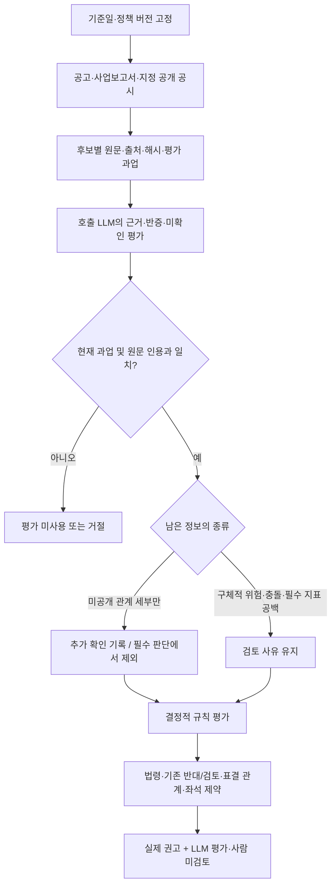

# OPM guideline v2 최종 개편안 및 파일럿 검증 기록

## 결정 범위

Astra 설계의 근거·판정 계약과 Fable 리뷰의 운영 범위를 합친 설계안을 최종 후보로 기록한다.
전체 비교·HTML·JSON·플로우차트는 `output/guideline-synthesis-20260908/`에 보관한다.
이 문서는 그 설계를 OPM 런타임에 연결한 최소 파일럿과 실제 호출 결과를 함께 기록한다.

v2는 아직 공식 의결권 정책이 아니다. `vote_style="opm_guideline_v2"`의 기본 shadow는
기존 권고를 유지한다. 명시적 `guideline_mode="pilot"`에서는 호출 LLM 평가를 받아
후보 범위의 실제 `decision`에 반영한다. 모든 수용 평가는 「LLM 평가 · 사람 미검토」로 표시한다.
서버 내 별도 LLM 자동 호출은 없다. 호출 AI가 원문 평가 후 같은 MCP에 평가를 제출하는 두 단계다.

## 현재 구현 범위와 다음 결정

통합 설계 → 실제 공시 수집 → LLM 평가 수용 → 후보 범위의 실제 권고 적용까지 구현했다.
v2가 기준일 이전 최신 사업보고서와 선택된 소집공고를 읽고, 기간별 출석 관측과 평가 과업을 반환한다.
공고 밖 DART/KIND 공시를 지정하여 후보 원문 패킷에 넣는 경로까지 구현했다. 출석 분모·기간의 확정 입력, 공정위·기업집단 자료의 런타임 연결, 독립 정확성 평가, 운영 배포는 남아 있다.

### 이어서 실행할 순서

| 단계 | 현재 상태 | 완료 기준 |
|---|---|---|
| 공개 공시 → LLM 평가 → 실제 후보 권고 | 로컬 파일럿 검증 완료 | 현재 9건 수용, 인용·버전·위조 입력 거절 및 기본 shadow 보존 확인 |
| 출석 평가 완성 | 기간 제안 및 원문 관측까지 | 기간 정책 확정 후 재직·직무정지 구간과 회의별 분모/분자를 검증하고 입력 계약 연결 |
| 관계·제재 원천 확대 | KIND 연결, 공정위 API 조회 가능성 확인 | 공정위 원문과 기업집단 식별·공개 시점을 연결하고 법인 사건의 개인 귀속을 별도 평가 |
| 판단 정확성 평가 | 미완료 | 독립 검토 근거로 찬성·반대·보류·예외 사례를 비교하고 오류 유형별 통과 기준 충족 |
| 정책 운영 및 배포 | 미완료 | 고객 설정·정책 변경 승인·되돌리기 절차 검증 후 main CI로 배포하고 live MCP 확인 |

이번 브랜치 푸시는 작업 보관이며 운영 배포가 아니다. 기존 HTML은 통합 설계 설명이고,
현재 런타임 범위·제약·실측 결과의 정본은 이 문서와 도구 문서다.

실제 MCP 조회로 확인한 출석 파싱 수정은 다음과 같다.

- KT&G 2025년 사업보고서 `20260318001422`: 기존에 놓친 `성명(100%)` 형식을 읽어
  8명·2개 기간의 15개 관측값을 반환한다. 이번 주총 신임 후보의 과거 임기 출석률로 전용하지 않는다.
- 고려아연 2025년 정정 사업보고서 `20260813001726`: 기존 출석 요약에 섞인
  내부거래위원회 수치를 이사회 출석률에서 제외했다. 이사회 표는 회차별 형식이므로
  `format_unsupported`와 원문·다음 확인 경로를 반환한다. 원문에 자료가 없다는 뜻이 아니다.
- `proxy_advise_before_meeting`의 JSON/Markdown 모두 출석 근거 조회 결과와 후보별 평가 대기를 표시한다.
  수집된 연간·구간별 값을 직전 임기 전체 값으로 자동 수용하지 않는다.

사용자는 정성 평가를 LLM에 위임하되 사람 미검토를 표시하도록 승인했다.
출석기간은 아래 제안으로 기록하며 실행 정책의 prior_term 의미는 아직 바꾸지 않는다.

### 출석기간 제안 (미활성)

기본 기간은 **직전 완료 사업연도**, 임기 전체 기록은 반복 저출석을 살피는 보조 근거로 권한다.
최근의 책임 수행을 같은 시간 단위로 비교하고, 중도선임·직무정지로 인한 분모 왜곡을 줄이기 위해서다.

- 분자: 해당 사업연도 중 재직하며 직무 수행 대상이었던 이사회 회의의 실제 참석 횟수.
- 분모: 같은 구간의 참석 대상 이사회 회의 수. 안건 수·위원회 회의 수를 섞지 않는다.
- 중도선임·사임·법원 직무정지 등 제외 구간은 날짜와 원문 근거를 기록한다. 단순 불참 소명과 법적 직무 제외는 별도다.
- 여러 공시 구간은 참석 횟수/대상 회의 수를 합산한다. 퍼센트 단순 평균은 금지한다.
- 짧은 재직·적은 회의 수는 별도 표시한다. 최소 표본 문턱은 아직 정하지 않았으며 자동 반대 근거로 삼지 않는다.
- 사임 후 다시 후보가 된 사람도 평가연도의 실제 재직 이력을 지우지 않는다. 최초 신임·연속 재선임·사임 후 재선임을 구분할 추가 계약이 필요하다.
- 의결 기준일 전에 공개되지 않은 사업연도 자료는 unknown으로 남긴다. 전년 수치를 최신 연도라고 이름 바꾸지 않는다.

이형규 후보는 2025년 직무정지뿐 아니라 2026년 5월 29일 사임이 이번 소집공고
`20260811000705`에 기재돼 있다. 사업보고서의 과거 재직 상태만으로 현재 연임을 확정하지 않는다.

## 최종 설계

### 다섯 축을 분리한다

한 규칙에 출처, 효과, 근거 상태, 위임 수준, 운영 상태를 섞지 않는다.

| 축 | 기록할 값 | 적용 원칙 |
|---|---|---|
| origin | 법령, 기관 정책, OPM 정책, 고객 정책 | 출처를 보존하고 기관 정책을 OPM 정책으로 이름 바꾸지 않음 |
| effect | `oppose`, `support_basis`, `require_review`, `inform` | 신호와 확정 권고를 구분 |
| evidence | `fact`, `derived_fact`, `assessment` + known/unknown/conflicting | 결측을 `false`·0으로 치환하지 않음 |
| delegation | 사람 또는 승인된 평가자 | 모델 confidence를 승인 근거로 사용하지 않음 |
| operations | 검토 상태, 의결권 자격, 제출 권한, 실행 이력 | 분석 결과와 실제 투표 실행을 분리 |

### 정책은 작성본에서 실행본으로 컴파일한다

아래는 목표 설계다. 현재 파일럿은 고정 JSON 정책과 평가 계약을 연결한 단계이며,
범용 컴파일러·고객 overlay·자동 변경 감지·정책 활성화 승인 흐름은 아직 구현하지 않았다.

PolicySource에 규칙·예외·지표·단위·분모·기간·적용일·권한·오버레이를 기록하고,
컴파일 단계에서 타입·참조·상속 순환·충돌을 검사한다. ResolvedPolicy에는 상속이 풀린 값,
변경 이유, 원문과 정책 hash, 컴파일러·스키마 버전을 고정한다. HTML은 JSON에서 생성한다.

기본 shadow 파일은
[`opm-guideline-v2.json`](../../open_proxy_mcp/data/guideline/opm-guideline-v2.json),
실제 LLM 파일럿은 별도
[`opm-guideline-v2-pilot.json`](../../open_proxy_mcp/data/guideline/opm-guideline-v2-pilot.json)이다.
현재
출석률·재선임·예외 수용·독립성 평가 수용·긍정 커버리지 게이트를 최소 계약으로 둔다.
출석률 기본 문턱은 75%이고 작성본의 허용 범위는 50~100%다. 현재 MCP에는 문턱을
바꾸는 고객 overlay 입력이 없으며 실제 출석 확정 입력도 없다. 기관 공식 기준이 아니다.

### LLM의 역할과 출력

LLM은 원문에서 안건·후보·관계·조문·소명·반증의 후보를 만들고, 인용 위치·주체·기간·단위
검증을 거쳐 평가로 수용한다. 현재 자동 검증은 대상·시점·정책 hash와 원문 인용 연결까지다.
의미 정확성·주체 귀속·평가자 신원·근거 완전성을 자동 인증하지 않는다.
정성 평가는 사용자가 위임한 LLM 파일럿이며 사람 검토 여부는 항상 false다.
정책 엔진은 작은 결정적 표현식만 평가하고 다음 상태를 보존한다.

- 정책 전체를 평가해 `not_applicable`, `not_triggered`, `fired`, `excepted`, `unresolved`를 기록한다.
- 확정된 반대 근거와 검토 필요 상태를 동시에 보존한다.
- 필수 근거가 비어 있으면 긍정 게이트를 통과시키지 않는다.
- shadow는 기존 권고를 유지한다. pilot은 사외·독립이사 후보에 대해 실제 권고를 만든다.
- 법령·표결없음·조건부/경합·기존 반대와 후단 부모/자식·좌석 제약은 보존한다. 기존 REVIEW도 부분 범위의 FOR로 해제하지 않는다.
- 평가 과업에는 기존 점수·권고를 넣지 않는다. 평가는 정책 rubric과 실제 공시 발췌를 읽어 작성한다.
- task_id는 회사·후보·생년월일·역할·안건·기준일·정책·원문을 묶는다. 동일 요청에서만 평가를 사용하며 서버에 저장하지 않는다.

응답에는 전체 `guideline_application`과 안건별 `guideline_trace`를 넣어 어떤 규칙이 평가됐고
무엇이 부족한지 재현할 수 있게 한다. 정책 갱신은 변경 감지와 영향 범위 계산을 자동화하되,
의미가 바뀌는 버전의 활성화는 정책·법률 책임자 승인을 거친다.

## 파일럿 결과

### 실제 MCP 호출: 공개자료 한정 LLM 파일럿

로컬 Streamable HTTP MCP의 실제 도구로 과업을 받고, **이 작업의 호출 LLM이 원문을
읽어 작성한 평가**를 같은 도구에 제출했다. 평가와 결과는 요청·메모리 안에서 처리했으며
조회 결과 파일은 저장하지 않았다. 아래는 제품 동작 검증의 집계다. 회사별 예상 찬반을
테스트 코드에 넣어 맞추지 않았고, 외부 검토자의 정답 대조도 아직 하지 않았다.

| 회사·회차 | 전체 안건 | 수용된 후보 평가 | 기존 권고 → 현재 파일럿 권고 | 직접 변화 |
|---|---:|---:|---|---:|
| KT&G 2026 정기, 기준일 2026-03-25 | 15 | 3건 / 2명 | FOR 10·REVIEW 5 → FOR 10·REVIEW 5 | 최종 판정 동일 |
| 고려아연 2026 임시, 기준일 2026-09-08 | 9 | 6건 / 6명 | FOR 5·REVIEW 4 → FOR 4·REVIEW 5 | 이형규 FOR→REVIEW |

9건 모두 `accepted_unreviewed`이고 JSON·Markdown의 사람 미검토 표시를 확인했다.

- KT&G 노환용 이사·감사위원: 현직·경력·공시된 관계를 읽고 `no_public_concern`으로 평가해 FOR.
  한승수도 겸직을 포함해 평가했지만 조건부 안건 제약으로 최종 REVIEW를 유지했다.
- 고려아연 이형규: 거래소 소집결의의 **재선임** 표기로 분류 근거를 보강했다. 사임 후 재선임이며
  직무정지·실제 재직구간·참석 대상 회의 분모가 미확정이므로 출석 규칙은 미완료, 최종 REVIEW다.
- 서은숙·이준봉·심혜섭: 거래소의 신규선임 표기를 확인했다. 검토한 공개자료에서 구체적 독립성
  우려를 확인하지 못한 것으로 LLM 평가했으며, 미공개 고용·자문·보수 세부는 후속 확인으로 남겨 FOR다.
- 백인규·박유경: 공개 보도에서 제기된 업무·거래 또는 표결 관련 문제의 원문·주체·기간·중요성은
  아직 확인하지 못했다. `unknown`을 유지하며, 대안형 안건 자체의 REVIEW 제약도 유지한다.
  보도는 추가 확인 단서이며 확정 반대 근거 또는 MCP 인용 검증을 거친 원문으로 취급하지 않았다.

기존 엔진과 같은 최종 판정도 원문·정책·평가·인용 연결을 거쳐 나온다. diff 수는 품질 점수가 아니다.
이 파일럿은 **공개자료 범위 내 찬성, 근거 미완료에 따른 검토, 기존 표결 제약 보존**이 실제 응답에서
구분되어 작동함을 확인했다. 실제 회사에서 확정 독립성 우려를 받아 AGAINST까지 가는 사례와
판단의 정확성 검증은 아직 남았다.

### 공개되지 않은 관계 정보 처리

사용자는 공개 공시·기관 원문을 먼저 찾고, 공개되지 않은 고용·자문·보수 세부는 추가 확인으로
남기되 그 정보 부재 자체를 필수 판독 기준에서 제외하도록 승인했다. 정책 0.3.0-pilot과
평가 계약 `opm-llm-assessment/2`에 반영했다.

- `no_public_concern`: 검토한 공개자료에서 구체적 우려를 확인하지 못했다는 범위 한정 평가.
  관계가 실제로 없다는 사실 또는 독립성 보증으로 이름 바꾸지 않는다.
- `information_gaps`: 질문, 정보 부재 상태, LLM이 신고한 검색범위, `follow_up_only`를 남긴다.
  Markdown은 「판단 제외 · 추가 확인」으로 표시한다. 서버가 검색의 완전성까지 인증하지 않는다.
- 실제 발견된 위험 정황, 후보 동일성·선임구분·출석 분모의 공백, 조회 실패는 이 예외로 제외하지 않는다.
  따라서 알려진 반대 정황을 찾지 못한 계약서로 둔갑시켜 찬성을 만드는 규칙이 아니다.

### 공개 원천과 추가 연결 계획

| 원천 | 확보 가능한 정보 | 현재 상태 및 사용 경계 |
|---|---|---|
| [KIND 고려아연 소집결의](https://kind.krx.co.kr/external/2026/07/21/000927/20260706001079/91471.htm) | 후보 성명·생년월·신규/재선임·경력 | 실제 MCP 원문 패킷에 연결. KIND 식별자를 DART 접수번호로 변환하지 않음 |
| [KIND 남양유업 임원현황](https://kind.krx.co.kr/external/2025/05/15/002168/20250515005076/11013.htm) | 심혜섭의 상근감사 역할과 당시 재직 시작일 | 실제 MCP에 연결. 과거 회사 역할을 제안주주 고용 관계로 추정하지 않음 |
| [공정위 결정문 목록](https://www.data.go.kr/data/15103246/openapi.do)·[본문](https://www.data.go.kr/data/15103247/openapi.do) | 사건 식별자·피심인·주문·이유·결정일 | 국가법령정보 API 실제 목록·본문 조회 성공. 자동 평가에는 아직 미연결 |
| [기업집단 소속회사](https://www.data.go.kr/data/15091891/openapi.do)·[임원현황](https://www.data.go.kr/data/15091898/openapi.do)·[주주현황](https://www.data.go.kr/data/15091900/openapi.do) | 기업집단·법인 식별, 임원 및 동일인 관계, 주주 연결 | 문서 확인. 별도 공공데이터 API 이용승인·키로 실제 응답 확인 필요 |
| [공개년월 목록](https://www.data.go.kr/data/15091910/openapi.do) | 사용할 수 있는 기업집단 자료 시점 | 연도만 맞춰 최신 자료를 과거 주총에 소급하지 않기 위한 선행 조회 |
| [공정위 공개 사건](https://case.ftc.go.kr/ocp/co/ltfr.do?reprsntVioltTy=02%2A) | 공개 사건·결정문·첨부 원문 | API 누락 및 변경 여부를 대조할 보완 경로 |

공정위 데이터는 공공데이터포털의 LINK 서비스이며 실제 호출 계약은 국가법령정보
[목록 API](https://open.law.go.kr/LSO/openApi/guideResult.do?htmlName=ftcListGuide)와
[본문 API](https://open.law.go.kr/LSO/openApi/guideResult.do?htmlName=ftcInfoGuide)를 따른다.
목록의 `target=ftc`, 사건명/본문 검색, 페이지·총건수를 확인한 뒤 반환 식별자로 본문을 읽는다.
기존 법령 API 자격으로 실제 조회가 가능했으며 키를 새로 받지 않아도 이 경로는 개발 가능하다.

표본에서 법인 사건 본문 조회가 가능했지만 후보 개인명 검색 0건을 무제재로 해석할 수 없었다.
일부 결정일은 `2013.0.0`처럼 불완전했고 본문 안에 이미지 표가 있었다. 날짜를 임의 보정하거나
XML 응답이라는 이유로 표까지 완전히 읽었다고 취급하면 안 된다. API 연결 시 다음을 남긴다.

1. 검색어·검색범위·페이지/총건수·조회시각·실패 상태 및 원문 ID.
2. 법인 피심인과 개인 책임의 구분, 행위 기간과 후보 재직·담당 업무의 겹침.
3. 결정일과 공개일의 구분, 후속 변경·불복의 확인 상태. 시점 확인이 안 된 자료는 과거 판단에 미사용.
4. 원문·문서 해시·누락된 표/첨부 표시. 검색 0건을 관계 없음이나 무제재 metric으로 입력하지 않음.

백인규의 딜로이트 업무 관련 [보도 단서](https://news.skyedaily.com/news/news_view.html?ID=310688)와
박유경의 APG 관련 [보도 단서](https://www.etoday.co.kr/news/view/2619066)는 보고서 원문 및
후보 관여 사실을 더 확인할 항목이다. 공시의 경력은 확인했지만 외부 보도의 법적 해석·찬반 결론을
OPM의 사실이나 정답으로 복사하지 않는다. 관련 보고서·계약 원문이 공개되지 않으면 확인 과제로 유지한다.

### 계약·회귀 검증

합성 사례는 실제 회사의 정답과 분리해 타입, 인용 실패, 미래 공고, 다른 후보·정책·기준일,
중복 task_id, 사람 검토 표시 위조, unknown 처리, 반대 우선 집계만 검증한다.
기존 설계의 합성 JS 16개 사례도 운영 정책의 정답 집합으로 사용하지 않는다.
현재 전체 회귀 1,710개 통과(기존 XML/HTML 경고 1건). 위키·문서 계약·도구 카탈로그 검사 통과.
출력 어휘 점검은 종료코드 0이며 저장소 전체 36건의 용어 사용을 보고했다. 경고 0건이라고 표현하지 않는다.
실제 MCP에도 없는 인용을 제출해 rejected, 이전 정책의 task_id를 제출해 미사용,
사람 검토 표시 위조 필드를 제출해 요청 오류를 확인했다. 기본 shadow와 기존 엔진의 KT&G 15개 최종 판정이 같다는 것도 실제 MCP로 대조했다. 이 음성 검증은 인용·계약 검사이며 판단 정확도 실험이 아니다.

## 해석과 승격 조건

현재 파일럿이 확인한 것은 근거 전달, 호출 LLM 평가 수용, unknown 보존, 실제 후보 권고 반영과 사람 미검토 표시다. 실제 공시 추출 정확도나 전문가의
의결권 판단과의 일치율을 입증한 것은 아니다. 합성 16개 사례의 기대값도 독립된 정답 집합이
아니므로 모델 품질 점수로 사용하지 않는다.

production effect를 켜기 전 다음 조건을 충족한다.

1. 출석률·독립성·정관 조문에 대해 기준일과 인용 위치가 있는 독립 gold set을 만든다.
2. 확인·미확인·충돌·예외·경계값을 분리한 회사/연도 holdout으로 규칙 적용 정확도와 결측률을 측정한다.
3. 두 명 이상의 독립 검토자와 불일치 심의를 거쳐 정성 평가의 수용 rubric과 위임 범위를 승인한다.
4. 임의 3회 실행 횟수 대신, 확정 찬성·반대·미확인·예외·정정공시가 포함된 사전 정의 통과 기준으로 배포 여부를 결정한다. 현재 effect는 명시적 로컬 pilot에만 적용된다.

## 관련 파일

- `open_proxy_mcp/data/guideline/opm-guideline-v2.json`: 기계 정책 source
- `open_proxy_mcp/services/guideline_policy.py`: unknown 보존 결정적 evaluator
- `open_proxy_mcp/services/guideline_assessment.py`: 요청 내 LLM 평가 계약·원문 연결 검증·집계
- `open_proxy_mcp/services/guideline_evidence.py`: 기준일 이전 DART/KIND 공개 원문 수집
- `open_proxy_mcp/services/board_attendance.py`: 이사회 절·기간·위원회 경계를 보존하는 출석 관측
- `open_proxy_mcp/data/guideline/opm-guideline-v2-pilot.json`: 사람 미검토 pilot 정책과 정성 rubric
- `open_proxy_mcp/services/proxy_advise.py`: shadow와 실제 pilot 연결
- `open_proxy_mcp/tools/proxy_advise_before_meeting.py`: JSON/Markdown 공개 계약
- `tests/test_guideline_policy.py`: 정책·경계·예외 계약 테스트
- `tests/test_guideline_assessment.py`: 평가 계약·인용·정책 변경·정보 공백 처리 테스트
- `tests/test_board_attendance_evidence.py`: 출석 원문·기간·추가 공시·날짜·조회 실패 테스트
- `wiki/tools/proxy_advise_before_meeting.md`: 호출·출력 문서
- `output/guideline-synthesis-20260908/`: Astra·Fable 비교, 최종 설계, HTML·JSON·플로우차트
