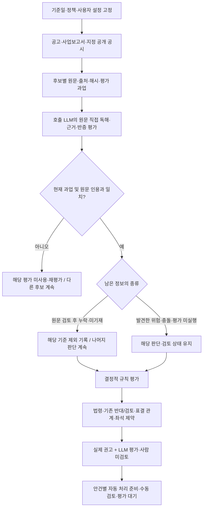

# OPM guideline v2 명세·설계·판정 로직 및 파일럿 검증

## 배포 로드맵

> **현재 위치: 04 · 실제 교정·30개사 배치 검증까지 도달.** 0.7.0에서 원문 교정으로 후보 권고가 바뀌는 사례, 30개사 LLM 평가 제출, 새 공시 증분 조회와 기업별 오류 격리를 실제 MCP로 확인했다. 독립 정확성 검증·운영 준비·배포는 남아 있다. 모든 평가는 **LLM 평가 · 사람 미검토**다.

아래는 **현재 사외·독립이사 후보 자문 범위를 운영 MCP에 배포하는 순서**다. 단계는 일정이나 완성도 퍼센트가 아니라 확인한 도달점을 나타낸다.

| 단계 | 상태 | 도달점 | 완료한 것 | 남은 일·완료 기준 |
|---|---|---|---|---|
| 01 | 완료 | 설계·정책 계약 | Astra·Fable 관점 통합, 정책 JSON, 평가 입력 계약, 명세와 실행 도식 작성 | 이 단계의 최소 계약 완료. 범용 고객 정책은 확장 트랙에서 다룬다. |
| 02 | 완료 | 실제 MCP 연결 | 공개 원문 → 호출 LLM 평가 → 인용·과업 검사 → 실제 후보 권고 연결. 0.3·0.5에서 실제 MCP 동작 확인 | 연결 완료. 새 계약의 실측은 03에서 별도 확인했다. |
| 03 | 완료 | 유연한 LLM 흐름 | 0.6 실제 MCP에서 원문 직접 판독, 누락 기준 제외, 설정별 자동·수동 분기, 오류 후보 격리 확인. 0.7은 후보 이름 없는 회사 공시와 문맥 이어 읽기를 추가 | 이 단계의 실행 계약 확보. 보수적 성향의 일관성과 범용 후보 생성은 추가 검증·확장 대상이다. |
| 04 | 현재 도달 | 판정 교정·품질 검증 | 신제윤 후보의 원문 교정 적용·미적용 대조, 30개사 평가 제출, 증분 조회·오류 격리 실측. 검토 6·관찰 3·근거 충돌 1·범위 내 무신호 18·미평가 2 | 실제 흐름 검증을 넘어 독립 기준의 오류율·놓친 신호·기업별 판독 범위 차이와 추가 교정 사례를 평가해야 한다. |
| 05 | 다음 착수 | 출시 운영 준비 | 요청별 정책·설정과 과업을 묶는 계약, 사람 미검토 표시, 수동 지정 분기, 호출자가 보존하는 공시 checkpoint 구현 | 출시 범위·기본 모드·품질 통과 기준을 명시하고 정책 버전 활성화·복구, 수동 처리 인계와 오류 대응을 검증한다. |
| 06 | 남음 | 범위 한정 배포 | 로컬 파일럿까지만 확인했다. v2를 운영에 배포하지 않았다. | 변경을 커밋·푸시하고 main CI로 배포한 뒤 live MCP에서 과업 수신·평가 제출·최종 권고·설정별 분기를 확인한다. |

### 바로 다음 작업

**04의 품질 검증을 마무리한 뒤 05로 간다.** 공시를 찾은 수, 원문을 읽은 수, 평가를 수용한 수, 근거 있는 우려 수를 따로 센다. 같은 안건의 실제 교정과 전문가 또는 별도로 검증한 근거와의 차이를 확인하고, 첫 출시 범위·복구·수동 인계를 준비한다. 누락 정보는 해당 기준만 제외하고 다음 판단을 계속한다.

**다음 검증의 실행 방법 — 계획, 아직 미실행:** 기존 30개사 파일럿의 평가 수용과 별도로, 사용자가 지정한 5개사의 사실 오류와 놓친 신호를 원문으로 대조한다.

| 대상 | 우선 대조할 질문 |
|---|---|
| 가비아 | 공개매수·재투자·경영진 이해관계의 조건과 실제 이행 상태를 구분했는가? |
| 골프존홀딩스 | 공개매수 결과와 지분 변화에서 제안 수량·실제 매수·결제 및 분모를 구분했는가? |
| 태광산업 | 소송·철회·정정의 선후관계와 각각의 당사자를 정확히 연결했는가? |
| 영풍·고려아연 | 지분 보유·행사 가능한 의결권·법원 결정·주총 안건을 해당 회사와 기준일에 맞게 연결했는가? |

1. 회사별 검증 질문과 기준일을 먼저 고정한다. 당시 공개되지 않은 후속 자료는 당시 판단의 입력에 넣지 않는다. 같은 날의 공개 순서가 확인되지 않으면 그 한계를 표시한다.
2. 별도 에이전트가 기존 MCP 평가를 보지 않고 원문에서 사건·시점·당사자·절차 상태를 인용과 함께 정리한다. 별도 LLM의 동의도 정답은 아니며, 차이가 발견되면 원문으로 확인한다.
3. 실제 `governance_screen` 호출로 자료·과업을 받고, 호출 LLM이 원문과 필요한 추가 공시를 읽어 평가를 제출한 뒤 최종 분류를 확인한다. 지원하는 이사 안건이 있으면 `proxy_advise_before_meeting`의 최종 권고까지 연결한다.
4. 당사자 혼동·철회 미반영·조건부 거래의 완료 오인 등 사실 오류, 놓친 중요한 신호, 투자 성향에 따른 해석 차이를 분리한다. 누락 정보는 해당 기준만 제외하고 나머지 판단을 계속하는지도 확인한다.
5. 원문 접근·LLM 지시·권고 반영 중 문제의 원인을 수정하고 같은 실제 MCP 경로로 재실행한다. 원문 근거 → 최초 판단 → 문제 → 수정 후 판단 → 남은 미확인 사항을 문서화한다. 공개 저장소에는 사용자 평가 제출 원문을 저장하지 않는다.

완료 기준은 확인한 표본의 중대한 오류를 수정하고 남는 불확실성을 설명할 수 있는 것이다. 이 5개사의 결과를 전체 기업에 대한 정확도나 누락률로 일반화하지 않는다. 정성 평가는 계속 **LLM 평가 · 사람 미검토**로 표시한다. 이 검증을 마치면 05의 출시 범위·기본 설정·복구·수동 인계를 준비한다.

### 배포 범위와 확장 작업

- **첫 배포:** 현재 사외·독립이사 후보 범위의 LLM 자문과 자동 처리 준비·수동 검토 분기. 선택한 범위의 품질과 운영 경로를 검증한다. 누락 정보는 기준별로 제외해 알리고, 사람 미검토 표시를 유지한다.
- **병행·후속 확장:** 공시 기반 거버넌스 검토와 새 접수번호 조회는 이번에 연결했다. 놓친 후보의 LLM 과업 생성, 평가 항목별 오류 수리, 공정위 사건·관계 원천, 다른 안건 유형, 고객별 정책 상속·편집, 공시 변경이 영향을 주는 안건의 자동 선택은 남아 있다.
- **실제 투표 전송:** 의결권 자격·계좌·집중투표 배분·전송 및 승인 기록은 별도 실행 연동이다. 현재 MCP의 자문 결과나 자동 처리 준비를 실제 투표 완료로 표시하지 않는다.

**저장·배포 상태 (2026-09-09, 이 커밋 기준):** `claude-fable-5.1-opm-guideline-v2` 브랜치의 이 커밋에 0.6·0.7 구현, 테스트, 실제 MCP 파일럿 근거, 명세·HTML·JSON·도식과 위의 다음 검증 계획을 포함한다. 앞서 원격에 푸시한 범위는 0.5.0(`accfe6b2`)이며, 이번 요청은 로컬 커밋까지다. 운영 배포·예약 작업은 하지 않았다. 반복 조회는 호출 가능한 MCP 워크플로다.

## 작업 기여

이번 대화에서 진행한 guideline v2 설계 통합, 런타임 구현, 실제 MCP 파일럿 검증 및 문서화는 **Astra (Codex)**가 수행했다. Fable 리뷰의 관점은 통합 설계의 비교·참고 근거로 반영했다. 작업 브랜치명 `claude-fable-5.1-opm-guideline-v2`는 이번 작업의 수행자를 뜻하지 않는다.

## 결정 범위

Astra 설계의 근거·판정 계약과 Fable 리뷰의 운영 범위를 합친 설계안을 최종 후보로 기록한다.
전체 비교·HTML·JSON·플로우차트는 `output/guideline-synthesis-20260908/`에 보관한다.
이 문서는 그 설계를 OPM 런타임에 연결한 최소 파일럿과 실제 호출 결과를 함께 기록한다.

v2는 아직 공식 의결권 정책이 아니다. `vote_style="opm_guideline_v2"`의 기본 shadow는
기존 권고를 유지한다. 명시적 `guideline_mode="pilot"`에서는 호출 LLM 평가를 받아
후보 범위의 실제 `decision`에 반영한다. 모든 수용 평가는 「LLM 평가 · 사람 미검토」로 표시한다.
서버 내 별도 LLM 자동 호출은 없다. 호출 AI가 원문 평가 후 같은 MCP에 평가를 제출하는 두 단계다.

## 현재 구현 범위와 다음 결정

통합 설계 → 실제 공시 수집 → LLM 평가 수용 → 후보 범위의 실제 권고 적용까지 구현했다.
v2가 기준일 이전 최신 사업보고서와 선택된 소집공고를 읽고, 기간별 출석 관측과 평가 과업을 반환한다.
0.5.0에서 임원 변동 공시의 제한된 자동 탐색과 회의·재직·직무정지 평가 입력을 연결했다.
0.6.0은 누락 항목의 명시적 제외, 사업연도 원문 직접 판독, 요청별 성향·문턱 설정,
안건별 자동 처리 준비·수동 검토 분기를 추가한다. 평가 입력 한 건의 스키마 오류가 다른 후보를 중단시키지 않는다.
출석은 직전 완료 사업연도 기준으로 서버가 분모·분자를 계산하되 그 입력의 의미·완전성은 LLM 평가이며 사람 미검토다.
0.7.0은 공시 간 문맥 탐색과 근거별 추출 교정, 최대 30개사의 LLM 거버넌스 검토 및 증분 조회를 추가한다. 버전별 실제 MCP 결과는 아래 검증 절에 구분한다. 과거 버전 실측을 새 버전의 성공으로 전용하지 않는다.
공정위·기업집단 원천 연결, 독립 정확성 평가, 범용 고객 정책 운영, 운영 배포는 남아 있다.

### 사용자 원칙과 구현 경계

이 작업은 **LLM 기반 워크플로와 실행 하네스**다. 파싱은 원문 접근과 데이터 추출을 돕는 도구다.
추출 실패나 파서와의 불일치는 원문을 직접 읽을 계기이며, 그 사실만으로 자료 부재나 판단 불가를 확정하지 않는다.
원문에서 확인한 내용은 인용해 평가하고, 누락·미기재는 해당 항목만 제외한 사실을 알리며 나머지 판단을 계속한다.
미확인값을 0·관계 없음·반대 사실로 채우지 않는다. 실제로 발견한 충돌과 아직 읽지 않은 상태는 누락과 구별한다.

보팅 성향과 자동화 수준도 분리한다. 보수적 성향은 확인된 위험과 예외 근거를 더 엄격히 해석하는
LLM 지침이며 모든 누락을 반대 또는 수동 검토로 바꾸는 설정이 아니다. 자동화 수준은 나온 권고를
어떤 안건부터 자동 처리 준비 또는 수동 검토로 보낼지 정한다. 현재 MCP는 실제 투표를 전송하지 않는다.

이전 단계의 실제 MCP 조회로 확인한 추출 보조 개선은 다음과 같다. 추출 결과는 LLM 판단의 정답이 아니다.

- KT&G 2025년 사업보고서 `20260318001422`: 기존에 놓친 `성명(100%)` 형식을 읽어
  8명·2개 기간의 15개 관측값을 반환한다. 이번 주총 신임 후보의 과거 임기 출석률로 전용하지 않는다.
- 고려아연 2025년 정정 사업보고서 `20260813001726`: 기존 출석 요약에 섞인
  내부거래위원회 수치를 이사회 출석률에서 제외했다. 이사회 표는 회차별 형식이므로
  `format_unsupported`와 원문·다음 확인 경로를 반환한다. 원문에 자료가 없다는 뜻이 아니다.
- `proxy_advise_before_meeting`의 JSON/Markdown 모두 출석 근거 조회 결과와 후보별 평가 대기를 표시한다.
  수집된 연간·구간별 값을 직전 임기 전체 값으로 자동 수용하지 않는다.

사용자는 정성 평가를 LLM에 위임하되 사람 미검토를 표시하도록 승인했다.
사용자는 직전 완료 사업연도 적용을 승인했다. 0.5.0부터 pilot의 기간은 last_completed_fiscal_year이며 기본 shadow의 prior_term 정책은 유지한다.

### 출석기간 정책 (0.5.0부터 적용, 0.6.0 직접 판독 보강)

기본 기간은 **직전 완료 사업연도**, 임기 전체 기록은 반복 저출석을 살피는 보조 근거로 둔다.
최근의 책임 수행을 같은 시간 단위로 비교하고, 중도선임·직무정지로 인한 분모 왜곡을 줄이기 위해서다.

- 분자: 해당 사업연도 중 재직하며 직무 수행 대상이었던 이사회 회의의 실제 참석 횟수.
- 분모: 같은 구간의 참석 대상 이사회 회의 수. 안건 수·위원회 회의 수를 섞지 않는다.
- 중도선임·사임·법원 직무정지 등 제외 구간은 날짜와 원문 근거를 기록한다. 단순 불참 소명과 법적 직무 제외는 별도다.
- 여러 공시 구간은 참석 횟수/대상 회의 수를 합산한다. 퍼센트 단순 평균은 금지한다.
- 대상 회의 수를 표시한다. 짧은 재직·적은 회의 수는 대표성의 한계로 설명하며 그 사실만으로 확인된 계산을 막지 않는다. 최소 표본 수치 문턱은 없다. 회의 목록·재직 구간 자체가 미확정이면 unknown으로 남기고 누락과 충돌을 구별한다.
- 사임 후 다시 후보가 된 사람도 평가연도의 실제 재직 이력을 지우지 않는다. 최초 신임·연속 재선임·사임 후 재선임을 구분할 추가 계약이 필요하다.
- 의결 기준일 전에 공개되지 않은 사업연도 자료는 사용하지 않는다. 확보한 원문에서 기간을 직접 읽을 수 있으면 평가하고, 필요한 정보가 없으면 그 항목만 제외한다. 전년 수치를 최신 연도라고 이름 바꾸지 않는다.

이형규 후보는 2025년 직무정지뿐 아니라 2026년 5월 29일 사임이 이번 소집공고
`20260811000705`에 기재돼 있다. 사업보고서의 과거 재직 상태만으로 현재 연임을 확정하지 않는다.

## 최종 설계

### 다섯 축을 분리한다

한 규칙에 출처, 효과, 근거 상태, 위임 수준, 운영 상태를 섞지 않는다.

| 축 | 기록할 값 | 적용 원칙 |
|---|---|---|
| origin | 법령, 기관 정책, OPM 정책, 고객 정책 | 출처를 보존하고 기관 정책을 OPM 정책으로 이름 바꾸지 않음 |
| effect | `oppose`, `support_basis`, `require_review`, `inform` | 신호와 확정 권고를 구분 |
| evidence | `fact`, `derived_fact`, `assessment` + known/unknown/conflicting | 결측을 `false`·0으로 치환하지 않음 |
| delegation | 사람 또는 승인된 평가자 | 모델 confidence를 승인 근거로 사용하지 않음 |
| operations | 검토 상태, 의결권 자격, 제출 권한, 실행 이력 | 분석 결과와 실제 투표 실행을 분리 |

### 정책은 작성본에서 실행본으로 컴파일한다

아래는 목표 설계다. 현재 파일럿은 JSON 정책과 평가 계약을 연결하고 요청별 성향·출석 문턱·검토 분기를 적용한다.
범용 정책 컴파일러·고객별 규칙 상속·자동 변경 감지·정책 활성화 승인 흐름은 아직 구현하지 않았다.

PolicySource에 규칙·예외·지표·단위·분모·기간·적용일·권한·오버레이를 기록하고,
컴파일 단계에서 타입·참조·상속 순환·충돌을 검사한다. ResolvedPolicy에는 상속이 풀린 값,
변경 이유, 원문과 정책 hash, 컴파일러·스키마 버전을 고정한다. HTML은 JSON에서 생성한다.

기본 shadow 파일은
[`opm-guideline-v2.json`](../../open_proxy_mcp/data/guideline/opm-guideline-v2.json),
실제 LLM 파일럿은 별도
[`opm-guideline-v2-pilot.json`](../../open_proxy_mcp/data/guideline/opm-guideline-v2-pilot.json)이다.
현재
출석률·재선임·예외 수용·독립성 평가 수용·긍정 커버리지 게이트를 최소 계약으로 둔다.
출석률 기본 문턱은 75%이고 요청별 `guideline_workflow.attendance_min_pct`로 50~100% 범위에서
변경할 수 있다. 성향만 conservative로 바꾸면 수치 문턱은 유지된다. 적용한 설정을 정책에 포함해
정책 hash·task_id에 연결한다. 기관 공식 기준이나 범용 고객 정책 상속 기능을 뜻하지 않는다.

### LLM의 역할과 출력

LLM은 원문에서 안건·후보·관계·조문·소명·반증의 후보를 만들고, 인용 위치·주체·기간·단위
검증을 거쳐 평가로 수용한다. 현재 자동 검증은 대상·시점·정책 hash와 원문 인용 연결까지다.
의미 정확성·주체 귀속·평가자 신원·근거 완전성을 자동 인증하지 않는다.
정성 평가는 사용자가 위임한 LLM 파일럿이며 사람 검토 여부는 항상 false다.
정책 엔진은 작은 결정적 표현식만 평가하고 다음 상태를 보존한다.

- 정책 전체를 평가해 `not_applicable`, `not_triggered`, `fired`, `excepted`, `unresolved`를 기록하고, pilot에서 명시적으로 제외한 기준은 `skipped_missing_information`으로 구별한다.
- 확정된 반대 근거와 검토 필요 상태를 동시에 보존한다.
- 읽은 자료의 누락·미기재는 해당 기준만 제외하고 `skipped_checks`에 남긴다. 남은 평가로 판단하되 평가 미실행·자료 충돌을 누락으로 둔갑시키지 않는다.
- shadow는 기존 권고를 유지한다. pilot은 사외·독립이사 후보에 대해 실제 권고를 만든다.
- 법령·표결없음·조건부/경합·기존 반대와 후단 부모/자식·좌석 제약은 보존한다. 기존 REVIEW를 해제하려면 아래의 근거별 교정 계약을 통과해야 한다.
- 평가 과업에는 기존 점수·권고를 넣지 않는다. 교정 대상의 원래 관측값은 `baseline_findings`로 공개하여 원문과 대조하게 한다. 같은 관측을 정답이나 독립 검증 기준으로 취급하지 않는다.
- task_id는 회사·후보·생년월일·역할·안건·기준일·정책·원문을 묶는다. 동일 요청에서만 평가를 사용하며 서버에 저장하지 않는다.

응답에는 전체 `guideline_application`과 안건별 `guideline_trace`를 넣어 어떤 규칙이 평가됐고
무엇이 부족한지 재현할 수 있게 한다. 정책 갱신은 변경 감지와 영향 범위 계산을 자동화하되,
의미가 바뀌는 버전의 활성화는 정책·법률 책임자 승인을 거친다.

## 실행 명세

이 절은 0.7.0-pilot, opm-llm-assessment/5 코드의 현재 계약이다. 회사 단위 사건·우려의 평가 계약은 `governance_screen`에서 별도로 제공한다. 자동 사건 그래프와 정책 활성화는 뒤의 확장 설계다.

### 공시 원문을 읽는 실행 경로 (0.7.0)

주총 공고·사업보고서·임원 변동에 더해 최근 1년의 공개매수, 위임장 권유, 대량보유, 소송, 재편, 자사주, 주총 소집결의 등을 제한 탐색한다. 공시 제목은 읽을 문서를 고르는 단서다. 매수자·주주제안자·회사명을 기준으로 우호·적대 진영 또는 후보 책임을 자동 확정하지 않는다.

`guideline_application.context_discovery`는 종류·기간·페이지·실패·미선택 원문을, `research_plan`은 호출 LLM의 발견→읽기→연결→반증→판단 순서를 제공한다. 회사 맥락 원문에는 후보 이름이 없어도 과업에서 제거하지 않는다. 추가 원문은 회사/안건/후보 범위와 `focus_terms`, `text_offset`, `text_chars`로 읽는다. `read_next`는 이어 읽을 요청을 반환한다. 전체 문서 해시와 실제 발췌 구간을 과업에 묶고, 떨어진 문맥 창을 가로질러 인용을 합치는 것은 허용하지 않는다.

한 번에 모든 문서를 읽는 대신 관련성이 높은 원문을 먼저 읽고 필요한 문맥만 넓힌다. 원문이 길거나 첨부 수집이 실패하면 대체 본문·정정 이전 본문을 찾되, 최신 첨부까지 읽은 것처럼 표시하지 않는다. 자동 선택 4건·명시 추가 5건을 넘어서는 자료는 후속 호출로 확인한다. 호출 LLM이 원문을 해석하며 서버 내부에서 별도의 LLM을 실행하지 않는다.

### 기업 발견·분쟁 추적·대량 검토 (0.7.0)

```python
# 1. 시장에서 읽을 회사 후보 발견. 제목은 위험 판정이 아니다.
screener(types="governance", period="최근 14일", details=False, format="json")
# 2. 회사 중복을 제거해 30개 이하씩 과업 요청.
governance_screen(companies=["대상 회사"], as_of="YYYYMMDD", format="json")
# 3. 호출 LLM이 원문·반증·조건을 읽은 뒤 같은 조건에 평가를 제출.
governance_screen(companies=["대상 회사"], as_of="YYYYMMDD",
    governance_assessments=[평가_JSON], format="json")
# 4. 이후 원하는 시점에 새 접수번호만 구분. 평가의 원문 범위는 유지.
governance_screen(companies=["대상 회사"], as_of="다음_기준일",
    since="이전_기준일", known_receipts=이전_checkpoint의_receipt_ids, format="json")
```

호출자가 수행하는 이 워크플로는 예약 작업을 만들지 않는다. 서버에 사용자 평가·조회 결과·checkpoint를 저장하지 않는다. 사용자 또는 호출 애플리케이션이 이전 접수번호를 보존해 다시 전달한다. 새 접수번호 발견은 변경 내용의 판독 완료를 뜻하지 않으며, 정정의 실질 범위와 후속 사건의 효과는 원문을 대조한다.

| 단계 | LLM의 판단 | 서버가 보장하는 범위 |
|---|---|---|
| 회사 발견 | 사용자 관심사와 공시 유형으로 읽을 회사를 선택 | 시장 스크리너 유형·기간·paging·조회 한계 표시 |
| 원문 판독 | 주체·사건·회차·조건·후속 공시·회사와의 관련성 해석 | 공개일·문서 해시·발췌 구간·실패·이어 읽기 제공 |
| 시그널 평가 | 구체적인 행위와 주주권익 영향을 근거로 우려·반증·누락 작성 | 현재 과업·literal 인용·허용 상태 조합 검사 |
| 검토 우선순위 | high/moderate/low 중요도에 대한 이유 제시 | 사용자의 `review_materiality`에 따라 우선 검토/검토/관찰 경로 결정 |
| 후속 확인 | 신규·정정·결과의 의미와 기존 해석 변경 여부 판단 | 접수번호 차이와 다음 checkpoint 반환. 지속 사건 그래프는 미구현 |

평가 항목은 소수주주 대우, 이해상충, 이사회 책임, 공시 신뢰성, 경영권 관련 절차다. `supported_risk`는 공시된 구체적 행위·조건과 영향을 설명해야 한다. 공개매수·행동주의·소송의 존재만으로 올릴 수 없다. 계획이면 장래 영향, 신청이면 신청 상태, 계약 지분이면 계약 지분으로 남긴다. `no_adverse_signal`은 **읽고 평가한 항목의 범위**에 한정한다. 미평가 항목은 자동으로 별도 기록되며 회사 전체 무위험 표시가 아니다.

자료 누락은 기준별 스킵이며 다른 평가를 막지 않는다. 중요한 사실 충돌·주체 미확인은 `needs_evidence`로 알려주고 다른 기업을 계속 처리한다. 잘못된 회사명·평가 입력도 해당 회사 또는 제출만 격리한다. 정확하지 않은 회사명 매칭은 응답과 Markdown 상단에 드러낸다. 모든 결과는 사람 미검토이고 실제 투표는 하지 않는다. 상세 입력·출력의 정본은 [[governance_screen]]이다.

시장 후보 발견은 5개 공시 채널의 8종 유형에 한정된다. 최초 페이지를 시가총액 순으로 읽으면 큰 회사 편향이 있고, 정기보고서나 자사주 집행보고만 새로 낸 회사는 자동 후보에서 빠질 수 있다. 회사별 탐색은 8개 상세유형·유형당 최대 2페이지·자동 원문 4건이며, 모든 지배구조 위험의 전수 검출을 주장하지 않는다. 특정 공시의 누락은 명시 원문 요청으로 보완할 수 있다.

### 참고 서비스에서 채택한 점

[DART Intelligence 예시](https://miraeasset-dart-intelligence.vercel.app/)의 공개 다운로드와 실제 질의 화면을 확인했다. 원문을 정규화하되 원래 기간·미상·출처·메모를 보존하고, 업무별 조회 후 필요한 근거를 읽는 접근을 참고했다. 공개 화면만으로 내부 프롬프트·모델·전체 에이전트 구조는 확인할 수 없으며 품질 수치를 OPM 성능으로 전용하지 않는다. 문맥이 잘려 답을 못 하는 예시도 있어 OPM에는 명시적인 이어 읽기와 누락 기준별 계속 판단을 둔다. [Sionic Parse](https://www.sionic.ai/en/parse)의 문서 구조·문맥 보존 개념을 참고했지만 별도 제품이나 패키지를 설치하지 않고 현재 DART XML 경로로 구현했다.

### 요청과 응답

| 항목 | 현재 명세 | 실패·제약 |
|---|---|---|
| 회차 식별 | company + year + meeting_type + as_of | 재현 시 네 값을 고정. 회차 자동 선택만으로 과거 시점을 보장하지 않음 |
| 실행 선택 | vote_style=opm_guideline_v2, guideline_mode=pilot | 기본 shadow는 기존 권고를 유지. pilot은 include_after_meeting=False만 허용 |
| 추가 공개 공시 | guideline_evidence_sources, 최대 5건 | DART 접수번호 또는 고정 KIND HTML 주소만. 임의 기사·API URL은 현재 입력 불가 |
| 사용자 설정 | guideline_workflow | 성향·자동화·수동 안건·출석 문턱을 요청 단위로 적용. pilot에서만 허용 |
| 1차 응답 | 후보·안건별 assessment_task | 원문 발췌, 정책 rubric, task_id, required_output(JSON Schema) 제공 |
| 2차 요청 | 같은 조건 + guideline_assessments, 최대 50건 | 첫 과업의 정확한 task_id 사용. 이전 과업 자동 변환 없음 |
| 2차 응답 | llm_assessment + metrics + rule_results + pilot_recommendation + final_decision | 수용과 정확성은 별개. 모든 LLM 평가에 human_reviewed=false |
| 처리 경로 | 안건별 voting_workflow + 전체 요약 | 자동 처리 준비와 수동 검토를 분리. 실제 투표 전송·사람 승인 기록은 없음 |
| 보관 | 평가와 결과는 해당 요청에서만 사용 | 사용자 조회 결과 저장 없음. 공개 원천 캐시와 고객의 별도 기록 정책은 구별 |

전체 도구 인자의 정본은 [[proxy_advise_before_meeting]]이다. 인증정보는 호출 환경에서 처리하며
문서·평가 JSON·출처 URL·오류 메시지에 넣지 않는다.

```json
{
  "company": "KT&G",
  "year": 2026,
  "meeting_type": "annual",
  "as_of": "20260325",
  "vote_style": "opm_guideline_v2",
  "guideline_mode": "pilot",
  "guideline_workflow": {
    "stance": "standard",
    "automation": "selective",
    "manual_agenda_titles": []
  },
  "include_after_meeting": false,
  "format": "json"
}
```

이 예시는 과업을 받는 첫 요청이다. 후보 판단을 사전 입력한 예시가 아니다.
평가 제출 시 첫 응답의 required_output에 맞는 객체를 guideline_assessments에 추가한다.

### 요청별 보팅 성향과 처리 설정

| 필드 | 허용값·기본값 | 적용 의미 |
|---|---|---|
| stance | standard / conservative, 기본 standard | 확인한 사실·반증을 평가하는 LLM 지침. conservative는 위험 지속성·영향·예외 근거를 더 엄격히 검토 |
| automation | automatic / selective / manual, 기본 selective | 권고의 자동 처리 준비와 수동 검토 분기. 성향과 독립 |
| manual_agenda_titles | 정확한 안건 제목 목록, 최대 100개 | 현재 v2 범위에서 선택한 안건을 수동 검토. 일치하지 않거나 적용되지 않은 제목은 요약에 표시 |
| attendance_min_pct | 선택 숫자, 50~100 | 명시했을 때만 출석 반대 문턱 변경. 미지정은 정책 기본 75% |

설정의 추가 키, 잘못된 값, 공백뿐인 제목·중복 제목을 거절한다. 수치 문자열이나 true를 숫자로
자동 변환하지 않는다. 두 번째 평가 제출 요청에서도 같은 설정을 사용한다. 설정이 바뀌면 새 과업으로 평가한다.

selective는 수용된 찬성 권고를 자동 처리 준비로 보내고 반대·검토 필요 안건을 수동으로 분리한다.
automatic은 수용된 찬성·반대를 준비 상태로 보낼 수 있지만 근거 충돌·기존 보호 판정·표결 제약을
해제하지 않는다. manual 또는 선택한 제목은 수동 검토다. 미제출 평가는 해당 안건만 대기하고,
수용 거절은 그 안건의 재평가 대상으로 남긴다. 범위 밖 안건은 not_applicable로 표시한다.
집중투표·경합·선행 또는 조건부 연결이 있으면 후보 찬성과 실제 표 배분을 분리해 수동 검토로 보낸다.
`ready_for_auto`는 권고 준비 상태다. `ballot_submission_supported=false`, `ballots_submitted=0`이며 실제 의결권 행사를 완료했다는 뜻이 아니다.

### 평가 데이터 계약

| 객체·필드 | 타입·허용값 | 의미 |
|---|---|---|
| task_id | 문자열 | 회사·후보·생년월일·역할·안건·시점·정책·패킷 내용에 연결된 SHA-256 식별자 |
| evaluator | 문자열 | 호출 LLM의 자기신고 식별자. 신원 인증이나 사람 승인 아님 |
| appointment.value | new / renewed / unknown | 해당 회사·해당 역할의 선임 구분 |
| independence.value | concern / no_public_concern / unknown | 구체적 우려 / 검토한 공개자료에서 우려 미확인 / 판단 미확정. no_concern은 이전 계약 호환값 |
| 각 판단의 rationale | 문자열 | 사실·해석·규칙 적용 이유를 설명 |
| evidence_refs / counterevidence | 각각 최대 12개 인용 | 찬성 근거와 반증에 같은 인용 검증 적용 |
| 인용 source_id / quote | 현재 패킷의 출처 ID / 12~3,000자 문자열 | 공백 정규화 후 하나의 원문 발췌 안에 존재해야 함 |
| unresolved | 최대 12개 문자열 | unknown이면 최소 한 개의 미확인 사유 필요 |
| unresolved_kind | missing_information / conflicting_evidence / identity_uncertain / not_assessed, 선택 | 원문 검토 후 누락, 발견한 충돌, 후보 귀속 불확실, 평가 미실행을 구별. 생략을 자동 누락으로 추정하지 않음 |
| independence.information_gaps | 최대 12개 객체, 기본 빈 목록 | 공개 검토 후 미확보된 고용·자문·보수 세부의 후속 확인 과제 |

일반 문자열은 1~6,000자이며 공백만인 평가자·사유·미확인 사유는 거절한다.
스키마에 없는 키를 허용하지 않는다. 확정 값은 원문 인용이 필수다.
코드에서 생성한 JSON Schema가 필드·길이·허용값의 정본이며 이 표는 읽기 위한 설명이다.

information_gaps의 kind는 private_employment_advisory_compensation, disposition은
follow_up_only로 고정한다. availability는 not_found_in_reviewed_public_sources 또는
explicitly_nonpublic이며 question과 search_scope를 남긴다. search_scope는 LLM 자기신고다.
이 객체의 범위는 비공개 관계 세부로 유지한다. 일반 누락은 각 평가의 unresolved_kind로 기록한다.
조회 실패는 원천 상태를 보존하고 다른 원문 경로를 확인한다. 실제 확인하지 않은 상태나 발견한
위험·귀속 충돌을 이 객체 또는 missing_information으로 옮겨 제외할 수 없다.

### 수집·평가·권고·처리 상태를 섞지 않는다

| 단계 | 상태 예 | 후속 행동 |
|---|---|---|
| 원천 수집 | read / parsed / after_as_of / fetch_failed / format_unsupported / source_unresolved | 해당 원천의 실제 상태를 보존. 원문 부재와 미해독을 구별 |
| 평가 수용 | pending / rejected / accepted_unreviewed | 미제출은 대기, 인용 불일치는 거절, 수용은 사람 미검토 |
| 규칙·권고 | not_triggered / fired / excepted / skipped_missing_information / unresolved → FOR / AGAINST / REVIEW | 제외 항목을 표시하고 남은 기준으로 판단한 뒤 기존 표결 제약 반영 |
| 처리 경로 | ready_for_auto / manual_review / awaiting_assessment / not_applicable | 최종 권고와 별도로 안건별 분기. 다른 안건의 처리는 계속 |

수집 상태 이름은 원천별로 다르며 범용 통합 enum이 아니다. 대상이 아닌 안건은 상위 trace에
not_applicable로 표시한다. 적용 조건이 false인 개별 규칙은 현재 not_triggered다.
평가 객체 한 건의 스키마 오류는 index·사유를 남기고 그 객체만 제외한다. 중복 task_id는 해당
과업의 중복 제출을 모두 제외하며 다른 과업은 계속 처리한다. 다른 과업 ID는 unmatched_task_ids로
미사용 처리한다. 50건 초과 등 요청 전체 한도 오류는 요청 단위로 거절한다.
현재 같은 후보 평가 안에서 잘못된 출석 인용·날짜가 있으면 그 후보의 독립성 평가까지 함께 거절된다.
후보 간 격리는 구현했지만 항목별 수용·재시도는 아직 분리하지 않았다.

## 판정 로직

### 현재의 처리 순서

1. **회차와 기준일을 정한다.** 해당 평가 회차의 사후 결과를 입력에서 제외한다.
2. **원문을 모은다.** 소집공고, 기준일 이전 사업보고서 이사회 절, 지정한 추가 DART/KIND 공시를 읽는다. 절 추출 실패와 원문 확보 실패를 구별하고 확보한 원문의 직접 독해 경로를 제공한다.
3. **과업을 만든다.** 후보 주변 원문·주의사항·요청별 설정을 적용한 정책·출력 스키마를 묶는다. 기존 후보 점수·찬반을 평가 과업에 복사하지 않는다.
4. **호출 LLM이 읽는다.** 후보 귀속·경력·관계·반증을 검토하고 근거 인용과 미확인 종류·사유를 제출한다. 파싱 결과가 불충분하면 원문을 직접 읽는다.
5. **기계가 연결을 검증한다.** 현재 과업인지, 인용이 존재하는지, 타입·개수·허용 키가 맞는지 확인한다. 오류가 있는 후보와 나머지 후보의 처리를 분리한다.
6. **수용된 평가를 지표로 바꾼다.** 미수용값은 unknown. 출석 관측값을 확정 임기 출석률로 자동 승격하지 않는다.
7. **규칙을 집계한다.** 명시적으로 판단에서 제외한 누락 항목을 표시하고 남은 기준으로 평가한다. 확정 반대 신호를 먼저 보존하며 충돌·평가 미실행을 누락으로 처리하지 않는다.
8. **기존 제약을 적용한다.** 법령·표결 관계·기존 반대/검토·좌석 제약을 거친 final_decision을 출력한다.
9. **안건별로 분기한다.** 최종 권고와 사용자의 자동화 설정에 따라 자동 처리 준비·수동 검토·평가 대기를 표시한다. 실제 투표는 전송하지 않는다.

### 평가 → 지표 → 권고

| 입력 평가 | 지표 변환 | 현재 결과의 의미 |
|---|---|---|
| appointment=new, unresolved 없음 | is_reelection=false | 출석 반대 규칙 비대상 |
| appointment=renewed, unresolved 없음 | is_reelection=true | 출석 기준 적용 대상. 출석 자료 누락은 별도 제외 여부를 기록 |
| appointment=unknown 또는 미해결 조건 있음 | is_reelection=null | 값은 미확정으로 유지. 명시적 누락이면 관련 기준만 제외하고 충돌이면 해당 검토 유지 |
| independence=concern | independence_concern_accepted=true | 독립성 반대 규칙 발동. 찬성 게이트와 별개 |
| independence=no_public_concern | independence_concern_accepted=false | 공개자료 범위의 평가이며 관계 부재를 보증하지 않음 |
| independence=unknown 또는 평가 미수용 | independence_concern_accepted=null | 우려의 유무 미확정 |
| 신임 확정 또는 재선임+출석 수용, no_public_concern, 독립성 unresolved 없음 | coverage_complete=true | 제한된 후보 범위의 긍정 게이트. 규칙 결과도 별도 충족해야 찬성 |

현재 assessment_metrics는 출석 계산이 수용된 경우에만 attendance_pct와 평가된 예외 값을 반영하고, 미제출·미확정은 null로 보존한다.
재선임도 출석 평가가 수용되고 독립성 미확인이 없으면 긍정 게이트가 열린다.
출석 반대 규칙·예외·미확인 상태를 함께 집계하므로 게이트만으로 FOR가 정해지지는 않는다.
coverage_complete는 현재 후보 평가 범위만 뜻하며 전체 의결권 정책의 완전성을 보증하지 않는다.
0.6.0의 누락 처리기는 지표를 채우지 않고 규칙의 평가 범위를 조정한다. 명시적 제외 외에 남은
미해결 사항이 없고 평가된 규칙이 있으면 `support_basis=available_evidence_with_explicit_skips`로
찬성 게이트를 열 수 있다. 이것은 전체 근거 완비나 누락 항목의 문제가 없다는 선언이 아니다.

```text
평가가 수용되지 않음 → 해당 후보 재평가/대기, 다른 후보는 계속
원문 검토 후 명시적 누락 → 해당 기준 skipped, 나머지 기준 평가
반대 규칙 중 하나라도 fired → 후보 권고 AGAINST
그 외에 긍정 게이트 pass AND 제외 후 미해결 규칙 없음 → 후보 권고 FOR
그 외 → 후보 권고 REVIEW, 해당 안건만 검토 경로
```

PILOT-ATT는 재선임 여부가 true이고 출석률이 적용 문턱 미만이며 예외가 수용되지 않았을 때
반대하는 규칙이다. 기본 75%는 OPM 파일럿 설정이며 기관 공식 기준이 아니다.
출석률은 제출된 회의·재직·직무정지 구간에서 계산한다. 분모·완전성이 미확정이면 비율은 null로
남기고 누락인지 충돌인지 구별한다. 누락으로 출석 기준 자체를 제외하면 그 기준의 불참 예외를
별도로 평가하도록 요구하지 않는다. 반대로 저출석이 확인되고 소명만 미기재라면 예외가 인정됐다고
추정하지 않으므로 반대 신호를 보존한다. 소명에 실제 충돌이 있거나 아직 평가하지 않았다면 그 상태를 유지한다.
PILOT-IND는 independence_concern_accepted=true일 때 반대한다.

### 누락·충돌·평가 미실행의 적용 계약 (0.6.0)

- 원문을 검토했으나 누락·미기재인 항목은 `value=unknown`, `unresolved_kind=missing_information`으로
  제출한다. `unresolved`와 사유에 확인한 범위와 무엇이 없는지 설명한다. 해당 기준은 skipped로 기록한다.
- 확정 값이나 반증이 있는 평가를 missing_information으로 제출하면 수용을 거절한다. 알려진 반대
  근거는 무관한 누락이 있어도 남긴다. 분류의 의미 타당성은 LLM 평가이며 서버가 검색 완전성을 인증하지 않는다.
- `conflicting_evidence`, `identity_uncertain`, `not_assessed`는 자동 제외 대상이 아니다.
  원천 조회 실패 상태도 보존하며 단지 실패했다는 이유로 미공개 사실로 바꾸지 않는다.
- 평가 객체가 전혀 없거나 attendance를 제출하지 않은 것은 자료를 읽고 누락을 확인했다는 진술이 아니다.
  요청에 값이 없다는 사실만으로 확인된 자료 부재를 만들어내지 않는다. LLM이 검토 결과를 명시하면 해당 기준만 제외한다.
- 출력은 `skipped_checks`, `material_conflicts`, `support_basis`와 규칙별 상태를 함께 제공한다.
  모든 판단 기반이 사라졌는데 무조건 찬성했다고 표시하지 않는다. 대기·검토가 남아도 다른 안건은 계속 처리한다.

### 출석 입력과 원천 탐색의 실행 계약 (0.6.0)

- `attendance`는 선택 입력이다. 누락하면 출석은 unknown이다. `value=known/unknown`,
  과업의 `period_start/end`, `all_board_meetings_covered`, `service_intervals`,
  `legal_suspension_intervals`, `meetings`, `exception` 및 공통 근거·반증·미확인·사유를 제출한다.
- 각 구간은 시작일·종료일·사유·인용을, 각 회의는 고유 `meeting_id`, 날짜,
  `attendance=present/absent/unknown`, 인용을 갖는다. 회의 200건, 구간 각각 20개 한도다.
- `period_basis=task`가 기본이며 이때 기간은 현재 과업의 resolved 기간과 일치해야 한다.
  자동 추출이 실패하거나 오독한 경우 `period_basis=llm_reading`과 사업보고서 원문의
  `period_evidence_refs`를 제출해 LLM이 직접 읽은 시작·종료일을 사용할 수 있다.
- 자동 표지 추출기는 오래되거나 단축·비정형인 기간을 확정하지 않을 수 있다. 이는 직접 판독의
  금지가 아니다. 직접 판독에서는 유효한 시작일≤종료일<기준일과 사업보고서 인용 연결을 검사한다.
  인용에 쓰인 날짜와 제출 날짜의 의미 일치, 왜 그 기간이 직전 완료 사업연도인지, 결산기 변경의
  해석까지 서버가 인증하지는 않는다. 기존 관측 기간을 고칠 때도 근거를 설명하는 LLM 평가이며 사람 미검토다.
- 서버는 기간 일치·유효한 날짜·구간 중복·회의 식별자 중복·인용 일치를 검사하고
  재직 밖 또는 법적 직무정지 중 회의를 분모에서 제외한다. 출석을 모르는 대상 회의가 있거나
  전체 목록의 완전성이 미확정이면 비율은 null이다. 안건별 제척을 회의 전체 불참으로 취급하지 않는다.
- `exception.value=accepted/rejected/unknown`이며 인용·사유·반증·미확인을 붙인다.
  출석률이 문턱 이상이면 불참 예외 평가가 미확정이어도 그 규칙은 발동하지 않는다.
- `attendance_calculation`은 기간·참석/대상/제외/미확인 회의 수·비율·수용 상태를 반환한다.
  이는 LLM이 읽은 근거를 기반으로 한 산술 검증이다. 누락된 회의·다른 후보의 찬반 열·잘못된
  구간 귀속을 인용 문자열 일치만으로 판별할 수 있다는 주장은 하지 않는다.
- 사업보고서 이사회 절 추출이 실패해도 확보한 원문이 있으면 직접 읽을 수 있도록 원문 발췌와
  확인 경로를 남긴다. 발췌 한도와 후보 식별 한계는 유지되며 원문 전체가 항상 한 과업에 담기는 것은 아니다.
- pilot은 회사별 E/I 유형의 과거 2년 시작일부터 기준일까지 각 최대 2페이지를 탐색하고
  선임·퇴임 신고 우선, 대표이사 변경 보조 순으로 최대 5개 원문을 읽는다. 사용자가 지정한
  원천 최대 5개와 별도이며, 자동 탐색과 중복된 DART 원문은 다시 선택하지 않는다.
  `officer_discovery`에 범위·페이지·잘림·조회 실패·미사용 같은 날 공시를 보존한다.
- 기존 DART XML 경로를 재사용한다. 조회 실패·빈 원문은 상태를 보존하며 임의 웹 경로로 확장하지 않는다.
  짧은 임원 신고는 전체 원문을 과업에 제공해
  이름 위에 있는 사임/재선임 사유를 잃지 않는다.

### 후보 권고와 최종 권고의 차이

| 기존 상태 또는 표결 조건 | 현재 구현 동작 |
|---|---|
| 강행규정 표식 또는 기존 AGAINST / NO_VOTE | 기존 판정 보존, 후보 권고는 trace에 별도 표시 |
| 기존 REVIEW + 새 후보 권고 FOR | 후보 판단만으로 생긴 검토이며 모든 활성 교정 대상이 원문으로 반박된 경우에만 source_correction_applied. 나머지는 기존 검토 보존 |
| procedural / alternative / conditional / withdrawn | 기존 판정 보존 |
| 위 조건에 해당하지 않음 | 후보 권고를 실제 decision에 반영 |
| 후단 부모/자식 관계·좌석 제한 | 다시 조정하고 final_decision 및 post_constraint_adjusted로 표시 |

이는 현재 코드의 보존 규칙이다. 보호된 기존 판정에서는 후보의 반대 신호도 최종 판정을
직접 덮어쓰지 않을 수 있다. 반대 근거를 숨기지 않고 trace에 보존하며, 운영 승격 전에는
법적 적격성·안건 제약·투자자 판단 신호의 우선순위를 독립 사례로 더 검증해야 한다.
0.7.0은 `baseline_findings`에 기존 판단에 영향을 주는 모든 활성 근거를 모은다. 임기·겸직·관계의 추출 오류는 `finding_reviews`에서 식별자별로 `confirmed`, `incorrect_extraction`, `unresolved`를 제출한다. 모든 교정 가능한 활성 근거가 인용과 함께 잘못된 추출로 확인되고, 반증·미해결·다른 보호 근거가 없어야 후보 평가에서 비롯된 REVIEW를 FOR로 고칠 수 있다. 한 항목만 고쳐 다른 우려까지 지우지 않는다.

정책에 동의하지 않는다는 의견, 정보 부재, 긍정 평가만으로는 교정할 수 없다. 법적 결격·미성년·감사 이력·알 수 없는 기존 우려는 보호한다. AGAINST 교정과 누락 후보의 새 과업 생성은 아직 범위 밖이다. `baseline_correction`은 적용 가능 여부·대상 근거·인용·미해결 사유를, `decision_effect`는 실제 적용 여부를 기록한다.

### 실무 관점을 적용한 설계 선택

아래는 대형 자산운용사·행동주의 투자자·연기금 보팅 담당자의 업무를 고려한 OPM 설계 제안이다.
각 기관의 실제 내부 관행이나 공식 가이드라인을 조사해 확인했다는 주장이 아니다.

| 관점 | 설계에서 중시할 작업 | 현재 연결과 남은 일 |
|---|---|---|
| 여러 회사·안건을 처리하는 자산운용 담당자 | 일부 자료·평가 오류에도 처리 지속, 설정·기준일·근거 추적, 예외 안건만 검토 | 요청별 설정과 안건 분기 구현. 지속적인 실행 이력·대량 운영 관측은 별도 설계 필요 |
| 표 대결을 검토하는 행동주의 투자자 | 회사·제안주주 관계의 대칭 평가, 대안 후보 비교, 집중투표의 표 배분 | 추천 주체만으로 독립성 우려를 확정하지 않음. 후보 찬성과 실제 표 배분을 분리하고 집중투표·경합은 수동 검토 |
| 책임과 검토 이력을 설명하는 연기금 담당자 | 확인된 위험·반증·제외 기준을 설명, 안건별 위임 수준 선택, 정책 버전 고정 | 사람 미검토·명시적 제외·설정 hash 연결 구현. 실제 승인자·권한·투표 전송·사후 보고 연결은 남음 |

conservative는 정성적 평가 지침이다. 그 설정만으로 모델 간 판단 일관성이나 보수성의 크기가
검증됐다고 주장하지 않는다. 같은 원문·정책에서 성향을 바꾼 평가의 이유와 편차를 별도로 확인해야 한다.

### 경계 사례 (설명용, 실제 회사 재평가 결과 아님)

| 사례 | 기대하는 처리 | 현재 지원 수준 |
|---|---|---|
| 신임 확인, 공개자료에서 우려 미확인, 미공개 보수 세부만 남음 | 후속 확인을 표시하며 후보 FOR 가능 | 구현 |
| 재선임 확인, 원문에도 이사회 분모가 없고 독립성은 평가 가능 | 위원회 수치를 전용하지 않고 출석만 제외, 제외 사실과 나머지 권고 표시 | 0.6.0 명시적 누락 계약 |
| 파서가 사업연도를 추출하지 못했으나 원문에서 확인 가능 | 기간을 직접 읽어 인용하고 서버가 회의 산술 수행 | 0.6.0 직접 판독 계약 |
| 확인된 저출석, 불참 소명만 미기재 | 예외 인정으로 추정하지 않고 반대 신호 보존 | 0.6.0 누락·예외 구별 |
| 서로 다른 후보의 평가 중 한 건이 잘못된 스키마 | 잘못된 제출을 표시하고 나머지 후보 계속 처리 | 0.6.0 후보 간 오류 격리 |
| 집중투표 후보 찬성 | 후보 권고는 보존하고 실제 배분은 수동 검토 | 자동 권고 준비와 배분 분리 |
| 기사에서 후보 부적격이라는 의견만 제시 | 사실 탐색 단서로 남기고 의견을 판단 지표에서 제외 | LLM rubric, 의미 검증기 미구현 |
| 기소 사실은 확인됐지만 확정판결 여부 미상 | 기소 단계만 기록. 유죄로 바꾸지 않음 | LLM rubric, 사건 계약 미구현 |
| 원문 인용이 없거나 다른 후보 과업에 제출 | 수용 거절 또는 미사용 | 구현 |
| 원문이 정정돼 과업 내용이 달라짐 | 이전 평가 미사용, 새 과업으로 재평가 | 다음 요청의 대조 구현, 자동 감시 미구현 |

## 확장 아키텍처와 운영 계약

이 절의 공통 객체와 범용 운영 구조는 목표 설계다. 현재 MCP 인자에 아래 객체를 그대로 제출할 수 있다는 뜻이 아니다.
구현된 요청별 설정·누락 제외·안건 분기는 앞의 실행 명세를 따르며, 아래에서는 확장 책임과 남은 기능을 구분한다.

### 모듈 책임과 경계

| 모듈 | 입력 → 출력 | 책임 |
|---|---|---|
| 정책 해석기 | 정책 원천·고객 설정 → 고정 실행 정책 | 타입·기간·단위·상속·권한·충돌 검사. 코드 실행 가능한 임의 표현식 금지 |
| 근거 계획기 | 대상·정책의 필요 지표 → 조회 계획 | 공시 원천을 우선하고 필요한 기간·회사·절만 요청 |
| 원천 연결기 | 조회 계획 → 원문·식별자·시점·수집 상태 | DART/KIND·공정위·기업집단·기관 원문 등 원천별 책임 분리 |
| 사건·관계 연결기 | 원문 → 사실 후보·관계·사건 | 동명이인, 법인/개인, 보고기간과 유효기간, 주장과 공식 판단 구별 |
| LLM 평가기 | 근거·rubric → 판단 후보·반증·미확인 | 기사 논조 제외, 적용할 규칙과 해석 이유 명시 |
| 수용 검증기 | 판단 후보 → 수용된 지표·제외·재평가 항목 | 인용·날짜·산술 계약과 LLM의 의미 평가를 구분. 오류 후보와 나머지 후보 처리 분리 |
| 결정 엔진 | 고정 정책·수용 지표 → 규칙 trace·권고 | unknown과 명시적 제외를 보존하는 집계 및 표결 제약 |
| 처리 조정기 | 최종 권고·사용자 설정 → 안건별 처리 경로 | 자동 처리 준비·수동 검토·평가 대기 분리. 실제 전송 권한·결과는 별도 연결 |
| 갱신 조정기 | 변경 이벤트 → 영향받는 과업 목록 | 변경된 원천·정책이 영향을 주는 범위만 재실행 |

### 확장할 공통 데이터 객체

| 객체 | 핵심 필드 | 불변 조건 |
|---|---|---|
| EvidenceDocument | source_id, source_type, source_url, published_at, retrieved_at, period, document_hash, supersedes, collection_status | 최신 조회시각을 공개일로 대체하지 않음. 원문과 정정 계보 보존 |
| FactClaim | subject_ids, predicate, value, valid_from/to, evidence_refs, claim_status | 회사 사실을 후보 개인에게 이전하지 않음. missing은 false 아님 |
| EventRecord | subject_identity, event_type, claimant, procedural_stage, authority, case_number, disposition, finality, counterevidence | 논란·수사·기소·유죄·확정·행정처분의 상태를 분리 |
| Relationship | from_id, to_id, relation_type, role, period, amount/unit, evidence_refs | 계열·고용·자문·지분·추천을 서로 다른 관계로 기록 |
| ResolvedPolicy | source_versions, rule_ids, effective_at, overlay, compiler_version, policy_hash | 같은 hash는 같은 의미·규칙·설정. 법령 제약은 고객 변경으로 완화하지 않음 |
| EvaluationRun | meeting_id, candidate_id, as_of, policy_hash, evidence_hashes, assessor, review_state, decisions | 사람 검토 상태를 모델 자기신고로 승격하지 않음. 사용자 결과 보관은 별도 허용된 경계에서만 |

### 임원 변동 공시를 재직 이력으로 연결하는 계약

독립/사외이사 선임·해임·중도퇴임 신고를 우선 연결 원천으로 둔다. 연간 변동 인원 집계와
개별 임원의 날짜·변동 사유는 다른 정보다. 현재 `get_outside_director_changes`의 정형 API는
인원 집계다. 0.5.0은 개별 신고를 자동 탐색해 후보별 원문 과업에 연결하고, 재직 구간은 호출 LLM이 근거와 함께 제출한다. 범용 OfficerEvent 그래프는 아직 목표 설계다.

검색은 공시 종류 범위를 먼저 제한하고 공백·구분점·괄호·정정 표기를 정규화한 제목으로
후보 문서를 찾는다. 독립이사/사외이사, 선임/해임/중도퇴임, 감사/감사위원 변동, 대표이사 변경을
탐색어 묶음으로 관리하되 원제목을 보존한다. 감사·감사위원은 사외/독립이사의 옛 이름으로
합치지 않는다. 원문 직위와 이사회 자격·감사위원 역할·대표권을 각각 기록하고,
기존 `role_class`·`is_outside_role`의 공통 분류를 재사용한다. 모든 제목 변형을 실측한 상태는 아니다.

목표 입력은 `OfficerEvent`다. `company_id`, `person_identity`, `role_raw`, `board_role`,
`committee_role`, `representative_role`, `event_type`, `appointment_type_raw`, `effective_date`,
`resolution_date`, `published_at`, `reason_raw`, `term_start/end`, `related_filing_ids`,
`supersedes`, `evidence_refs`, `identity_status`, `date_status`를 보존한다. 현재 평가 API에
추가된 필드가 아니라 재직 이력 확장 명세다.

처리 순서는 원문 확보 → 후보 동일성 확인 → 선임/퇴임 사건별 분리 → 관련 사건 연결 →
날짜·정정·상충 검증 → 역할별 재직 구간 후보 → 회의별 출석 자료와 대조다.

- 같은 날 사임과 재선임이 있으면 두 사건을 보존하고 공시의 설명으로 연결한다. 사임만 읽고
  현재 퇴임으로 확정하거나, 새 임기 시작만 보고 최초 신임으로 초기화하지 않는다.
- 이사 임기·감사위원 임기·대표권 기간을 분리한다. 대표이사 퇴임을 이사 퇴임으로 전용하지 않는다.
- 생년월·회사·기존 경력을 대조한다. 동명이인, 날짜 역전, 소급 정정, 재직 구간 겹침은
  `conflicting` 또는 확인 대기로 남긴다. 원문 오기라고 추정해 날짜를 고치지 않는다.
- 대표이사 변경의 이사회 참석 인원은 해당 회의의 집계 근거다. 후보별 참석자와 대상자
  명단을 확인하지 않고 개인 출석 분자에 넣지 않는다. 같은 날짜의 여러 결의 공시도
  동일 회의인지 확인한 뒤 중복을 제거한다. 결의 공시가 없는 회의가 있어 전체 분모를 대신할 수 없다.
- 변경일·결의일·공개일은 별개다. 대상 주총 뒤 공개된 선임 신고는 그 주총의 사전 판단에
  사용하지 않는다. 같은 날이라도 선후관계를 모르면 사전 공개 근거로 확정하지 않는다.
  현재 날짜 단위 `as_of` 검사는 일중 순서를 보장하지 않으므로 별도 보완이 필요하다.

### 설정·확장·갱신의 작동 방식

- **조정 가능성:** 현재 출석 문턱·정성 평가 성향·자동화 수준·수동 안건을 요청별로 설정할 수 있다.
  평가기간은 직전 완료 사업연도로 고정한다. 임의 기간 변경·범용 근거 요건·기관 정책 상속은 별도 확장 대상이다.
- **고객별 정책:** 기본 OPM 정책 위에 고객 설정을 적용하되 원출처·수정자·변경 이유를 보존한다.
  개인 보유·위임 데이터나 고객 비공개 정책을 공개 원천 캐시에 넣지 않는다.
- **규모 확장:** 회사·공시 단위 공개 원문을 재사용하고 후보별 과업은 필요한 발췌만 만든다.
  회사별 전체 파이프라인 반복 대신 source → fact → rule의 영향 범위를 재계산한다.
- **자료 갱신:** 정정·신규 공시를 발견하면 대상 과업을 무효화하고 같은 정책으로 재평가한다.
  기준일 이후 자료는 과거 평가 입력에 섞지 않고 새로운 기준일의 별도 분석에서 사용한다.
- **정책 갱신:** 표현 변경과 의미 변경을 구분한다. 의미 변경은 초안 → 영향 평가 → 승인 →
  새 버전 활성화 순서로 진행한다. 과거 결과를 새 정책으로 조용히 덮어쓰지 않는다.
- **복구:** 오류가 나면 검증된 이전 정책 버전으로 되돌리되 정책과 근거 버전의 조합을 명시한다.
  현재 구현은 요청 시 과업 대조만 지원하며 자동 감시·승인·되돌리기 제품 흐름은 아직 없다.

### 원천 연결 우선순위와 수용 기준

현재 회의별 출석·재직 입력과 제한된 임원 변동 원문 탐색을 연결했다. 먼저 실패 사례의 기존 원문을
LLM이 직접 읽어 해결 가능한지 확인한다. 새 파서를 만드는 일을 완료 기준으로 삼지 않는다.
추가 근거가 필요한 경우 당해연도 정기보고서 임원 변동 및 감사·비감사용역 원문 연결을 우선 검토한다.
임원 변동은 독립/사외이사 선임·해임·중도퇴임 신고를 우선하고, 주총결과·임원현황·대표이사
변경의 관련 공시를 따라 역할별 이력을 대조한다.
다음은 공정위 사건과 기업집단 관계이며, 사건별 공식 판단·후속 변경 조회를 함께 설계한다.
기사 자동 수집은 사건 사실·주장·의견을 분리해 기록하는 계약이 준비된 뒤 붙인다.

| 검증 축 | 배포 전 확인할 조건 |
|---|---|
| 시점 | 기준일 이후 원문, 주총 결과, 최신 정정본 혼입을 차단하는 사례 통과 |
| 주체 | 동명이인·법인 사건의 개인 전용·이웃 후보 표 귀속 오류를 별도 평가 |
| 논조 | 동일 사건의 우호/비우호 기사로 평가가 바뀌지 않는 사례 평가 |
| 법적 상태 | 기소/유죄/확정, 행정처분/취소·불복을 혼동하지 않는 사례 평가 |
| 결측 | 누락·미기재는 해당 기준만 제외하고, 원천 조회 실패·평가 미실행·발견한 충돌과 구별. 다른 안건 처리 유지 |
| 권고 | 확정 반대·찬성·보류·예외·표결 제약이 포함된 외부 검토 사례 통과 |
| 운영 | 모드 선택, 정책 활성화·복구, 사람 미검토 표시, 요청 내 정보 경계 검증 |

위 표는 검증 계획이다. 아직 통과하지 않은 의미 정확성 검사를 완료됐다고 표시하지 않는다.
주총 가결·부결이나 다른 자문사의 찬반 자체를 독립 정답으로 삼지 않는다.

## 파일럿 결과

### 실제 MCP 호출: 0.7.0 대량 파일럿

2026-09-09의 로컬 Streamable HTTP MCP에서 `screener(types="governance", period="최근 14일", details=False)`를 실행했다. 목록 2,327건을 읽어 지정 유형과 필터에 맞는 공시 740건을 발견했고 첫 페이지 200건을 반환했다. 페이지에는 뒤이어 읽을 자료가 남아 있다. 이것은 위험 기업 수가 아니다.

사용자 지정 5개사(골프존홀딩스·가비아·태광산업·영풍·고려아연)에, 반환 페이지에서 유형을 순환하며 회사 중복을 제거한 25개사를 더했다. 유형 순서는 소송·경영권 변경·재편·주식 양수도·자사주·대량보유·공개매수·위임장이며 각 유형에서 아직 선택하지 않은 회사를 차례로 골랐다. 첫 페이지의 시가총액 편향과 특정 공시군 선택 편향이 있으므로 시장 대표 표본이나 무작위 표본으로 보지 않는다.

5개 묶음(2·3·8·8·9사)으로 실제 과업을 받아 필요한 본문을 읽고 평가를 다시 제출했다. 서버가 제공한 원문 수와 LLM이 실제 판단에 사용한 문서 수는 다르다. 모든 패킷·모든 규칙을 완독했다는 주장이 아니다. 조회·평가 JSON 파일은 저장하지 않았다.

| 검증 항목 | 관찰한 결과 | 해석 범위 |
|---|---|---|
| 회사 과업·평가 제출 | 30개사, 30개 평가 수용, 정상 제출 오류·과업 불일치 0 | 수용률은 인용·입력 연결 결과이며 내용 정확도가 아님 |
| 사용자 기본 중요도에서 분류 | 검토 6, 관찰 3, 중요 근거 충돌 확인 1, 평가 범위 내 불리한 신호 미확인 18, 미평가 2 | company 전체의 좋은/나쁜 등급이 아닌 제한된 공시 검토의 다음 행동 |
| 누락·불확실성 | 일부 판단을 미확인·미평가로 남기고 다른 판단·회사 계속 | 미평가 2사도 평가 제출 자체는 수용. 실질 책임 판단 완료로 세지 않음 |
| 원문 확장 | 가비아의 누락 거래 본문, 동아쏘시오홀딩스의 정관 삭제와 자회사 소멸 합병, 위임장·5% 보고 각주를 추가 판독 | 초기 자동 4건만으로 충분하지 않았으며 이어 읽기 경로가 실제로 필요했음 |
| 판단의 신분 | 전부 Astra 평가·사람 미검토·범위 불완전·실제 투표 없음 | 독립된 정답이나 전문가 대조 없는 제품 흐름 검증 |

근거 있는 검토 신호는 조건부 재투자·직위 유지 구조, 담보 실행 시 구체적인 지배지분 노출, 사망사고와 작업중지의 감독 과제, 합병 희석·주주 선택권 조건 등에서 나왔다. 조건·반대 근거·실제 발생과 장래 영향을 함께 보존했으며 공시의 존재나 회사·주주의 긍부정 주장을 위험으로 복사하지 않았다. 낮은 중요도의 신호도 삭제하지 않고 관찰 경로로 반환했다. 반대로 회사 형태, 계열 거래, 동일 사건의 모자회사 관계, 평가한 항목의 차이는 회사 간 단순 순위 비교를 어렵게 한다.

이 실측은 **새 MCP를 실제 실행해 LLM 평가와 분기를 연결했는지**를 검증한다. 거버넌스 악화 기업 전수 탐지, 놓친 악재의 비율, 기관 보팅 판단과의 일치율은 아직 측정하지 않았다. 회사명·사건을 가린 독립 기준 평가와 발견·판독·판단 단계별 오류를 나눠 측정하는 작업이 04의 남은 품질 과제다.

### 실제 MCP 호출: 0.7.0 추출 교정

삼성전자 2025년 정기주총의 신제윤 감사위원 후보를 정보 기준일 `20250318`로 조회했다. [소집공고](https://dart.fss.or.kr/dsaf001/main.do?rcpNo=20250218001524)의 종료된 HDC·롯데손해보험 사외이사 경력이 현재 겸직으로 합쳐져 기존 엔진에 겸직 3곳 경보가 생겼다. Astra가 기간과 경력을 직접 대응해 `finding_reviews`로 이 추출 오류를 반박했다. 원문에 있는 태평양 고문 역할은 없애지 않았고, 공개되지 않은 자문·보수 세부는 추가 확인으로 남겼다.

| 동일 과업·동일 나머지 LLM 평가 | 최종 권고 | 처리 경로 |
|---|---|---|
| `finding_reviews` 없음 | REVIEW | protected_baseline · 수동 검토 |
| 원문 인용으로 겸직 경보 교정 | FOR | source_correction_applied · 자동 처리 준비 |

두 실제 Streamable HTTP MCP 호출 모두 제출 1건·거절 0건·과업 불일치 0건이다. [사업보고서](https://dart.fss.or.kr/dsaf001/main.do?rcpNo=20250311001085)의 2024-03-29 선임·제4차부터 의결 참여라는 각주를 읽어 직전 완료 사업연도 11회 중 선임 전 3회를 제외하고 8/8 출석 계산도 수용했다. 회사 자기진술과 LLM 의미 해석은 사람 미검토다. 다른 후보 5개 과업은 평가하지 않았으며 반복 대조 호출을 새 표본으로 세지 않는다. 실제 투표 전송은 없다.

### 실제 MCP 호출: 0.7.0 분쟁 추적의 경계 검증

- 가비아 기본 과업에서는 최신 공개매수 첨부 수집 실패로 핵심 거래 본문이 빠졌다. 호출 LLM이 실패와 미선택 공시를 확인하고 [기재정정 본문](https://dart.fss.or.kr/dsaf001/main.do?rcpNo=20260902000313), SPA, 소집결의 등을 추가해 읽었다. 재투자·임원직 유지·이사 지명 약정은 조건부 이해상충 구조로, 동일 가격·별도 우선권 부재는 보완 근거로 평가했다. 거래가 완료됐거나 위법하다고 판단한 것은 아니다.
- 골프존홀딩스는 [1차 결과](https://dart.fss.or.kr/dsaf001/main.do?rcpNo=20260807000445)와 [2차 결과](https://dart.fss.or.kr/dsaf001/main.do?rcpNo=20260904000074)를 분리했다. 1차 매수·결제와 2차 응모·매수 0주를 구분하고, 계열 매수자·자기주식 포함 여부에 따른 지분 분모를 보존했다. 회사의 가격 적정성 의견을 OPM 결론으로 복사하지 않았다.
- 고려아연은 [조건부 화해권고](https://dart.fss.or.kr/dsaf001/main.do?rcpNo=20260807800500) 뒤의 [이의](https://dart.fss.or.kr/dsaf001/main.do?rcpNo=20260819800401)를 함께 읽었다. [9/9 주총결과](https://dart.fss.or.kr/dsaf001/main.do?rcpNo=20260909800563)의 집중투표 비고는 사후 회사 검토에서만 사용하고 9/8 사전 권고에 소급하지 않았다.
- 영풍의 역할은 영풍 명의 공시만 찾지 않고 [고려아연 가처분 결정](https://dart.fss.or.kr/dsaf001/main.do?rcpNo=20260907800121)의 신청인과 연결했다. 공시 발행회사와 사건 당사자를 분리한 명시 원천 연결이며 자동 전시장 관계 그래프는 아니다.
- 태광산업의 [정정 공시](https://dart.fss.or.kr/dsaf001/main.do?rcpNo=20251126800066)는 제목이 소송 제기·신청이지만 본문은 가처분 취하와 EB·자기주식 처분 철회다. 새 파서 없이 원문을 읽어 절차 상태를 판단했다. 두 인수설 해명은 서로 다른 사건으로 남겼다.

별도 반복 조회에서 가비아의 `since=20260901` 신규 접수번호 4건을 반환한 뒤 해당 checkpoint를 넘기자 신규 목록은 0건이 됐고 평가 task_id와 원문은 유지됐다. 같은 배치의 존재하지 않는 회사는 식별 실패로 분리되어 정상 회사의 과업 생성을 막지 않았다. 9사 평가의 인용 하나만 원문에 없는 문장으로 바꾸는 음성검증에서는 해당 회사만 거절하고 나머지 8개 평가·분류를 유지했다. 이는 계약의 실패 격리 검증이며 회사 판단 표본으로 추가하지 않는다.

최종 교차 점검에서 두 경계를 보강했다. 중요한 사실 충돌은 LLM이 일부 판단에 `no_adverse_signal`을 잘못 붙여도 가려지지 않는다. 최종 서버에서 삼성바이오로직스의 실제 선임구분 충돌 인용·중요도를 유지하고 라벨만 오입력한 추가 호출은 `needs_evidence`를 유지했다. 선임구분 누락 때문에 이미 계산된 저출석 신호가 없어지는 경계도 수정했다. 선택 문턱 미만 출석과 미인정 예외가 확인됐으나 재선임 여부만 빠졌다면 그 기준은 검토를 유지하고, 재선임이나 반대를 임의로 추정하지 않는다. 문턱 50·75·100% 경계는 합성 계약 검사이며 실제 저출석 후보 실측과 구별한다.

보강 후 최종 서버에서 신제윤 원평가를 다시 제출해 동일 과업·정책, 8/8 출석, REVIEW→FOR 교정을 재확인했다. 추정 회사명 「현대」도 실제 MCP JSON·Markdown에 현대자동차를 선택한 사실과 다른 후보가 있다는 경고를 표시했다. 이런 회귀·오입력 호출은 30개사 본문 평가 표본에 더하지 않는다.

### 실제 MCP 호출: 0.6.0 워크플로 검증

로컬 Streamable HTTP MCP에 첫 호출로 과업을 받고, Astra가 전달된 원문을 읽어 평가를 작성한 뒤 같은 도구에 제출했다. 평가·조회 결과 파일은 저장하지 않았으며 아래는 제품 검증 집계다. 사람 미검토 LLM 평가 4명·5개 후보 안건을 다뤘다. 반복 설정 호출을 새 독립 표본으로 세지 않는다.

| 검증 | 실제 응답 | 의미와 한계 |
|---|---|---|
| 고려아연 이형규, 기준일 2026-09-08 | 자동 출석기간 추출은 unresolved. 직접 원문 판독 기간을 수용해 2025년 대상 1회·참석 1회·직무정지 중 제외 8회, 100%, 후보 FOR | 파싱 실패가 원문 판단을 막지 않음. 1회 표본 한계 표시. 집중투표 배분은 별도 수동 검토 |
| 고려아연 심혜섭, 같은 기준일 | 남양유업 감사직 종료 원문을 읽어 현재 겸직으로 오인하지 않음. 명시 선임구분은 unknown·skipped, 나머지 평가로 후보 FOR | 경력표 추출값을 정답으로 삼지 않음. 이번 계약은 겸임 결격 전체 평가가 아니며 기존 파서의 겸임 지표를 수정한 것은 아님 |
| 고려아연 입력 오류 격리 | 정상 2건 수용 + 잘못된 스키마 입력 1건 제외. 2건 수동 배분 검토·4건 평가 대기·3건 범위 밖 | 다른 후보의 미제출·오류가 완료된 후보 권고를 막지 않음. 고려아연 후보 전원을 재평가한 결과는 아님 |
| KT&G, 기준일 2026-03-25, standard·automatic | 노환용 이사/감사위원 평가와 한승수 평가 3건 수용. 최종 2 FOR·1 REVIEW, 자동 준비 2·수동 1 | 한승수의 LG에너지솔루션 현직을 추천 문단에서 읽음. 추천자의 긍정 논조는 판단에 사용하지 않음. 선행 안건 조건은 유지 |
| KT&G 설정 변경 | conservative·selective, 노환용 이사 안건 수동 지정, 출석 문턱 80. 기존 과업 평가 3건 미사용, 새 과업에 재평가 제출 후 자동 준비 1·수동 2 | 설정과 과업의 연결 및 안건별 분기 검증. 후보 권고는 동일. 80% 출석 기준의 실제 발동이나 보수 성향의 정확성 우위를 검증한 것은 아님 |

직접 읽은 주요 원천은 [고려아연 소집공고](https://dart.fss.or.kr/dsaf001/main.do?rcpNo=20260811000705), [정정 사업보고서](https://dart.fss.or.kr/dsaf001/main.do?rcpNo=20260813001726), [2026년 사임 신고](https://dart.fss.or.kr/dsaf001/main.do?rcpNo=20260601001623), [남양유업 반기보고서](https://dart.fss.or.kr/dsaf001/main.do?rcpNo=20260814003731), [KT&G 소집공고](https://dart.fss.or.kr/dsaf001/main.do?rcpNo=20260225005779)다. 남양 반기보고서는 심혜섭의 2026-03-27 임기만료 퇴임을 직접 명시한다. 고려아연 사임은 2026-05-29이며 FY2025 분모 제외 사유와 혼동하지 않는다.

LG화학 김동춘의 미등기 임원 재직과 이사 선임 구분도 [사업보고서](https://dart.fss.or.kr/dsaf001/main.do?rcpNo=20260313001195)와 [소집공고](https://dart.fss.or.kr/dsaf001/main.do?rcpNo=20260224004273)에서 원천 사실을 확인했다. 사내이사는 현재 v2 파일럿 범위 밖이므로 새 계약의 실제 권고 검증 수에 포함하지 않는다.

최종 코드 전체 회귀 1,756개 통과. 실제 MCP Markdown에서도 보팅 설정·수동 지정·스킵 항목·제한된 권고 범위 표시를 확인했다. 기존 XML/HTML 경고 1건은 남아 있다. 위키·도구 카탈로그·문서 계약 검사 통과, 출력 용어 검사는 기존 36건을 보고한다. 계약·산술 검사가 의미 정확성의 독립 정답을 제공하지는 않는다. 실제 저출석·정당한 불참 소명·전부 누락·비정형 사업연도 및 모델별 판단 편차의 추가 실제 검증은 남아 있다.

아래 0.5.0·0.3.0 실측은 해당 버전의 결과이며 0.6.0 결과와 구분한다.

### 실제 MCP 호출: 0.5.0 출석·재직 연결

- KT&G 2026 정기주총의 실제 과업에서 임원 변동 신고 2건을 자동 탐색·수집하고
  표지의 2025-01-01~2025-12-31을 출석 평가기간으로 반환했다. 후보 재평가는 하지 않았다.
- 한화투자증권 2026-09-08 임시주총은 기준일 2026-09-07로 과업을 받았다.
  과거 임원 변동 신고 3건이 자동 수집됐고, 강성윤의 2025년 선임 신고가 후보 원문에 연결됐다.
  사용자가 준 2026-09-08 두 문서는 명시적으로 요청해도 `after_as_of`로 제외됐다.
- 호출 LLM이 소집공고·2025년 사업보고서·2025년 선임 신고를 읽고 평가를 제출했다.
  강성윤의 기존 재직을 보존하여 renewed로 평가하고, 2025년 전체 이사회 14회 중
  재직 전 2회를 제외했다. 서버가 대상 12회·참석 12회·100%를 계산하여 실제 metrics에 반영했다.
  같은 날의 별도 제3/4회·제8/9회를 구분하고, 안건 수와 위원회 출석을 분모에 섞지 않았다.
- 출석 평가는 `accepted_unreviewed`이며 JSON·Markdown에 기간과 분모·분자·제외 회의를 표시했다.
  독립성의 관계 표기 귀속은 LLM이 unknown으로 남겨 최종 REVIEW를 유지했다.
  출석 근거 완료와 독립성 미완료를 분리한 제품 동작 검증이며 전문가 정확성 인증이 아니다.
- 같은 평가에 중복 회의를 추가해 실제 MCP에 제출하면 rejected이고 출석률은 null이 된다.
- 별도의 기준일 2026-09-09 원천 연결 점검에서는 사용자가 준 두 원문 모두 XML로 수집됐다.
  이는 주총 사전 판단 결과가 아니다. 사토시홀딩스 대표이사 변경은 강성윤 후보에 연결할 정보가
  아니므로 이 후보 평가에 인용하지 않는다. 새 파서를 추가할 근거로 삼지 않았다.
- 최종 코드의 전체 회귀 1,720개 통과(기존 XML/HTML 경고 1건). 위키·문서 계약·도구
  카탈로그 검사 통과. 출력 어휘 점검은 기존 36건을 보고했다. 출석·구간·중복·기간·탐색
  검사는 합성 계약 검사이며 사람의 독립 판단을 정답으로 삼은 정확성 평가가 아니다.

남은 검증은 법적 직무정지·실제 저출석·정당한 불참 예외·단축 사업연도·누락 회의의 독립 표본이다.
회의 완전성이나 후보 열의 의미 귀속은 여전히 LLM 평가다. 현재 데이터로 확정할 수 없는 재직 구간을
그럴듯한 숫자로 메우지 않으며, 사람 미검토 표시를 유지한다.

### 실제 MCP 호출: 0.3.0 공개자료 한정 LLM 파일럿

로컬 Streamable HTTP MCP의 실제 도구로 과업을 받고, **이 작업의 호출 LLM이 원문을
읽어 작성한 평가**를 같은 도구에 제출했다. 평가와 결과는 요청·메모리 안에서 처리했으며
조회 결과 파일은 저장하지 않았다. 아래는 0.3.0-pilot의 제품 동작 검증 집계다. 0.4.0의 기사 평가 원칙으로 재판정한 결과는 아니다. 회사별 예상 찬반을
테스트 코드에 넣어 맞추지 않았고, 외부 검토자의 정답 대조도 아직 하지 않았다.

| 회사·회차 | 전체 안건 | 수용된 후보 평가 | 기존 권고 → 0.3.0 파일럿 권고 | 직접 변화 |
|---|---:|---:|---|---:|
| KT&G 2026 정기, 기준일 2026-03-25 | 15 | 3건 / 2명 | FOR 10·REVIEW 5 → FOR 10·REVIEW 5 | 최종 판정 동일 |
| 고려아연 2026 임시, 기준일 2026-09-08 | 9 | 6건 / 6명 | FOR 5·REVIEW 4 → FOR 4·REVIEW 5 | 이형규 FOR→REVIEW |

9건 모두 `accepted_unreviewed`이고 JSON·Markdown의 사람 미검토 표시를 확인했다.

- KT&G 노환용 이사·감사위원: 현직·경력·공시된 관계를 읽고 `no_public_concern`으로 평가해 FOR.
  한승수도 겸직을 포함해 평가했지만 조건부 안건 제약으로 최종 REVIEW를 유지했다.
- 고려아연 이형규: 거래소 소집결의의 **재선임** 표기로 분류 근거를 보강했다. 사임 후 재선임이며
  직무정지·실제 재직구간·참석 대상 회의 분모가 미확정이므로 출석 규칙은 미완료, 최종 REVIEW다.
- 서은숙·이준봉·심혜섭: 거래소의 신규선임 표기를 확인했다. 검토한 공개자료에서 구체적 독립성
  우려를 확인하지 못한 것으로 LLM 평가했으며, 미공개 고용·자문·보수 세부는 후속 확인으로 남겨 FOR다.
- 백인규·박유경: 공개 보도에서 제기된 업무·거래 또는 표결 관련 문제의 원문·주체·기간·중요성은
  아직 확인하지 못했다. `unknown`을 유지하며, 대안형 안건 자체의 REVIEW 제약도 유지한다.
  보도는 추가 확인 단서이며 확정 반대 근거 또는 MCP 인용 검증을 거친 원문으로 취급하지 않았다.

기존 엔진과 같은 최종 판정도 원문·정책·평가·인용 연결을 거쳐 나온다. diff 수는 품질 점수가 아니다.
이 파일럿은 **공개자료 범위 내 찬성, 근거 미완료에 따른 검토, 기존 표결 제약 보존**이 실제 응답에서
구분되어 작동함을 확인했다. 실제 회사에서 확정 독립성 우려를 받아 AGAINST까지 가는 사례와
판단의 정확성 검증은 아직 남았다.

### 공개되지 않은 관계 정보 처리: 0.3.0 도입과 현재 확장

사용자는 공개 공시·기관 원문을 먼저 찾고, 공개되지 않은 고용·자문·보수 세부는 추가 확인으로
남기되 그 정보 부재 자체를 필수 판독 기준에서 제외하도록 승인했다. 정책 0.3.0-pilot과
평가 계약 `opm-llm-assessment/2`에 반영했다. 0.6.0에서는 일반 누락도 각 판단의
unresolved_kind로 명시해 해당 기준을 제외할 수 있도록 확장했다. 비공개 관계 세부용 객체는 기존 범위를 유지한다.

- `no_public_concern`: 검토한 공개자료에서 구체적 우려를 확인하지 못했다는 범위 한정 평가.
  관계가 실제로 없다는 사실 또는 독립성 보증으로 이름 바꾸지 않는다.
- `information_gaps`: 질문, 정보 부재 상태, LLM이 신고한 검색범위, `follow_up_only`를 남긴다.
  Markdown은 「판단 제외 · 추가 확인」으로 표시한다. 서버가 검색의 완전성까지 인증하지 않는다.
- 실제 발견된 위험 정황·후보 귀속 충돌은 단순 누락으로 제외하지 않는다. 조회 실패는 상태를 보존하고
  다른 원문 경로를 확인한다. 원문 검토 후에도 없는 선임구분·출석 자료 등은 0.6.0의 일반 누락 계약으로
  별도 표시할 수 있다. 알려진 반대 정황을 자료 부재로 바꾸어 지우는 규칙은 아니다.



### 기사 사용 원칙: 사실·절차와 평가 분리 (0.4.0)

사용자 지시에 따라 기사 긍부정 논조·평판 평가·찬반 권고를 판단 입력에서 제외한다.
실행 정책 JSON의 `assessment_rubric.news_evidence`에 반영했으며 기사 자체를 자동 수집하거나
사건 상태 필드를 강제로 검증하는 모듈을 추가한 것은 아니다. 현재 LLM이 읽는 기준이다.

| 확인 대상 | 기록 방법 | 금지할 도약 |
|---|---|---|
| 의혹·논란·문제 제기 | 주장자·대상·주장 내용·공개일과 출처 | 문제 제기가 있었다 → 위법·부적격 확정 |
| 수사·기소 | 기관·사건·혐의·절차 단계의 확인된 범위 | 기소 → 유죄 또는 처벌 확정 |
| 공식 판단 | 법원/처분기관·사건번호·판단일·주문·심급·확정/불복 상태 | 행정처분 → 형사 유죄, 1심 → 확정판결 |
| 반론·후속 변경 | 기준일 이전 정정·불기소·무죄·취소·상급심 변경 함께 확인 | 불리한 첫 보도만 유지 |
| 매체의 해석·찬반 평가 | 판단용 사건 사실에서 제외 | 부정적 기사 수·논조를 독립성 지표로 사용 |

공시·법원·수사기관·규제기관 원문을 우선한다. 보도는 취재·정정 책임이 있는 주요 일간지·경제지·
종합지·방송사·통신사·외신을 우선하며, 매체 규모를 자동 진실 인증으로 쓰지 않는다.
원문 미확보는 판결 부재와 다르고, 주요 매체가 인용한 당사자 주장도 독립 검증 사실과 다르다.
같은 보도자료·통신기사를 전재한 여러 기사는 독립 확인 여러 건으로 세지 않는다.

이 원칙으로 이전 백인규·박유경 평가도 다시 읽어야 한다. **기사에 독립성 논란이 있다는 것만으로
필수 REVIEW를 만들면 안 된다.** 문제 제기는 출처를 찾을 단서로 남기고, 확인된 행위·거래·역할과
그 중요성이 실제 OPM 규칙에 해당하는지를 평가한다. 기존 대안형 안건의 REVIEW 제약은 별개다.
기사의 법적 해석이나 다른 자문사의 반대 결론은 OPM 결론으로 복사하지 않는다.
반대로 독립성은 법률 위반과 다른 판단이므로 확인된 경제적 의존 관계의 평가에 반드시 형사 유죄
확정판결이 있어야 하는 것은 아니다. 법적 책임과 감독상 이해상충을 별도 축으로 둔다.

기록할 근거 항목은 주체 동일성, 사건 유형, 보도된 주장과 주장자, 사건일·공개일, 매체·원문 링크,
공식 원문 확보 상태, 기관·사건번호·판단일·절차·주문·확정/불복 상태, 반증, 적용할 OPM 규칙이다.
이는 구조화 확장의 설계이며 현재 JSON Schema의 강제 입력 필드는 아니다.

### 공시 활용 공백 점검: 전체 부재와 v2 연결 부족 구별

2026-09-09 코드와 공식 API 명세를 점검했다. 회사 전체 표본 검증이나 새 원천의 자동 수집 완료를
뜻하지 않는다. 다음 작업은 새로운 파서보다 **이미 제공하는 원문·정형 데이터를 시점과 후보에 연결**하는 것이다.

| 우선순위·원천 | 현재 OPM 활용 | v2에 보강할 근거 및 시점 주의 |
|---|---|---|
| 1 · 소집결의·소집공고·정정·위임장 권유 | 안건·후보·관계 파싱 및 별도 위임장 도구 존재. 추가 KIND는 수동 지정 가능 | 안건/후보 철회·수정과 신구조문, 양측 주장의 원출처. 같은 회차 정정 계보와 공개시각을 묶고 주장은 사실과 분리 |
| 1 · 과거 정기/임시 주총결과·임원변경 공시 | 결과 수집과 직전 정기주총 맥락 존재 | 선임·임기 시작·안건 변경의 확정 근거. 직전 연도 정기 회차만이 아니라 기준일 이전 중간 임시 회차도 연결. 해당 평가 회차의 사후 결과는 판단 및 정답에 미사용 |
| 1 · 분기·반기보고서 임원현황 | director_board/director_evaluation/ownership_structure에 대체 조회 경로 존재 | 연중 임시주총에 최신 당해연도 재직 변동 연결. director_evaluation의 경로는 전년도 사업/3분기/반기 중심이므로 당해연도 신규 자료 선택 보강. 부분 명단·생략을 퇴임으로 추정하지 않음 |
| 1 · 감사·비감사용역 계약 | 정책에는 언급되나 해당 정형 API의 서비스 연결은 발견하지 못함 | 계약 내용·보수·수행기간·상대 법인, 후보의 당시 역할을 결합. 회사의 회계감사인 대상 공시이므로 다른 자문사의 모든 계약을 포괄하지 않음 |
| 2 · 사업/반기/분기 원문의 주요주주 거래·특수관계자 주석·제재·소송·우발사항 | 재무·지분·리스크 도구가 일부 수집. 후보별 v2 과업은 공고와 이사회 절 중심 | 계약 상대방·규모·기간·보증·소송 진행 및 제재기관 원문 경로. 대상 회사뿐 아니라 후보 소속회사에서 상대 회사를 역조회. 법인 관계를 개인 책임으로 전용하지 않음 |
| 2 · 지배구조보고서 본문·표·설명 | 15개 핵심지표 외 세부원칙·서식 표·세부 항목 수집도 존재 | 독립성 판단 근거, 이해상충 통제, 위원회 활동을 후보 원문 패킷에 연결. 같은 연도라도 주총 후 공개본은 소급 금지. 금융회사 첨부형은 문서 미제출로 취급하지 않음 |
| 2 · 별도 감사보고서·감사보고서 제출·정정 | 감사의견 경로 존재하나 사업보고서 의존과 한계가 문서화됨 | 주총 전 별도 감사보고서의 의견·내부통제 및 관련 주석 확인. 사업보고서가 아직 없다는 이유로 감사의견도 없다고 추정하지 않음 |
| 2 · 5% 대량보유·최대주주 변경·주식보유 변동 | ownership_structure에 조회·변동 처리 존재 | 실제 지분 연결·공동보유 약정·주주제안 주체 파악. 기업집단 연간 자료를 최신 공시로 보완하며 보유 관계가 곧 의결권 공동행사를 뜻하지는 않음 |
| 2 · 소송·횡령배임 등 수시공시와 기관 후속 원문 | risk_events는 혐의발생/진행/처벌 등 제목 단계와 원문 제공 | 후보 동일성과 사건·절차·확정 여부를 원문으로 대조. 제목 단계만으로 판결/확정 상태를 결정하지 않음 |

OpenDART [정기보고서 주요정보](https://opendart.fss.or.kr/guide/main.do?apiGrpCd=DS002)는
[임원현황](https://opendart.fss.or.kr/guide/detail.do?apiGrpCd=DS002&apiId=2019010),
[감사용역](https://opendart.fss.or.kr/guide/detail.do?apiGrpCd=DS002&apiId=2020010),
[회계감사인과의 비감사용역](https://opendart.fss.or.kr/guide/detail.do?apiGrpCd=DS002&apiId=2020011)
API를 제공한다. 비감사용역은 내용·계약일·수행기간·보수를 얻을 수 있어 우선 연결 가치가 높다.
단위·당기/전기·개별 계약과 합계, 상대 회계법인 및 후보 개인 귀속은 원문 대조가 필요하다.

### 시의성·정확성의 공통 기준

- **사건/관계의 유효 시점, 보고서 대상기간, 공개 시점, 조회 시점**을 따로 남긴다.
  최신 제출 문서가 더 최신 사실을 담는다고 단정하지 않는다. 오래된 사업보고서의 정정일은 최신 재직일이 아니다.
- 기준일 이전 공개본 중 필요한 항목을 가장 잘 뒷받침하는 원문을 고르고 정정·철회·후속 결정 계보를 확인한다.
  같은 날 자료는 공개시각과 의결 마감시각까지 필요하다. 현재 as_of는 일 단위이므로 당일 순서를 보장하지 못한다.
- 공고 밖 추가 원문이 후보 이름 주변만 잘리면 회계법인명만 나오는 계약을 놓칠 수 있다.
  다음 확장은 후보명 외 소속 법인 식별자·회사명과 해당 절 단위 조회이며 원문 전체를 버리지 않는다.
- 기존 DART 공통 필터는 rcept_dt가 없는 응답을 그대로 두는 경로가 있다.
  접수번호·실제 접수일을 결합하지 않고 정형 API의 최신 행을 과거 평가의 확정값으로 수용하지 않는다.
- 분야별 완전성을 검사한다. 분기표 생략·익명화·이미지 표·조회 실패·검색 0건을 사실 부재로 변환하지 않는다.
- 출처가 달라도 동일 보도/공시의 복제본이면 증거 한 묶음이다. 공식 공시의 회사 자기진술도 기관 판단과 구별한다.

### 공개 원천과 추가 연결 계획

| 원천 | 확보 가능한 정보 | 현재 상태 및 사용 경계 |
|---|---|---|
| [KIND 고려아연 소집결의](https://kind.krx.co.kr/external/2026/07/21/000927/20260706001079/91471.htm) | 후보 성명·생년월·신규/재선임·경력 | 실제 MCP 원문 패킷에 연결. KIND 식별자를 DART 접수번호로 변환하지 않음 |
| [KIND 남양유업 임원현황](https://kind.krx.co.kr/external/2025/05/15/002168/20250515005076/11013.htm) | 심혜섭의 상근감사 역할과 당시 재직 시작일 | 실제 MCP에 연결. 과거 회사 역할을 제안주주 고용 관계로 추정하지 않음 |
| [공정위 결정문 목록](https://www.data.go.kr/data/15103246/openapi.do)·[본문](https://www.data.go.kr/data/15103247/openapi.do) | 사건 식별자·피심인·주문·이유·결정일 | 국가법령정보 API 실제 목록·본문 조회 성공. 자동 평가에는 아직 미연결 |
| [기업집단 소속회사](https://www.data.go.kr/data/15091891/openapi.do)·[임원현황](https://www.data.go.kr/data/15091898/openapi.do)·[주주현황](https://www.data.go.kr/data/15091900/openapi.do) | 기업집단·법인 식별, 임원 및 동일인 관계, 주주 연결 | 문서 확인. 별도 공공데이터 API 이용승인·키로 실제 응답 확인 필요 |
| [공개년월 목록](https://www.data.go.kr/data/15091910/openapi.do) | 사용할 수 있는 기업집단 자료 시점 | 연도만 맞춰 최신 자료를 과거 주총에 소급하지 않기 위한 선행 조회 |
| [공정위 공개 사건](https://case.ftc.go.kr/ocp/co/ltfr.do?reprsntVioltTy=02%2A) | 공개 사건·결정문·첨부 원문 | API 누락 및 변경 여부를 대조할 보완 경로 |

공정위 데이터는 공공데이터포털의 LINK 서비스이며 실제 호출 계약은 국가법령정보
[목록 API](https://open.law.go.kr/LSO/openApi/guideResult.do?htmlName=ftcListGuide)와
[본문 API](https://open.law.go.kr/LSO/openApi/guideResult.do?htmlName=ftcInfoGuide)를 따른다.
목록의 `target=ftc`, 사건명/본문 검색, 페이지·총건수를 확인한 뒤 반환 식별자로 본문을 읽는다.
기존 법령 API 자격으로 실제 조회가 가능했으며 키를 새로 받지 않아도 이 경로는 개발 가능하다.

표본에서 법인 사건 본문 조회가 가능했지만 후보 개인명 검색 0건을 무제재로 해석할 수 없었다.
일부 결정일은 `2013.0.0`처럼 불완전했고 본문 안에 이미지 표가 있었다. 날짜를 임의 보정하거나
XML 응답이라는 이유로 표까지 완전히 읽었다고 취급하면 안 된다. API 연결 시 다음을 남긴다.

1. 검색어·검색범위·페이지/총건수·조회시각·실패 상태 및 원문 ID.
2. 법인 피심인과 개인 책임의 구분, 행위 기간과 후보 재직·담당 업무의 겹침.
3. 결정일과 공개일의 구분, 후속 변경·불복의 확인 상태. 시점 확인이 안 된 자료는 과거 판단에 미사용.
4. 원문·문서 해시·누락된 표/첨부 표시. 검색 0건을 관계 없음이나 무제재 metric으로 입력하지 않음.

백인규의 딜로이트 업무 관련 [보도 단서](https://news.skyedaily.com/news/news_view.html?ID=310688)와
박유경의 APG 관련 [보도 단서](https://www.etoday.co.kr/news/view/2619066)는 보고서 원문 및
후보 관여 사실을 더 확인할 항목이다. 공시의 경력은 확인했지만 외부 보도의 법적 해석·찬반 결론을
OPM의 사실이나 정답으로 복사하지 않는다. 관련 보고서·계약 원문이 공개되지 않으면 확인 과제로 유지한다.

### 임원 변동 공시 표본에서 확인한 연결 조건

사용자가 제시한 두 원문을 2026-09-09 확인했다. 후보 찬반 재평가가 아니라 원천 적합성 점검이다.

| 원천 | 확인한 내용 | v2에 적용할 조건 |
|---|---|---|
| [한화투자증권 독립이사 선임·해임·중도퇴임 신고](https://dart.fss.or.kr/dsaf001/main.do?rcpNo=20260908000407) | 강성윤(1959.06)이 2026-09-08 자진사임 및 재선임 양쪽 표에 등장. 회사는 감사위원 분리선출을 위한 절차라고 설명. 변경 전후 독립이사 수는 동일 | 사임·재선임을 연결하되 원문 사건을 보존. 선임 인원과 퇴임 인원만으로 다른 두 사람의 교체라고 추정하지 않음. 공시 사유는 회사 설명이며 법령 적용의 독립 검증과 구분 |
| [사토시홀딩스 대표이사 변경](https://dart.fss.or.kr/dsaf001/main.do?rcpNo=20260908900560) | 2026-09-08 임시주총의 사내이사 선임과 이사회의 대표이사 선임을 설명하고 관련 공시를 연결. 해당 결의의 사외이사 참석 1명·불참 0명 기재 | 이사 자격과 대표권 사건을 분리. 출석은 회의 집계로 유지. 변경 전 대표이사의 이사직 종료는 별도 확인 |

두 번째 공시 경력표에는 입사일 2026-11-05, 퇴사일 2026-08-13이 표시돼 날짜가 역전된다.
이 불일치는 브라우저 원문 화면으로도 확인했다. 해당 경력의 확정 재직기간으로 수용하지 않고
정정·다른 공시 확인 과제로 남긴다. `-`로 적힌 주주 관계·지분도 자동으로 관계 없음·0으로 바꾸지 않는다.

첫 공시는 실제 MCP `filing_section`의 목차 및 두 절에서 읽었다. 두 번째는 같은 도구가
`NO_VIEWER_NODES`를 반환했지만, 추가 확인 결과 v2의 기존 XML 경로는 두 문서를 모두 읽었다.
따라서 해당 원천에 새 HTML 파서를 추가할 필요가 없으며 기존 XML 수집을 재사용한다.
목차 도구의 실패를 OPM 전체 원문 수집 불가로 일반화하지 않는다.
두 원천의 활용 계약과 자동화 미구현 범위는 앞의 「임원 변동 공시를 재직 이력으로 연결하는 계약」을 따른다.

### 공정위 API를 호출할 때

| API | 호출 계기 | 얻은 자료를 사용할 곳 | 사용하지 않을 결론 |
|---|---|---|---|
| 결정문 목록 → 본문 | 공시·기사에 특정 공정거래 사건이 등장하거나 해당 정책의 과거 제재 검토 필요 | 회사·행위·처분·기간·후속결정을 확인한 사건 근거. 후보 재직/담당업무 연결 후 책임·감독 평가 | 사건 제목만 보고 반대, 회사 제재를 후보 개인의 범죄로 표시, 검색 0건을 무제재로 표시 |
| 소속회사 | 후보 소속법인·거래 상대방이 지배주주/제안주주와 같은 집단인지 확인 필요 | 기업집단 코드·법인등록번호·계열편입일을 이용한 법인 관계 연결 | 계열 소속만으로 후보 개인의 독립성 결격 확정 |
| 임원현황 | 후보 또는 관계자가 어느 계열사 임원이고 동일인과 어떤 관계인지 확인 필요 | 임원명·직위·동일인 관계를 DART 생년월·재직기간과 대조 | 동명이인 연결, 모든 직원·자문계약까지 조회했다고 주장 |
| 주주현황 | 소속회사·제안주주·거래 상대방의 지분 연결을 확인할 필요 | 주주구분·명칭·보통/우선주 수와 비율을 최신 지분공시와 함께 확인 | 지분만으로 실질 공동행사·숨은 계약·지배력 확정 |

기업집단 API는 지정 대규모기업집단 범위이며 전체 한국 회사/모든 임직원 데이터베이스가 아니다.
공개년월과 법인 식별자를 먼저 확인하고 최신 임원/지분 변동은 DART/KIND로 보완한다.
예를 들어 후보가 A법인 임원인 경우 A법인의 집단 소속 → 임원 신원·직위 → 회사/제안주주 지분
연결 → 실제 거래·고용 기간 순으로 검토한다. 조회 결과 자체가 자동 반대 규칙은 아니다.
공정위 결정문은 경쟁법 사건의 기관 판단 근거이고 일반 형사 전과 조회 API가 아니다.

### 계약·회귀 검증

합성 사례는 실제 회사의 정답과 분리해 타입, 인용 실패, 미래 공고, 다른 후보·정책·기준일,
중복 task_id, 사람 검토 표시 위조, unknown 처리, 반대 우선 집계와 처리 분기 계약을 검증한다.
기존 설계의 합성 JS 16개 사례도 운영 정책의 정답 집합으로 사용하지 않는다.
0.3.0 구현의 전체 회귀 1,710개 통과(기존 XML/HTML 경고 1건). 위키·문서 계약·도구 카탈로그 검사 통과.
출력 어휘 점검은 종료코드 0이며 저장소 전체 36건의 용어 사용을 보고했다. 경고 0건이라고 표현하지 않는다.
실제 MCP에도 없는 인용을 제출해 rejected, 이전 정책의 task_id를 제출해 미사용,
사람 검토 표시 위조 필드를 제출해 요청 오류를 확인했다. 기본 shadow와 기존 엔진의 KT&G 15개 최종 판정이 같다는 것도 실제 MCP로 대조했다. 이 음성 검증은 인용·계약 검사이며 판단 정확도 실험이 아니다.

0.4.0은 기사 사용 rubric 및 문서 변경이다. 관련 계약 테스트 30개 통과.
실제 MCP에서 KT&G 후보 과업 3건에 새 policy_version·news_evidence 기준과 사람 미검토 표시가
전달됨을 확인했다. 후보 재평가·정확성 검증은 수행하지 않았으며 0.3.0 결과를 새 기준의 결과로 표시하지 않는다.

0.6.0의 계약 검증에는 누락 항목 제외, 누락과 반증의 충돌, 저출석에서 소명 미기재,
직접 판독 기간의 인용·유효 날짜·미래 경계, 오류 후보 격리, 설정별 분기와 집중투표 배분 분리를 포함한다.
이 검사는 코드의 계약 동작을 확인하며 실제 원문 독해 정확성이나 성향별 모델 일관성을 측정하지 않는다.

0.7.0 최종 코드의 전체 회귀는 **1,882개 통과**이며 기존 XML/HTML 경고 1건이 남았다. 도구 카탈로그 32개·위키 162페이지·문서 계약 검사를 통과했다. 출력 어휘 점검은 종료코드 0, 기존 용어 보고 36건이다. 근거별 교정과 보호, 발췌 창·문서 해시, 기업별 오류 격리, 계약 지분·계획·당사자 주장 구별, 누락과 중요한 충돌, 증분 조회를 검사했다. 코드 검사가 원문 해석 정확도의 독립 검증을 대신하지 않는다.

## 해석과 승격 조건

현재 파일럿이 확인한 것은 근거 전달, 호출 LLM 평가 수용, unknown 보존, 실제 후보 권고 반영과 사람 미검토 표시다. 실제 공시 추출 정확도나 전문가의
의결권 판단과의 일치율을 입증한 것은 아니다. 합성 16개 사례의 기대값도 독립된 정답 집합이
아니므로 모델 품질 점수로 사용하지 않는다.

현재 남은 실행 한계는 다음과 같다.

- 후보 과업 생성은 기존 후보 매칭과 사외 역할 식별을 거친다. 아예 추출하지 못한 후보에게
  LLM 과업을 새로 만드는 범용 계약은 없다. 0.7은 회사 맥락과 이어 읽기를 제공하지만 가비아처럼 공식 소집공고 전의 소집결의·위임장 자료만으로 새 표결 과업을 만드는 경로는 남아 있다. 회사 거버넌스 검토는 별도 도구로 계속할 수 있다.
- 같은 후보 평가의 한 항목이 잘못되면 해당 후보 평가 전체를 거절한다. 항목별 오류 수리와 재수용은 다음 확장이다.
- 기존 AGAINST의 추출 오류 교정은 미구현이다. REVIEW도 범위가 식별된 임기·겸직·관계 오류만 교정하며, 법령·표결 제약·다른 미해결 우려는 보존한다.
- 직접 판독한 사업연도의 최신성·후보 귀속·회의 목록 완전성은 사람 미검토 LLM 판단이다.
- 자동화는 현재 후보 권고 준비에 한정된다. 집중투표·경합의 표 배분, 실제 계좌·의결권 자격·전송·승인 기록은 연결하지 않았다.
- 요청별 설정은 구현했지만 지속적인 고객 정책 상속·활성화·복구와 변경 감지 후 재평가 운영은 남았다.

운영 배포에서는 적용 범위별로 다음을 확인한다. 자료 누락이나 외부 사람 검토자의 부재를 전체 워크플로 중단 조건으로 두지 않으며, 평가하지 못한 범위는 명시한다.

1. 첫 배포 대상인 출석률·독립성에 대해 기준일과 인용 위치가 있는 독립 검증 기준을 만든다. 정관 조문 등 범위 밖 안건은 해당 기능을 확대할 때 별도 검증한다.
2. 확인·미확인·충돌·예외·경계값을 분리한 회사/연도 holdout으로 규칙 적용 정확도와 결측률을 측정한다.
3. 자동 모드는 LLM 평가·사람 미검토를 유지한다. 사용자가 수동 검토를 지정한 범위에는 검토자·승인 이력을 연결한다. 전문가 대조는 품질을 높이는 별도 검증이며 모든 안건의 실행 선행 조건으로 강제하지 않는다.
4. 임의 3회 실행 횟수 대신, 확정 찬성·반대·미확인·예외·정정공시가 포함된 사전 정의 통과 기준으로 배포 여부를 결정한다. 현재 effect는 명시적 로컬 pilot에만 적용된다.

## 관련 파일

이 Markdown이 정본이며 [HTML 읽기용 문서](../../output/guideline-specification-20260909/index.html)는
정본·현재 정책 JSON·실제 평가 입력 스키마에서 생성한다. 같은 폴더에 정책 JSON, 평가 및 보팅 설정 스키마,
로드맵·현재 실행·거버넌스 추적·목표 갱신 흐름 SVG, 회사 거버넌스 평가 스키마, 원본 해시를 기록한 manifest가 있다. 로드맵 차트와 완료·남은 일 패널은 이 문서 맨 위의 단계 표에서 생성한다.
정본이나 계약을 바꾸면 `uv run --with markdown-it-py python scripts/render_guideline_spec.py`로
함께 갱신한다. 생성 파일은 문서 배포물이며 후보 조회 결과나 평가 제출 내역을 저장하지 않는다.

- `open_proxy_mcp/data/guideline/opm-guideline-v2.json`: 기계 정책 source
- `open_proxy_mcp/services/guideline_policy.py`: unknown 보존 결정적 evaluator
- `open_proxy_mcp/services/guideline_assessment.py`: 요청 내 LLM 평가 계약·원문 연결 검증·집계
- `open_proxy_mcp/services/guideline_workflow.py`: 요청별 설정·정책 적용·안건별 처리 분기
- `open_proxy_mcp/services/guideline_evidence.py`: 기준일 이전 DART/KIND 공개 원문 수집
- `open_proxy_mcp/services/guideline_research.py`: 회사 맥락 발견·호출 LLM 읽기 계획
- `open_proxy_mcp/services/guideline_correction.py`: 후보 근거별 추출 오류 교정 계약
- `open_proxy_mcp/services/governance_screen.py`: 기업별 원문 과업·평가 수용·검토 우선순위·증분 조회
- `open_proxy_mcp/services/board_attendance.py`: 이사회 절·기간·위원회 경계를 보존하는 출석 관측
- `open_proxy_mcp/data/guideline/opm-guideline-v2-pilot.json`: 사람 미검토 pilot 정책과 정성 rubric
- `open_proxy_mcp/services/proxy_advise.py`: shadow와 실제 pilot 연결
- `open_proxy_mcp/tools/proxy_advise_before_meeting.py`: JSON/Markdown 공개 계약
- `tests/test_guideline_policy.py`: 정책·경계·예외 계약 테스트
- `tests/test_guideline_assessment.py`: 평가 계약·인용·정책 변경·정보 공백 처리 테스트
- `tests/test_guideline_missing_information.py`: 명시적 누락·충돌·직접 기간 판독·오류 후보 격리 계약 테스트
- `tests/test_guideline_workflow.py`: 설정·자동 처리 준비·수동 검토·표결 제약 분기 테스트
- `tests/test_board_attendance_evidence.py`: 출석 원문·기간·추가 공시·날짜·조회 실패 테스트
- `wiki/tools/proxy_advise_before_meeting.md`: 호출·출력 문서
- `output/guideline-synthesis-20260908/`: Astra·Fable 비교, 최종 설계, HTML·JSON·플로우차트
