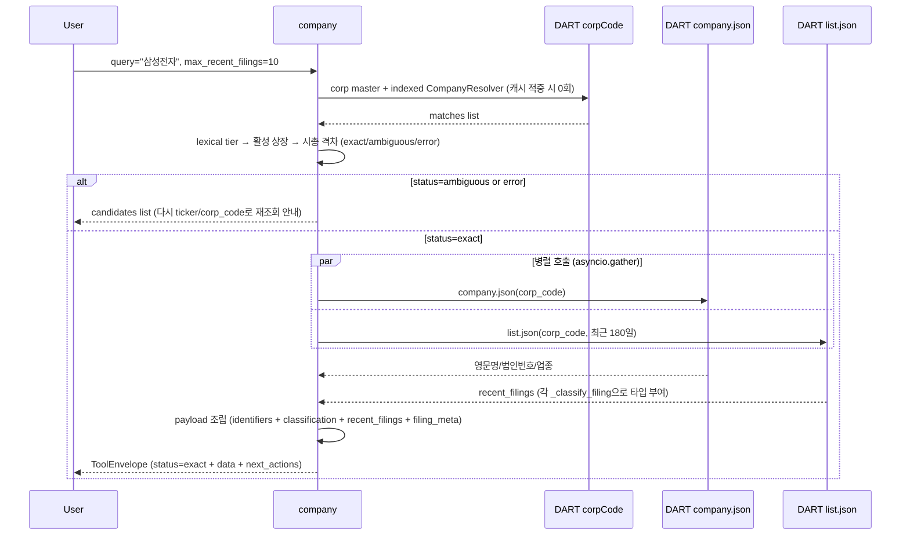

# company

## 한 줄 요약
기업 식별 + 최근 공시 인덱스 허브. 모든 data tool의 공통 입구. 한글·영문 회사명/ticker/corp_code → 시장·업종·최근 공시 확인.

## 사용법
```
company(
    query="삼성전자",
    max_recent_filings=10,
    start_date="20260101",
    end_date="20260427",
)
```

자연어 예시:
- "삼성전자 식별자랑 최근 공시 보여줘" → `query="삼성전자"`
- "KT&G corp_code 확인" → `query="KT&G"` (약칭 + special char 매칭)
- "Samsung Fire 배당" → `query="Samsung Fire"` (DART 공식 영문명 토큰 조합)
- "HD Hyundai Electric" → `query="HD Hyundai Electric"` (법인 접미사·구두점 정규화)
- "삼성" / "Samsung" → 활성 상장 후보 중 시총 격차가 충분하면 삼성전자로 자동 추론하고 대안 표시

## 입력 인자
| 인자 | 타입 | 필수 | 설명 | 기본값 |
|---|---|---|---|---|
| query | str | yes | 회사명 / ticker / corp_code | - |
| max_recent_filings | int | no | 최근 공시 표시 수 (1-20) | 10 |
| start_date | str | no | YYYYMMDD, 미지정 시 자동 | "" |
| end_date | str | no | YYYYMMDD, 미지정 시 오늘 | "" |
| format | str | no | "md" / "json" | "md" |
| language | str | no | `auto` / `ko` / `en`. 호출 AI가 응답 문구 언어 지정 | `auto` |

## 출력 schema (data dict)
```json
{
  "company_id": "...",
  "canonical_name": "삼성전자(주)",
  "names": {"en": "SAMSUNG ELECTRONICS CO,.LTD", "aliases": [...]},
  "company_resolution": {
    "match_type": "canonical|alias|inferred",
    "matched_on": "official|normalized|token|substring|fuzzy",
    "confidence": "high",
    "reason": "...",
    "market_data_as_of": "20260721",
    "market_data_source": "krx_weekly|local_popularity_prior",
    "ranking_signal": "market_cap|local_popularity_prior",
    "alternatives": []
  },
  "identifiers": {"ticker": "005930", "corp_code": "00126380",
                  "isin": "...", "jurir_no": "...", "bizr_no": "..."},
  "classification": {"market": "KOSPI", "sector_name": "...",
                     "induty_code": "...", "fiscal_month": "12"},
  "basic_info": {"ceo_name": "...", "established_date": "...",
                 "address": "...", "homepage": "..."},
  "recent_filings": [{"disclosure_date": "...", "filing_type": "...",
                      "report_name": "...", "filer_name": "...",
                      "rcept_no": "..."}],
  "recent_filings_window": {"start_date": "...", "end_date": "..."},
  "candidates": [...]    // status=ambiguous 시
}
```

핵심 필드:
- `status`: `exact` (공식명 또는 자동 추론 성공) / `ambiguous` (동일하게 강한 공식명 후보 N건) / `error` (식별 실패).
- 외부 `status` 계약은 유지한다. 자동 추론 성공도 `exact`이고 `company_resolution.match_type=inferred`로 근거와 대안을 구분한다.
- 최신 KRX 전체 스냅샷이 있고 KOSPI·KOSDAQ 시장별 최소 건수를 충족하면 활성 종목을 우선한다. 스냅샷이 없거나 불완전하면 lexical 검색으로 fail-open한다.
- `candidates`: ambiguous 시 후보 리스트 → ticker/corp_code 직접 입력으로 재조회.

## Data sources
- **DART API**: `corpCode.xml` (한글명·공식 영문명·식별자, ZIP→XML, memory→SQLite 캐시), `company.json` (법인번호/업종코드), `list.json` (최근 공시).
- **KRX 주간 스냅샷**: 전체 활성 상장 여부 + 시가총액 prior. 요청별 조회 없이 resolver 생성 시 한 번 메모리에 적재.
- 외부 호출: 최대 3회 (corpCode 캐시 적중 시 2회).

## Flow



호출 횟수: corpCode 캐시 적중 시 2회 (company.json + list.json). 캐시 미스 시 +1 (최대 3회). 회사명 검색 자체는 외부 호출 0회다.

## 파싱 전략
- 검색 tier: ticker/corp_code → 공식 한글·영문명 → curated alias → normalized phrase/compact → token AND → substring → 제한적 fuzzy.
- NFKC·대소문자·공백·구두점·하이픈·법인 접미사를 정규화하고 `&`/`and`/`앤` connector를 같은 토큰으로 취급한다.
- 공식명 exact는 시총보다 절대 우선한다. `SK`는 SK하이닉스가 아니라 `SK`(034730)다.
- 부분명은 시총 정보가 있는 최상위 후보를 바로 선택한다. 1·2위 격차가 1.5배 이상이면 `confidence=high`, 그보다 작으면 `low`와 대안을 함께 반환하며 사용자에게 되묻지 않는다.
- 서로 다른 법인이 같은 strong 공식명/정규화명으로 충돌할 때만 `ambiguous` 후보를 순서대로 반환하고 질문 문장은 만들지 않는다.
- 안내문은 한국어·영어 두 버전이며 호출 AI가 `language`로 선택한다. `auto`는 입력 문자 기준 fallback이다.
- fuzzy는 indexed 검색이 전부 실패하고 compact 길이가 5자 이상일 때만 cutoff 0.88로 적용한다.
- 11만 전체 법인에서는 corp_code exact만 색인하고, 이름 인덱스는 종목코드 보유 법인만 구축한다.
- regression 0 검증: 200기업 audit에서 `company.summary` exact 98.5% (193/196), error 1% (비상장 매핑 실패).

## 관련 공시 (rules/disclosures/)
- 해당 없음 (식별 카드 tool. 공시 본문 파싱은 후속 data tool 담당)

## 관련 개념 (rules/concepts/)
- 해당 없음

## 관련 결정 (decisions/)
- [[pblntf-ty-필터링]] — recent_filings 조회 시 pblntf_ty 필수
- [[free-paid-분리]] — MCP(public) + Pipeline(private) 2-repo 구조에서 식별자 일관성
- [[lessons-learned]] — 회사 식별 우선 + ambiguous 처리

## 관련 audit/fix (architecture/)
- [[260429_0912_audit_parsing-200기업-v2-no_filing]] — `company.summary` 98.5% exact (193/196 KOSPI 100 + KOSDAQ 96)

## 알려진 issue + TODO
- ISIN/jurir_no/bizr_no는 DART company.json에 없는 경우 비어 있음 (TODO: KIND·KRX 보강).
- KRX 전체 스냅샷이 14일보다 오래되면 활성 상장 필터로 사용하지 않고 시총 정렬 정보로만 사용한다.
- recent_filings 기본 lookback이 자동 (start_date 비워두면 직전 N개월). 명시 권장.

## 변경 이력
- 2026-07-22: DART 공식 영문명을 corp master/SQLite에 저장. 한글·영문·혼합 토큰 indexed resolver, 활성 상장·시총 prior, 추론 근거/대안, 제한적 fuzzy, `language=ko|en` 문구 선택 추가. 실제 DART 118,511사 기준 warm p95 0.04ms.
- 2026-04-18: company tool 신설 (corp_identifier 후속, recent_filings + ISIN 보강)
- 2026-04-29: 200기업 v2 audit 통과 (98.5% exact)
- 2026-05-01: tool wiki 페이지 작성
