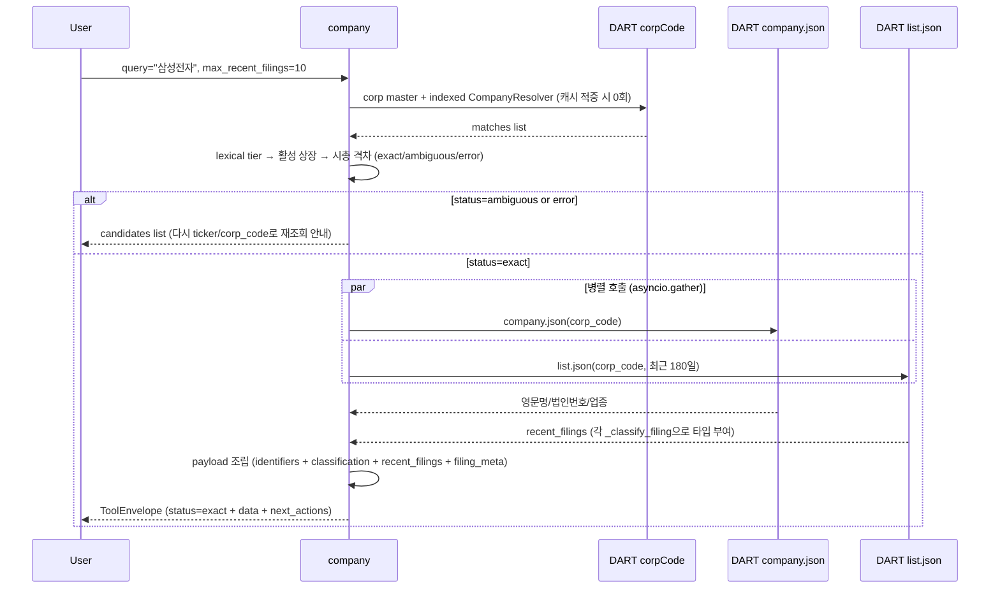

# company

## 한 줄 요약
기업 식별 + 최근 공시 인덱스 허브. 모든 data tool의 공통 입구. 한글·영문 회사명/ticker/corp_code → 시장·업종·최근 공시 확인.

## 사용법
```
company(
    query="삼성전자",
    max_recent_filings=10,
    start_date="20260101",
    end_date="20260427",
)
```

자연어 예시:
- "삼성전자 식별자랑 최근 공시 보여줘" → `query="삼성전자"`
- "KT&G corp_code 확인" → `query="KT&G"` (약칭 + special char 매칭)
- "Samsung Fire 배당" → `query="Samsung Fire"` (DART 공식 영문명 토큰 조합)
- "HD Hyundai Electric" → `query="HD Hyundai Electric"` (법인 접미사·구두점 정규화)
- "삼성" / "Samsung" → 활성 상장 후보 중 시총 격차가 충분하면 삼성전자로 자동 추론하고 대안 표시
- "'카카오'라는 이름으로 상장사 여러 개면 뭐뭐 있어?" → 동명·유사명 후보 목록(status `ambiguous`)

## 입력 인자
| 인자 | 타입 | 필수 | 설명 | 기본값 |
|---|---|---|---|---|
| query | str | yes | 회사명 / ticker / corp_code | - |
| max_recent_filings | int | no | 최근 공시 표시 수 (1-20) | 10 |
| start_date | str | no | YYYYMMDD, 미지정 시 자동 | "" |
| end_date | str | no | YYYYMMDD, 미지정 시 오늘 | "" |
| format | str | no | "md" / "json" | "md" |
| language | str | no | `auto` / `ko` / `en`. 호출 AI가 응답 문구 언어 지정 | `auto` |

## 출력 schema (data dict)
```json
{
  "company_id": "...",
  "canonical_name": "삼성전자(주)",
  "names": {"en": "SAMSUNG ELECTRONICS CO,.LTD", "aliases": [...]},
  "company_resolution": {
    "match_type": "canonical|alias|inferred",
    "matched_on": "official|normalized|token|substring|fuzzy",
    "confidence": "high",
    "reason": "...",
    "market_data_as_of": "20260721",
    "market_data_source": "krx_weekly|local_popularity_prior",
    "ranking_signal": "market_cap|local_popularity_prior",
    "alternatives": []
  },
  "identifiers": {"ticker": "005930", "corp_code": "00126380",
                  "isin": "...", "jurir_no": "...", "bizr_no": "..."},
  "classification": {"market": "KOSPI", "sector_name": "...",
                     "induty_code": "...", "fiscal_month": "12"},
  "basic_info": {"ceo_name": "...", "established_date": "...",
                 "address": "...", "homepage": "..."},
  "recent_filings": [{"disclosure_date": "...", "filing_type": "...",
                      "report_name": "...", "filer_name": "...",
                      "rcept_no": "..."}],
  "recent_filings_window": {"start_date": "...", "end_date": "..."},
  "candidates": [...]    // status=ambiguous 시
}
```

핵심 필드:
- `status`: `exact` (공식명 또는 자동 추론 성공) / `ambiguous` (동일하게 강한 공식명 후보 N건) / `error` (식별 실패).
- 외부 `status` 계약은 유지한다. 자동 추론 성공도 `exact`이고 `company_resolution.match_type=inferred`로 근거와 대안을 구분한다.
- 최신 KRX 전체 스냅샷이 있고 KOSPI·KOSDAQ 시장별 최소 건수를 충족하면 활성 종목을 우선한다. 스냅샷이 없거나 불완전하면 lexical 검색으로 fail-open한다.
- `candidates`: ambiguous 시 후보 리스트 → ticker/corp_code 직접 입력으로 재조회.

## Data sources
- **DART API**: `corpCode.xml` (한글명·공식 영문명·식별자, ZIP→XML, memory→SQLite 캐시), `company.json` (법인번호/업종코드), `list.json` (최근 공시).
- **KRX 주간 스냅샷**: 전체 활성 상장 여부 + 시가총액 prior. 요청별 조회 없이 resolver 생성 시 한 번 메모리에 적재.
- 외부 호출: 최대 3회 (corpCode 캐시 적중 시 2회).

## Flow



호출 횟수: corpCode 캐시 적중 시 2회 (company.json + list.json). 캐시 미스 시 +1 (최대 3회). 회사명 검색 자체는 외부 호출 0회다.

## 파싱 전략
- 검색 tier: ticker/corp_code → 공식 한글·영문명 → curated alias → normalized phrase/compact → token AND → substring → 제한적 fuzzy.
- **강한 매칭이 약한 매칭을 이긴다** — 약한 tier(token/substring/fuzzy)에 먼저 걸려도 거기서
  멈추지 않고 역음차 경로를 끝까지 본다. 「지에스」는 부분일치로 「지에스이」에 걸려 「GS」를
  영영 못 찾고 있었다(「에스케이」→에스케이바이오팜도 같은 유형). 역음차가 약하게만 맞으면
  원래 결과를 유지한다 — 「제이와이피」는 원문으로 아무것도 안 걸리고 'jyp' 토큰으로만 닿는다.
- **이름이 정확히 맞지 않으면 응답이 그 사실을 밝힌다** — 추정으로 고른 기업은 모든 tool 의
  `warnings` 맨 앞에 「「지에스」를 **지에스이**(으)로 추정했습니다」가 실린다. 적는 곳은 해석
  확정 관문 하나(`_resolve_match`), 읽는 곳은 `ToolEnvelope.to_dict()` 하나다. `ToolEnvelope`
  를 쓰지 않는 서비스(`valuation`·`asset_holdings`·`screener`)는 진입 함수를
  `declare_weak_resolution` 으로 감싼다. 드리프트는 정적 테스트로 막는다.
- **법인격은 앞뒤 어디에나 붙는다** — DART 정식명은 「(주)광무」·「주식회사솔루엠」처럼 앞에 오기도
  한다. `$` 앵커로 뒤만 떼면 공시에서 복사한 이름이나 **우리 tool 이 출력한 이름을 그대로 다시 물을 때**
  실패한다. 「주성엔지니어링」·「유한양행」·「사조오양」처럼 우연히 같은 글자로 시작하는 상호를 깎지
  않도록 닫는 괄호나 '식회사'를 요구한다.
- **역음차(reverse transliteration)** — DART 등록명이 라틴 표기인데 공고 헤더는 한글 음차로 적는다
  (에스케이씨=SKC · 씨제이대한통운=CJ대한통운 · 에이치엘비=HLB). 알파벳 26자의 한글 음차표로 앞머리
  연쇄를 되돌린다. 「엔」은 알파벳 N이자 「엔터테인먼트」의 첫 글자라 어디까지 letter인지 정할 수 없어
  **길이별 변형을 모두 색인**하고(제이와이피엔터테인먼트 → jyp엔터테인먼트), 질의·색인 **양쪽에 같은
  변환**을 걸어 반대 방향도 성립시킨다. 1글자는 우연 일치가 많아(이수페타시스의 '이'=E) 2글자부터다.
- **업종어 접미** — 공고 헤더는 정식 상호이고 등록명은 짧다(삼성생명보험→삼성생명 · 흥국화재해상보험→
  흥국화재 · 대한약품공업→대한약품). **짧게 떼는 것부터** 시도하고 후보가 정확히 하나일 때만 받는다 —
  「미래에셋생명보험」에서 '생명보험'을 떼면 「미래에셋」이라는 별개 회사가 나온다.
- **못 찾으면 근접 후보를 보여준다(자동 선택 X).** 앞자르기 자동선택은 오답을 낸다(에스피씨삼립→
  「케이에스피」·포스코디엑스→「POSCO홀딩스」·NICE홀딩스→「NICE」). 같은 계산을 '제안'으로 쓰면
  안전하다 — 고르는 것은 사람이다.
- NFKC·대소문자·공백·구두점·하이픈·법인 접미사를 정규화하고 `&`/`and`/`앤` connector를 같은 토큰으로 취급한다.
- 공식명 exact는 시총보다 절대 우선한다. `SK`는 SK하이닉스가 아니라 `SK`(034730)다.
- 부분명은 시총 정보가 있는 최상위 후보를 바로 선택한다. 1·2위 격차가 1.5배 이상이면 `confidence=high`, 그보다 작으면 `low`와 대안을 함께 반환하며 사용자에게 되묻지 않는다.
- 서로 다른 법인이 같은 strong 공식명/정규화명으로 충돌할 때만 `ambiguous` 후보를 순서대로 반환하고 질문 문장은 만들지 않는다.
- 안내문은 한국어·영어 두 버전이며 호출 AI가 `language`로 선택한다. `auto`는 입력 문자 기준 fallback이다.
- fuzzy는 indexed 검색이 전부 실패하고 compact 길이가 5자 이상일 때만 cutoff 0.88로 적용한다.
- 11만 전체 법인에서는 corp_code exact만 색인하고, 이름 인덱스는 종목코드 보유 법인만 구축한다.
- regression 0 검증: 200기업 audit에서 `company.summary` exact 98.5% (193/196), error 1% (비상장 매핑 실패).

## 관련 공시 (rules/disclosures/)
- 해당 없음 (식별 카드 tool. 공시 본문 파싱은 후속 data tool 담당)

## 관련 개념 (rules/concepts/)
- 해당 없음

## 관련 결정 (decisions/)
- [[pblntf-ty-필터링]] — recent_filings 조회 시 pblntf_ty 필수

## 관련 audit/fix (architecture/)
- 260429_0912_audit_parsing-200기업-v2-no_filing — `company.summary` 98.5% exact (193/196 KOSPI 100 + KOSDAQ 96)

## 알려진 issue + TODO
- ISIN/jurir_no/bizr_no는 DART company.json에 없는 경우 비어 있음 (TODO: KIND·KRX 보강).
- KRX 전체 스냅샷이 14일보다 오래되면 활성 상장 필터로 사용하지 않고 시총 정렬 정보로만 사용한다.
- recent_filings 기본 lookback이 자동 (start_date 비워두면 직전 N개월). 명시 권장.

## 사명 변경 추적 (260808)

**DART 에는 옛 사명이 어디에도 없다.** corpCode.xml 은 현재 사명만 싣고, 공시 목록(list.json)의
`corp_name`·`flr_nm` 조차 **과거 공시에까지 현재 사명을 소급**해 채운다 — 실측 036560 의 2024-03
공시 6건이 전부 「KZ정밀」로 나온다(당시 사명은 영풍정밀). 문서 본문의 「(구 영풍정밀)」 표기를
긁어보면 캐시 1,129건에서 524건이 걸리지만 「회생채권」·「808」 같은 오탐이 태반이라 별칭 사전으로
못 쓴다. **잘못된 별칭은 없는 것보다 나쁘다.**

그래서 7일마다 받는 corpCode.xml 을 스냅샷으로 남기는 것이 유일한 구조적 방법이다.
`corp_name_history(corp_code, corp_name, first_seen, last_seen)` 에 갱신 때마다 전량 upsert 하고 —
PRIMARY KEY 가 중복을 흡수하니 실제로 행이 느는 건 사명이 바뀐 회사뿐이다 — 「옛 이름」은 현재
사명과 달라진 행으로 정의한다. 저장 경로가 매번 `DELETE FROM corp_codes` 후 전체 재적재라
**지우기 전에** 적재한다. live 는 fly 영속 볼륨(`/data/master.db`)이라 배포해도 안 지워진다.

조회 실패 시 이력을 보고 「'X'는 사명이 바뀌었다 — 현재 'Y'(종목코드 NNNNNN)다」로 답한다.
**한계**: 스냅샷을 남기기 시작한 뒤의 변경만 잡는다. 영풍정밀→케이젯정밀처럼 이미 지나간 변경은
복구할 수 없고, 그 경우는 「종목코드로 재조회」 안내로 물러난다.

## 변경 이력
- 2026-08-08: 사명 변경 이력 누적(`corp_name_history`) + 미발견 안내가 현재 사명을 알려줌 (위 절).
- 2026-08-06: 스윕 서사·측정 상세를 private storage 로 이관(경계 규칙 [[wiki_schema]] 0.0).
- 2026-08-05: 약한 매칭이 강한 매칭을 가로채던 것 수정 + 추정 사실을 25개 tool 전체 `warnings` 로 전파
  (`declare_weak_resolution`).
- 2026-07-27: 공시 회사명 조회 3종 보강(접두 법인격 · 역음차 · 업종어 접미) + 실패 시 근접 후보 제안.
- 2026-07-22: DART 공식 영문명을 corp master/SQLite 에 저장. 한글·영문·혼합 토큰 indexed resolver,
  활성 상장·시총 prior, 추론 근거/대안, 제한적 fuzzy, `language=ko|en` 문구 선택.
- 2026-05-01: tool wiki 페이지 작성.
- 2026-04-29: 200기업 v2 audit 통과 (98.5% exact).
- 2026-04-18: tool 신설 (corp_identifier 후속, recent_filings + ISIN 보강).
