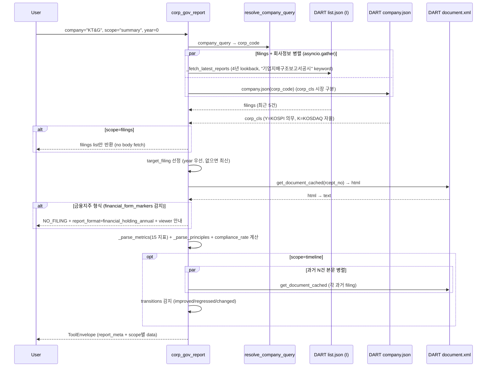

# corp_gov_report

## 한 줄 요약
기업지배구조보고서(거버넌스 종합 평가) data tool. 15개 핵심지표 준수 여부(O/X) + 세부원칙 28개 응답 +
**서식 표 원본 11종**(이사회 구성·출석률·겸직·변동사유·안건별 찬반 등) + 제출 이력 + 연도별 추이.
2026 제출분부터 KOSPI 전체 의무이며, 금융회사는 연차보고서로 갈음해 거래소 서식이 아예 없다.

## 사용법
```
corp_gov_report(
    company="KT&G",
    scope="summary",
)
```

자연어 예시:
- "KT&G 거버넌스 준수율" → `scope="summary"` (KT&G 100%, POSCO홀딩스 100%)
- "삼성전자 15지표 상세 + 비고" → `scope="metrics"` (86.7% 준수)
- "집중투표제·전자투표 도입했어?" → `scope="metrics"` (15지표 중 「집중투표제 채택」·「전자투표 실시」 O/X)
- "현대차 연도별 준수율 추이" → `scope="timeline"` (improved/regressed/changed 감지)
- "삼성전자 이사들 이사회 출석률" · "이 회사 안건별 찬반 주식수" → `scope="tables"`

## 입력 인자
| 인자 | 타입 | 필수 | 설명 | 기본값 |
|---|---|---|---|---|
| company | str | yes | 회사명 / ticker / corp_code | - |
| scope | str | no | 7종 (아래 참조) | "summary" |
| year | int | no | 사업연도 (예: 2023). 0이면 최신 | 0 |
| format | str | no | "md" / "json" | "md" |

scope:
- `summary`: 기업개요 + 준수율 + 15지표 ✅/❌ 요약 (기본)
- `metrics`: 15 지표 당기·직전기 + 비고 상세
- `principles`: 세부원칙별 응답 텍스트 (최대 30건)
- `filings`: 제출 이력 (lookback 4년)
- `timeline`: 연도별 준수율 추이 + 지표 전환 (improved / regressed / changed)
- `tables`: 서식 표 원본 **11종**. 이미 받아 둔 원문에서 뽑아 DART 콜 0 증가.

| 묶음 | 표 | 담긴 것 |
|---|---|---|
| 주총 운영 | 1-1-1 · 1-2-1 · 1-2-2 | 소집공고~주총 **실제 일수**·개최장소·감사 출석·주주발언 / 집중일 회피·서면·전자투표·대리행사 권유 / 안건별 찬반 주식수 |
| 이사 | 4-1-2 · 4-2-1 · 4-3-1 · 5-2-1 · 7-1-1 · 7-2-1 | 이사회 구성(성별·나이·직책·재직기간·임기만료일·**전문 분야·주요 경력**) / 선임·변동사유 / 후보 사전 정보제공기간 / 사외이사 겸직 / 이사회 개최·**안건통지↔개최 간격** / 개별이사 3개년 출석률·찬성률 |
| 감사 | 9-1-1 · 10-2-1 | 내부감사기구 구성·경력·**재무전문가 표기** / 외부감사인 소통내역 |

1-1-1·1-2-1 은 항목이 **행에 놓인 표**라 기수 하나를 한 줄로 뒤집어 낸다. 이 둘은 열 축 표와 달리
`rowspan` 이 진짜 병합이라(부모 라벨을 아래 행이 다시 싣지 않는다) 라벨을 부모·자식으로 이어 붙인다.

- `flags`: 본문 **세부 준수 플래그 78개** Y/N. 표와 마찬가지로 DART 콜 0 증가.
  15개 핵심지표는 문서가 스스로 뽑아 앞에 실은 요약이고, 이쪽이 본문 전체의 답이다.
  **78개 중 72개는 15지표가 담지 않는 사실**이다 — 주주제안 절차 안내·공개서한 접수 · 재무제표
  정기주총 6주전/연결 4주전 제공 · 영문자료·영문 사이트·외국인 담당직원 · 선임사외이사·집행임원
  제도 · 사외이사 개별평가 · 감사기구 지원조직 설치·독립성 · 외부감사인 독립성 훼손우려 ·
  기업가치 제고 계획 자율공시·소통 등. 겹치는 6개는 `same_as_metric` 으로 표시한다.

> **`filings_found` ≠ `filing_count`** — 세는 대상이 다르다.
> `filings_found` 는 검색으로 찾은 보고서 건수, `filing_count`(공용 `build_filing_meta`)는
> status 를 매기려고 「파싱 대상으로 인정한 사건 수」다. 금융회사 연차보고서 서식이거나 대상
> 연도 건이 없으면 후자만 0 이 된다(KB금융 summary: `filings_found` 1 / `filing_count` 0).
> 이력 건수를 읽을 때는 `filings_found` 를 쓴다.

> **주주 4필드 파싱**: `company_overview`의 `max_shareholder/pct/minority`는 표 1-0-0을 **td 단위
> (label,value)로 파싱**한다(소액주주 앵커 ~5KB 슬라이스). 텍스트 매칭으로 잡으면 법적 정의문구
> '최대주주(그의 상법상 특수관계인을…)'의 `(`를 긁는다. 음수재무 △/▲/괄호는 정규화한다.
> **무결성 시그널 (`warnings`)**: status=exact인데 `compliance_rate` None / 명시 준수율과
> `metrics_compliant/parsed×100` 교차검증 불일치(>0.2) / 주주필드 괄호·빈값 → PARTIAL. 추가 호출 0.

## 출력 schema (data dict)
```json
{
  "company_id": "...",
  "market": "KOSPI",
  "mandatory": true,
  "filings_found": N,          // 검색으로 찾은 보고서 건수
  "filing_count": N,           // status 산출용 — 파싱 대상으로 인정한 사건 수 (위 주의 참조)
  "report_meta": {"rcept_dt": "...", "rcept_no": "...",
                  "reporting_period_end": "...",
                  "compliance_rate": 86.7,
                  "metrics_compliant": 13, "metrics_non_compliant": 2,
                  "metrics_parsed_count": 15},
  "company_overview": {"max_shareholder": "...",
                       "max_shareholder_pct": "...",
                       "minority_shareholder_pct": "...",
                       "industry": "...", "main_products": "...",
                       "corporate_group": "...",
                       "revenue_current": "...",
                       "operating_income_current": "...",
                       "net_income_current": "...",
                       "total_assets_current": "..."},
  "metrics_summary": [...],
  "metrics": [{"label": "...", "current": "O|X|-",
               "prior": "O|X|-", "note": "..."}],
  "principles": [...],
  "tables": {"7-2-1": {"title": "최근 3년간 이사 출석률 및 안건 찬성률",
                       "columns": ["이사", "구분", "이사회 재직기간",
                                   "출석률 (%) · 최근 3개년 평균", "..."],
                       "rows": [{"이사": "...", "출석률 (%) · 최근 3개년 평균": "100.0"}],
                       "key_labels_verified": true}},
  "filings": [...],
  "timeline": [...],
  "transitions": [{"label": "...", "direction": "improved|regressed|changed",
                   "from_dt": "...", "from_val": "...",
                   "to_dt": "...", "to_val": "..."}],
  "no_filing": false,
  "report_format": "financial_holding_annual" (금융지주만),
  "usage": {"dart_api_calls": N, "mcp_tool_calls": 1}
}
```

핵심 필드:
- `compliance_rate`: 15지표 준수율 (%)
- `transitions`: 연도간 지표 변화 (regression 자동 감지 = 거버넌스 리스크 조기 경보)
- 의무 범위 (2026~ KOSPI 전체, KOSDAQ 자율, 제출 시한 매년 5월말)

## Data sources
- **DART API**: `list.json` (pblntf_ty=I) + 키워드 "기업지배구조보고서공시" → 원문 다운로드 (`get_document_cached`).
  15 지표·세부원칙·기업개요는 bs4(lxml 백엔드) 텍스트에서, 서식 표 11종은 lxml 트리에서 뽑는다.
- 전용 구조화 API 없음.
- KIND/Naver 미사용. PDF 미수행 (HTML 본문만).
- 외부 호출: 일반 2~3회(원문이 캐시에 있으면 2회). `tables` 는 이미 받은 원문을 쓰므로 **증가 0**.
  `timeline` 만 과거 문서 4건이 더 붙어 최대 7회.

## Flow



## 파싱 전략
- 키워드 `"기업지배구조보고서공시"`. **보고서명으로 연차보고서를 걸러내지 않는다** — 금융회사는
  그해 공시가 통째로 사라져 몇 해 전 보고서를 최신인 양 가리키게 된다. 같은 해에 거래소 서식이
  함께 있을 때만 뒤로 미룬다(`_pick_filing`).
- 15개 표준 지표 라벨 prefix(25자) 매칭 → 블록별 O/X 2개(당기·직전) + 비고 텍스트 동적 수집
- 비고 0개~다수 모두 대응 (삼성: 비고 없음 / SK하이닉스: 일부 비고 / 현대차: 매건 비고)
- 금융회사 별도 형식 분리 (`_FINANCIAL_FORM_MARKERS`):
  - "금융회사 지배구조 연차보고서" / "지배구조 및 보수체계 연차보고서" 감지 시 → NO_FILING + `report_format = "financial_holding_annual"` 메타
  - PDF 첨부 직접 확인 안내 (next_actions)
- 세부원칙 28개(핵심원칙 10개 하위)를 번호·설명·응답으로 추출. 2026 제출분 기준 99.8%.
- 서식 표는 표 번호 ↔ KRX 개념 코드(`krx-cg_*`)가 1:1이라 `services/corp_gov_form.py` 레지스트리로 대조한다.
  선두 키 열은 서식이 이름을 달지 않아 회사가 다른 항목을 적기도 한다 — 모양이 어긋나면 이름을
  붙이지 않고(`키N`) 그 사실을 warnings 로 알린다.
- 알려진 한계: 2022/2023년 구 서식 일부 미지원.
- 실측(2026-08-05, 캐시 249건 전수): 세부원칙 28개 **99.8%** · 서식 표 10종 **249/249** 13,708행.
- 실측(2026-08-06, 라이브 표본 25사): 표 4-1-2 **25/25** 211행 · 열 고정 1종.
- 실측(2026-04-29, 200기업 audit): `summary` 48.0% exact(94/196) · no_filing 41.8%(KOSDAQ 자율 미제출)
  · partial_failure 9.2% → 금융회사 분기 후 partial 0. **금융회사는 skip 이 아니라** 서식이 다르다는
  안내와 함께 그해 원문을 가리킨다.

## 관련 공시 (rules/disclosures/)
- [[기업지배구조보고서]] — DART+KIND, KOSPI 전체 의무(2026년~), 15 핵심지표

## 관련 개념 (rules/concepts/)
- [[집중투표]] — 15 지표 중 9번 (집중투표제 채택)
- [[감사위원-의결권-제한]] — 감사기구 4개 지표 관련
- [[의결권]] — 주주 5개 지표 관련
- [[정관변경]] — 거버넌스 정책 변경 trigger
- [[보수한도]] — 이사회 거버넌스

## 관련 결정 (decisions/)
- [[BeautifulSoup-파서-선택]] — lxml 채택
- [[XML-vs-PDF]] — HTML 본문만 (PDF 첨부 미수행)
- [[cross-domain-체이닝]] — CGR → AGM (주총 운영) / OWN (지배구조) / PRX (분쟁 맥락) 체이닝

## 관련 audit/fix (architecture/)
- 260422_0005_audit_parsing-14scope-15기업 — 14 scope x 15 기업 + corp_gov_report 포함
- 260429_0912_audit_parsing-200기업-v2-no_filing — corp_gov_report.summary 48.0% exact, partial 9.2%
- 260429 금융지주 financial_form 감지(18건 partial → 0) — 분석문은 storage `wiki-private/archive/opm-decisions/` 이관

## 알려진 issue + TODO
- 서식 표 32종 중 11종 노출. 나머지 22종 중 **배당 3종(1-4-1·1-5-1-1·1-5-1-2)은 [[dividend_disclosure]],
  발행주식 2종(2-1-1-1·2-1-1-2)은 [[ownership_structure]]·[[price_multiple_data]], 밸류업 2종(11-1·11-2)은
  [[value_up]] 과 중복**이라 열지 않는다(계산 지표 단일 소스 원칙). 위원회 3종(8-2-1~3)은 번호가
  위원회를 특정하지 못하고 채움률이 낮다(127·70·107사). 남은 후보는 4-1-2 이사회 구성 현황 ·
  4-1-3-1/2 위원회 현황·구성 · 5-1-1 사외이사 재직기간 · 9-2-1 감사위 개별 출석률 · 1-3-1 주주제안.
- 지배구조핵심지표 표의 `valuetxt` 준수 플래그 구조화 (TODO).
- 2022/2023년 구 서식 추가 대응 (TODO).
- ESG 평가등급 연동 (KCGS, 서스틴베스트 외부 데이터, TODO).
- 금융회사 PDF 본문 파싱 (OEK PDF parser fallback 검토, TODO).

## 변경 이력
- 2026-08-06: `scope=flags` 신설 — 본문 세부 준수 플래그 78개(72개는 15지표에 없는 사실).
  키는 개념 코드가 아니라 **(개념, 문서 내 순번)** 이고, 답 옆 라벨(「시행 여부」)이 아니라
  서식이 물은 `(N) …` 질문문을 라벨로 쓴다. 자세한 것은 [[기업지배구조보고서]] 「본문 세부 준수
  플래그」.
- 2026-08-06: 검증 서사·표본 규모를 private storage 로 이관(경계 규칙 [[wiki_schema]] 0.0).
  표 4-1-2(이사회 구성 현황) 추가 — 10종 → 11종. 「전문 분야」·「주요 경력」은 다른 경로에 없고
  채움률이 높아 이사 후보 적격성 판단에 바로 쓰인다([[director_board]] 의 `main_career` 는
  사업보고서 기반이라 축이 다르다).
- 2026-08-05: `scope=tables` 신설(4종 → 10종) + 행 축 파싱 경로(1-1-1·1-2-1) ·
  금융회사가 몇 해 전 보고서를 가리키던 것 수정(보고서명 필터 제거) · 금융회사 안내 문구 정비 ·
  `filings_count` → `filings_found` 개명.
- 2026-07-31: `metrics_summary`에 `prior`·`note`·`note_ref` 추가 — 준수/미준수보다 **사유**가 판단에
  더 닿는다. 비고가 「(세부원칙 4-1) 참고」처럼 다른 절을 가리키기만 하면 그 절의 응답을 `note_ref`로
  데려온다(세부원칙은 같은 문서에서 이미 파싱 — 추가 DART 콜 0, 원문 `note`는 보존). 표(「표 1-1-1
  참고」)는 해소하지 않는다. 소비처는 [[proxy_advise_before_meeting]]의 `governance_non_compliant`.
- 2026-05-01: tool wiki 페이지 작성.
- 2026-04-29: 금융지주 형식 분리 · `timeline` scope 추가(transitions 자동 감지).
- 2026-04-22: tool 신설(15지표 파싱) · 의무 범위 정정(2026 KOSPI 전체).
