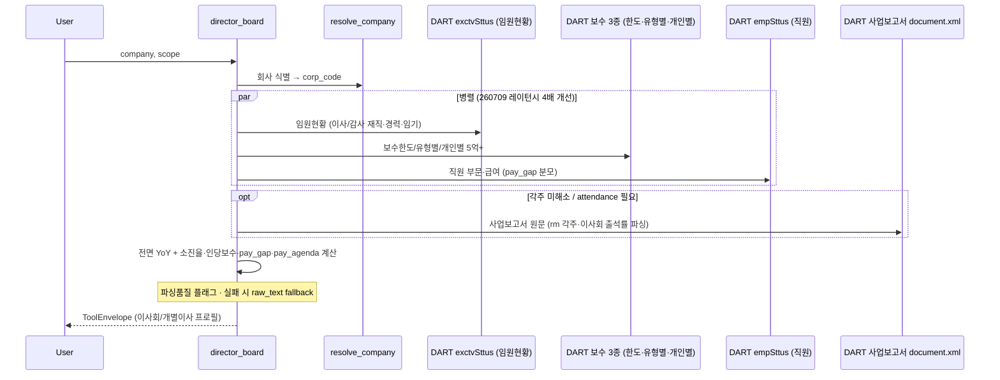

# director_board — 이사회/개별 이사 프로필

## 한 줄 요약
**개별 이사 단위** 정보 — 이사 인당 보수·보수한도 소진율·임원 재직/사퇴 변동·이사회 출석률(사업보고서 원문·부분적).
`corp_gov_report`가 "회사 15지표 준수 여부"라면, 이 tool은 "누가 얼마 받고, 한도를 얼마나 썼고,
인원이 어떻게 바뀌었나".

## 왜 만들었나 (사용자 260708)
답하려는 질문 3개:
1. 이사 **인당 보수가 적절한가** → 인당 보수 수치 (DART가 직접 제공)
2. **보수한도 소진율**은 얼마인가 → 이사류 실지급 ÷ 주총 승인한도
3. **사퇴/인원변동으로 인당보수·소진율이 바뀌었나** → 연도간 임원 diff × 보수 변동 교차

가치판단(과다/적절)은 하지 않는다 — 동종·규모 대비 판단이 필요해, 수치·전년비 변동·flag만 제공.

## 사용법
`director_board(company, scope="summary", year=0, lookback_years=3, format="md")`
- scope: `compensation` · `roster` · `individual` · `unregistered` · `pay_gap` · `pay_agenda` · `attendance`(출석률·on-demand) · `pay_criteria`(보수 산정기준·on-demand) · `summary`(기본)
- year: 기준 사업연도(0=최근 확정 전년). lookback_years: 조회 기간(년)

## scope별 추천 질문 (자연어 예시)

| scope | 이럴 때 물어보세요 |
|---|---|
| `compensation` | "현대차 이사 보수한도 소진율 얼마야?" · "삼성전자 최근 3년 한도 다 썼어?" · "HD현대중공업 한도초과 이유가 뭐야?"(→ rm 비고로 퇴직금 등 사유 확인) |
| `roster` | "기아 이사회 구성원 누구누구야?" · "현대차 작년에 이사 누가 오고 누가 나갔어?" · "이 회사 사외이사 중에 최대주주랑 관계있는 사람 있어?" |
| `individual` | "삼성전자 대표이사들 각각 얼마 받아?" · "이 회사 등기이사 중에 스톡옵션·RSA 받은 사람 있어?" · "정의선 작년 대비 보수 얼마나 늘었어?" |
| `unregistered` | "현대차 미등기임원 평균 보수 얼마야?" · "등기이사랑 미등기임원 보수 차이 얼마나 나?" |
| `pay_gap` | "이 회사 임원-직원 보수 격차 몇 배야?" · "직원 평균 연봉이랑 이사 보수 비교해줘" |
| `pay_agenda` | "이번 주총에 보수한도 얼마나 올려달래?" · "작년에 한도 다 쓰고 또 올려달라는 거야?"(인상 근거 판단) |
| `attendance` | "이사들 이사회 출석 잘 해?" · "출석률 저조한 이사 있어?"(사업보고서 원문, summary 제외 on-demand) |
| `pay_criteria` | "이 회사 상여는 무슨 기준으로 줘?" · "POSCO 성과급 KPI 가중치 뭐야?" · "대표이사 급여/상여 어떻게 산정했어?"(사업보고서 VIII-2 원문, summary 제외 on-demand) |
| `summary` (기본) | "이 회사 이사회 전반적으로 봐줘" · "이 회사 이사 보수 적절한지 살펴봐줘"(위 전부 종합) |

한 회사에 특정 관점만 궁금하면 scope 하나만 콜(DART 콜 절약), 종합 그림이 필요하면 `summary`.

## scope별 내용

| scope | 내용 | 소스 | 상태 |
|---|---|---|---|
| `compensation` | 등기이사 인당보수·보수한도·**소진율** (연도별) | 정형 API | ✅ v1 |
| `roster` | 임원현황 + **재직/사퇴 감지**(연도 diff) | exctvSttus | ✅ v1 |
| `individual` | 개인별 **5억+ 실명** 보수 (누가 얼마) | hmvAuditIndvdlBySttus | ✅ v1 |
| `unregistered` | **미등기 집행임원** 인당보수 (등기 밖 경영진) | unrstExctvMendngSttus | ✅ v1 |
| `pay_gap` | 경영진 vs **직원 평균** 보수 배수 | empSttus 조합 | ✅ v1 |
| `pay_agenda` | 주총 보수한도 안건 **올해 제안 vs 작년 실적**(인상률·작년소진율) | shareholder_meeting notice 재사용 | ✅ v1 |
| `attendance` | 개별 이사 **이사회 출석률**(일부만 요약 시 partial flag) | 사업보고서 원문 파서 | ✅ v2(부분적·on-demand) |
| `pay_criteria` | **보수 산정기준**(버킷별 정책 배수 + 개인별 급여/상여/KPI 분해) + **정형 API 하이브리드 교차검증** | 사업보고서 VIII-2 원문 파서 + hmvAuditIndvdlBySttus | ✅ (260713·on-demand) |
| `summary` | 위 전부 종합 + 신호 | 전부 | ✅ v1 |

## 260709 확장 — 전면 YoY + 놓친 필드 전부 노출
사용자 "다 가져오면 좋은거 아니야?" 지적으로, 이미 API 콜은 하면서 안 쓰던 필드를 전부 캡처·노출:
- **roster**: `main_career`(주요경력)·`mxmm_shrholdr_relate`(최대주주관계)·`sexdstn`(성별) 추가.
- **신규 API `outcmpnyDrctrNdChangeSttus`**(사외이사 변동현황) — 이사총수·사외이사수·선임/해임/
  중도퇴임 **DART 공식 집계**(개별 성명 없음)를 roster diff의 교차검증(sanity check)으로 연동, YoY.
- **compensation**: 승인한도(limit) 쪽 `rm`도 캡처(기존엔 실지급 쪽만).
- **individual·unregistered·pay_gap**: 전부 `lookback_years` 지원(YoY)으로 구조 변경 — `per_year: [...]`로 통일.
- **pay_gap**: `employee_breakdown`(부문·성별 원본 — 정규직/계약직/합계/평균근속연수/1인평균급여) 신규
  노출. 이전엔 배수 계산 내부에만 쓰고 화면엔 안 보여줬음. **`is_total` 플래그 필수**(census 260709
  발견 — 삼성전자류는 부문상세(DX/DS, 급여 공백)와 '성별합계' 총계행이 한 응답에 같이 와서, 구분 없이
  전부 합산하면 실제 인원의 2배로 더블카운트됨. `is_total=true`인 행만 합산 대상으로 표시).
- 개인별(5억+) `breakdown_note`(RSA·스톡옵션 등 미확정 주식보상) 렌더 추가 — 300개사 전수 확인
  결과 그룹 집계(`stk_bsd_pd_mendng_totamt`)는 0/300(공백)이지만, **개인별 텍스트엔 49/300(16.3%)에
  RSA·PSP·RSU·성과연동주식·스톡옵션 등 실제 내용**이 있었음(그룹 집계 하나만 보고 "스톡옵션 없음"
  단정했다가 사용자 지적으로 재확인해 발견).

**IR·QA 교차검증(260709)으로 발견·수정한 버그 3건**:
1. **roster diff 이탈 누락**: birth_ym이 연·월만 있어 정밀도 낮음 — 이탈자와 **이름이 전혀 다른
   잔류자**의 birth_ym이 우연히 같으면(현대차 이탈자 윤치원 vs 잔류자 심달훈, 둘 다 "1959년 06월")
   이탈이 통째로 누락됨. **2-pass 매칭**으로 수정: Pass1 이름 정확 일치로 잔류 확정 → Pass2 나머지만
   birth_ym 매칭(그 값이 남은 후보군에서 유일할 때만 인정). 로마자표기 변동(José 사례)은 여전히 잡힘.
2. **마크다운 표 깨짐**: `main_career`·`largest_shareholder_relation`에 원문 개행이 그대로 남아있어
   표 셀·목록이 깨짐 → 개행을 `" / "`로 정규화(`_clean_text_or_none`), `"-"`는 None 처리.
3. **교차검증 프레이밍 오차**: 필터 없이 `changes_vs_prev_year`(exctvSttus 전체 임원, 미등기 포함)를
   공식 사외이사 집계와 비교해 규모 자체가 안 맞음(미래에셋증권 17 vs 공식 3). `director_type=='사외이사'`
   신규선임만 필터링 후 비교하도록 수정(같은 회사 1 vs 3 — 재선임 미검출로 설명 가능한 합리적 격차).

## 신규 계산 로직

### 소진율
```
소진율(%) = (감사 단독 제외한 이사류 실지급 합) ÷ 이사 주총 승인한도 × 100
```
- 실지급은 유형별 여러 행(등기이사(사외·감사위 제외)/사외이사/감사위원 등). **감사위원회 위원은
  이사 한도 안**(등기이사이므로) — IR 검증(260708)으로 확증: 현대차 한도 12명 = 실지급 버킷
  5+2+5 헤드카운트와 정확히 일치. 순수 '감사'(비위원회)만 별도 한도.
- **한도 공백** — 새 주총 결의 없는 해엔 `gmtsck_confm_amount="-"` → 최근 유효연도 한도로 lookback,
  `limit_source`에 명시.
- **한도 행 합산(260708 버그 수정)**: 이사 한도가 상임/비상임 또는 등기/사외로 **분리 공시**되는
  회사(한국전력·기업은행·강원랜드 등)가 있는데, 최초 구현은 마지막 행으로 **덮어써서** 한도가
  5~8배 축소돼 소진율이 허위로 100%를 훨씬 넘겼다(펩트론 1263%, 한국전력 697% 등 300개사 census로
  발견). 수정: 이사류 행은 **합산**(단 '계'/'합계' 총계행이 있으면 중복방지로 그 행만 채택).
  감사 전용 행 판정도 "이사" 문자열 완전 부재 기준으로 개선("감사위원회 위원 또는 감사" 같은 결합
  표기가 "위원" 포함 때문에 이사 한도로 오분류되던 것 수정 — 단, **실지급(actual) 테이블의
  "감사위원회 위원"(순수 표기, 결합 아님)은 여전히 이사 한도 몫**이므로 한도/실지급 판정 기준을
  다르게 유지, 안 그러면 위 254번째 줄 검증이 깨짐).
- **소진율 >100%는 버그 아닌 실제 신호** — 수정 후 300개사 중 14개사가 100% 초과, **전부(14/14)
  원문 개별 재검증 완료(260708), 코드 버그 0건**. 단 원인은 "슈퍼사이클 성과급" 하나로 뭉뚱그릴 수
  없고 **4가지가 섞여 있음이 개별 확인**됐다(첫 1개사만 보고 일반화하려던 걸 사용자 지적으로 13개
  전부 검증해 정정):
  - **명시적 1회성**(rm에 명기): HD현대마린엔진·HMM·한국타이어앤테크놀로지·현대제철 — 퇴임이사
    퇴직금·중도사임 등. HMM은 퇴직소득 7억 제외 시 92.6%로 정상 범위.
  - **회사가 한도를 스스로 낮추며 초과**: GS리테일(한도 -16.7%) · HD현대마린솔루션(한도 -40%).
  - **만성적 초과**(전년도부터 이미 100% 근접/초과): 두산(2024도 98.2%) · 휴젤(2024도 116.9%) ·
    **실리콘투 — 2024년 962%!**(한도 25억에 240.6억 지급, 2025년 한도를 60억으로 140% 올렸는데도
    232.3%로 재초과. 구조적으로 한도 대비 과도한 지급이 반복되는 회사).
  - **순수 성과급 급등**: 심텍(반도체 기판 호황 추정, 인당보수 6.3배)·롯데쇼핑·현대오토에버.
  - 스톡옵션 행사이익 혼입 가설은 13개사 전부 `stk_opt`/`stk_bsd` 필드 공백 확인으로 **기각**.
  `utilization_flag="exceeded_limit"`로 표시(90%+ "high"와 구분) — 원인이 다양한 만큼 tool은
  판단 없이 신호만 제공, 해석은 사용 맥락(스튜어드십 engagement)에서.

### 인당 보수
`psn1_avrg_pymntamt`(1인평균)이 API에서 이미 계산되어 옴 — 검증 결과 실지급÷인원과 정합.

### 공시 비고(rm) 원문 노출 (260708 추가)
`drctrAdtAllMendngSttusMendngPymntamtTyCl`의 `rm`(비고) 필드를 **raw로 그대로** 노출한다
(`compensation` scope `by_type[].note`). 300개사 전수 스캔 결과 17.3%(52/300)에 내용이 있고
평균 24.9자·최대 187자로 짧아 — **정규식으로 구조화(이사명·날짜 추출)하지 않고 원문 그대로**
보여주는 게 맞다고 판단(회사마다 날짜 표기가 "선임('25.03.20)"/"2025년 03월 25일"/"2025.3.26 부"로
제각각이라 구조화 파서는 깨지기 쉬움 — 사용자 지시 "그런거 파싱하기보다 그냥 원문으로").
내용 예: 퇴직금·중도사임 등 1회성 사유(HMM "퇴임한 사내이사의 퇴직소득(7억원) 포함" → 한도초과
127.6%의 원인을 tool이 자동으로 보여줌), 심지어 **이사 성명+정확한 선임/사임 날짜**까지 담긴
경우도 있음(삼성생명). 주식기준보상 필드(`stk_bsd_pd_mendng_totamt`)는 300개사 전부 공백 확인 —
스콥 추가 가치 없음(스톡옵션 행사이익 혼입 가설 최종 기각).

### 재직/사퇴 감지
`exctvSttus` 연도간 diff. 동일인 판정은 **OR 매칭**(이름 일치 OR 생년월 일치):
- 로마자 표기 변동(이름 다름·생년월 같음) → 생년월으로 매칭 (예: José Muñoz "Jose Munoz"↔"호세무뇨스")
- 원문 birth_ym 오타(이름 같음·생년월 다름) → 이름으로 매칭 (QA 260708 발견: 기아 신재용
  2023 `1972.12` vs 2024 `1972.02` — 복합키였다면 이탈+신규 이중 오탐)
- 스냅샷이라 이탈 "사유"(사퇴·임기만료·해임)는 미확정 — 별도 수시공시로 확인 필요.

### 경영진-직원 보수 격차 (pay_gap)
```
격차 배수 = 등기이사(사외·감사위 제외) 인당보수 ÷ 직원 전체 가중평균 급여
직원 가중평균 = Σ(부문·성별 행 연급여총액) ÷ Σ(정규+계약 인원)   (합계행 중복 제외)
```
현대차 실측(2024): 등기이사 32.0억 ÷ 직원 1.24억 ≈ **25.8배**. 배수 자체가 과다/적정 판단은 아님
(업종·직군 구성 차이) — 비교 신호로만.

**인원수는 `sm`(공시 합계 필드) 우선 신뢰(260708 버그 수정)**: pay_gap 상위 10개사 중 7개는 QA가
개별 재검증(효성·두산·CJ제일제당·삼성전자·GS리테일·실리콘투·롯데쇼핑·심텍·영원무역 — 전부 지주사
스핀오프/별도기준 공시 등 타당한 이유로 확인, 버그 아님), **클로봇만 진짜 버그**였다 — 원문
`empSttus`의 특정 행이 `rgllbr_co=981`(오타 추정)인데 `sm=98`로 일관돼 있어, 정규+계약 합산을
그대로 쓰면 총원이 10배 부풀려져 배수가 56.6배(실제 8.7배)로 왜곡됐다. `sm`을 인원수 1순위로
바꿔 해결(다른 회사들 회귀 확인 — 효성·두산·삼성전자 불변).

### 보수한도 주총안건 비교 (pay_agenda)
`shareholder_meeting` 소집공고 보수한도 안건은 **하나의 공고에 current(올해 제안)·prior(작년 한도+
실지급)**를 모두 담는다. 이를 재사용해:
```
인상률 = (올해 제안 한도 − 작년 한도) ÷ 작년 한도
작년 소진율 = 작년 실지급 ÷ 작년 한도
```
현대차 실측: 제안 284억 / 작년 237억(인상 +19.8%) / 작년 실지급 236.9억(**작년 소진율 100%**) →
"한도 거의 소진 + 인상 요구 = 인상 근거 있음" 신호. **주의**: 이 '작년 소진율'은 주총공고 prior 컬럼
기준이라, `compensation` scope의 사업보고서 기반 소진율과 연도 기준·집계 정의가 다를 수 있음(둘 다
사실, 출처 다름). 찬반 판단 자체는 하지 않음(→ [[proxy_advise_before_meeting]]).
**주의**: pay_agenda는 `year` 파라미터를 무시하고 항상 **최근 주총 소집공고**를 본다(주총은 연 1회라
'올해 안건' 자체가 최신). 보수한도 안건이 없는 주총(기아 등 그 해 이사선임만)은 `status=no_agenda`로
정상 폴백. empSttus '성별합계'만 총액을 담는 삼성류 양식은 상세행 공백 시 합계행 폴백으로 처리
(QA 260708: `"합계" in se` 부분매칭이 '성별합계'를 버려 삼성 pay_gap이 None이던 버그 수정).

**`no_agenda`의 실제 원인 재검증(260708, 21개사 전수)** — 처음엔 소집공고에 이미지 첨부가 있으면
"이미지형 본문이라 파싱 실패"로 추정했으나 **틀렸다**(사용자 지적으로 재검증). `client.py`의
IMAGE_NOTICE 감지는 파일명에 "소집"·"통지" 등이 있으면 **본문 텍스트 유무와 무관하게** 무조건
경고를 찍는 느슨한 휴리스틱 — 실제로 본문 텍스트가 38,764자나 있어도 뜬다. 21개사를 전부 원문
텍스트 검색으로 재확인한 결과: **진짜 데이터 손실은 2건뿐**(한솔케미칼·주성엔지니어링 — 둘 다
**정정신고**의 before/after 표 구조를 안건 파서가 표준 소집공고 형식으로 인식 못 함, 진짜 원인).
나머지 19건은 정상 판단(보수한도 안건 자체가 없거나, 펄어비스처럼 "규정 신설"류 정관변경이라
금액이 없거나, 현대지에프홀딩스처럼 승인안건이 아닌 후보자 참고표였음 — 재검증 스크립트 1차
결과도 정규식 오탐 있어 원문 재대조 필요했음). 정정신고 파싱은 별도 TODO.

## 알려진 issue + TODO
- **attendance 부분성**: 사업보고서 원문 파서로 구현(260709)했으나 회사가 개별 출석률을 '(출석률:%)'
  인라인으로 요약하는 범위가 제각각 — **일부(주로 사외이사)만** 그 형식으로 쓰고 나머지는 회차별
  출석표에만 있는 회사가 많다(기아 4/9명 등). parsed 인원<이사회 인원이면 `attendance_partial` flag로
  표시. 전체 이사회 출석을 다 잡으려면 회차별 매트릭스 파싱이 필요(TODO). 표 자체가 없는 회사(셀트리온·
  알테오젠 등)는 `not_found`. 겸직(표5-2-1)·선임변동은 아직 미구현.
- **birth_ym 결측 시**: 이름 단독 매칭으로 fallback → 로마자 오탐 재발 가능(관측 표본 결측 0%였으나
  보장 안 됨). 결측 시 `hffc_pd`(재직시작일) 보조키 검토 — TODO.
- **개인별 보수 5억 미만 비공개**: `hmvAuditIndvdlBySttus`는 상위 일부만(범주 평균은 전원).
- **지연 제출 rcept**: 통상 3월 기한보다 늦은 rcept_no(예 미래에셋 2024=8월)는 정정공시 가능성 —
  버킷 내부 정합 확인 권장.
- **미해결 각주 마커**: 승인한도 rm·개인별 breakdown에 원문 각주 마커(`(*1)`·`주1)`)가 그대로
  남는 회사 있음(원문 각주 본문과 분리 제공) — 마커만 노출돼 의미 없는 경우 있음. 원문 각주 연결 TODO.
- **지주사 pay_gap 비교**: 금융지주·순수지주 격차배수는 지주사 본사 인력(신한 195명·KB 144명) 기준이라
  사업회사(삼성전자 54배)와 직접 비교 부적절 — 값은 정확하나 회사간 비교 시 주의(캡션 보강 TODO).

## 260709 추가 수정 2건 (사용자 지적으로 발견)

**개행이 표를 깨는 필드 확대 수정**: main_career·largest_shareholder_relation만 고쳤던
`_clean_text_or_none` 정규화를 `duty`(담당업무)·`tenure`(재직기간)·`position`(직위, roster+
individual 양쪽)·`breakdown_note`(RSA/스톡옵션 미포함 보수 설명)까지 확대. 8개사 전수 재스캔으로
개행 완전 소거 확인. `birth_ym`·`tenure_end`도 렌더 요청으로 roster 표에 추가.

**DART "013(조회된 데이터 없음)" 예외로 전체 크래시(진짜 버그, 300개사 census로 발견)**:
`client._request`는 status≠000이면 **재시도 후에도 항상 예외를 던진다** — `_fetch_rows`의
`resp.get("status")` 체크는 정상 응답에서만 도달하는 죽은 방어였다. 013(조회된 데이터 없음)은
진짜 오류가 아니라 "이 회사는 해당 항목이 없음"(신규상장사 등이 미등기임원·5억+개인·사외이사
변동이 없을 때)인 흔한 정상 케이스인데, 300개사 census에서 5개사(삼성에피스홀딩스·대한조선·
에임드바이오·리브스메드·씨엠티엑스 — 전부 최근 상장/소형주)가 `status="error"`로 전체 크래시.
`_fetch_rows`가 `DartClientError`를 잡아 `status=="013"`만 빈 리스트로 흡수하도록 수정
(그 외 예외는 그대로 전파 — 진짜 오류를 숨기지 않음).

## 260709 병렬화 (레이턴시 4배 개선)

사용자 지적("무조건 순차로 하는게 좋은건 순차로 해야하는데 병렬로 할 수 있는데 순차로 하는거
있나") — 300개사 census 스크립트(하드룰상 동시성 1~2+sleep 필요)를 짜던 습관이 **프로덕션
tool 자체의 단일 회사 조회에도 그대로 남아있었다**. 다른 tool들(`corp_gov_report` 등)은 이미
`asyncio.gather`로 병렬 처리 중이고 앱 레벨 rate limiter(900/min)가 전체를 보호하므로, 단일
tool 호출 내부에서 순차로 갈 이유가 없었다. 3단계 병렬화:
1. **scope 간**: compensation·roster·individual·unregistered·pay_gap·pay_agenda 6개는 서로
   데이터를 안 씀 — `asyncio.gather`로 동시 실행(pay_gap의 comp_data 재사용은 병렬화를 위해
   포기, 최신연도 1콜 절약 최적화였을 뿐).
2. **scope 내부**: 같은 연도의 서로 다른 API(한도+실지급, 직원현황+실지급)도 병렬.
3. **연도 루프**: `lookback_years`만큼의 연도별 조회가 전부 서로 독립 — 한 번에 병렬 fetch,
   `sleep(0.4)` 전부 제거. 단 compensation의 "직전 유효 한도 캐리포워드"처럼 순서에 의존하는
   순수 계산 로직은 fetch 완료 후 최신→과거 순으로 정렬해 순차 처리(정확성 유지).

**효과**: 현대차 lookback_years=3 기준 11.9초 → 3.0초(4배). 회귀 검증(윤치원 이탈 감지·cross-check
3=3·pay_agenda 신호 등) 전부 병렬화 전과 정확히 일치.

**300개사 최종 census(260709, 병렬화+013수정 반영)**: 300/300 성공(013 수정 전 295/300),
총 9.1분·평균 3.1초/사(병렬화 전 21.2분에서 절반 이하). newline 버그 재발 0건. emp_breakdown
정합성 299/300(1건은 설립 2개월 신설 지주사라 급여데이터 자체가 없는 정당한 케이스, 버그 아님).
roster diff vs 공식 사외이사 변동집계 168/300 정확히 일치(나머지는 재선임 등 정의 차이로 설명 가능한
정상 격차 — cross_check 자체가 "직접 비교 금지, 참고용"이라고 명시하는 이유).

## 260709 실사용자 검수 — KOSPI30+KOSDAQ30 렌더 결과물 3-에이전트 교차검증

기계적 census(성공률·이상치 지표)와 별개로, **실제 사용자가 tool을 호출했을 때 보게 되는 렌더
마크다운 자체**를 60개사(시총상위 KOSPI30+KOSDAQ30) 생성해 3개 에이전트가 자연어로 검수:
코드검수(로직↔렌더 대조), 데이터QA(수치 정확성·웹 ground-truth), 스튜어드십 실사용자(스콥별
실무질문에 답이 되는가). **세 관점이 독립적으로 같은 상위 이슈에 수렴** → 신뢰도 높은 결함 6건
발견·수정(전부 60개 재census로 회귀 0 확인):

| # | 스콥 | 증상 | 원인 | 수정 |
|---|---|---|---|---|
| 1 | roster | 대형사 '감지된 이탈 16명'이 대부분 미등기 상무 (미래에셋157·HD중공업153) | exctvSttus에 이사회만 적는 회사와 전 집행임원 적는 회사가 섞임 | 변동을 `director_type`으로 **등기 이사회 ↔ 미등기 집행임원 분리**, 종합신호 이탈은 이사회 기준 (34/60 적용) |
| 2 | compensation | 디앤디파마텍 2024 소진율 **35833%** 🚨한도초과 | 승인한도 원문이 각주 마커 `(*1)`라 금액 미파싱 → spurious 소액이 분모 | 한도<1억이면 파싱실패로 보고 **한도 미상 처리**(lookback이 유효연도로 채움), 🚨와 분리 |
| 3 | individual | '(1명)' 헤더 뒤 `\| - \| \| N/M \|` 유령행, disclosed_count 허위 (23/60) | 5억+ 대상자 0명인 해에 DART가 nm='-' placeholder 반환 → 사람으로 집계 | 실명·금액 둘 다 없으면 제외, '(0명)' 정직표기 (22/60) |
| 4 | pay_gap | 직원 세부표에 파이썬 `None` 문자열 (15+/60) | dict 키가 항상 존재(값만 None)라 `.get(k,'-')` 기본값이 발동 못 함 | 렌더에서 `v if v is not None else '-'` (0은 유효값이라 살림) |
| 5 | pay_gap | 신한·KB 평균근속 셀 내부 개행으로 표 붕괴 | `avrg_cnwk_sdytrn`만 `.strip()`(양끝만)이라 내부 개행 잔존 | 기존 헬퍼 `_clean_text_or_none`(개행→' / ') 적용 |
| 6 | pay_agenda | 기아 한도 80→175억이 상단 표엔 있는데 안건 섹션 빈칸 (8/60 실패) | 소집공고 안건 파싱 실패 시 fallback 없음 | 실패 시 **compensation 표 승인한도 YoY로 폴백**(출처 명시, 4/60 적용) |

**의도적으로 유지한 것**: 보로노이 2024 소진율 2346.4%(인당 54.5억)는 파싱오류가 아니라 실제
스톡옵션 행사이익(비고 원문에 "행사이익 제외 시 1인평균 1.05억" 노출) — 🚨 flag + DART 원문
비고로 정직하게 처리하는 게 강점이라 그대로 둠. 조선 슈퍼사이클 성과급 초과(HD중공업 125.7%·
휴젤 218%)도 웹 ground-truth 확인 결과 실제라 유지. **소진율 100%+ 자체는 버그가 아니다** — 다만
성격(구조적과지급/퇴직금/스톡옵션/한도아티팩트)이 달라 아티팩트(#2)만 걸러냈다.

**남은 개선 여지(미구현, TODO)**: 비고에 "행사이익 제외 시 X억"이 있으면 헤드라인 옆 조정치 병기
(자유텍스트 파싱이라 fragile해 보류, 원문 비고로 이미 답은 노출됨) · 소진율/격차배수 peer 밴드.

## 파싱품질 플래그 + raw_text 폴백 설계

**성능 타이머(코드 상시)**: `build_director_board_payload` 가 scope별·전체 소요를 `data["timing"]`
(`per_scope_ms`·`total_wall_ms`·`scope_sum_ms`)에 기록한다(`time.perf_counter`, 단조 카운터).
성능 회귀는 이 필드로 바로 잰다. `pay_criteria` 는 병목이 원문 fetch(I/O)인지 parse(CPU)인지
가리기 위해 `data.pay_criteria.timing_detail`(`status_probe`/`fetch_gather`/`parse`/`reconcile` ms)
을 따로 낸다 — 지배하는 쪽은 8~14MB 원문 fetch 이고, 캐시 히트 시에는 parse 다.

**의심 신호는 전역 단일 플래그가 아니라 scope별 `data_quality_flags` 배열이다** — 신호가 이질적이라
하나로 뭉치면 실제값을 오탐한다:

| kind | severity | 의미 | raw_text |
|---|---|---|---|
| `limit_unreliable` | warn | 승인한도가 각주 마커라 금액 미파싱 → 소진율 산출 제외(lookback) | — |
| `footnote_marker_unresolved` | info | 비고·breakdown 이 각주 마커뿐 | 마커 자체 |
| `utilization_exceeds_limit` | info | 소진율>100% — **파싱오류 아님**(퇴직금·성과급·스톡옵션) | — |
| `parse_failed` (pay_agenda) | info/warn | 주총안건 미파싱 | (원문 스콥) |
| `crosscheck_mismatch` (roster) | warn | 이름 diff 와 공식 집계의 격차가 커 diff 신뢰도 낮음 | — |

핵심: **소진율이 1000%를 넘어도 실제값일 수 있다**(회장 보수·스톡옵션 행사이익) — 파싱 플래그로
잡으면 오탐이라 `info` 로 「파싱오류 아님」만 명시한다. warn(신뢰도 낮춤)과 info(참고)를 갈라야
소비자가 선택 대응할 수 있다.

**`raw_text` 폴백은 원문 파싱 스콥에서만 유효하다.**
- **정형 API 스콥**(compensation·individual·unregistered 등): 필드 자체가 이미 raw 이고 각주의
  **본문은 API 응답에 아예 없다**(사업보고서 원문에만 있다) → `raw_text` 가 `"(주1)"` 이라 복구
  불가. 여기선 `footnote_marker_unresolved` 플래그(마커를 참고로 첨부) + 렌더에서 무의미 마커 라인
  억제가 정답이다.
- **원문 파싱 스콥**(pay_agenda notice·attendance): 구조화 파싱이 실패하면 원문 블록을 그대로 실어
  LLM 이 직접 읽게 하는 것이 맞다. `data_quality_flags` 항목에 `raw_text` 필드를 둔 이유다.

**렌더 반영**: 각주 마커뿐인 비고 라인은 억제하고 `## 데이터 품질 참고` 절에 warn↑/info↓로 표시한다.
machine-readable `data_quality_flags` 는 payload 에 항상 포함된다(에이전트 프로그램 소비).

### 각주 원문 해소(document.xml 폴백) — 코붕이 제안(260709, url 기반)

정형 API가 각주 **본문**을 안 주는 문제(위 `footnote_marker_unresolved`)를, **그 공시 원문에서 복구**한다.
DART 공시뷰어 URL의 `rcpNo`(=접수번호)로 `document.xml`(공시서류원본)을 받아 각주를 읽어오는 방식.

- **트리거**: 마커 플래그가 있을 때만 발동(`resolve_footnotes=True` 기본). 마커 뜬 공시(rcept_no)만
  `get_document_cached`로 1회씩 fetch·캐시 — 평소엔 빠른 API, 구멍 난 데만 원문. 앱레벨 limiter 보호.
- **section-local 필수**: 같은 `주1)`이 임원보수·재무각주·종속기업에 **따로 존재·의미 다름**(크래프톤 실측)
  → 전체 원문이 아니라 **섹션 앵커**(`주주총회 승인금액`·`개인별 보수지급 금액`·`미등기 임원`) 뒤 window
  안에서만 그 표의 각주를 찾는다. 전역 마커번호 매칭은 틀림.
- **문장 종결 필수(정밀도 우선)**: 진짜 각주 정의는 문장(~습니다/~함)으로 끝난다. 마커가 표 컬럼이라
  옆 행을 긁는 오탐(크래프톤 초기)은 종결어미 없음으로 걸러 **raw 발췌 폴백**으로 보낸다 —
  틀린 각주를 지어내느니 원문 발췌를 그대로 노출(코붕이 raw_text 원안이 실제 유효한 지점).
- **`get_document` 버그 수정**(client.py): 사업보고서 원문 ZIP은 본문(`{rcpNo}.xml`, 8MB)+첨부
  (`{rcpNo}_NNNNN.xml`)인데 `xml_files[0]`이 첨부(575KB)를 읽어 임원보수·각주를 통째 놓쳤다 —
  본문 우선 선택으로 수정(proxy·dividend 등 원문 파서 공통 개선).
- **정밀도 게이트**: 추출한 문구가 정말 그 표의 각주인지 확인하는 게이트를 통과하지 못하면 원문
  발췌로 강등한다 — ① 슬롯 유형 적합성(승인한도 자리에 소송충당부채·스톡옵션 각주가 오면 거부)
  ② 인물 지목(개인별은 본문에 그 사람이 없으면 강등) ③ 문장 완결성 ④ 표 조각 배제 ⑤ 중복 제거.
  **틀린 각주 하나가 원문 발췌 열보다 해롭다** — 게이트 없이 "뭔가 추출"을 "복구 성공"으로 세면
  엉뚱한 각주를 자신 있게 노출하고 정밀도는 과대평가된다.

## 260709 attendance(이사회 출석률) 원문 파서 + 품질 로그

**attendance scope 구현(코붕이 "출석률도 파싱")**: 출석률은 **지배구조보고서/PDF가 아니라 사업보고서
원문**의 '이사회 활동내역'에 `한애라 (출석률 :100%)`·`박성하(출석률:50%)` 형식으로 있다(당초 wiki가 가정한
OCR tier 불필요 — 텍스트 파싱으로 됨). exctvSttus의 rcept_no로 사업보고서 원문(각주 해소와 캐시 공유)을
받아 파싱.
- **section-local**: 출석률 표가 여러 개(이사회·감사위·보상위)라 같은 이름이 body마다 값이 다름(SK하이닉스
  안현 이사회 91% vs 위원회 100%). **첫 클러스터(이사회 본 표)만** 잡는다(각주 해소와 같은 원리).
- **부분성 정직 처리(핵심)**: 회사가 개별 출석률을 인라인 요약하는 범위가 제각각 — 일부(주로 사외이사)만
  쓰고 나머지는 회차 매트릭스에만 있는 회사 많음(기아 4/9명). parsed<이사회 인원이면 `attendance_partial`
  flag(같은 exctvSttus 행에서 이사회 인원 직접 카운트 → roster 의존 없음). 표 없으면 `not_found`.
- **summary 제외·on-demand**: 원문 fetch(8MB, 금융지주 최대 10초)라 흔한 summary를 느리게 함 →
  `scope="attendance"`로만 조회. 12사 실측: 파싱 8/12(부분 포함)·not_found 3·fetch_failed 1.
- 출석률 <75%는 `low_attendance` warn flag(SK하이닉스 박성하 50%).
- **260713 소수점 출석률 버그 수정**: `_ATTEND_RE`가 `(\d+)`만 잡아 `서창석 (출석률 : 87.5%)` 같은
  소수점 출석률에서 "87" 뒤 `%`가 `.`과 안 맞아 매치 실패 → **해당 이사 통째 누락**(KT 서창석 실측 —
  이사 8→9명). `(\d+(?:\.\d+)?)` + `float` 파싱(int('87.5') 크래시 방지, 정수는 int 유지)으로 교정.
  검증: KT 소수점 케이스 end-to-end + 17사 정수 케이스 회귀 0·크래시 0(opm-tool-validation 스킬).

**구조화 품질 로그(코붕이 "log에서 오류 탐지")**: 매 호출 끝에 `logger.info("[DB_QUALITY] {회사} scope=
{s} wall={ms} calls={n} flags={kind별개수} fn={복구}/{전체} warns={n}")` 1줄. 실전 트래픽에서
`parse_failed`·각주 복구율 하락·`attendance_partial/not_found` 비율·특정 scope 지연을 로그로 관측 →
사용자 불평 전에 엣지케이스 발견. **완벽 파싱 대신 "정직한 self-flag + 로그 관측"** 전략의 계측 지점.

## 260713 pay_criteria — 보수 산정기준 원문 파서 + 정형 API 하이브리드 교차검증

정형 API(compensation/individual)는 보수 **금액·인원**만 준다 — "얼마 받았나"는 알아도 "무슨 기준으로
산정했나"(성과급 배수·KPI 가중치)는 못 준다. `pay_criteria`는 사업보고서 **VIII. 임원 및 직원 등에
관한 사항 › 2. 임원의 보수 등** 원문(document.xml)에서 이 서술을 구조화한다. 파서 코어는
`services/executive_pay.py`(→ pay-criteria-hybrid-validation-260713).

**무엇을 뽑나**
- **보수지급기준(정책)**: 등기이사/사외이사/감사위원 버킷별 급여·상여·단기/장기성과급 배수(KT&G 단기
  0~280%(사장)/0~165%(사내), 장기 0~600%, RSU 3년 이연 등).
- **개인별 산정기준**: 실명 임원의 급여/상여/주식보상 분해 + 계량·비계량 KPI(POSCO 영업이익 15%·매출
  15%·ROA 10%·주가 15%·ESG 10% 등 가중치 실명 공개). 배수/비율 토큰은 `ranges`에 원문 그대로 보존.

**구조-우선 파싱(제목·순서 매칭 금지, 4축)**: ① `<...>` 꺾쇠 그룹제목 → 대블록 경계 ② 표 헤더 컬럼
시그니처(정규화 부분매칭) → 표 종류 ③ rowspan/colspan 그리드 정규화 → 좌표 기반 셀 접근 ④ 표별
`(단위:백만원)` 선언 → 스케일. 시그니처 불일치 표는 버린다(억지 매칭 금지).

### 하이브리드 검증 — 파서 Σ컴포넌트 vs 정형 API 공식 총액 (핵심 설계)
개인별 산정기준 표의 Σ(급여+상여+…)를 **두 축**으로 교차검증한다:
1. **자기일치(파서-vs-파서)**: 같은 원문 안의 「개인별 보수지급금액」 표 공식총액과 대조(DART 0콜).
2. **하이브리드(파서-vs-API)**: 정형 API `hmvAuditIndvdlBySttus`(5억+ 개인별 보수총액, DART가 별도
   구조화한 **독립 소스**)와 대조. `reconcile_with_api()`가 individuals에 `api_consistent`/`api_diff_krw`
   부여 + `api_unmatched`(API엔 5억+로 있는데 파서 개인에 대응 없음 = 이름 병합/누락 신호) 반환.

**왜 하이브리드가 필수인가**: 자기일치는 파서가 같은 원문 두 표를 **같은 방식으로 오독하면 통과**한다
(파서-vs-파서라 문서 오독을 못 잡음). API 는 파서 그리드를 안 거친 독립 축이라 이 silent 오독을
적발한다. 실제로 이 축이 아니었으면 못 잡았을 결함이 두 갈래 있었다 — ① 산정기준 표가 이름 셀에
직위를 병합(`대표이사한종희`)해 공식표와 키가 어긋나던 것(자기일치가 `0/0` 으로 **조용히 비었다**)
② `(단위:)` 선언 없이 「6억7백만원」처럼 한글 수사로 자기서술한 금액(10배 축소). 둘 다 자기일치
축만으로는 통과했을 것이라 두 축은 상보적이다. 잔여 불일치는 `total_consistent=False` 로 투명하게
플래그한다(은폐 안 함).

### async — 하이브리드 검증의 wall-clock 비용 0
`get_individual_pay`(API)는 rcept_no가 필요 없어 8MB 원문 `get_document_cached`와 **병렬**로 돌린다
(`asyncio.gather`). 같은 회사 cold 대조(캐시 무효화 apples-to-apples): 순차(document→API) 대비 병렬이
회사당 ~130ms 절감 = API 지연 전액이 원문 다운로드 그늘에 흡수. 검증 축을 붙여도 속도 비용 0.

### 미포함(보수적)
- **정책/개인별 커버리지 부분성**: 정책표 없이 서술형만 있는 회사는 `policy_narrative` 폴백, 그마저
  없으면 개인별만. 금융지주 지배구조 연차보고서 등 별도양식은 `status=not_found`.
- **상위5명(미등기·직원) 블록**은 이사회 명단과 다름(합산 금지). 이들은 5억+ 개인공개(등기·감사)
  대상 밖이라 API에 없을 수 있어 `parser_unmatched_ge5`(정상 가능)로 별도 표식.
- **이중공시 scope 처리(260713, 삼성·보험 표본검증에서 발견)**: 같은 사람이 「이사·감사 개인별」과
  「상위 5명 개인별」 **두 법정표에 다른 금액**으로 동시 공시될 수 있다(제일기획 김태해: 이사·감사
  956M=등기 자격분 vs 상위5명 1,286M=연간 총액분, **둘 다 정확**). API(hmvAuditIndvdlBySttus)는
  이사·감사 scope라, 상위5명 블록 금액을 API와 대조하면 scope 불일치 false positive가 난다 →
  `reconcile_with_api`는 상위5명 블록 개인을 API 대조에서 제외(`_is_top5_group`).
- 남은 자기일치 잔여 9건은 전부 `total_consistent=False`로 투명 플래그(은폐 안 함).

## 260730 roster — 현재 명단을 가장 최신 정기보고서로

`_roster_scope` 가 사업보고서(11011)만 봤다. 그래서 주총 성수기인 2~3월에는 FY(N-2) =
**15개월 묵은 명단**을 「현재 이사회」로 내놓고, 해당 사업연도 보고서가 아예 없으면
**명단이 빈 채로** 나갔다(실측: LG화학 `year=2026` → 0명).

이제 최신 연도만 **신선한 것부터 사다리**로 채운다 — 사업보고서 → 3분기 → 반기 → 1분기.
분기·반기보고서에도 임원현황이 실린다(실측 10사×4종 **100%**, 등기구분·재직기간도 100%).
다만 분·반기는 **기재 생략이 허용되는 항목**이라 소형사에서 빌 수 있어 단일 소스가 아니라 사다리다.
과거 연도는 diff 기준선이라 사업보고서로 고정한다 — 스냅샷 기준일을 섞으면 YoY 비교가 어긋난다.

`roster.roster_as_of` 로 **어느 보고서 기준인지** 산출물에 밝히고, 사업보고서가 아니면 경고를 붙인다.
실측: LG화학 `year=2026` → 「2026년 1분기보고서」 기준 121명(전엔 0명).

### 직전 사업보고서 이후 변동 (`changes_since_last_annual`)

사업보고서끼리만 비교하면 **기중 변동이 다음 사업보고서까지 안 보인다** — 6월에 사임한 이사는
1년 뒤에야 드러난다. 분기·반기 명단을 직전 사업보고서와 대조해 그 사이 들고 난 사람을 따로 낸다.
실측(삼성전자 2025 사업보고서 → 2026 1분기): 김용관 신규 사내이사 · 송재혁·유명희 이탈 —
**2026년 3월 주총 변동**이 잡힌다. 연간 diff 로는 2027년 3월까지 안 보였을 것이다.

2-pass 동일인 판정(이름 → 남은 후보군 안에서 유일한 생년월)은 `_diff_roster_rows` 로 추출해
연간 diff 와 **같은 로직을 공유**한다. 그리고 연간 diff 와 같은 기준으로 **이사회(등기)만** 싣는다
— 첫 구현에서 상무·담당·명예회장이 잔뜩 나와, 260709 QA 가 갈라놓은 것을 되풀이할 뻔했다.
집행임원은 `executive_changes_since_last_annual_count` 로 건수만 요약한다.

## Flow



## Data sources (회사당 ~5 DART 콜, per-firm)
| 소스 | 무엇 |
|---|---|
| `exctvSttus` | 성명·직위·이사구분·상근·담당업무·재직기간·임기만료 |
| `drctrAdtAllMendngSttusGmtsckConfmAmount` | 주총 승인 보수한도 + 인원 |
| `drctrAdtAllMendngSttusMendngPymntamtTyCl` | 유형별 실지급 총액·인원·1인평균 |
| `hmvAuditIndvdlBySttus` | 개인별 보수(5억+) |
| `unrstExctvMendngSttus` | 미등기 집행임원 인원·연급여총액·1인평균 |
| `empSttus` | 직원 부문·성별 인원·평균급여 (pay_gap 분모) |
| shareholder_meeting notice (재사용) | 보수한도 주총안건 current/prior (pay_agenda) |
| 사업보고서 원문 (document.xml) | 각주 본문 해소 + 이사회 출석률(attendance) + 보수 산정기준 VIII-2(pay_criteria) |
| `hmvAuditIndvdlBySttus` (재사용) | pay_criteria 하이브리드 교차검증(파서 Σ vs API 공식총액) |

## 관련
- [[corp_gov_report]] — 회사 지배구조 15지표 준수(정성). 이 tool은 개별 이사 정량.
- [[director_evaluation]] — 이사 후보 독립성·결격(주총 안건). 이 tool은 재직 중 보수·재직변동.
- [[shareholder_meeting_notice]] — 보수한도 '안건'. 이 tool은 실제 지급·소진율.
- pay-criteria-hybrid-validation-260713 — pay_criteria 파서 설계·두 버그 클래스·하이브리드 검증 회고.
