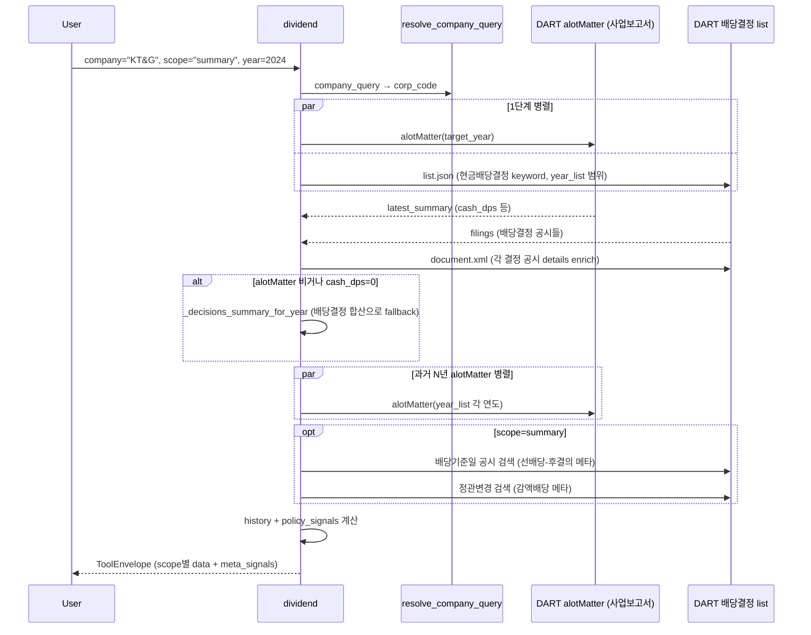

# dividend_disclosure

## 이름 (260902 개명)
`dividend` → **`dividend_disclosure`**. 같은 날 DB 기반 [[dividend_history_data]]·[[dividend_screener]]
가 생기면서 「dividend」라는 이름이 셋 중 어느 것인지 가리키지 못하게 됐다. 이 도구는
**공시 원문을 그때그때 열어 읽는 쪽**이다 — 그 성격을 이름에 담았다. 옛 이름의 사용통계는
`usage_tracker.TOOL_ALIASES` 가 접어 한 계열로 잇는다.

## 셋을 어떻게 가르나
| 도구 | 무엇 | DART 콜 |
|---|---|---|
| `dividend_disclosure` | 회사 하나를 실시간으로 깊게(결정공시·시가배당률·현재가 기준 수익률) | 있음 |
| [[dividend_history_data]] | 여러 해·시장·섹터 확정 시계열 | 0 |
| [[dividend_screener]] | 조건으로 회사 거르기 | 0 |

## 한 줄 요약
실지급·확정된 배당 사실 탭. DPS, 총액, 배당성향, 시가배당률, 연도별 추이. 미래 정책·약속은 다루지 않는다(그건 [[value_up]]).

## 사용법
```
dividend(
    company="KT&G",
    scope="summary",
    year=2024,
)
```

자연어 예시:
- "KT&G 2024 배당" → `scope="summary"` (DPS·배당성향·시가배당률 + 선배당-후결의·감액배당 신호)
- "작년 주당배당금·배당 총액 얼마였어?" → `scope="summary"` + `year` 지정
- "배당성향 추이 어때?" → `scope="history"` (N년 추이 + 분기 breakdown + policy_signals)
- "삼성전자 최근 배당 결정들" → `scope="detail"`
- "메리츠금융지주 최근 3년 배당 추이" → `scope="history"`

meta_signals 읽는 법:
- `pre_dividend_post_resolution`: 같은 I001 검색에서 걸러낸 주주명부폐쇄(기준일)결정 notice가 1건 이상이면
  True(신정관 선배당-후결의 가능성), 0건이면 False(전통 결산일=기준일 방식). [[배당기준일결정]] 참조.
- `capital_reserve_reduction`: True면 `capital_reserve_agendas`에 자본준비금 감소 관련 주총 안건 목록이
  함께 실린다 — [[감액배당결정]] cross-link. 감자(자본금 감소)와 혼동 금지.

## 입력 인자
| 인자 | 타입 | 필수 | 설명 | 기본값 |
|---|---|---|---|---|
| company | str | yes | 회사명 / ticker / corp_code | - |
| scope | str | no | 3종 (아래 참조) | "summary" |
| year | int | no | 사업연도, 0이면 최신 | 0 |
| years | int | no | history scope 누적 연수 | 3 |
| start_date / end_date | str | no | YYYYMMDD | "" |
| format | str | no | "md" / "json" | "md" |

scope:
- `summary`: 연간 DPS + 배당성향 + 시가배당률 + meta_signals (선배당-후결의, 감액배당) (기본)
- `detail`: 요약 + 최근 결정 50건 (md 렌더는 10건까지 표시, json 은 전부)
- `history`: 최근 N년 추이 (DPS / payout / yield / pattern)

## 출력 schema (data dict)
```json
{
  "company_id": "...",
  "summary": {"cash_dps": 1668, "cash_dps_preferred": null,
              "total_amount_mil": 11107906, "payout_ratio_dart": 25.1,
              "yield_dart": 1.5,
              "pre_dividend_post_resolution": false,
              "capital_reserve_reduction": false},
  "latest_decisions": [...],
  "policy_signals": {"trend": "...", "has_quarterly_pattern": true,
                     "has_special_dividend": false, "latest_change_pct": -3.2},
  "history": [{"year": 2024, "annual_dps": 1444, "decision_count": 4,
               "payout_ratio": 25.1, "yield_pct": 1.5, "pattern": "..."}],
  "no_filing": false,
  "filing_count": N,
  "usage": {"dart_api_calls": N, "mcp_tool_calls": 1}
}
```

핵심 필드:
- meta_signals: 선배당-후결의 (2024 신법), 감액배당 cross-link (자본준비금 감소)

> **분류·정확도 규칙**:
> - **분기별 누적차분** (`quarterly_full`, 최신연도): 분기/반기/사업보고서 누적값을 차분(Q2=반기-Q1…)해
>   보통+우선 DPS·배당총액 산출. 결정공시 버킷팅(경계 오귀속·예비결산 중복)보다 정확, 무배당 분기 0·특별배당 포착. [[배당공시유형]] §7.
> - **최신연도 4분류**: 중간배당 확정 / 확정 전(D 명부폐쇄 기준일 매칭) / 미공시(payer인데 결산 미확정) / 무배당(직전도 배당 없음). target연도 매칭으로 단정.
> - **미확정 시간판정**: "미공시(결산 배당 미확정)"은 해당 사업연도 정기주총 경과(today > 익년 5/31) 시 **"무배당(확정·결산 현금배당 없음)"**으로 정정 — 주총이 끝났는데 결정공시·기준일이 없으면 배당을 안 하기로 확정한 것(메리츠·SK증권=배당→자사주 소각 전환). 배당기준일 설정된 "확정 전"은 실제 배당신호라 유지. 근거: dividend-payout-classification-260717.
> - 권위 = 사업보고서 alotMatter **다년컬럼**(개별연도 호출 제거). per-decision 시가배당률은 0 억제(연간값 권위).
> - 상세 교훈은 private storage 에 있다(공개 wiki 에 없음).

## Data sources
- **DART API**: `alotMatter` (사업보고서, 1차 source), `현금ㆍ현물배당결정` 공시 합산 (alotMatter 비거나 cash_dps=0일 때 fallback)
- **KRX Open API**: 시세 fallback
- 외부 호출: summary 13회 (배당결정 공시 N건 본문), history 21회 (+ 분기교정)

## Flow



호출 횟수: summary 13회 (배당결정 공시 N건 본문, 최대 12), history 21회 (+ 분기교정 8).

## 파싱 전략 / source of truth

### 신뢰도 순위 (어떤 공시의 어떤 값을 믿는가)
1. **사업보고서 alotMatter `주당 현금배당금(원) · 보통주`** — 최우선, 연간 DPS·배당성향·시가배당률의 source of truth.
   - **최신 보고서 1회 응답의 당기/전기/전전기 컬럼**으로 최근 3개 사업연도를 한 번에 확보 (`_alot_multiyear_summaries`). 분기+결산이 이미 연간으로 합산돼 있고, 단일 출처·동일 기준이라 연도 간 일관. 자회사·정정 오염 없음. **문서 파싱 0회.**
   - 배당성향은 `(연결)현금배당성향(%)`, 시가배당률은 `현금배당수익률(%) 보통주` 컬럼 사용.
   - ⚠️ `주당 현금배당금` 행이 보통주 뒤에 **빈 행(stock_type="-")**으로 한 번 더 오면, 빈 값("-"→0)이 실제값을 덮어쓴다 → "보통주 명시 or 값>0"일 때만 반영 (메리츠금융지주·셀트리온·에이피알 케이스).
   - ⚠️ 최신 사업연도는 보고서 확정 전까지 컬럼이 "-"일 수 있음(선배당-후결의·미확정) → 그 해만 결정공시 fallback.
2. **현금ㆍ현물배당결정 거래소공시 (XML 본문 파싱)** — 보조.
   - 용도: (a) **분기별 breakdown** (alotMatter엔 분기 분해 없음), (b) alotMatter 빈 신규/최신연도 **fallback**, (c) 분기/연간 **패턴 판정**.
   - 합산 시 필수: **자회사(`자회사의 주요경영사항`) 제외** (지주사 DPS 과대계상 주원인) + **정정/재공시 dedup** (`_effective_decisions`, `(사업연도,분기,기준일)` 최신 1건).
   - ⚠️ 연간 **합산** 신뢰도 낮음: 결산배당이 기지급 분기를 차감한 "잔액"으로 적히는 등 단순 합이 실제 연간과 다름 → 연간 수치는 항상 alotMatter(1) 우선.
3. **연도별 alotMatter 개별 호출** — **지양**. 특정 연도 단독 호출은 배당성향/수익률만 있고 DPS=0을 반환하는 경우가 있음(KB금융 2023 단독 호출). (1)의 다년 컬럼으로 대체.

### 타겟팅 (cap 방식 아님)
- 검색: 기간(`bgn_de`/`end_de`) + 공시유형 `I001` (서버) → 제목 `"배당결정"` 포함 + `"자회사"` 제외 (클라이언트, DART가 제목 서버검색 미지원).
- 거른 집합이 곧 "그 기간 모회사 배당결정 공시 전부"라 양이 작다(분기배당사 ~연 4건). **임의 cap 없이 타겟된 공시만 파싱** — 구버전 raw `[:20]` 절단(오래된 연도 통째 누락) 제거.

- [기재정정] dedupe (board_date+amount+shares 키)
- 정책 예측·미래 약속 추가 금지 (그건 `value_up`)
- regression 0 검증: 200기업 audit `dividend.summary` 75.0% exact (147/196), no_filing 24.0% (47건, KOSDAQ 무배당 정상). 21지표 audit 통과.

## 관련 공시 (rules/disclosures/)
- [[현금배당결정]] — DPS / 기준일 / 시가배당률 (1차 source)
- [[주식배당결정]] — 1주당 배당주식수
- [[배당기준일결정]] — 선배당-후결의 시그널 (2024 신법)
- [[분기배당결정]] — 연간 DPS = 1Q+반기+3Q+결산
- [[감액배당결정]] — 자본준비금 감소 → 이익잉여금 전입 → 배당 (cross-link)
- [[배당공시유형]] — 배당 6종 통합 인덱스
- [[사업보고서]] — alotMatter 배당 요약

## 관련 개념 (rules/concepts/)
- [[배당성향]] — 배당금 총액 / 지배주주 귀속 당기순이익
- [[배당수익률]] — 주가 대비 배당금 비율
- [[시가배당률]] — DART 공식 (배당기준일 전전거래일 1주 평균)
- [[분기배당]] — 분기별 중간배당, DPS 합산 주의
- [[특별배당]] — 일회성, 추이 분석 시 정기와 분리
- [[감액배당]] — 자본준비금 감소 후 이익잉여금 전입
- [[자본준비금]] — 감액배당 전제 조건
- [[당기순이익]] — 배당성향 분모 (연결 지배주주 귀속)
- [[주주환원]] — 배당·자사주를 아우르는 상위 개념

## 관련 결정 (decisions/)
- [[배당공시유형]] — 배당 9종 + 자사주 5종 + 2026.03 신법 통합 비교
- [[DART-KIND-매핑-화이트리스트-2026-04]] — KIND whitelist 정책
- [[cross-domain-체이닝]] — DIV → VUP / TRS 체이닝

## 관련 audit/fix (architecture/)
- 260429_0912_audit_parsing-200기업-v2-no_filing — dividend.summary 75.0% exact
- 260429 asyncio.gather 병렬화(3x) — 분석문은 storage `wiki-private/archive/opm-decisions/` 이관
- 21개 산술 지표 검증 기록: private storage

## 알려진 issue + TODO
- alotMatter와 거래소 공시 수치 충돌 시 `requires_review`.
- 특별배당 비정형 금액 구조 → `requires_review`.
- 시가배당률 비고 + 가격 fallback 실패 시 `requires_review`.
- 이항(우선주) 배당은 `cash_dps_preferred`로 별도 노출.
- **선배당-후결의(2024 신법) 회사**(예: 메리츠금융지주): 금액이 든 `현금ㆍ현물배당결정` 거래소공시 없이 `주주명부폐쇄 기준일설정`만 하고 주총/사업보고서로 확정하는 케이스가 있다. 최신 사업연도가 결정공시·alotMatter 모두 비면 → (2026-06-08 개선) `pre_dividend_post_resolution` 신호가 True 일 때 history 패턴을 `무배당` 대신 **`확정 전 (배당기준일 설정·금액 미정)`** 으로 표기하고 `pending_confirmation:true` + warning 부착. 추세(policy_signals)는 확정 연도만으로 계산해 미확정 연도의 DPS=0 이 −100% 로 왜곡하는 것 방지. 진짜 무배당(신규상장 등 기준일 공시 자체가 없음)은 신호 False 라 그대로 `무배당`(에이피알 검증).

## 변경 이력
- 2026-08-06: 검증 서사를 private storage 로 이관(경계 규칙 [[wiki_schema]] 0.0).
  폐기된 `cash_shareholder_return`·`total_shareholder_return` scope 잔재 제거 —
  현재 scope 는 `summary`/`detail`/`history` 셋이다.
- 2026-07-17: "미공시(결산 배당 미확정)" 의 주총 경과 시간판정 → "무배당(확정)".
- 2026-06-09: 분기별 누적차분(`quarterly_full`) + 최신연도 4분류.
- 2026-06-08: 연간 DPS/배당성향/수익률 source 를 **alotMatter 다년 컬럼**
  (`_alot_multiyear_summaries`)으로 전환 — per-year 개별 호출·결정공시 합산 의존 제거.
  자회사 공시 제외 · 정정/재공시 dedup · raw `[:20]` 절단 제거 · `주당 현금배당금` 빈 행
  overwrite 수정 · 선배당-후결의 `확정 전` 표기 + `pending_confirmation` · history 정합성 경고.
- 2026-05-01: tool wiki 페이지 작성.
- 2026-04-29: CSR 분자 정정(retire → acquire) · 200기업 audit 75.0% exact.
- 2026-04-18: tool 검증 + release_v2 go.
