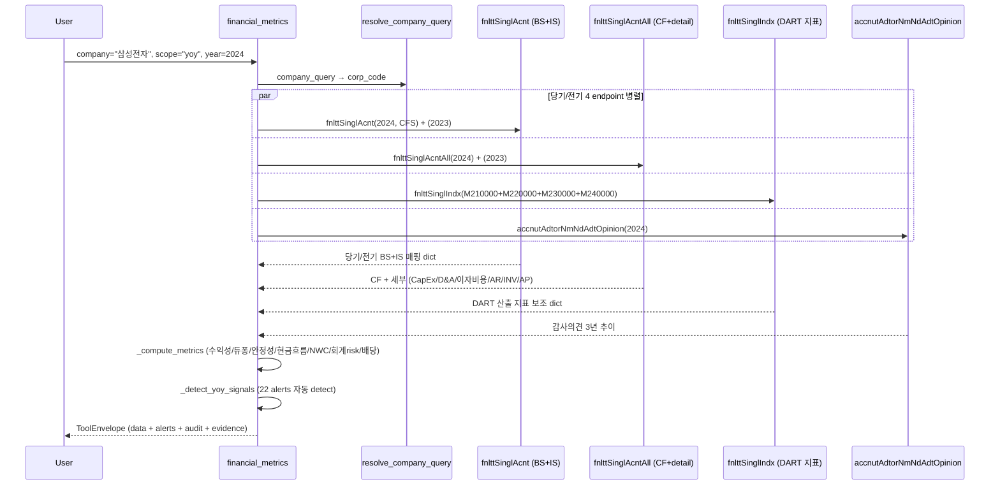

# financial_metrics

## 한 줄 요약
DART 재무 4 endpoint 통합 — 수익성/안정성/현금흐름/운전자본 회전일수/회계 risk 지표. 한국 표준(연결, 지배주주 귀속). 듀퐁 3단 분해, FCF, NWC, CCC, accruals_gap, 감사의견 추이 자동 산출.

## 사용법
```
financial_metrics(
    company="삼성전자",
    scope="yoy",
    year=2024,
)
```

자연어 예시:
- "롯데케미칼 2024 yoy 분석" → `scope="yoy"` → operating_loss + interest_coverage_low + negative_fcf alerts
- "SK하이닉스 turnaround 검증" → `scope="yoy"` → turnaround alert
- "삼성전자 듀퐁 분해 + ROE 구성" → `scope="summary"` → ROE 13.07% = 16.63% × 0.62 × 1.27
- "오스템임플란트 5년 감사의견" → `scope="audit_opinion"`

## 입력 인자
| 인자 | 타입 | 필수 | 설명 | 기본값 |
|---|---|---|---|---|
| company | str | yes | 회사명 / ticker / corp_code | - |
| scope | str | no | 6종 (아래 참조) | "summary" |
| year | int | no | 사업연도, 0이면 최신 완료 사업연도 | 0 |
| years | int | no | yearly/audit_opinion 누적 연수 | 3 |
| consolidated | bool | no | True=CFS(연결, 한국 표준), False=OFS(별도) | True |
| format | str | no | "md" / "json" | "md" |

scope:
- `summary`: 1 사업연도 56개 핵심 지표 (수익성/듀퐁/안정성/현금흐름/운전자본/회계risk/배당유보/NAV)
- `yearly`: 최근 N년 추이 (revenue/op_profit/net_income/OPM/ROE/debt_ratio/CFO/FCF)
- `quarterly`: 최근 12분기 추이 (4Q × 3년 — Q1/Q2 반기/Q3/Q4 사업)
- `yoy`: 전년 대비 + 22개 alerts + 감사의견 cross-check
- `qoq`: 전분기 대비 (operating_loss_quarter / revenue_decline_qoq alerts)
- `audit_opinion`: 감사의견 3년 추이 (적정/한정/부적정/감사인 변경 추적)

## 출력 schema (data dict)
```json
{
  "company_id": "cmp_005930",
  "scope": "summary",
  "year": 2024,
  "fs_div": "CFS",
  "consolidated": true,
  "summary": {
    "revenue_krw": 300870903000000,
    "operating_profit_krw": 32725961000000,
    "operating_margin_pct": 10.88,
    "net_income_krw": 50048199000000,
    "ebitda_krw": 32725961000000,
    "ebitda_margin_pct": 10.88,
    "roe_pct": 13.07, "roa_pct": 10.31, "roic_pct": 6.15,
    "asset_turnover_ratio": 0.62, "equity_multiplier": 1.27, "roe_dupont_pct": 13.07,
    "debt_ratio_pct": 27.93, "current_ratio_pct": 243.30,
    "interest_coverage_ratio": 2.52, "net_cash_krw": 40518545000000,
    "total_debt_krw": 25240000000000, "total_debt_confidence": "MED",
    "short_term_debt_krw": 18750000000000, "long_term_debt_krw": 6490000000000,
    "convertible_debt_krw": null, "lease_liabilities_krw": null,
    "total_debt_incl_lease_krw": 25240000000000, "hybrid_capital_krw": null,
    "debt_dependency_pct": 4.45, "debt_dependency_status": "computed",
    "is_financial_company": false,
    "borrowing_detail": {"by_canonical_id": {"OPM_ST": 17570000000000, "OPM_LT": 6480000000000},
      "convertible_included": false, "conflicts": [], "reviews": [],
      "data_quality_flags": [], "no_borrowing_rows": false},
    "cfo_krw": 72982621000000, "capex_krw": 51406355000000,
    "fcf_krw": 21576266000000, "fcf_margin_pct": 7.17,
    "cfo_to_op_ratio": 2.23, "cfo_to_net_income_ratio": 1.46,
    "working_capital_krw": 133735967000000, "nwc_krw": 83007761000000,
    "nwc_change_yoy_krw": 6054318000000, "nwc_to_revenue_pct": 27.59,
    "days_sales_outstanding": 52.9,
    "days_inventory_outstanding": 88.1,
    "days_payable_outstanding": 42.4,
    "cash_conversion_cycle_days": 98.6,
    "accruals_gap_pct": -123.01,
    "ar_to_revenue_pct": 14.50, "inv_to_revenue_pct": 17.20,
    "dividend_paid_krw": 10888749000000, "payout_ratio_pct": 21.76,
    "retained_earnings_krw": 370513188000000, "nav_krw": 402192070000000,
    "eps_krw": 4950, "diluted_eps_krw": 4950
  },
  "yoy": {"current": {...}, "prior": {...}, "alerts": ["accruals_red", "nwc_efficiency_low"],
          "audit_opinion": {"current": {...}, "prior": {...}}},
  "audit_opinion": {"opinions": [{"stlm_dt": "2024-12-31", "adt_opinion": "적정의견",
                                  "adtor": "삼정회계법인", "core_adt_matter": "..."}],
                    "summary": {"latest_opinion": "적정의견", "all_clean": true}},
  "no_filing": false, "filing_count": 1,
  "usage": {"dart_api_calls": 12, "mcp_tool_calls": 1}
}
```

핵심 필드:
- **단위 처리**: 모든 금액 raw KRW int (`_krw` suffix), %는 float (`_pct` 11.5 = 11.5%), 비율은 decimal (`_ratio` 0.85). render에서만 조/억 변환.
- **연결 default**: 한국 표준 = 연결 지배주주 귀속. `consolidated=False` 옵션으로 별도 가능.
- **분모 0/음수 graceful**: 적자 회사 ROE/배당성향 → None + warning. 분모 음수일 때 산출 안 함.

## yoy_signals (25개 alerts)
- **수익성**: `loss_conversion`, `operating_loss`, `turnaround`, `continued_loss`, `revenue_decline`
- **부채/유동성**: `debt_surge`, `interest_coverage_low`
- **자본잠식 (KOSDAQ 관리/폐지 사유)**: `capital_impairment_partial` (잠식률 0~50%), `capital_impairment_50plus` (50%+, KOSDAQ 관리종목 사유), `capital_impairment_full` (완전 자본잠식, 상장폐지 사유)
- **현금흐름**: `cfo_quality_red`, `negative_fcf`, `low_dividend_capacity_use`
- **운전자본**: `nwc_surge`, `nwc_efficiency_low`
- **듀퐁 분해**: `roe_driven_by_leverage`, `roe_decline_margin_driven`, `roe_decline_turnover_driven`
- **회계 risk**: `accruals_red`, `receivables_surge`, `inventory_surge`
- **감사의견**: `non_clean_audit_opinion`, `audit_opinion_change`
- **배당**: `dividend_halt`

### 자본잠식 정의 (한국 상법/거래소 기준)
- **자본금**: 발행주식수 × 액면가 (회사 설립 + 증자로 들어온 원금)
- **자본총계**: 자본금 + 자본잉여금 + 이익잉여금 (현재 회사가 보유한 순자산)
- **자본잠식**: 누적 적자로 이익잉여금이 음수가 되어 자본총계가 자본금보다 작아진 상태
- **잠식률**: (자본금 - 자본총계) / 자본금 × 100
- **trigger**:
  - 잠식률 50%↑ + 2년 연속: KOSDAQ 관리종목 지정
  - 완전 자본잠식 (자본총계 ≤ 0): KOSDAQ 상장폐지 사유 (KOSPI는 사업보고서 미공시 등 다른 trigger)

## Data sources
- **DART API 4 endpoint**:
  - `fnlttSinglAcnt` (단일회사 주요계정) — BS 9 + IS 5 = 14 핵심 행. 당기/전기/전전기 3년 단일 호출.
  - `fnlttSinglIndx` (주요 재무지표) — DART 산출 ROE/부채비율/EPS 등. idx_cl_code 4 그룹 (수익성/안정성/성장성/활동성) × 4 호출.
  - `fnlttSinglAcntAll` (전체 재무제표) — 213 행 (BS/IS/CIS/CF/SCE). CapEx, 감가상각비, 이자비용, 매출채권/재고/매입채무 추출.
  - `accnutAdtorNmNdAdtOpinion` (회계감사인+의견) — 6 행 (3년 × CFS+OFS). 감사인 / 적정의견 / 강조사항 / 핵심감사사항(KAM) / rcept_no.
- 외부 호출: scope별 최대 12회 (일반 7회). reprt 폴백 + TTM + 당기분해 포함. quarterly scope는 ~24회.

## Flow



호출 횟수: scope별 최대 12회 (일반 7회). quarterly scope는 ~24회로 가장 많음. audit_opinion만은 1회.

## 파싱 전략
- **account_nm 매칭**: 표준 키워드 패턴 9 BS + 5 IS + 13 detail (CF/Detail). 공백 무관 + 부분 일치.
- **총차입금 = account_id 전체명 정확매칭**(`_compute_borrowings`, 260713): 차입금·사채는 account_nm
  키워드가 아니라 account_id local-name(casefold) 정확매칭 사전(`_BORROW_ID_MAP`)으로 잡는다. 비표준
  코드(`-표준계정코드 미사용-`)만 account_nm 전체명 사전(`_BORROW_NM_MAP`) 폴백. sum-all(first-match
  break 없음) → 유동성장기차입·전환사채·비유동차입 누락 제거. **자체 canonical id**: OPM_ST(단기)·
  OPM_LT(장기)·OPM_LT_CURR(유동성장기)·OPM_BOND/OPM_BOND_CURR(사채)·OPM_CONV(전환·BW·EB)·
  OPM_BORROW(일반)·OPM_COMBINED. Loans*Net·LoansAtAmortisedCost(대출채권 **자산**)·매입채무는 명시배제,
  id↔nm 모순=CONFLICT·미등록=REVIEW로 표면화(합산 제외). 리스부채(IFRS16)·신종자본증권(자본)은 별도
  필드. 금융사(연결 BS 예수부채·보험계약부채·고객예탁금 정확매칭 — 예수금 제외)는 debt_dependency=None
  (`status="n/a_financial"`); 일반지주(SK·LG 등, 예수부채 없음)는 정상 산출. KOSDAQ 소형주 '채무'·'유동화'
  표기변형(유동성장기차입채무·유동화채무)은 nm 정확매칭+토큰 안전망으로 흡수(298사 2룹 검증). 근거:
  financial-metrics-borrowings-260713.
- **금액 정규화** (`normalize_amount`):
  - 콤마 strip ("227,062,266,000,000" → 227062266000000)
  - 괄호 음수 ("(500)" → -500, T19 fix 패턴)
  - None / "-" / "" → None graceful
- **DART 응답 단위**: 표준 = 원 raw int, 일부 KOSDAQ은 백만원 단위 (`_unit` 메타로 자동 곱셈 — Phase 2)
- **연결 지배주주 귀속**: detail에 `controlling_interest_income` 있으면 우선 사용, 없으면 `당기순이익(손실)` 합계 fallback
- **평균자산/평균자본**: 당기 + 전기 BS 평균. 전기 데이터 없으면 기말 단독.
- **ROIC 근사**: NOPAT = 영업이익 × (1 - 0.22 평균법인세). 투하자본 = 자본 + 총차입.
- **DuPont 검증**: ROE = 순이익률 × 자산회전율 × 재무레버리지. roe_pct vs roe_dupont_pct 일치 확인용.
- **운전자본 회전일수**: DSO=평균 매출채권/매출액×365, DIO=평균 재고/매출원가×365, DPO=평균 매입채무/매출원가×365, CCC=DSO+DIO-DPO. 분모가 없거나 0 이하이면 None.
- **배당성향 = DART 현금배당성향(귀속)**(`_accrual_payout_pct`, 260716): 분자로 CF '배당금지급'(현금
  유출 타이밍·연결 전체)을 **쓰지 않는다** — 대개 전년 결산배당이 그해 지급된 것이라 당해 순이익과
  연도·주체(지배 vs 지배+비지배)가 어긋난다. 대신 dividend 툴의 alotMatter 다년 로직을 재사용해 DART
  사업보고서 '현금배당성향(%)'(연결 우선)을 **연간보고서에서만 연도 key 조인**으로 주입(dividend 툴과
  SSOT 일원화). 무배당/미기재/미확정 연도는 None. CF `dividend_paid_krw`는 배당/FCF(현금 coverage)
  지표 전용. 근거: financial-metrics-payout-260716.
- **REIT 배당성향 억제**(`_is_reit`+`_accrual_payout_pct(is_reit=)`, 260717): 이름에 '리츠' 있으면
  `payout_ratio_pct=None` + `payout_ratio_note`("DPS·시가배당률 참고"). REIT는 배당가능이익≥90% 분배라
  순이익 대비 성향이 100~2000%·음수로 무의미(404사 스캔: 미래에셋글로벌리츠 421%·이지스밸류 −415%).
  KSIC(68)는 부동산 개발사(SK디앤디·자이에스앤디 정상 성향)까지 잡아 과억제하므로 **이름 판정**. 근거:
  dividend-payout-classification-260717.

## 관련 공시 (rules/disclosures/)
- [[사업보고서]] — fnlttSinglAcnt 1차 source (연간)
- [[반기보고서]] — reprt_code=11012
- [[분기보고서]] — reprt_code=11013(1Q) / 11014(3Q)

**확정치 vs 잠정치**: 이 tool은 정기보고서 **확정치**(감사 후). 분기말 직후 **잠정** 실적이 필요하면 [[provisional_earnings]](영업잠정실적 공정공시 — 확정보다 ~40일 빠름, 감사 전).

## 관련 개념 (rules/concepts/)
- [[당기순이익]] — 한국 표준 = 연결 지배주주 귀속
- [[배당성향]] — 배당총액 / 지배주주 귀속 당기순이익
- [[ROE]] / [[ROA]] / [[ROIC]] — 수익성 3대 지표
- [[듀퐁분석]] — ROE = 순이익률 × 자산회전율 × 재무레버리지
- [[FCF]] — Free Cash Flow = CFO - CapEx
- [[NWC]] — 순운전자본 = 매출채권 + 재고 - 매입채무
- [[이자보상배율]] — 영업이익 / 이자비용
- [[순현금]] — 현금성자산 - 총차입금

## 관련 결정 (decisions/)
- [[open-proxy-guideline]] — 재무 risk 신호 (이자보상배율, FCF 음수 등) 채점에 사용
- [[cross-domain-체이닝]] — financial_metrics → vote_brief / corp_gov_report 체이닝 (Phase 2)

## 관련 audit/fix
- [[260501_2030_audit_financial_metrics-200기업]] — 6기업 sanity부터 200기업 전수까지 통합한 기준 문서

## 알려진 issue + TODO
- 일부 KOSDAQ 회사 백만원 단위 보고 — `_unit` 메타 자동 곱셈 (Phase 2)
- 감가상각비 (CF "비현금항목 가산") 패턴 일부 회사에서 매칭 안 됨 → EBITDA = 영업이익으로만 산출되는 케이스
- 이자비용 vs 금융비용 모호 — 일부 회사 금융비용에 환차손 포함 → 이자보상배율 underestimate
- 발행주식수는 별도 호출 필요 (BPS 산출 — Phase 2 stockTotqySttus 통합)
- vote_brief / 매트릭스 dim 자동 채점 통합 — **Phase 2 별도**

## 자본잠식 — 계산식은 한 곳에 있다 (260808)

`compute_capital_impairment()` 가 **유일한 자리**다. 종전에는 `_compute_metrics` 안에 인라인으로
박혀 있어, 소집공고 잠정치 경로를 붙이려면 복사할 수밖에 없었다.

자기자본을 구하는 순서(`capital_impairment_basis` 로 남긴다):

| basis | 뜻 | 문장 |
|---|---|---|
| `controlling` | 지배지분 계정을 직접 읽음 | 「지배주주 귀속 자기자본」 |
| `derived` | **자본총계 − 비지배지분** | 「…(자본총계에서 비지배지분을 빼 산출)」 |
| `total` | 둘 다 없음 — 별도재무제표이거나 연결인데 구분 표시가 없음 | 별도/미확인을 갈라 씀 |

`derived` 가 없으면 지배지분 소계를 안 적는 회사(실측 고려아연·비덴트·미래에셋증권)에서 자본총계로
물러나 **비지배 몫만큼 자기자본이 부풀고, 규정이 금지한 바로 그 과소 산정**이 된다. 그러려면
비지배지분이 필요해 `ifrs-full_NoncontrollingInterests` **정확 매칭**으로 뽑는다(접두로 보면 다른
개념에 올라탄다 — 260704 `ifrs-full_Liabilities` 사고). 한글 폴백에는 KT&G 형 부채행 차단을 함께
둔다 — 연결 BS 는 부채 섹션의 「비지배지분부채」가 자본 섹션의 「비지배지분」보다 **앞**이라 막지
않으면 8.7배 틀린 값을 집는다.

**문장이 basis 를 읽어야 한다.** 읽지 않으면 자본총계로 물러난 경우에도 「지배주주 귀속
자기자본 0 이하」라고 쓰게 된다 — 별도재무제표에서는 우연히 참이지만 연결 폴백에서는 재지 않은
것을 쟀다고 말하는 것이다. 두 경우는 읽는 쪽에 뜻이 정반대다(별도는 정상, 연결 폴백은 「규정
기준이 아닐 수 있다」는 신호).

계정 매칭에는 계정별 배제를 둔다. 부분문자열이라 「유동자산」⊂「비유동자산」, 「자본총계」⊂
「부채및자본총계」(=자산총계), 「자본금」⊂「우선주자본금」이 서로 올라탄다. 지금 안 터지는 유일한
이유는 DART 가 표준 순서로 주고 첫 매칭이 이기기 때문이라, 순서에 기대지 않도록 명시한다.
자본금이 종류주별로만 적힌 표는 합산한다(부모 행이 있으면 그것 — 다 더하면 2배가 된다).

## 변경 이력
- 2026-08-08: 자본잠식 계산식 단일화(`compute_capital_impairment`) + 차감 산출(`derived`) 신설 +
  비지배지분 추출 + 계정 충돌 배제 (위 절).
- 2026-08-06: 감사 서사·표본 규모·발견 경위를 private storage 로 이관(경계 규칙 [[wiki_schema]] 0.0).
- 2026-07-17: REIT 배당성향 억제(`payout_ratio_pct=None` + 안내, 이름 '리츠' 판정).
- 2026-07-16: `payout_ratio_pct` 를 CF 현금지급 → DART 현금배당성향(귀속)으로 교체
  (`_accrual_payout_pct`, dividend 툴과 SSOT 일원화). CF `dividend_paid_krw` 는 배당/FCF 전용.
- 2026-07-13: 총차입금을 account_id 전체명 정확매칭으로 이관(`_compute_borrowings`) +
  금융사 판별에 KSIC 2차 신호 결합.
- 2026-06-12: quarterly/qoq standalone 차분(Q4 = 연간 − Q3 누적) + QoQ·YoY 기본 동봉 ·
  분기합↔연간 정합 gap flag(손익 3개 키) · 이자보상 분모를 CF '이자의 지급' 으로 · EBITDA 는
  D&A 추출 시에만 산출 · `_safe_fetch_acnt` fs_div 행 필터.
- 2026-05-31: 운전자본 회전일수 4종(DSO/DIO/DPO/CCC) + CFO/순이익 추가(추가 API 호출 없음).
- 2026-05-01: tool 신규 (DART 4 endpoint + 6 scope + 22 alerts).
