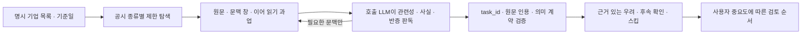

# governance_screen

## 한 줄 요약

명시한 기업들의 공시를 읽을 과업을 만들고, 호출 LLM이 제출한 근거와 평가를 수용해 거버넌스 검토 순서를 반환한다. 원문 읽기와 판단은 LLM이 맡고, 서버는 현재 자료와의 연결·인용·입력 계약·중요도에 따른 경로를 검증한다. **LLM 평가 · 사람 미검토** 파일럿이며 찬반 권고나 실제 투표를 실행하지 않는다.

## 입력 인자

| 인자 | 타입 | 필수 | 설명 | 기본값 |
|---|---|---|---|---|
| companies | list[str] | yes | 회사명·종목코드·DART 회사코드 1–30개. 빈 값과 중복 질의 불가 | — |
| as_of | str | no | YYYYMMDD. 기준일 당일 공시 포함. 장중 공시 순서는 미검증 | 오늘 KST |
| governance_assessments | list[dict] | no | 첫 호출의 현재 task_id와 원문으로 LLM이 작성한 회사별 평가, 최대 30개 | null |
| evidence_sources | list[dict] | no | `{company: companies에 사용한 문자열, sources: [...]}` 회사별 추가 원문 묶음, 최대 30묶음·회사당 5건 | null |
| review_materiality | str | no | `high`, `moderate`, `low`. 검토 대상으로 올릴 우려의 중요도. 근거·우려 자체를 제거하지 않음 | moderate |
| since | str | no | 새 공시 목록의 시작일 YYYYMMDD, 양끝 포함. 평가용 원문 검색 기간은 바꾸지 않음 | "" |
| known_receipts | list[str] | no | 이미 본 14자리 접수번호 최대 10,000개. 새 공시 목록에서 제외 | null |
| format | str | no | `md`, `json` | md |

추가 원문은 `type: dart`와 `rcept_no`, 또는 `type: kind`와 고정 `https://kind.krx.co.kr/external/.../*.htm` 주소를 받는다. 임의 URL은 받지 않는다. 선택 인자는 `source_scope`(`candidate`, `company_context`, `agenda_context`), `focus_terms`(최대 6개), `text_offset`(0–2,000,000), `text_chars`(1,000–30,000, 기본 12,000)이다. 공통 원문 읽기 계약은 [[proxy_advise_before_meeting]]과 공유한다.

## 사용 흐름

1. `governance_screen(companies=["대상 회사"], as_of="YYYYMMDD", format="json")`을 호출한다.
2. `companies[].assessment_task`의 원문을 읽는다. 회사 이름·공시 제목만으로 진영이나 위험을 판단하지 않는다.
3. 중요한 문맥이 잘렸으면 `sources[].read_next.source_request`나 `focus_terms`로 필요한 창을 지정한다. `evidence_sources`에 현재 필요한 요청을 유지하고 추가·교체한다. 새 창은 task_id도 바꾸므로 새 과업으로 판단한다.
4. `assessment_schema`에 맞게 판단과 literal 원문 인용을 작성해 같은 조회 인자와 `governance_assessments`로 재호출한다.
5. 모르는 항목은 `skipped_checks`에 표시하고 나머지 회사·항목을 계속한다. 같은 기업에 대한 잘못된 제출은 해당 기업만 재평가한다.

서버 안에서 LLM을 호출하거나 모델 신원을 인증하지 않는다. `evaluator`는 호출자가 기재한 출처이며, 모든 수용 결과는 사람 미검토다.

## 출력 및 평가 계약

`companies[]`는 회사 식별·원천 조회 상태, `assessment_task`, 수용된 `assessment`, `triage`, `delta`를 각각 제공한다. 최상위 `submission_errors`는 잘못된 개별 입력, `unmatched_task_ids`는 현재 과업과 연결되지 않은 평가다. 같은 task_id의 중복 제출은 해당 task만 무효화한다. 추정에 의한 회사명 매칭은 최상위 `warnings`와 Markdown 상단에 표시한다.

회사를 확정하지 못한 행은 공통 회사 식별 규약의 `warnings`·`next_action`을 반환한다. 후보가 여러 개인 경우 `candidates`와 재조회 안내를, 찾지 못한 경우 사명 변경·종목코드 재조회 안내를 JSON과 Markdown에 함께 표시한다. 다른 회사의 과업 생성은 계속한다.

과업은 회사 식별, 기준일, 중요도 설정, 탐색 범위·성공 여부, 모든 선택 원문의 전체 문서 해시와 읽기 창을 묶어 식별한다. 일부 인용만 같아도 원문이나 과업이 바뀌면 예전 평가는 수용하지 않는다. 원문별 ID·URL·공개일·본문 해시·읽은 구간·부분 읽기 여부·다음 읽기 요청을 제공한다. 문맥 창 사이에서 생략한 내용을 넘어 인용을 합칠 수 없다.

평가는 `task_id`, `evaluator`, `summary`, `findings`, `skipped_checks`를 가진다. `findings` 항목은 다음을 구분한다.

| 축 | 필드와 의미 |
|---|---|
| 검토 주제 | `category`: 소수주주 대우, 이해상충, 이사회 책임, 공시 신뢰성, 경영권 관련 절차, 기타 |
| 판단 | `disposition`: `supported_risk`, `no_adverse_signal`, `unresolved` |
| 중요도 | `materiality`: high / moderate / low. 숫자 점수나 모델 확률을 만들지 않음 |
| 당사자·사건 | `actor`, `event`, `event_date`, `case_or_round`, `relevance`, 선택 `candidate_name` |
| 사실 성격 | `observation`, `fact_status`: 공시된 사실 / 당사자 주장 / 법원 판단 / 조건부 계획 / 미상 |
| 절차 | `procedural_state`: 혐의·주장, 신청·제기, 진행 중, 잠정적 결정, 최종 판결, 불복, 합의·종결, 취하·철회 등 |
| 영향·지분 | `impact_state`: 관찰/장래/미상, `ownership_basis`: 계약/결제/미상, `voting_rights`: 확인/미상/비대상 |
| 우려의 근거 | `risk_basis`, `rationale`, `evidence_refs`, `counterevidence`, `gaps` |

공개매수·행동주의·소송의 존재만으로 `supported_risk`를 제출하면 거부한다. 구체적인 행위와 영향을 설명해야 한다. 당사자 주장이나 미확인 사실을 확정된 우려로 승격하지 않으며, 조건부 계획을 완료 사실로, 신청을 법원 판단으로, 계약 지분을 확정 의결권으로 바꾸는 조합도 거부한다. 이 검증은 모든 문장의 진위를 자동 증명하지 않으므로 의미 해석과 중요도는 사람 미검토로 유지한다.

`no_adverse_signal`은 **그 항목에서 읽은 범위**에 대한 판단이다. 평가하지 않은 주제는 자동으로 `implicit_skipped_checks`에 남는다. 자료가 없다는 사실을 무위험으로 바꾸지 않는다. `gaps.kind`는 미기재·문맥 잘림·조회 실패·근거 충돌·동일성 미확인·미평가를 구분한다. 날짜가 없더라도 원문에 명시된 역할 자체를 버리지 않는다.

## 검토 순서

| triage.disposition | 조건과 해석 |
|---|---|
| priority_review | 선택한 중요도 이상인 근거 있는 우려 중 high 존재 |
| review | 선택한 중요도 이상인 근거 있는 우려 존재 |
| needs_evidence | 기준 이상 중요도의 사실 충돌·동일성 미확인이 있음. 위험 확정과 구분한 후속 확인 |
| monitor | 근거 있는 우려가 있으나 사용자가 지정한 검토 중요도보다 낮음 |
| no_adverse_signal_in_reviewed_scope | 평가한 일부 항목에서 불리한 신호 미확인. 회사 전체 무위험 판정 아님 |
| not_assessed | 수용된 평가 또는 평가 가능한 결론이 아직 없음 |

확인된 우려는 다른 항목의 자료 누락 때문에 제거되지 않는다. 보통의 자료 누락은 `needs_evidence`를 자동 발생시키지 않는다. 중요한 충돌이 있더라도 다른 회사나 다른 판단을 멈추지 않는다. 모든 결과에 `scope_complete: false`, `human_reviewed: false`, `ballot_action: none`을 유지한다.

## 반복 호출과 증분 조회

`since`와 `known_receipts`는 발견된 접수번호 목록만 좁힌다. `delta.items`는 신규·정정 등 새 접수번호 메타데이터이고, 정정 전후의 실질 변경은 원문을 대조해야 한다. `delta.checkpoint.receipt_ids`에는 기존 알려진 번호와 이번 발견 번호를 함께 보존한다. 부분 조회·일시적 실패가 기존 checkpoint를 지우지 않는다.

checkpoint는 최신 10,000개 번호를 보존하고 초과분은 `older_receipts_not_in_checkpoint`에 표시한다. 초과가 있으면 호출자가 원래 기록을 별도로 유지하거나 `since`를 사용해 이전 공시의 재등장을 제어한다. 서버는 조회 결과나 checkpoint를 저장하지 않는다. 예약 작업도 만들지 않는다. 다음 호출 시기와 checkpoint 보존은 호출자가 정한다.

## 외부 호출과 한계

- 시장 전체 검색을 하지 않는다. 회사별 최근 365일, D004·D003·D001·I001·B001·E006·E001·E002 8개 상세유형을 먼저 지정하고 유형당 최대 2쪽을 읽는다. 최대 목록 호출 16회, 자동 선택 원문 4건이다. 요청한 추가 원문은 최대 5건이다.
- 최대 30개사를 **회사별 순차** 처리한다. 각 회사 내부 목록 탐색은 공통 DART 제한과 캐시를 사용한다. 같은 머신의 KIND 고정 원문은 공통 웹 제한을 적용한다. 회사 식별에 필요한 호출은 추가될 수 있다.
- 주총 사전 판단과 달리 이 도구는 회사 현황 검토이므로 기준일 당일 공시 및 주총결과를 포함한다. `same_day_time_unverified`와 탐색의 `temporal_scope`를 표시한다. 과거 장중 상황을 재현했다고 주장하지 않는다.
- 자동 탐색은 제한된 사건 공시 중심이며 사업·반기·분기보고서의 모든 지배구조 정보를 포괄하지 않는다. 필요한 공시를 추가 원문으로 읽는다. 목록·원문 선택 예산, 미선택 문서, 조회 실패, 잘린 문맥이 모두 남는다.
- 모든 회사의 지배구조 위험을 완전 탐지하거나 기관투자자의 실제 보팅 정확도를 검증한 도구가 아니다. 여러 공시의 조건·회차·관계·후속 사건을 연결해 읽는 호출 LLM 과업과 수용 계약이다.

## 변경 이력

- 2026-09-10: 운영 main의 공통 회사 식별 안내를 연결. 모호한 후보·변경 사명·다음 조회 경로를 두 출력 형식에 보존하며 배치 내 다른 회사는 계속 처리한다.

- 2026-09-09: Astra가 출처에 연결된 2단계 LLM 검토, 기업별 실패 격리, 중요도 경로, 증분 조회와 문맥 확장을 파일럿으로 구현했다.
