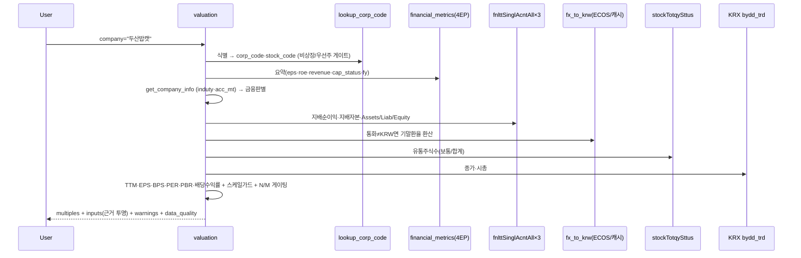

# price_multiple_data

## 이름 (260824 개명)
`valuation` → **`price_multiple_data`**. 「밸류에이션」이 배수(PER·PBR)와 규모(주가·시총)를 한 이름
아래 묶고 있었는데, 실제로는 서로 다른 질문이고 파라미터가 서로 다투었다. 규모·거래 쪽은
[[trading_data]] 로 갈랐다. 옛 이름의 사용통계는 `usage_tracker.TOOL_ALIASES` 가 접어 한 계열로 잇는다.

## 한 줄 요약
DART(공시) + KRX(공식시세) 기반 **상대가치 배수** — PER(FY0·TTM) · PBR(MRQ) · 배당수익률. 지배주주
귀속 기준, 비KRW 기능통화 자동 환산(ECOS), 실시간 스케일가드 + N/M 게이팅 + 식별 status 4단.
설계·검증 근거 = 방법론 스펙(private wiki).

## 사용법
```
price_multiple_data(company="두산밥캣")                    # firm: 기업 심층 (실시간)
price_multiple_data(scope="market")                        # 시장 전체(KOSPI·KOSDAQ) + 주간 히스토리
price_multiple_data(scope="sector", company="두산밥캣")    # 산업별 표 + 기업 vs 소속 섹터 비교 + 소속 섹터 시계열(연말 요약+전체 월별)
price_multiple_data(scope="firm_history", company="삼성전자")  # 종목 PER/PBR 시계열 — FY0·TTM·MRQ (주간 곡선 + 월말 요약)
```
자연어 예시:
- "삼성전자 밸류에이션" → firm: PER 46.9(FY0)/21.6(TTM) · PBR 4.33 · 배당수익률 0.54%
- "두산밥캣 PBR" → USD 재무 자동 KRW 환산(ECOS 1,434.9) → PBR 0.86
- "코스피 지금 싸?" → market: KOSPI PER 20.4(TTM)·PBR 2.23 + 주간 추이
- "반도체 업종 밸류" → sector: KSIC 섹터별 PER/PBR 표
- "두산밥캣 섹터 평균 대비 싸? 비싸?" → sector + company: 기업 vs 소속 섹터 비교 + 섹터 시계열
- "배당수익률 얼마?" → firm: 현재가 기준(시장·섹터 집계 배당수익률은 market/sector)

## 입력 인자
| 인자 | 타입 | 필수 | 설명 | 기본값 |
|---|---|---|---|---|
| company | str | firm·firm_history는 필수 | 회사명 / ticker(6자리) / corp_code. sector에선 선택(소속 섹터 비교) | "" |
| scope | str | no | `firm`(심층·실시간) / `market` / `sector` / `firm_history`(주간 곡선 + 월말 요약, DB 계산) / `explain`(수치 근거 — company 지정 시 실제 값 대입 계산 과정, 미지정 시 방법론·기준·출처 전문) | "firm" |
| scheme | str | no | sector 집계 축 — `wics_industry` / `wics_sector` / `ksic`. 배당수익률은 `wics_sector` 에만 붙는다 | "wics_industry" |
| format | str | no | "md" / "json" | "md" |

## scope 라우팅 — 기능 → 데이터 소스 (DB-first)

| scope | 소스 | 갱신 | 내용 |
|---|---|---|---|
| `firm` | 실시간 DART 재무 × `krx_weekly` 시세 | 매 호출(재무) + 일별(시세) | EPS·BPS·배당·경고·FX·스케일가드 — 정밀 심층 |
| `market` | `mkt_val_history` (`sector='_ALL'` 행만) **+ `div_yield_hist`(확정 배당) + `fwd_agg`(선행 배당)** | 주간 스냅샷(cron) + 과거 76개월 백필 · 배당 확정은 **연 1회**(4월) · 선행은 평일 | KOSPI·KOSDAQ 시총가중 PER/PBR + **배당수익률(확정·선행 × all·payers)** + 히스토리 |
| `sector` | `mkt_val_history` (`sector != '_ALL'` 행) (+`firm_valuation_snapshot` 비교) · `scheme='wics_sector'` 일 때만 **배당 두 표 추가** | 주간 스냅샷(cron) + 과거 76개월 백필 | KSIC 하이브리드 섹터별 + 기업 vs 섹터 + **소속 섹터 시계열**(company 지정 시). 배당수익률은 **WICS 대분류에만** — 집계 버킷이 그 축이라 ksic·wics_industry 에는 안 붙인다 |
| `firm_history` | `krx_weekly`(주간 시총) × `mkt_finstat_y`(연간 FY0) × `mkt_finstat_q`(분기 TTM/MRQ) + `firm_valuation_snapshot`(주간 스냅샷, +krx_stock_flags 경고) | compute-on-query(저장 X) + cron 축적 | 종목 PER/PBR 시계열 — **FY0·TTM·MRQ 세 기준**. 차트=전구간 주간 곡선(`data.series`), 텍스트=최근 12개월 월말(`data.summary`, ▲분기공시 마커) + 연말 밴드(장기). TTM=최근4분기 지배순이익(2020~), MRQ=최근분기 지배자본. 시총 기반이라 수정주가 조정 불변 |
| `explain` | firm 재계산(company 시) / 정적 텍스트 | — | **수치 근거** — "이 PER 어떻게 나온 거야?"에 계산 과정(실제 값 대입)·기준·출처·주기로 답변 |

### 배당수익률 (260831 추가)

시장·산업 표의 배당수익률은 **PER·PBR 과 출처 표도 기준일도 모집단도 다르다.** 한 표에
놓이지만 같은 자로 잰 값이 아니다 — 그래서 표 아래에 셋(주간 스냅샷·확정 사업연도·추정 as_of)을
따로 적는다.

| | 확정 | 선행 |
|---|---|---|
| 표 | `div_yield_hist` | `fwd_agg` |
| DPS | 12월결산 확정 | 애널리스트 추정 |
| 분모 시총 | 그 사업연도 **12월 마지막 주** | 추정 스냅샷의 `price_dd` |
| 모집단 | 그 시점 상장 보통주 전체 | 추정이 있는 종목만(`covered`) |
| 갱신 | 연 1회 (`run_div_hist_annual.sh`, 4월) | 평일 (`collect_y_run.sh`) |

- **분모를 두 벌 낸다** — `all`(무배당·DPS미확정 포함, 본값) · `payers`(배당주만). 표기는 `1.60 (1.89)`.
  🔴 **코스닥을 `all` 한 값으로만 내면 왜곡이다.** `all`→`payers` 에서 값이 두 배가 된다(FY2023 −59.7%,
  코스피는 −15.5~−20.8%). 낮은 것은 사실이나 **눌림의 절반은 배당력이 아니라 구성 차이**다.
- **PER 과 게이팅이 다르다** — 적자면 PER 은 안 나오지만 배당수익률은 배당이 있으면 값이 난다.
- **fail-open** — 배당 조회가 실패해도 PER·PBR 표는 그대로 낸다. 칸만 비고 각주에 이유를 남긴다.
- 소규모 섹터를 합치지 않는다. `n_total` 을 남겨 읽는 쪽이 판단한다.

- **FY 라벨은 하드코딩하지 않는다**: `mkt_fundamentals.ni_fy/eq_fy`는 `derive_fundamentals`가
  `_latest_annual_fy()`로 덮어쓰는 **가변열**이다. 이 값을 담는 `fin[]` 키를 연도 리터럴로 박으면
  FY가 넘어간 뒤 최신 fundamentals 가 옛 FY 라벨을 달고 진짜 그 FY 행(`mkt_finstat_y`)을 덮는다 —
  오늘은 멀쩡해 보이고 다음 결산 공시 때 터지는 look-ahead 오염이다. 라벨은 `_latest_annual_fy()`로
  파생한다.
- **시장·섹터 히스토리는 한 테이블(`mkt_val_history`)**이다 — `sector` 컬럼의 센티넬 `'_ALL'`(시장
  전체) vs 실제 섹터코드로 구분한다(PK: snap_dd·mkt·sector). 섹터 전용 테이블을 따로 두면 같은 산식이
  두 곳에 살아 갈라진다. 스키마 상세는 private 레포(data-storage-registry) 참조.
- 스냅샷은 `scripts/market_val_weekly.py`가 갱신(cron `.github/workflows/market-val-weekly.yml`,
  매일 KST 10:17 — 매일 수집(KRX 금요일 지연 게시 커버)→같은 ISO주 수렴→주 마지막 거래일 영구 보존, KRX 4콜/일).
- **market/sector 히스토리는 2020-01~현재, FY0+TTM+MRQ 전부**: cron이 쌓는 최신분 + `market_val_history_backfill.py`
  (1회성, DART 0콜)가 채운 과거 78개 월말 — 시장 156행 + 섹터 11,014행, FY0·TTM·MRQ 세 기준 모두 백필
  완료(260706, 최초엔 FY0만이었으나 분기 백필 완주 후 확장). "2020년부터 코스피 PER/PBR 추이" 응답 가능.
  주간 cron도 **sector 행에 per_fy0/pbr_fy0·ni_ttm·eq 를 채운다**(firm 단위 nf/ef 가 이미 로드돼 있어
  `_ALL` 과 같은 산식으로 합산, 신규 수집 0) — `_ALL` 행과 대칭이라야 `scope="sector"` 현재주 FY0 가
  비지 않는다. Σ순이익≤0 인 섹터는 N/M. ※ firm_valuation_snapshot이 최신 2주만
  보존해 그 이전 주간 sector 행(~3천)은 재백필 불가 — 연말 밴드가 장기 트렌드 커버.
- **섹터 소속 시계열**(sector scope + company 지정 시): `company_ctx.sector_history` —
  그 기업 소속 섹터의 78개월 전체 시계열(per_fy0·per_ttm·pbr_fy0·pbr_mrq·cap). md 렌더는 연말만
  발췌 표시, 전체는 json의 `data.company.sector_history`. 소규모(`_fold`) 섹터는 fold 버킷 시계열로 폴백.
- **⚠ 방법론 이중성**: firm = 보통주 주가÷EPS(유통주식). 스냅샷 = **총시총(우선주 귀속)÷지배순이익**
  (시총가중, 지수 표준) — 삼성 PER(TTM) 20.0(firm) vs 21.9(스냅샷)처럼 다를 수 있음. 출력에 명시.
- **수정주가**: PER/PBR/시총 시계열은 시총 기반이라 분할·무상증자 **조정 불변**(주가×주식수 상쇄) —
  조정 불필요. 주당 가격·EPS 시계열을 노출하게 되면 krx_adj_factor_v3(기준가 리셋 실측) 적용 필수.
  - **단, firm scope 의 PER 은 EPS 기반이라 계수가 필요하다.** 위 「조정 불필요」는 **스냅샷**
    (market·sector·firm_history, 시총 기반)에만 해당한다. 260823 이전에는 이 구분이 없어
    「조정 불필요」가 넓게 읽혔고, 계수 파이프라인에 cron 이 안 걸린 채 7주 방치됐다.
  - **계수 누락 탐지(260823)**: 조정성 이벤트는 주가·EPS 와 주식수가 상쇄하므로 **계수 f ×
    상장주식수 배율 r ≈ 1** 이 성립한다. 벗어나면 공시 EPS 조각이 옛 분모와 새 분모로 섞였다는
    뜻이라 **PER 을 N/M 으로 무효화**하고 이유를 경고에 적는다(EPS 값은 인풋으로 남겨 진단 가능).
    밴드는 ±50% — 유상증자·감자는 계수 대상이 아니라 r 만 움직이므로 통과시키고 액면분할·병합만
    잡는다. 실측 계기: 메이슨캐피탈(021880) 10:1 병합에 계수가 없어 TTM 지배순이익 **-70억**인데
    EPS(TTM) **+39원**, **PER 32.31** 이 live 로 나갔다(부호까지 뒤집힘).
  - **갱신**: `market-val-weekly` 가 매일 `krx_base_resets.py --update` → `adj_factor_v3.py` 를
    돌린다(260823 신설, KRX ~4콜/일). 종전엔 cron 이 없어 수동이었다.
- **비KRW 22사(USD/CNY/JPY) — 환산은 저장 시점에 한다**: `market_val_series.py`/
  `market_fund_quarterly.py` 가 fetch 시점에 그 해/분기 응답에서 `statement_currency()` 로 통화를
  감지해 KRW 로 환산한 뒤 저장한다 — **DB 의 ni/eq 는 항상 KRW**. 라벨도 `currency='KRW'` +
  `orig_currency=원통화` 로 남겨 하위 read-time FX 가 no-op 이 된다. 원통화로 저장하고 조회 시점에
  최신 통화 라벨 하나를 전 연도에 곱하면, **연도별로 기능통화가 바뀌는 회사**(두산밥캣)의 옛 연도가
  자릿수째 부풀어 오른다. 상세: private wiki.

## 데이터 계보 (소스 → 아이템 → 연산) — 핵심

| 단계 | 소스 (호출) | 뽑는 아이템 | 쓰임 |
|---|---|---|---|
| 식별 | **`resolve_company_query`(공용 리졸버 — company 툴과 동일 진입, 260705 채택)** → DART corp master | corp_code · stock_code · 상장여부 · ambiguous 후보 | 진입 게이트(동명 다수=후보표 / 비상장·우선주·빈입력 차단) |
| 재무요약 | `build_financial_metrics_payload(stock_code)` → DART **fnlttSinglAcnt·AcntAll·Indx·감사의견** | eps_krw · revenue_krw · roe_pct · capital_impairment_status · fiscal year | EPS(FY0)·ROE·매출·자본잠식 상태 |
| 업종/결산월 | `get_company_info` → DART **company.json** | induty_code(KSIC) · acc_mt(결산월) | 금융 판별(64/65/66) · FX 기준일 |
| 재무원장 | `get_fnltt_singl_acnt_all` ×3 (연간 11011 + 1Q당해 11013 + 1Q전년 11013) | `_ctrl_ni`(지배순이익) · `_ctrl_equity`(지배자본) · `_gid`(Assets/Liab/Equity, **exact-match**) | TTM 순이익 · BPS · 스케일 항등식 |
| 통화 | `statement_currency`(currency 필드) + `fx_to_krw` → **ECOS 731Y001**(→야후 폴백) + Supabase `fx_rate` 캐시 | 기능통화 · 기말환율 | 비KRW → 재무 KRW 환산 |
| 주식수 | `get_stock_total` → DART **stockTotqySttus** | distb_stock_co(합계/보통주, 자기주식 제외) | EPS 분모(보통주)·BPS 분모(합계) |
| 시세 | **Supabase `krx_weekly`(검증 자산, 2015-12~)** 우선 → 미스·최신 확보 시만 라이브 KRX stk/ksq_bydd_trd | close(종가) · mktcap · list_shrs | 배수 분자(주가)·시총 노출·주식수 검증 |
| 배당 | `_annual_summary` → DART **alotMatter** | cash_dps(주당현금배당, 이미 주당값) | 배당수익률 |

## 연산 파이프라인
```
TTM 순이익   = ni_fy(연간) + ni_qc(1Q당해) − ni_qp(1Q전년)      # 지배순이익 기준
EPS(FY0)     = 공시 기본주당이익 (연간 재무제표 직접, 3단 매칭)   # 결측 시 지배순이익÷보통주 폴백
EPS(TTM)     = 공시 EPS 조립: FY0 + 분기누적(thstrm_add) − 전년동기누적  # FY0과 같은 공시 기준(대칭)
BPS          = 지배자본(MRQ 우선, 없으면 FY0) ÷ shares_total(합계)
PER(FY0/TTM) = 주가 ÷ EPS(FY0/TTM)
PBR(MRQ)     = 주가 ÷ BPS
배당수익률    = DPS ÷ 주가 × 100
```
- **지배주주 귀속 일관**: EPS·BPS·PER·PBR 모두 지배지분(`_ctrl_*`). 지주사(NCI 큰) 과대 방지.
  단 **스케일 항등식은 총자본**(지배+비지배, `_gid` Equity) — 지배자본만 쓰면 NCI만큼 상시 오탐.
- **EPS 대칭화**: FY0·TTM 모두 공시 기본주당이익 기준(TTM=공시 EPS 조립) — 두 PER 직접
  비교 가능. 커버리지 99%(100사 스윕), 결측 시 지배NI÷보통주 폴백+경고. 기중 주식수 급변 시
  조립 한계는 sanity 경고. 상세 private wiki.

## 가드 4종
1. **식별 status**(진입부): `invalid`(빈입력) · `not_found`(미존재·우선주 — 마스터는 보통주 코드만) ·
   `unlisted`(비상장, 주가 없어 배수 불가 + 상장 후보 안내) · `no_financials`(재무 미확정). 크래시·오매핑 0.
2. **N/M 게이팅**: 분모(EPS·BPS)≤0 또는 **완전자본잠식**(cap_status=full)이면 해당 배수 = None(N/M).
   적자를 숫자 배수로 내보내지 않음.
3. **스케일가드**(`services/scale_guard.py`, 설계 근거 private wiki): hard=②항등식(자산=부채+자본)·
   ③시장최댓값배수 / soft=①배수점프·④시총비율. **개별조회는 마스킹 안 함 — 값 유지 + 강한 경고**.
   (시장 aggregate는 반대로 무효화 — 소비 맥락이 다르므로.)
4. **통화**: 비KRW면 회계기말 환율로 순이익·자본·자산·부채 환산 후 배수 산출 + 환산 경고.

## 출력 schema (data dict)
```json
{
  "company_id": "cmp_241560",
  "identifiers": {"ticker": "241560", "corp_code": "01032486"},
  "sector_class": "general",           // general | financial
  "fiscal_year": 2025,
  "price_krw": 64400, "price_date": "20260703",
  "multiples": {
    "per_fy0": 15.19, "per_ttm": 14.58,
    "pbr_mrq": 0.86, "pbr_basis": "MRQ",
    "dividend_yield_pct": 2.64
  },
  "inputs": {
    "eps_fy0_krw": 4241, "eps_ttm_krw": 4416, "bps_krw": 74931, "roe_pct": 5.83,
    "net_income_fy0_krw": 405931775100, "net_income_ttm_krw": 422682797700,
    "controlling_equity_krw": 7171963096800,
    "shares_common": 95713802, "shares_total": 95713802,
    "dps_krw": 1700, "revenue_fy0_krw": 8870273429400,
    "common_market_cap_krw": 6173130586000,
    "capital_impairment_status": "normal",
    "functional_currency": "USD", "fx_rate_to_krw": 1434.9
  },
  "warnings": ["기능통화 USD — 재무를 …환율 1,434.9원/USD로 KRW 환산…", "주가 기준일 …"],
  "data_quality": {"scale_tier": "clean", "scale_flags": [], "values_masked": false},
  "note": "lean v1 — RIM·EV/EBITDA·PSR·FCF·5년밴드·PIT는 v1.1. EPS(FY0)=공시 기본주당이익…"
}
```
- **단위**: 모든 `_krw` 필드 = 원 raw int. `_pct` = float(2.64 = 2.64%). 비KRW사는 환산 후 KRW.
- status 필드: `ok` / `invalid` / `not_found` / **`ambiguous`(동명 후보표)** / `unlisted` / `no_financials` / `no_data`(배치 미실행) / `db_error`(DB 일시 장애).

## DART/KRX 콜 budget (per-firm)
| 소스 | 콜 | 비고 |
|---|---|---|
| DART financial_metrics(summary) | ~7 | 4 endpoint + TTM/폴백 |
| DART company.json | 1 | 업종·결산월 |
| DART fnlttSinglAcntAll ×3 | 3 (~6) | 연간+1Q당해+1Q전년, CFS→OFS 폴백 시 최대 2배 |
| DART stockTotqySttus | 1 | 유통주식수 |
| DART alotMatter(배당) | ~2 | 연간 요약 |
| **DART 합계** | **11 (최대 ~15, 실측 260705)** | per-firm. scope=market/sector/firm_history는 **DART·KRX 0콜(DB만)** |
| KRX (시세) | **serve-time 0** | Supabase `krx_weekly`에서 읽음. 라이브 KRX는 하루 1회 최신 거래일 스냅샷 확보 시만(전종목 2콜, 코스피·코스닥 병렬) → **유저 수 무관 하루 ~수십콜 bounded**. KRX 개인키 일 10,000 한도 보호 |
| ECOS 환율 | 0~1 | 비KRW사만, 분기말 캐시 히트 시 0 |

**KRX 시세 = Supabase krx_weekly 서빙**: KRX Open API는 개인키 1개·일 10,000콜 한도(배치와
공유)라 라이브 유저를 직접 서빙하면 키 소진 시 배수 N/M 위험. FX 캐시와 동형 — 매일 최신 거래일
전종목 스냅샷을 라이브로 확보해 **'그 주(ISO week)' 슬롯에 덮어쓰며 갱신**(전날 종가까지 표시), 주중
일별은 다음 거래일에 덮여 사라지고 **주 마지막 거래일만 영구 보존**(주당 1스냅샷 ~52/년 = 무료티어
보호). valuation은 DB 우선 읽기, 서빙 KRX 콜 = 하루 ~2. 축적 주간가격은 v1.1 5년밴드·PIT 재사용.
price_date로 기준일 투명.

**fetch 병렬화**: 최상위 await 를 의존성 3단계 gather 로 묶는다 — P1(financial_metrics·company·KRX,
fy 무관) → P2(연간원장·주식수·배당, fy 의존) → P3(1Q당해·전년, fs_used 의존). 실측 개별 조회 ~2.2s
(순차 ~6.3s), 8종목 배치 20s(순차 50s).


## Flow


## 검증
7-에이전트 다각 검증(대형제조·금융·통화환산·지주NCI·부실스케일·엣지식별·독립산식감사) + 웹검증.
**견고성 blocker 0** — 18개 배수 독립 재계산 전부 일치, 두 자본 구분 SK(NCI 71%) 정확, 통화 ECOS
정합, 완전자본잠식(이오플로우) N/M 정확, 크래시·오매핑 0. 상세 = private wiki §"등록 전
7-에이전트 검증".

## 알려진 issue + v1.1
- **EPS FY0/TTM 방법론 비대칭**(문서화 완료, 통일은 v1.1).
- **shares_bad**(유통주식수 파싱오류) 시 PBR·EPS_ttm은 무효화되나 eps_fy0(공시값)는 유지 — 흑자
  종목이면 EPS 과소·PER 과대 누수 가능(v1.1: eps_fy0도 차단).
- **unlisted 상장후보 안내**가 리졸버 exact-match 단락으로 비는 경우(예 "삼성") — 부분매치 별도조회(v1.1).
- 리츠 전용 섹터 처리 없음 / 데이터부재(상폐) 종목이 금융으로 오분류(경미).
- v1.1 백로그: RIM·EV/EBITDA·PSR·FCF·peer 랭킹·자기 5년 밴드·PIT 시계열 · FX 평균환율(flow) ·
  한국은행 ECOS를 야후 폴백 대신 정본 유지 · 우선주 총시총 합산.

## 변경 이력
- 2026-08-06: 수정 경위 서술을 현재형 설계 근거로 정리(경계 규칙 [[wiki_schema]] 0.0).
- 2026-07-14: FY 라벨 하드코딩 제거(`_latest_annual_fy()` 파생).
- 2026-07-09: 주간 cron 이 sector 행의 per_fy0/pbr_fy0·ni_ttm·eq 도 채우도록.
- 2026-07-06: 시장·섹터 히스토리 테이블 병합(`mkt_val_history` + `'_ALL'` 센티넬) ·
  테이블 개명(`mkt_finstat_y`/`mkt_finstat_q`/`firm_valuation_snapshot`) ·
  비KRW 환산을 저장 시점으로 이동 · FY0+TTM+MRQ 78개월 백필 완료.
- 2026-07-05: tool 등록(`tools/price_multiple_data.py`). 공용 리졸버 채택 · EPS 대칭화 · 섹터 소속 시계열 ·
  KRX 시세를 `krx_weekly` 서빙으로 · fetch 3단계 병렬화.

## 관련
- 설계·스케일가드·FX·검증 전체 근거 = private wiki
- [[financial_metrics]] — 재무 펀더멘탈(이 tool이 요약을 재사용). valuation=시장배수, financial_metrics=펀더멘탈
- [[배당수익률]] — DPS ÷ 주가
- [[environment-secrets]] — ECOS_API_KEY·KRX_OPEN_API_KEY 등 필요 키
