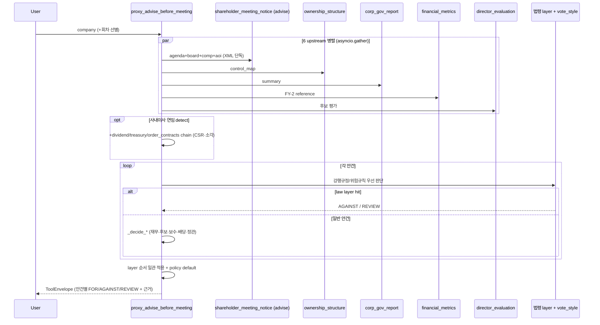

# proxy_advise_before_meeting

## 한 줄 요약
주총 **사전** 안건별 의결권 권고 + 명확한 결정 근거 한 번에. 1회 호출로 결정 + facts + risk + 정책 근거 + 후보 raw 모두.

## scope

**scope param 없음 — 항상 `decisions` 단일.**
Specialized 정보(안건 트리, 후보 raw, 재무 51 지표 등)는 각 data tool 직접 호출:
- 안건/이사후보 → [[shareholder_meeting_notice]]
- 재무 detail → [[financial_metrics]]
- 거버넌스 → [[corp_gov_report]]
- 지분/5%블록 → [[ownership_structure]] / [[proxy_contest]]
- 가치제고 → [[value_up]]

## 사용법

```python
proxy_advise_before_meeting(
    company="KT&G",
    year=2026,
    meeting_type="annual",
    vote_style="open_proxy",
    check_audit_history=False,
)
```

자연어 예시:
- "KT&G 이번 주총 안건별로 찬성/반대 어떻게 봐야 해?" → 기본 호출(회차 자동 선택, 안건별 decision + facts + policy_citation)
- "이 이사 재선임 반대할 근거 있어?" → 후보 평가(roster 교차검증·경력·risk_factors) + 정책 근거
- "이 보수한도 인상 안건 어떻게 판단해?" → 보수 안건 facts + 판정 근거 (소진율·인상 이력 detail은 [[director_board]] `pay_agenda`)

## 입력 인자

| 인자 | 타입 | 필수 | 설명 | 기본값 |
|---|---|---|---|---|
| company | str | yes | 회사명 / ticker / corp_code | - |
| year | int | no | 주총 연도 (사업연도 X) | 자동 — 최신 소집공고(12개월 lookback) 기준 회차. 공고 미발견 시 전년 fallback + warning. 응답 `year_resolution`에 선택 근거, 종료된 회차면 `meeting_closed_hint` 동봉 |
| meeting_type | str | no | "auto" / "annual" / "extraordinary" | "auto" |
| vote_style | str | no | `open_proxy` (default). 다른 내부 policy variant는 cross-reference용 비공개 surface이며 사용자 출력에는 실명/식별자 노출 안 함 | "open_proxy" |
| check_audit_history | bool | no | 후보 과거 회사 회계 risk overlap cross-check (+30s) | False |
| segment_context_chars | int | no | 부문 매핑 실패·정형 저신뢰 시 첨부되는 부문표 원문 발췌 길이 (clamp 1000~30000). 잘리면 응답에 전체 길이 + 재조회 경로(business_details 직접 조회 권장 / 파라미터 증액 재호출) 안내 — 호출 AI 자가조정용 | 8000 |
| as_of | str | no | `YYYYMMDD`. 판단이 서는 시점 — 이 날 이후 접수된 공시는 읽지 않는다(look-ahead 차단). 미지정 시 회의일이 과거면 회의일 전일, 미래면 오늘 | "" |
| include_after_meeting | bool | no | True 면 기준일 이후 자료까지 읽고 해당 공시에 ⚠ 표시. 해당 회차 의결 결과는 그래도 쓰지 않는다 | False |
| evidence_chars | int | no | 근거 원문 발췌 길이. 잘리면 응답에 전체 길이와 재호출 경로 안내 | 4000 |
| format | str | no | "md" / "json" | "md" |

## 출력 schema (decisions)

각 안건별 (`agenda_decisions[]`):

| 필드 | 의미 |
|---|---|
| `decision` | FOR / AGAINST / REVIEW / **NO_VOTE** / **NO_DATA** |
| `reason` | 결정 사유 한 줄 |
| `facts` | 정량 fact dict (net_income / cap_status / 1번 안건 본문 FY raw / 후보 평가 등) |
| `risk_factors` | 위험 신호 list ("완전 자본잠식", "장기연임", "이사 회계 risk 이력" 등) |
| `policy_citation` | OPM Guideline 근거 ("§재무제표 — 적정 + 잠식 없음 시 FOR" 등) |
| `policy_basis` | 공개 정책 basis (`Open Proxy guideline` 또는 `Internal policy variant`) |
| `evidence_rcept_no` | 근거 공고 (DART viewer link) |
| `agenda_action` / `appointment_type` | 신임 (`new`) / 연임 (`renewed`) auto detect. 소집공고 경력 텍스트만으로는 재선임을 신임으로 오분류하므로 **roster(임원현황 `exctvSttus`) 힌트**로 교정한다 — `source="roster_prior"`면 정형 재직 확인으로 승격. **힌트 정체성**: 승격만(downgrade X)·roster 부재는 소집공고 결과 유지(override 금지)·미등기는 제외 |
| `candidate_review_profile` | 후보 선임 안건용 evidence bundle. 결격사유, 독립성 세부 사유, 겸직 구간, 연임/재직 시작, 추천사유/직무계획 raw, 사내이사 성과 요약을 묶어 노출 |
| `facts.*_band` | 보수 인상률, 보수 소진율, 감사 1인당 보수, 배당성향, 자사주 비율을 사람이 읽기 쉬운 구간값으로 구조화 |
| `facts.retirement_multiplier_evidence` | 퇴직금/퇴임위로금 변경 안건의 before/after 배수, 증가율, strong review signal |
| `facts.retirement_target_expansion` | 퇴직금/퇴임위로금 지급 대상이 새로 확장된 경우의 조항과 대상 키워드 |
| `facts.director_per_person_limit_krw` / `facts.audit_per_person_krw` | 총 보수한도와 인원수로 산출한 1인당 한도. decision을 바꾸기보다 REVIEW 근거 확인용 evidence |
| `facts.treasury_pct` / `facts.related_total_pct` / `facts.active_signal_count` | 이미 호출한 ownership data를 자사주/지배력 관련 안건 facts에 구조화 |
| `facts.law_detail` | 법령 layer hit 안건의 조항 대장(SSOT `law_provisions.json`) 상세 — `article`(정확한 조문번호)·`amendment_round`·`effective_date`·`obligation_date`(유예도래일)·`applies_to`(적용대상 티어)·`threshold_decree`(자산 임계 시행령 조문)·`first_agm_trigger`. `reason`에도 `📋 조항 상세:` 한 줄로 노출 |
| `facts.raw_text_fallback` / `facts.parsing_quality` | 구조화 파싱 실패(`decision=NO_DATA`) 안건에 한해, 소집공고 원문에서 해당 안건 주변을 발췌해 첨부(`parsing_quality="low_fallback_to_raw"`). 파싱이 안 돼도 사람/LLM이 원문을 직접 읽고 판단 |
| `facts.fy_raw_cross_check` | 1호 안건 본문의 잠정 재무제표 ↔ 확정 재무제표 자동 검산 (아래 「본문↔확정 재무제표 검산」) |

진단 필드:

| 필드 | 의미 |
|---|---|
| `data.disclosures_read` | **이 메모를 만들며 실제로 읽은 공시 전부** — `rcept_no`·`rcept_dt`·`report_nm`·`used_for`(용도 목록)·`notes`·`viewer_url`. 같은 문서를 여러 upstream 이 읽으므로 접수번호로 묶고 용도를 모은다. 예전에는 upstream 당 2건 + 표시 5건으로 두 번 잘려 지분·감사의견·배당처럼 판정에 쓰인 문서가 목록에서 빠졌다 — 무엇을 근거로 나온 판정인지 되짚을 수 없으면 판정도 못 쓴다. 공시명에 내부 식별자(`disposal_result` 등)가 오면 용도 라벨로 대체하고, 접수일은 접수번호 앞 8자리로 통일한다. |
| `data.timings_ms` | `resolve_company`, `prewarm_corp_codes`, `upstreams_total`, `upstream.*`, `notice_doc_reuse`, `decision_engine`, `total` 등 stage별 소요 시간(ms). timeout/지연 병목 확인용. |
| `warnings` (무결성 시그널) | 추가 호출 0으로 `expected × 결과None/0`의 AND 자동감지 — corp_gov(compliance None·준수율 교차검증 불일치·주주필드 PARTIAL), financial(금융업/지주 revenue None=`sector_na` 정당 vs `core_field_null` 진짜 실패), director(인사안건>0인데 후보0=zero-candidate, silent empty 방지), ownership(`control_map.blocks_present`). 데이터 신뢰성·'정당 N/A vs 진짜 실패' 구분용. |

후보 평가 (`candidates_evaluations[]`):

| 필드 | 의미 |
|---|---|
| 독립성 / 결격사유 / 충실성 | 자동 판단 (Korean 자연 라벨: "독립적" / "약한 우려" / "우려" 등) |
| main_job | 현 직책 (전문성 hint) |
| recommendation_reason_raw | 추천사유 (회사 본문 raw) — 후보별로 귀속 (아래 「추천사유 귀속」) |
| career_raw | 경력 — 소집공고 세부경력 **원문**(기간·내용). 회사/직위를 갈라 붙이는 정규화는 하지 않는다 |
| audit_history_check | 과거 회사 회계 risk overlap (옵션) |
| **performance** | **사내이사 연임 후보 한정** — 재직 중 회사 운영 성과 매트릭스 2x3 (ROE/부채비율/CSR × avg/trend), 6 cell 점수, classification good/moderate/weak/bad, rationale 한국어. **점수 미반영 fact**: 영업이익률(본업 수익성 — ROE 왜곡 보완, `core_profitable` 본업 흑/적자) + 수주·해지(order_contracts signal_summary — 적자기업 미래매출 가시성) + **담당부문 성과 `segment_signal`**(부문장 출신 후보만, 커리어→business_details segments 보수적 매핑(정확히 1개 매칭·정형 OK만), 최근 3개 사업연도 부문 매출·영업이익, `excluded_years`로 저신뢰 제외 연도 명시, `segment_signal_status`로 skip 사유 기록). 적자기업이 ROE만으로 부당하게 깔리지 않게, 부문장 출신이 전사 실적만으로 깔리지 않게 해석 단서로 분리 (자세히는 [[260505_1700_decision_inside-director-performance-matrix]]) |

## 임원현황(roster) 교차검증

소집공고 후보 정보를 **직전 정기보고서 임원현황(`exctvSttus`)** 정형 데이터로 대조한다. roster는
`roster_prior` 목적으로 이미 fetch하므로 **추가 DART 콜 0**이다.

**임원현황 8필드 활용 현황**:

| 필드 | 채움 | 용도 |
|---|---|---|
| `rgist_exctv_at` 등기 구분 | 100% | 등기 여부 확정 · 미등기면 성과 미평가 |
| `hffc_pd` 재직기간 | 96% | 등기 시작연도(취임연령·임기만료 정합성 게이트) |
| `tenure_end_on` 임기 만료일 | 등기 96.3% | 재선임 대상 확정 · 근속 오기재 검산 |
| `fte_at` 상근 여부 | 100% | 사외이사 §382③1호 결격 검산 |
| `sexdstn` 성별 | 100% | 자본시장법 §165조의20(지배구조 지표와 교차검증) |
| `chrg_job` 담당업무 | 98.6% | 위원회 소속(`roster_committees`) |
| `ofcps` 직위 | 100% | 이 회사 현재 직위(`roster_position` — 자유기재인 「주된직업」과 별개) |
| `main_career` 주요경력 | 98.6% | 공고 경력 결측 보완(`career_from_roster` — **없을 때만** 채우고 덮지 않는다, 기준일이 다르다) |
| `mxmm_shrholdr_relate` | 51% | 최대주주 관계 결측 채움(boilerplate 제외) |

**roster 사다리**: FY(N-1) 사업보고서 → 3분기 → 반기 → FY(N-2) 사업보고서(최후).
「누가 언제 등기됐나」는 소집공고 시점에 이미 주총결과 공시로 공개된 사실이라 FY(N-1) 사업보고서를
쓰는 것이 look-ahead가 아니다(감사 전이라 그때 알 수 없는 재무제표와 다르다). 판단 기준은 **도구
실행 시점**이다. FY(N-2) rung에서는 「등기 재직 없음」을 단정하지 않는다 — 등기 190행 중 14.7%가
직전 1년 내 시작이라 그 사이 승진해 등기됐을 수 있다.

- **rung 채택 조건은 「행 존재」가 아니라 「등기 이사회 구성원 존재」다**(`_roster_has_board_member` —
  [[director_board]]의 분기 fallback도 같은 게이트). 분·반기는 임원현황 기재를 생략할 수 있어
  (자본시장법 시행령 §170) 행은 있는데 등기이사가 0명일 수 있고, 그 rung을 채택하면 사업보고서로
  확정했던 등기 시작이 추정으로 되돌아간다.
- **DART 콜**: 회사당 `exctvSttus` 1콜 → 최대 4콜(보통 1). 과호출·인증 실패(020/011/012)는 사다리를
  멈춘다 — 삼키고 계속 타면 경고 없이 콜만 태운다.

### 등기 재직기간 — 성과 귀속의 창

성과 매트릭스는 **등기이사 재직 기간**만 창으로 쓴다(`board_earliest_start`). 경력 전체의 최초 연도
(`appointment_type.earliest_start`)를 쓰면 비등기 시절 실적이 개인에게 귀속된다 — 캐시 소집공고 경력
블록 103건 중 32%에서 등기 최초연도가 전체 최초연도보다 3년 이상 늦다.

소집공고 경력란은 **등기 여부를 적을 의무가 없다** — 상법 §542조의4② + 시행령 §31③은 성명·약력·
추천인·최대주주 관계·거래내역·결격사유만 요구한다. 실측도 그렇다: 경력 항목 7,617개 중 「등기」
명시는 15개(0.20%). 그래서 등기 판정의 SSOT는 임원현황 `rgist_exctv_at`(법정 기재사항, 97% 보유)이고
`apply_roster_board_tenure`가 이를 적용한다. 임원현황에 없으면 추정을 덮지 않는다(침묵 삭제 금지).

- **미등기로만 기재되면 `board_earliest_start=None`을 확정**한다 — 이번이 첫 등기 선임이라는 뜻이다.
- **`hffc_pd`는 등기 구분과 함께 써야 한다.** 미등기 행에도 연수가 찍힌다(실측 640건).
- **`hffc_pd`의 뜻은 회사마다 다르다** — 일부는 등기 재직기간이 아니라 **입사 근속연수**를 적는다.
  실측 등기 190행에서 역산 취임연령이 30세 미만인 행이 11개(5.8%), 최악은 19세 전무이사다.
  그래서 **정합성 게이트**: 역산 취임연령 < 30이면 시작연도를 버리고 등기 여부만 남긴다(보수적 =
  성과 미평가, 실측 발동 3%). 게이트가 걸리면 재직기간 출처 표기도 「소집공고 추정 — 임원현황
  재직기간은 근속연수로 보여 쓰지 않았습니다」로 바꾼다.
- 재직기간 서식 4종을 모두 읽는다 — 날짜 58%(`2019.01.01~`) · 단위 없는 숫자 20% · 「N년」 14% ·
  「N개월」 7%.
- `_is_board_role`은 상법 §317②8호가 정한 등기 지위만 인정한다(「CEO」·「이사장」은 제외) + 감사원·
  감사실·감사본부·감사팀 오탐 차단.
- 등기 행이 여럿이면 `min(시작연도)` — 성과 귀속은 등기 기간 **전체**다(기타비상무이사 2012 →
  사내이사 2020이면 2012).
- **등기 첫 해 실적은 전임 경영진의 것**이라 최소 2개 사업연도를 요구한다(미달 시 평가 미실시).
  등기 시작이 근무 시작보다 늦으면 `performance.tenure_note`로 그 사실을 밝힌다.
- `not_evaluated` 사유는 4갈래 — 「미등기 확정」/「등기는 확정인데 시작 시점 미상」/「임원현황에
  없음」/「매칭 실패」. 표본 113명 기준 등기 시작 확정 60% · 미등기 확정 5% · 게이트 차단 3% ·
  대조 실패 32%.
- 확정하지 못한 갈래에만 `performance.roster_row`로 임원현황 행을 통째로 싣는다(등기 구분·직위·
  담당업무·재직기간·임기만료일·상근·최대주주 관계·주요경력, 빈 칸 제외). 확정된 경우엔 붙이지
  않는다(군더더기).

### 임기 만료일 · 성별 · 결격 검산

- **`tenure_end_on` 임기 만료일**: 서식이 「YYYY년 MM월 DD일」 하나라 `hffc_pd`보다 해석 여지가 없다.
  ① 만료가 이번 회차면 **재선임 대상 확정**(실측 71명 중 52.1%) — 경력 텍스트 추론과 독립된 정형
  근거이므로 `type=new`를 연임으로 승격한다(승격만). ② 생년이 없어 취임연령 게이트를 못 돌릴 때
  (만료 − 시작) > 40년이면 근속 오기재로 보고 시작연도를 버린다. 산출물에 「임기 만료: …」로 노출한다.
- **사외이사 §382③1호 검산**(`apply_roster_employee_check`): 소집공고는 결격사유를 「해당사항 없음」
  이라고만 적는다. 직전 정기보고서에 이 회사 **상근** 임원(사외이사 아님)으로 기재돼 있으면 그 사실을
  노출한다. **단정하지 않는다** — 스냅샷 하나로 「최근 2년」을 확정할 수 없고 동명이인 위험이 있다.
  생년 대조가 안 되면 신호로 쓰지 않는다. 저빈도·고심각 가드다.
- **이사회 성별 구성**(`sexdstn`) → **자본시장법 §165조의20**: 자산총액 2조원 이상 상장사는 이사회를
  특정 성의 이사로만 구성할 수 없다(2020 개정 · 2022-08-05 시행). 자산 2조를 넘는 회사에서만 위험
  신호를 낸다. **등기이사만 센다** — 미등기 여성 임원을 이사회 여성으로 세면 위반을 놓친다. 판정은
  하지 않는다(자산은 FY(N-2) 기준, 이사회 구성도 스냅샷). 기업지배구조보고서 15개 핵심지표의
  「이사회 구성원 모두 단일성(性)이 아님」과 독립적으로 교차검증되고, 지배구조보고서가 없는 회사의
  빈틈을 `sexdstn`이 메운다.
- **회장·부회장 → 총수 일가 신호는 내지 않는다.** 짝지을 `mxmm_shrholdr_relate`가 「계열회사 임원」
  boilerplate라(독립 사외이사 전원 동일값) 조합이 성립하지 않는다.
- **이사회 의장 분리 여부는 `chrg_job`이 아니라 `corp_gov_report`의 15개 핵심지표를 쓴다** —
  기업지배구조보고서가 더 권위 있는 소스이고 `chrg_job`의 의장 식별률은 4.7%뿐이라 표기 없음이
  「분리됨」을 뜻하지 않는다.
- **미준수(X) 지표를 산출물에 싣는다**(`governance_non_compliant`). 준수율(「93.3% · 14/15」)만으로는
  어느 지표가 빠졌는지 알 수 없는데, 그중엔 의결권 판단에 바로 닿는 것이 있다(「사외이사가 이사회
  의장인지 여부」·「집중투표제 채택」). 형태는 `{label, note, note_ref, prior}` — 회사가 적은 **사유**와
  전년 값을 함께 싣는다. 비고가 「(세부원칙 4-1) 참고」 같은 **포인터**면 같은 문서에서 이미 파싱한
  세부원칙을 `note_ref`로 따로 붙인다(원문 note는 그대로 두고, 추가 DART 콜 0). 표(「표 1-1-1 참고」)는
  해소하지 않는다 — 가리키는 대상이 원칙이 아니다.

## 후보 직위(roleType) 판정

안건 제목이 여러 안건으로 뭉쳐 오는 서식이 있어, 뒤 안건의 직위가 앞 후보에게 붙을 수 있다.

```
제목: 「사내이사 정인철 선임의 건 (임기 3년) 제3-3호 의안 : 사외이사 김대근 선임의 건」
→ 정인철 roleType = '사외이사'   (실제로는 사내이사 후보)
```

직위가 갈리면 독립성 검증의 적용 여부가 달라진다 — 사내이사에게 독립성 평가를 걸거나, 반대로
사외이사의 결격을 아예 안 보게 된다.

`declared_role_for_candidate(title, name)` 는 **이름 바로 앞의 직위**를 먼저 본다. 근거를
`named`(이름 지목) / `sole`(제목에 직위가 하나뿐) / 없음으로 구분하고, **직위가 둘 이상인데 지목이
없으면 판단하지 않는다**(추측하면 그게 버그다). `roleType` 에도 출처(`roleTypeBasis` = `column` /
`title` / `title_named`)를 남긴다.

**덮는 경우는 하나뿐** — roleType 이 구간 제목 추정(`title`)이거나 없는데(`none`), 제목이 이 후보를
이름으로 지목한(`named`) 경우다. 후보자 표 컬럼(`column`)에서 온 값은 후보별 정형이라 덮지 않고
`roleTypeConflict` 로 충돌만 남긴다 — 덮으면 세분도 차이(사내이사 vs 이사)까지 함께 깨진다.

후보자 표에 '직위' 칸이 없으면 「사외이사 후보자여부 : 여」를 **문서의 선언**으로 읽는다. 하위안건이
한 표에 묶여 첫 하위안건의 직위를 전원이 상속하면 사외이사가 사내이사로 집계돼 독립성 검증이 조용히
건너뛰어지기 때문이다. 그래도 남는 건은 `declared_role` 가드가 REVIEW로 넘긴다.

**직위 표기 불일치 노출**(`role_type_conflict`): 후보자 표와 안건 제목이 직위를 다르게 밝히면 어느
쪽도 덮지 않고 그 사실을 후보 블록에 찍는다 — 사람이 원문을 봐야 하는 자리다.

`names_titled_inside_director` 는 §382③ 검산용으로 유지한다 — 지금 안건 제목만 보면 「이사 선임의
건」 같은 일반 제목에서 오탐이 남으므로 **공고 전체 제목**을 스캔한다.

## 경력·추천사유 귀속

### 경력 쪼개기 의심 신호 (`career_split_doubt`)

소집공고 후보표는 서식이 회사마다 달라 기간·내용 셀의 줄 구분(`<p>`)이 있기도 없기도 하다. 짝이
맞아 보여도 잘 쪼갰다는 보장이 없으므로 3신호로 의심을 표시한다 — ① 기간이 항목별로 갈리지 않음
② 한 항목에 회사가 여럿(뭉침) ③ 항목이 괄호 중간에서 잘림. 하나라도 뜨면 쪼갠 목록에 **원문 두 칸을
나란히** 붙여 대조하게 한다(실측 후보 189명 중 11.1% — 뭉침 7.9% · 기간 미분할 2.6% · 절단 0.5%).

- 기간이 항목별로 안 갈리면 **짝짓지 않는다** — 기간 하나를 전 항목에 복사하면 없는 기간이 생긴다.
- **원문 저장은 무조건**이다. `<p>`가 아예 없는 순수 텍스트 셀도 원문 저장 지점에 닿아야 한다 —
  의심만 띄우고 보여줄 원문이 없으면 빈손이 된다.

### 추천사유 귀속

공고는 「- 홍길동 후보자」·「[홍길동 후보자]」·「5. 김학진」처럼 **이름으로 구간을 스스로 선언**한다.
그 선언을 읽어 후보별로 가른다(선언 구조 파싱). 한 구간에 후보 전원의 사유를 담는 서식이 흔해,
가르지 않으면 첫 후보의 문면이 전원에게 붙는다 — 사유는 `recommendation_reason_raw`로 LLM 판단에
그대로 들어가므로 **남의 이력으로 이사를 판단**하게 된다.

- 가르지 못하면 종전 동작(전원 부착 + `recommendation_reason_shared`)으로 물러난다.
- 선언에서 빠진 후보에겐 **남의 문면을 붙이지 않는다** — 붙이면 그게 자기 사유로 읽힌다.
- 한 문장이 여러 후보를 함께 말하면 가르지 않는다(첫 후보 것으로 단정하면 오귀속).
- 연속 동일이름 표지는 한 구간으로 병합한다 — 쪼갠 뒤 `"\n"`으로 되붙이면 md 렌더의 불릿이 끊긴다.
- **주주제안 후보의 빈 추천사유는 메우지 않는다** — 이사회 추천이 없는 게 정상이고, 메우면 분쟁에서
  이사회/주주제안 후보의 경계가 지워진다.

## 본문↔확정 재무제표 검산 (`facts.fy_raw_cross_check`)

소집공고는 사업보고서보다 먼저 나온다 — 캐시 실측 88곳 중 78곳(89%), 간격 중앙값 7일. 그래서 1호
안건이 승인하려는 **당기** 수치는 DART API에 아직 없고, 본문 잠정 재무제표를 파싱할 수밖에 없다
(감사 전·주총 승인 전 회사 자가 공시). **다만 본문의 「전기」와 API의 「당기」는 같은 해**라 서로
검산이 된다.

**성립 조건**: 이 등식은 「본문의 전기 = FY(N-2)A 의 당기」에 의존한다. 주총 N년 → 안건은 FY(N-1)
승인이고 본문의 전기는 FY(N-2)라 같은 해가 되며, 소집공고 시점에 API는 그 FY(N-2)를 이미 1년째
갖고 있다.

**260808 — 판정 payload 가 FY(N-1)로 옮겨가면서 이 등식이 실제로 깨질 뻔했다.** 상태 판정은
이제 승인 대상 연도(FY(N-1)A 또는 FY(N-1)P)를 보므로, 그 payload 로 검산하면 한 해 어긋난 값을
맞대 **없는 불일치**를 만든다. 그래서 검산 상대는 `crosscheck_payload` 로 **FY(N-2)A 를 따로**
받는다. 아래 「기준연도 3단」 참조.

그리고 이 위험을 잡으라고 둔 계약 테스트가 **소스에 `fin_year = target_year - 2` 문자열이 있는지**만
봤다. 같은 정리 작업에서 **검산 호출 자체가 삭제됐는데도 통과했다** — 그 줄은 기본값으로 남아
있었기 때문이다. 지금은 문자열이 아니라 **동작**(검산이 실제로 돌고 결과가 facts에 실리는지)을
잰다. 교훈: *계약을 문자열로 잡으면 계약이 아니라 문자열을 지키게 된다.*

### 기준연도 3단 (260808)

표를 던지는 시점은 소집공고가 아니라 **주총**이다. 시장 전수(2026 시즌, 12월 결산 2,731사) 실측 —
사업보고서는 소집공고 **+7일**(중앙값)에 나오고, 상법 §363(주총 2주 전 통지)과 겹치면 **최소
81.7%가 주총 전에 확정**된다. 즉 표를 던질 때는 잠정과 확정이 둘 다 있는 경우가 대부분이다.

| 상태 판정(자본잠식·배당재원·위험신호)에 쓰는 값 | 조건 |
|---|---|
| **FY(N-1)A** 확정 사업보고서 | 주총일 시점에 이미 제출돼 있으면 |
| **FY(N-1)P** 공고 잠정 재무제표 | 확정치가 아직 없고, 본문 검산(지배+비지배=자본총계)을 통과하면 |
| **FY(N-2)A** | 위 둘 다 안 되면 (종전 동작) |

- 기준일은 **주총일**이다. 공고일로 잡으면 그 사이 나온 확정치를 못 쓰고, 오늘로 잡으면 주총 뒤
  나온 것까지 써서 look-ahead 가 된다. DART 는 없는 공시를 주지 않으므로 주총 전에 조회하면
  자동으로 「그 시점까지 나온 것」으로 좁혀진다.
- **정기주총의 비교 기준(`fin_reference_year`)은 FY(N-2)A 로 남긴다.** 그것까지 FY(N-1)로 옮기면
  승인 대상 연도와 같아져 **비교 상대가 사라진다**(실측: 회의일 기준으로 재면 정기주총 54사 중
  50사가 옮겨간다). 승인 대상 연도의 확정치는 `confirmed_*` 필드로 **따로** 싣는다.
- 표기는 재무 실무를 따른다 — **FY2025P**(잠정, 회사가 소집공고에 제시) / **FY2025A**(확정,
  회사가 사업보고서로 공시). E(예상)는 내지 않는다.
- 잠정치로 판정할 때는 단서가 붙는다. 코스닥 해설서 자본잠식 **적용기준 ②**가 「감사보고서상
  감사의견이 적정인 재무제표 기준 적용」이라, 감사 전 수치는 규정이 명시적으로 배제한다 —
  얻는 것은 「더 이른 시점의 추정치」이지 관리종목 판정이 아니다.
- **판정·근거·위험신호는 한 payload 를 본다.** 이 셋이 각각 다른 해를 보던 결함이 260808 에
  **세 경로에서 세 번** 나왔다(지엔코 「자본잠식 없음 · 유의: 부분 자본잠식」, 웰바이오텍 사유
  「60.08%」 옆 근거란 「16.4%」). 회귀가 facts 만 비교하면 문구 쪽 불일치를 놓친다.

- **API 대조는 매출·영업이익 2종.** **순이익은 API와 맞대지 않는다** — 본문은 총 순이익, API는
  지배주주 귀속이라 개념이 달라 비율이 -0.75~22.69배까지 정상적으로 벌어진다.
  - **배수만이 아니라 부호까지 갈린다.** 영풍 FY2025 확정치 실측 — 연결 총 당기순이익 **+309억**
    (흑자)인데 지배주주 귀속은 **-83억**(적자), 비지배지분이 +392억이라 그렇다. 흑자/적자 판정이
    배당 재원·보수한도·성과 매트릭스의 근거이므로 **어느 순이익이냐가 결론을 뒤집는다.**
    그래서 라벨에 개념을 박는다 — 「순이익(지배주주 귀속)」 / 「순이익(총액)」. 「DART 기준」처럼
    출처만 적으면 읽는 사람이 같은 것의 두 값으로 읽는다.
  - API 매핑은 이름이 아니라 **IFRS `account_id`** 로 잡는다(`ProfitLossAttributableToOwnersOfParent`).
    `account_nm` 이 총포괄손익 귀속과 같아서 이름으로 잡으면 오염된다. 영풍 제74기 지배주주지분
    당기순이익 -252,140,554,081 과 원 단위까지 일치함을 확정 재무제표로 확인했다(260808).
- **그래서 순이익은 그물을 통째로 빠져나갔다.** 영풍 2026 회차는 본문 당기 순이익이 3조 6,027억
  (실제 309억, **116배**)인데 매출이 맞았다는 이유로 「본문 파싱 정상」이라고 선언됐다. →
  **본문 안에서의 정합성**(`_internal_consistency`)을 따로 본다. 같은 표에서 뽑은 숫자끼리 비교하므로
  위 개념 차이의 영향을 받지 않는다: ① **순이익 > 매출**(문턱 1.2배 — 대규모 처분이익으로 근접하는
  것은 정상이고, 파싱 사고는 배 단위로 벌어진다) ② **자산 = 부채 + 자본**(허용 1%).
- **「정상」이라고 단정하지 않는다** — 「본문 전기 매출·영업이익이 확정 재무제표와 일치 (대조 항목:
  매출·영업이익)」처럼 **확인한 범위만** 말한다. 매출 하나 맞았다고 본문 전체가 맞은 것이 아니다.
- **절대액 1,000억 미만은 비율을 보지 않는다** — 수십억대 차이는 오파싱이 아니라 감사 전/후 조정이다.
- 값을 고치지는 않는다 — 어긋나면 「본문 파싱을 신뢰하지 마시고 원문을 확인하세요」라고 말한다.
- **한계**: 검산 대상은 전기다. 안건이 승인하려는 **당기는 직접 검증되지 않는다** — 같은 표·같은
  행에서 뽑으므로 전기가 맞으면 당기도 맞다고 추론할 뿐이다(행 오선택은 둘 다 틀리므로 잡힌다).

**적자 회사는 본문이 「당기순손실」·「영업손실」이라 쓴다.** 이익형 키워드만 두면 손익계산서 행을
통째로 놓치고, 그러면 재무상태표의 **「지배기업 소유주지분」(= 지배주주 귀속 자본)** 이 대신 걸린다 —
같은 계정명이 손익계산서에서는 순이익 귀속(현대차식 분리 보고), 재무상태표에서는 자본이기 때문이다.
영풍 2026 실측: 순이익이 366억 대신 **3조 6,027억**(재무상태표 자본)으로 들어갔고 영업이익은 아예
추출되지 않았다. 그래서 ① 손실형 계정명을 받고 ② **귀속 계정은 손익계산서에서만** 인정한다
(`_INCOME_STATEMENT_ONLY`). 표 종류는 이미 판별하고 있었는데 이 키워드에만 안 쓰고 있었다.

**「당기손익」을 순이익 키워드에 두면 안 된다.** 접두 매칭이라 K-IFRS 1109호의 금융상품 분류 명칭
「당기손익-공정가치측정 금융자산/부채/상품」과 1001호의 기타포괄손익 구분 표시 「당기손익으로
재분류되지 않는 항목」을 전부 순이익으로 집는다. 금융사는 이 행이 당기순이익 행보다 **위**에 와서 먼저
매칭되고, 값의 자릿수가 그럴듯해 사람도 못 잡는다(KB금융 33억·삼성생명 7.2조 실측). 캐시 소집공고
197건 전수: 482행/124문서가 이렇게 걸리고 있었다. 표준 표시는 「당기순손익」이라 그 키워드는 필요도 없다.

**외화 표시는 값을 내지 않는다.** 원 환산에는 환율·기준일이 필요한데 본문에 없다. 계수 1로 조용히
넘기면 **통화가 다른 숫자가 원화 필드에 들어가고 검산도 통과한다**(외화끼리는 자산=부채+자본이 맞고
순이익<매출도 성립). 실측 두산밥캣(「USD천」) 매출이 **618만원**으로 나갔다(실제 ≈9조원).
`skipped_units` 에 사유를 남긴다. 같은 자리에서 「십억원」이 「억원」에 걸려 1/10 로 환산되던 것도 교정.

**뽑은 계정명을 함께 남긴다**(`source_accounts`). 값만 있으면 틀렸을 때 어디서 왔는지 알 수 없다 —
검산이 어긋나면 「순이익 ← 「I. 지배기업 소유주지분」(재무상태표)」처럼 추출 위치를 사유에 싣는다.
표를 통째로 첨부하는 것보다 작고 정확하다.

본문 매출 계정 매칭은 **항목번호 제거 + 접두 매칭 + 원가·총이익 명시 배제**다 — 부분 포함으로
매칭하면 「Ⅳ. 기타영업수익」이 키워드 「영업수익」에 걸려 진짜 매출 행을 대신한다. 보험사는
「보험영업수익」을 명시 인정한다.

## Flow



## 6 upstream chain (병렬)

1. shareholder_meeting (**advise** scope — agenda+board+comp+aoi 통합 / 회차 선별 1회.
   results는 proxy_advise가 쓰지 않으므로 fetch하지 않는다)
2. ownership_structure (control_map)
3. corp_gov_report (summary)
4. financial_metrics (FY-2 reference, 안정 데이터)
5. director_evaluation (후보 평가)
6. agm_first_agenda_fy (1번 안건 본문 FY raw 추출)

**+ 사내이사 연임 후보 detect 시 추가 chain (회사 단위 1회)**:

7. dividend_disclosure (history, 10년) — CSR avg/trend 계산
8. treasury_share (summary, **동적 lookback** 36~120개월) — 소각 events. 가장 오래 재직한
   사내이사 기준 `(target-min(earliest_start)+2)*12`로 좁힘(상한 120, detect fail시 120).
   소각은 재직기간만 CSR에 쓰여 정확도 보존
9. financial_metrics (yearly) — ROE/부채비율 시계열 + **영업이익률**(점수 미반영 fact)
10. order_contracts (max_documents=10 경량화) — 수주·해지 signal_summary fact (점수 미반영)

## 결정 logic

OPM 자체 함수들 + vote_style 정책 wire:

- `_decide_director_election` (사외/사내·결격·독립성·장기연임). 사외이사: 결격→AGAINST / 독립성·장기연임→REVIEW / clean→FOR. **사내이사: 결격→AGAINST / 재직성과 bad·weak→REVIEW / good·moderate→FOR** (성과는 "법정 결격이 아니므로" 최악도 REVIEW — 자동 AGAINST 아님).
  - **장기연임의 법적 지위**: 5년은 **OPM 자체 보수적 조기경보**이며 특정 법정/지침 수치가 아니다
    (위반할 성문 규정이 없다). HARD 결격은 **상법 시행령 §34⑤**(동일 상장회사 6년 초과 / 계열 합산
    9년 초과 → 사외이사 결격)이다. 우리 tenure는 floor(과소계상)이고 동일회사 vs 계열 합산을 구분
    못 해 결격을 사실확정할 수 없다 → **tenure만으로 AGAINST(결격 확정) 금지**. 감사위원도 같은
    문턱이라 REVIEW다. 6년 경계로 reason만 tiering: 5–6년="소프트 경보, 결격 미달" / 6년+="§34⑤ 결격
    해당 가능, 계열 합산·과소계상 원문 확인 권고".
  - 장기연임 **감지**는 ① careerDetails 키워드("재선임/연임/중임", **사외/감사 role만**) + ② **재직연수**
    (같은 회사 5년+, **사외이사/감사 재직 item만** `outside_earliest_start` 기반·진행중 재직만 — 이 회사
    전체 경력(대표이사·본부장 등 임직원 포함)을 세면 임직원 출신 사외이사의 재직연수가 과대계상된다.
    §34⑤는 '사외이사(감사위원 포함) 재직기간' 규정이다) + ③ **roster tenure(hffc_pd)** — roster_prior로
    승격된 후보는 career earliest_start가 없어 ②가 놓치므로 임원현황 재직기간을 floor로 써서 catch
    (`source="roster_tenure"`). hffc는 재선임 시 기산점이 리셋돼 과소계상 → false-positive가 낮다(≥5면 확실).
    사유는 tenure/roster 기반이면 실제 근거를 정직 표기한다(키워드 발견이라 거짓 말하지 않는다).
  - **최대주주관계 rescue**: 소집공고 최대주주관계가 비면 roster `mxmm_shrholdr_relate`를 **힌트로
    채운다**(fill-when-missing, 소집공고 값 있으면 override 금지). 단 '계열회사 임원' 등은 독립 사외이사
    전원에 같은 값을 채우는 **형식적 boilerplate**라 승격 금지 — 친족/최대주주 실관계만 weak_concerns
    승격, 그 외는 provenance만 기록.
  - **겸직 과다**(`concurrent_outside_directors=strong_concerns_concurrent`, 타사 사외이사 3곳+)→**REVIEW**(overboarding). **최대주주 관계 약한 신호**(`weak_concerns`)는 calibration상 결정은 FOR 유지하되 reason을 정직화("모두 clean" 거짓 금지, 발행회사/계열 관계 표기 명시). 개별 이사/감사위원 sub-안건이 "사내이사 김이태"처럼 "선임" 키워드 없이 와도 **부모 카테고리 상속**으로 올바른 검증 경로에 들어간다(auto-FOR 우회 차단). 후보 이름 영문 병기(`도진명 (Jim Myong Doh)`)도 core-name 매칭으로 eval 연결.
- `_decide_financial_statements` — **감사의견 축과 자본잠식 축을 한 문장에 뭉치지 않는다.** 뭉쳐 있던
  동안 ① 감사의견을 한 번도 조회하지 않고 「적정」이라 단정했고(호출부가 `scope="summary"` 로만 불러
  `data["audit_opinion"]` 이 늘 비었다 — `scope="audit_opinion"` 전용 필드다) ② 부분 자본잠식도 「없음」으로
  나갔다(`full` 만 검사). 절을 갈라 쓰면 한쪽 근거로 다른 쪽을 참으로 만드는 코드가 성립하지 않는다.
  발화 순서 — 비적정 의견→AGAINST / 완전 자본잠식→AGAINST / 감사의견 미확인·의견칸 공란·주총 이후
  접수분·재작성분→REVIEW / 조회 실패→NO_DATA / 잠식률 50%+·잠식 미확인→REVIEW / 그 외 FOR.
  - **감사의견은 승인 대상 연도(FY N-1)를 묻는다** — 분석 reference `fin_year`(N-2)와 다르다. 이 안건이
    확정하려는 건 N-1 재무제표다. 한 번 부르면 당기·전기·전전기 3년치가 함께 온다.
  - **주총일에 공시돼 있던 값만 판정 근거로 쓴다**(접수번호 앞 8자리 = 접수일). DART 는 재작성되면
    **재작성본만** 돌려주므로(비덴트 2022사업연도 = 2024-12-31 접수본의 「적정」, 주총 당시는 의견거절)
    그대로 쓰면 look-ahead 다. 값은 지우지 않고 사유에 밝힌 뒤 **판정 근거에서만** 뺀다.
  - **「사업보고서가 늦었다」를 「감사의견이 없었다」로 바꿔 말하지 않는다.** 감사보고서는 외감법
    §23① 로 주총 1주 전까지 **별도** 공시되고 이 API 는 사업보고서만 읽는다. 확인 못 한 부재를 단정하면
    우량주가 오탐된다(실측 현대차·KB금융). 반대로 「그때도 같은 의견이었겠지」로 넘기면 오스템
    2021사업연도(감사보고서가 주총 뒤 2022-04-01 제출)·국일제지 2022사업연도(조회되는 「적정」이
    2024-02 재감사분)가 찬성으로 샌다 → **주총 이후 접수분은 값을 밝히고 REVIEW**.
  - **같은 결산일에 서로 다른 의견이 오면 가장 나쁜 것을 택한다.** `_build_audit_opinion_data` 의 정렬
    키가 결산일 하나뿐이라 첫 행을 쓰면 DART 응답 순서가 판정을 정한다(셀리버리 2022사업연도 실측 =
    의견거절/적정/해당사항없음 3행이 모두 결산일 2022-12-31). 순서가 바뀌면 반대가 조용히 사라진다.
  - 「완전 자본잠식 (KOSDAQ 상장폐지 사유)」처럼 **시장을 확인하지 않고 시장 규정을 인용하지 않는다.**
    같은 이유로 50%+ 도 「관리종목 지정 기준 초과」라 단정하지 않는다 — **단년도 50%는 관리종목,
    2개 사업연도 연속이면 상장폐지**라 연속 여부가 결정적인데 한 해 수치만 보고 있다.
  - **자본잠식 라벨 연도는 `fin_reference_year`(FY N-2)** 다. 감사의견 행(FY N-1)에서 가져오면
    1년 어긋난다 — 자본잠식은 적자 누적으로 1년 사이 급변하는 항목이라 오표기가 위험하다.
  - **잠식률은 자기자본에서 비지배지분을 뺀 값으로 잰다**(1차 자료 확인 완료 260808). 코스닥시장
    공시·상장관리 해설서: 「자본잠식률[(자본금-자기자본)/자본금*100]이 50% 이상」 · 「적용기준 ①
    연결재무제표 작성대상법인의 경우에는 연결재무제표를 기준으로 하되 **자기자본에서 비지배지분을
    제외**」. **규정마다 다르다** — 바로 옆 「법인세비용차감전계속사업손실」 기준은 「연결 기준,
    **비지배지분 포함**」이라 일부러 갈라놓았다. 한쪽 관행을 다른 쪽에 쓰면 안 된다. 비지배지분을
    포함하면 자회사 소수주주 몫만큼 자기자본이 부풀어 **잠식률이 과소 산정**된다 — 실측 아시아나항공
    FY2024: 자본총계 기준 2.61% → 지배지분 기준 **13.02%**. 지배지분을 못 구하면 자본총계로 물러나되
    `capital_impairment_basis` 에 어느 기준을 썼는지 남긴다(별도재무제표는 원래 둘이 같다).
    ※ 웹 검색만으로는 「자기자본 = 자산총액 − 부채총액」(비지배 포함)이라는 서술과 엇갈렸다 —
    두 규정이 섞여 인용되기 때문이다. **1차 자료로 확인해야 갈린다.**
  **상법 §449조의2로 재무제표가 이사회 결의로 갈음되면 `NO_VOTE`** — 주총은 보고만 받으므로 FOR/AGAINST를
  내지 않고 정책 인용도 §449조의2로 간다.
- `_decide_director_compensation` (이사 보수한도 13 분기 — 자본잠식·소진율<30·적자/yoy<0+인상·50%+ 인상 등 → **전부 REVIEW/FOR, AGAINST 없음**)
- `_decide_audit_compensation` (감사 보수한도 11 분기 — 1인당 과소/50%+인상+1인당과다 등 → **REVIEW/FOR만**)
- `_decide_retirement_pay` (퇴직금 12 분기 — 황금낙하산·사외이사 퇴직금·지급률 2배수+ → **REVIEW/FOR만**)
- `_decide_articles_amendment` 안에서 정관변경에 묶인 퇴직금/보수한도 hybrid 처리
- `_decide_dividend` (완전 자본잠식·적자·배당성향 200%+→REVIEW / 리츠·절차·흑자→FOR → **AGAINST 없음**).
  - **당기 순손익은 배당 재원이 아니다.** 배당가능이익은 상법 제462조제1항으로 순자산에서 자본금·
    준비금·미실현이익을 뺀 값이고, 산정 기준은 **별도(개별) 재무제표**다. 누적 이익잉여금이 두터우면
    당기 적자라도 배당이 적법하고(경기 하강기 제조업에 흔하다), 반대로 당기 흑자여도 미처리결손금이
    크면 배당할 수 없다 — 부호 하나로 재원을 대신하면 양방향으로 오판한다. 실측 영풍: 당기 순손실
    -2,521억인데 이익잉여금 3.54조. 그래서 사유에 **이익잉여금을 함께 싣고 별도 기준임을 밝힌다**.
    (연결 값을 보고 있다는 사실도 함께. 별도 조회는 추가 DART 콜이라 아직 넣지 않았다.)
  **준비금 재분류는 배당 경로가 아니다** — 「자본준비금 감액 및 이익잉여금 전입」이 '이익잉여금' 단축경로에
  걸리면 결손보전 회사에 배당 정책을 인용하게 된다.
- `_decide_articles_amendment` — 제목 키워드 **+ 조문 본문**(`_articles_body_risks`). AGAINST는 법령 layer에서만.
  **회사는 제목을 완곡하게 쓴다** — 「이사 수 상한 설정의 건」·「이사회 규모 정상화」·「이사회 운영의
  효율성 제고의 건」·「상법 개정에 따른 변경」·그냥 「정관 일부 변경의 건」. 제목만 보면 다섯 다 위험
  신호 0인데 본문은 각각 정원 상한 신설(태광산업)·11인→9인(한진칼)·11인→7인(카카오)·전자주주총회
  배제 신설(가비아)·**15인→9인(셀트리온)** 이다. 마지막 건은 1~3라운드 40사 표본에 계속 있던 대형주인데
  세 라운드 내내 안 보였다. **그 본문은 이미 fetch 해서 산출물에 첨부까지 하고 있었다** — 판정에만
  안 쓰였다(`_find_amendment_for_title` 로 매칭).
  - 읽는 신호: 이사 정원 상한 **축소·신설** / 수권주식 증가 / 집중투표 배제 조항 **신설** / 전자주주총회
    배제(「~방식으로만 개최」). 정원 **확대**와 명칭만 바꾼 개정은 신호가 아니다.
  - 상한 표기는 「이하」와 「이내」 둘 다 쓴다 — 한 쪽만 보면 한진칼(11인 이내→9인 이내)을 통째로 놓친다.
  - **사유는 검사한 범위만 말한다.** 조문이 첨부된 안건은 「제목과 조문 본문에서 … 없음」, 없으면
    「제목에서 … 없음」. 예전에는 조문을 보지도 않고 「이사 축소 … 없음」이라 적극적으로 안심시켰다
    — 미탐지보다 나쁘다.
- `_decide_treasury_share` (소각→FOR / 처분→REVIEW). **주식(액면)병합은 「자본 감소」가 아니다**
  (자본금이 줄지 않는다 — 공고문에서 명시적으로 감자가 아니라고 밝히는 회사가 있다). 단주 처리
  리스크 때문에 판단 경로는 감자와 공유한다.
- `_apply_policy_default` (vote_style 정책 default가 case_by_case 아니면 OPM 결정 override)

법 적용 판단의 기준일은 today가 아니라 **주총일**이다(소집공고 notice.datetime; 미파싱 시 today
폴백) — 시행 전 주총에 신설 규정이 오발화하지 않게 한다. 조항 대장 상세는 [[rules/laws/README]].

> **AGAINST 발생 범위 (실제 코드 기준)**: ① 재무제표(완전 자본잠식·비적정 감사의견) ② 후보 결격(red_flag) ③ **법령 layer 강행규정 직접 hit**(집중투표 배제 신설·감사위원 분리선출 축소·독립이사 1/3 미달·자사주 합병/분할 신주배정). **그 외 모든 위험 신호(보수 과다·퇴직금·자사주 처분·배당 과다·정관 우회·사내이사 성과 부진)는 REVIEW.** 정책 문서(open-proxy-guideline)의 "against" 입장은 *지향*이며, 자동 판정으로 구현된 것과 별개다.

## Layer consistency guarantee

`proxy_advise_before_meeting`은 모든 안건을 억지로 하나의 법령 layer에 매핑하지 않는다. 보장 범위는 **파싱된 안건에 대해 동일한 순서로 판단 layer와 guardrail을 적용한다**는 것이다.

적용 순서:

1. `shareholder_meeting_notice`에서 full agenda tree와 relation metadata를 받는다.
2. 법령 강행규정/위험규칙에 해당하면 law layer가 먼저 판단한다.
2.5. 안건이 `withdrawn`(회사가 이미 내려놓음)이면 **법령 layer보다 먼저** `NO_VOTE`로 간다 — 표결 대상이 아닌 자리에 찬반을 내면 실행 불가능한 지시가 된다. 목록에서 지우지는 않는다(소집공고와 대조가 안 됨). 상세·실측은 [[shareholder_meeting_notice]].
3. law layer hit가 없고 안건이 `procedural`, `conditional`, `alternative`이면 자동 FOR/AGAINST 대신 REVIEW로 둔다. 이 관계는 **부모에서 자식으로 상속**된다 — 안 그러면 상호배타 슬레이트의 후보들이 개별 평가로 전원 찬성이 된다.
4. 일반 안건은 기존 decision path로 간다.
   - 재무제표/배당: 재무·배당 decision
   - 이사/감사위원 선임: 후보 평가 decision
   - 보수/퇴직금: compensation/retirement decision
   - 정관변경: law layer + 정관변경 decision
5. 위 분기에도 걸리지 않는 일반/저위험 안건은 policy default를 적용한다.

따라서 "모든 기업의 모든 안건이 law layer에 걸린다"는 보장은 하지 않는다. 대신 파싱된 안건에는 relation metadata와 동일한 layer 적용 순서가 일관되게 제공된다.

### 부모→자식 상속

묶음 부모(「집중투표의 방법으로 이사 4인 선임의 건」)와 그 아래 후보 자식(2-1~2-4)은 **한 선거**다.
자식 제목은 이름뿐이라 자식 혼자서는 정원·투표 방식·경합 여부를 알 수 없다 — 부모가 읽은 것을
물려준다. 2026-09-04 실측 고려아연(2026-09-09 임시주총): 부모는 「4석·후보 4명·결격 없음 → ✅」인데
자식 넷은 「몇 명을 뽑는지 읽지 못했습니다 → 경합·⚠️」, 제3호도 부모 ✅ · 자식 「둘 다 찬성할 수
없습니다」. 한 응답이 같은 표에 두 말을 했다.

**무엇이 내려가나** (`_agenda_nodes` · `_flatten_agenda_rows` · `build_agenda_relation_links`)

| 항목 | 출처 | 자식에서 쓰이는 곳 |
|---|---|---|
| 관계 유형 `withdrawn`/`alternative`/`conditional` | 부모 관계 | 자식 판정 REVIEW/NO_VOTE (위 3항) — 자식이 스스로 더 강한 신호를 냈으면 덮지 않는다 |
| 카테고리 | 부모 제목(「…선임…」) | 이름만 온 자식을 후보 경로로 보낸다(auto-FOR 차단) |
| **정원(seats)** | ① 부모 제목 `_seat_count`(역할별 나열은 합산) ② 없으면 공고 본문 다득표 규칙 `_elected_seats_in_notice` | 경합 판정 `_election_seats_for_group` — 링크에 `seats`·`seats_source`(`parent_title`/`notice`) |
| **집중투표 여부** | 부모 제목 「집중투표/누적투표」 또는 관계 사유 `cumulative_voting_title` | 링크 `cumulative` — 문구가 「N명까지 찬성」이 아니라 「표를 몰아야 한다」로 바뀐다 |
| 선거 구조 facts | 부모 제목 | 자식 `facts.election_seats`·`election_candidates`·`election_method`·`election_structure_source` + 사유 꼬리 「이 선거(부모 안건 기준): 집중투표 4석에 후보 4명」 |

**부모 정원이 공고 본문보다 먼저다.** 공고 전체를 뒤지는 다득표 규칙은 다른 선거의 규칙을 끌어올 수
있다(제5·6호의 「다득표 1개」가 제2호 자식에 붙는 식). 부모가 인원을 말하지 않을 때만 본문이 받는다
(한국앤컴퍼니 제4호 「찬성률이 높은 후보 순으로 2인」).

**자식이 부모와 어긋날 때의 규칙** — 산출 전에 한 번 더 본다(`_reconcile_parent_child_decisions`,
관계 적용 뒤·좌석 예산 앞).

| 부모 | 자식 | 처리 |
|---|---|---|
| 정원을 읽음 · 자리 ≥ 후보 수 | 제안 주체가 갈림(주주·이사회) | 경합이 아니다 → `same_election`(🤝 같은 선거 — 전원 찬성 가능). 판정을 막지 않고 관계만 남긴다. 「관계를 찾았다」에는 센다(gap 안내 억제) |
| 정원을 읽음 · 자리 < 후보 수 | 제안 주체가 갈림 | `contested` — 단순투표면 「최대 N명까지 찬성」, 집중투표면 「N명을 넘겨 찬성하면 표가 흩어진다 — 몰아줄 후보를 정하라」 |
| 정원을 못 읽음 · 본문에도 없음 | 제안 주체가 갈림 | 종전 그대로 — 후보 2명이면 「둘 다 불가」, 그 외 「몇 명을 뽑는지 읽지 못했습니다」(숫자를 지어내지 않는다) |
| ✅ FOR | **전원** 비-✅(보류·반대·표결없음·자료없음) | 모순 → 부모를 REVIEW 로 내리고 사유에 자식 판정 분포·자식 사유·「자식을 보기 전 판정: FOR」를 쓴다. `consistency_downgraded_from="FOR"` · 위험 신호 「부모·자식 판정 불일치」 · warnings. **표를 차지하는 것은 자식(후보)** 이라 부모를 자식에 맞춘다 — 자식을 부모에 맞추면 자식이 본 경합·결격을 지운다 |
| ✅ FOR | 자식 중 하나라도 ✅ | 손대지 않는다 |
| ⚠️/❌ | 전원 ✅ | 손대지 않는다 — 부모 사유는 묶음 수준 신호(택일·조건부·묶음 결격)이고, 그 관계는 이미 자식에 상속돼 있다 |
| 선임 아닌 묶음(정관변경 등) | — | 이 규칙 밖. 정관변경은 `_decide_articles_amendment(sibling_risks=…)` 가 형제 위험을 본다 |

**제안 주체 표기.** 부모 칸은 원문 마커(「[주주제안]」)가 말한 값을 그대로 두되, 자식의 제안 주체가
갈리면 `candidate_proposer_mix` 를 붙여 표에 「**주주** (후보: 주주 2·이사회 2)」로 쓴다 — 고려아연
제2호는 4명 중 2명이 독립이사후보추천위원회 추천이었는데 부모 한 칸은 「주주」였다. 후보 표 비고는
**확인하지 못한 것을 「위반」이라 적지 않는다** — `proposed_by_shareholder`(주주가 제안, 소속 미확인)는
「미확인: 제안 측 소속 여부」, 소속·거래·관계가 확인된 것만 「위반: …」.

회귀: `tests/test_parent_child_seat_inheritance.py`(15건) · 표본 전수는
`scripts/cumulative_parent_child_check.py`(캐시 전용·DART 0콜, `--diff before after` 로 고침/과대교정 집계,
혼합 제안 슬라이스의 부모/자식 정원 일치율).

## 산출물 표기 규칙

산출물은 **사람이 읽는 문서**다 — 엔진 내부 식별자(`financial_metrics` 같은 기술 파라미터, 규칙 ID,
내부 enum 카테고리, 다른 도구 호출 시그니처)는 나오지 않는다. 채널이 다르기 때문이다:

> **강제 장치**: `scripts/output_vocab_lint.py` + `tests/test_output_vocabulary.py`(래칫).
> 이 규칙은 오래 있었는데 **검사가 없어 지켜지지 않았다** — 260808 전수 스윕에서 127건이 나왔고
> 「퇴직금 raw 5건 detect」·「독립성/결격사유 모두 clean」·「재무 reference: FY2024」처럼 사용자가
> 실제로 읽은 것들이 있었다. 남은 건수를 파일별로 박아두고 **늘면 실패**한다(고치면 baseline 을
> 낮추라고 알려준다). 규칙만 있고 게이트가 없으면 새 사유 문장을 쓸 때마다 다시 샌다.
> 면제: 로그·예외(사용자에게 안 나감) · `next_actions`(호출측 LLM 채널 — 거기 담긴 파라미터 이름은
> API 계약이라 한글로 바꾸면 쓸모가 없다) · **백틱 안의 식별자**(`scope="detail"` 는 인용이지 산문이 아니다).
>
> **근본 원인은 어휘가 아니라 계층이다** — facts 라벨 사전(93개)을 거치는 필드는 유출이 0인데,
> 코드가 한글 문장을 직접 쓰는 자리(판정 사유·표 헤더·유의사항)에서만 샌다. 게이트는 재발을 막을 뿐
> 구조를 바꾸지는 않는다. 사유를 구조화(엔진은 코드·값만, 문장은 렌더러가)하면 유출이 불가능해진다.

- **LLM 에게 하는 지시는 tool docstring 이 채널**이다(모델은 호출 전에 읽는다). 산출물에 섞으면 사람이
  자기 앞으로 온 「~하지 마시오」를 읽게 된다.
- facts 필드명 70종은 한글 라벨 사전 + 값 enum 번역을 거친다(`fy_current_revenue_krw=1646811000000` →
  당기 매출액 1조 6,468억원). **라벨 사전이 여러 개면 한 곳만 고쳐도 다른 표에서 샌다** — 교차 일관성
  테스트로 고정한다.
- 규칙 ID는 `law_layer_id` 필드로 분리하고 사유 문장에는 조문(상법 제542조의7제3항)을 쓴다. 🛡️ 마커·회귀
  테스트는 사유 문자열 파싱 대신 그 필드를 본다.
- 판정 표기는 한글이다 — `✅ 찬성` / `❌ 반대` / `⚠️ 검토 필요`. payload의 `decision` 필드는 영문
  그대로라 기계 소비자는 영향받지 않는다. 표 위에 판정 뜻 안내를 둔다(「검토 필요」가 무엇이고 무엇을
  하라는 것인지 없으면 호출측 AI가 임의로 override 한다).
- ⚠️ 는 성격을 가른다 — 판정 마커(⚠️ 검토 필요)·위험 플래그(⚠️ 특수관계 있음)는 정보라 유지하고,
  훈계·안내 접두만 쓰지 않는다.
- 표 셀에 원문 줄바꿈이 들어가면 마크다운 표가 무너진다(정관 원문·조항 상세) — 표 한 줄 + 근거 절로
  분리한다.

## 검증

판정 엔진은 안건 유형별 분기와 후보 평가 경로를 회귀 테스트로 고정한다(**분류 카테고리 ↔ 판정 분기
대조를 테스트로 못박아**, 새 카테고리를 만들며 분기를 빼먹으면 자동 찬성으로 새는 것을 잡는다).

**표본은 수가 아니라 설계로 잡는다** — 엣지 신호(주주제안·해임·안건철회)로만 고르면 안건 유형이
정관변경·이사선임에 쏠려 합병·감자·스톡옵션 경로가 표본에서 통째로 빠진다. 안건 유형별로 따로
뽑아야 그 경로의 결함이 드러난다. 마찬가지로 대형 우량주 표본만으로는 AGAINST 경로가 한 번도
발화하지 않으므로 **부실기업 표본**(감사의견 미달·자본잠식)을 따로 돌린다.

**정형 검증만으로는 렌더 결함을 못 잡는다** — payload 가 맞아도 마크다운 렌더가 안 쓰면 사용자는
못 본다. 라이브 호출(pilot)로 산출물을 직접 읽어 확인한다.

검증 표본·실측치·감사 결과 상세는 private storage.

## 미수집 (의도적 제외)

- 형사 처벌 / 사적 관계 / 동명이인 (hard-fail)
- 1주당 액면가 (treasury 공시에 없음)
- 1일 매수/매도 한도 (분석 가치 낮음)

## 변경 이력

- 2026-09-04: **부모가 읽은 정원이 자식에 내려간다** — 실측 고려아연 2026-09-09 임시주총 제2호
  「집중투표 4인 선임」: 부모 ✅ 인데 자식 넷은 「몇 명을 뽑는지 읽지 못했습니다 → 경합 ⚠️」(제3호도 부모
  ✅ · 자식 「둘 다 불가」). 경합 판정이 공고 본문의 다득표 문구만 찾고 부모 제목의 「4인」을 보지 않았다.
  `_election_seats_for_group`(부모 제목 → 본문 순) · 자리 ≥ 후보면 `same_election`(막지 않음) · 집중투표
  문구 분리 · 자식 facts/사유에 선거 구조 동봉 · 산출 전 **부모 ✅·자식 전원 비-✅ 모순 감지**
  (`_reconcile_parent_child_decisions`) · 부모 제안 칸에 후보 제안 주체 분포 · 후보 표 비고 「위반」→「미확인」
  분리. 규칙은 위 「부모→자식 상속」 절. 회귀 `tests/test_parent_child_seat_inheritance.py`(15건) ·
  `scripts/cumulative_parent_child_check.py`.
- 2026-08-08: **확인하지 않은 부재를 「없다」고 말하지 않는다** — 본문 잠정 재무제표 내부 정합성
  검사 신설(순이익>매출 · 자산≠부채+자본). 영풍의 순이익 116배 오류가 「본문 파싱 정상」으로
  나가던 것을 차단. 「본문 파싱 정상」 → 「대조 항목: …」으로 범위 명시. 합병 안건의 「이 안건
  유형에는 정량 수치가 없습니다」(유형 단위 단정) → 「추출하지 못했습니다」. 회귀 가드
  `tests/test_provisional_internal_consistency.py`(9건).
- 2026-08-07: **정관변경 판정이 조문 본문을 읽는다**(`_articles_body_risks`) — 제목만 보던 탓에 이사
  정원 축소·전자주총 배제·수권주식 증가를 놓쳤다. 실측 5사 찬성→검토(카카오 11→7 · 한진칼 11→9 ·
  태광산업 상한 신설 · 가비아 전자주총 배제 · **셀트리온 15→9**, 마지막 건은 40사 표본에 계속 있었는데
  세 라운드 내내 안 보였다). 정상 6사 오탐 0. 회귀 가드 `tests/test_articles_body_risks.py`(11건).
  함께: 조건절 안의 「자동 폐기」를 완료된 폐기로 오독하던 것 교정 — 38사 회귀에서 KT&G 4건·코웨이
  13건이 표결 대상에서 사라진 것이 잡혔다(조건 표지가 있으면 `conditional`).
- 2026-08-07: **안건이 아닌 것에 표를 던지던 4건 차단** — 폐기·철회 안건(`withdrawn`→`NO_VOTE`) ·
  조건절 「가결 되는 경우」 띄어쓰기 변형 · 상호배타 관계의 부모→자식 상속 · 직위어를 후보로 만드는
  유령 후보(코웨이 9→8명, 덴티움 3→2명). 실측 고려아연은 최대 6석에 16표를 던지고 있었다.
  회귀 가드 `tests/test_agenda_not_votable.py`(8건).
- 2026-08-07: **재무제표 판정에 감사의견을 실제로 조회**(`scope="audit_opinion"`, 승인 대상 FY N-1) +
  주총일 기준 시점 필터 + 자본잠식 4단계 반영 + 두 축 분리 문구. 그 전까지 자동 반대 3경로 중 「비적정
  감사의견」이 **도달 불가능한 죽은 코드**였다(호출부가 감사의견을 안 실어 `latest_op` 이 항상 None).
  실측 14사에서 판정 전부 찬성 → 찬성 6·검토 8·**반대 2**(셀리버리 의견거절, 엔케이젠 완전 자본잠식).
  함께: `data.disclosures_read`(읽은 공시 전부) 신설 — evidence 2건/5건 이중 절단 해소.
- 2026-08-06: 파싱 기법 상세·census·검증 프로토콜을 private storage 로 이관(경계 규칙 [[wiki_schema]] 0.0).
- 2026-08-02: 추천사유를 한 구간 안에서도 후보별로 귀속(선언 구조 파싱).
- 2026-07-31: `career_split_doubt` 3신호 + 원문 두 칸 병기 · `career_company_groups` 폐기 ·
  `performance.roster_row`·`governance_non_compliant` 사유/전년값 노출 · `not_evaluated` 4갈래.
- 2026-07-30: 임원현황 8필드 전면 활용(임기 만료일·상근·성별·담당업무·직위·주요경력) ·
  `role_type_conflict` · §165조의20 성별 신호 · `governance_non_compliant` 신설.
- 2026-07-29: 성과 귀속을 등기이사 재직 기간으로 한정(`board_earliest_start`) → 근거를 임원현황
  정형으로 이관(`apply_roster_board_tenure`) + 취임연령 정합성 게이트 · `facts.fy_raw_cross_check`
  신설 · 본문 매출 계정 매칭 교정 · 판정 표기 한글화.
- 2026-07-28: 산출물에서 엔진 내부 식별자 제거(한글 라벨 사전·조문 표기·LLM 지시 블록 삭제).
- 2026-07-27: `NO_VOTE` 신설(§449조의2) · 사외이사 독립성 검증 누락 차단 · 추천사유 하위안건별 분리 ·
  준비금 재분류를 배당 경로에서 분리 · 합병/주주제안 auto-FOR 차단 + 카테고리↔분기 대조 테스트 고정.
- 2026-07-10: 장기연임 법적 지위 정정(§34⑤ 기준, 감사 AGAINST→REVIEW) · tenure를 사외이사/감사
  재직만 집계 · roster tenure·최대주주관계 rescue · 겸직 과다 REVIEW · `facts.raw_text_fallback`.
- 2026-07-09: 법 적용 기준일을 주총일로 · `facts.law_detail`(조항 대장) 노출.
- 2026-05-05: scope 10 → 1 (decisions만), specialized scope 폐지 (raw는 각 tool 직접 호출).
- 2026-05-04: framework enrichment (facts/risk/citation/근거공고/후보 raw + 신임·연임 auto detect
  + 1번안건 FY raw) · rename (구 advise_vote_before_meeting).
- 2026-05-02: 구 advise_vote_before_meeting

## ref

- Word 보고서(docx) 설계는 미구현 기획이라 storage `wiki-private/archive/opm-decisions/` 로 이관(260902)
- 사후 결과: [[shareholder_meeting_results]]
- 사전 안건 raw: [[shareholder_meeting_notice]]
- 안건 파서·지표 gap 전수감사 기록: private storage `wiki-private/architecture/audits/`
- archive (옛 specialized scope service): storage `wiki-private/archive/services/policy_comparison.py` / `proxy_guideline.py`
