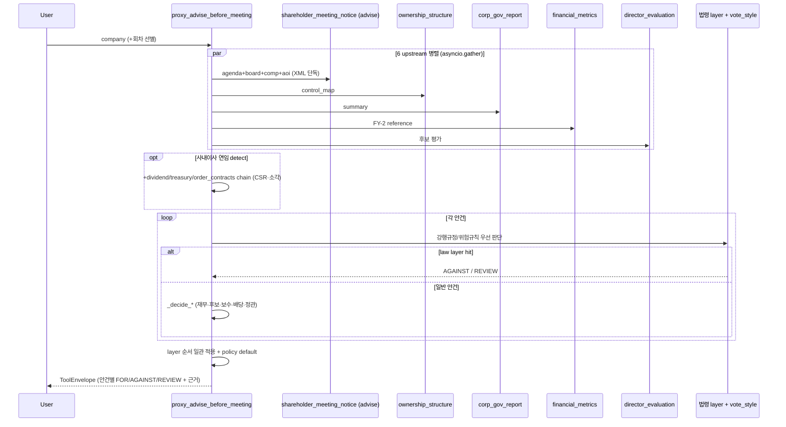

# proxy_advise_before_meeting

## 한 줄 요약
주총 **사전** 안건별 의결권 권고 + 명확한 결정 근거 한 번에. 1회 호출로 결정 + facts + risk + 정책 근거 + 후보 raw 모두.

## 단순화 (2026-05-05)
이전 10 scope 구조 → **scope param 폐지, 항상 decisions** (단일).
Specialized 정보 (agenda 트리, 후보 raw, 재무 51 지표 등)는 각 data tool 직접 호출 권장:
- 안건/이사후보 → [[shareholder_meeting_notice]]
- 재무 detail → [[financial_metrics]]
- 거버넌스 → [[corp_gov_report]]
- 지분/5%블록 → [[ownership_structure]] / [[proxy_contest]]
- 가치제고 → [[value_up]]

## 사용법

```python
proxy_advise_before_meeting(
    company="KT&G",
    year=2026,
    meeting_type="annual",
    vote_style="open_proxy",
    check_audit_history=False,
)
```

## 입력 인자

| 인자 | 타입 | 필수 | 설명 | 기본값 |
|---|---|---|---|---|
| company | str | yes | 회사명 / ticker / corp_code | - |
| year | int | no | 주총 연도 (사업연도 X) | 자동 (전년) |
| meeting_type | str | no | "annual" / "extraordinary" / "auto" | "annual" |
| vote_style | str | no | `open_proxy` (default). 다른 내부 policy variant는 cross-reference용 비공개 surface이며 사용자 출력에는 실명/식별자 노출 안 함 | "open_proxy" |
| check_audit_history | bool | no | 후보 과거 회사 회계 risk overlap cross-check (+30s) | False |
| format | str | no | "md" / "json" | "md" |

## 출력 schema (decisions)

각 안건별 (`agenda_decisions[]`):

| 필드 | 의미 |
|---|---|
| `decision` | FOR / AGAINST / REVIEW / **NO_DATA** |
| `reason` | 결정 사유 한 줄 |
| `facts` | 정량 fact dict (net_income / cap_status / 1번 안건 본문 FY raw / 후보 평가 등) |
| `risk_factors` | 위험 신호 list ("완전 자본잠식", "장기연임", "이사 회계 risk 이력" 등) |
| `policy_citation` | OPM Guideline 근거 ("§재무제표 — 적정 + 잠식 없음 시 FOR" 등) |
| `policy_basis` | 공개 정책 basis (`Open Proxy guideline` 또는 `Internal policy variant`) |
| `evidence_rcept_no` | 근거 공고 (DART viewer link) |
| `agenda_action` / `appointment_type` | 신임 (`new`) / 연임 (`renewed`) auto detect. career 텍스트 회사매칭이 재선임을 신임으로 오분류(baseline 19%)하던 것을 **roster(임원현황 exctvSttus) 힌트**로 교정(260710) — `source="roster_prior"`면 정형 재직 확인으로 승격. **힌트 정체성**: 승격만(downgrade X)·roster 부재는 소집공고 결과 유지(override 금지)·미등기는 제외 |
| `candidate_review_profile` | 후보 선임 안건용 evidence bundle. 결격사유, 독립성 세부 사유, 겸직 구간, 연임/재직 시작, 추천사유/직무계획 raw, 사내이사 성과 요약을 묶어 노출 |
| `facts.*_band` | 보수 인상률, 보수 소진율, 감사 1인당 보수, 배당성향, 자사주 비율을 사람이 읽기 쉬운 구간값으로 구조화 |
| `facts.retirement_multiplier_evidence` | 퇴직금/퇴임위로금 변경 안건의 before/after 배수, 증가율, strong review signal |
| `facts.retirement_target_expansion` | 퇴직금/퇴임위로금 지급 대상이 새로 확장된 경우의 조항과 대상 키워드 |
| `facts.director_per_person_limit_krw` / `facts.audit_per_person_krw` | 총 보수한도와 인원수로 산출한 1인당 한도. decision을 바꾸기보다 REVIEW 근거 확인용 evidence |
| `facts.treasury_pct` / `facts.related_total_pct` / `facts.active_signal_count` | 이미 호출한 ownership data를 자사주/지배력 관련 안건 facts에 구조화 |
| `facts.law_detail` | 법령 layer hit 안건의 조항 대장(SSOT `law_provisions.json`) 상세 — `article`(정확한 조문번호)·`amendment_round`·`effective_date`·`obligation_date`(유예도래일)·`applies_to`(적용대상 티어)·`threshold_decree`(자산 임계 시행령 조문)·`first_agm_trigger`. `reason`에도 `📋 조항 상세:` 한 줄로 노출 (260709) |
| `facts.raw_text_fallback` / `facts.parsing_quality` | 구조화 파싱 실패(`decision=NO_DATA`) 안건에 한해, 소집공고 원문에서 해당 안건 주변을 발췌해 첨부(`parsing_quality="low_fallback_to_raw"`). 파싱이 안 돼도 사람/LLM이 원문을 직접 읽고 판단 (260710) |

진단 필드:

| 필드 | 의미 |
|---|---|
| `data.timings_ms` | `resolve_company`, `prewarm_corp_codes`, `upstreams_total`, `upstream.*`, `notice_doc_reuse`, `decision_engine`, `total` 등 stage별 소요 시간(ms). timeout/지연 병목 확인용. |
| `warnings` (무결성 시그널, 260625) | 추가 호출 0으로 `expected × 결과None/0`의 AND 자동감지 — corp_gov(compliance None·준수율 교차검증 불일치·주주필드 PARTIAL), financial(금융업/지주 revenue None=`sector_na` 정당 vs `core_field_null` 진짜 실패), director(인사안건>0인데 후보0=zero-candidate, silent empty 방지), ownership(`control_map.blocks_present`). 데이터 신뢰성·'정당 N/A vs 진짜 실패' 구분용. large 100사+전수 false positive 0. |

후보 평가 (`candidates_evaluations[]`):

| 필드 | 의미 |
|---|---|
| 독립성 / 결격사유 / 충실성 | 자동 판단 (Korean 자연 라벨: "독립적" / "약한 우려" / "우려" 등) |
| main_job | 현 직책 (전문성 hint) |
| recommendation_reason_raw | 추천사유 (회사 본문 raw) |
| career_company_groups | 경력 (회사·기간) |
| audit_history_check | 과거 회사 회계 risk overlap (옵션) |
| **performance** | **사내이사 연임 후보 한정** — 재직 중 회사 운영 성과 매트릭스 2x3 (ROE/부채비율/CSR × avg/trend), 6 cell 점수, classification good/moderate/weak/bad, rationale 한국어. **점수 미반영 fact**: 영업이익률(본업 수익성 — ROE 왜곡 보완, `core_profitable` 본업 흑/적자) + 수주·해지(order_contracts signal_summary — 적자기업 미래매출 가시성). 적자기업이 ROE만으로 부당하게 깔리지 않게 해석 단서로 분리 (자세히는 [[260505_1700_decision_inside-director-performance-matrix]]) |

## Flow



## 6 upstream chain (병렬)

1. shareholder_meeting (**advise** scope — agenda+board+comp+aoi, results 제외 / 회차 선별 1회. 260623: 4-scope summary·agenda·comp·aoi를 통합, results는 proxy_advise 미사용이라 fetch 회피)
2. ownership_structure (control_map)
3. corp_gov_report (summary)
4. financial_metrics (FY-2 reference, 안정 데이터)
5. director_evaluation (후보 평가)
6. agm_first_agenda_fy (1번 안건 본문 FY raw 추출)

**+ 사내이사 연임 후보 detect 시 추가 chain (회사 단위 1회)**:
7. dividend (history, 10년) — CSR avg/trend 계산
8. treasury_share (summary, **동적 lookback** 36~120개월) — 소각 events. 가장 오래 재직한
   사내이사 기준 `(target-min(earliest_start)+2)*12`로 좁힘(상한 120, detect fail시 120).
   소각은 재직기간만 CSR에 쓰여 정확도 보존(20사 검증 mismatch 0)
9. financial_metrics (yearly) — ROE/부채비율 시계열 + **영업이익률**(점수 미반영 fact)
10. order_contracts (max_documents=10 경량화) — 수주·해지 signal_summary fact (점수 미반영)

## 결정 logic

OPM 자체 함수들 + vote_style 정책 wire:
- `_decide_director_election` (사외/사내·결격·독립성·장기연임). 사외이사: 결격→AGAINST / 독립성·장기연임→REVIEW / clean→FOR. **사내이사: 결격→AGAINST / 재직성과 bad·weak→REVIEW / good·moderate→FOR** (성과는 "법정 결격이 아니므로" 최악도 REVIEW — 자동 AGAINST 아님).
  - **장기연임 — 법률 정정(260710 lawyer)**: 종전 "5년 룰 위반" 문구는 법적으로 부정확(위반할 성문
    규정이 없음)이라 **삭제**. 5년 = OPM 자체 보수적 조기경보(특정 법정/지침 수치 아님). HARD 결격 =
    **상법 시행령 §34⑤**(동일 상장회사 6년 초과 / 계열 합산 9년 초과 → 사외이사 결격). 우리 tenure는
    floor(과소계상)이고 동일회사 vs 계열 합산을 구분 못 해 결격을 사실확정할 수 없음 → **tenure만으로
    AGAINST(결격 확정) 금지**. 따라서 **감사위원도 종전 AGAINST → REVIEW로 하향**(감사=사외 자격 동일
    문턱). 6년 경계로 reason만 tiering: 5–6년="소프트 경보, 결격 미달" / 6년+="§34⑤ 결격 해당 가능,
    계열 합산·과소계상 원문 확인 권고". 감사/사외 모두 REVIEW.
  - 장기연임 **감지**는 ① careerDetails 키워드("재선임/연임/중임", **사외/감사 role만**) + ② **재직연수**
    (같은 회사 5년+, **사외이사/감사 재직 item만** `outside_earliest_start` 기반·진행중 재직만 — 임직원
    재직 과대계상 제외) + ③ **roster tenure(hffc_pd)** — roster_prior로 승격된 후보는
    career earliest_start가 없어 ②가 놓치므로, 임원현황 재직기간을 floor로 써서 catch(260710 Item1,
    `source="roster_tenure"`). hffc는 재선임 시 기산점 리셋로 과소계상 → false-positive 낮음(≥5면 확실).
    사유는 tenure/roster 기반이면 실제 근거를 정직 표기(키워드 발견이라 거짓 안 함).
  - **최대주주관계 rescue(260710 Item2c/H2)**: 소집공고 최대주주관계가 비면 roster
    `mxmm_shrholdr_relate`를 **힌트로 채움**(fill-when-missing, 소집공고 값 있으면 override 금지).
    단 '계열회사 임원' 등은 삼성 등이 독립 사외이사 전원에 채우는 **형식적 boilerplate**라 승격 금지 —
    친족/최대주주 실관계만 weak_concerns 승격, 그 외는 provenance만 기록(ground-truth 오탐 방지).
  - 260710 계산-후-폐기 신호 반영: **겸직 과다**(`concurrent_outside_directors=strong_concerns_concurrent`, 타사 사외이사 3곳+)→**REVIEW**(overboarding). **최대주주 관계 약한 신호**(`weak_concerns`)는 calibration상 결정은 FOR 유지하되 reason을 정직화("모두 clean" 거짓 금지, 발행회사/계열 관계 표기 명시). 개별 이사/감사위원 sub-안건이 "사내이사 김이태"처럼 "선임" 키워드 없이 와도 부모 상속으로 올바른 검증 경로 진입(삼성카드 auto-FOR 사고). 후보 이름 영문 병기(`도진명 (Jim Myong Doh)`)도 core-name 매칭으로 eval 연결.
- `_decide_financial_statements` (완전 자본잠식→AGAINST / 비적정 감사의견→AGAINST / 적정+정상→FOR)
- `_decide_director_compensation` (이사 보수한도 13 분기 — 자본잠식·소진율<30·적자/yoy<0+인상·50%+ 인상 등 → **전부 REVIEW/FOR, AGAINST 없음**)
- `_decide_audit_compensation` (감사 보수한도 11 분기 — 1인당 과소/50%+인상+1인당과다 등 → **REVIEW/FOR만**)
- `_decide_retirement_pay` (퇴직금 12 분기 — 황금낙하산·사외이사 퇴직금·지급률 2배수+ → **REVIEW/FOR만**)
- `_decide_articles_amendment` 안에서 정관변경에 묶인 퇴직금/보수한도 hybrid 처리
- `_decide_dividend` (완전 자본잠식·적자·배당성향 200%+→REVIEW / 리츠·절차·흑자→FOR → **AGAINST 없음**)
- `_decide_articles_amendment` (집중투표 배제 등 위험 키워드 → **REVIEW**; AGAINST는 법령 layer에서만)
- `_decide_treasury_share` (소각→FOR / 처분→REVIEW)
- `_apply_policy_default` (vote_style 정책 default가 case_by_case 아니면 OPM 결정 override)

> **AGAINST 발생 범위 (실제 코드 기준)**: ① 재무제표(완전 자본잠식·비적정 감사의견) ② 후보 결격(red_flag) ③ **법령 layer 강행규정 직접 hit**(집중투표 배제 신설·감사위원 분리선출 축소·독립이사 1/3 미달·자사주 합병/분할 신주배정). **그 외 모든 위험 신호(보수 과다·퇴직금·자사주 처분·배당 과다·정관 우회·사내이사 성과 부진)는 REVIEW.** 정책 문서(open-proxy-guideline)의 "against" 입장은 *지향*이며, 자동 판정으로 구현된 것과 별개다.

## Layer consistency guarantee (2026-05-25)

`proxy_advise_before_meeting`은 모든 안건을 억지로 하나의 법령 layer에 매핑하지 않는다. 보장 범위는 **파싱된 안건에 대해 동일한 순서로 판단 layer와 guardrail을 적용한다**는 것이다.

적용 순서:

1. `shareholder_meeting_notice`에서 full agenda tree와 relation metadata를 받는다.
2. 법령 강행규정/위험규칙에 해당하면 law layer가 먼저 판단한다.
3. law layer hit가 없고 안건이 `procedural`, `conditional`, `alternative`이면 자동 FOR/AGAINST 대신 REVIEW로 둔다.
4. 일반 안건은 기존 decision path로 간다.
   - 재무제표/배당: 재무·배당 decision
   - 이사/감사위원 선임: 후보 평가 decision
   - 보수/퇴직금: compensation/retirement decision
   - 정관변경: law layer + 정관변경 decision
5. 위 분기에도 걸리지 않는 일반/저위험 안건은 policy default를 적용한다.

따라서 "모든 기업의 모든 안건이 law layer에 걸린다"는 보장은 하지 않는다. 대신 KOSPI300 기준으로 주총 소집공고 파싱은 `exact` 298 / `no_filing` 2 / `requires_review` 0까지 확인했고, 파싱된 안건에는 relation metadata와 동일한 layer 적용 순서가 일관되게 제공된다.

## 검증

- ralph 27 iter G2 99.36% (vs 8 운용사 majority, 4+ vote case)
- ralph framework iter1~8 KOSPI 100 + KOSDAQ 50 (566 후보 / 1271 안건)
  - G1 4 dimension 노출률 100%
  - G2 NO_DATA false-positive 0%
  - G3 신임/연임 classified 99.5%, 사내 false-new 0%
  - G4 1번 안건 FY raw 추출 98.6%
- ralph 260505 사내이사 성과 매트릭스 (KOSPI 100 + KOSDAQ 50, n=128):
  - G1 classification 노출률 100% (≥99%)
  - G2 적자 16건 모두 special rule 작동, 자본잠식 0건
  - G3 bad→AGAINST, weak→REVIEW 분기 작동 (한화오션 김희철, HD현대중공업 금석호 등)
  - G4 distribution good 29.7 / mod 45.3 / weak 18.0 / bad 7.0 — 모든 target band 충족
- ralph 260505 보수/퇴직 분기 정밀화 (KOSPI 200 + KOSDAQ 50, n=226):
  - G1 파싱 성공률 director 99.2 / audit 100 / retirement 100
  - G2 trigger 정확도 100% — AGAINST 5건 (피에스케이/피에스케이홀딩스/GST 지급률 2배수+ / 카카오페이 사외이사 퇴직금 / 퓨쳐메디신 자본잠식+인상)
  - G3 운용사 4+ majority 정합 100% (director 11/11, audit 1/1)
  - G4 reference rule 정합 100% — 모든 AGAINST가 참조 보수/감사보수/퇴직금 규칙 + OPM Open Proxy v1.3 #6/#7/#8 trigger와 일치
  - 정관 안에 묶인 퇴직금/보수 hybrid 통합 (코붕이 의견)
  - financial_metrics summary에 prev_net_income/yoy 노출 → 흑자+yoy<0 trigger 활성화
- 260525 agenda relation / 주총 소집공고 parser 재검증:
  - KOSPI300 재실행 exact 298 / no_filing 2 / requires_review 0
  - `procedural`, `conditional`, `alternative`, `cumulative_related` relation metadata 노출
  - 법령 layer hit가 없는 절차성/조건부/대안형 안건은 자동 FOR 대신 REVIEW guardrail 적용
  - 상세: [[260525_0200_audit_agenda-relation-kospi300]]

## 미수집 (의도적 제외)

- 형사 처벌 / 사적 관계 / 동명이인 (hard-fail)
- 1주당 액면가 (treasury 공시에 없음)
- 1일 매수/매도 한도 (분석 가치 낮음)

## 변경 이력

- 2026-07-10: **장기연임 tenure를 '사외이사/감사 재직'만 세도록 정정 (Path A 과대계상 해소)** — 종전
  `earliest_start`는 이 회사 **전체 경력**(대표이사·본부장·담당장 등 임직원 포함)의 최초 연도를 세서,
  임직원 출신이 사외이사로 오는 경우 재직연수를 과대계상 → false 장기연임 REVIEW. 5년 룰/§34조5항7호는
  '사외이사(감사위원 포함) 재직기간' 규정이므로 **사외이사/독립이사/감사위원/감사 career item만** 집계
  (`outside_earliest_start`). KOSPI200+KOSDAQ 전수 재검증: 종전 tenure_years flag 14건 중 **6건이 임직원
  과대계상**(SK텔레콤 CIC장/CSO 3명·대웅제약 대표이사·셀트리온 담당장·현대건설 본부장) → 제거, genuine
  사외이사/감사 장기연임 8건은 보존. + 사내이사 키워드 long_tenure cosmetic 잔재 제거(role guard). 원문
  대조로 전 케이스 검증.
- 2026-07-10: **장기연임 법률 정정 + roster tenure 연동 + 최대주주관계 rescue** (멀티에이전트 팀: lawyer·API·QA).
  ① "5년 룰 위반" 문구 삭제 — 5년=OPM 조기경보(성문 규정 아님), HARD 결격=상법 시행령 §34⑤(6년 동일회사
  /9년 계열). tenure floor·계열 미구분으로 결격 사실확정 불가 → **감사 장기연임 AGAINST→REVIEW 하향**,
  6년 경계 reason tiering. ② **Item1**: roster_prior 승격 사외이사(earliest_start 없음)의 hffc_pd를 floor로
  써 장기연임 catch(`source="roster_tenure"`) — hffc 파서 하드닝(실데이터 '2023년 03월~'·"'22.03~"·'2.0'
  다포맷, 파싱 88%→99%, over-count 오탐 8→0). ③ **Item2c/H2**: 소집공고 최대주주관계 결측 시 roster로
  채움(fill-when-missing), '계열회사 임원' boilerplate(삼성 독립 사외이사 전원 동일값)는 승격 금지·provenance만
  (ground-truth 검증으로 오탐 차단). roster는 Purpose1 fetch 재사용(추가 DART 콜 0). H4 출석률은 파싱
  0/67·8MB fetch 비용으로 라이브 미배선(director_board 온디맨드 fallback). QA 2차(부정문 substring 오탐·
  파서 over-count) 반영.
- 2026-07-10: **계산-후-폐기 신호를 decision·reason에 반영**(30사 실사용 전수조사 후속). 겸직 과다(3곳+)→REVIEW / 최대주주 약신호 reason 정직화 / 개별 이사·감사위원 sub-안건 부모 카테고리 상속(auto-FOR 우회 차단) / 후보 영문병기 이름 core-name 매칭 / FOR인데 재무 risk(적자 등) 있으면 reason에 `⚠️ 유의:` 병기 / 파싱 실패(NO_DATA) 안건에 소집공고 원문 발췌 `facts.raw_text_fallback` 폴백 / `parsing_failures`를 실제 NO_DATA 수로(죽은 메트릭 정직화).
- 2026-07-10: **장기연임 5년 룰에 재직연수(earliest_start) 반영** (갭C). 키워드 없이 5년+ 재직한 사외이사 blind spot 해소. QA 검토 반영 — 진행중 재직만 신뢰(과거 재직 오탐 방지)·사유 정직화. 짧은 지주명 계열사 과대계상은 기존 renewed 감지 상속 한계(별도 과제).
- 2026-07-09: **법 적용 판단을 today→주총일 기준**으로(소집공고 notice.datetime; 미파싱 시 today 폴백). 시행 전 주총 오발화 방지. + **근거 심화**: law-layer hit 안건 `reason`·`facts.law_detail`에 조항 대장(SSOT) 조문·유예도래일·적용 티어·시행령 임계 노출. 상세: [[rules/laws/README]].
- 2026-05-05: scope 10 → 1 (decisions만), specialized scope 폐지 (raw는 각 tool 직접 호출). proxy_guideline service archive (실 호출 X 확인).
- 2026-05-04: framework enrichment ralph (facts/risk/citation/근거공고/후보 raw + 신임·연임 auto detect + 1번안건 FY raw)
- 2026-05-04: rename (구 advise_vote_before_meeting) + 9 scope 추가
- 2026-05-02: 구 advise_vote_before_meeting

## ref

- Word 보고서 설계: [[proxy_advise_word_report_design]]
- 사후 결과: [[shareholder_meeting_results]]
- 사전 안건 raw: [[shareholder_meeting_notice]]
- agenda relation/parser audit: [[260525_0200_audit_agenda-relation-kospi300]]
- 지표 gap audit: [[260528_proxy_advise_metric_gap_audit]]
- archive (옛 specialized scope service): `wiki/archive/services/policy_comparison.py` / `proxy_guideline.py`
