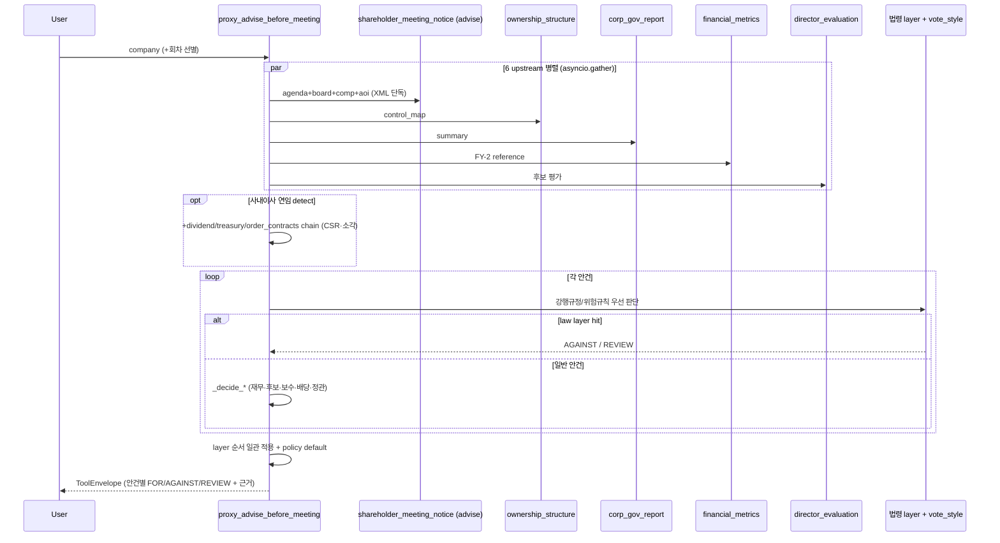

# proxy_advise_before_meeting

## 한 줄 요약
주총 **사전** 안건별 의결권 권고 + 명확한 결정 근거 한 번에. 1회 호출로 결정 + facts + risk + 정책 근거 + 후보 raw 모두.

## 단순화 (2026-05-05)
이전 10 scope 구조 → **scope param 폐지, 항상 decisions** (단일).
Specialized 정보 (agenda 트리, 후보 raw, 재무 51 지표 등)는 각 data tool 직접 호출 권장:
- 안건/이사후보 → [[shareholder_meeting_notice]]
- 재무 detail → [[financial_metrics]]
- 거버넌스 → [[corp_gov_report]]
- 지분/5%블록 → [[ownership_structure]] / [[proxy_contest]]
- 가치제고 → [[value_up]]

## 사용법

```python
proxy_advise_before_meeting(
    company="KT&G",
    year=2026,
    meeting_type="annual",
    vote_style="open_proxy",
    check_audit_history=False,
)
```

## 입력 인자

| 인자 | 타입 | 필수 | 설명 | 기본값 |
|---|---|---|---|---|
| company | str | yes | 회사명 / ticker / corp_code | - |
| year | int | no | 주총 연도 (사업연도 X) | 자동 — 최신 소집공고(12개월 lookback) 기준 회차 (260723 변경, 종전 달력 전년). 공고 미발견 시 전년 fallback + warning. 응답 `year_resolution`에 선택 근거, 종료된 회차면 `meeting_closed_hint` 동봉 |
| meeting_type | str | no | "annual" / "extraordinary" / "auto" | "annual" |
| vote_style | str | no | `open_proxy` (default). 다른 내부 policy variant는 cross-reference용 비공개 surface이며 사용자 출력에는 실명/식별자 노출 안 함 | "open_proxy" |
| check_audit_history | bool | no | 후보 과거 회사 회계 risk overlap cross-check (+30s) | False |
| segment_context_chars | int | no | 부문 매핑 실패·정형 저신뢰 시 첨부되는 부문표 원문 발췌 길이 (clamp 1000~30000). 잘리면 응답에 전체 길이 + 재조회 경로(business_details 직접 조회 권장 / 파라미터 증액 재호출) 안내 — 호출 AI 자가조정용 (260723) | 8000 |
| format | str | no | "md" / "json" | "md" |

## 출력 schema (decisions)

각 안건별 (`agenda_decisions[]`):

| 필드 | 의미 |
|---|---|
| `decision` | FOR / AGAINST / REVIEW / **NO_DATA** |
| `reason` | 결정 사유 한 줄 |
| `facts` | 정량 fact dict (net_income / cap_status / 1번 안건 본문 FY raw / 후보 평가 등) |
| `risk_factors` | 위험 신호 list ("완전 자본잠식", "장기연임", "이사 회계 risk 이력" 등) |
| `policy_citation` | OPM Guideline 근거 ("§재무제표 — 적정 + 잠식 없음 시 FOR" 등) |
| `policy_basis` | 공개 정책 basis (`Open Proxy guideline` 또는 `Internal policy variant`) |
| `evidence_rcept_no` | 근거 공고 (DART viewer link) |
| `agenda_action` / `appointment_type` | 신임 (`new`) / 연임 (`renewed`) auto detect. career 텍스트 회사매칭이 재선임을 신임으로 오분류(baseline 19%)하던 것을 **roster(임원현황 exctvSttus) 힌트**로 교정(260710) — `source="roster_prior"`면 정형 재직 확인으로 승격. **힌트 정체성**: 승격만(downgrade X)·roster 부재는 소집공고 결과 유지(override 금지)·미등기는 제외 |
| `candidate_review_profile` | 후보 선임 안건용 evidence bundle. 결격사유, 독립성 세부 사유, 겸직 구간, 연임/재직 시작, 추천사유/직무계획 raw, 사내이사 성과 요약을 묶어 노출 |
| `facts.*_band` | 보수 인상률, 보수 소진율, 감사 1인당 보수, 배당성향, 자사주 비율을 사람이 읽기 쉬운 구간값으로 구조화 |
| `facts.retirement_multiplier_evidence` | 퇴직금/퇴임위로금 변경 안건의 before/after 배수, 증가율, strong review signal |
| `facts.retirement_target_expansion` | 퇴직금/퇴임위로금 지급 대상이 새로 확장된 경우의 조항과 대상 키워드 |
| `facts.director_per_person_limit_krw` / `facts.audit_per_person_krw` | 총 보수한도와 인원수로 산출한 1인당 한도. decision을 바꾸기보다 REVIEW 근거 확인용 evidence |
| `facts.treasury_pct` / `facts.related_total_pct` / `facts.active_signal_count` | 이미 호출한 ownership data를 자사주/지배력 관련 안건 facts에 구조화 |
| `facts.law_detail` | 법령 layer hit 안건의 조항 대장(SSOT `law_provisions.json`) 상세 — `article`(정확한 조문번호)·`amendment_round`·`effective_date`·`obligation_date`(유예도래일)·`applies_to`(적용대상 티어)·`threshold_decree`(자산 임계 시행령 조문)·`first_agm_trigger`. `reason`에도 `📋 조항 상세:` 한 줄로 노출 (260709) |
| `facts.raw_text_fallback` / `facts.parsing_quality` | 구조화 파싱 실패(`decision=NO_DATA`) 안건에 한해, 소집공고 원문에서 해당 안건 주변을 발췌해 첨부(`parsing_quality="low_fallback_to_raw"`). 파싱이 안 돼도 사람/LLM이 원문을 직접 읽고 판단 (260710) |

진단 필드:

| 필드 | 의미 |
|---|---|
| `data.timings_ms` | `resolve_company`, `prewarm_corp_codes`, `upstreams_total`, `upstream.*`, `notice_doc_reuse`, `decision_engine`, `total` 등 stage별 소요 시간(ms). timeout/지연 병목 확인용. |
| `warnings` (무결성 시그널, 260625) | 추가 호출 0으로 `expected × 결과None/0`의 AND 자동감지 — corp_gov(compliance None·준수율 교차검증 불일치·주주필드 PARTIAL), financial(금융업/지주 revenue None=`sector_na` 정당 vs `core_field_null` 진짜 실패), director(인사안건>0인데 후보0=zero-candidate, silent empty 방지), ownership(`control_map.blocks_present`). 데이터 신뢰성·'정당 N/A vs 진짜 실패' 구분용. large 100사+전수 false positive 0. |

후보 평가 (`candidates_evaluations[]`):

| 필드 | 의미 |
|---|---|
| 독립성 / 결격사유 / 충실성 | 자동 판단 (Korean 자연 라벨: "독립적" / "약한 우려" / "우려" 등) |
| main_job | 현 직책 (전문성 hint) |
| recommendation_reason_raw | 추천사유 (회사 본문 raw) |
| career_raw | 경력 — 소집공고 세부경력 **원문**(기간·내용). 260730 에 쪼갠 `career_company_groups` 를 폐기하고 이걸로 대체 |
| audit_history_check | 과거 회사 회계 risk overlap (옵션) |
| **performance** | **사내이사 연임 후보 한정** — 재직 중 회사 운영 성과 매트릭스 2x3 (ROE/부채비율/CSR × avg/trend), 6 cell 점수, classification good/moderate/weak/bad, rationale 한국어. **점수 미반영 fact**: 영업이익률(본업 수익성 — ROE 왜곡 보완, `core_profitable` 본업 흑/적자) + 수주·해지(order_contracts signal_summary — 적자기업 미래매출 가시성) + **담당부문 성과 `segment_signal`**(260723 Phase 1 — 부문장 출신 후보만, 커리어→business_details segments 보수적 매핑(정확히 1개 매칭·정형 OK만), 최근 3개 사업연도 부문 매출·영업이익, `excluded_years`로 저신뢰 제외 연도 명시, `segment_signal_status`로 skip 사유 기록). 적자기업이 ROE만으로 부당하게 깔리지 않게, 부문장 출신이 전사 실적만으로 깔리지 않게 해석 단서로 분리 (자세히는 [[260505_1700_decision_inside-director-performance-matrix]]) |

- 2026-07-30: **정형 데이터로 소집공고를 교차검증** — 안 쓰던 임원현황 필드 활용 시작.
  목표를 다시 잡았다(사용자 지적): 등기 여부만이 아니라 **후보 정보 전체**를 정형으로 검증한다.
  임원현황(`exctvSttus`)에 있는데 안 쓰던 필드: `tenure_end_on`(임기 만료일, 등기 96.3%) ·
  `fte_at`(상근 여부, 100%) · `chrg_job`(담당업무, 98.6%) · `main_career`(주요경력, 98.6%) ·
  `ofcps`(직위) · `sexdstn`(성별). **전부 추가 DART 콜 0** — 이미 응답에 실려 온다.
  - **roster 사다리 회귀 검증**(29사·후보 134명, 사업보고서 rung vs 3분기 rung): 소비자 3종
    (`apply_roster_prior`·`msr_rescue`·`board_tenure`) 결과 90.3% 동일. 다른 9.7% 중
    미래에셋증권 3명이 심각했다 — 사업보고서로 확정한 등기 시작이 3분기에서는 추정으로
    되돌아갔다(김미섭 2021→1994). 원인은 3분기보고서에 그 사람들이 **아예 없던 것**
    (사업보고서 157행·등기 7명 → 3분기 1행·등기 0명). 분·반기는 임원현황 기재를 생략할 수
    있다(자본시장법 시행령 §170). → rung 채택 조건을 「행 존재」에서 **「등기 이사회 구성원 존재」**로
    바꿨다(`_roster_has_board_member`). `director_board` 의 분기 fallback 에도 같은 게이트.
    남은 ±1년 차이는 회사가 재직기간을 연 단위로 반올림해 적기 때문이라 구조적이다.
  - **사외이사 §382③1호 검산**(`apply_roster_employee_check`): 소집공고는 결격사유를
    「해당사항 없음」이라고만 적는다(실측 84.2%). 직전 정기보고서에 이 회사 **상근** 임원
    (사외이사 아님)으로 기재돼 있으면 그 사실을 노출한다. **단정하지 않는다** — 스냅샷 하나로
    「최근 2년」을 확정할 수 없고 동명이인 위험이 있다. 생년 대조가 안 되면 신호로 쓰지 않는다.
    실측 33사·사외/감사위원 후보 62명: **오탐 0 · 진짜 발동 0**. 저빈도·고심각 가드다.

## 260730 발견 — 안건 제목 뭉침으로 roleType 이 오배정된다 (미해결)

§382③ 검산의 오탐을 추적하다 나온 별건이다. 안건 제목이 여러 안건으로 뭉쳐 오면
뒤 안건의 직위가 앞 후보의 `roleType` 에 붙는다.

```
제목: 「사내이사 정인철 선임의 건 (임기 3년) 제3-3호 의안 : 사외이사 김대근 선임의 건」
→ 정인철 roleType = '사외이사'   (실제로는 사내이사 후보)
```

캐시 소집공고 479건 전수 — 제목이 역할을 명시한 후보 363명 중 **55명(15.2%) 불일치**:

| 방향 | 인원 | 영향 |
|---|---|---|
| 제목 사내이사 → roleType `이사` | 36 (9.9%) | 정밀도 손실(독립성 평가는 올바르게 건너뜀) |
| **제목 사내이사 → roleType `사외이사`** | **11 (3.0%)** | **사내이사에게 독립성 평가 오적용** |
| 제목 사내이사 → roleType `감사위원회` | 3 (0.8%) | 감사위원 평가 오적용 |
| **제목 사외이사 → roleType `이사`** | **2 (0.6%)** | **독립성 평가 누락 — 결격을 놓친다** |
| 제목 사외이사 → roleType `감사위원회` | 3 (0.8%) | 감사위원도 사외이사라 영향 작음 |

실질 오류 ~16명(4.4%). 임시 방어로 `names_titled_inside_director` 를 만들어
§382③ 검산에서만 걸러냈다(공고 **전체** 제목을 스캔 — 지금 안건 제목만 보면 「이사 선임의 건」
같은 일반 제목에서 오탐이 남는다). **근본 수정은 미실행** — `roleType` 을 고치면 독립성 평가와
결정 경로가 바뀌므로 결정 before/after 전수 회귀가 선행돼야 한다.

## Flow



## 6 upstream chain (병렬)

1. shareholder_meeting (**advise** scope — agenda+board+comp+aoi, results 제외 / 회차 선별 1회. 260623: 4-scope summary·agenda·comp·aoi를 통합, results는 proxy_advise 미사용이라 fetch 회피)
2. ownership_structure (control_map)
3. corp_gov_report (summary)
4. financial_metrics (FY-2 reference, 안정 데이터)
5. director_evaluation (후보 평가)
6. agm_first_agenda_fy (1번 안건 본문 FY raw 추출)

**+ 사내이사 연임 후보 detect 시 추가 chain (회사 단위 1회)**:
7. dividend (history, 10년) — CSR avg/trend 계산
8. treasury_share (summary, **동적 lookback** 36~120개월) — 소각 events. 가장 오래 재직한
   사내이사 기준 `(target-min(earliest_start)+2)*12`로 좁힘(상한 120, detect fail시 120).
   소각은 재직기간만 CSR에 쓰여 정확도 보존(20사 검증 mismatch 0)
9. financial_metrics (yearly) — ROE/부채비율 시계열 + **영업이익률**(점수 미반영 fact)
10. order_contracts (max_documents=10 경량화) — 수주·해지 signal_summary fact (점수 미반영)

## 결정 logic

OPM 자체 함수들 + vote_style 정책 wire:
- `_decide_director_election` (사외/사내·결격·독립성·장기연임). 사외이사: 결격→AGAINST / 독립성·장기연임→REVIEW / clean→FOR. **사내이사: 결격→AGAINST / 재직성과 bad·weak→REVIEW / good·moderate→FOR** (성과는 "법정 결격이 아니므로" 최악도 REVIEW — 자동 AGAINST 아님).
  - **장기연임 — 법률 정정(260710 lawyer)**: 종전 "5년 룰 위반" 문구는 법적으로 부정확(위반할 성문
    규정이 없음)이라 **삭제**. 5년 = OPM 자체 보수적 조기경보(특정 법정/지침 수치 아님). HARD 결격 =
    **상법 시행령 §34⑤**(동일 상장회사 6년 초과 / 계열 합산 9년 초과 → 사외이사 결격). 우리 tenure는
    floor(과소계상)이고 동일회사 vs 계열 합산을 구분 못 해 결격을 사실확정할 수 없음 → **tenure만으로
    AGAINST(결격 확정) 금지**. 따라서 **감사위원도 종전 AGAINST → REVIEW로 하향**(감사=사외 자격 동일
    문턱). 6년 경계로 reason만 tiering: 5–6년="소프트 경보, 결격 미달" / 6년+="§34⑤ 결격 해당 가능,
    계열 합산·과소계상 원문 확인 권고". 감사/사외 모두 REVIEW.
  - 장기연임 **감지**는 ① careerDetails 키워드("재선임/연임/중임", **사외/감사 role만**) + ② **재직연수**
    (같은 회사 5년+, **사외이사/감사 재직 item만** `outside_earliest_start` 기반·진행중 재직만 — 임직원
    재직 과대계상 제외) + ③ **roster tenure(hffc_pd)** — roster_prior로 승격된 후보는
    career earliest_start가 없어 ②가 놓치므로, 임원현황 재직기간을 floor로 써서 catch(260710 Item1,
    `source="roster_tenure"`). hffc는 재선임 시 기산점 리셋로 과소계상 → false-positive 낮음(≥5면 확실).
    사유는 tenure/roster 기반이면 실제 근거를 정직 표기(키워드 발견이라 거짓 안 함).
  - **최대주주관계 rescue(260710 Item2c/H2)**: 소집공고 최대주주관계가 비면 roster
    `mxmm_shrholdr_relate`를 **힌트로 채움**(fill-when-missing, 소집공고 값 있으면 override 금지).
    단 '계열회사 임원' 등은 삼성 등이 독립 사외이사 전원에 채우는 **형식적 boilerplate**라 승격 금지 —
    친족/최대주주 실관계만 weak_concerns 승격, 그 외는 provenance만 기록(ground-truth 오탐 방지).
  - 260710 계산-후-폐기 신호 반영: **겸직 과다**(`concurrent_outside_directors=strong_concerns_concurrent`, 타사 사외이사 3곳+)→**REVIEW**(overboarding). **최대주주 관계 약한 신호**(`weak_concerns`)는 calibration상 결정은 FOR 유지하되 reason을 정직화("모두 clean" 거짓 금지, 발행회사/계열 관계 표기 명시). 개별 이사/감사위원 sub-안건이 "사내이사 김이태"처럼 "선임" 키워드 없이 와도 부모 상속으로 올바른 검증 경로 진입(삼성카드 auto-FOR 사고). 후보 이름 영문 병기(`도진명 (Jim Myong Doh)`)도 core-name 매칭으로 eval 연결.
- `_decide_financial_statements` (완전 자본잠식→AGAINST / 비적정 감사의견→AGAINST / 적정+정상→FOR)
- `_decide_director_compensation` (이사 보수한도 13 분기 — 자본잠식·소진율<30·적자/yoy<0+인상·50%+ 인상 등 → **전부 REVIEW/FOR, AGAINST 없음**)
- `_decide_audit_compensation` (감사 보수한도 11 분기 — 1인당 과소/50%+인상+1인당과다 등 → **REVIEW/FOR만**)
- `_decide_retirement_pay` (퇴직금 12 분기 — 황금낙하산·사외이사 퇴직금·지급률 2배수+ → **REVIEW/FOR만**)
- `_decide_articles_amendment` 안에서 정관변경에 묶인 퇴직금/보수한도 hybrid 처리
- `_decide_dividend` (완전 자본잠식·적자·배당성향 200%+→REVIEW / 리츠·절차·흑자→FOR → **AGAINST 없음**)
- `_decide_articles_amendment` (집중투표 배제 등 위험 키워드 → **REVIEW**; AGAINST는 법령 layer에서만)
- `_decide_treasury_share` (소각→FOR / 처분→REVIEW)
- `_apply_policy_default` (vote_style 정책 default가 case_by_case 아니면 OPM 결정 override)

> **AGAINST 발생 범위 (실제 코드 기준)**: ① 재무제표(완전 자본잠식·비적정 감사의견) ② 후보 결격(red_flag) ③ **법령 layer 강행규정 직접 hit**(집중투표 배제 신설·감사위원 분리선출 축소·독립이사 1/3 미달·자사주 합병/분할 신주배정). **그 외 모든 위험 신호(보수 과다·퇴직금·자사주 처분·배당 과다·정관 우회·사내이사 성과 부진)는 REVIEW.** 정책 문서(open-proxy-guideline)의 "against" 입장은 *지향*이며, 자동 판정으로 구현된 것과 별개다.

## Layer consistency guarantee (2026-05-25)

`proxy_advise_before_meeting`은 모든 안건을 억지로 하나의 법령 layer에 매핑하지 않는다. 보장 범위는 **파싱된 안건에 대해 동일한 순서로 판단 layer와 guardrail을 적용한다**는 것이다.

적용 순서:

1. `shareholder_meeting_notice`에서 full agenda tree와 relation metadata를 받는다.
2. 법령 강행규정/위험규칙에 해당하면 law layer가 먼저 판단한다.
3. law layer hit가 없고 안건이 `procedural`, `conditional`, `alternative`이면 자동 FOR/AGAINST 대신 REVIEW로 둔다.
4. 일반 안건은 기존 decision path로 간다.
   - 재무제표/배당: 재무·배당 decision
   - 이사/감사위원 선임: 후보 평가 decision
   - 보수/퇴직금: compensation/retirement decision
   - 정관변경: law layer + 정관변경 decision
5. 위 분기에도 걸리지 않는 일반/저위험 안건은 policy default를 적용한다.

따라서 "모든 기업의 모든 안건이 law layer에 걸린다"는 보장은 하지 않는다. 대신 KOSPI300 기준으로 주총 소집공고 파싱은 `exact` 298 / `no_filing` 2 / `requires_review` 0까지 확인했고, 파싱된 안건에는 relation metadata와 동일한 layer 적용 순서가 일관되게 제공된다.

## 검증

- ralph 27 iter G2 99.36% (vs 8 운용사 majority, 4+ vote case)
- ralph framework iter1~8 KOSPI 100 + KOSDAQ 50 (566 후보 / 1271 안건)
  - G1 4 dimension 노출률 100%
  - G2 NO_DATA false-positive 0%
  - G3 신임/연임 classified 99.5%, 사내 false-new 0%
  - G4 1번 안건 FY raw 추출 98.6%
- ralph 260505 사내이사 성과 매트릭스 (KOSPI 100 + KOSDAQ 50, n=128):
  - G1 classification 노출률 100% (≥99%)
  - G2 적자 16건 모두 special rule 작동, 자본잠식 0건
  - G3 bad→AGAINST, weak→REVIEW 분기 작동 (한화오션 김희철, HD현대중공업 금석호 등)
  - G4 distribution good 29.7 / mod 45.3 / weak 18.0 / bad 7.0 — 모든 target band 충족
- ralph 260505 보수/퇴직 분기 정밀화 (KOSPI 200 + KOSDAQ 50, n=226):
  - G1 파싱 성공률 director 99.2 / audit 100 / retirement 100
  - G2 trigger 정확도 100% — AGAINST 5건 (피에스케이/피에스케이홀딩스/GST 지급률 2배수+ / 카카오페이 사외이사 퇴직금 / 퓨쳐메디신 자본잠식+인상)
  - G3 운용사 4+ majority 정합 100% (director 11/11, audit 1/1)
  - G4 reference rule 정합 100% — 모든 AGAINST가 참조 보수/감사보수/퇴직금 규칙 + OPM Open Proxy v1.3 #6/#7/#8 trigger와 일치
  - 정관 안에 묶인 퇴직금/보수 hybrid 통합 (코붕이 의견)
  - financial_metrics summary에 prev_net_income/yoy 노출 → 흑자+yoy<0 trigger 활성화
- 260525 agenda relation / 주총 소집공고 parser 재검증:
  - KOSPI300 재실행 exact 298 / no_filing 2 / requires_review 0
  - `procedural`, `conditional`, `alternative`, `cumulative_related` relation metadata 노출
  - 법령 layer hit가 없는 절차성/조건부/대안형 안건은 자동 FOR 대신 REVIEW guardrail 적용
  - 상세: [[260525_0200_audit_agenda-relation-kospi300]]

## 미수집 (의도적 제외)

- 형사 처벌 / 사적 관계 / 동명이인 (hard-fail)
- 1주당 액면가 (treasury 공시에 없음)
- 1일 매수/매도 한도 (분석 가치 낮음)

## 변경 이력

- 2026-07-27: **표결하지 않는 안건·검증하지 않은 후보에 찬성이 나가던 것 차단.**
  ① `NO_VOTE` 판정 신설(16건) — 상법 §449조의2로 재무제표가 이사회 결의로 갈음되면 주총은
  보고만 받는데 FOR/AGAINST가 나갔다. 정책 인용도 §449조의2로 교체한다(판정은 '표결없음'인데
  근거가 「위험 키워드 없으면 FOR」로 남아 반대로 읽혔다).
  ② 사외이사 독립성 검증이 조용히 건너뛰어진 채 clean FOR가 나갔다(667건 중 20건, 3.0%).
  후보자표에 '직위' 칸이 없으면 roleType을 구간 제목에서 추정하는데, 하위안건이 한 표에 묶이면
  첫 하위안건의 직위를 전원이 상속했다(하림지주 사외이사 2명이 사내이사로 집계). 「사외이사
  후보자여부 : 여」를 문서의 선언으로 읽어 뿌리를 고쳐 19건 해결, 남은 1건은 `declared_role`
  가드가 REVIEW로 넘긴다. 제목으로 파싱을 덮지는 않는다 — 불일치 156건 중 137건은 세분도
  차이(사내이사 vs 이사 106)나 이미 보수적인 방향(사내→사외 11)이라 덮으면 함께 깨진다.
  ③ 추천사유가 후보 전원에게 같은 값으로 붙던 것 → 후보별 분리(공고는 하위안건마다 '마. 추천
  사유'를 따로 두는데 마지막 것이 앞을 덮었다). 확정 못 하는 64건(4.6%)은 `recommendation_
  reason_shared`로 '구간 공통 문면'임을 밝힌다. 주주제안 후보의 빈 추천사유는 메우지 않는다 —
  이사회 추천이 없는 게 정상이고, 메우면 분쟁에서 이사회/주주제안 후보의 경계가 지워진다.
  ④ 준비금 재분류를 배당 경로에서 분리 — 「자본준비금 감액 및 이익잉여금 전입」이 '이익잉여금'
  단축경로에 걸려 배당으로 분류돼, 결손보전 회사에 「§배당 — 흑자 + 배당성향 적정 시 FOR」를
  인용했다(12건 중 11건, 2건은 「결손보전을 위한」). 판정은 전후 FOR 동일 · 근거만 교정.
  ⑤ 합병·분할·주주제안이 자동 찬성으로 새던 것 차단 + **분류 카테고리↔판정 분기 대조를 테스트로
  고정**. 같은 구멍을 네 번 막았다(stock_option·capital_reduction는 260724, merger·shareholder_
  proposal는 라이브 스윕·전수 감사에서). 새 카테고리를 만들며 분기를 빼먹으면 테스트가 잡는다.
  ⑥ 주식(액면)병합 근거 문면 교정 — 자본금이 줄지 않으므로 「자본 감소」가 아니다(실측 10건 중
  4건은 공고문에서 명시적으로 감자가 아니라고 밝힘). 판단 경로는 단주 처리 리스크 때문에 공유.
  · 검증: 라이브 80건(엣지 34 + 안건유형 표적 32 + 합병 7 + `check_audit_history=True` 7)
  크래시 0. 엣지 34곳을 '주주제안·해임·안건철회' 신호로만 골랐더니 안건 유형이 정관변경(188)·
  이사선임(143)에 쏠려 capital_reduction 1·merger 1·stock_option 0이었다(캐시에는 각각
  37·6·12곳). **표본 수가 아니라 표본 설계 문제**였고, 유형별로 다시 뽑아 ⑤를 찾았다.
  · 트레이드오프: 합병분할·주주제안·미검증 사외이사가 FOR→REVIEW로 이동 — 자동 처리가 줄고
  사람 검토가 는다. 틀린 찬성보다 낫다는 판단이지만 순이득은 아니다.


- 2026-07-10: **장기연임 tenure를 '사외이사/감사 재직'만 세도록 정정 (Path A 과대계상 해소)** — 종전
  `earliest_start`는 이 회사 **전체 경력**(대표이사·본부장·담당장 등 임직원 포함)의 최초 연도를 세서,
  임직원 출신이 사외이사로 오는 경우 재직연수를 과대계상 → false 장기연임 REVIEW. 5년 룰/§34조5항7호는
  '사외이사(감사위원 포함) 재직기간' 규정이므로 **사외이사/독립이사/감사위원/감사 career item만** 집계
  (`outside_earliest_start`). KOSPI200+KOSDAQ 전수 재검증: 종전 tenure_years flag 14건 중 **6건이 임직원
  과대계상**(SK텔레콤 CIC장/CSO 3명·대웅제약 대표이사·셀트리온 담당장·현대건설 본부장) → 제거, genuine
  사외이사/감사 장기연임 8건은 보존. + 사내이사 키워드 long_tenure cosmetic 잔재 제거(role guard). 원문
  대조로 전 케이스 검증.
- 2026-07-10: **장기연임 법률 정정 + roster tenure 연동 + 최대주주관계 rescue** (멀티에이전트 팀: lawyer·API·QA).
  ① "5년 룰 위반" 문구 삭제 — 5년=OPM 조기경보(성문 규정 아님), HARD 결격=상법 시행령 §34⑤(6년 동일회사
  /9년 계열). tenure floor·계열 미구분으로 결격 사실확정 불가 → **감사 장기연임 AGAINST→REVIEW 하향**,
  6년 경계 reason tiering. ② **Item1**: roster_prior 승격 사외이사(earliest_start 없음)의 hffc_pd를 floor로
  써 장기연임 catch(`source="roster_tenure"`) — hffc 파서 하드닝(실데이터 '2023년 03월~'·"'22.03~"·'2.0'
  다포맷, 파싱 88%→99%, over-count 오탐 8→0). ③ **Item2c/H2**: 소집공고 최대주주관계 결측 시 roster로
  채움(fill-when-missing), '계열회사 임원' boilerplate(삼성 독립 사외이사 전원 동일값)는 승격 금지·provenance만
  (ground-truth 검증으로 오탐 차단). roster는 Purpose1 fetch 재사용(추가 DART 콜 0). H4 출석률은 파싱
  0/67·8MB fetch 비용으로 라이브 미배선(director_board 온디맨드 fallback). QA 2차(부정문 substring 오탐·
  파서 over-count) 반영.
- 2026-07-29: **성과 귀속을 등기이사 재직 기간으로 한정**(사용자 실사용 지적).
  LG화학 김동춘에게 「재직 2018~2026(9년)」의 전사 ROE·부채비율·환원율을 물어 REVIEW 를 냈는데,
  소집공고 세부경력은 **2026~현재 CEO(등기) / 2025 이전은 본부장·사업부장·상무(비등기)** 다.
  호출측 AI 가 이걸 알아채고 「수동 오버라이드」를 해야 했던 자리.
  원인 셋을 순서대로 걷어냈다:
  ① `appointment_type.earliest_start` 는 **경력 전체의 최초 연도**라 비등기 시절이 포함된다
     → `board_earliest_start`(등기 직위만) 신설, 성과 매트릭스는 이것만 쓴다.
     실측: 캐시 소집공고 479건의 경력 블록 103건 중 **33건(32%)**에서 등기 최초연도가
     전체 최초연도보다 3년 이상 늦다 — 드문 케이스가 아니다.
  ② 회사/직위 분리가 「(주)LG화학 CEO 겸 첨단소재사업」/「본부장 사장」으로 잘라
     **CEO 를 회사명 쪽으로 가져가** 등기 판별이 실패했다 → 경력 항목에 원문 병기.
  ③ 등기 첫 해 실적은 전임 경영진의 것이다 → **최소 2개 사업연도** 요건(미달 시 평가 미실시).
     실측 25사에서 이에 해당하는 후보는 김동춘 1건.
  「평가하지 않음」을 「저조」처럼 렌더하거나 `총점 None/12` 을 찍던 것도 함께 교정.
  등기 시작이 근무 시작보다 늦으면 `performance.tenure_note` 로 그 사실을 밝힌다.
- 2026-07-29(2차): **등기 재직기간의 근거를 경력란 추정 → 사업보고서 임원현황(정형)으로.**
  위 ①은 여전히 **추정**이었다. 소집공고 경력란은 등기 여부를 적을 의무가 없다 —
  상법 §542조의4② + 시행령 §31③은 성명·약력·추천인·최대주주 관계·거래내역·결격사유만 요구한다.
  실측이 그대로다: 캐시 소집공고 479건의 경력 항목 **7,617개 중 「등기」 명시는 15개(0.20%)**.
  30사 77명을 임원현황과 대조하니 **추정 일치율 43%**, 삼성전자는 5명 전원 불일치
  (경력란에 「무선사업부 개발2실장」만 있는데 정형엔 「사내이사」).
  → `apply_roster_board_tenure` 신설. `rgist_exctv_at`(법정 기재사항, 캐시 302건 중 97%가 보유)로
  등기 구분을 확정하고 `hffc_pd` 로 시작연도를 잡는다. roster 는 이미 roster-prior 로 호출하므로
  **DART 추가 콜 0**. 임원현황에 없으면 추정을 덮지 않는다(침묵 삭제 금지).
  - **미등기로만 기재되면 `board_earliest_start=None` 을 확정**한다. LG화학 김동춘이 그 경우 —
    「現 CEO」였지만 2025 임원현황엔 미등기임원이라 **이번이 첫 등기 선임**이다.
  - `hffc_pd` 는 등기 구분과 **함께** 써야 한다. 미등기 행에도 연수가 찍힌다(실측 640건 ·
    삼성중공업 미등기 부사장 「6년」). 그것만 빼 쓰면 고친 버그가 그대로 재발한다.
  - 재직기간 서식 4종을 모두 읽는다 — **날짜 58%**(`2019.01.01~`) · 단위 없는 숫자 20% ·
    「N년」 14% · 「N개월」 7%. 첫 구현은 뒤 둘만 봐서 58%를 조용히 버렸다.
  - `_is_board_role` 에서 「CEO」·「이사장」 제거(상법 §317②8호가 정한 등기 지위가 아니다) +
    감사원·감사실·감사본부·감사팀 오탐 차단. **전수 회귀: 오탐 98건 제거 · 과대교정 0.**
  - `not_evaluated` 사유를 셋으로 갈랐다(미등기 확정 / 임원현황 대조 실패 / 등기 시점 미상).
  표본 113명 기준 **68%가 정형으로 확정**(등기 시작 63% + 미등기 확정 5%), 32%는 추정 유지.
  파서를 더 밀어붙이지 않은 이유: 소집공고 원문 자체가 등기를 0.2%만 밝힌다 — 파싱을 완벽히
  해도 등기 시작은 알 수 없다. 참고로 경력 파싱 성능은 연도↔역할 1:1 **43%**,
  한 기간에 직위 여러 개가 뭉치는 붕괴가 항목 10%·후보 29%다(479건 전수).
- 2026-07-29(3차, **반박 검토 반영**): 위 2차의 핵심 전제가 틀렸다 —
  **`hffc_pd`(재직기간)의 뜻은 회사마다 다르다.** 일부는 등기 재직기간이 아니라 **입사 근속연수**를
  적는다. 실측 30사 등기 190행에서 역산 취임연령이 **30세 미만인 행 11개(5.8%)**, 최악은
  **19세 전무이사**다. 그런 회사는 같은 표의 미등기 상무·전무에도 「18년」·「19년」을 쓴다.
  날짜형도 안전하지 않다(넥센타이어 「1990.05.28~」 = 그해 24세).
  그대로 두면 대한제분 이종민이 **1977~2026 = 50개 사업연도**를 개인 성과 창으로 갖는다 —
  이번에 없애려던 오류(비등기 기간 귀속)를 더 큰 규모로 재도입하는 것이다.
  - **정합성 게이트**: 역산 취임연령 < 30이면 시작연도를 **버리고** 등기 여부만 남긴다
    (보수적 = 성과 미평가). 실측 발동 3/113(3%). 게이트가 걸리면 산출물의 재직기간 출처도
    「소집공고 추정 — 임원현황 재직기간은 근속연수로 보여 쓰지 않았습니다」로 바꿔 표기한다.
  - **2차의 검증 설계에 판별력이 없었다**: 「FY2024→FY2025 같은 사람 55명의 기산점 100% 동일」은
    입사일도 고정점이라 두 가설이 같은 결과를 낸다. 배제되는 건 「현 직위 기간」 하나뿐이었다.
    판별력 있는 축은 **취임연령**이다.
  - **「미등기 확정」 분기가 사유를 안 가렸다**: 동명이인으로 걸러졌든, 「등기」·「집행임원」처럼
    해석 못 하는 표기든 전부 「미등기임원으로만 기재」로 단정했다 → 사유별로 분기.
  - **`board[0]`·`matches[0]` 순서 의존 제거** → 등기 행이 여럿이면 `min(시작연도)`.
    성과 귀속은 등기 기간 **전체**다(기타비상무이사 2012 → 사내이사 2020이면 2012).
  - **roster 사다리**: FY(N-1) 사업보고서 → 3분기 → 반기 → FY(N-2) 사업보고서(최후).
    2차에서 FY(N-1) 사업보고서를 뺐던 것을 되돌렸다 — 「누가 언제 등기됐나」는 소집공고 시점에
    이미 주총결과 공시로 공개된 사실이라 look-ahead 가 아니다(감사 전이라 그때 알 수 없는
    재무제표와 다르다). 판단 기준은 **도구 실행 시점**이다.
    FY(N-2) rung 에서는 「등기 재직 없음」을 단정하지 않는다(실측 등기 190행 중 28행(14.7%)이
    직전 1년 내 시작 — 그 사이 승진해 등기됐을 수 있다).
  - 분기·반기 임원현황은 실측 10사×4종 **100%** 실리지만 **기재 생략이 허용되는 항목**이라
    소형사에서 빌 수 있다 — 그래서 단일 소스가 아니라 사다리다.
  - **DART 콜**: 회사당 `exctvSttus` 1콜 → **최대 4콜**(보통 1). 과호출·인증 실패(020/011/012)는
    사다리를 멈춘다 — 삼키고 계속 타면 경고 없이 콜만 태운다.
  표본 113명 재측정: 등기 시작 확정 **60%** · 미등기 확정 5% · 게이트 차단 3% · 대조 실패 32%.
- 2026-07-29: **본문↔확정 재무제표 자동 검산**(`facts.fy_raw_cross_check`).
  소집공고는 사업보고서보다 먼저 나온다 — 캐시 실측 88곳 중 **78곳(89%)**, 간격 중앙 7일
  (LG화학 02-24 → 03-13). 그래서 1호 안건이 승인하려는 **당기** 수치는 DART API 에 아직 없고,
  본문 잠정 재무제표를 파싱할 수밖에 없다(감사 전·주총 승인 전 회사 자가 공시).
  **다만 본문의 「전기」와 API 의 「당기」는 같은 해**라 서로 검산이 된다.
  실측 20사: 정상 케이스 16곳 중 **14곳이 비율 1.00**, 오탐 0건(남광토건 1.09배는 감사 조정).
  그리고 같은 날 고친 매출 오파싱을 이 검산이 **잡는다**(기타영업수익을 잡았을 때 비율 0.03).
  값을 고치지는 않는다 — 어긋나면 「본문 파싱을 신뢰하지 마시고 원문을 확인하세요」라고 말한다.
  **성립 조건**(사용자 지적으로 확인): 이 등식은 `fin_year = target_year - 2` 에 의존한다.
  주총 N년 → 안건은 FY(N-1) 승인, 분석 reference 는 FY(N-2)(작년 주총에서 이미 확정된 안정 데이터).
  본문의 전기도 FY(N-2) 라 같은 해가 된다. **소집공고 시점에 API 는 그 FY(N-2) 를 이미 1년째
  갖고 있다**(1년 전 제출분) — 그래서 「그 시점에 두 데이터가 다 있느냐」는 물음에 답이 된다.
  reference 선택이 「최신 사업보고서」로 바뀌면 제출 전후로 API 가 FY(N-1) 로 옮겨가 검산이
  조용히 무너진다(실제 YoY 변동을 오탐). 소스 계약 테스트로 잡는다.
  **검산 대상은 매출·영업이익 2종**(실측 20사): 매출 16곳 중 15곳이 1.00±5%(범위 1.00~1.09) ·
  영업이익 18곳 중 17곳이 1.00±5%(0.60~1.00). **순이익은 쓰지 않는다** — 본문은 총 순이익,
  API 는 지배주주 귀속이라 개념이 달라 범위가 **-0.75~22.69배**다(하이브는 매출·영업이익이
  1.00 인데 순이익만 22.69배). 자산·부채·자본은 본문에서 당기만 넘어와 대조 상대가 없다.
  **절대액 1,000억 미만은 비율을 보지 않는다** — 남광토건 영업이익 43억 vs 73억(0.60배)은
  차이가 30억이라 오파싱이 아니라 감사 전/후 조정이다. 확장 후 재검증: 정합 18·경고 0·대조불가 2.
  **한계**: 검산 대상은 전기다. 안건이 승인하려는 **당기는 직접 검증되지 않는다** — 같은 표·같은
  행에서 뽑으므로 전기가 맞으면 당기도 맞다고 추론할 뿐이다(행 오선택은 둘 다 틀리므로 잡힌다).
- 2026-07-29: **소집공고 본문 매출 파싱 오류 + 판정 표기 한글화**(사용자 실사용 지적).
  ① LG화학 1호 안건 재무 사실란이 「당기 매출액 1조 6,468억」인데 연결 매출은 48.9조였다.
  원문을 보니 파서가 「Ⅳ. 기타영업수익 1,646,811」을 잡고 있었다 — 계정 매칭이 **부분 포함**이라
  「기타영업수익」이 키워드 「영업수익」에 걸렸고, 진짜 행인 「Ⅰ. 매출」(액 없음)은 키워드에 없었다.
  **항목번호 제거 + 접두 매칭 + 원가·총이익 명시 배제**로 교정. 캐시 소집공고 479건 전수:
  매출 확보 339→373(신규 36·소실 2) · **「매출 < 영업이익」 비정상 2→0건** · LG화학 1.65조→45.93조.
  회귀에서 **보험사 소실**(흥국화재·코리안리)이 드러나 「보험영업수익」을 명시 추가했고,
  삼성생명의 「기타영업수익」은 정상 배제로 확인. 테스트가 「매출원가·매출총이익도 매출로 걸린다」를
  잡아 배제 목록을 추가했다.
  ② **판정 표기를 한글로** — `✅ FOR`/`❌ AGAINST`/`⚠️ REVIEW` → `✅ 찬성`/`❌ 반대`/`⚠️ 검토 필요`.
  payload 의 `decision` 필드는 영문 그대로라 기계 소비자는 영향 없다.
  ③ 표 위에 **판정 뜻 안내** 추가 — 「검토 필요」가 무엇이고 무엇을 하라는 것인지(호출측 AI 가
  임의로 「수동 오버라이드」를 하게 되는 자리다).
- 2026-07-29: **AGAINST 판정 경로 실측 검증 + 크래시 1건 수정**. 그동안 검증 표본이 대형
  우량주 위주라 AGAINST 가 한 번도 안 나왔다 — 「반대를 못 내는 자문」인지 확인이 필요했다.
  웹에서 2025 사업연도 **감사의견 미달 상장폐지 사유 발생 기업 14사**(2년 연속 11사·3년 연속
  8사 중)를 추려 라이브 호출. 결과 **FOR 60 / AGAINST 2 / REVIEW 8** — AGAINST 경로는 살아
  있다(제일엠앤에스·선샤인푸드 재무제표 승인: 「완전 자본잠식 (KOSDAQ 상장폐지 사유)」).
  같은 검증에서 **도구 전체 크래시 2건**(이오플로우·한국유니온제약)이 드러났다 —
  `_decide_audit_compensation` 의 분기 9/10 이 「변경률·1인당이 **둘 다** None」일 때만 잡아,
  하나만 None 이면 default 분기의 `{audit_inc:+.0f}` 가 `NoneType.__format__` 로 터졌다.
  대형주는 둘 다 있어서 25사 스윕에도 안 잡혔고 **부실기업 표본에서만** 나왔다. 회귀 테스트 고정.
- 2026-07-29: 기존 결함 정리 — `dividend` 추세 영문(`increasing`) 한글화 + 연간 요약에 **사업연도
  표기 추가**(몇 년치인지 없으면 리포트 인용 시 위험) · `financial_metrics` 금액에 **'원' 누락**
  (「334조」→「334조원」)과 EPS 천단위 구분 · `corp_gov_report` 의 「`-백만원`」(**음수로 오독**)과
  「**0개 준수**」(파싱 실패인데 미준수 기업으로 읽힘) 교정.
- 2026-07-28: **산출물에서 엔진 내부 식별자 제거 — 사람이 읽는 문서로**(사용자 지적). 포맷은 호출측
  AI 가 다듬을 수 있지만 `financial_metrics` 같은 기술 파라미터는 애초에 나오면 안 된다. 눈으로 찾지
  않고 정규식 전수 스캔 — LG화학 1건 95건, 25사 스윕 64건 → **0건**. ① facts 필드명 70종 한글 라벨
  사전 + 값 enum 번역(`fy_current_revenue_krw=1646811000000` → 당기 매출액 1조 6,468억원) ②
  `[법령 A1-1]` → 조문(상법 제542조의7제3항), 규칙 ID 는 `law_layer_id` 필드로 분리해 🛡️ 마커·회귀
  테스트가 사유 문자열 파싱 대신 그 필드를 본다 ③ **⛔ LLM 지시 블록 700자 삭제** — 그 지시의 채널은
  tool docstring 이다(모델은 호출 전에 읽는다). 산출물에 섞으니 사람이 자기 앞으로 온 「~하지 마시오」를
  여덟 번 읽었다 ④ 카테고리 컬럼 제거(내부 enum, 사람에겐 정보 없음) ⑤ 밴드 코드 30여종 한글화 —
  **임기 상태는 라벨 사전이 3개라 한 곳만 고치면 다른 표에서 샌다**(`potential_long_tenure` 실측,
  교차 일관성 테스트로 고정) ⑥ 다른 도구 호출 시그니처 노출 제거 ⑦ **표 깨짐** — 정관 원문·조항 상세가
  셀에 줄바꿈째 들어가 마크다운 표가 무너지던 것을 표 한 줄 + 근거 절로 분리 ⑧ 금액·소수·연도 가독성.
  ⚠️ 는 성격을 갈랐다 — 판정 마커(⚠️ REVIEW)·위험 플래그(⚠️특수관계 있음)는 정보라 유지, 훈계·안내
  접두만 제거. **판정 결과는 불변**(LG화학 FOR 14/REVIEW 3 동일), 응답 23,160→19,329자.
  검증: 347 통과(신규 9) · 라이브 25사 × 4회(호출 실패 0).
- 2026-07-10: **계산-후-폐기 신호를 decision·reason에 반영**(30사 실사용 전수조사 후속). 겸직 과다(3곳+)→REVIEW / 최대주주 약신호 reason 정직화 / 개별 이사·감사위원 sub-안건 부모 카테고리 상속(auto-FOR 우회 차단) / 후보 영문병기 이름 core-name 매칭 / FOR인데 재무 risk(적자 등) 있으면 reason에 `⚠️ 유의:` 병기 / 파싱 실패(NO_DATA) 안건에 소집공고 원문 발췌 `facts.raw_text_fallback` 폴백 / `parsing_failures`를 실제 NO_DATA 수로(죽은 메트릭 정직화).
- 2026-07-10: **장기연임 5년 룰에 재직연수(earliest_start) 반영** (갭C). 키워드 없이 5년+ 재직한 사외이사 blind spot 해소. QA 검토 반영 — 진행중 재직만 신뢰(과거 재직 오탐 방지)·사유 정직화. 짧은 지주명 계열사 과대계상은 기존 renewed 감지 상속 한계(별도 과제).
- 2026-07-09: **법 적용 판단을 today→주총일 기준**으로(소집공고 notice.datetime; 미파싱 시 today 폴백). 시행 전 주총 오발화 방지. + **근거 심화**: law-layer hit 안건 `reason`·`facts.law_detail`에 조항 대장(SSOT) 조문·유예도래일·적용 티어·시행령 임계 노출. 상세: [[rules/laws/README]].
- 2026-05-05: scope 10 → 1 (decisions만), specialized scope 폐지 (raw는 각 tool 직접 호출). proxy_guideline service archive (실 호출 X 확인).
- 2026-05-04: framework enrichment ralph (facts/risk/citation/근거공고/후보 raw + 신임·연임 auto detect + 1번안건 FY raw)
- 2026-05-04: rename (구 advise_vote_before_meeting) + 9 scope 추가
- 2026-05-02: 구 advise_vote_before_meeting

## ref

- Word 보고서 설계: [[proxy_advise_word_report_design]]
- 사후 결과: [[shareholder_meeting_results]]
- 사전 안건 raw: [[shareholder_meeting_notice]]
- agenda relation/parser audit: [[260525_0200_audit_agenda-relation-kospi300]]
- 지표 gap audit: [[260528_proxy_advise_metric_gap_audit]]
- archive (옛 specialized scope service): `wiki/archive/services/policy_comparison.py` / `proxy_guideline.py`
