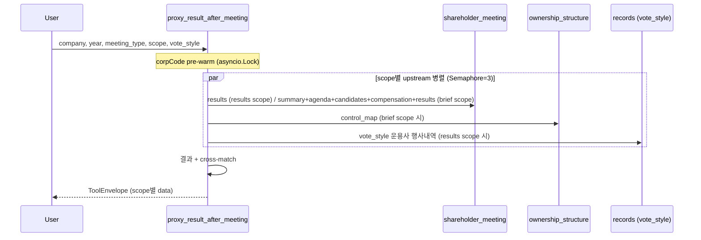

# proxy_result_after_meeting

## 한 줄 요약
주총 **소집 후** 결과 보고 (운용사 분기 의결권 보고서 스타일). 안건별 가결/부결 + 찬반율 + 우리 행사 결과 vs 실제 결과 비교 + 통합 brief render.

**의도적 단순함** — 결과 보고가 목적. 다각도 분석은 사전 [[proxy_advise_before_meeting]]에서 모두 처리. 사후엔 결과만.

## 핵심 차이 (vs 옛 recap_vote_after_meeting)
- **rename + scope 단순화** (1 → 2 scope, followup 제거)
- 옛 `prepare_vote_brief` render 흡수 → `brief` scope (사후 통합 보고서)
- 후속 공시 30일 윈도우 (배당/자사주/재편/희석) **제거** — 별개 워크플로우, 운용사가 필요 시 개별 tool 호출
- 옛 `build_campaign_brief` 사후 부분 폐기 — proxy_contest tool에 이미 충분
- multi-upstream-pattern 5 요소 적용 ([[architecture/multi-upstream-pattern]])

## 사용법
```python
proxy_result_after_meeting(
    company="삼성전자",
    year=2025,
    meeting_type="annual",
    vote_style="open_proxy",
    scope="results",
)
```

## 입력 인자
| 인자 | 타입 | 필수 | 설명 | 기본값 |
|---|---|---|---|---|
| company | str | yes | 회사명 / ticker / corp_code | - |
| year | int | no | 사업연도 | 자동 (전년) |
| meeting_type | str | no | "annual" / "extraordinary" | "annual" |
| vote_style | str | no | open_proxy / nps / a_activist / b_foreign / k_legacy 등 | "open_proxy" |
| scope | str | no | "results" / "brief" / "all" | "results" |
| format | str | no | "md" / "json" | "md" |

## 2 scope

| scope | 무엇 | 주요 upstream | 흡수 |
|---|---|---|---|
| `results` (default) | 안건별 가결/부결 + 찬반율 + 우리 행사 결과 vs 실제 결과 비교 (vote_style 운용사 행사내역 cross-match) | shareholder_meeting (results) + records | 옛 recap_vote results |
| `brief` | 분기 의결권 보고서 통합 render (회차/판구조/안건/후보/보수/결과) | shareholder_meeting (summary+agenda+candidates+compensation+results) + ownership | **vote_brief render 흡수** |

## 출력 schema (scope별)

### `results` (default)
```json
{
  "meeting_date": "2025-03-26",
  "agenda_results": [
    {"agenda_number": "1",
     "agenda_title": "재무제표 승인",
     "outcome": "passed",
     "for_pct": "98.5",
     "against_pct": "1.5",
     "attendance_pct": "75.0",
     "our_vote": "FOR",
     "match_majority": true}
  ],
  "summary": {
    "total_agendas": 8,
    "passed": 7,
    "rejected": 1,
    "our_minority_count": 2,
    "our_majority_count": 6
  }
}
```

### `brief`
```json
{
  "company_id": "...",
  "meeting_phase": "completed",
  "result_status": "passed_all",
  "ownership_snapshot": {
    "top_holder": {...},
    "related_total_pct": 30.5,
    "treasury_pct": 5.2
  },
  "agenda_titles": [...],
  "candidates_count": 3,
  "outside_director_count": 2,
  "compensation_summary": {...},
  "result_summary": {
    "passed": 7,
    "rejected": 1,
    "opposed_high": [{"agenda": "...", "opposition_rate": 35.2}]
  },
  "recommendation_log": "..."  // 운용사 brief 텍스트
}
```

## 매핑 분류
- 안건별 결과 (가결/부결/찬반율) → **success**
- 우리 행사 vs 결과 비교 → **success** (records JSON에 행사 기록 있을 때)
- 위임장 분쟁 결과 → **success / soft-fail** per parser

## Flow


## 검증

본 tool도 [[proxy_advise_before_meeting]]과 함께 검증 ralph 일부:
- 일관성 — 200×3 batch deterministic 100% (Phase 4에서 recap_vote 100% 달성)
- 정확도는 사후 결과 fact 자체이므로 별도 검증 X (DART 직접)

## 관련 공시
- [[주주총회결과]]
- [[위임장권유참고서류]]

## 관련 개념
- [[의결권]] / [[가결]] / [[부결]] / [[위임장]] / [[찬반율]]

## 흡수 매핑 (옛 tool → 새 scope)

| 옛 tool / 기능 | 처리 | 위치 |
|---|---|---|
| 옛 `recap_vote_after_meeting.results` | 유지 + cross-match 추가 | `results` scope |
| 옛 `prepare_vote_brief` (사후 render) | 흡수 | `brief` scope |
| 옛 `recap_vote.followup` (배당/자사주/재편/희석 30일 윈도우) | **제거** — 별개 워크플로우 | (운용사가 필요 시 dividend/treasury_share 등 직접 호출) |
| 옛 `build_campaign_brief` 사후 부분 | 폐기 | proxy_contest tool에서 충분 |

## 변경 이력
- 2026-05-04: rename + scope 단순화 (followup 제거) + vote_brief render 흡수 + records cross-match + multi-upstream-pattern 5 요소
- 2026-05-02: 구 recap_vote_after_meeting (rename source)
