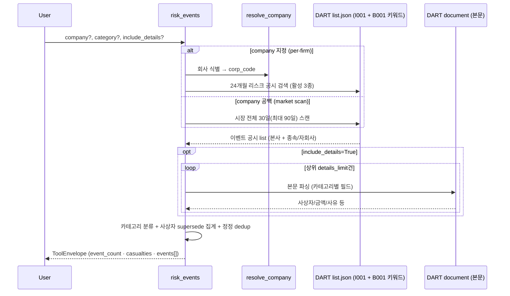

# risk_events

> 구 `serious_accident`(2026-06-11 당일 신설)를 흡수 확장. 중대재해 단독 tool로 출시 직후, 같은
> 프로파일(희소·정형·I001 키워드 타겟)의 리스크 공시 5종을 시장 90일 sweep으로 실측 발굴해
> 6카테고리 통합 tool로 재구성. 의존 사용자 없는 출시 직후가 통합 적기였음.

## 한 줄 요약
기업 리스크 이벤트 공시 통합. **활성 3종 — 중대재해 / 횡령·배임 / 생산중단·영업정지** (본사·종속/자회사 변형 포함). 파생손실·회생부도·해산 3종은 **mute** — 파서·검증 보존, 기본 조회 제외, 명시 category 요청 시에만 동작. **company 미지정 시 시장 전체 최근 30일(최대 90일) 스캔**. `include_details=True`면 카테고리별 원문 파싱 + 중대재해 사상자 집계.

## 사용법
```
risk_events(company="한화오션", include_details=True)        # 회사 24개월 전 카테고리
risk_events(company="태광산업", category="embezzlement")     # 카테고리 필터
risk_events()                                                # 시장 전체 최근 30일 스캔
```

자연어 예시:
- "한화오션 중대재해 공시 알려줘" / "최근 중대재해 발생한 기업들" (시장 스캔)
- "태광산업 횡령 배임 공시 있어?" → 혐의발생→진행→사실확인 단계 추적
- "최근 한 달 사고·사건 터진 회사 어디야?" → 시장 스캔, 6카테고리 분류

## 입력 인자
| 인자 | 타입 | 필수 | 설명 | 기본값 |
|---|---|---|---|---|
| company | str | no | 회사명 / ticker / corp_code. **공백이면 시장 전체 스캔** | "" |
| category | str | no | `serious_accident` / `embezzlement` / `derivative_loss` / `rehabilitation` / `production_halt` / `dissolution` | "" (전체) |
| start_date / end_date | str | no | YYYYMMDD | "" (company 지정 24개월 / 미지정 30일·최대 90일) |
| include_details | bool | no | True면 원문 파싱 + 사상자 집계 (DART 호출 N회 추가) | False |
| details_limit | int | no | 원문 파싱 대상 건수 (1-10) | 5 |
| format | str | no | "md" / "json" | "md" |

## Flow



## 카테고리 × 채널 매핑 (시장 90일 sweep 실측, 2026-06-11)

| category | 상태 | 키워드 | 채널 | 90일 건수 | 단계(stage) |
|---|---|---|---|---|---|
| serious_accident | **활성** | 중대재해 | I001 | 14 | 발생 / 처벌확인 |
| embezzlement | **활성** | 횡령 | I001 | 22 | 혐의발생 / 진행사항 / 사실확인 |
| production_halt | **활성** | 생산중단·영업정지 | **I001+B001** | 16+5 | 발생 / 기타 |
| derivative_loss | mute | 파생상품거래손실 | I001 | 25 | 발생 |
| rehabilitation | mute | 회생절차·부도·은행거래정지 | **I001+B001** | 34+21 | 개시신청(B) / 개시결정(I) / 폐지 / 종결 / 부도 |
| dissolution | mute | 해산사유 | **B001** 위주 | 7+13 | 발생 |

> **mute (2026-06-11 결정)**: 기본 조회(category 미지정)는 활성 3종만 검색·반환. mute 3종은
> 파서·검증(359건) 완료 상태로 코드 보존 — 명시 `category=` 요청 시 warning과 함께 동작.
> tool desc에도 비노출(라우팅 차단). 활성화는 `_ACTIVE_CATEGORIES` 한 줄 수정.

- **회생절차개시'신청'(회사 제출)=B001, 개시'결정'(법원발 거래소공시)=I001** — 양 채널 필수.
- 중대재해·횡령·파생·생산중단은 B001 90일 0건 (I001 전용) 실측.
- dissolution은 SPAC·유동화전문회사 해산이 다수 포함 — 사실 그대로 노출 (판단은 LLM).

## 출력 schema (data dict)
```json
{
  "mode": "company | market_scan",
  "category": "all | <category>",
  "event_count": {"total": N, "serious_accident": N, "embezzlement": N,
                  "derivative_loss": N, "rehabilitation": N,
                  "production_halt": N, "dissolution": N,
                  "subsidiary_reports": N, "corrections": N},
  "casualties": {"deaths": N, "injuries": N, "parsed_rows": N},
  "by_company": {"회사명": N},
  "events": [{"category": "...", "stage": "...", "rcept_dt": "...",
              "report_nm": "...", "subsidiary_report": true,
              "is_correction": false, "corp_name": "(market scan만)",
              "details": {"...카테고리별 필드..."}}],
  "usage": {"dart_api_calls": N, "mcp_tool_calls": 1}
}
```

details 카테고리별 필드:
- serious_accident: location / description / **deaths / injuries** / accident_date / labor_ministry_report_date / response_plan (+처벌확인: confirmed_date·발췌)
- embezzlement: suspect / **amount_won / equity_ratio_pct** / 발췌
- derivative_loss: **loss_amount_won / equity_ratio_pct** / 발췌
- production_halt: halted_business / **revenue_ratio_pct** / reason / 발췌
- rehabilitation: court / event_date / 발췌

## Data sources
- **DART API**: `list.json` (pblntf_detail_ty=`I001`,`B001`) + 키워드 / `document` (include_details 시 N건)
- 외부 호출: company 지정 일반 1회·최대 6회 (per-firm) / 시장 스캔 30일 실측 **44콜** (I001 36p + B001 7p + 첫페이지), 90일 ~185콜 (page cap 200). include_details +N.

## 파싱 전략
- **채널**: 회생절차개시 **'신청'(회사 제출)은 B001**, 개시 **'결정'(법원발 거래소공시)은 I001**
  이라 양 채널이 필수다. 중대재해·횡령·파생·생산중단은 I001 전용이다.
- **제목 변형 흡수**: (종속회사의주요경영사항) / (자회사의 주요경영사항) / [기재정정] /
  주요사항보고서(...) / `출자법인부도ㆍ해산사유등발생` / 괄호에 사유를 적은 generic 제목
  (`투자판단관련주요경영사항 (1차 부도 발생)` · `기타주요경영사항 ('회생절차…' 재항고 취하)`)을
  공통 처리한다.
- **사상자 supersede 집계**: 같은 사건(발생일자+장소 정규화)의 원본·정정과 **지주사/사업회사 이중
  공시**(OCI홀딩스+OCI, DL+DL이앤씨, 한화+한화에어로)는 최신 공시로 대체한다. 장소는 `㈜`/`(주)`·
  공백을 정규화한다 — 표기 차이만으로 같은 사망자가 두 번 집계된다.
- **필드 라벨은 서식마다 다르다.** 같은 파생손실도 「손실누계잔액(원)(기신고분 제외)」과
  「손실발생금액(원)」으로, 생산중단은 영업정지 서식에서 「영업정지 분야」로 적힌다. **부도 서식은
  법원 필드가 아예 없어** 느슨한 「법원」 라벨이 본문 문장을 오추출하므로 법원명 형태 가드
  (「법원」 포함 · 40자 미만)를 둔다. court·event_date 의 결측은 해당 필드가 실제로 없는
  부도·출자법인 공시의 정직한 결측이다.
- `[기재정정]` 은 본문 앞에 정정 전/후 표가 prepend 되지만 필드 추출에는 영향이 없다.
  본문이 비어 있는(<30자) 공시는 parsing failure 가드로 걸러 warning 으로 처리한다.
- 알려진 한계:
  - **제도 시점**: 거래소 중대재해 수시공시는 2025-10월부터 관측 (실측 최초 2025-10-29). 이전 구간 무공시 ≠ 무사고 — warning 자동 부착.
  - **공시 주체 편중**: 대형 원청·지주사 집중 (KOSDAQ 상위 100 보유 0, 중소형 건설 35사 0건). 중소형사·하청 무공시는 무사고 단정 불가 — 산재 통계 정본은 고용노동부.
  - 처벌확인·해산은 본문이 비정형이라 보수 파싱(발췌 위주). 표본 쌓이면 보강.
  - 비상장 자회사(포스코이앤씨 등) 질의는 resolve 실패 — 상장 모회사 조회 안내 자동 부착.

## 관련 공시 (rules/disclosures/)
- [[공시유형코드체계]] — I001 주요경영사항 / B001 주요사항보고서

## 관련 결정 (decisions/)
- [[pblntf-ty-필터링]] — detail-code 좁히기 + 차집합 0 검증 방법론

## 알려진 issue + TODO
- 처벌확인·해산 공시 정형 파싱 보강 (표본 누적 시).
- 횡령배임 혐의자 필드 추출률 점검 (대상자 표기 변형).
- 생산중단·영업정지 류는 제목에 단계 표지가 없어 stage가 "기타"로 표기 (정보 손실 없음, cosmetic).
- 풍문·조회공시/불성실공시법인(I003)은 성격이 "시장 레이더"라 본 tool 범위 밖 — 수요 확인 시 별도 tool 검토.

## 변경 이력
- 2026-08-06: 파싱 기법 상세·census·검증 프로토콜을 private storage 로 이관(경계 규칙 [[wiki_schema]] 0.0).
- 2026-06-11: `serious_accident`(중대재해 단독) 신설 → **risk_events 6카테고리로 흡수 확장**
  (B001 채널 추가 — 회생신청·부도·영업정지·해산, `category` 인자, 카테고리별 파서, 시장 스캔 모드,
  사상자 supersede 집계). 파생손실 라벨·생산중단 영업정지 양식 라벨 교정, 빈 본문(<30자) 파싱 실패
  가드. **스콥 결정 — 활성 3종(중대재해/횡령배임/생산중단·영업정지), 파생손실·회생부도·해산은 mute**
  (기본 조회·desc 에서 제외, 명시 `category` 요청 시 warning 과 함께 동작. 파서·검증은 보존).
