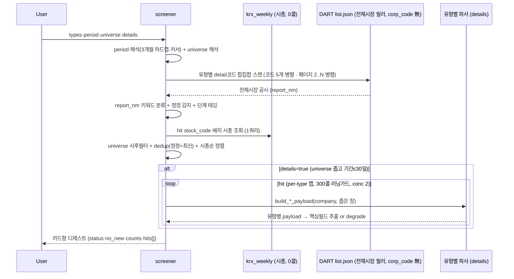

# screener — 전체시장 공시 스크리너 / 아침 디제스트

전체시장에 뜬 주요 공시를 **한 번의 호출로 훑어** 카드형으로 요약하는 **Action Tool**. 1순위 유즈는
**매일 아침 출근길 공시 알람 디제스트** — "직전 실행 이후~오늘 전종목에 뭐가 떴나"를 폰에서 훑기 좋게
(기업명 + 시총 + 유형 + 단계 + 정정 프리픽스 + 분모% + DART/naver 링크). 벤치마크는 텔레그램 AWAKE.

개별 tool(order_contracts·dividend 등)이 **한 회사를 깊게** 판다면, screener는 **전체시장을 얕게**
훑어 "무엇이 떴나"를 싸게 답한다. 거버넌스는 유형의 부분집합 — 범용 공시 디제스트다.

### 회계기간 메타데이터

잠정실적·정기보고서 카드에는 다음 기간 필드를 함께 표시합니다.

- `fiscal_year`: 회사의 사업연도
- `period_kind`: 연간·분기 등 보고기간 종류
- `fiscal_quarter`: 회사 결산월 기준 분기
- `comparison_basis`: 전년동기·직전분기 등 비교 기준

> **왜 Action Tool인가** (domain: action): `proxy_advise_before_meeting`·`shareholder_commitment`과
> 같은 계열 — upstream data tool을 오케스트레이션해 판단/요약을 만든다. details=true면 유형별 파서
> (order_contracts·treasury_share 등)를 **재사용**해 정형필드(분모%·금액·정정 diff)를 합성하고, 결과는
> per-company 단발 조회가 아니라 **아침 알람/디제스트 루틴을 구동하는 액션 산출물**이다(전체시장
> discovery는 그 입력 단계). 루틴 레시피 → [아침 디제스트](../../docs/routines/screener-morning-digest.md).

> **scan = 발견 / details = 숫자.** 무인자 호출(디폴트: core·since_yesterday·all·details=false)은
> DART **4콜**로 전체시장 하루치를 카드화한다. `details=true`면 필요 건만 문서를 열어 유형별 핵심숫자를
> 채운다(파서 재사용). 게이트는 universe가 아니라 **details**.

## 무엇을 참고하고 무엇을 연산하나

| 참고 공시 항목 | 무엇을 연산·판단 |
|---|---|
| list.json `report_nm` | 정정 프리픽스(`[기재정정]`/`[첨부정정]`) 감지 + 키워드로 **유형 분류** (B001은 `주요사항보고서(…)` 괄호 안 사유가 판별자) |
| `report_nm` 키워드 | **단계 태깅** — 결정(예정)≠결과(확정)≠소각(실행)≠철회·해지 (예정치와 실행치를 섞지 않음) |
| `stock_code` → `krx_weekly.mktcap` | 카드별 **시총 병기** + 시총순 정렬(대형사 상단). DART 0콜 |
| (details) 유형별 파서 payload | 금액·**분모%**(매출대비/시총대비/희석후)·DPS·안건·지분% — 판단이 갈리는 정형필드까지만 |

## 유형 레지스트리 (13종)

Tier1 여섯은 details(파서 디스패치) 지원, Tier2/3은 scan-only(같은 스캔 코드에 편승 → **추가 콜 0**).

| code | 유형 | scan 코드 | tier | details 파서 | max_items |
|---|---|---|---|---|---|
| order | 수주(단일판매·공급계약) | I001 | 1 | order_contracts | 40 |
| treasury | 자기주식 | B001 | 1 | treasury_share | 30 |
| dividend | 배당 | I001 | 1 | dividend | 40 |
| dilutive | 증자·CB·BW·감자 | B001 | 1 | dilutive_issuance | 25 |
| agm_notice | 주주총회소집 | I001 | 1 | shareholder_meeting_notice (rcept_no 직접) | 25 |
| ownership5 | 5%대량보유 | D001 | 1 | ownership_structure | 40 |
| earnings | 잠정실적 | I002 | 2 | scan-only | 40 |
| agm_result | 주총결과 | I001 | 2 | scan-only | 30 |
| restructuring | 합병·분할·영업양수도 | B001 | 2 | scan-only | 20 |
| stake_deal | 타법인주식 양수·양도 | B001 | 3 | scan-only | 20 |
| control_change | 최대주주변경 | I001 | 3 | scan-only | 20 |
| litigation | 소송·제재·위험 | I001 | 3 | scan-only | 20 |
| insider10 | 임원·주요주주 소유상황 | D002 | 3 | scan-only (**opt-in**, 디폴트 제외) |

- **core 프리셋** = order·treasury·dividend·dilutive·agm_notice·ownership5 (6개 Tier1). 스캔 코드 합집합
  = **I001·B001·D001** 3개로 전부 커버 + Tier2/3(earnings의 I002 제외)는 같은 코드에 편승.
- **D002(임원 소유상황)는 디폴트 제외** — 실측 245건/5일로 루틴 내부자 신고 = 디제스트 노이즈.
  `insider10`으로 opt-in.

## dedup + 단계 (핵심 로직)

- **정정 = 최신본만.** `dedup_key = corp_code:type:subtype` 그룹에서 최신 rcept_no만 남기고, 정정본이
  원본을 supersede(`supersedes_rcept_no`). 같은 날 원본+정정이 함께 떠도 하나로 수렴.
- **단계 태깅** — report_nm 키워드로 결정/결과/공고/신고서/소각/철회/해지 구분. 예정치(결정)와
  실행치(결과·소각)를 카드에 명시해 섞이지 않게 한다.
- **정정·해지·철회·소각 = details 강제**(`_force_detail`) — 판단이 갈리는 단계는 우선 문서를 연다.

## degrade (조작값 금지)

- `detail_status ∈ {parsed, partial, unparsed_image, no_data, scan_only, skipped, error}`.
- **`no_data`(무자료) ≠ 파싱실패.** XML 불완전·이미지 소집공고는 `unparsed_image`로 degrade하되
  **원문 URL은 항상** 제공. 조작된 값은 내지 않는다(XML 단독, PDF/OCR 폴백 없음).
- **"빈 배열 = 성공" 금지** — `status(ok/partial/error)` + `no_new`(신규없음, 조회는 정상)로
  '신규 없음'과 '조회 실패'를 구분한다.

## Flow

## 어떻게 쓰나

> "오늘 아침 공시 뭐 떴어?" → 무인자 `screener()` = 전체시장·직전영업일 이후·핵심 프리셋 디제스트.
> "시총 상위 200개 중 증자·CB만" → `types="dilutive"`, `universe="top_mktcap:200"`.
> "삼성전자·SK하이닉스 자사주 숫자까지" → `types="treasury"`, `universe="custom:삼성전자,SK하이닉스"`, `details=true` (코드/이름 혼용 가능).

유형별 카드 그룹(시총순) + 각 카드에 시총·단계·정정뱃지·분모%·DART/naver 링크·`suggested_tool`(심층 tool 힌트).

## 파라미터

- `types`: `core`(디폴트) / `all` / 쉼표구분 코드. period: today / yesterday / **since_yesterday**(디폴트) /
  last_7d / last_30d / custom.
- **universe**(2026-07-15 시장 분리 + 이름 해석): **all**(디폴트 전체시장) / `kospi200`(=KOSPI 시총상위200,
  **코스닥 미포함** — 지수 원장 부재라 시총상위 대체) / `kospi:N` · `kosdaq:N`(시장별 시총상위) /
  `top_mktcap:N`(전체시장 시총상위, 시장 혼합 — 라벨로 명시) / `market:kospi`·`market:kosdaq`(시장 전체) /
  `custom:종목,종목`(**코드 또는 회사명 혼용** — "삼성전자" 같은 이름은 `resolve_company_query`로 자동 코드화,
  미해결분은 notice로 투명 고지). 시총·시장 소스 = `krx_weekly`(DART 0콜), 이름해석도 corp_code 캐시라 DART 0콜.
- `details`: false(디폴트). **universe가 전체시장이거나 300종목 초과, 또는 기간>30일이면 콜 폭주 방지로 자동
  off**(게이트는 유니버스 "크기" — market:kospi 같은 넓은 유니버스는 details 안 켜짐), 기간>7일이면 preview(캡 1/2).
- `cursor`(YYYYMMDD): 반개구간[cursor, end) 시작 오버라이드 — 루틴 idempotency(직전 실행 이후만). 응답 `next_cursor`를 다음 실행에 넘긴다.

## 함께 보면 좋은 기능

- [[order_contracts]]·[[treasury_share]]·[[dividend_disclosure]]·[[dilutive_issuance]]·[[shareholder_meeting_notice]]·[[ownership_structure]] — 유형별 심층(details 디스패치 대상)
- [[risk_events]] — company 미지정 시장 스캔(리스크 3종 전담). screener는 범용·다유형
- [[tool_call_budget]] — scan(market-scan) vs details(per-firm) 콜 budget
- [아침 디제스트 루틴 레시피](../../docs/routines/screener-morning-digest.md) — 수주·임시주총·정기주총 매일 아침 자동 디제스트(`/schedule`용 프롬프트)

## 기술 상세

- 서비스: `open_proxy_mcp/services/screener.py` (로직 SSOT) · tool: `open_proxy_mcp/tools/screener.py` (디제스트 렌더)
- 스캔: `client.search_filings`(corp_code 無 전체시장 필러, 100/page) + 코드당 20페이지 상한. **코드 5개와 페이지 2..N 을 병렬로 던진다**(260824) — 순서는 페이지 번호로 복원한다(공시 순서가 뒤집히면 dedup=정정 최신본만 이 흔들린다).
- 레이트리밋 가드: **호출측 sleep 없음**(260824 제거) — 속도는 클라이언트 스로틀 한 곳에서 잡는다
  ([[data-collection]] 「호출측이 아니라 스로틀에서」). 여기서는 **양만 제한**한다:
  코드당 20페이지 · details 동시성 6 · **run당 300콜 러닝카운터**(per-type 캡 우선, 초과 시 truncated).
  전송 오류(httpx)는 `DartClientError` 가 아니라 그대로 올라오므로 따로 잡아 `transport:` 로 분류하고,
  코드 gather 는 `return_exceptions=True` 라 한 코드가 죽어도 나머지를 살린다.

### 인자를 사람 말로 받는다 (260824)

screener 만 `period="last_7d"` · `universe="kospi:30"` · `custom_start=` 같은 **우리끼리 정한
어휘**를 요구했다. 나머지 tool 은 전부 회사명을 그냥 받고 기간은 `start_date`/`end_date` 로
받는다. 부르는 쪽(LLM)이 이 어휘를 외워야 했고, **틀리면 조용히 기본값으로 빠졌다** —
`since_yesterday` · 전체시장으로. 틀린 줄도 모른다.

| 말하면 | 이렇게 읽는다 |
|---|---|
| "오늘" · "어제" · "어제부터" | `today` · `yesterday` · `since_yesterday` |
| "지난주" · "일주일" · "최근 7일" | `last_7d` · `custom:7` |
| "지난 한 달" · "최근 3개월" · "최근 45일" | `last_30d` · `custom:90` · `custom:45` |
| "20260817~20260824" · "2026-08-01 ~ 2026-08-20" · "20260820" | `custom` + 시작·종료 |
| `start_date`/`end_date` (레포 공통 인자) | `custom` + 그 창 |
| "전체" · "코스피" · "코스닥" · "코스피200" | `all` · `market:kospi` · `market:kosdaq` · `kospi200` |
| "코스피 시총 상위 30" · "코스닥 상위 50" · "시총 상위 100" | `kospi:30` · `kosdaq:50` · `top_mktcap:100` |
| "삼성전자, SK하이닉스" | `custom:…` (이름→코드 변환은 거기서 이미 한다) |
| "자사주, 배당" · "수주·실적" · "주총 지분" · "합병" | `treasury,dividend` · `order,earnings` · … |

★ **정규화만 한다.** 사람 말을 기존 코드로 바꿔 원래 리졸버에 넘긴다 — 리졸버를 다시 쓰면
지금 도는 것들이 함께 흔들린다. **옛 어휘는 한 글자도 안 바뀐다**(하위호환).
못 알아들은 조각은 삼키지 않고 흘려보내 원래 검증이 걸러낸다.

★ 무엇으로 알아들었는지 **산출물에 밝힌다**(`입력 해석: 지난주→last_7d · 코스피 시총 상위 30→kospi:30`).
조용히 다른 것을 조회하면 사용자가 모른다. 실측으로 코드 호출과 자연어 호출 4쌍이 같은 결과를 냈다.

### 스캔 캐시 (260824)

스캔은 **공시유형 × 기간**만으로 정해진다 — 누가 물었는지와 무관하게 답이 같은 시장 데이터다
([[data-collection]] 「시장 snapshot」 인프라 예외). 그래서 키별이 아니라 **전역**으로 나눠 쓴다.
예산 24MB(`OPM_SCAN_CACHE_MB`).

#### 수명은 「창이 닫혔나」로 가른다

한 값으로 정할 문제가 아니었다. 끝날짜가 오늘이면 지금도 공시가 들어오지만, **끝날짜가
과거면 그 구간의 답은 더 안 변한다** — 공시는 접수일로 색인되고 정정도 새 접수번호(오늘 날짜)를
받아 과거 창에 들어오지 않는다.

| 창 | 수명 | 환경변수 |
|---|---|---|
| 살아 있는 창 (끝날짜 = 오늘) | **180초** | `OPM_SCAN_CACHE_TTL_SEC` |
| 닫힌 창 (끝날짜 < 오늘) | **3,600초** | `OPM_SCAN_CACHE_TTL_CLOSED_SEC` |

살아 있는 창을 180초로 잡은 근거 — 호출 간격이 **양극단**이다(실측 109쌍):
p50 18초 · p75 98초인데 **p90 은 27분**으로 뛴다. 즉 이득의 대부분이 첫 2~3분에 나오고
그 뒤로는 신선도만 잃는다.

| TTL | 적중 가능 | 평균 놓침 | 피크 놓침 |
|---|---|---|---|
| 1분 | 71.6% | 0.2건 | 0.4건 |
| 2분 | 77.1% | 0.4건 | 0.8건 |
| **3분** | **80.7%** | **0.6건** | **1.2건** |
| 5분 | 85.3% | 1.0건 | 2.0건 |
| 10분 | 88.1% | 1.9건 | 4.0건 |
| 30분 | 91.7% | 5.7건 | 11.4건 |

유입 실측: 영업일 평균 254건(0.38건/분). **균일하지 않다** — 점심 9분간 0건, 장 마감 후 몰림.
피크는 평균의 2배로 잡았다.

닫힌 창을 무한이 아니라 1시간으로 둔 이유: 「안 변한다」를 완전히 믿지 않는다 —
뒤늦은 등록·재색인 여지를 남긴다.

실측 — 같은 기간을 여러 각도로 묻는 실사용 흐름:

| 호출 | DART 콜 |
|---|---|
| 디제스트(core) | 11 |
| 같은 기간 · types=all | 3 |
| 같은 기간 · kospi:30 + details | 33 |
| 같은 기간 · kosdaq:50 + details | 33 |
| 같은 기간 · 다시 scan | **0** |

★ **페이지 단위로 캐시하면 안 된다.** 새 공시가 들어오면 페이지 경계가 밀리므로, 캐시된
1페이지와 새로 받은 2페이지를 섞으면 같은 건이 두 번 들어오거나 사이가 빈다. 그래서
`_scan_code` **한 코드의 결과를 통째로** 담는다 — 한 시점에서 온 것끼리만 합쳐진다.

★ **부분 실패는 담지 않는다.** 담으면 그 순간의 장애가 TTL 동안 굳는다.

★ **넣을 때 복사한다.** 같은 리스트를 담고 그대로 돌려주면 호출측이 고칠 때 캐시가 함께
바뀐다 — 적중 경로만 복사하면 첫 호출자가 캐시를 오염시킨다(설계 중 실측으로 잡혔다).

### 왜 느렸나 (260824)

응답의 **87%** 가 자기 sleep 이었다 — kospi200·details=ON 42.3초 중 36.7초. 실사용 p95 116초·
최대 306초였고, 5분이면 클라이언트가 먼저 끊어 그 응답은 아무에게도 닿지 않았다.

| 케이스 | 전 | 후 |
|---|---|---|
| `types=all · last_7d · scan` | 14.9초 | **1.7초** |
| `kospi200 · last_7d · details=ON` | 42.3초 | **12.1초** |
| `kospi:30 · last_7d · details=ON` | 20.8초 | **4.0초** |

출력은 **완전 동일**하다(옛 코드와 전수 대조: counts 일치, hits 583건 집합·순서 일치).
한도 준수 실측: 60초창 최대 83콜(cap 910) · 웹 하한 위반 0건.

### universe 가 조용히 전체시장으로 빠지던 결함 (260824 수정)

`krx_weekly` 가 260823 개명 뒤 KS/KQ 를 담는데 `resolve_universe` 가 `"KOSPI"` 를 넘겼다.
**질의가 죽지 않고 0건을 냈고**, `_rank` 가 그걸 「조회 실패」로 읽어 전체시장으로 대체했다.
에러는 어디에도 뜨지 않는다.

    _krx_top_mktcap(market="KOSPI") → 0종목 / "KS" → 200종목
    screener(kospi200, last_7d, details=ON): hit 581·details 0 → hit 48·details 29

`kospi200`·`kospi:N`·`kosdaq:N` 셋이 영향권이었다. 바로 위 `market:kospi` 는 상수를 제대로
쓰고 있었다 — **한쪽만 고쳐진** 형태다. 그래서 호출부 상수와 **경계 정규화(`to_db`)** 를 둘 다 넣었다.
- 공시코드 매핑: [[공시유형코드체계]] (I001 주요경영사항 · B001 주요사항보고서 · D001 5%대량보유 · I002 잠정실적).
- 검증(2026-07-15): scan 라이브(전체시장 하루 172건→91포착, 4콜) · details 6/6 파싱(삼성전자 자사주 3,228억 시총대비·삼성물산 19.7% 경영참여·기업은행 DPS 210원·한국가스공사 임시주총 안건·SK하이닉스 유상증자·수주 매출대비%).

## 알려진 한계 · TODO

- **dilutive 정정 events[0] 폴백**: 정정 rcept_dt가 이사회 결정일과 달라 좁은 창을 놓치므로 뒤 60일 완충
  창으로 되짚는다. rcept_no가 어느 event와도 안 맞으면 events[0](같은 회사의 다른 발행건일 수 있음)을
  집는 한계 — rcept_no 매칭 시 정확.
- **미결 갭 3개(결정 대기)**: ① 잠정실적 전용 파서(현재 earnings=scan-only) ② 5%대량보유 변동
  sub-table depth(현재 top holder만 추출) ③ universe 유형별 override(유형마다 다른 유니버스 적용).
- **sector 필터·kospi200**: KSIC 조인·구성종목 원장 부재 → v1은 `resolved:false` + notice로 전체시장
  대체(투명 degrade). kospi200은 시총상위200 대체+안내.
- `dedup_key`에 대상일 미포함 — 같은 회사가 같은 유형을 다른 날 또 내면 run 간 알림 dedup은 커서로 관리.

## 변경 이력

- 2026-07-15: 신규(22번째 tool). 전체시장 공시 스크리너 / 아침 디제스트. scan(4콜)+details(파서 재사용).
- 2026-07-15: `domain: action` 부여 — upstream 파서 오케스트레이션 + 디제스트/루틴 구동(액션 산출물)로 재분류. 루틴 레시피 [docs/routines](../../docs/routines/screener-morning-digest.md) 연동.
