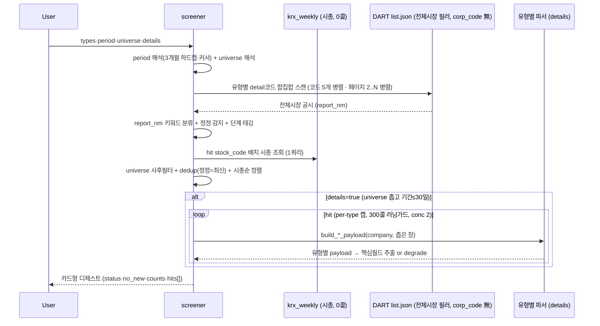

# screener — 전체시장 공시 스크리너 / 아침 디제스트

전체시장에 뜬 주요 공시를 **한 번의 호출로 훑어** 카드형으로 요약하는 **Action Tool**. 1순위 유즈는
**매일 아침 출근길 공시 알람 디제스트** — "직전 실행 이후~오늘 전종목에 뭐가 떴나"를 폰에서 훑기 좋게
(기업명 + 시총 + 유형 + 단계 + 정정 프리픽스 + 분모% + DART 링크). 벤치마크는 텔레그램 AWAKE.

개별 tool(order_contracts·dividend_disclosure 등)이 **한 회사를 깊게** 판다면, screener는 **전체시장을 얕게**
훑어 "무엇이 떴나"를 싸게 답한다. 거버넌스는 유형의 부분집합 — 범용 공시 디제스트다.

### 회계기간 메타데이터

잠정실적·정기보고서 카드에는 다음 기간 필드를 함께 표시합니다.

- `fiscal_year`: 회사의 사업연도
- `period_kind`: 연간·분기 등 보고기간 종류
- `fiscal_quarter`: 회사 결산월 기준 분기
- `comparison_basis`: 전년동기·직전분기 등 비교 기준

> **왜 Action Tool인가** (domain: action): `proxy_advise_before_meeting`·`shareholder_commitment`과
> 같은 계열 — upstream data tool을 오케스트레이션해 판단/요약을 만든다. details=true면 유형별 파서
> (order_contracts·treasury_share 등)를 **재사용**해 정형필드(분모%·금액·정정 diff)를 합성하고, 결과는
> per-company 단발 조회가 아니라 **아침 알람/디제스트 루틴을 구동하는 액션 산출물**이다(전체시장
> discovery는 그 입력 단계). 루틴 레시피 → [아침 디제스트](../../docs/routines/screener-morning-digest.md).

> **scan = 발견 / details = 숫자.** 무인자 호출(디폴트: core·since_yesterday·all·details=false)은
> DART **4콜**로 전체시장 하루치를 카드화한다. `details=true`면 필요 건만 문서를 열어 유형별 핵심숫자를
> 채운다(파서 재사용). 게이트는 universe가 아니라 **details**.

## 무엇을 참고하고 무엇을 연산하나

| 참고 공시 항목 | 무엇을 연산·판단 |
|---|---|
| list.json `report_nm` | 정정 프리픽스(`[기재정정]`/`[첨부정정]`) 감지 + 키워드로 **유형 분류** (B001은 `주요사항보고서(…)` 괄호 안 사유가 판별자) |
| `report_nm` 키워드 | **단계 태깅** — 결정(예정)≠결과(확정)≠소각(실행)≠철회·해지 (예정치와 실행치를 섞지 않음) |
| `stock_code` → `krx_weekly.mktcap` | 카드별 **시총 병기** + 시총순 정렬(대형사 상단). DART 0콜 |
| (details) 유형별 파서 payload | 금액·**분모%**(매출대비/시총대비/희석후)·DPS·안건·지분% — 판단이 갈리는 정형필드까지만 |

## 유형 레지스트리 (13종)

Tier1 여섯은 details(파서 디스패치) 지원, Tier2/3은 scan-only(같은 스캔 코드에 편승 → **추가 콜 0**).

| code | 유형 | scan 코드 | tier | details 파서 | max_items |
|---|---|---|---|---|---|
| order | 수주(단일판매·공급계약) | I001 | 1 | order_contracts | 40 |
| treasury | 자기주식 | B001 | 1 | treasury_share | 30 |
| dividend | 배당 | I001 | 1 | dividend | 40 |
| dilutive | 증자·CB·BW·감자 | B001 | 1 | dilutive_issuance | 25 |
| agm_notice | 주주총회소집 | I001 | 1 | shareholder_meeting_notice (rcept_no 직접) | 25 |
| ownership5 | 5%대량보유 | D001 | 1 | ownership_structure | 40 |
| earnings | 잠정실적 | I002 | 2 | scan-only | 40 |
| agm_result | 주총결과 | I001 | 2 | scan-only | 30 |
| restructuring | 합병·분할·영업양수도 | B001 | 2 | scan-only | 20 |
| stake_deal | 타법인주식 양수·양도 | B001 | 3 | scan-only | 20 |
| control_change | 최대주주변경 | I001 | 3 | scan-only | 20 |
| litigation | 소송·제재·위험 | I001 | 3 | scan-only | 20 |
| insider10 | 임원·주요주주 소유상황 | D002 | 3 | scan-only (**opt-in**, 디폴트 제외) |

- **core 프리셋** = order·treasury·dividend·dilutive·agm_notice·ownership5 (6개 Tier1). 스캔 코드 합집합
  = **I001·B001·D001** 3개로 전부 커버 + Tier2/3(earnings의 I002 제외)는 같은 코드에 편승.
- **D002(임원 소유상황)는 디폴트 제외** — 실측 245건/5일로 루틴 내부자 신고 = 디제스트 노이즈.
  `insider10`으로 opt-in.

## dedup + 단계 (핵심 로직)

- **정정만 원본을 대체한다 — 별개 사건은 접지 않는다.** `dedup_key = corp_code:type:subtype` 은
  **사건 식별자가 아니다**(공급계약 matcher 의 subtype 은 「체결」·「해지」 둘뿐). 그래서 이 키로
  최신 1건만 남기면 한 회사가 낸 계약 여러 건이 카드 1장으로 접힌다 — 값이 아니라 **건수**가
  틀리는데 카드의 원문 링크는 맞으니 드러나지 않는다(260909 실측: 수주 3개월에서 사건이 지워졌다).
  따라서 접는 조건은 셋이다: ① 뒤에 온 행이 **정정본**이고 ② 그 키의 원본 후보가 **정확히 1건**이며
  ③ 같은 접수번호가 아니다. 접히면 `supersedes_rcept_no`, `counts.deduped_away` 로 센다.
- **원본이 둘 이상이면 접지 않는다.** list.json 에는 정정본이 **어느 접수번호를 고쳤는지**가 없다.
  추정으로 최신 원본을 덮으면 정정이 옛 건의 정정일 때 그 사이의 최신 계약이 사라진다. 그래서
  `ambiguous_correction: true` + `correction_candidates: [rcept_no…]` 를 달아 그대로 남긴다 —
  모르면 지우지 않고 후보를 준다.
- **같은 접수번호는 언제나 한 장.** 페이지 경계·코드 중복으로 같은 공시가 두 번 들어와도 한 번만 싣는다.
- **단계 태깅** — report_nm 키워드로 결정/결과/공고/신고서/소각/철회/해지 구분. 예정치(결정)와
  실행치(결과·소각)를 카드에 명시해 섞이지 않게 한다.
- **정정·해지·철회·소각 = details 강제**(`_force_detail`) — 판단이 갈리는 단계는 우선 문서를 연다.

## coverage (모수 정직성)

`coverage` 는 스캔 코드마다 **어디까지 봤는지**를 적는다 — `total`·`total_pages`·`fetched_pages`
(연속으로 받은 페이지)·`received_pages`·`missing_pages`·`seen_from`/`seen_to`(실제로 받은 행의
접수일 범위)·`complete`·`error`.

- `complete` 는 「상한에 안 걸렸고 **에러도 없었다**」다. 전송오류로 통째로 죽은 코드가
  빈 결과를 이유로 `complete: true` 가 되면, 읽는 쪽은 경고 대신 이 표를 믿는다.
  단 DART `013`(해당 없음)은 진짜 무자료라 `complete: true` 가 옳다.
- `fetched_pages` 는 **연속으로 받은 수**다. 3페이지가 죽고 4페이지가 살아와도 4/4 를 주장하지
  않는다. 받은 행은 버리지 않고 싣되 구멍은 `missing_pages` 로 밝힌다.
- `seen_from`/`seen_to` 는 **본 것만** 적는다. DART 기본 정렬이 접수일 내림차순이라는 것은
  문서화된 계약이 아니라, 「빠진 쪽은 창의 과거」라고 단정하지 않는다.
- 불완전한 코드는 디제스트의 「이 응답이 못 본 것」 절에 사람이 읽는 문장으로 나간다
  (json 에만 있으면 사용자는 못 본다).

## degrade (조작값 금지)

- `detail_status ∈ {parsed, partial, unparsed_image, no_data, scan_only, skipped, error}`.
- **`no_data`(무자료) ≠ 파싱실패.** XML 불완전·이미지 소집공고는 `unparsed_image`로 degrade하되
  **원문 URL은 항상** 제공. 조작된 값은 내지 않는다(XML 단독, PDF/OCR 폴백 없음).
- **"빈 배열 = 성공" 금지** — `status(ok/partial/error)` + `no_new`(신규없음, 조회는 정상)로
  '신규 없음'과 '조회 실패'를 구분한다.

## Flow

## 어떻게 쓰나

> "오늘 아침 공시 뭐 떴어?" → 무인자 `screener()` = 전체시장·직전영업일 이후·핵심 프리셋 디제스트.
> "시총 상위 200개 중 증자·CB만" → `types="dilutive"`, `universe="top_mktcap:200"`.
> "삼성전자·SK하이닉스 자사주 숫자까지" → `types="treasury"`, `universe="custom:삼성전자,SK하이닉스"`, `details=true` (코드/이름 혼용 가능).
> "지난주 업종별 수주, 평소보다 많이 떴나" → `view="흐름"`, `period="지난주"` (기본 유형 수주 · 달력의 지난주 월~일).
> "올해 수주가 매출 대비 가장 많이 쌓인 회사" → `view="흐름"`, `period="올해"` — 「올해 누적 수주」 절.
> "지난달 업종별 잠정실적 공시 흐름" → `view="흐름"`, `types="잠정실적"`, `period="지난달"` — 달력의 지난달 1일~말일.
> "코스닥 업종별 자사주·증자 흐름, 대분류만" → `view="흐름"`, `types="자사주, 증자"`, `universe="코스닥"`, `level="대분류"`.

유형별 카드 그룹(시총순) + 각 카드에 시총·단계·정정뱃지·분모%·DART 링크·`suggested_tool`(심층 tool 힌트).

## 파라미터

- `types`: `core`(디폴트) / `all` / 쉼표구분 코드. period: 사람 말(아래 「기간 말」 표) 또는 코드 — today / yesterday /
  **since_yesterday**(디폴트) / last_7d / last_30d / custom:N / this_week·prev_week / this_month·prev_month /
  this_quarter·prev_quarter / ytd·prev_year / custom(+시작·끝).
- **universe**(2026-07-15 시장 분리 + 이름 해석): **all**(디폴트 전체시장) / `kospi200`(=KOSPI 시총상위200,
  **코스닥 미포함** — 지수 원장 부재라 시총상위 대체) / `kospi:N` · `kosdaq:N`(시장별 시총상위) /
  `top_mktcap:N`(전체시장 시총상위, 시장 혼합 — 라벨로 명시) / `market:kospi`·`market:kosdaq`(시장 전체) /
  `custom:종목,종목`(**코드 또는 회사명 혼용** — "삼성전자" 같은 이름은 `resolve_company_query`로 자동 코드화,
  미해결분은 notice로 투명 고지). 시총·시장 소스 = `krx_weekly`(DART 0콜), 이름해석도 corp_code 캐시라 DART 0콜.
- `details`: false(디폴트). **universe가 전체시장이거나 300종목 초과, 또는 기간>30일이면 콜 폭주 방지로 자동
  off**(게이트는 유니버스 "크기" — market:kospi 같은 넓은 유니버스는 details 안 켜짐), 기간>7일이면 preview(캡 1/2).
- `max_hits`(기본 200, 최대 500) / `offset`(기본 0): 페이징. 응답 `paging.next_offset` 을 `offset` 에 넣으면
  다음 묶음. `paging.matched`(매칭 수)와 `paging.returned`(이번에 실은 수)는 다른 값이다.
- `start_date` / `end_date`(YYYYMMDD): 명시 기간 — `period=custom` 의 `custom_start`/`custom_end` 와 같은 뜻.
- `cursor`(YYYYMMDD): 반개구간[cursor, end) 시작 오버라이드 — 루틴 idempotency(직전 실행 이후만). 응답 `next_cursor`를 다음 실행에 넘긴다.
- `view`: 비우면 카드 보기(기존). **`"흐름"`(또는 flow·업종별·평소 대비)이면 흐름 보기** — 아래 절.
- `level`(흐름 보기): `"둘 다"`(기본) / `"대분류"`(WICS 10) / `"중분류"`(WICS 28).
- `baseline_weeks`(흐름 보기): 비교 기준 주 수, 기본 13(1~52).
- `large_min_pct`(흐름 보기): 큰 수주의 매출 대비 기준 %, 기본 10.

## 흐름 보기 (`view="흐름"`, 260918)

카드 보기는 DART 를 그때그때 스캔해 「무엇이 떴나」를 한 줄씩 준다. 저장이 없어 「평소보다 많이 떴나」는 답할 수
없었다. 흐름 보기는 매일 밤 쌓이는 **공시 이벤트 원장**([[disclosure-event-ledger]])만 읽는다 — DART 0콜, 3개월 한도 없음.

| 절 | 무엇 |
|---|---|
| 업종별 흐름 (업종 대분류·중분류) | 새 공시 건수, 평소(직전 N주를 같은 일수로 환산), 평소 대비 배수, 금액 합(확인 건수), 수주는 평균 매출 대비 %·해지, 그 밖의 유형은 세부 구성, 정정 건수 |
| 큰 수주 (수주일 때) | 매출 대비 비율이 기준(기본 10%) 이상인 새 계약 — 금액·상대방·DART 링크 |
| 올해 누적 수주 (수주일 때) | 회사별 올해 새 계약의 「매출 대비 %」 합과 금액 합, 비율 확인 건수, 시총 — 공시에 회사가 적은 값이라 재무표와 조인하지 않는다. md 상위 20, json 상위 50 |

규칙
- **새 공시 = 정정 아님**, 수주는 **해지도 아님**. 정정·해지는 따로 센다.
- **평소 환산은 원장이 실제로 본 날만** 센다(`dart_events_scan`). 원장에 없는 날은 0건이 아니다. **그날 21시 이전에 본 날은 본 날로 치지 않는다** — 밤 배치가 자정 넘어 돌면 막 시작된 오늘을 완료로 적기 때문(260918 실측). 이번 기간·비교 기준의 본 날 수가 다르면 그 비율로 환산하고 경고로 밝힌다.
- **평소가 1건 미만이면 「평소 적음」** 표시하고 순위 뒤로 — 배수가 튄다. md 는 이번에 없고 평소도 드문 줄을 줄이고(json 에는 전부), 업종 미상은 맨 뒤.
- **자회사 계약 재공시**(「…(자회사의 주요경영사항)」): 같은 날 같은 금액으로 자회사가 직접 낸 공시가 있으면 중복으로 빼고, 없으면(비상장 자회사) 유일한 기록이라 건수에 넣는다. 그 비율은 **자회사 매출 기준**이라 모회사 평균·누적 합에서 뺀다(큰 수주 목록엔 「자회사 계약」 표시). 실측: 비츠로테크가 비츠로넥스텍 계약을 같은 금액·같은 89.8%로 다시 공시.
- 금액·비율은 상세를 읽은 공시만 더한다(확인 건수 병기). 매출이 작은 회사는 누적 합이 수천 %까지 간다 — 시총과 같이 볼 것.
- 원장은 밤 배치라 **오늘 뜬 공시는 카드 보기**로 본다. 기간 끝이 원장 최신일보다 뒤면 당기고 밝힌다.
- **기간 말**: 기본(말 없음)은 원장 최신일까지 7일. 나머지는 **카드 보기와 같은 해석기**(아래 「기간 말」 표)다.
  「이번 주·이번 달·이번 분기·올해」는 오늘이 속한 칸의 첫날부터 원장 최신일까지 — 월초·주초 밤 배치 전이라 원장이
  아직 그 칸에 없으면 가장 최근 칸을 보이고 밝힌다. 다른 창은 원장 범위로 자르고 자른 사실을 적는다. 요청한 창 전체가
  원장 밖(「오늘」 등)이면 가장 가까운 하루를 보이고 그렇게 적는다 — 조용히 하루로 줄이지 않는다.
- 흐름 보기의 유형 기본은 수주(카드 보기의 core 와 다르다). 원장에 쌓지 않는 opt-in 유형(임원 소유상황·공개매수·권유)은 뺀다.

## 함께 보면 좋은 기능

- [[order_contracts]]·[[treasury_share]]·[[dividend_disclosure]]·[[dilutive_issuance]]·[[shareholder_meeting_notice]]·[[ownership_structure]] — 유형별 심층(details 디스패치 대상)
- [[risk_events]] — company 미지정 시장 스캔(리스크 3종 전담). screener는 범용·다유형
- [아침 디제스트 루틴 레시피](../../docs/routines/screener-morning-digest.md) — 수주·임시주총·정기주총 매일 아침 자동 디제스트(`/schedule`용 프롬프트)

## 기술 상세

- 서비스: `open_proxy_mcp/services/screener.py` (로직 SSOT) · tool: `open_proxy_mcp/tools/screener.py` (디제스트 렌더)
- 스캔: `client.search_filings`(corp_code 無 전체시장 필러, 100/page). 코드당 페이지 상한은 `client.list_pages_per_code(코드 수)` — **요청당 예산 300페이지를 코드 수로 나눈 몫**이다. 같은 list.json 을 쓰는 `risk_events` 도 같은 예산에서 유도한다(종전 20 vs 200 으로 10배 어긋나 있었다). 코드가 늘어도 한 요청의 총 콜은 그대로. 예산 자체를 올릴지는 `scan_page_truncated` 계기의 발생률로 정한다. **코드 5개와 페이지 2..N 을 병렬로 던진다**(260824) — 순서는 페이지 번호로 복원한다(공시 순서가 뒤집히면 dedup=정정 최신본만 이 흔들린다).
- 레이트리밋 가드: **호출측 sleep 없음**(260824 제거) — 속도는 클라이언트 스로틀 한 곳에서 잡는다
  ([[data-collection]] 「호출측이 아니라 스로틀에서」). 여기서는 **양만 제한**한다:
  코드당 20페이지 · details 동시성 6 · **run당 300콜 러닝카운터**(per-type 캡 우선, 초과 시 truncated).
  전송 오류(httpx)는 `DartClientError` 가 아니라 그대로 올라오므로 따로 잡아 `transport:` 로 분류하고,
  코드 gather 는 `return_exceptions=True` 라 한 코드가 죽어도 나머지를 살린다.

### 인자를 사람 말로 받는다 (260824)

screener 만 `period="last_7d"` · `universe="kospi:30"` · `custom_start=` 같은 **우리끼리 정한
어휘**를 요구했다. 나머지 tool 은 전부 회사명을 그냥 받고 기간은 `start_date`/`end_date` 로
받는다. 부르는 쪽(LLM)이 이 어휘를 외워야 했고, **틀리면 조용히 기본값으로 빠졌다** —
`since_yesterday` · 전체시장으로. 틀린 줄도 모른다.

| 말하면 | 이렇게 읽는다 |
|---|---|
| "오늘" · "어제" · "어제부터" · "어제 이후" · "오늘 자정부터" | `today` · `yesterday` · `since_yesterday` |
| 기간 말 전체 | 아래 「기간 말 — 카드·흐름 공통」 표 |
| "20260817~20260824" · "2026-08-01 ~ 2026-08-20" · "20260820" | `custom` + 시작·종료 |
| `start_date`/`end_date` (레포 공통 인자) | `custom` + 그 창 |
| "전체" · "코스피" · "코스닥" · "코스피200" | `all` · `market:kospi` · `market:kosdaq` · `kospi200` |
| "코스피 시총 상위 30" · "코스닥 상위 50" · "시총 상위 100" · "코스피 시가총액 상위 200개 기업" | `kospi:30` · `kosdaq:50` · `top_mktcap:100` · `kospi:200` — 숫자 뒤 개·종목·기업·회사·개사·곳은 무관(260918) |
| "삼성전자, SK하이닉스" | `custom:…` (이름→코드 변환은 거기서 이미 한다) |
| "자사주, 배당" · "수주·실적" · "주총 지분" · "합병" | `treasury,dividend` · `order,earnings` · … |

★ **정규화만 한다.** 사람 말을 기존 코드로 바꿔 원래 리졸버에 넘긴다 — 리졸버를 다시 쓰면
지금 도는 것들이 함께 흔들린다. **옛 어휘는 한 글자도 안 바뀐다**(하위호환).
못 알아들은 조각은 삼키지 않고 흘려보내 원래 검증이 걸러낸다.

★ 무엇으로 알아들었는지 **산출물에 밝힌다**(`입력 해석: 지난주→prev_week · 코스피 시총 상위 30→kospi:30`).
조용히 다른 것을 조회하면 사용자가 모른다. 실측으로 코드 호출과 자연어 호출 4쌍이 같은 결과를 냈다.

### 기간 말 — 카드·흐름 공통 (260918 전면 점검)

말 → 기간은 `services/period_words.py` **한 곳**이 정한다. 종전엔 카드 보기(`_NL_PERIOD`)와 흐름 보기가 따로 읽어
같은 말이 달랐다 — 「지난달」이 카드 보기에선 최근 30일, 흐름 보기에선 못 알아들음, 「최근 7일」은 8일 대 7일.
창의 제약만 보기가 붙인다(카드 보기 3개월 한도·오늘까지, 흐름 보기 원장 범위).

| 말 | 기간(오늘 = 2026-09-18 금) | 코드 |
|---|---|---|
| 오늘 · 어제 · 어제부터 · 그저께 | 9/18 · 9/17 · 9/17~9/18 · 9/16 | `today` · `yesterday` · `since_yesterday` · `custom` |
| 이번 주 · 지난주 | 9/14~9/18 · 9/7~9/13 (월~일) | `this_week` · `prev_week` |
| 이번 달 · 지난달 | 9/1~9/18 · 8/1~8/31 | `this_month` · `prev_month` |
| 이번 분기 · 지난 분기 | 7/1~9/18 · 4/1~6/30 | `this_quarter` · `prev_quarter` |
| 올해 · 작년 · 재작년 | 1/1~9/18 · 2025년 · 2024년 | `ytd` · `prev_year` · `custom` |
| 최근 7일 · 최근 2주 · 지난 한 달 · 최근 3개월 | 오늘 포함 7·14·30·90일 | `custom:7` · `custom:14` · `last_30d` · `custom:90` |
| 3일 전부터 · 2주 전 | 9/15~9/18 · 9/4~9/18 (그날 포함) | `custom:4` · `custom:15` |
| 8월 · 12월 · 2026년 8월 · 2026-08 | 8/1~8/31 · **2025년** 12월 · … | `custom` |
| 3분기 · 4분기 · 2026년 2분기 · 2Q26 | 7/1~9/30 · **2025년** 4분기 · … | `custom` |
| 상반기 · 하반기 · 작년 하반기 · 2025년 | 1/1~6/30 · 7/1~12/31 · … | `custom` |
| 2026-09-01 · 2026.09.01 · 9월 1일 · 9/1 | 그날 | `custom` |
| 8월 1일부터 8월 20일까지 · 8/1~8/20 · 8월 1일부터 20일까지 | 8/1~8/20 | `custom` |
| 4월부터 8월 10일 사이 · 11월부터 2월까지 | 4/1~8/10 · 2025/11/1~2026/2/28 | `custom` |
| 9월 1일부터 · 지난주부터 · since 2026-09-01 | 그날~오늘 | `custom` |
| last_week · this_month · ytd · past week · last 30 days | 위와 같은 뜻 | 코드 |

규칙
- **달력 말은 오늘 기준**이다. 원장 최신일 기준으로 잡으면 월초·주초 밤 배치 전에 「지난달」「지난주」가 한 칸 더 앞이 된다.
- **굴러가는 창은 오늘 포함 N일.** 종전 카드 보기는 N+1일이었다(최근 7일 = 8일). 「N일 전(부터)」은 그날을 포함해 N+1일.
- **연도 없는 월·분기·반기·날짜는 오늘 이전의 가장 최근 것** — 9월에 「12월」은 작년 12월, 「3분기」는 올해 3분기.
  범위 앞쪽이 뒤쪽보다 늦으면 앞쪽을 한 해 당긴다(「11월부터 2월까지」). 이번 칸 전체(「9월」「하반기」)는 오늘까지만 본다.
- **추측하지 않는다.** 시작 없는 「8월 10일까지」, 달력에 없는 「2026-02-31」, 「요즘」은 읽지 않고 왜 못 읽었는지와 받는
  꼴을 적는다(카드 보기는 어제부터, 흐름 보기는 최근 7일로 보인다).
- **말이 섞여 들어오면** 아는 말을 긴 것부터 찾는다(「지난주 전체」 → 지난주). 「지난주 금요일」은 지난주 전체로 읽힌다 —
  요일은 안 읽는다(입력 해석 줄에 드러난다).
- 카드 보기 3개월 한도: 「올해」「작년」처럼 길면 잘라서 밝히고 흐름 보기(원장 약 1년치)를 안내한다.

점검 근거(260918): 실제 호출·요청에서 나온 기간 말(「오늘」「어제 이후」「오늘 자정부터」, 모델이 날짜로 바꿔 보낸 범위,
「작년」「전년」「3월」「4월부터 8월 10일 사이」「상반기」「2주 전」「지난달」「이번 주」)과 부르는 모델이 설명의 코드를
흉내 낸 표기. 테스트 `tests/test_period_words.py` 가 이 표 전체와 요일·월초·해 넘김·윤년·
분기 경계, 두 보기의 도구 호출 경로를 잠근다.

### 스캔 캐시 (260824)

스캔은 **공시유형 × 기간**만으로 정해진다 — 누가 물었는지와 무관하게 답이 같은 시장 데이터다
([[data-collection]] 「시장 snapshot」 인프라 예외). 그래서 키별이 아니라 **전역**으로 나눠 쓴다.
예산 24MB(`OPM_SCAN_CACHE_MB`).

#### 수명은 「창이 닫혔나」로 가른다

한 값으로 정할 문제가 아니었다. 끝날짜가 오늘이면 지금도 공시가 들어오지만, **끝날짜가
과거면 그 구간의 답은 더 안 변한다** — 공시는 접수일로 색인되고 정정도 새 접수번호(오늘 날짜)를
받아 과거 창에 들어오지 않는다.

| 창 | 수명 | 환경변수 |
|---|---|---|
| 살아 있는 창 (끝날짜 = 오늘) | **180초** | `OPM_SCAN_CACHE_TTL_SEC` |
| 닫힌 창 (끝날짜 < 오늘) | **3,600초** | `OPM_SCAN_CACHE_TTL_CLOSED_SEC` |

살아 있는 창을 180초로 잡은 근거 — 호출 간격이 **양극단**이다(실측 109쌍):
p50 18초 · p75 98초인데 **p90 은 27분**으로 뛴다. 즉 이득의 대부분이 첫 2~3분에 나오고
그 뒤로는 신선도만 잃는다.

| TTL | 적중 가능 | 평균 놓침 | 피크 놓침 |
|---|---|---|---|
| 1분 | 71.6% | 0.2건 | 0.4건 |
| 2분 | 77.1% | 0.4건 | 0.8건 |
| **3분** | **80.7%** | **0.6건** | **1.2건** |
| 5분 | 85.3% | 1.0건 | 2.0건 |
| 10분 | 88.1% | 1.9건 | 4.0건 |
| 30분 | 91.7% | 5.7건 | 11.4건 |

유입 실측: 영업일 평균 254건(0.38건/분). **균일하지 않다** — 점심 9분간 0건, 장 마감 후 몰림.
피크는 평균의 2배로 잡았다.

닫힌 창을 무한이 아니라 1시간으로 둔 이유: 「안 변한다」를 완전히 믿지 않는다 —
뒤늦은 등록·재색인 여지를 남긴다.

실측 — 같은 기간을 여러 각도로 묻는 실사용 흐름:

| 호출 | DART 콜 |
|---|---|
| 디제스트(core) | 11 |
| 같은 기간 · types=all | 3 |
| 같은 기간 · kospi:30 + details | 33 |
| 같은 기간 · kosdaq:50 + details | 33 |
| 같은 기간 · 다시 scan | **0** |

★ **페이지 단위로 캐시하면 안 된다.** 새 공시가 들어오면 페이지 경계가 밀리므로, 캐시된
1페이지와 새로 받은 2페이지를 섞으면 같은 건이 두 번 들어오거나 사이가 빈다. 그래서
`_scan_code` **한 코드의 결과를 통째로** 담는다 — 한 시점에서 온 것끼리만 합쳐진다.

★ **부분 실패는 담지 않는다.** 담으면 그 순간의 장애가 TTL 동안 굳는다.

★ **넣을 때 복사한다.** 같은 리스트를 담고 그대로 돌려주면 호출측이 고칠 때 캐시가 함께
바뀐다 — 적중 경로만 복사하면 첫 호출자가 캐시를 오염시킨다(설계 중 실측으로 잡혔다).

### 왜 느렸나 (260824)

응답의 **87%** 가 자기 sleep 이었다 — kospi200·details=ON 42.3초 중 36.7초. 실사용 p95 116초·
최대 306초였고, 5분이면 클라이언트가 먼저 끊어 그 응답은 아무에게도 닿지 않았다.

| 케이스 | 전 | 후 |
|---|---|---|
| `types=all · last_7d · scan` | 14.9초 | **1.7초** |
| `kospi200 · last_7d · details=ON` | 42.3초 | **12.1초** |
| `kospi:30 · last_7d · details=ON` | 20.8초 | **4.0초** |

출력은 **완전 동일**하다(옛 코드와 전수 대조: counts 일치, hits 583건 집합·순서 일치).
한도 준수 실측: 60초창 최대 83콜(cap 910) · 웹 하한 위반 0건.

### universe 가 조용히 전체시장으로 빠지던 결함 (260824 수정)

`krx_weekly` 가 260823 개명 뒤 KS/KQ 를 담는데 `resolve_universe` 가 `"KOSPI"` 를 넘겼다.
**질의가 죽지 않고 0건을 냈고**, `_rank` 가 그걸 「조회 실패」로 읽어 전체시장으로 대체했다.
에러는 어디에도 뜨지 않는다.

    _krx_top_mktcap(market="KOSPI") → 0종목 / "KS" → 200종목
    screener(kospi200, last_7d, details=ON): hit 581·details 0 → hit 48·details 29

`kospi200`·`kospi:N`·`kosdaq:N` 셋이 영향권이었다. 바로 위 `market:kospi` 는 상수를 제대로
쓰고 있었다 — **한쪽만 고쳐진** 형태다. 그래서 호출부 상수와 **경계 정규화(`to_db`)** 를 둘 다 넣었다.

**이름 나열에서 회사를 하나도 못 찾으면 되묻는다 (260918).** 「코스피 시가총액 상위 200개 기업」이 순위로 안 읽혀
회사 이름 나열이 됐고, 그런 회사가 없자 **시장 전체로 대체**해 「지정종목」 이름으로 냈다(라이브: 상위 200 이면 22건,
나간 것은 시장 전체 75건). 대체 안내는 긴 경고 줄 끝에 있었다. 이제는 조회하지 않고(`status=needs_input`) 무엇을
원했는지 묻는다 — 카드 보기·흐름 보기·`trading_data(scope=universe)`·`forward_estimates_data(universe=…)` 모두 같다.
「코스피 120」처럼 수인지 이름인지 모를 꼴은 「코스피 시총 상위 120」을 제안한다. 일부만 찾으면 찾은 만큼으로 진행한다.
- 공시코드 매핑: [[공시유형코드체계]] (I001 주요경영사항 · B001 주요사항보고서 · D001 5%대량보유 · I002 잠정실적).
- 검증(2026-07-15): scan 라이브(전체시장 하루 172건→91포착, 4콜) · details 6/6 파싱(삼성전자 자사주 3,228억 시총대비·삼성물산 19.7% 경영참여·기업은행 DPS 210원·한국가스공사 임시주총 안건·SK하이닉스 유상증자·수주 매출대비%).

## 알려진 한계 · TODO

- **dilutive 정정 events[0] 폴백**: 정정 rcept_dt가 이사회 결정일과 달라 좁은 창을 놓치므로 뒤 60일 완충
  창으로 되짚는다. rcept_no가 어느 event와도 안 맞으면 events[0](같은 회사의 다른 발행건일 수 있음)을
  집는 한계 — rcept_no 매칭 시 정확.
- **미결 갭 3개(결정 대기)**: ① 잠정실적 전용 파서(현재 earnings=scan-only) ② 5%대량보유 변동
  sub-table depth(현재 top holder만 추출) ③ universe 유형별 override(유형마다 다른 유니버스 적용).
- **sector 필터·kospi200**: KSIC 조인·구성종목 원장 부재 → v1은 `resolved:false` + notice로 전체시장
  대체(투명 degrade). kospi200은 시총상위200 대체+안내.
- `dedup_key`에 대상일 미포함 — 같은 회사가 같은 유형을 다른 날 또 내면 run 간 알림 dedup은 커서로 관리.

## 변경 이력
- 2026-09-21: 카드의 포털 링크를 뺐다(DART 링크만, JSON 의 `naver_url` 없음). 흐름 보기의 분류 이름표를 「업종 대분류·중분류」로.
- 2026-09-18: **유니버스 말** — 숫자 뒤 「개 기업·개 종목·개 회사·개사·곳」도 순위로 읽는다. 이름 나열에서 회사를 하나도
  못 찾으면 시장 전체로 대체하지 않고 되묻는다(`needs_input`, DART·원장 0콜). 카드·흐름 보기와 유니버스 목록 공통.
- 2026-09-18: **기간 말 전면 점검** — 해석기 하나(`period_words`)를 두 보기가 같이 쓴다. 카드 보기에도 「이번 주」「이번 달」
  「이번 분기」「올해」「작년」, 두 보기 모두 월 이름·분기·반기·연도·여러 날짜 꼴·「A부터 B까지」·「A부터」·영어 코드.
  **최근 N일 = 오늘 포함 N일**(종전 카드 보기 N+1일). 카드 보기는 오늘 뒤를 자르고 3개월 한도 때 흐름 보기를 안내,
  흐름 보기는 「어제부터」를 못 알아듣던 것과 창 전체가 원장 밖일 때 조용히 하루로 줄이던 것을 고쳤다.
- 2026-09-18: **「지난주」「지난달」 = 달력**(지난주 월~일 · 지난달 1일~말일, 오늘 기준) — 카드 보기·흐름 보기 공통
  (`prev_week`·`prev_month`). 종전엔 공용 해석기가 최근 7일·30일로 읽었다. 굴러가는 창은 「지난 일주일」「최근 7일」
  「지난 한 달」「최근 30일」로 남는다. 흐름 보기에는 **「이번 달」**(1일~원장 최신일)도 — 종전엔 못 알아들어 7일로 보였다.
- 2026-09-18: **흐름 보기 신설**(`view="흐름"`, `level`·`baseline_weeks`·`large_min_pct`) — 공시 원장을 WICS 대분류·중분류별로 합산해 평소 대비를 준다. 큰 수주·올해 누적 수주 절. 정정·해지·자회사 재공시 중복을 가른다. DART 0콜.
- 2026-09-09: **dedup 과잉 접힘 수정** — 정정본이고 원본 후보가 1건일 때만 접는다(별개 사건 보존,
  후보 여럿이면 `ambiguous_correction`). 같은 접수번호 그물 복원. **`coverage` 신설** —
  코드별 완전성·구멍·본 접수일 범위를 payload 와 디제스트에 노출(종전 신호는 「상한 도달」 6글자뿐).
  `period_clamped`·`scan_page_truncated` 를 열화 장부에 등록. 페이지 상한은 **올리지 않았다** —
  계기를 먼저 심고 발생률을 재고 나서 올린다.

- 2026-07-15: 신규(22번째 tool). 전체시장 공시 스크리너 / 아침 디제스트. scan(4콜)+details(파서 재사용).
- 2026-07-15: `domain: action` 부여 — upstream 파서 오케스트레이션 + 디제스트/루틴 구동(액션 산출물)로 재분류. 루틴 레시피 [docs/routines](../../docs/routines/screener-morning-digest.md) 연동.
