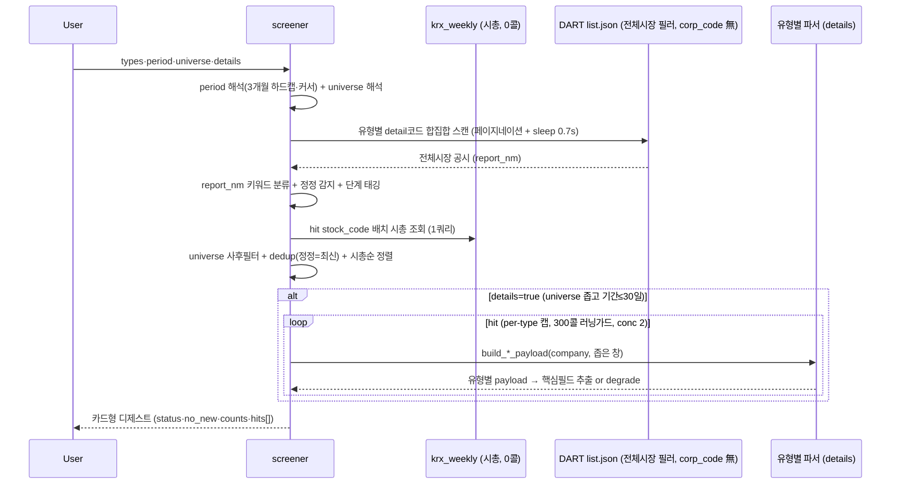

# screener — 전체시장 공시 스크리너 / 아침 디제스트

전체시장에 뜬 주요 공시를 **한 번의 호출로 훑어** 카드형으로 요약하는 **Action Tool**. 1순위 유즈는
**매일 아침 출근길 공시 알람 디제스트** — "직전 실행 이후~오늘 전종목에 뭐가 떴나"를 폰에서 훑기 좋게
(기업명 + 시총 + 유형 + 단계 + 정정 프리픽스 + 분모% + DART/naver 링크). 벤치마크는 텔레그램 AWAKE.

개별 tool(order_contracts·dividend 등)이 **한 회사를 깊게** 판다면, screener는 **전체시장을 얕게**
훑어 "무엇이 떴나"를 싸게 답한다. 거버넌스는 유형의 부분집합 — 범용 공시 디제스트다.

> **왜 Action Tool인가** (domain: action): `proxy_advise_before_meeting`·`shareholder_commitment`과
> 같은 계열 — upstream data tool을 오케스트레이션해 판단/요약을 만든다. details=true면 유형별 파서
> (order_contracts·treasury_share 등)를 **재사용**해 정형필드(분모%·금액·정정 diff)를 합성하고, 결과는
> per-company 단발 조회가 아니라 **아침 알람/디제스트 루틴을 구동하는 액션 산출물**이다(전체시장
> discovery는 그 입력 단계). 루틴 레시피 → [아침 디제스트](../../docs/routines/screener-morning-digest.md).

> **scan = 발견 / details = 숫자.** 무인자 호출(디폴트: core·since_yesterday·all·details=false)은
> DART **4콜**로 전체시장 하루치를 카드화한다. `details=true`면 필요 건만 문서를 열어 유형별 핵심숫자를
> 채운다(파서 재사용). 게이트는 universe가 아니라 **details**.

## 무엇을 참고하고 무엇을 연산하나

| 참고 공시 항목 | 무엇을 연산·판단 |
|---|---|
| list.json `report_nm` | 정정 프리픽스(`[기재정정]`/`[첨부정정]`) 감지 + 키워드로 **유형 분류** (B001은 `주요사항보고서(…)` 괄호 안 사유가 판별자) |
| `report_nm` 키워드 | **단계 태깅** — 결정(예정)≠결과(확정)≠소각(실행)≠철회·해지 (예정치와 실행치를 섞지 않음) |
| `stock_code` → `krx_weekly.mktcap` | 카드별 **시총 병기** + 시총순 정렬(대형사 상단). DART 0콜 |
| (details) 유형별 파서 payload | 금액·**분모%**(매출대비/시총대비/희석후)·DPS·안건·지분% — 판단이 갈리는 정형필드까지만 |

## 유형 레지스트리 (13종)

Tier1 여섯은 details(파서 디스패치) 지원, Tier2/3은 scan-only(같은 스캔 코드에 편승 → **추가 콜 0**).

| code | 유형 | scan 코드 | tier | details 파서 | max_items |
|---|---|---|---|---|---|
| order | 수주(단일판매·공급계약) | I001 | 1 | order_contracts | 40 |
| treasury | 자기주식 | B001 | 1 | treasury_share | 30 |
| dividend | 배당 | I001 | 1 | dividend | 40 |
| dilutive | 증자·CB·BW·감자 | B001 | 1 | dilutive_issuance | 25 |
| agm_notice | 주주총회소집 | I001 | 1 | shareholder_meeting_notice (rcept_no 직접) | 25 |
| ownership5 | 5%대량보유 | D001 | 1 | ownership_structure | 40 |
| earnings | 잠정실적 | I002 | 2 | scan-only | 40 |
| agm_result | 주총결과 | I001 | 2 | scan-only | 30 |
| restructuring | 합병·분할·영업양수도 | B001 | 2 | scan-only | 20 |
| stake_deal | 타법인주식 양수·양도 | B001 | 3 | scan-only | 20 |
| control_change | 최대주주변경 | I001 | 3 | scan-only | 20 |
| litigation | 소송·제재·위험 | I001 | 3 | scan-only | 20 |
| insider10 | 임원·주요주주 소유상황 | D002 | 3 | scan-only (**opt-in**, 디폴트 제외) |

- **core 프리셋** = order·treasury·dividend·dilutive·agm_notice·ownership5 (6개 Tier1). 스캔 코드 합집합
  = **I001·B001·D001** 3개로 전부 커버 + Tier2/3(earnings의 I002 제외)는 같은 코드에 편승.
- **D002(임원 소유상황)는 디폴트 제외** — 실측 245건/5일로 루틴 내부자 신고 = 디제스트 노이즈.
  `insider10`으로 opt-in.

## dedup + 단계 (핵심 로직)

- **정정 = 최신본만.** `dedup_key = corp_code:type:subtype` 그룹에서 최신 rcept_no만 남기고, 정정본이
  원본을 supersede(`supersedes_rcept_no`). 같은 날 원본+정정이 함께 떠도 하나로 수렴.
- **단계 태깅** — report_nm 키워드로 결정/결과/공고/신고서/소각/철회/해지 구분. 예정치(결정)와
  실행치(결과·소각)를 카드에 명시해 섞이지 않게 한다.
- **정정·해지·철회·소각 = details 강제**(`_force_detail`) — 판단이 갈리는 단계는 우선 문서를 연다.

## degrade (조작값 금지)

- `detail_status ∈ {parsed, partial, unparsed_image, no_data, scan_only, skipped, error}`.
- **`no_data`(무자료) ≠ 파싱실패.** XML 불완전·이미지 소집공고는 `unparsed_image`로 degrade하되
  **원문 URL은 항상** 제공. 조작된 값은 내지 않는다(XML 단독, PDF/OCR 폴백 없음).
- **"빈 배열 = 성공" 금지** — `status(ok/partial/error)` + `no_new`(신규없음, 조회는 정상)로
  '신규 없음'과 '조회 실패'를 구분한다.

## Flow

## 어떻게 쓰나

> "오늘 아침 공시 뭐 떴어?" → 무인자 `screener()` = 전체시장·직전영업일 이후·핵심 프리셋 디제스트.
> "시총 상위 200개 중 증자·CB만" → `types="dilutive"`, `universe="top_mktcap:200"`.
> "삼성전자·SK하이닉스 자사주 숫자까지" → `types="treasury"`, `universe="custom:삼성전자,SK하이닉스"`, `details=true` (코드/이름 혼용 가능).

유형별 카드 그룹(시총순) + 각 카드에 시총·단계·정정뱃지·분모%·DART/naver 링크·`suggested_tool`(심층 tool 힌트).

## 파라미터

- `types`: `core`(디폴트) / `all` / 쉼표구분 코드. period: today / yesterday / **since_yesterday**(디폴트) /
  last_7d / last_30d / custom.
- **universe**(2026-07-15 시장 분리 + 이름 해석): **all**(디폴트 전체시장) / `kospi200`(=KOSPI 시총상위200,
  **코스닥 미포함** — 지수 원장 부재라 시총상위 대체) / `kospi:N` · `kosdaq:N`(시장별 시총상위) /
  `top_mktcap:N`(전체시장 시총상위, 시장 혼합 — 라벨로 명시) / `market:kospi`·`market:kosdaq`(시장 전체) /
  `custom:종목,종목`(**코드 또는 회사명 혼용** — "삼성전자" 같은 이름은 `resolve_company_query`로 자동 코드화,
  미해결분은 notice로 투명 고지). 시총·시장 소스 = `krx_weekly`(DART 0콜), 이름해석도 corp_code 캐시라 DART 0콜.
- `details`: false(디폴트). **universe가 전체시장이거나 300종목 초과, 또는 기간>30일이면 콜 폭주 방지로 자동
  off**(게이트는 유니버스 "크기" — market:kospi 같은 넓은 유니버스는 details 안 켜짐), 기간>7일이면 preview(캡 1/2).
- `cursor`(YYYYMMDD): 반개구간[cursor, end) 시작 오버라이드 — 루틴 idempotency(직전 실행 이후만). 응답 `next_cursor`를 다음 실행에 넘긴다.

## 함께 보면 좋은 기능

- [[order_contracts]]·[[treasury_share]]·[[dividend]]·[[dilutive_issuance]]·[[shareholder_meeting_notice]]·[[ownership_structure]] — 유형별 심층(details 디스패치 대상)
- [[risk_events]] — company 미지정 시장 스캔(리스크 3종 전담). screener는 범용·다유형
- [[tool_call_budget]] — scan(market-scan) vs details(per-firm) 콜 budget
- [아침 디제스트 루틴 레시피](../../docs/routines/screener-morning-digest.md) — 수주·임시주총·정기주총 매일 아침 자동 디제스트(`/schedule`용 프롬프트)

## 기술 상세

- 서비스: `open_proxy_mcp/services/screener.py` (로직 SSOT) · tool: `open_proxy_mcp/tools/screener.py` (디제스트 렌더)
- 스캔: `client.search_filings`(corp_code 無 전체시장 필러, 100/page) 페이지네이션 + sleep 0.7s + 코드당 20페이지 상한.
- 레이트리밋 가드: scan 순차 + ReadError/상태 020·011·012 즉시 중단 · details 동시성 2 · sleep 0.8s · **run당 300콜 러닝카운터**(per-type 캡 우선, 초과 시 truncated).
- 공시코드 매핑: [[공시유형코드체계]] (I001 주요경영사항 · B001 주요사항보고서 · D001 5%대량보유 · I002 잠정실적).
- 검증(2026-07-15): scan 라이브(전체시장 하루 172건→91포착, 4콜) · details 6/6 파싱(삼성전자 자사주 3,228억 시총대비·삼성물산 19.7% 경영참여·기업은행 DPS 210원·한국가스공사 임시주총 안건·SK하이닉스 유상증자·수주 매출대비%).

## 알려진 한계 · TODO

- **dilutive 정정 events[0] 폴백**: 정정 rcept_dt가 이사회 결정일과 달라 좁은 창을 놓치므로 뒤 60일 완충
  창으로 되짚는다. rcept_no가 어느 event와도 안 맞으면 events[0](같은 회사의 다른 발행건일 수 있음)을
  집는 한계 — rcept_no 매칭 시 정확.
- **미결 갭 3개(결정 대기)**: ① 잠정실적 전용 파서(현재 earnings=scan-only) ② 5%대량보유 변동
  sub-table depth(현재 top holder만 추출) ③ universe 유형별 override(유형마다 다른 유니버스 적용).
- **sector 필터·kospi200**: KSIC 조인·구성종목 원장 부재 → v1은 `resolved:false` + notice로 전체시장
  대체(투명 degrade). kospi200은 시총상위200 대체+안내.
- `dedup_key`에 대상일 미포함 — 같은 회사가 같은 유형을 다른 날 또 내면 run 간 알림 dedup은 커서로 관리.

## 변경 이력

- 2026-07-15: 신규(22번째 tool). 전체시장 공시 스크리너 / 아침 디제스트. scan(4콜)+details(파서 재사용).
- 2026-07-15: `domain: action` 부여 — upstream 파서 오케스트레이션 + 디제스트/루틴 구동(액션 산출물)로 재분류. 루틴 레시피 [docs/routines](../../docs/routines/screener-morning-digest.md) 연동.
