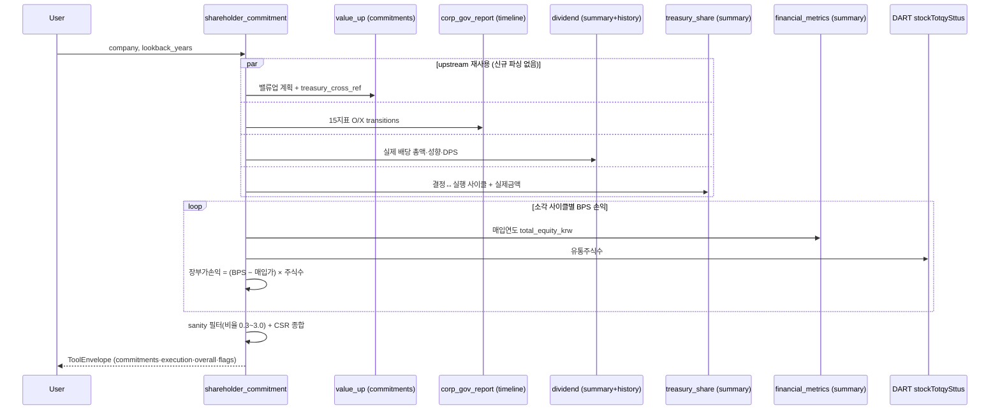

# shareholder_commitment

## 한 줄 요약
밸류업 계획·배당·자사주 소각의 **약속 vs 실제 이행**을 연중 추적하는 Action Tool. `proxy_advise_before_meeting`이
주총이라는 1회성 이벤트의 판단이라면, 이 tool은 주총과 무관하게 스튜어드십/기관투자자 관여(engagement)
관점에서 "작년에 공표한 계획을 실제로 지켰나"를 본다. 자사주 소각 사이클마다 **매입시점 BPS 대비 실제
매입가**를 비교해 장부가(BPS) 기준 손익을 원화로 계산한다(내재가치 판단은 하지 않음, 장부가 사실만).

## 사용법
```
shareholder_commitment(company="미래에셋증권", lookback_years=3)
```
자연어 예시:
- "이 회사 작년에 공표한 밸류업 계획 실제로 지켰나?"
- "최근 3년간 자사주 소각으로 장부가 기준 얼마나 벌었나?"
- "이 회사 배당·소각 합친 주주환원율 얼마야?"

## 입력 인자
| 인자 | 타입 | 필수 | 설명 | 기본값 |
|---|---|---|---|---|
| company | str | yes | 회사명 / ticker / corp_code | - |
| lookback_years | int | no | 조회 기간(년) | 3 |
| format | str | no | "md" / "json" | "md" |

## Flow



## 신규 계산 로직 — 자사주 소각 장부가(BPS) 손익
기존 4개 tool 어디에도 없던 유일한 신규 로직(나머지는 전부 기존 tool 재사용):
```
장부가손익(KRW) = (매입시점 BPS − 가중평균 매입가) × 매입주식수
가중평균 매입가 = actual_amount_krw ÷ cumulative_shares   (treasury_share, 260707 원문단위버그 수정 완료)
매입시점 BPS    = total_equity_krw(financial_metrics 그 연도) ÷ shares_total(DART stockTotqySttus)
```
- **대상**: `for_cancelation=true`로 표시된 취득결정에 매칭된 실행결과(`acquisition_result`)만.
- **배당은 이 계산에서 제외**한다 — 방향이 반대다. 배당은 자본만 줄고 주식수는 그대로라 BPS가
  오히려 내려간다. 자사주 소각과 섞으면 부정확하다.
- **⚠ 한계**: `total_equity_krw`는 financial_metrics summary가 주는 총자본이라 비지배지분(NCI)이
  섞여있을 수 있음 — `financial_metrics.bps_krw` 필드는 실측 결과 항상 None(미구현, "Phase 2" 주석)
  이라 이 근사치를 씀. 순수 지배지분 분리(`_ctrl_equity`, valuation.py 방식)로 정밀화는 TODO.
- **sanity 필터**: `actual_amount_krw / decision.amount_krw` 비율이 0.3~3.0 밖이면 그 사이클을 계산에서
  제외하고 `data_quality_flags`에 남긴다. `treasury_share`의 결정↔실행 사이클 매칭(`_link_cycles`)에
  오탐이 남아 있어(관측된 건은 전부 `disposal_result`) 조용히 틀린 값을 내지 않기 위한 방어다.
  이 tool은 `acquisition_result`만 쓰므로 **실전 발동 사례는 아직 없다** — 안전장치이지 상시 경로가
  아니다.

## 주주환원 종합(overall) — 배당 포함
CSR(현금환원율) 공식은 새로 만들지 않고 `director_performance.py`의 기존 공식을 그대로 재사용:
```
CSR% = (배당총액 + 자사주소각금액) ÷ 순이익 × 100
```
단 배당은 **최근 확정 사업연도 스냅샷**(dividend.summary), 소각금액은 **조회 lookback 기간 누적**
(treasury_share.summary)이라 서로 다른 기간 기준 — `overall.period_note`에 명시. 엄밀한 다년 합산이
아닌 참고용 종합.

## 배당수익률 — 연말종가 기준 보완
`dividend.history`의 `yield_pct`(DART 자체 결의시점 시가배당률)는 **옛 연도일수록 결측이 많음**을
실측 확인(미래에셋증권·현대차·SKC 전부 2021·2022년 None, 2023년부터만 값 있음 — DART alotMatter의
과거 공시 특성). `krx_weekly`(연말종가, `valuation.py`의 `_annual_pit_band`와 동일 쿼리 패턴)로
`DPS ÷ 연말종가`를 직접 계산해 `yield_pct_yearend` 필드로 별도 노출 — 원본 `yield_pct`는 그대로
두고 공백만 메운다. 두 값은 **기준일이 다르므로**(결의시점 시가 vs 연말종가) 값이 다를 수 있음을
출력에 명시.

## 출력 schema (data dict)
```json
{
  "canonical_name": "...", "corp_code": "...", "lookback_years": 3,
  "commitments": {
    "latest_plan": {...}, "latest_status": {...},
    "treasury_cross_ref": {"cancelation_decision_count_24m": 1, "acquisition_count_24m": 2, ...}
  },
  "capital_return_execution": {
    "buyback_cycles": [
      {"rcept_no": "...", "period": "2025-08-29 ~ 2025-11-24", "shares_acquired": 4052192,
       "avg_acquisition_price_krw": 19767, "bps_at_acquisition_krw": 23175,
       "premium_discount_pct": -14.71, "book_value_gain_loss_krw": 13809568880,
       "note": "매입가가 BPS보다 쌈(장부가 기준 이득)"}
    ],
    "dividend_history": [{"year": 2025, "annual_dps": 300, "payout_ratio": 11.1,
                          "yield_pct": 0.4, "yield_pct_yearend": 1.31, ...}]
  },
  "governance_trend": {"transitions": [{"label": "...", "from_val": "X", "to_val": "O", "direction": "improved", ...}]},
  "overall": {"dividend_krw": ..., "buyback_cancelation_krw": ..., "cash_shareholder_return_pct": 41.0,
              "total_book_value_gain_loss_krw": ..., "period_note": "..."},
  "data_quality_flags": [],
  "usage": {"dart_api_calls": 35, "mcp_tool_calls": 1}
}
```

## Data sources (재사용 — 신규 파싱 없음)
| 소스 tool | scope | 쓰임 |
|---|---|---|
| `value_up` | `commitments` | 밸류업 계획 원문 + 기존 `treasury_cross_ref`(소각 약속 vs 24개월 실제) |
| `corp_gov_report` | `timeline` | 15개 지표 연도별 O/X 전환(`transitions`) |
| `dividend_disclosure` | `summary`, `history` | 실제 배당 총액·성향·연도별 DPS |
| `treasury_share` | `summary` | 결정↔실행 사이클 + 정확한 실제금액(260707 단위버그 수정) |
| `financial_metrics` | `summary`(과거연도) | `total_equity_krw` — BPS 분자 |
| DART `stockTotqySttus` | (client 직접) | 유통주식수 — BPS 분모(`valuation.py`의 `_shares_outstanding` 재사용) |

## upstream 호출 계약

- **조회 구간을 그대로 넘긴다.** `lookback_years`를 `value_up` 호출에 명시적으로 전달한다 — 기본값
  (최근 12개월 rolling)으로 부르면 2년 전 최초공시된 밸류업 계획이 「없음」으로 나온다.
- **upstream 의 `warnings` 와 진단 필드를 버리지 않는다.** `_data()` 헬퍼가 예외뿐 아니라 정상 응답의
  `warnings` 도 그대로 전파하고, `value_up` 의 `availability_status`(`exists_outside_requested_window`
  + `diagnostic_window`)를 명시적으로 확인해 「lookback_years 를 늘려 재조회」 경고를 붙인다.
  조합형 tool 이 upstream 신호를 조용히 삼키면 상류가 이미 알려 준 부재 사유가 사라진다.

## 알려진 issue + TODO
- `total_equity_krw`가 비지배지분 포함 근사치(정밀 지배지분 분리 TODO).
- `_link_cycles` 매칭 오탐(→ [[treasury_share]]) — sanity 필터로 회피만, 근본수정 아님.
- overall의 배당·소각 기간 불일치(스냅샷 vs 누적) — 다년 정밀 합산은 TODO.
- 다중기업 배치·포트폴리오 스캔 미지원(단일기업 조회만).

## 관련
- [[proxy_advise_before_meeting]] — 유일한 다른 Action Tool, 주총 1회성 판단 vs 이 tool의 연중 추적
- [[value_up]] / [[corp_gov_report]] / [[dividend_disclosure]] / [[treasury_share]] — upstream 재사용 tool 4종
- [[financial_metrics]] — BPS 분자(총자본) 소스
