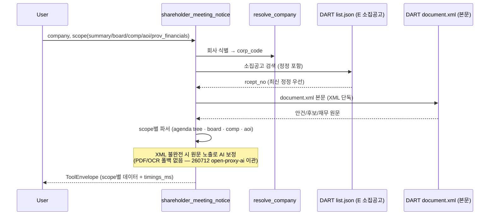

# shareholder_meeting_notice

주총 **소집공고** 공시 데이터 (사전 — DART API/XML). 빠르고 안정 (0.5-1.5s). 2026-05-24부터 summary 기본 응답은 경량화하고, stage별 `timings_ms`를 노출한다. 2026-05-25 KOSPI300 재검증에서 정기 소집공고가 현재 DART에 없는 2건을 제외하고 `requires_review` 0을 확인했다.

## 분리 배경 (2026-05-04)

기존 `shareholder_meeting` tool은 DART API + KIND scraping 두 source를 한 데에 묶었음:
- **notice scopes** (DART, 0.5-1.5s, 안정적): summary/agenda/board/compensation/aoi_change
- **results scope** (KIND, 4.9s, fragile): 결과 의결 결과

→ proxy_advise_before / proxy_result_after 분리 패턴과 consistency. KIND fragile 부분 격리. Claude.ai 동적 tool loading 부담 감소.

## scope (5, 260506 정리)

| scope | 데이터 | 시간 |
|---|---|---|
| `summary` (default) | 메타 + 정정공시 cover + **안건 hierarchy (number+title+children)** + **1호 안건 메타 (회기/사업연도/배당 예정액)**. 긴 전자투표/온라인중계 안내문은 기본 제외. | 0.5s |
| `board` | 이사·감사 후보 + 경력 (raw) | 0.5s |
| `compensation` | 보수한도 안건 + 소진율 | 0.5s |
| `aoi_change` | 정관변경 (변경 전/후/사유) **+ 퇴직금 변경 raw** (260505 통합) | 0.5s |
| `prov_financials` (NEW 260506) | 잠정 재무제표 4 quadrant raw — consolidated/separate × balance_sheet/income_statement + flat metrics | 0.5s |

### 폐지된 scope (260506)

- `agenda` — summary에 hierarchy 통합 (silent fallback to summary)
- `full` — 병렬 wrapper, 거의 사용 X. 종합 분석은 `proxy_advise_before_meeting` 호출 (silent fallback to summary)

### 제거된 필드 (시점 분리)

- `result_status` / `result_reference` — 사후 정보, `shareholder_meeting_results` tool 참조

## Flow



## source

- DART OpenAPI `list.json` 검색 + 상세 (`fnlttSinglAcnt` 등 X — XML 직접 파싱)
- DART XML 본문 (rcept_no → viewer_url)
- 정정공시 자동 선택 (rcept_no rank — 최신 정정 우선)

## 성능/디버깅 옵션 (2026-05-24)

| 옵션/필드 | 의미 |
|---|---|
| `include_coverage=false` (default) | 명시적 `annual`/`extraordinary` 조회에서 최근 12개월 정기/임시 coverage 재검색을 생략. 정기/임시 판별은 선택된 소집공고 본문으로 계속 수행. |
| `include_coverage=true` | `meeting_coverage_12m`를 추가 계산. 최근 정기/임시 주총 존재 여부가 필요한 경우에만 사용. |
| `rcept_no` | 이미 소집공고 접수번호를 알면 회사 식별/후보 검색을 건너뛰고 해당 원문을 직접 파싱. 리포트 재현과 timeout fallback에 유용. |
| `fiscal_month` | `annual` + `year` 조회에서 OpenDART `company.json.acc_mt` 결산월을 읽어 정기주총 후보 window를 먼저 좁힘. fiscal window에서는 최신 후보 1건만 먼저 열고, 정기 매칭 실패 시 나머지 후보와 full-year 검색으로 fallback. |
| `data.timings_ms` | `resolve_company`, `fiscal_month_lookup`, `select_notice_candidate`, `select_notice_candidate.search_filings`, `select_notice_candidate.fetch_top_documents`, `select_notice_candidate.parse_top_documents`, `select_notice_candidate.filter_meeting_window`, `select_notice_candidate.build_candidate`, `select_notice_candidate.full_year_fallback`, `coverage_search`, `load_notice_bundle`, `total` 등 stage별 소요 시간(ms). 병목 원인 확인용. |

## 파싱 정확도 / relation metadata (2026-05-25)

- agenda node는 `proposer_type`, `agenda_relation_type`, `agenda_relation_reasons`를 포함한다.
- `agenda_relation_type`: `normal`, `procedural`, `conditional`, `alternative`, `cumulative_related`.
- **정기/임시 판별**(`detect_meeting_type`)은 본문의 `주주총회 소집공고` 표기에 붙은 종류표기
  (`(제N기 정기|임시)` · `(YYYY년 정기|임시)` · `(정기|임시주주총회)`)를 앵커로 읽는다. **제목과
  본문에 정기/임시를 다르게 적은 모순 공시가 실제로 있다** — `detect_meeting_type_conflict(text)`
  가 이를 감지해 `parse_meeting_info_xml` 의 `meeting_type_conflict` 플래그로 노출한다. detect 는
  제목을 우선해 한 값을 주되, 플래그가 뜨면 안건(재무제표 승인 여부 등)으로 **수동 확인**이 필요하다.
- 마침표형 안건 marker(`제N호 의안.`), 후보자 표 boundary, `4. 목적사항` 정정공고형 목록, `※` 주석 뒤 안건 경계를 지원한다.
- **안건 marker·zone 표기는 회사마다 갈린다.** 닫는괄호형(`제N호 의안) …`)·각주마커형
  (`제N호 의안* :`)·하이픈 하위번호(`제1-1호 …의 건`) 같은 번호 표기 변형과, 「목적사항」 절
  제목의 변형(`회의 및 목적사항`·`가. 목적사항`·자간이 벌어진 `부 의 안 건` 등)을 함께 흡수한다.
  제목에 표·다음 절이 딸려오는 것은 경계로 끊고, 군더더기 부호는 정리하되 `[현금배당 200원]` 처럼
  짝이 맞는 부속 괄호는 보존한다.
- **인라인 하위안건 분리** — 부모 제목에 `N-M …의 건` 이 통째로 뭉쳐 온 경우 별도 하위노드로 가르고
  부모 제목은 첫 하위번호 앞까지 자른다. 이미 별도로 파싱된 정상 `제N-M호` 다단 계층은 건드리지
  않는다. 부모가 제목 없이 하위번호로만 구성되면 하위 공통 안건유형으로 부모 제목을 추론한다.
- **제안주체(proposer)** — 안건 node 의 `source`(제안주체)는 의결권 분석에 직결된다. marker 괄호
  태그(`제N호 의안(주주제안) :`)와 zone 그룹헤더(`제N-M호 [주주제안]`) 두 형태를 읽어 하위안건까지
  전파하되, **이미 값이 잡힌 안건은 덮지 않는다**. 「주주제안**권**」(권리 설명)·「주주제안 인입
  보고」(보고사항)·「주주제안에 따른 이사회 결의」(해임 사유문구)는 안건의 제안주체가 아니므로
  잡지 않는다 — 여기서 오분류하면 이사회안이 주주제안으로 둔갑한다.
- **미커버**: ①②·가나다 등 비표준 번호 양식은 안건 0개로 남는다. 소스 자체에 번호 공백이 있는
  공시(번호 점프)는 정상 분류다.
- `annual` 조회에서 정기 소집공고가 아직 없으면 결산월과 예상 정기주총 window를 warning에 표시한다.

## 사용 예

```
"삼성전자 다음 주총 안건 알려줘"
"LG화학 사외이사 후보 명단"
"카카오 보수한도 인상률 정보"
"현대차 정관변경 변경 전/후 비교"
"LG화학 주총소집공고 rcept_no=20260224004273으로 다시 파싱해줘"
```

## 변경 이력

- 2026-08-06: 파싱 기법 상세·census·검증 프로토콜을 private storage 로 이관(경계 규칙 [[wiki_schema]] 0.0).
- 2026-07-27: **하위안건 4번째 그물 + 구간 원문 통째 반환 + 상법 §449조의2 표결 유무.**
  ① 「제1-1호 사내이사 선임의 건」처럼 번호 뒤에 콜론도 '의안'도 없는 표기를 기존 정규식 3종이
  모두 놓쳐 후보자별 판단이 불가능했다(하림지주 이사·감사위원 후보 5명 소실). 하이픈 번호로
  한정한다 — 홑번호까지 열면 「제5호에 따라」 같은 본문 참조를 안건으로 오인한다. 캐시 전수
  416건: 신규 61안건 · 소실 0.
  ② `agenda_detail_sections` 신설 — '주주총회 목적사항별 기재사항' 구간을 `{code, kind, heading,
  text, chars, truncated}`로 라벨 달아 원문 그대로 반환한다. 안건↔구간을 짝지어 주지 않는 대신
  어느 구간도 버리지 않는다(표 파싱이 실패하면 통째로 사라지던 주주제안 후보 명단·자기주식
  처분계획·퇴직금 규정 지급률이 살아난다). 분량의 85.3%가 '재무제표의 승인' 하나(중앙
  17,452자·최대 313,847자)이고 그 수치는 `financial_metrics`가 정본이므로 머리 2,500자만 남긴다
  → 전건 예산 내(중앙 8,936자·최대 21,190자). 합병 12-0·분할 13-0은 계획서 전문이 판단 근거라
  20,000자.
  ③ 안건 노드에 `filed_code`/`filed_kind`/`filed_link`/`declared_role`/`resolution_status` 부착.
  구간 코드는 문서가 「제4호 의안 :」이라 밝힌 경우만 `declared`이고, 없으면 후보이름→제목겹침→
  유형대응으로 추론하되 `filed_link`로 추론임을 밝힌다(선언을 가린 홀드아웃 93.3%·부착률 98.8%,
  확정 못 하면 안 붙인다 — 틀린 코드는 코드 없는 것보다 나쁘다).
  ④ 상법 §449조의2로 재무제표가 이사회 승인으로 갈음돼 표결하지 않는 안건에 🚫 표시. 조건부
  (「충족될 경우」)와 확정(「충족되어」)을 **문장 단위**로 가른다 — 한국어는 조건 어미가 문장
  전체를 지배해 조각 매칭은 6건을 오판했다. 부착은 번호가 아니라 안건의 정체로 게이트한다
  (정정공고에서 번호가 재배치되면 문면의 「제1호」가 지금의 제1호를 안 가리킨다).
  · 검증: 라이브 200건(기본 100 + scope 5종) 크래시 0 · 구간 원문 100/100 · 하위안건 99/100.

## ref

- 주총 결과 의결: [[shareholder_meeting_results]]
- 종합 분석 (안건별 FOR/AGAINST): [[proxy_advise_before_meeting]]
- 후보 평가 (사용자 노출 X — proxy_advise chain): director_evaluation (services internal)
- 지분 구조: [[ownership_structure]]
- 분쟁 맥락: [[proxy_contest]]
- 안건 파서 전수감사 기록(KOSPI300·시장 전체): private storage `wiki-private/architecture/audits/`
- 검증 회고 (측정 함정 5패턴·프로토콜): agenda-parser-validation-260621
