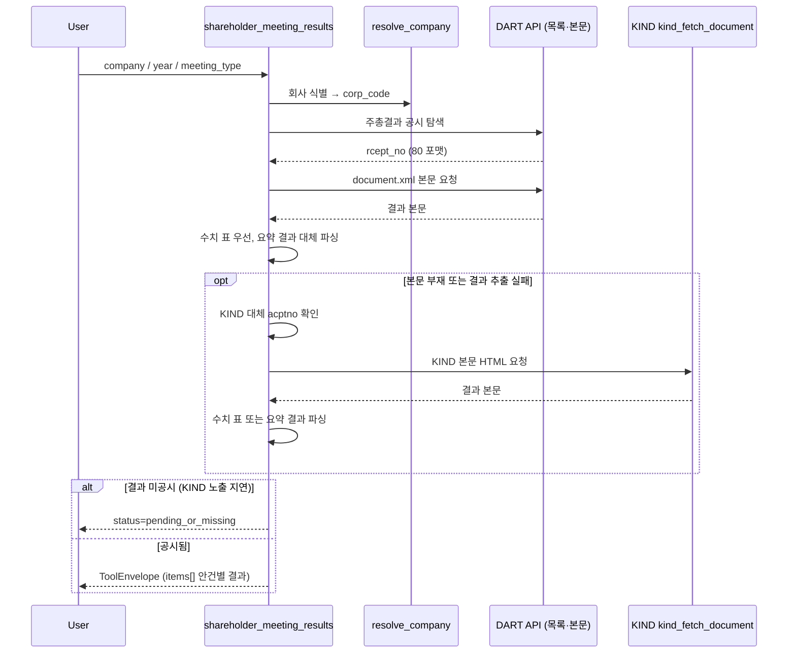

# shareholder_meeting_results

주총 **의결 결과** 공시 (사후). DART API 본문 우선, 추출 실패 시 KIND fallback. 안건별 결과와 추출 가능한 찬반율을 제공한다. 요약형에는 비율이 없을 수 있으며 빈 값은 0이 아니다.

## 분리 배경 (2026-05-04)

사전 소집공고와 사후 결과를 별도 도구로 제공한다. 현재 결과 조회는 DART 본문을 먼저 읽고, 본문 부재·파싱 실패 시 KIND 웹 스크래핑으로 대체한다.

## scope

`results` 단일 (param 자체 없음):

| 필드 | 의미 |
|---|---|
| `result_format` | "table" / "summary" |
| `numerical_vote_table_available` | 수치 표 추출 여부 (`table`이면 True). 개별 비율의 존재까지 보장하지 않음 |
| `items[]` | 안건별 결과 |
| - `agenda` | 안건명 |
| - `resolution_type` | 보통결의 / 특별결의 / 보고 |
| - `passed` | 가결 / 부결 / 보고완료 |
| - `approval_rate_issued` | 발행주식수 기준 찬성률 |
| - `approval_rate_voted` | 출석주식수 기준 찬성률 |
| - `opposition_rate` | 반대율 |

## Flow



## source

- DART `get_document_cached(rcept_no)` 본문을 우선 파싱 (`source=dart_api`)
- 안건 결과를 추출하지 못하면 KIND acptno(80→00 whitelist)를 사용해 `kind_fetch_document`로 대체 (`source=kind_scraping`)
- 수치 표가 없으면 요약 결과를 추출 (`result_format=summary`), 찬반율은 빈 값으로 유지
- 결과 미공시 (가결 후 KIND 노출 지연) 시 status=pending_or_missing

## 사용 예

```
"삼성전자 2026 정기주총 결과"
"LG화학 안건별 찬반율"
"이번 주총에서 안건들 다 통과됐어? 부결된 안건 있어?"
"고려아연 임시주총 의결 결과"
```

## 변경 이력

- 2026-09-05: 출처를 DART 우선·KIND 대체로 정정하고 실제 `table`/`summary` 형식과 비율 누락 의미를 문서화.

## ref

- 사전 안건/후보: [[shareholder_meeting_notice]]
- 후속 공시(배당/자사주/구조 등)는 dividend_disclosure·treasury_share 등 각 tool 직접 호출 (proxy_result_after_meeting은 2026-06-13 archive)
- 원문: [[evidence]]
